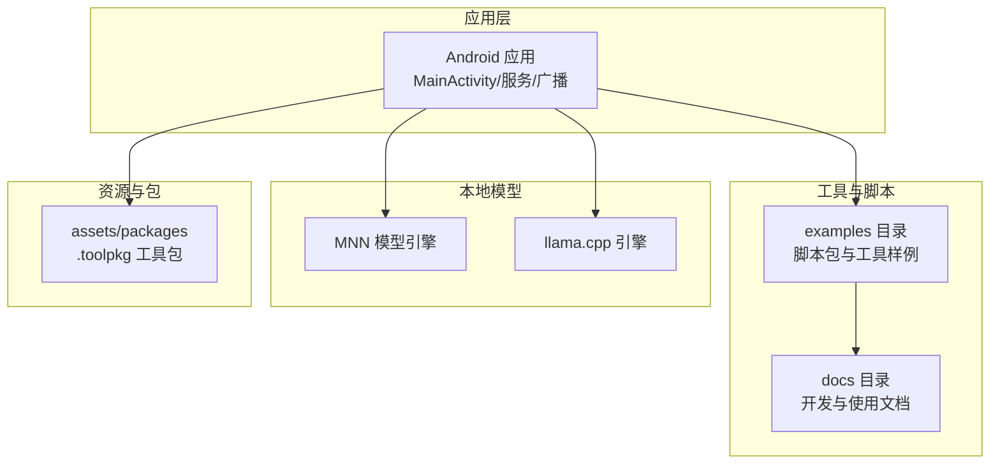
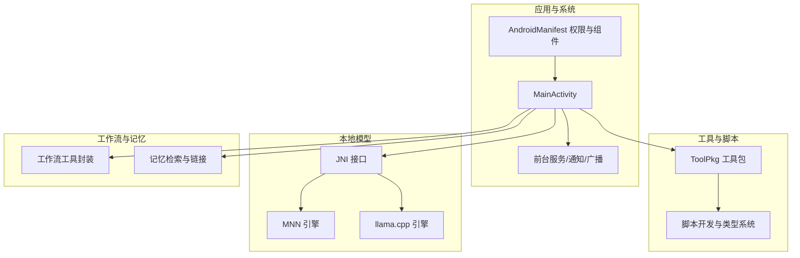
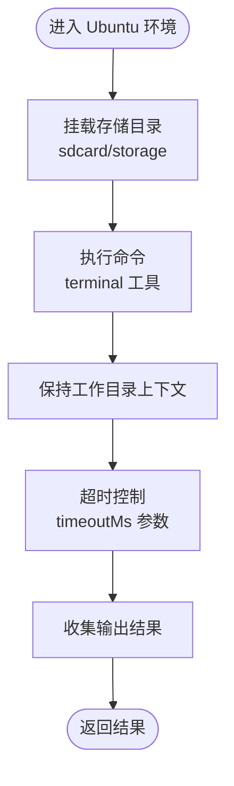
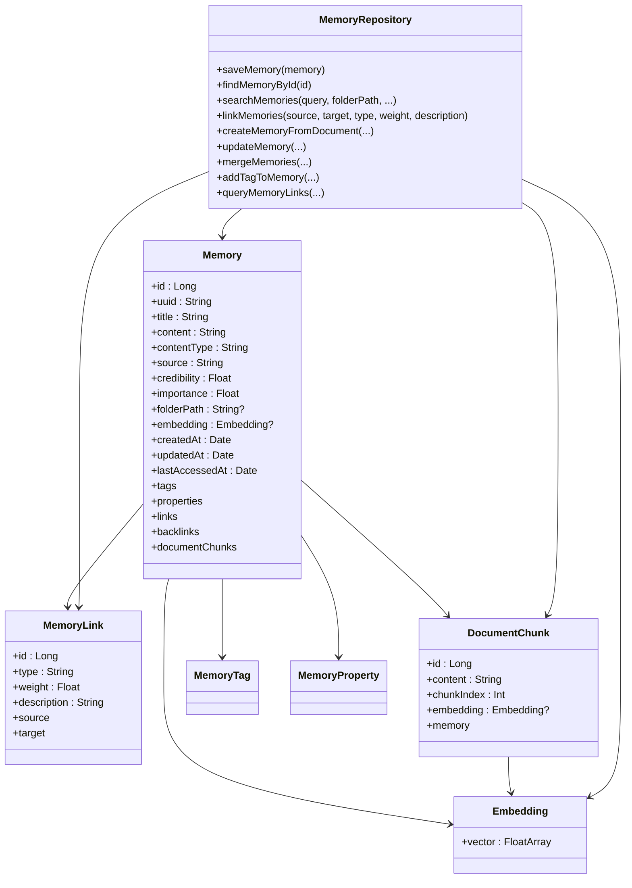
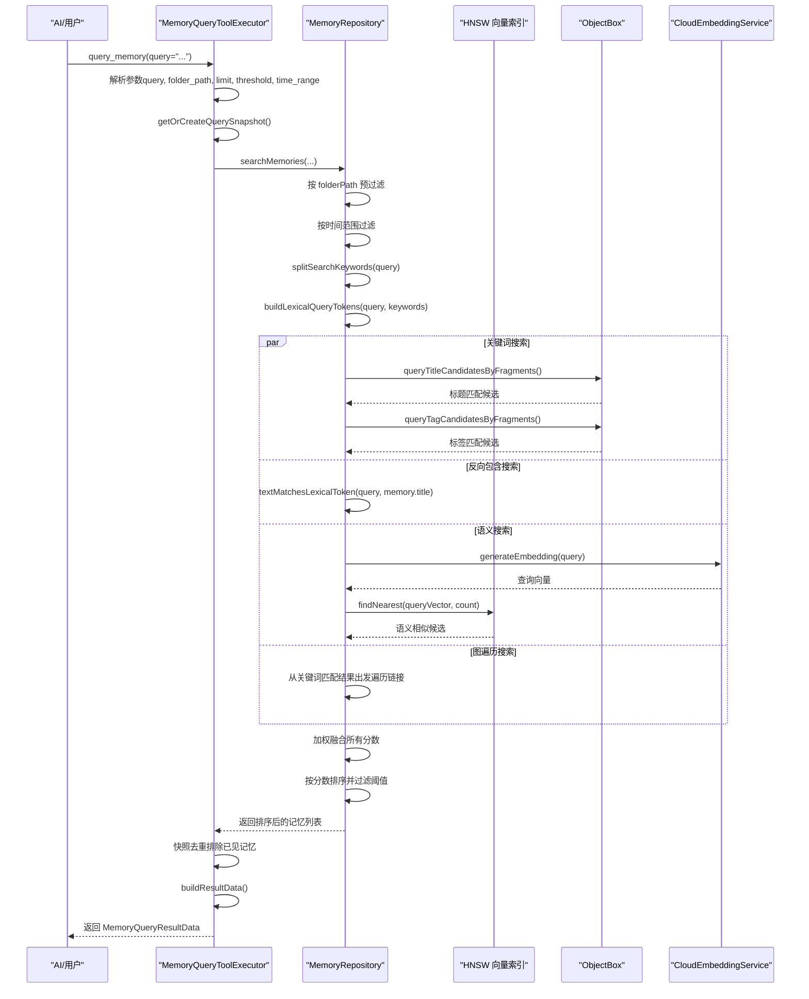
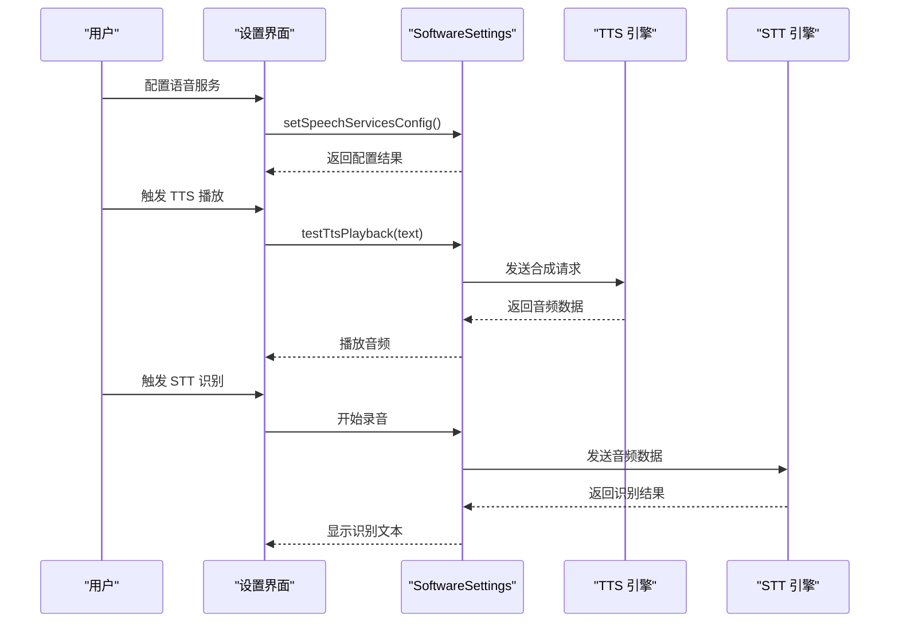
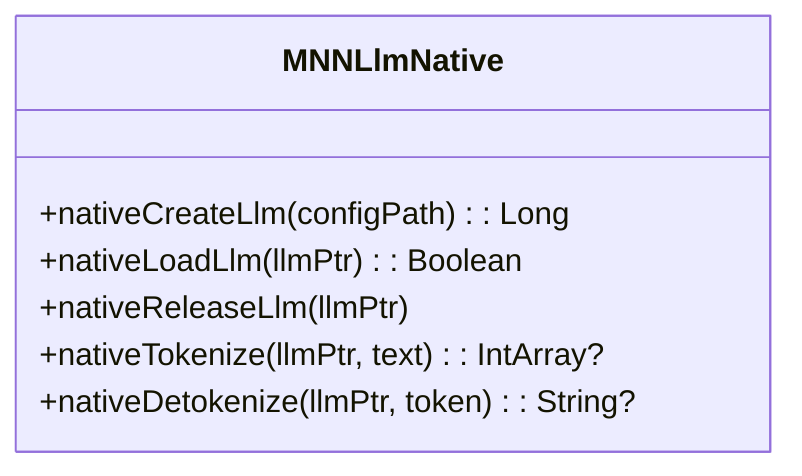
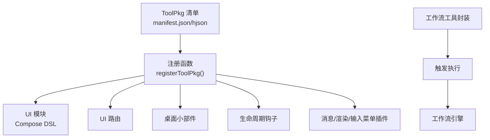
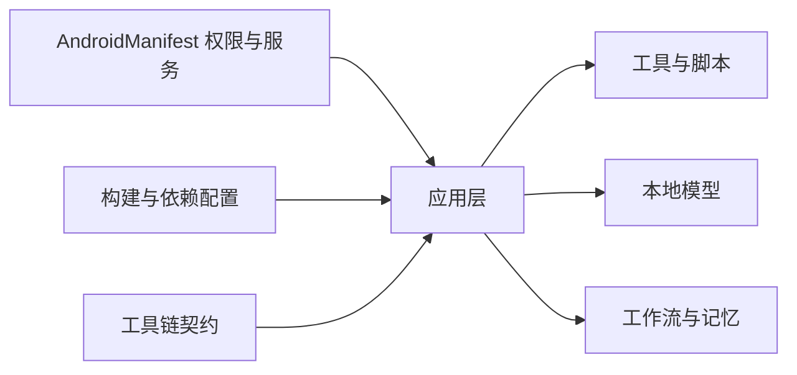

# 核心功能特性

<cite>
**本文引用的文件**
- [README.md](file://README.md)
- [AndroidManifest.xml](file://app/src/main/AndroidManifest.xml)
- [BUILDING.md](file://docs/BUILDING.md)
- [DEFAULT_TOOLS_ARCH.md](file://docs/DEFAULT_TOOLS_ARCH.md)
- [TOOLPKG_FORMAT_GUIDE.md](file://docs/TOOLPKG_FORMAT_GUIDE.md)
- [SCRIPT_DEV_GUIDE.md](file://docs/SCRIPT_DEV_GUIDE.md)
- [CONTRIBUTING.md](file://docs/CONTRIBUTING.md)
- [super_admin.js](file://examples/super_admin.js)
- [operit_editor.js](file://examples/operit_editor.js)
- [workflow.js](file://examples/workflow.js)
- [MNNLlmNative.kt](file://mnn/src/main/java/com/ai/assistance/mnn/MNNLlmNative.kt)
</cite>

## 目录
1. [简介](#简介)
2. [项目结构](#项目结构)
3. [核心组件](#核心组件)
4. [架构总览](#架构总览)
5. [详细组件分析](#详细组件分析)
6. [依赖关系分析](#依赖关系分析)
7. [性能考量](#性能考量)
8. [故障排查指南](#故障排查指南)
9. [结论](#结论)
10. [附录](#附录)

## 简介
Operit AI 是一款移动端首个功能完备的 AI 智能助手应用，具备完全独立运行能力、强大的工具调用能力、深度搜索、工作流与自动化、智能记忆库、人设定制与角色卡系统，以及内置 Ubuntu 24 环境。应用支持 MNN/llama.cpp 本地模型、MCP/Skill 生态与多语言界面，提供 40+ 内置工具，覆盖 Linux 环境、文件系统、网络工具、系统操作、媒体处理、开发与终端、AI 创作、搜索引擎等类别，并提供工具包与工作流系统、角色卡系统等个性化定制能力。

## 项目结构
Operit 项目采用 Android 应用与多模块协同的组织方式，核心模块包括：
- 应用层：Android 应用工程，负责 UI、系统集成与前台服务
- 工具与脚本：examples 目录提供大量脚本包与工具样例，支持 TypeScript/JavaScript 开发
- 文档与指南：docs 目录提供构建、脚本开发、工具包格式等文档
- 本地模型：mnn、llama.cpp 等本地推理引擎模块
- 资源与包：assets/packages 中包含打包后的工具包

**图表来源**
- [AndroidManifest.xml:196-320](file://app/src/main/AndroidManifest.xml#L196-L320)
- [TOOLPKG_FORMAT_GUIDE.md:26-60](file://docs/TOOLPKG_FORMAT_GUIDE.md#L26-L60)

**章节来源**
- [README.md:39-75](file://README.md#L39-L75)
- [AndroidManifest.xml:1-513](file://app/src/main/AndroidManifest.xml#L1-L513)

## 核心组件
- Ubuntu 24 环境：内置完整 Ubuntu 系统，支持 apt、Python/Node.js、vim 等工具，提供 chroot/ssh/终端等能力
- 智能记忆系统：自动分类管理记忆，支持时间查询/导入导出/自动总结，多模态搜索（关键词/反向包含/语义/图链接）
- 语音交互：本地/云端 TTS + 本地 STT，支持自定义音色、语音/特定音频唤醒、自动朗读
- 本地 AI 模型：MNN/llama.cpp 本地模型（GGUF），完全离线运行，保护隐私数据
- 工具包与工作流：ToolPkg 格式、工作流模板与触发机制，支持定时/语音唤醒触发
- 角色卡系统：角色卡导入导出（酒馆/JSON）、备份、二维码分享，支持角色卡互聊与独立对话历史

**章节来源**
- [README.md:45-75](file://README.md#L45-L75)
- [super_admin.js:11-16](file://examples/super_admin.js#L11-L16)
- [operit_editor.js:174-2949](file://examples/operit_editor.js#L174-L2949)
- [MNNLlmNative.kt:1-53](file://mnn/src/main/java/com/ai/assistance/mnn/MNNLlmNative.kt#L1-L53)

## 架构总览
Operit 的系统架构围绕“工具调用 + 本地模型 + 工作流 + 记忆系统 + 语音交互”展开，应用通过 AndroidManifest 声明权限与服务，工具与脚本通过 ToolPkg 格式分发，本地模型通过 JNI 接口调用，工作流通过工具封装触发，记忆系统提供检索与链接。

**图表来源**
- [AndroidManifest.xml:196-320](file://app/src/main/AndroidManifest.xml#L196-L320)
- [TOOLPKG_FORMAT_GUIDE.md:26-60](file://docs/TOOLPKG_FORMAT_GUIDE.md#L26-L60)
- [SCRIPT_DEV_GUIDE.md:1-120](file://docs/SCRIPT_DEV_GUIDE.md#L1-L120)
- [MNNLlmNative.kt:1-53](file://mnn/src/main/java/com/ai/assistance/mnn/MNNLlmNative.kt#L1-L53)

## 详细组件分析

### Ubuntu 24 环境
- 技术实现：内置完整 Ubuntu 系统，提供 apt 包管理、Python/Node.js 运行环境、vim 等工具，支持 chroot/ssh/终端会话，命令执行上下文连贯
- 使用场景：在手机上运行复杂的 Linux 命令与自动化任务，结合文件系统与网络工具实现端侧开发与运维
- 实际价值：极大扩展了移动端的可编程能力，降低对外部环境的依赖

**图表来源**
- [super_admin.js:11-16](file://examples/super_admin.js#L11-L16)

**章节来源**
- [super_admin.js:11-16](file://examples/super_admin.js#L11-L16)
- [README.md:85-86](file://README.md#L85-L86)

### 智能记忆系统
- 技术实现：记忆库包含 MemoryRepository、Memory、MemoryLink、DocumentChunk、Embedding 等实体，支持关键词/反向包含/语义/HNSW 向量索引/图链接的多模态融合检索
- 使用场景：自动分类记忆、时间范围查询、导入导出、附件记忆、角色卡独立历史
- 实际价值：提供个性化服务，提升对话连贯性与知识复用效率

**图表来源**
- [my_docs/Operit 记忆管理系统设计思想与详细流程分析.md:82-195](file://my_docs/Operit 记忆管理系统设计思想与详细流程分析.md#L82-L195)

**图表来源**
- [my_docs/Operit 记忆管理系统设计思想与详细流程分析.md:318-361](file://my_docs/Operit 记忆管理系统设计思想与详细流程分析.md#L318-L361)

**章节来源**
- [my_docs/Operit 记忆管理系统设计思想与详细流程分析.md:82-361](file://my_docs/Operit 记忆管理系统设计思想与详细流程分析.md#L82-L361)

### 语音交互
- 技术实现：支持多种 TTS/STT 引擎（系统 TTS、HTTP_TTS、WebSocket TTS、ONNX_TTS 等），通过 SoftwareSettings 配置与测试播放
- 使用场景：本地/云端 TTS + 本地 STT、自定义音色、语音/特定音频唤醒、自动朗读
- 实际价值：提供自然连续的对话体验，满足不同网络与隐私需求

**图表来源**
- [operit_editor.js:174-2949](file://examples/operit_editor.js#L174-L2949)

**章节来源**
- [operit_editor.js:174-2949](file://examples/operit_editor.js#L174-L2949)

### 本地 AI 模型
- 技术实现：MNN 与 llama.cpp 本地推理引擎，通过 JNI 接口创建/加载/释放 LLM 实例，支持 tokenize/detokenize 等基础能力
- 使用场景：完全离线运行 AI，保护隐私数据，支持 GGUF 模型文件管理与转换
- 实际价值：在无网络或隐私敏感场景下提供强大推理能力

**图表来源**
- [MNNLlmNative.kt:1-53](file://mnn/src/main/java/com/ai/assistance/mnn/MNNLlmNative.kt#L1-L53)

**章节来源**
- [MNNLlmNative.kt:1-53](file://mnn/src/main/java/com/ai/assistance/mnn/MNNLlmNative.kt#L1-L53)

### 工具包与工作流系统
- 工具包（ToolPkg）：标准 ZIP 格式，包含清单文件与资源，支持子包、UI 模块、多语言、工作流模板与工作区模板
- 工作流：通过工具封装触发执行，支持定时/语音唤醒触发，提供 CRUD 与触发接口
- 架构设计：清单驱动、注册函数、UI 路由、桌面小部件、生命周期钩子、消息处理插件、XML 渲染插件、输入菜单开关插件

**图表来源**
- [TOOLPKG_FORMAT_GUIDE.md:26-135](file://docs/TOOLPKG_FORMAT_GUIDE.md#L26-L135)
- [workflow.js:491-545](file://examples/workflow.js#L491-L545)

**章节来源**
- [TOOLPKG_FORMAT_GUIDE.md:26-135](file://docs/TOOLPKG_FORMAT_GUIDE.md#L26-L135)
- [workflow.js:491-545](file://examples/workflow.js#L491-L545)

### 角色卡系统
- 功能：角色卡导入导出（酒馆/JSON）、备份、二维码分享、角色卡互聊、独立对话历史
- 价值：高度个性化定制，支持多角色并行对话与历史管理

**章节来源**
- [README.md:66-68](file://README.md#L66-L68)

## 依赖关系分析
- 权限与服务：AndroidManifest 声明网络、存储、前台服务、通知、语音交互、无障碍、ADB/Root 等权限与服务
- 构建与依赖：BUILDING.md 提供 Ubuntu/NDK/JDK 环境配置与依赖库下载说明
- 工具链契约：DEFAULT_TOOLS_ARCH.md 规范工具参数变更的同步范围（Schema/Prompt、注册、Kotlin 实现、JS 封装、示例与类型、打包资源、文档）

**图表来源**
- [AndroidManifest.xml:13-67](file://app/src/main/AndroidManifest.xml#L13-L67)
- [BUILDING.md:13-126](file://docs/BUILDING.md#L13-L126)
- [DEFAULT_TOOLS_ARCH.md:25-141](file://docs/DEFAULT_TOOLS_ARCH.md#L25-L141)

**章节来源**
- [AndroidManifest.xml:13-67](file://app/src/main/AndroidManifest.xml#L13-L67)
- [BUILDING.md:13-126](file://docs/BUILDING.md#L13-L126)
- [DEFAULT_TOOLS_ARCH.md:25-141](file://docs/DEFAULT_TOOLS_ARCH.md#L25-L141)

## 性能考量
- 并行执行：工具并行执行（只读工具）提升响应速度
- 本地模型：MNN/llama.cpp 本地推理减少网络延迟与隐私风险
- 记忆检索：多模态融合检索与向量索引优化搜索性能
- UI 与交互：Compose DSL UI、悬浮窗与主题系统优化用户体验

## 故障排查指南
- 构建问题：检查 JDK/NDK/SDK 版本与许可证接受、依赖库下载、web-chat 前端构建与 ToolPkg 同步
- 工具参数变更：遵循 DEFAULT_TOOLS_ARCH.md 的 Checklist，确保 Schema/Prompt、注册、Kotlin 实现、JS 封装、示例与类型、打包资源、文档同步更新
- 语音服务：确认 SoftwareSettings 配置正确，测试 TTS/STT 播放与识别
- 工作流触发：确认 workflow_id 正确，检查工具封装与触发接口

**章节来源**
- [BUILDING.md:254-266](file://docs/BUILDING.md#L254-L266)
- [DEFAULT_TOOLS_ARCH.md:157-189](file://docs/DEFAULT_TOOLS_ARCH.md#L157-L189)
- [operit_editor.js:174-2949](file://examples/operit_editor.js#L174-L2949)
- [workflow.js:491-545](file://examples/workflow.js#L491-L545)

## 结论
Operit AI 通过 Ubuntu 24 环境、智能记忆系统、语音交互、本地 AI 模型、工具包与工作流系统、角色卡系统等核心能力，构建了功能完备、可扩展、可定制的移动端 AI 智能助手。其工具链契约与文档体系保障了功能演进的稳定性与一致性，为开发者与用户提供了强大的端侧智能化能力。

## 附录
- 快速开始与系统要求：Android 8.0+，建议 4GB+ 内存，200MB+ 存储
- 安全提示：从官方 Release 页面或官方网站下载，避免未知渠道风险
- 开源共创：参考 CONTRIBUTING.md 与 BUILDING.md，遵循开发流程与代码风格

**章节来源**
- [README.md:174-185](file://README.md#L174-L185)
- [CONTRIBUTING.md:1-96](file://docs/CONTRIBUTING.md#L1-L96)
- [BUILDING.md:1-266](file://docs/BUILDING.md#L1-L266)