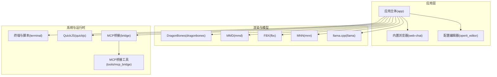
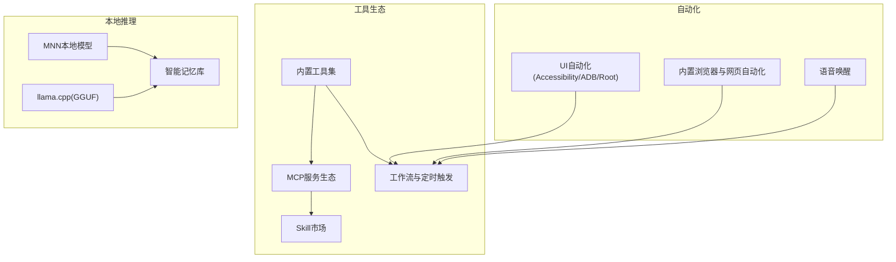
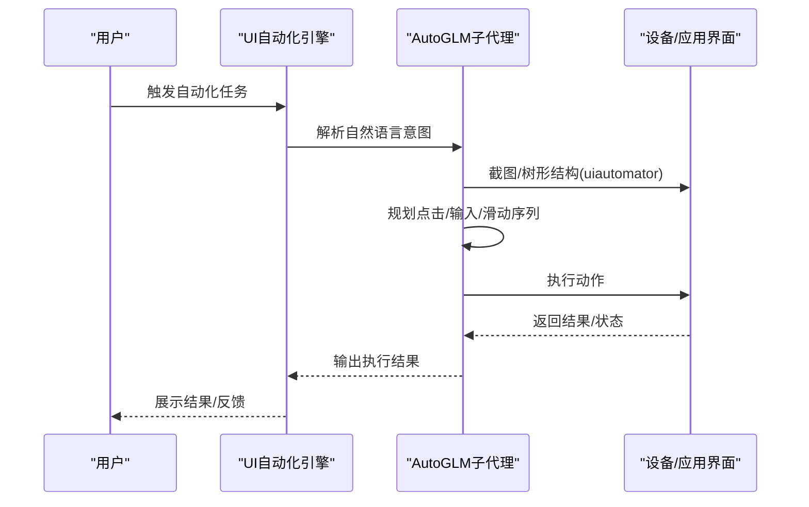
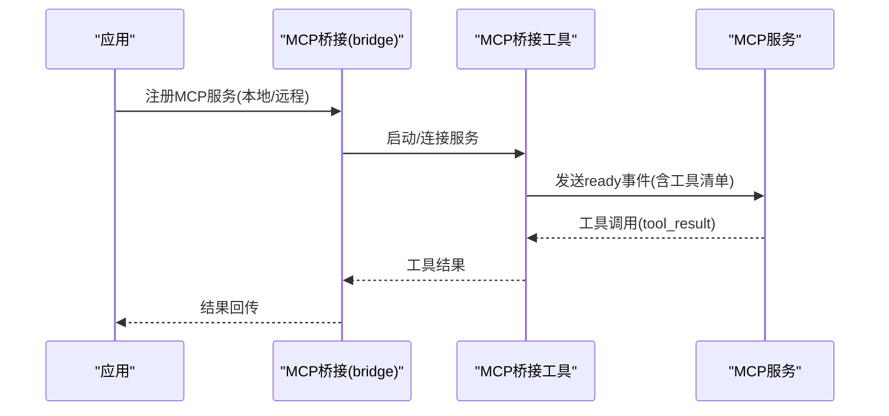
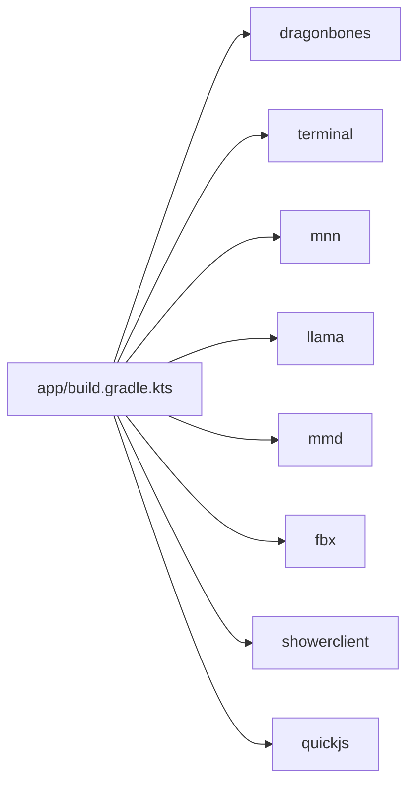

# 版本发展历程

<cite>
**本文引用的文件**
- [README.md](file://README.md)
- [README(E).md](file://README(E).md)
- [app/build.gradle.kts](file://app/build.gradle.kts)
- [gradle.properties](file://gradle.properties)
- [docs/BUILDING.md](file://docs/BUILDING.md)
- [app/src/main/assets/bridge/index.js](file://app/src/main/assets/bridge/index.js)
- [tools/mcp_bridge/index.ts](file://tools/mcp_bridge/index.ts)
- [examples/automatic_ui_subagent.js](file://examples/automatic_ui_subagent.js)
- [examples/operit_editor.js](file://examples/operit_editor.js)
- [app/src/main/assets/packages/operit_editor.js](file://app/src/main/assets/packages/operit_editor.js)
</cite>

## 目录
1. [引言](#引言)
2. [项目结构](#项目结构)
3. [核心组件](#核心组件)
4. [架构总览](#架构总览)
5. [详细组件分析](#详细组件分析)
6. [依赖关系分析](#依赖关系分析)
7. [性能考量](#性能考量)
8. [故障排查指南](#故障排查指南)
9. [结论](#结论)
10. [附录](#附录)

## 引言
本文件系统梳理 Operit AI 智能助手从 v1.0.0 至最新 v1.10.1 的完整版本演进历程，聚焦移动端网页自动操作、虚拟形象与界面定制、角色卡群聊与 AI 自配置、工作流系统、语音唤醒等里程碑功能的开发脉络，总结 UI 自动化与截图管线、MCP 与记忆库、工具与平台扩展等方面的架构演进，并给出版本选择与升级建议。

## 项目结构
Operit 采用多模块 Android 应用架构，核心模块包括：
- 应用主体模块：负责 UI、业务流程与系统集成
- 渲染与模型模块：DragonBones、MMD、FBX、MNN、llama.cpp 等
- 终端与脚本运行：内置 Ubuntu 24 环境与 QuickJS 运行时
- MCP 桥接与工具生态：MCP 服务桥接、工具包与工作流
- 示例与文档：示例脚本包、构建与开发指南

**图表来源**
- [app/build.gradle.kts:181-190](file://app/build.gradle.kts#L181-L190)
- [tools/mcp_bridge/index.ts:504-536](file://tools/mcp_bridge/index.ts#L504-L536)
- [app/src/main/assets/bridge/index.js:205-255](file://app/src/main/assets/bridge/index.js#L205-L255)

**章节来源**
- [README.md:174-186](file://README.md#L174-L186)
- [docs/BUILDING.md:1-266](file://docs/BUILDING.md#L1-L266)

## 核心组件
- 版本与构建元数据：通过 Gradle 配置维护版本号与构建类型，nightly 构建产物命名统一
- UI 自动化与截图管线：支持无障碍/ADB/Root 三种权限模式，虚拟屏幕与多显示器场景，UI Tree 双方案
- MCP 与记忆库：MCP 服务注册/注销、远程/本地连接、工具结果回调；记忆库自动分类与导入导出
- 工具与平台扩展：40+ 内置工具、MCP/Skill 市场、工作流与定时触发、语音唤醒触发
- 语音交互：本地/云端 TTS + 本地 STT、自定义音色、语音/特定音频唤醒、自动朗读
- 本地模型：MNN/llama.cpp（GGUF）本地推理，保护隐私数据

**章节来源**
- [app/build.gradle.kts:58-59](file://app/build.gradle.kts#L58-L59)
- [README.md:41-147](file://README.md#L41-L147)
- [README(E).md](file://README(E).md#L41-L147)

## 架构总览
Operit 的版本演进体现了“工具生态 + 自动化 + 本地推理”的三位一体架构：
- 工具生态：内置工具 + MCP/Skill 市场 + 工具包/工作流
- 自动化：UI 自动化（无障碍/ADB/Root）、网页自动化、语音唤醒
- 本地推理：MNN/llama.cpp 本地模型，配合记忆库与上下文管理

**图表来源**
- [README.md:41-147](file://README.md#L41-L147)
- [README(E).md](file://README(E).md#L41-L147)

## 详细组件分析

### 版本里程碑与功能演进
- v1.0.0：首个正式版本，基础 AI 对话与工具调用，集成 Shizuku/Root
- v1.1.x：MCP 协议支持、OCR 识别、悬浮窗、Gemini 完整支持
- v1.2.x：语音对话系统、知识库、DragonBones 动画支持
- v1.3.0：Web 开发功能、主题选择器、自定义 UI、Anthropic Claude 支持
- v1.4.0：并行工具执行、角色卡系统、角色选择器、PNG 角色卡导入
- v1.5.0：Ubuntu 24 终端完整集成、MCP 市场上线、桌面宠物、深度搜索模式
- v1.5.2：MCP 增强（uvx/npx 支持、启动加速）、工作区 Git ignore、相机拍照、HTML 渲染、正则过滤
- v1.6.0：MNN 本地模型支持、记忆库大更新（AI 自动分类、智能搜索、导入导出）、终端优化（vim 支持、进度条、自定义软件源）、Tasker 集成、桌面宠物、故事线标签
- v1.6.1：性能大优化（重做 UI 渲染，大幅提升流畅性）、AI 视觉增强（直接/间接识别）、终端 SSH（支持 SSH 连接与反向挂载手机文件系统）、自动总结机制、深度搜索、新授权系统
- v1.6.2：对话管理增强（长按开分支、历史记录分类显示、批量迁移）、模型配置优化（配置重命名、上下文绑定、谷歌原生搜索）、Bug 修复（界面切换、粗体换行、气泡模式）、crossref 学术论文检索包、代码编辑器升级
- v1.6.3：原生 ToolCall 支持（支持原生模型工具调用、DeepSeek 思考工具）、工作区与终端增强（新建时选择项目类型、SSH 文件系统连接、终端无障碍支持）、模型与消息显示（支持模型配置多选、消息显示模型名称与提供者）、优化与修复（优化悬浮窗、修复终端卡顿、迁移工作区到内部存储）
- v1.7.0：GUI 自动化里程碑（Autoglm + 虚拟屏幕）、自动化增强（一键 Autoglm 配置与单独执行器、虚拟屏开关逻辑与截图质量自定义）、交互增强（密钥非聚焦显示为星号、强制不允许 Autoglm 设置为主模型）、工具扩展（NanoBanana 绘图包、apply file 非覆盖支持、MNN STT 等）
- v1.7.1：Root 虚拟屏幕自动化（支持 root 启动虚拟屏幕，AutoGLM 并发多窗口任务）、Skill 生态（新增 Skill 协议与 Skill 市场，并支持 BETA 计划追踪 nightly）、交互增强（总结编辑、网页访问改悬浮窗模式、圈选识屏、对话锁定）、修复与优化（大图崩溃、ToolCall 错误、代码块换行、启动速度与虚拟屏稳定性）
- v1.8.0：工作流系统（支持计算/传入传出/执行等能力，并支持语音唤醒触发）、语音唤醒（直接进入语音对话模式，支持语音下关键词快速附件附着）、对话并行（支持对话并行处理，工具包 state 机制可动态决定工具）、新增与优化（记忆时间查询、自动备份、OpenAI 绘图/语音供应商、MCP 启动优化、终端 chroot、修复多项 BUG）
- v1.8.1：llama.cpp 本地推理（支持 GGUF 本地模型与相关工具）、工具与界面（图片搜索/下载、HTML 块预览、代码/思考块高度限制、气泡头像隐藏、Token 饼图、思考链折叠）、数据与备份（全局备份（排除 MCP/skill/终端/包）+ 角色卡备份/导出/分享、Skill 开关、密钥池导入/批量测试、工作区支持 SAF 绑定）、修复（AI 朗读回声录制、悬浮窗 Token 统计、角色编辑键盘遮挡、深搜 Token 爆炸、MCP 启动、工作流悬浮窗退出、表格截断、硅基流动语音打断）
- v1.9.0：移动端网页自动操作（新增网页操作能力，支持工作区 Web 项目 CORS 绕过访问外部网页）、Windows 终端操作（支持 Windows 命令操作，可控制 Codex 等 CLI，新增严格工具调用模式补充兼容性）、工具与系统扩展（新增 SQL 查看器、Android 工作区模板、OpenAI response 兼容供应商、skill 直接输入添加、统计饼图）、修复与优化（修复图片读取/上下文总结/特殊符号截断/ffmpeg 等问题，增强模型连通性测试输出与 MCP 加载提示）
- v1.9.1：稳定性修复（集中修复 1.9.0 多项问题，提升整体可用性与流畅性）、终端与工具调用（增强终端工具，修复交互 UI 卡住、严格工具调用历史工具报错、Windows 控制器 raw 命令执行问题）、MCP 与记忆库（修复远程 MCP 无法关闭，重做记忆库写入逻辑，支持外接向量模型并新增连接修改工具）、功能补充与界面修复（新增未绑定角色卡聊天记录删除、工作流批量删除与执行日志查看，修复输入法/暗色输入框/主题透明度/工具箱包管理等问题）
- v1.10.0：角色卡群聊与 AI 自配置（支持多个角色卡群聊与 @ 交互，新增 AI 自我设置能力，可辅助配置 MCP、Skill、STT、TTS 与模型参数）、主题与交互升级（新增分组折叠消息、气泡主题及字体/颜色/背景自定义、更宽气泡、输入框液态玻璃、长按图标直达设置/语音模式，以及助手形象与 MP4 虚拟形象支持）、工具与平台扩展（新增 Ollama、NVIDIA、OpenAI Response 通用模式，补充独立 SSH 插件工具包、Java Bridge、APKTool 插件、Web 自动化下载、Markdown 音视频渲染、xAI 视频生成、工作流取消、终端自定义按键与消息队列）、修复与性能优化（修复语音识别、记忆并发、悬浮窗交互、终端显示、Web 自动化全屏、MNN Tool Call 等问题，并优化记忆召回、市场搜索、工作区模板、grep 工具性能与 Agent 重试稳定性）
- v1.10.1：内置浏览器与网页自动化（大幅增强内置浏览器，支持标签页、历史、书签、权限、多窗口、最小化与视口控制，并补齐浏览器脚本的导入、安装、启停、存储与页面菜单能力）、虚拟形象与界面定制（支持 FBX 虚拟形象并升级 MMD 预览，新增液态玻璃主题效果，并增强侧边栏、聊天气泡与输入栏的外观自定义）、插件、工作区与上下文增强（支持通过配置编辑器调试和自动编写 Operit 插件，新增本地 HTTP 对话入口、工作区重命名与规则文件自动读取，并增强历史跳转、双向分页与上下文自动补充能力）、稳定性与性能优化（修复工具权限、HTTP TTS、SSH/tmux 长输出、历史跳转、GIF/公式/Markdown 渲染、MCP 配置与统计等问题，并持续优化对话链路、深度搜索、记忆系统、浏览器与包管理器）

**章节来源**
- [README.md:197-403](file://README.md#L197-L403)
- [README(E).md](file://README(E).md#L197-L403)

### UI 自动化与截图管线
- 权限模式：无障碍、ADB、Root 三通道，满足不同设备与场景需求
- 虚拟屏幕：支持 adb root 场景下的虚拟屏幕/多显示器（display 参数）
- UI Tree：AutoGLM + 本地 uiautomator dump 双方案
- 示例脚本：automatic_ui_subagent 提供高层 UI 自动化子代理，兼容 AutoGLM，支持独立 UI 控制器模型

**图表来源**
- [README.md:190-194](file://README.md#L190-L194)
- [examples/automatic_ui_subagent.js:1-34](file://examples/automatic_ui_subagent.js#L1-L34)

**章节来源**
- [README.md:190-194](file://README.md#L190-L194)
- [examples/automatic_ui_subagent.js:1-34](file://examples/automatic_ui_subagent.js#L1-L34)

### MCP 与记忆库
- MCP 服务注册与管理：支持本地/远程连接，命令行参数、工作目录、Bearer Token、自定义头部、环境变量等
- 工具结果回调：桥接层接收工具结果并通过 socket 回传给调用方
- 记忆库：自动分类管理记忆，支持时间查询/导入导出/自动总结，智能搜索历史对话

**图表来源**
- [app/src/main/assets/bridge/index.js:205-255](file://app/src/main/assets/bridge/index.js#L205-L255)
- [tools/mcp_bridge/index.ts:504-536](file://tools/mcp_bridge/index.ts#L504-L536)

**章节来源**
- [app/src/main/assets/bridge/index.js:205-255](file://app/src/main/assets/bridge/index.js#L205-L255)
- [tools/mcp_bridge/index.ts:504-536](file://tools/mcp_bridge/index.ts#L504-L536)

### 工具与平台扩展
- 工具包生态：40+ 内置工具 + MCP/Skill 市场插件 + 工具包/工作流
- 平台扩展：Tasker 集成、多模型支持（OpenAI、Claude、Gemini、百灵、OpenRouter、LMStudio）、权限系统、密钥池与统计、工作区绑定（SAF/SFTP/SSH）、自动点击 Agent（AutoGLM + UI Tree 双通道）、工具并行（只读工具并行执行）
- v1.10.0 新增：Ollama、NVIDIA、OpenAI Response 通用模式，独立 SSH 插件工具包、Java Bridge、APKTool 插件、Web 自动化下载、Markdown 音视频渲染、xAI 视频生成、工作流取消、终端自定义按键与消息队列

**章节来源**
- [README.md:112-125](file://README.md#L112-L125)
- [README(E).md](file://README(E).md#L112-L125)
- [README.md:217-221](file://README.md#L217-L221)

### 语音交互与唤醒
- 语音交互：连续自然对话，支持本地/云端 TTS + 本地 STT、自定义音色、语音/特定音频唤醒、自动朗读
- 语音唤醒：直接进入语音对话模式，支持语音下关键词快速附件附着

**章节来源**
- [README.md:57-59](file://README.md#L57-L59)
- [README(E).md](file://README(E).md#L57-L59)
- [README.md:261-265](file://README.md#L261-L265)

### 本地模型与隐私保护
- 本地模型：MNN/llama.cpp（GGUF）本地推理，完全离线运行 AI，保护隐私数据
- v1.8.1：llama.cpp 本地推理支持 GGUF 本地模型与相关工具

**章节来源**
- [README.md:63-65](file://README.md#L63-L65)
- [README(E).md](file://README(E).md#L63-L65)
- [README.md:249-255](file://README.md#L249-L255)

### 角色卡群聊与 AI 自配置
- 角色卡群聊：支持多个角色卡群聊与 @ 交互
- AI 自配置：可辅助配置 MCP、Skill、STT、TTS 与模型参数

**章节来源**
- [README.md:217-221](file://README.md#L217-L221)
- [README(E).md](file://README(E).md#L217-L221)

### 工作流系统与语音唤醒
- 工作流系统：支持计算/传入传出/执行等能力，并支持语音唤醒触发
- 语音唤醒：直接进入语音对话模式，支持语音下关键词快速附件附着

**章节来源**
- [README.md:261-265](file://README.md#L261-L265)
- [README(E).md](file://README(E).md#L261-L265)

## 依赖关系分析
- 版本与构建：Gradle 配置维护 versionCode/versionName，nightly 构建产物命名统一
- 依赖模块：应用模块依赖 dragonbones、terminal、mnn、llama、mmd、fbx、showerclient、quickjs 等子模块
- 环境与工具：构建指南要求 JDK 17、Android SDK/NDK、Node.js/pnpm/Python3，以及特定依赖库下载与放置

**图表来源**
- [app/build.gradle.kts:181-190](file://app/build.gradle.kts#L181-L190)

**章节来源**
- [app/build.gradle.kts:58-59](file://app/build.gradle.kts#L58-L59)
- [docs/BUILDING.md:13-46](file://docs/BUILDING.md#L13-L46)

## 性能考量
- UI 渲染优化：v1.6.1 重做 UI 绘制，大幅提升流畅性
- 工具并行：只读工具并行执行，提升响应速度
- 记忆库优化：自动分类与导入导出，智能搜索历史对话
- 深度搜索与浏览器：持续优化对话链路、深度搜索、记忆系统、浏览器行为与包管理器

**章节来源**
- [README.md:316-321](file://README.md#L316-L321)
- [README(E).md](file://README(E).md#L316-L321)
- [README.md:209-210](file://README.md#L209-L210)
- [README(E).md](file://README(E).md#L209-L210)

## 故障排查指南
- 构建环境：JDK 17、Android SDK/NDK、Node.js/pnpm/Python3、依赖库下载与放置
- 常见问题：sdkmanager 命令未找到、Java 版本不正确、NDK 未找到、pnpm 未安装、缺少 web-chat/dist、未接受许可协议
- MCP 与工具：服务注册失败（缺少命令/端点）、工具结果未知请求 ID、远程 MCP 无法关闭、MCP 启动问题

**章节来源**
- [docs/BUILDING.md:254-266](file://docs/BUILDING.md#L254-L266)
- [app/src/main/assets/bridge/index.js:205-255](file://app/src/main/assets/bridge/index.js#L205-L255)
- [tools/mcp_bridge/index.ts:504-536](file://tools/mcp_bridge/index.ts#L504-L536)

## 结论
Operit 的版本演进体现了从“基础对话”到“工具生态 + 自动化 + 本地推理”的成熟路径。v1.10.1 在浏览器自动化、虚拟形象与界面定制、角色卡群聊与 AI 自配置、工作流系统与语音唤醒等方面达到新的高度，同时在稳定性与性能方面持续优化。建议用户根据自身需求选择合适版本：追求最新功能与稳定性的用户可直接选择 v1.10.1；需要更早期功能或特定兼容性的用户可参考各版本特性进行选择。

## 附录
- 版本选择建议
  - v1.10.1：最新版本，功能最全，稳定性最佳
  - v1.10.0：角色卡群聊与 AI 自配置、主题与交互升级、工具与平台扩展
  - v1.9.x：移动端网页自动操作、Windows 终端操作、工具与系统扩展
  - v1.8.x：工作流系统、语音唤醒、对话并行、本地模型支持
  - v1.7.x：GUI 自动化里程碑、Skill 生态、交互增强
  - v1.6.x：性能优化、AI 视觉增强、终端 SSH、记忆库大更新
  - v1.5.x：Ubuntu 24 终端、MCP 市场、桌面宠物、深度搜索
  - v1.4.x：并行工具执行、角色卡系统、Web 开发功能
  - v1.3.x：主题选择器、自定义 UI、Anthropic Claude 支持
  - v1.2.x：语音对话系统、知识库、DragonBones 动画支持
  - v1.1.x：MCP 协议支持、OCR 识别、悬浮窗、Gemini 完整支持
  - v1.0.0：首个正式版本，基础 AI 对话与工具调用，集成 Shizuku/Root

- 升级参考
  - 从 v1.0.0 升级至 v1.10.1：建议逐版本升级，关注 UI 自动化、MCP、记忆库、工具生态与本地模型的变更
  - 注意事项：升级前备份角色卡与工作区，遵循构建指南准备环境，确保依赖库下载与放置

**章节来源**
- [README.md:197-403](file://README.md#L197-L403)
- [README(E).md](file://README(E).md#L197-L403)
- [docs/BUILDING.md:169-266](file://docs/BUILDING.md#L169-L266)