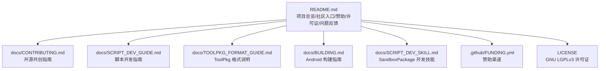
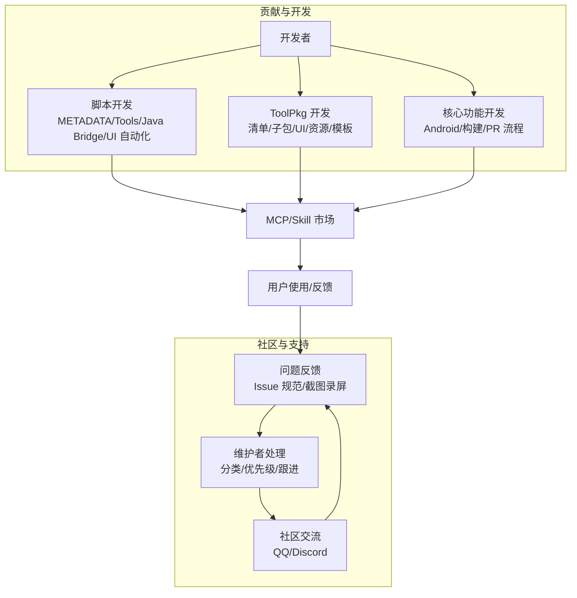
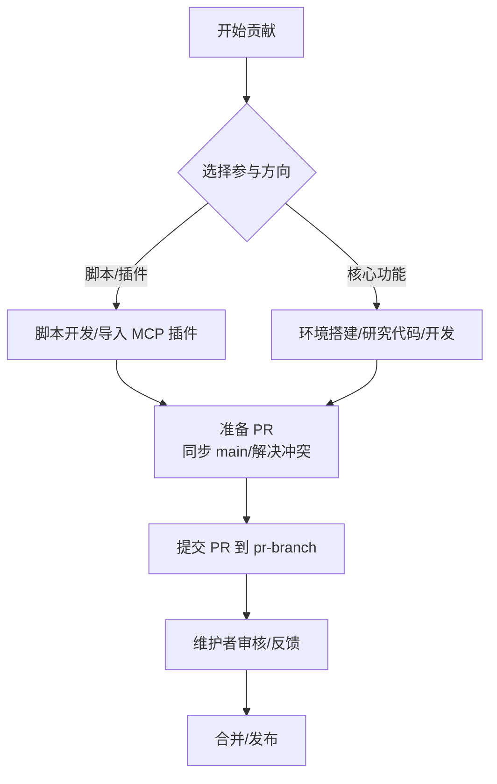
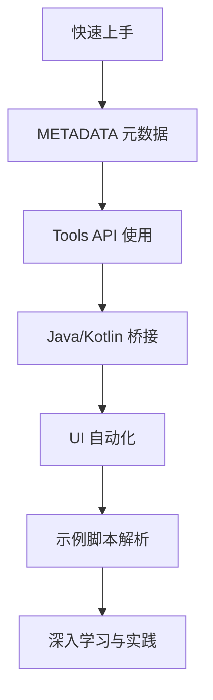
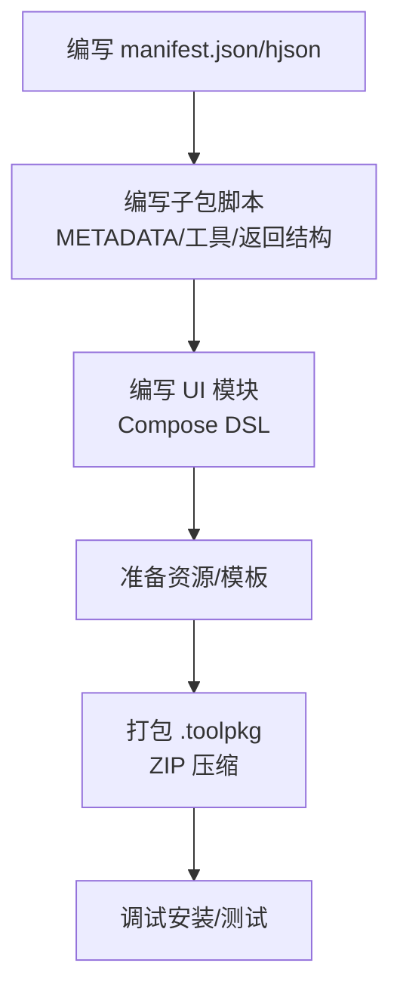
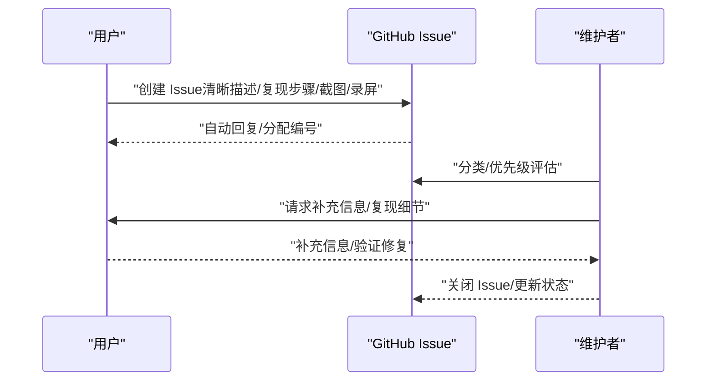
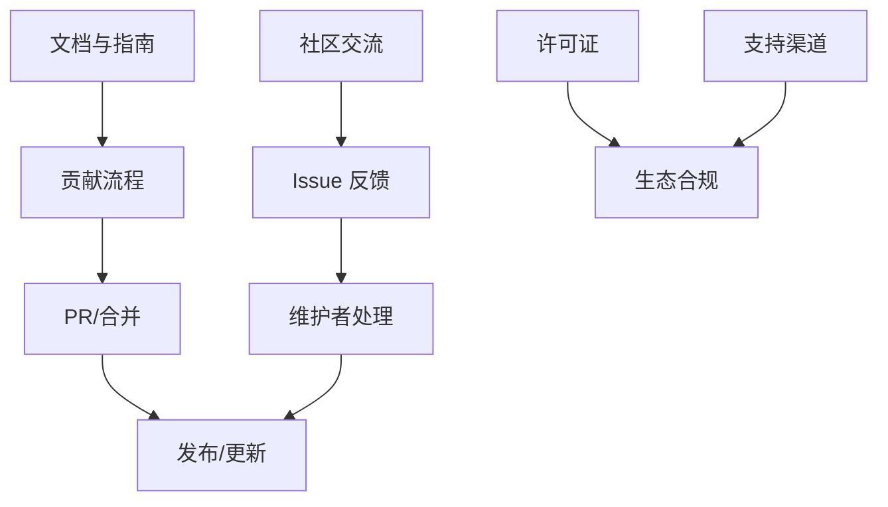

# 社区与支持

<cite>
**本文引用的文件**
- [README.md](file://README.md)
- [CONTRIBUTING.md](file://docs/CONTRIBUTING.md)
- [SCRIPT_DEV_GUIDE.md](file://docs/SCRIPT_DEV_GUIDE.md)
- [BUILDING.md](file://docs/BUILDING.md)
- [TOOLPKG_FORMAT_GUIDE.md](file://docs/TOOLPKG_FORMAT_GUIDE.md)
- [SCRIPT_DEV_SKILL.md](file://docs/SCRIPT_DEV_SKILL.md)
- [LICENSE](file://LICENSE)
- [.github/FUNDING.yml](file://.github/FUNDING.yml)
</cite>

## 目录
1. [简介](#简介)
2. [项目结构](#项目结构)
3. [核心组件](#核心组件)
4. [架构总览](#架构总览)
5. [详细组件分析](#详细组件分析)
6. [依赖分析](#依赖分析)
7. [性能考量](#性能考量)
8. [故障排查指南](#故障排查指南)
9. [结论](#结论)
10. [附录](#附录)

## 简介
本指南面向 Operit AI 智能助手应用的社区与支持，围绕开源共创理念、参与方式、贡献流程、脚本与 MCP 插件开发、核心功能开发、社区交流渠道、问题反馈流程、许可证说明、支持开发方式等维度，提供系统化、可操作的参与路径与问题解决指引，帮助用户与开发者高效融入生态、共建共享。

## 项目结构
Operit 采用多模块、多语言混合的工程结构，涵盖 Android 应用、Web 聊天前端、脚本与工具包生态、MCP/Skill 市场、本地模型与 JNI 桥接等。社区与支持相关内容主要分布在：
- 顶层 README：项目简介、社区入口、赞助与许可证说明、问题反馈入口
- docs 目录：贡献指南、脚本开发指南、ToolPkg 格式说明、构建指南、SandboxPackage 开发技能
- .github/FUNDING.yml：赞助渠道配置
- LICENSE：GNU LGPLv3 许可证全文与要点

**图表来源**
- [README.md:1-469](file://README.md#L1-L469)
- [CONTRIBUTING.md:1-96](file://docs/CONTRIBUTING.md#L1-L96)
- [SCRIPT_DEV_GUIDE.md:1-800](file://docs/SCRIPT_DEV_GUIDE.md#L1-L800)
- [TOOLPKG_FORMAT_GUIDE.md:1-800](file://docs/TOOLPKG_FORMAT_GUIDE.md#L1-L800)
- [BUILDING.md:1-266](file://docs/BUILDING.md#L1-L266)
- [SCRIPT_DEV_SKILL.md:1-163](file://docs/SCRIPT_DEV_SKILL.md#L1-L163)
- [.github/FUNDING.yml:1-4](file://.github/FUNDING.yml#L1-L4)
- [LICENSE:1-211](file://LICENSE#L1-L211)

**章节来源**
- [README.md:1-469](file://README.md#L1-L469)

## 核心组件
- 开源共创理念与参与方式
  - 第三方脚本开发：基于 TypeScript/JavaScript 的脚本包，通过 METADATA 暴露工具，由 AI 根据用户指令调用
  - MCP 插件贡献：通过 Operit 的 MCP 生态导入插件仓库或 zip，扩展网页浏览、图像处理等能力
  - 核心功能开发：参与 Android 应用本体开发，遵循精简流程与分支策略
- 脚本开发与工具包生态
  - 脚本开发指南：从快速入门到高级特性（METADATA、States、多语言、Java/Kotlin 桥接、UI 自动化）
  - ToolPkg 格式说明：ZIP 包装、清单文件、子包、UI 模块、资源、工作流与工作区模板
  - SandboxPackage 开发技能：本地 skill 安装/更新、开发目录规范、撰写流程与调试
- 社区交流与问题反馈
  - 社区渠道：QQ 群、Discord
  - 问题反馈：Issue 提交规范、问题描述要求、截图录屏建议
- 许可证与支持
  - 许可证：GNU LGPLv3，开源使用、修改与分发的权利与义务
  - 支持开发：Patreon、爱发电等渠道

**章节来源**
- [README.md:409-469](file://README.md#L409-L469)
- [CONTRIBUTING.md:1-96](file://docs/CONTRIBUTING.md#L1-L96)
- [SCRIPT_DEV_GUIDE.md:1-800](file://docs/SCRIPT_DEV_GUIDE.md#L1-L800)
- [TOOLPKG_FORMAT_GUIDE.md:1-800](file://docs/TOOLPKG_FORMAT_GUIDE.md#L1-L800)
- [SCRIPT_DEV_SKILL.md:1-163](file://docs/SCRIPT_DEV_SKILL.md#L1-L163)
- [LICENSE:1-211](file://LICENSE#L1-L211)

## 架构总览
社区与支持体系围绕“贡献—开发—交流—反馈—生态”闭环展开，开发者可通过脚本与 ToolPkg 两条主线扩展能力，核心开发者通过 PR 流程参与本体迭代，用户通过社区渠道与 Issue 反馈参与生态建设。

[本图为概念性架构示意，不直接映射具体源码文件，故无“图表来源”]

## 详细组件分析

### 开源共创与贡献流程
- 脚本与插件开发者
  - 脚本开发：参考脚本开发指南，从 METADATA、工具函数、错误处理到 UI 自动化与 Java/Kotlin 桥接
  - MCP 插件：在 Operit 中导入插件仓库或 zip，扩展网页浏览、图像处理等能力
- 核心功能开发者
  - 环境搭建：参考构建指南，准备 JDK、Android SDK/NDK、Node/pnpm、Python 等
  - 开发前必读：先沟通、研究代码、保持兼容、遵循结构
  - 代码风格：随性但欢迎统一
  - 提交流程：Fork/同步/功能分支/rebase/推送/PR（目标分支 pr-branch）
  - 重要提醒：先沟通再开发，PR 必须提交到 pr-branch，提交前同步 main 并解决冲突
- 衍生项目指南
  - 在公开平台发布源码并在文档中致谢与链接回本项目，维护透明度与健康生态

**章节来源**
- [CONTRIBUTING.md:1-96](file://docs/CONTRIBUTING.md#L1-L96)
- [BUILDING.md:1-266](file://docs/BUILDING.md#L1-L266)

### 脚本开发指南与学习路径
- 快速上手
  - 路径 A：在 Operit 项目中直接开发（推荐，免环境配置）
  - 路径 B：创建独立脚本项目（高级，需手动搭建）
- 核心概念
  - METADATA：脚本元数据，定义名称、描述、分类、工具、环境变量等
  - States：动态工具集，按运行时能力选择激活状态
  - 多语言：包级/工具级/参数级文本支持多语言对象
  - Tools：系统、UI、文件、网络等 API，均需 await
  - Java/Kotlin 桥接：高层 API（推荐）与底层 NativeInterface
- 深入学习
  - 示例脚本：quick_start、various_search、time、various_output 等
  - UI 自动化：UINode 对象、元素查找与交互
- 学习路径建议
  - 从“快速上手”到“核心概念”，再到“示例脚本解析”，最后到“UI 自动化详解”

**章节来源**
- [SCRIPT_DEV_GUIDE.md:1-800](file://docs/SCRIPT_DEV_GUIDE.md#L1-L800)

### ToolPkg 格式与开发
- 文件结构
  - .toolpkg 本质为 ZIP，包含清单文件、主入口脚本、子包、UI 模块、资源、国际化等
- 清单文件（manifest）
  - schema_version、toolpkg_id、version、author、main、display_name、description、subpackages、resources、workflow_templates、workspace_templates
- 子包脚本
  - 必须包含 METADATA，遵循统一返回结构，支持多语言与环境变量
- UI 模块
  - 基于 Compose DSL 的声明式 UI，支持状态管理与事件处理
- 资源与模板
  - 支持文件/目录资源，工作流与工作区模板注册
- 打包与调试
  - 手动打包或使用 Python 脚本自动打包，遵循清单与目录规范

**章节来源**
- [TOOLPKG_FORMAT_GUIDE.md:1-800](file://docs/TOOLPKG_FORMAT_GUIDE.md#L1-L800)

### SandboxPackage 开发技能
- 安装与更新
  - 通过安装脚本自动创建目录、下载并更新 SKILL.md、示例包、指南与类型文件
- 开发规范
  - 实际开发目录固定，优先使用普通 JS 包脚本，必要时升级为 ToolPkg
  - 严格遵循查阅顺序：types → guide → examples，避免凭记忆硬写
- 撰写流程
  - 明确需求与方案优先级，先查接口与类型，再实现与测试，最后交付

**章节来源**
- [SCRIPT_DEV_SKILL.md:1-163](file://docs/SCRIPT_DEV_SKILL.md#L1-L163)

### 社区交流渠道与最佳实践
- QQ 群与 Discord
  - README 提供官方社区入口，便于讨论与互助
- 最佳实践
  - 发言礼貌、问题清晰、提供上下文（设备、系统、版本）
  - 分享经验与成果，促进生态繁荣

**章节来源**
- [README.md:11-19](file://README.md#L11-L19)

### 问题反馈标准流程
- 提交 Issue 前
  - 搜索是否已有相关议题，避免重复
  - 准备复现步骤、设备型号、系统版本、日志与截图/录屏
- 提交规范
  - 清晰描述问题/建议，提供必要上下文
  - 附截图/录屏，便于定位与验证
- 维护者处理
  - 分类与优先级评估、分配与跟进、验证修复

**章节来源**
- [README.md:450-459](file://README.md#L450-L459)

### 许可证说明（GNU LGPLv3）
- 许可证要点
  - 可自由使用、修改与分发
  - 修改并分发时需以 LGPLv3 开源修改部分
  - 详细条款参见 LICENSE 文件
- 影响与建议
  - 衍生项目需保持开源透明，尊重原作者署名与链接
  - 商业使用需遵循 LGPLv3 条款，避免侵权风险

**章节来源**
- [LICENSE:1-211](file://LICENSE#L1-L211)
- [README.md:439-447](file://README.md#L439-L447)

### 支持开发方式
- Patreon（海外）
- 爱发电（境内）
- GitHub Sponsor 按钮
- 赞助完全自愿，不影响正常使用与获取更新

**章节来源**
- [README.md:426-436](file://README.md#L426-L436)
- [.github/FUNDING.yml:1-4](file://.github/FUNDING.yml#L1-L4)

## 依赖分析
社区与支持体系的耦合关系：
- 贡献与开发依赖文档与工具链（脚本开发指南、ToolPkg 格式、构建指南、SandboxPackage 技能）
- 社区交流与问题反馈依赖 Issue 流程与维护者响应
- 许可证与支持渠道为生态可持续提供法律与资金保障

[本图为概念性依赖示意，不直接映射具体源码文件，故无“图表来源”]

**章节来源**
- [CONTRIBUTING.md:1-96](file://docs/CONTRIBUTING.md#L1-L96)
- [SCRIPT_DEV_GUIDE.md:1-800](file://docs/SCRIPT_DEV_GUIDE.md#L1-L800)
- [TOOLPKG_FORMAT_GUIDE.md:1-800](file://docs/TOOLPKG_FORMAT_GUIDE.md#L1-L800)
- [BUILDING.md:1-266](file://docs/BUILDING.md#L1-L266)
- [SCRIPT_DEV_SKILL.md:1-163](file://docs/SCRIPT_DEV_SKILL.md#L1-L163)
- [LICENSE:1-211](file://LICENSE#L1-L211)

## 性能考量
- 贡献效率
  - 先沟通再开发，避免重复劳动
  - 使用示例脚本与类型定义减少试错成本
- 开发体验
  - 优先使用路径 A（项目内开发），降低环境配置成本
  - 严格遵循 PR 流程，减少合并冲突与返工
- 社区协作
  - 问题反馈清晰、可复现，缩短定位与修复周期

[本节为通用建议，不直接分析具体文件，故无“章节来源”]

## 故障排查指南
- 构建问题
  - 环境变量未正确设置或生效：检查 ~/.bashrc 并 source
  - JDK 版本不符：确保使用 JDK 17
  - NDK 未找到：使用 sdkmanager 安装 ndk;25.1.8937393
  - 依赖缺失：安装 pnpm、Node/npm/pnpm、Python3
  - 未接受许可：执行 sdkmanager --licenses
  - web-chat 未构建：先 npm --prefix web-chat install，再 npm run build:webchat
  - 预构建失败：确认 npm install 与 pnpm 可用
- Issue 提交问题
  - 描述不清/无复现步骤/无截图/录屏：补充信息后重新打开
  - 重复议题：先搜索，避免重复提交

**章节来源**
- [BUILDING.md:254-266](file://docs/BUILDING.md#L254-L266)
- [README.md:450-459](file://README.md#L450-L459)

## 结论
Operit 的社区与支持体系以开源共创为核心，提供脚本与 ToolPkg 两条扩展主线、完善的贡献流程与文档、友好的社区交流渠道、清晰的问题反馈机制与 LGPLv3 许可证保障。遵循本文指南，用户与开发者可高效参与生态建设，共同推动 Operit 的持续演进与繁荣。

## 附录
- 快速入口
  - 脚本开发：docs/SCRIPT_DEV_GUIDE.md
  - ToolPkg 开发：docs/TOOLPKG_FORMAT_GUIDE.md
  - 核心开发：docs/BUILDING.md
  - 贡献流程：docs/CONTRIBUTING.md
  - SandboxPackage 技能：docs/SCRIPT_DEV_SKILL.md
  - 许可证：LICENSE
  - 赞助渠道：.github/FUNDING.yml

[本节为导航汇总，不直接分析具体文件，故无“章节来源”]