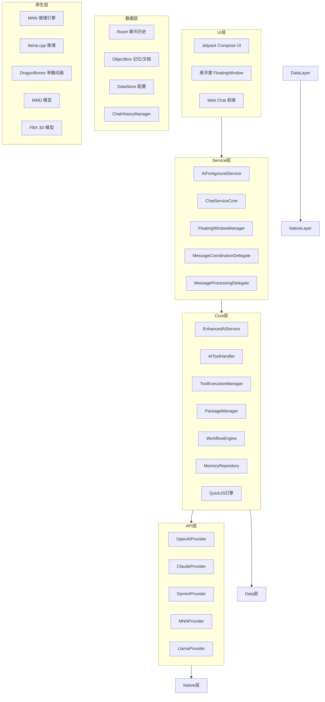
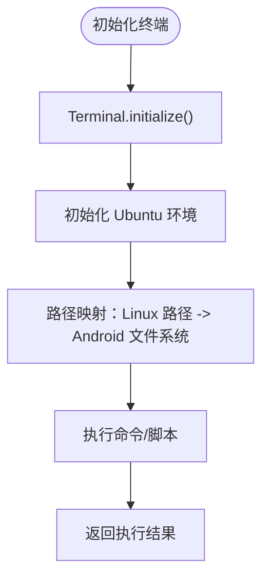
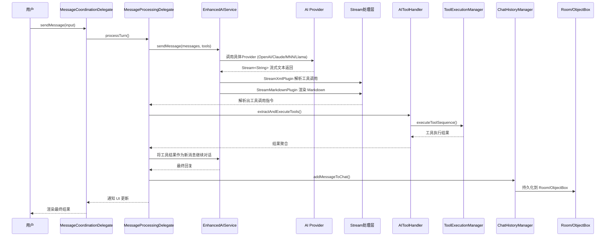
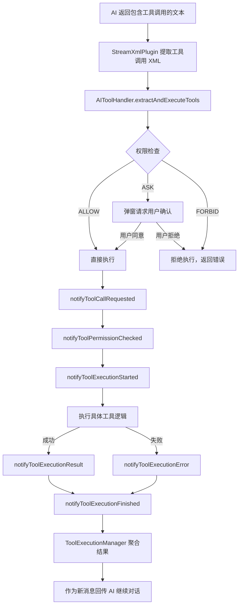
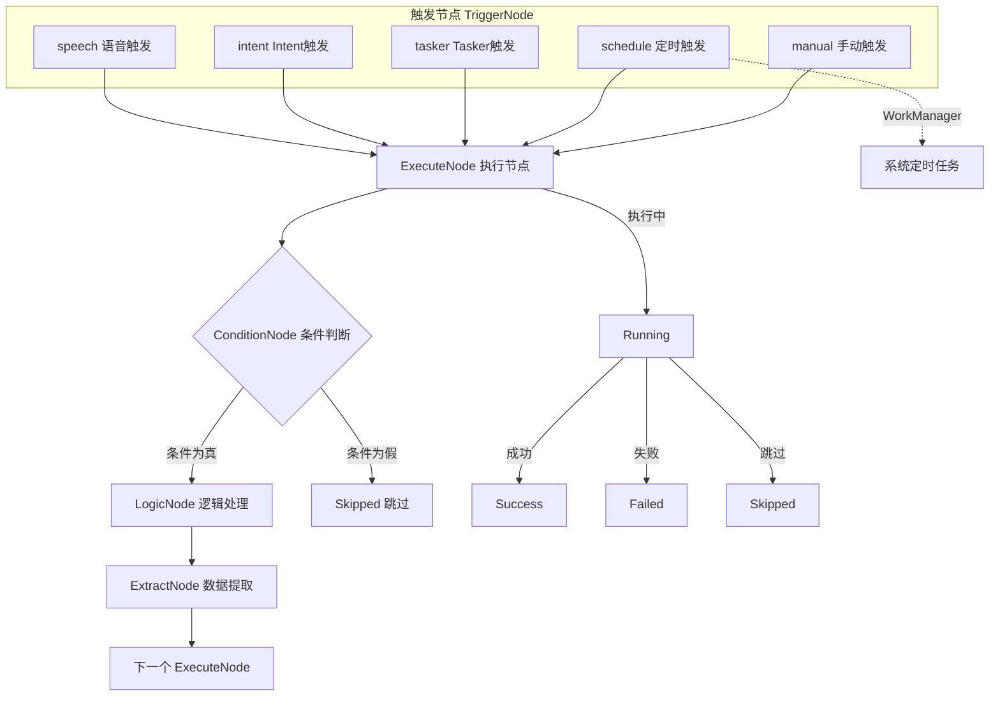
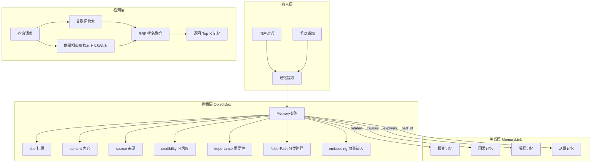

# 项目介绍

<cite>
**本文引用的文件**
- [README.md](file://README.md)
- [QUICK_START_GUIDE.md](file://QUICK_START_GUIDE.md)
- [AndroidManifest.xml](file://app/src/main/AndroidManifest.xml)
- [OperitApplication.kt](file://app/src/main/java/com/ai/assistance/operit/core/application/OperitApplication.kt)
- [EnhancedAIService.kt](file://app/src/main/java/com/ai/assistance/operit/api/chat/EnhancedAIService.kt)
- [Terminal.kt](file://app/src/main/java/com/ai/assistance/operit/core/tools/system/Terminal.kt)
- [MCPToolExecutor.kt](file://app/src/main/java/com/ai/assistance/operit/core/tools/mcp/MCPToolExecutor.kt)
- [MCPPackage.kt](file://app/src/main/java/com/ai/assistance/operit/core/tools/mcp/MCPPackage.kt)
- [MemoryRepository.kt](file://app/src/main/java/com/ai/assistance/operit/data/repository/MemoryRepository.kt)
- [WorkflowExecutor.kt](file://app/src/main/java/com/ai/assistance/operit/core/workflow/WorkflowExecutor.kt)
- [BUILDING.md](file://docs/BUILDING.md)
- [CONTRIBUTING.md](file://docs/CONTRIBUTING.md)
- [SCRIPT_DEV_GUIDE.md](file://docs/SCRIPT_DEV_GUIDE.md)
- [TOOLPKG_FORMAT_GUIDE.md](file://docs/TOOLPKG_FORMAT_GUIDE.md)
- [operit_editor.js](file://app/src/main/assets/packages/operit_editor.js)
- [operit_editor.ts](file://examples/operit_editor.ts)
- [index.html](file://web-chat/index.html)
</cite>

## 目录
1. [项目概述](#项目概述)
2. [核心定位与独特价值](#核心定位与独特价值)
3. [关键特性概览](#关键特性概览)
4. [技术架构总览](#技术架构总览)
5. [Ubuntu 24 终端环境](#ubuntu-24-终端环境)
6. [本地 AI 模型与推理](#本地-ai-模型与推理)
7. [工具调用与 MCP/Skill 生态](#工具调用与-mcpskill-生态)
8. [工作流与自动化](#工作流与自动化)
9. [智能记忆系统](#智能记忆系统)
10. [多语言界面与国际化](#多语言界面与国际化)
11. [Android 权限与系统集成](#android-权限与系统集成)
12. [构建与开发指南](#构建与开发指南)
13. [面向不同用户群体的使用建议](#面向不同用户群体的使用建议)
14. [结语](#结语)

## 项目概述
Operit AI 是移动端首个功能完备的 AI 智能助手应用，强调“完全独立运行、强大的工具调用能力、深度搜索、工作流与自动化、智能记忆库”，并支持人设定制与角色卡、MNN/llama.cpp 本地模型、MCP/Skill 生态、多语言界面等。它不仅是聊天界面，更是与 Android 权限和各种工具深度融合的全能助手，内置 Ubuntu 24 环境，提供前所未有的强大功能。

**章节来源**
- [README.md:39-42](file://README.md#L39-L42)

## 核心定位与独特价值
- 独立运行：应用完全独立于云端运行（除 API 调用），保障隐私与离线可用性。
- 工具调用：支持原生模型工具调用、深度搜索、文件/网络/系统/媒体等多类工具。
- 全能助手：与 Android 权限、无障碍、ADB、Root 等通道深度融合，实现 UI 自动化、系统控制、终端执行等。
- 生态开放：MCP/Skill 市场插件、ToolPkg 包管理、脚本与 JS 引擎，支持二次扩展。
- 多模态体验：本地/云端模型、语音交互、虚拟形象、悬浮窗、Web 聊天界面等。

**章节来源**
- [README.md:39-42](file://README.md#L39-L42)
- [QUICK_START_GUIDE.md:32-44](file://QUICK_START_GUIDE.md#L32-L44)

## 关键特性概览
- Ubuntu 24 环境：完整 Linux 命令、包管理、Python/Node.js 运行环境。
- 智能记忆系统：向量嵌入 + RRF 排名融合，支持时间查询/导入导出/自动总结。
- 本地 AI 模型：MNN / llama.cpp 本地推理，OpenAI/Claude/Gemini 等云端模型。
- 工具生态：40+ 内置工具 + MCP/Skill 市场插件 + 工具包/工作流。
- 语音交互：本地/云端 TTS + 本地 STT、自定义音色、语音/特定音频唤醒。
- 多语言界面：中英覆盖，自动随系统语言切换。
- 悬浮窗助手：全局悬浮窗 AI 助手，随时调用。

**章节来源**
- [README.md:45-125](file://README.md#L45-L125)

## 技术架构总览
Operit 采用分层架构，UI 层、Service 层、Core 层、API 层、Data 层与 Native 层协同工作，形成“前端界面 + 前台服务 + 核心业务 + AI 服务 + 数据存储 + 原生能力”的完整闭环。

**图表来源**
- [QUICK_START_GUIDE.md:92-147](file://QUICK_START_GUIDE.md#L92-L147)

**章节来源**
- [QUICK_START_GUIDE.md:90-147](file://QUICK_START_GUIDE.md#L90-L147)

## Ubuntu 24 终端环境
Operit 内置 Ubuntu 24 终端环境，提供完整的 Linux 命令、包管理（apt）、Python/Node.js 运行环境与自定义软件源支持。通过 Terminal 管理器与路径映射，将 Linux 路径映射到 Android 文件系统，实现对 Ubuntu 根文件系统的访问与操作。

**图表来源**
- [Terminal.kt:63-72](file://app/src/main/java/com/ai/assistance/operit/core/tools/system/Terminal.kt#L63-L72)

**章节来源**
- [Terminal.kt:31-72](file://app/src/main/java/com/ai/assistance/operit/core/tools/system/Terminal.kt#L31-L72)

## 本地 AI 模型与推理
Operit 支持 MNN 与 llama.cpp 本地推理，以及 OpenAI/Claude/Gemini 等云端模型。EnhancedAIService 作为核心服务，负责多模型服务管理、工具调用解析与流式文本处理，结合流式插件（XML/Markdown）解析工具调用指令，实现“对话 -> 工具调用 -> 结果回传”的闭环。

**图表来源**
- [QUICK_START_GUIDE.md:301-332](file://QUICK_START_GUIDE.md#L301-L332)

**章节来源**
- [QUICK_START_GUIDE.md:299-332](file://QUICK_START_GUIDE.md#L299-L332)
- [EnhancedAIService.kt:93-200](file://app/src/main/java/com/ai/assistance/operit/api/chat/EnhancedAIService.kt#L93-L200)

## 工具调用与 MCP/Skill 生态
Operit 通过 AIToolHandler 与 ToolExecutionManager 实现工具调用的统一调度与执行，支持权限检查（ALLOW/ASK/FORBID）与工具调用 XML 解析。MCP/Skill 生态通过 MCPToolExecutor 与 MCPPackage 将外部 MCP 服务器标准化为工具包，实现跨语言、跨平台的工具扩展。

**图表来源**
- [QUICK_START_GUIDE.md:336-356](file://QUICK_START_GUIDE.md#L336-L356)

**章节来源**
- [QUICK_START_GUIDE.md:334-374](file://QUICK_START_GUIDE.md#L334-L374)
- [MCPToolExecutor.kt:16-25](file://app/src/main/java/com/ai/assistance/operit/core/tools/mcp/MCPToolExecutor.kt#L16-L25)
- [MCPPackage.kt:12-39](file://app/src/main/java/com/ai/assistance/operit/core/tools/mcp/MCPPackage.kt#L12-L39)

## 工作流与自动化
Operit 的工作流引擎支持可视化工作流，支持手动、定时、Tasker、Intent、语音等多种触发方式。执行流程通过拓扑排序与依赖图检测环，确保无环执行与状态变更回调。

**图表来源**
- [QUICK_START_GUIDE.md:471-496](file://QUICK_START_GUIDE.md#L471-L496)

**章节来源**
- [QUICK_START_GUIDE.md:469-508](file://QUICK_START_GUIDE.md#L469-L508)
- [WorkflowExecutor.kt:597-624](file://app/src/main/java/com/ai/assistance/operit/core/workflow/WorkflowExecutor.kt#L597-L624)

## 智能记忆系统
Operit 的记忆系统采用向量嵌入 + RRF 排名融合策略，结合关键词检索与 HNSWLib 相似度搜索，实现高效的记忆召回与排序。MemoryRepository 负责向量索引的重建、维度管理与候选检索。

**图表来源**
- [QUICK_START_GUIDE.md:510-542](file://QUICK_START_GUIDE.md#L510-L542)

**章节来源**
- [QUICK_START_GUIDE.md:508-542](file://QUICK_START_GUIDE.md#L508-L542)
- [MemoryRepository.kt:284-605](file://app/src/main/java/com/ai/assistance/operit/data/repository/MemoryRepository.kt#L284-L605)

## 多语言界面与国际化
Operit 支持多语言界面，界面文案覆盖中英，并支持随系统语言自动切换。国际化通过资源文件与多语言文本结构实现，便于扩展更多语言。

**章节来源**
- [README.md:101](file://README.md#L101)

## Android 权限与系统集成
Operit 在 AndroidManifest 中声明了广泛的权限与服务，包括网络、存储、前台服务、系统弹窗、安装包、录音、摄像头、位置、闹钟、电话短信、电池优化豁免、WAKE_LOCK、无障碍、ADB、Root 等。这些权限支撑了工具调用、UI 自动化、系统控制、悬浮窗等功能。

**章节来源**
- [AndroidManifest.xml:13-67](file://app/src/main/AndroidManifest.xml#L13-L67)
- [AndroidManifest.xml:141-510](file://app/src/main/AndroidManifest.xml#L141-L510)

## 构建与开发指南
Operit 提供完整的构建与开发指南，涵盖 Linux/Ubuntu 环境配置、Android SDK/NDK 安装、Gradle 性能优化、GitHub OAuth 配置、Web 前端构建、ToolPkg 打包与示例同步等。开发者可通过 BUILDING.md 与 CONRIBUTING.md 快速搭建开发环境并参与开源生态。

**章节来源**
- [BUILDING.md:1-266](file://docs/BUILDING.md#L1-L266)
- [CONTRIBUTING.md:1-96](file://docs/CONTRIBUTING.md#L1-L96)

## 面向不同用户群体的使用建议
- 初学者（概念解释）
  - Operit 是一款“智能助手”，不仅聊天，还能调用工具、执行系统命令、自动化任务、记忆对话、多语言界面、本地/云端模型推理。
  - 内置 Ubuntu 24 环境，可在手机上运行 Linux 命令与脚本，实现“移动办公”体验。
  - 工具生态丰富，支持 MCP/Skill 市场插件与 ToolPkg 包管理，可按需扩展功能。
- 进阶用户（技术细节）
  - 通过 EnhancedAIService 与 AIToolHandler 实现工具调用与流式处理，结合本地 MNN/llama.cpp 与云端模型，实现“对话 -> 工具调用 -> 结果回传”的闭环。
  - 使用 MCPToolExecutor 与 MCPPackage 将外部 MCP 服务器标准化为工具包，实现跨语言工具扩展。
  - 通过 MemoryRepository 与 HNSWLib 实现向量记忆检索，结合 RRF 排名融合，提升记忆召回质量。
  - 通过 WorkflowExecutor 实现可视化工作流，支持多种触发方式与状态变更回调。
- 专业开发者（扩展与二次开发）
  - 参考 SCRIPT_DEV_GUIDE.md 与 TOOLPKG_FORMAT_GUIDE.md，编写脚本与 ToolPkg 包，实现自定义工具与 UI 模块。
  - 通过 OperitApplication 初始化流程与服务架构，理解应用启动、数据库初始化、工具系统启动与协调、异常处理与崩溃上报等关键环节。
  - 使用 AndroidManifest 权限与服务，结合无障碍、ADB、Root 等通道，实现 UI 自动化与系统控制。

**章节来源**
- [SCRIPT_DEV_GUIDE.md:1-800](file://docs/SCRIPT_DEV_GUIDE.md#L1-L800)
- [TOOLPKG_FORMAT_GUIDE.md:1-800](file://docs/TOOLPKG_FORMAT_GUIDE.md#L1-L800)
- [OperitApplication.kt:118-200](file://app/src/main/java/com/ai/assistance/operit/core/application/OperitApplication.kt#L118-L200)

## 结语
Operit AI 以“完全独立运行、强大的工具调用能力、深度搜索、工作流与自动化、智能记忆库”为核心，结合 Ubuntu 24 终端、MNN/llama.cpp 本地模型、MCP/Skill 生态与多语言界面，打造移动端首个功能完备的 AI 智能助手。无论是初学者还是专业开发者，都能在 Operit 的开放生态中找到适合自己的使用方式与扩展路径。

**章节来源**
- [README.md:39-42](file://README.md#L39-L42)
- [QUICK_START_GUIDE.md:30-44](file://QUICK_START_GUIDE.md#L30-L44)