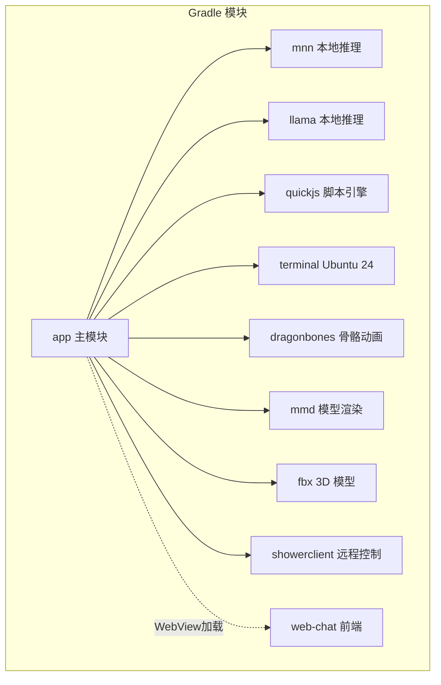
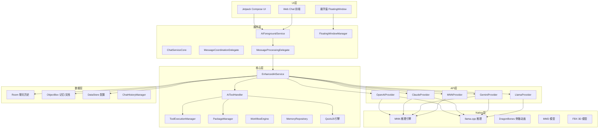
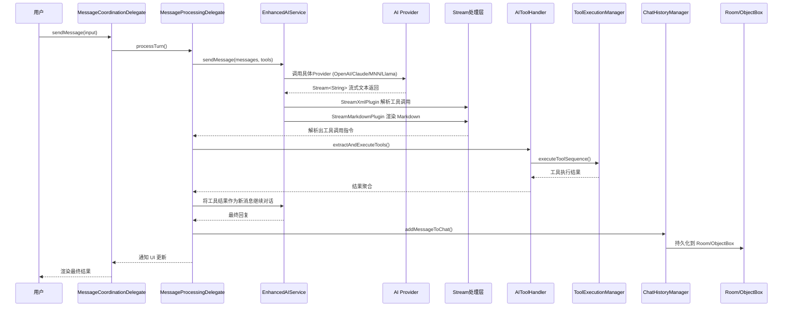
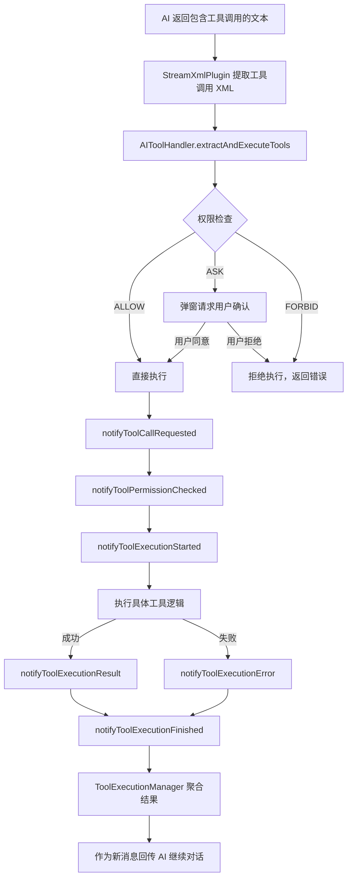
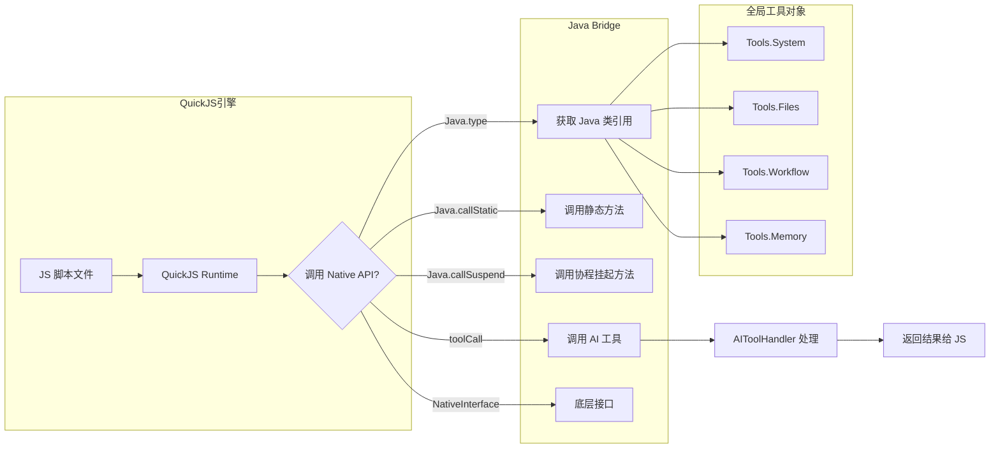
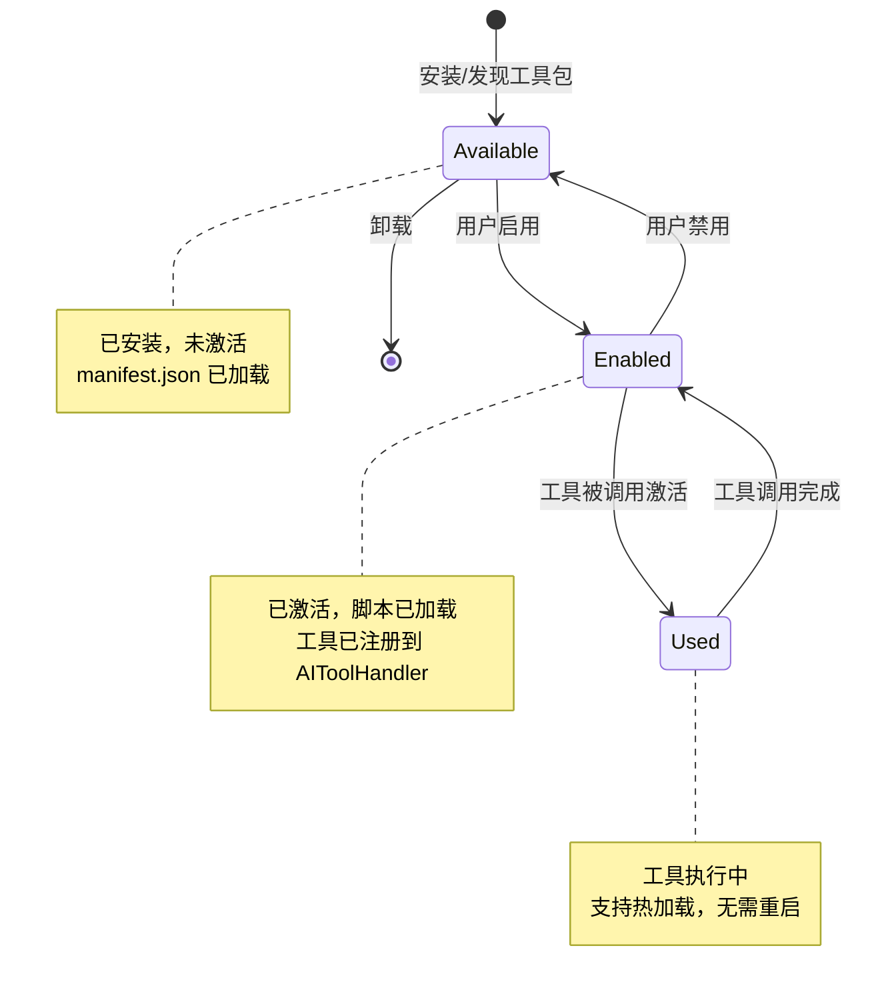
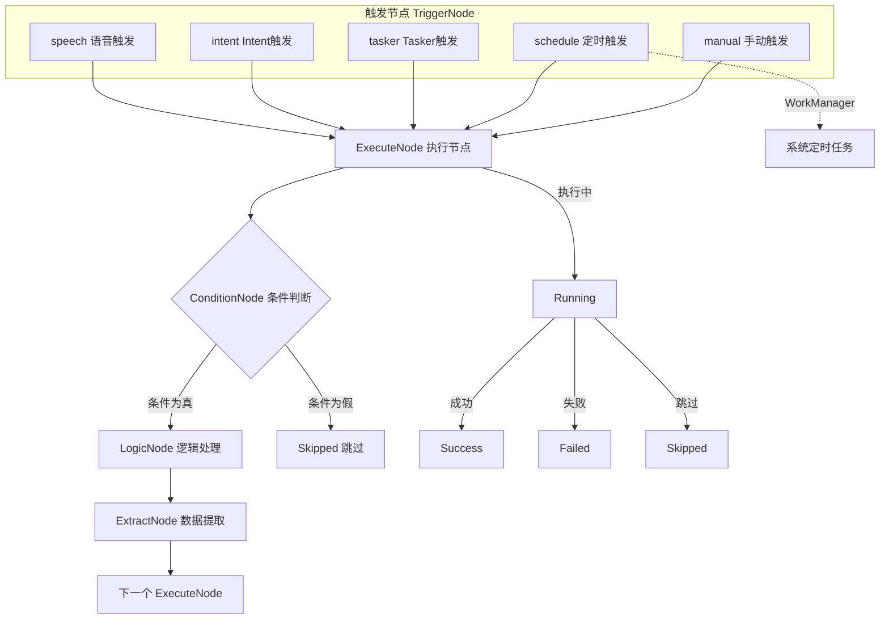
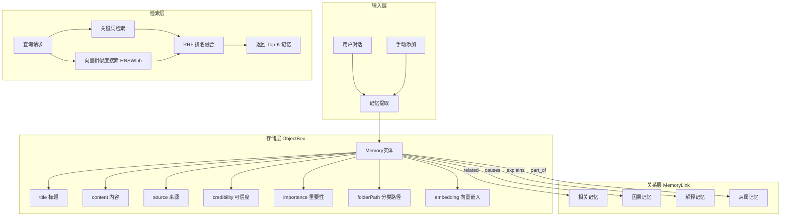
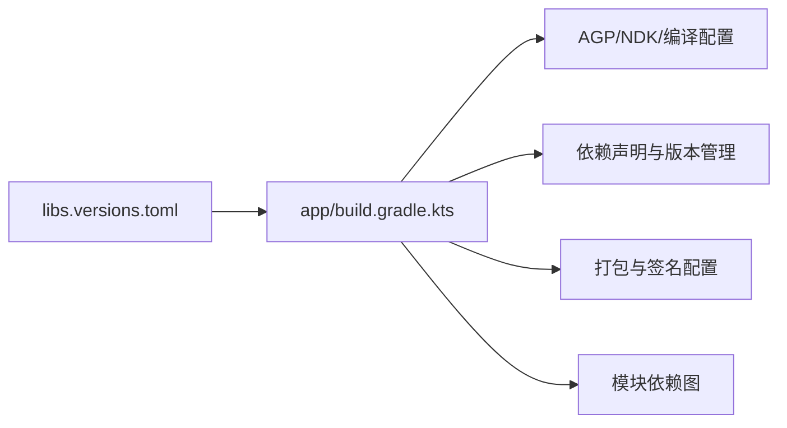

# 项目概述

<cite>
**本文引用的文件**
- [README.md](file://README.md)
- [QUICK_START_GUIDE.md](file://QUICK_START_GUIDE.md)
- [BUILDING.md](file://BUILDING.md)
- [settings.gradle.kts](file://settings.gradle.kts)
- [app/build.gradle.kts](file://app/build.gradle.kts)
- [gradle/libs.versions.toml](file://gradle/libs.versions.toml)
- [OperitApplication.kt](file://app/src/main/java/com/ai/assistance/operit/core/application/OperitApplication.kt)
- [AIService.kt](file://app/src/main/java/com/ai/assistance/operit/api/chat/llmprovider/AIService.kt)
- [AIToolHandler.kt](file://app/src/main/java/com/ai/assistance/operit/core/tools/AIToolHandler.kt)
- [MessageProcessingDelegate.kt](file://app/src/main/java/com/ai/assistance/operit/services/core/MessageProcessingDelegate.kt)
- [DEFAULT_TOOLS_ARCH.md](file://docs/DEFAULT_TOOLS_ARCH.md)
- [TOOLPKG_FORMAT_GUIDE.md](file://docs/TOOLPKG_FORMAT_GUIDE.md)
- [CONTRIBUTING.md](file://docs/CONTRIBUTING.md)
</cite>

## 目录
1. [引言](#引言)
2. [项目结构](#项目结构)
3. [核心组件](#核心组件)
4. [架构总览](#架构总览)
5. [详细组件分析](#详细组件分析)
6. [依赖分析](#依赖分析)
7. [性能考虑](#性能考虑)
8. [故障排查指南](#故障排查指南)
9. [结论](#结论)
10. [附录](#附录)

## 引言
Operit AI 是移动端首个功能完备的 AI 智能助手应用，强调“完全独立运行、强大的工具调用能力、深度搜索、工作流与自动化、智能记忆库”。项目以 Android 为载体，提供本地推理（MNN/llama.cpp）、云端模型接入（OpenAI/Claude/Gemini 等）、MCP/Skill 生态、Ubuntu 24 终端、可视化工作流、跨语言界面等能力，目标是成为“与 Android 权限和工具深度融合的全能助手”。

- 核心定位：移动端首个功能完备的 AI 智能助手，支持本地/云端双栈推理、工具调用、工作流自动化、记忆系统、虚拟形象与多语言界面。
- 技术亮点：本地推理（MNN/llama.cpp）、MCP/Skill 生态、Ubuntu 24 终端、工具包（ToolPkg）标准化分发、流式对话与工具调用、多语言界面、悬浮窗与 Web 聊天前端。

章节来源
- [README.md:39-126](file://README.md#L39-L126)
- [README.md:174-186](file://README.md#L174-L186)

## 项目结构
项目采用多模块 Gradle 结构，核心模块包括主应用 app 与若干 Native/C++ 模块（mnn、llama、dragonbones、mmd、fbx、quickjs、terminal、showerclient），以及独立的 web-chat 前端模块。模块间通过依赖关系耦合，形成“UI/服务/核心/API/数据/Native”分层。

图表来源
- [settings.gradle.kts:21-29](file://settings.gradle.kts#L21-L29)
- [app/build.gradle.kts:181-190](file://app/build.gradle.kts#L181-L190)

章节来源
- [settings.gradle.kts:1-30](file://settings.gradle.kts#L1-L30)
- [app/build.gradle.kts:1-445](file://app/build.gradle.kts#L1-L445)

## 核心组件
- 应用入口与初始化：OperitApplication 负责全局单例、数据库初始化、语言设置、图片/媒体池、工具系统注册、工作流调度器、无障碍服务预绑定、前台服务启动等。
- AI 服务接口：AIService 定义与不同 AI 提供商交互的标准方法，支持流式输出、令牌计数、连接测试、模型列表获取等。
- 工具系统：AIToolHandler 负责工具注册、权限系统、工具执行与流式执行、工具包（ToolPkg）管理、MCP 服务激活与自动启用。
- 消息处理链：MessageProcessingDelegate 驱动一次完整对话的发送、流式接收、工具调用解析与执行、历史持久化、UI 更新与自动朗读等。

章节来源
- [OperitApplication.kt:78-654](file://app/src/main/java/com/ai/assistance/operit/core/application/OperitApplication.kt#L78-L654)
- [AIService.kt:10-93](file://app/src/main/java/com/ai/assistance/operit/api/chat/llmprovider/AIService.kt#L10-L93)
- [AIToolHandler.kt:25-432](file://app/src/main/java/com/ai/assistance/operit/core/tools/AIToolHandler.kt#L25-L432)
- [MessageProcessingDelegate.kt:55-1693](file://app/src/main/java/com/ai/assistance/operit/services/core/MessageProcessingDelegate.kt#L55-L1693)

## 架构总览
整体架构分为 UI 层、服务层、核心层、API 层、数据层与 Native 层，形成“Compose UI + 前台服务 + 增强 AI 服务 + 工具系统 + 插件生态 + 本地推理 + 记忆与工作区”的闭环。

图表来源
- [QUICK_START_GUIDE.md:90-147](file://QUICK_START_GUIDE.md#L90-L147)
- [QUICK_START_GUIDE.md:151-196](file://QUICK_START_GUIDE.md#L151-L196)

章节来源
- [QUICK_START_GUIDE.md:90-196](file://QUICK_START_GUIDE.md#L90-L196)

## 详细组件分析

### 组件 A：AI 对话与工具调用完整流程
该流程涵盖从用户输入到 AI 流式响应、工具调用解析与执行、结果回传继续对话、历史持久化与 UI 更新的全过程。

图表来源
- [QUICK_START_GUIDE.md:299-332](file://QUICK_START_GUIDE.md#L299-L332)
- [QUICK_START_GUIDE.md:334-356](file://QUICK_START_GUIDE.md#L334-L356)

章节来源
- [QUICK_START_GUIDE.md:299-356](file://QUICK_START_GUIDE.md#L299-L356)

### 组件 B：工具调用执行流程
工具调用执行包含权限检查（ALLOW/ASK/FORBID）、弹窗确认、执行通知、结果聚合与回传 AI 继续对话。

图表来源
- [QUICK_START_GUIDE.md:334-356](file://QUICK_START_GUIDE.md#L334-L356)
- [AIToolHandler.kt:96-124](file://app/src/main/java/com/ai/assistance/operit/core/tools/AIToolHandler.kt#L96-L124)

章节来源
- [AIToolHandler.kt:96-124](file://app/src/main/java/com/ai/assistance/operit/core/tools/AIToolHandler.kt#L96-L124)

### 组件 C：脚本引擎与 Java 桥接
QuickJS 引擎提供脚本执行能力，支持调用 Java/Kotlin API、工具系统、Native 接口与 AI 工具调用。

图表来源
- [QUICK_START_GUIDE.md:375-401](file://QUICK_START_GUIDE.md#L375-L401)

章节来源
- [QUICK_START_GUIDE.md:375-401](file://QUICK_START_GUIDE.md#L375-L401)

### 组件 D：工具包生命周期（ToolPkg）
ToolPkg 是 ZIP 格式的插件包，包含 manifest.json + 脚本 + 资源，支持三种包类型（MCP/Skill/Sandbox），生命周期包括“可用 -> 启用 -> 使用 -> 卸载”。

图表来源
- [QUICK_START_GUIDE.md:415-442](file://QUICK_START_GUIDE.md#L415-L442)
- [TOOLPKG_FORMAT_GUIDE.md:26-46](file://docs/TOOLPKG_FORMAT_GUIDE.md#L26-L46)

章节来源
- [QUICK_START_GUIDE.md:415-442](file://QUICK_START_GUIDE.md#L415-L442)
- [TOOLPKG_FORMAT_GUIDE.md:26-46](file://docs/TOOLPKG_FORMAT_GUIDE.md#L26-L46)

### 组件 E：工作流执行流程
工作流支持多种触发方式（手动、定时、Tasker、Intent、语音），包含执行节点、条件判断、逻辑处理、数据提取与状态流转。

图表来源
- [QUICK_START_GUIDE.md:469-496](file://QUICK_START_GUIDE.md#L469-L496)

章节来源
- [QUICK_START_GUIDE.md:469-496](file://QUICK_START_GUIDE.md#L469-L496)

### 组件 F：记忆系统架构
记忆系统采用 ObjectBox 存储，结合关键词检索与向量相似度搜索（HNSWLib），通过 RRF 排名融合返回 Top-K 记忆。

图表来源
- [QUICK_START_GUIDE.md:508-542](file://QUICK_START_GUIDE.md#L508-L542)

章节来源
- [QUICK_START_GUIDE.md:508-542](file://QUICK_START_GUIDE.md#L508-L542)

## 依赖分析
- 技术栈概览：Kotlin/Java、Jetpack Compose、TypeScript（web-chat）、MNN/llama.cpp、Room/ObjectBox/DataStore、OkHttp/SSE、HNSWLib、Jieba、NDK、AGP 等。
- 模块依赖：app 依赖 quickjs、mnn、llama、terminal、dragonbones、mmd、fbx、showerclient；web-chat 作为独立前端项目与 app 通过 WebView 加载。
- 版本与构建：libs.versions.toml 统一管理依赖版本；app/build.gradle.kts 配置 minSdk/targetSdk、ABI 过滤、打包与签名；Gradle 性能优化通过 org.gradle.jvmargs、parallel、workers.max 等参数。

图表来源
- [gradle/libs.versions.toml:1-271](file://gradle/libs.versions.toml#L1-L271)
- [app/build.gradle.kts:23-173](file://app/build.gradle.kts#L23-L173)

章节来源
- [gradle/libs.versions.toml:1-271](file://gradle/libs.versions.toml#L1-L271)
- [app/build.gradle.kts:23-173](file://app/build.gradle.kts#L23-L173)

## 性能考虑
- 启动阶段优化：OperitApplication 在应用启动早期完成语言设置、图片/媒体池预热、工具系统注册、工作流调度器初始化、无障碍服务预绑定等，减少首屏掉帧风险。
- 流式处理：消息处理链支持流式响应与工具调用解析，降低等待延迟；工具执行支持流式结果回传。
- 存储与缓存：Room/ObjectBox 双存储架构，ObjectBox 用于记忆/文档，Room 用于聊天历史；图片/媒体池支持磁盘与内存缓存，提升渲染与加载性能。
- 本地推理：MNN/llama.cpp 本地模型减少网络依赖，保护隐私数据，但需合理分配资源与线程池。

章节来源
- [OperitApplication.kt:118-375](file://app/src/main/java/com/ai/assistance/operit/core/application/OperitApplication.kt#L118-L375)
- [MessageProcessingDelegate.kt:516-800](file://app/src/main/java/com/ai/assistance/operit/services/core/MessageProcessingDelegate.kt#L516-L800)

## 故障排查指南
- 构建环境：确保 JDK 17、Android SDK/NDK、Node.js/npm/pnpm、Python3 等工具版本满足要求；接受 SDK 许可；正确配置 ANDROID_HOME/JAVA_HOME/PATH。
- 依赖库：从 Google Drive 下载 models.zip、subpack.zip、jniLibs.zip、libs.zip 并放置到指定目录；执行 npm install 与 npm run build:webchat；运行 python3 sync_example_packages.py 同步示例包。
- 常见问题：sdkmanager 命令未找到、JDK 版本不符、NDK 未安装、pnpm 未安装、web-chat 未构建、预构建失败、未接受许可协议等。

章节来源
- [BUILDING.md:13-266](file://BUILDING.md#L13-L266)

## 结论
Operit AI 以“本地推理 + 工具调用 + 插件生态 + 工作流 + 记忆系统 + 多语言界面”为核心，构建了移动端首个功能完备的 AI 智能助手。通过清晰的模块划分、稳定的流式对话与工具调用链路、完善的构建与开发指南，既适合初学者快速上手，也为有经验的开发者提供了深度扩展空间。

## 附录

### A. 版本演进与未来规划
- v1.10.1：内置浏览器与网页自动化增强、虚拟形象与界面定制、插件/工作区/上下文增强、稳定性与性能优化。
- v1.10.0：角色卡群聊与 AI 自配置、主题与交互升级、工具与平台扩展、修复与性能优化。
- v1.9.x：稳定性修复、终端与工具调用增强、MCP 与记忆库优化、功能补充与界面修复。
- v1.8.x：移动端网页自动操作、Windows 终端操作、工具与系统扩展、修复与优化。
- v1.7.x：GUI 自动化里程碑、自动化增强、交互增强、修复与优化。
- v1.6.x：原生 ToolCall 支持、工作区与终端增强、模型与消息显示优化、优化与修复。
- v1.5.x：Ubuntu 24 终端完整集成、MCP 市场上线、桌宠功能、深度搜索模式。
- v1.4.x：多工具并行执行、人设卡系统、PNG 角色卡导入。
- v1.3.x：Web 开发功能、主题选择器、自定义 UI、Anthropic Claude 支持。
- v1.2.x：语音对话系统、知识库功能、DragonBones 动画支持。
- v1.1.x：MCP 协议支持、OCR 识别、悬浮窗、Gemini 完整支持。
- v1.0.0：首个正式版本、基础 AI 对话、工具调用、Shizuku/Root 集成。

章节来源
- [README.md:197-403](file://README.md#L197-L403)

### B. 开发与贡献指南
- 环境搭建：参考 BUILDING.md 完成系统依赖、Android 工具链、SDK/NDK、Node.js/pnpm/Python3 配置。
- 脚本与插件：参考 SCRIPT_DEV_GUIDE.md 与 TOOLPKG_FORMAT_GUIDE.md，掌握 ToolPkg 格式、子包脚本开发、UI 模块开发、多语言支持与资源访问。
- 本体开发：遵循 CONTRIBUTING.md 的流程与规范，先沟通、研究代码、保持兼容、遵循结构、统一风格、严格 PR 流程。

章节来源
- [CONTRIBUTING.md:1-96](file://docs/CONTRIBUTING.md#L1-L96)
- [DEFAULT_TOOLS_ARCH.md:1-203](file://docs/DEFAULT_TOOLS_ARCH.md#L1-L203)
- [TOOLPKG_FORMAT_GUIDE.md:1-800](file://docs/TOOLPKG_FORMAT_GUIDE.md#L1-L800)