# Operit AI 本地推理模块架构详解

## 目录

1. [概述](#概述)
2. [整体架构](#整体架构)
3. [软件分层](#软件分层)
4. [MNN 模块详解](#mnn-模块详解)
5. [Llama.cpp 模块详解](#llamacpp-模块详解)
6. [统一接口层](#统一接口层)
7. [模型加载流程](#模型加载流程)
8. [流式推理流程](#流式推理流程)
9. [工具调用处理](#工具调用处理)
10. [多模态处理](#多模态处理)
11. [GPU 加速配置](#gpu-加速配置)
12. [内存管理与生命周期](#内存管理与生命周期)
13. [配置参数参考](#配置参数参考)
14. [性能优化建议](#性能优化建议)
15. [故障排查指南](#故障排查指南)
16. [核心文件索引](#核心文件索引)

---

## 概述

Operit AI 的本地推理采用 **双引擎架构**，同时支持 MNN（阿里巴巴轻量推理框架）和 llama.cpp（社区主流 GGUF 推理引擎），通过统一的 `AIService` 接口对上层屏蔽差异，实现：

- **MNN 引擎**：支持多种 GPU 后端（Vulkan/OpenCL/OpenGL）、Transformer 融合、低内存优化，适合快速迭代的轻量模型
- **llama.cpp 引擎**：支持 GGUF 格式、Flash Attention、GPU 层卸载，适合大模型部署
- **统一接口**：AIService 接口屏蔽引擎差异，支持流式输出、工具调用、多模态
- **灵活配置**：ModelConfigData 支持动态切换模型和后端

---

## 整体架构

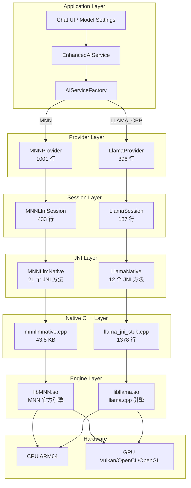

---

## 软件分层

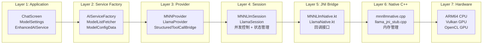

---

## MNN 模块详解

### 模块结构

```
mnn/
├── src/main/
│   ├── cpp/
│   │   ├── mnnllmnative.cpp (43.8 KB)     # LLM 推理 JNI 绑定
│   │   ├── mnnmodulennative.cpp (10.6 KB)  # 通用模块 JNI
│   │   ├── mnnnetnative.cpp (17.6 KB)      # 网络推理 JNI
│   │   ├── mnnportraitnative.cpp (2.2 KB)  # 人像检测/分割
│   │   └── MNN/ (50 项)                     # MNN 官方源码
│   ├── java/com/ai/assistance/mnn/
│   │   ├── MNNLlmSession.kt (433 行)       # 会话管理封装
│   │   ├── MNNLlmNative.kt (215 行)        # JNI 接口定义
│   │   ├── MNNLlmContextInfo.kt            # 推理上下文信息
│   │   ├── MNNForwardType.kt               # 前向计算类型枚举
│   │   ├── MNNImageProcess.kt              # 图像预处理
│   │   ├── MNNLibraryLoader.kt             # 动态库加载
│   │   ├── MNNModule.kt (237 行)           # 通用模块封装
│   │   ├── MNNModuleNative.kt              # 模块 JNI
│   │   └── MNNNetInstance.kt               # 网络实例管理
│   └── CMakeLists.txt
├── build.gradle.kts
├── consumer-rules.pro
└── proguard-rules.pro
```

### MNN 内部结构图

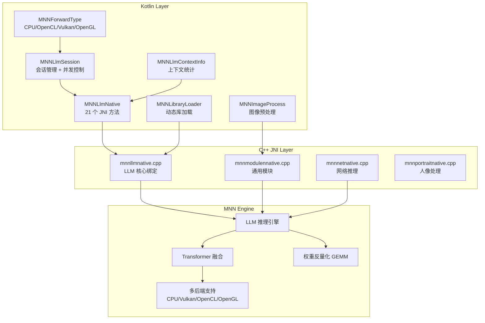

### CMake 编译配置

| 配置项 | 值 | 说明 |
|--------|-----|------|
| MNN_BUILD_LLM | ON | 启用 LLM 推理支持 |
| MNN_LOW_MEMORY | ON | 低内存模式优化 |
| MNN_SUPPORT_TRANSFORMER_FUSE | ON | Transformer 算子融合 |
| MNN_CPU_WEIGHT_DEQUANT_GEMM | ON | CPU 权重反量化 GEMM |
| MNN_VULKAN | ON | Vulkan GPU 后端 |
| MNN_OPENCL | ON | OpenCL GPU 后端 |
| MNN_OPENGL | ON | OpenGL GPU 后端 |
| MNN_SEP_BUILD | OFF | 所有后端编入单个 libMNN.so |
| ABI | arm64-v8a | 仅 64 位 ARM |
| STL | c++_static | 静态链接 C++ 标准库 |
| Platform | android-26 | Android 8.0+ |

### JNI 方法清单

#### 会话生命周期
| 方法 | 签名 | 说明 |
|------|------|------|
| nativeCreateLlm | (configPath: String): Long | 创建 LLM 实例 |
| nativeLoadLlm | (llmPtr: Long): Boolean | 加载模型 |
| nativeReleaseLlm | (llmPtr: Long) | 释放资源 |
| nativeSetConfig | (llmPtr: Long, configJson: String): Boolean | 设置运行时配置 |
| nativeCancel | (llmPtr: Long) | 取消当前生成 |

#### Token 处理
| 方法 | 签名 | 说明 |
|------|------|------|
| nativeTokenize | (llmPtr, text): IntArray? | 文本编码 |
| nativeDetokenize | (llmPtr, token): String? | Token 解码 |
| nativeCountTokens | (llmPtr, text): Int | 计算 token 数 |
| nativeCountTokensWithHistory | (llmPtr, history): Int | 含历史的 token 计数 |
| nativeCountTokensWithStructuredMessages | (llmPtr, messagesJson, toolsJson?): Int | 结构化消息 token 计数 |

#### 文本生成
| 方法 | 签名 | 说明 |
|------|------|------|
| nativeGenerate | (llmPtr, prompt, maxTokens, callback?): String? | 非流式生成 |
| nativeGenerateStream | (llmPtr, history, maxTokens, callback): Boolean | 流式生成 |
| nativeGenerateStreamStructured | (llmPtr, messagesJson, toolsJson?, maxTokens, callback): Boolean | 结构化消息流式生成 |

#### 聊天模板
| 方法 | 签名 | 说明 |
|------|------|------|
| nativeApplyChatTemplate | (llmPtr, userContent): String? | 单条消息模板 |
| nativeApplyChatTemplateWithHistory | (llmPtr, history): String? | 历史模板 |
| nativeApplyChatTemplateWithStructuredMessages | (llmPtr, messagesJson, toolsJson?): String? | 结构化消息模板 |

#### 其他
| 方法 | 签名 | 说明 |
|------|------|------|
| nativeDumpConfig | (llmPtr): String? | 导出当前配置 |
| nativeGetContextInfo | (llmPtr): String? | 获取上下文统计 |
| nativeSetAudioDataCallback | (llmPtr, callback?): Boolean | 设置音频回调 |
| nativeGenerateWavform | (llmPtr): Boolean | 生成音频波形 |

#### 回调接口
```kotlin
interface GenerationCallback {
    fun onToken(token: String): Boolean  // 返回 false 停止生成
}

interface AudioDataCallback {
    fun onAudioData(audioData: FloatArray, isLastChunk: Boolean): Boolean
}
```

---

## Llama.cpp 模块详解

### 模块结构

```
llama/
├── src/main/
│   ├── cpp/
│   │   └── llama_jni_stub.cpp (1378 行)   # 完整 JNI 实现
│   ├── java/com/ai/assistance/llama/
│   │   ├── LlamaSession.kt (187 行)       # 会话管理
│   │   ├── LlamaNative.kt (82 行)         # JNI 接口
│   │   └── LlamaLibraryLoader.kt          # 库加载
│   └── third_party/llama.cpp/             # llama.cpp 完整源码
├── CMakeLists.txt
├── build.gradle.kts
└── consumer-rules.pro
```

### Llama 内部结构图

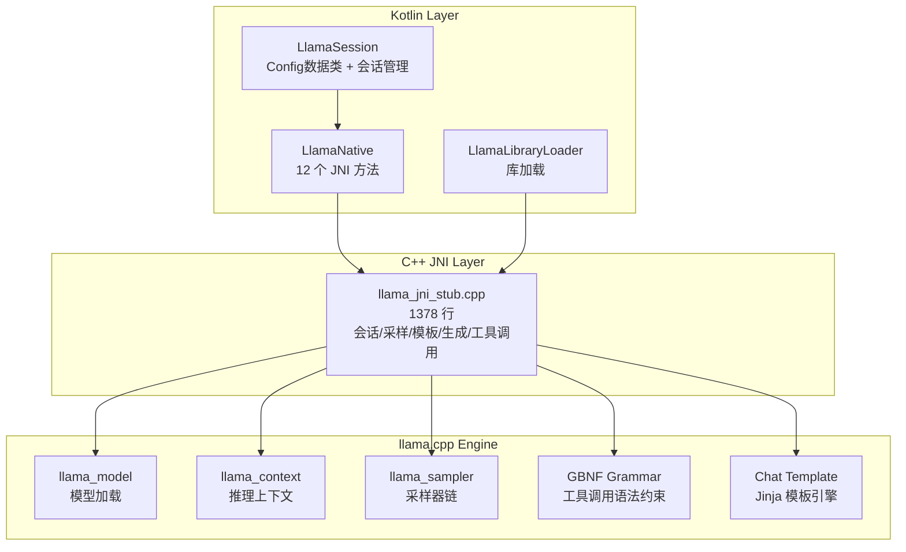

### CMake 配置

| 配置项 | 值 | 说明 |
|--------|-----|------|
| LLAMA_BUILD_COMMON | ON | 构建通用库 |
| LLAMA_BUILD_TESTS | OFF | 禁用测试 |
| LLAMA_BUILD_TOOLS | OFF | 禁用工具 |
| LLAMA_BUILD_SERVER | OFF | 禁用服务器 |
| 链接目标 | llama + common | 核心库 |

### JNI 方法清单

| 方法 | 签名 | 说明 |
|------|------|------|
| nativeIsAvailable | (): Boolean | 检查库可用性 |
| nativeGetUnavailableReason | (): String | 获取不可用原因 |
| nativeCreateSession | (pathModel, nThreads, nCtx, nBatch, nUBatch, nGpuLayers, useMmap, flashAttention, kvUnified, offloadKqv): Long | 创建会话 |
| nativeReleaseSession | (sessionPtr): Unit | 释放会话 |
| nativeCancel | (sessionPtr): Unit | 取消生成 |
| nativeCountTokens | (sessionPtr, text): Int | Token 计数 |
| nativeSetSamplingParams | (sessionPtr, temperature, topP, topK, repetitionPenalty, frequencyPenalty, presencePenalty, penaltyLastN): Boolean | 设置采样参数 |
| nativeApplyChatTemplate | (sessionPtr, roles[], contents[], addAssistant): String? | 应用聊天模板 |
| nativeApplyStructuredChatTemplate | (sessionPtr, messagesJson, toolsJson?, addAssistant): String? | 结构化模板 |
| nativeGenerateStream | (sessionPtr, prompt, maxTokens, callback): Boolean | 流式生成 |
| nativeClearToolCallGrammar | (sessionPtr): Boolean | 清除工具调用语法约束 |
| nativeParseToolCallResponse | (sessionPtr, content): String? | 解析工具调用响应 |

### LlamaSession.Config

```kotlin
data class Config(
    val nThreads: Int = 4,              // 推理线程数
    val nCtx: Int = 2048,               // 上下文长度
    val nBatch: Int = 512,              // 批处理大小
    val nUBatch: Int = 512,             // 无序批处理大小
    val nGpuLayers: Int = 0,            // GPU 卸载层数
    val useMmap: Boolean = false,       // 内存映射（Android 不推荐）
    val flashAttention: Boolean = false, // Flash Attention
    val kvUnified: Boolean = true,      // 统一 KV 缓存
    val offloadKqv: Boolean = false     // KQV 卸载到 GPU
)
```

---

## 统一接口层

### AIService 接口定义

```kotlin
interface AIService {
    val inputTokenCount: Int
    val cachedInputTokenCount: Int
    val outputTokenCount: Int

    fun resetTokenCounts()
    fun cancelStreaming()

    suspend fun getModelsList(context: Context): Result<List<ModelOption>>

    suspend fun sendMessage(
        context: Context,
        chatHistory: List<PromptTurn> = emptyList(),
        modelParameters: List<ModelParameter<*>> = emptyList(),
        enableThinking: Boolean = false,
        stream: Boolean = true,
        availableTools: List<ToolPrompt>? = null,
        preserveThinkInHistory: Boolean = false,
        onTokensUpdated: suspend (input: Int, cachedInput: Int, output: Int) -> Unit,
        onNonFatalError: suspend (error: String) -> Unit,
        enableRetry: Boolean = true
    ): Stream<String>

    suspend fun testConnection(context: Context): Result<String>
    suspend fun calculateInputTokens(chatHistory: List<PromptTurn>, availableTools: List<ToolPrompt>?): Int
    fun release()
}
```

### AIServiceFactory 创建逻辑

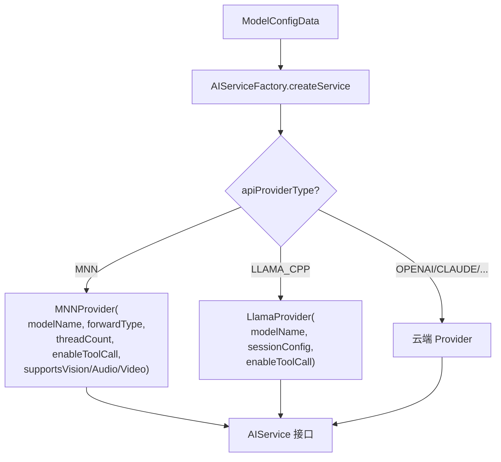

### 模型发现机制

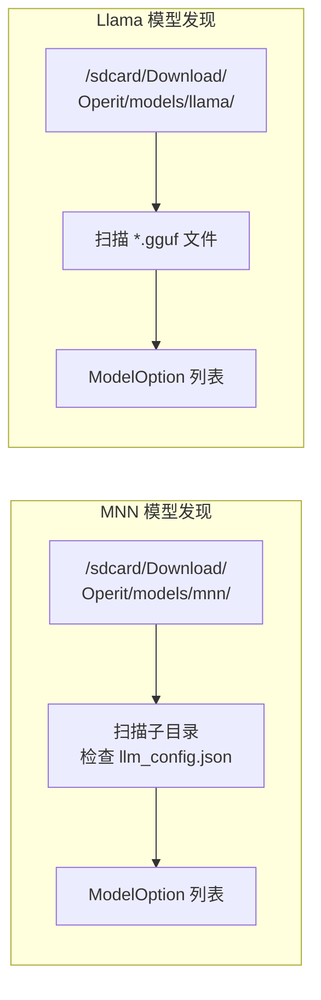

---

## 模型加载流程

### MNN 模型加载序列图

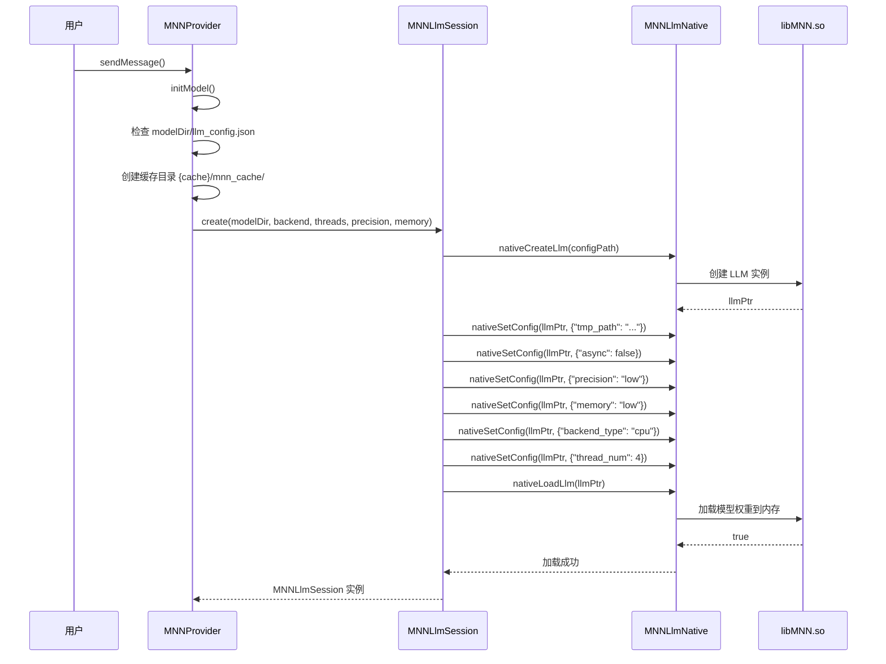

### Llama 模型加载序列图

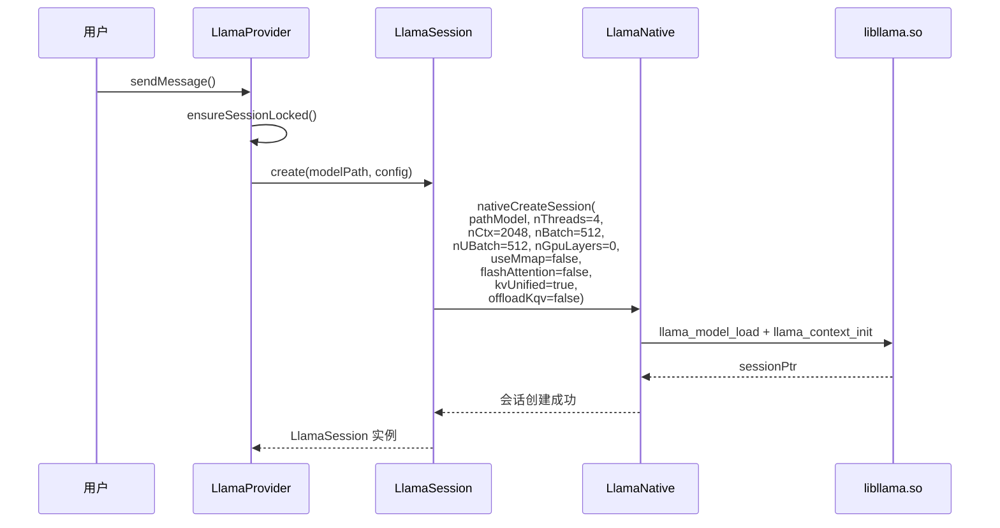

---

## 流式推理流程

### MNN 流式推理

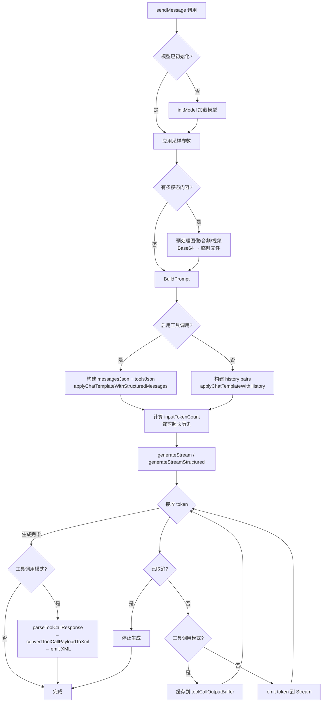

### Llama 流式推理

```mermaid
flowchart TD
    Start[sendMessage 调用] --> EnsureSession[ensureSessionLocked]
    EnsureSession --> SetSampling[设置采样参数<br/>temperature, topP, topK,<br/>repetitionPenalty 等]

    SetSampling --> ToolMode{启用工具调用?}
    ToolMode -->|是| StructTemplate[applyStructuredChatTemplate<br/>messagesJson + toolsJson]
    ToolMode -->|否| SimpleTemplate[applyChatTemplate<br/>roles[] + contents[]]

    StructTemplate --> CountTokens[countTokens 计算]
    SimpleTemplate --> CountTokens

    CountTokens --> Generate[generateStream<br/>prompt + maxTokens]
    Generate --> TokenLoop{接收 token}

    TokenLoop --> Cancelled{已取消?}
    Cancelled -->|是| Cancel[cancel + 停止]
    Cancelled -->|否| ToolEnabled{工具调用?}

    ToolEnabled -->|是| Buffer[缓存 toolCallOutputBuffer]
    ToolEnabled -->|否| EmitToken[emit token]

    Buffer --> TokenLoop
    EmitToken --> TokenLoop

    TokenLoop -->|完毕| PostProcess{工具调用模式?}
    PostProcess -->|是| ParseTool[clearToolCallGrammar<br/>parseToolCallResponse<br/>convertToolCallPayloadToXml<br/>emit XML]
    PostProcess -->|否| EmitFinal[emit finalOutputBuffer]
    ParseTool --> Done[完成]
    EmitFinal --> Done
    Cancel --> Done
```

---

## 工具调用处理

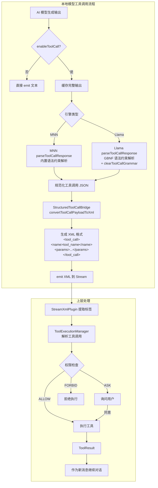

---

## 多模态处理

```mermaid
flowchart TD
    subgraph "图像处理链路"
        ImgInput[图像 Base64 数据] --> ImgDecode[解码为临时文件<br/>{cache}/mnn_media/]
        ImgDecode --> ImgProcess[MNNImageProcess 预处理<br/>缩放、归一化、均值]
        ImgProcess --> ImgTag["插入 &lt;img&gt; 标签<br/>到提示词"]
    end

    subgraph "音频处理链路"
        AudioInput[音频 Base64 数据] --> AudioDecode[解码为临时 WAV]
        AudioDecode --> AudioConvert[FFmpeg 转码<br/>16kHz 单声道 PCM]
        AudioConvert --> AudioTag["插入 &lt;audio&gt; 标签<br/>到提示词"]
    end

    subgraph "视频处理链路"
        VideoInput[视频 Base64 数据] --> VideoFrame[提取第一帧]
        VideoFrame --> VideoProcess[按图像处理流程]
        VideoProcess --> VideoTag["插入 &lt;img&gt; 标签<br/>（第一帧）"]
    end

    ImgTag --> FinalPrompt[组装最终提示词]
    AudioTag --> FinalPrompt
    VideoTag --> FinalPrompt
    FinalPrompt --> Inference[送入推理引擎]
```

> **注意**：多模态目前仅 MNN 引擎支持（supportsVision/supportsAudio/supportsVideo）

---

## GPU 加速配置

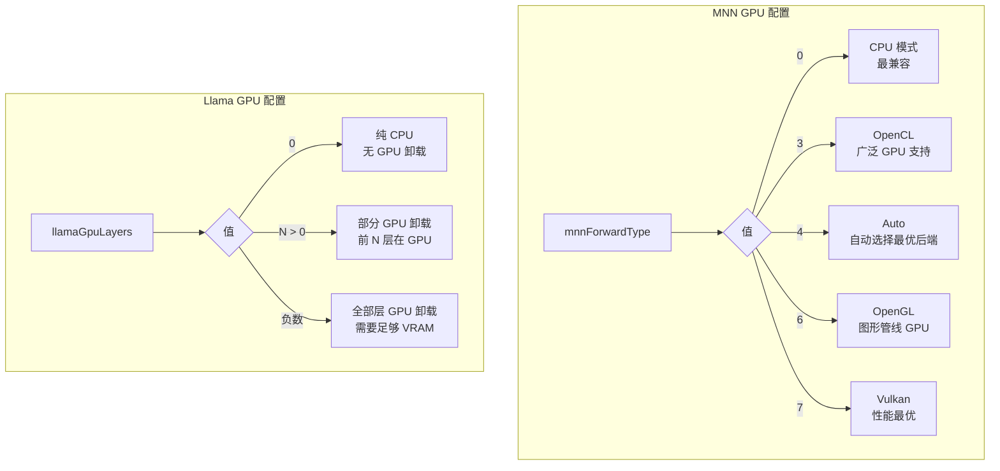

---

## 内存管理与生命周期

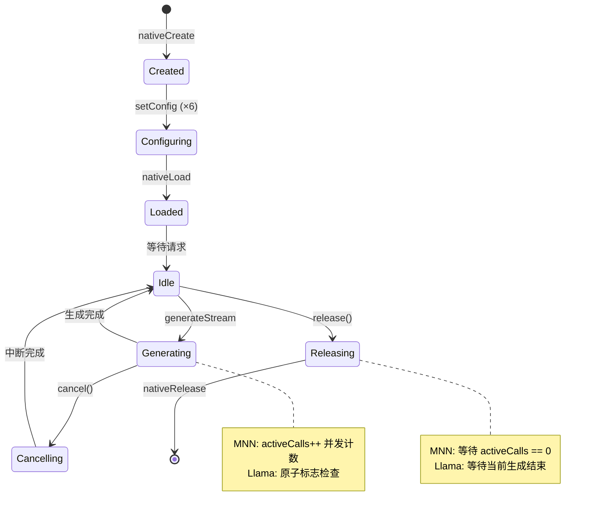

### MNN 并发控制

```kotlin
// 活跃调用计数保护
private var activeCalls: Int = 0
private val lock = Any()

fun generateStream(...) {
    synchronized(lock) {
        if (released) return false
        activeCalls++
    }
    try {
        // 执行推理...
    } finally {
        synchronized(lock) {
            activeCalls--
            if (released && activeCalls == 0) {
                nativeReleaseLlm(llmPtr)  // 最后释放
            }
        }
    }
}

fun release() {
    synchronized(lock) {
        released = true
        if (activeCalls == 0) {
            nativeReleaseLlm(llmPtr)
        }
        // 否则等最后一个调用结束时释放
    }
}
```

---

## 配置参数参考

### ModelConfigData 完整字段

| 字段 | 类型 | 默认值 | 说明 |
|------|------|--------|------|
| mnnForwardType | Int | 0 | MNN 前向类型 (0=CPU, 3=OpenCL, 4=Auto, 6=OpenGL, 7=Vulkan) |
| mnnThreadCount | Int | 4 | MNN 推理线程数 |
| llamaThreadCount | Int | 4 | Llama 推理线程数 |
| llamaContextSize | Int | 2048 | Llama 上下文长度 |
| llamaBatchSize | Int | 512 | Llama 批处理大小 |
| llamaUBatchSize | Int | 512 | Llama 无序批处理大小 |
| llamaGpuLayers | Int | 0 | Llama GPU 卸载层数 |
| llamaUseMmap | Boolean | false | Llama 内存映射 |
| llamaFlashAttention | Boolean | false | Llama Flash Attention |
| llamaKvUnified | Boolean | true | Llama KV 缓存统一 |
| llamaOffloadKqv | Boolean | false | Llama KQV GPU 卸载 |
| enableDirectImageProcessing | Boolean | false | 图像直接处理 |
| enableDirectAudioProcessing | Boolean | false | 音频直接处理 |
| enableDirectVideoProcessing | Boolean | false | 视频直接处理 |
| enableToolCall | Boolean | false | 启用工具调用 |

### MNN 配置设置顺序（严格）

| 顺序 | 配置 JSON | 说明 |
|------|-----------|------|
| 1 | `{"tmp_path": "..."}` | 缓存目录 |
| 2 | `{"async": false}` | 同步模式 |
| 3 | `{"precision": "low"}` | 精度模式 |
| 4 | `{"memory": "low"}` | 内存模式 |
| 5 | `{"backend_type": "cpu"}` | 后端类型 |
| 6 | `{"thread_num": 4}` | 线程数 |

> ⚠️ 必须在 `nativeLoadLlm()` 之前按此顺序设置

---

## 性能优化建议

### MNN 优化建议

| 配置项 | 推荐值 | 说明 |
|--------|--------|------|
| backend_type | auto/vulkan | Vulkan 性能最优（需设备支持） |
| precision | low | 移动设备推荐，显著降低内存 |
| memory | low | 内存受限设备推荐 |
| thread_num | CPU核数/2 | 避免过度竞争影响 UI |

### Llama 优化建议

| 配置项 | 推荐值 | 说明 |
|--------|--------|------|
| nThreads | CPU核数/2 | 平衡性能与功耗 |
| nBatch | 512-2048 | 根据可用内存调整 |
| nGpuLayers | 设备最大值 | 最大化 GPU 利用 |
| flashAttention | true | 显著减少 KV 缓存内存 |
| kvUnified | true | 降低内存碎片 |
| useMmap | false | Android 兼容性考虑 |

### 模型选择建议

| 设备 RAM | 推荐模型大小 | 推荐引擎 | 量化建议 |
|----------|-------------|----------|----------|
| 4GB | 1.5B-3B | MNN | 4-bit |
| 6GB | 3B-7B | MNN/Llama | Q4_K_M |
| 8GB+ | 7B-13B | Llama | Q4_0/Q4_K_M |
| 12GB+ | 13B+ | Llama | Q4_K_M/Q5_K_M |

---

## 故障排查指南

| 问题 | 症状 | 可能原因 | 解决方案 |
|------|------|----------|----------|
| 模型加载失败 | "Can't find type=3 backend" | MNN_SEP_BUILD=ON 导致后端缺失 | 确认 CMake 配置 MNN_SEP_BUILD=OFF |
| JNI 崩溃 | 应用闪退 SIGSEGV | ABI 不匹配或空指针 | 检查 arm64-v8a 配置 |
| Token 返回 0 | Token 计数始终为 0 | 配置设置顺序错误 | 严格按 6 步顺序设置 |
| 流式生成卡顿 | 长时间无 token | 线程数过高竞争 | 降低 nThreads |
| 工具调用解析失败 | XML 格式错误 | enableToolCall 未启用 | 检查配置项 |
| OOM 异常 | 内存溢出崩溃 | 模型过大/上下文过长 | 降低 nCtx、启用 lowMemory |
| Vulkan 不可用 | 回退到 CPU | 设备不支持 Vulkan | 使用 forwardType=4 (Auto) |
| 模型目录未找到 | 文件不存在错误 | 路径配置错误 | 检查 /sdcard/Download/Operit/models/ |
| 生成内容为空 | 无输出 | 模板应用失败 | 检查 llm_config.json 中的 chat_template |
| 取消无效 | 无法停止生成 | cancel 标志未传递 | 检查 gCancelFlags 映射 |
| 音频处理失败 | 音频转码错误 | FFmpeg 不可用 | 确认 FFmpeg 已安装在终端环境 |
| 库加载失败 | UnsatisfiedLinkError | so 文件缺失 | 检查 app/libs/ 或 jniLibs/ 目录 |

---

## 核心文件索引

### MNN 模块

| 文件 | 行数 | 职责 |
|------|------|------|
| `mnn/CMakeLists.txt` | - | C++ 编译配置 |
| `mnn/build.gradle.kts` | - | Gradle 模块配置 |
| `mnn/src/main/cpp/mnnllmnative.cpp` | ~1200 | LLM JNI 完整实现 |
| `mnn/src/main/java/.../MNNLlmSession.kt` | 433 | 会话管理与并发控制 |
| `mnn/src/main/java/.../MNNLlmNative.kt` | 215 | JNI 接口声明 |
| `mnn/src/main/java/.../MNNForwardType.kt` | - | GPU 后端枚举 |
| `mnn/src/main/java/.../MNNImageProcess.kt` | - | 图像预处理 |

### Llama 模块

| 文件 | 行数 | 职责 |
|------|------|------|
| `llama/CMakeLists.txt` | - | C++ 编译配置 |
| `llama/build.gradle.kts` | - | Gradle 模块配置 |
| `llama/src/main/cpp/llama_jni_stub.cpp` | 1378 | JNI 完整实现 |
| `llama/src/main/java/.../LlamaSession.kt` | 187 | 会话管理 |
| `llama/src/main/java/.../LlamaNative.kt` | 82 | JNI 接口声明 |

### 应用集成

| 文件 | 行数 | 职责 |
|------|------|------|
| `app/.../llmprovider/AIService.kt` | - | 统一接口定义 |
| `app/.../llmprovider/MNNProvider.kt` | 1001 | MNN 服务实现 |
| `app/.../llmprovider/LlamaProvider.kt` | 396 | Llama 服务实现 |
| `app/.../llmprovider/AIServiceFactory.kt` | - | 服务工厂 |
| `app/.../llmprovider/ModelListFetcher.kt` | - | 模型发现 |
| `app/.../llmprovider/StructuredToolCallBridge.kt` | - | 工具调用桥接 |
| `app/.../data/model/ModelConfigData.kt` | - | 配置数据模型 |

---

## 总结

Operit 的本地 AI 推理模块通过清晰的分层架构实现了：

1. **双引擎并行**：MNN 和 llama.cpp 互为补充，覆盖不同使用场景
2. **统一抽象**：AIService 接口屏蔽引擎差异，上层零感知切换
3. **完整功能**：流式输出、工具调用、多模态、GPU 加速全面支持
4. **资源安全**：并发控制、取消机制、内存管理确保移动端稳定运行
5. **灵活配置**：ModelConfigData 支持细粒度参数调整，适配不同设备

该设计充分考虑了移动端资源约束，为用户提供了流畅的本地 AI 推理体验。
