# Operit AI 项目快速入手指南

> **当前版本**：v1.10.1 | **适用平台**：Android 8.0+（minSdk 26）  
> **目标读者**：刚接触本项目的开发者，希望快速了解架构、模块和核心流程

---

## 目录

1. [项目概述](#1-项目概述)
2. [技术栈总览](#2-技术栈总览)
3. [整体软件架构](#3-整体软件架构)
4. [模块结构与依赖](#4-模块结构与依赖)
5. [App 模块包结构](#5-app-模块包结构)
6. [核心业务流程](#6-核心业务流程)
   - 6.1 [AI 对话完整流程](#61-ai-对话完整流程)
   - 6.2 [工具调用流程](#62-工具调用流程)
   - 6.3 [脚本引擎工作原理](#63-脚本引擎工作原理)
   - 6.4 [工具包生命周期](#64-工具包生命周期)
   - 6.5 [工作流执行流程](#65-工作流执行流程)
   - 6.6 [记忆系统架构](#66-记忆系统架构)
7. [数据存储架构](#7-数据存储架构)
8. [应用初始化流程](#8-应用初始化流程)
9. [服务架构](#9-服务架构)
10. [构建指南](#10-构建指南)
11. [开发指引](#11-开发指引)

---

## 1. 项目概述

**Operit AI** 是移动端首个功能完备的开源 AI 智能助手应用，具备以下核心能力：

| 能力 | 说明 |
|------|------|
| 本地推理 | 集成 MNN / llama.cpp，设备端离线运行 AI 模型 |
| 云端 AI | 支持 OpenAI、Claude、Gemini、Deepseek 等主流云端服务 |
| 插件生态 | MCP 包、Skill 包、Sandbox Package 三种插件形式 |
| 终端环境 | 内置 Ubuntu 24 终端，支持完整 Linux 命令 |
| 工作流 | 可视化工作流引擎，支持定时、Tasker、Intent 触发 |
| 记忆系统 | 向量嵌入 + RRF 排名融合的持久化记忆存储 |
| 虚拟形象 | 支持骨骼动画（DragonBones）、MMD、FBX 3D 模型 |
| 悬浮窗 | 全局悬浮窗 AI 助手，随时调用 |

---

## 2. 技术栈总览

```
语言与框架
├── Kotlin 2.2.0 + Java 17
├── Jetpack Compose BOM 2026.02.01
└── TypeScript (web-chat 前端)

AI 推理
├── MNN (本地神经网络推理)
├── llama.cpp (本地 LLM 推理)
└── 云端：OpenAI / Claude / Gemini / Deepseek

数据存储
├── ObjectBox v5.3.0 (NoSQL，记忆/文档)
├── Room (聊天历史，版本 18)
└── DataStore (用户配置/偏好)

脚本与插件
├── QuickJS (JavaScript 引擎)
└── ToolPkg (ZIP 格式插件包)

图像与媒体
├── Glide 4.16.0
└── Coil 2.5.0

网络
└── OkHttp 4.12.0 + SSE 流式传输

向量搜索
└── HNSWLib 0.0.46

中文处理
└── jieba 1.0.2 (中文分词)

构建工具
├── AGP 8.13.2
├── compileSdk 36 / minSdk 26 / targetSdk 34
└── NDK 25.1 (Native 库编译)
```

---

## 3. 整体软件架构

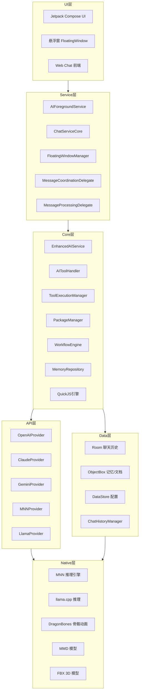

---

## 4. 模块结构与依赖

### 模块列表

```
Operit (根项目)
├── :app          # 主应用模块（UI、核心逻辑、数据层）
├── :quickjs      # QuickJS JavaScript 引擎（Native JNI）
├── :mnn          # MNN 推理引擎（Native JNI）
├── :llama        # llama.cpp 推理（Native JNI）
├── :terminal     # Ubuntu 24 终端环境
├── :dragonbones  # 骨骼动画（Native JNI）
├── :mmd          # MMD 模型渲染（Native JNI）
├── :fbx          # FBX 3D 模型（Native JNI）
├── :showerclient # Shower 客户端通信协议
└── web-chat/     # Web 聊天前端（TypeScript + Vite，独立 Node.js 项目）
```

### 模块依赖关系图

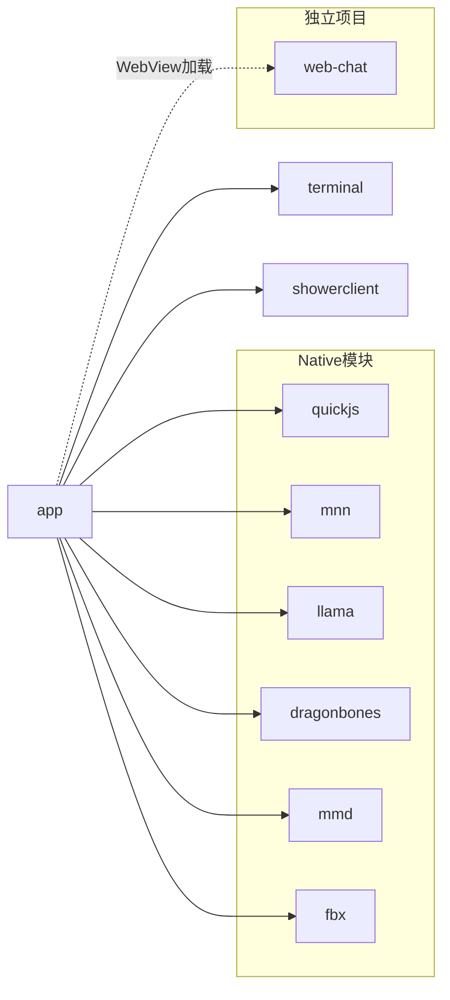

### 各模块说明

| 模块 | 职责 | 关键技术 |
|------|------|----------|
| `:app` | 主应用，包含所有 UI、核心逻辑、数据层 | Compose, Room, ObjectBox |
| `:quickjs` | 嵌入 QuickJS JS 引擎，提供脚本执行能力 | C/C++, JNI |
| `:mnn` | 集成阿里 MNN 框架做本地 AI 推理 | C++, JNI |
| `:llama` | 集成 llama.cpp 做本地 LLM 推理 | C++, JNI |
| `:terminal` | Ubuntu 24 终端环境，支持完整 Linux | PRoot/chroot |
| `:dragonbones` | DragonBones 骨骼动画运行时 | C++, OpenGL |
| `:mmd` | MMD（MikuMikuDance）模型渲染 | C++, OpenGL |
| `:fbx` | FBX 3D 模型加载（基于 ufbx 库） | C++, ufbx |
| `:showerclient` | Shower 远程控制通信客户端 | WebSocket |
| `web-chat/` | Web 聊天界面，打包后嵌入 app assets | TypeScript, Vite |

---

## 5. App 模块包结构

```
app/src/main/java/com/ai/assistance/operit/
├── ui/                        # Compose UI 层
│   ├── main/                  # 主 Activity 和主屏幕路由
│   ├── features/              # 功能屏
│   │   ├── chat/              # 聊天界面
│   │   ├── settings/          # 设置
│   │   ├── model/             # 模型管理
│   │   ├── memory/            # 记忆管理
│   │   ├── workflow/          # 工作流编辑
│   │   ├── terminal/          # 终端界面
│   │   └── web/               # 内嵌 Web 聊天
│   ├── floating/              # 悬浮窗 UI 组件
│   ├── common/                # 通用 Compose 组件
│   └── theme/                 # 主题系统（颜色、字体）
│
├── data/                      # 数据层
│   ├── db/                    # 数据库初始化（Room + ObjectBox）
│   ├── model/                 # Entity 数据模型
│   ├── dao/                   # Room DAO 接口
│   ├── repository/            # Repository
│   │   ├── ChatHistoryManager.kt    (2565 行，聊天历史管理)
│   │   └── MemoryRepository.kt      (2815 行，记忆存储管理)
│   ├── preferences/           # DataStore 配置存取
│   └── backup/                # 数据备份与恢复
│
├── core/                      # 核心业务层
│   ├── application/
│   │   └── OperitApplication.kt     (653 行，应用入口)
│   ├── tools/                 # 工具系统
│   │   ├── AIToolHandler.kt         (431 行，工具核心调度)
│   │   ├── defaultTool/             # 内置工具集
│   │   │   ├── standard/            # 标准工具（文件、网络、系统）
│   │   │   ├── admin/               # 管理工具
│   │   │   ├── debug/               # 调试工具
│   │   │   ├── root/                # Root 权限工具
│   │   │   └── accessibility/       # 无障碍工具
│   │   ├── javascript/              # JS 工具桥接
│   │   └── packTool/
│   │       └── PackageManager.kt    (3497 行，插件包管理)
│   ├── workflow/              # 工作流引擎
│   └── avatar/                # 虚拟形象管理
│
├── api/                       # AI API 层
│   └── chat/
│       ├── llmprovider/       # AI 服务提供者
│       │   ├── AIService.kt         (接口定义)
│       │   ├── OpenAIProvider.kt    (2476 行)
│       │   ├── ClaudeProvider.kt    (1805 行)
│       │   ├── GeminiProvider.kt    (1937 行)
│       │   ├── MNNProvider.kt       (1001 行)
│       │   └── LlamaProvider.kt     (396 行)
│       ├── EnhancedAIService.kt     (2998 行，AI服务增强层)
│       └── enhance/
│           └── ToolExecutionManager.kt  (816 行)
│
├── services/                  # Android 服务层
│   └── core/
│       ├── MessageCoordinationDelegate.kt   (1827 行)
│       └── MessageProcessingDelegate.kt     (1693 行)
│
├── plugins/                   # 插件系统
│   └── toolpkg/               # ToolPkg 加载与 JS 桥接
│
├── integrations/              # 外部集成
│   ├── tasker/                # Tasker 集成
│   ├── http/                  # HTTP API 集成
│   └── intent/                # Intent 集成
│
└── util/                      # 工具类
    ├── stream/
    │   ├── Stream.kt                (253 行，流式框架)
    │   └── plugins/
    │       ├── StreamXmlPlugin.kt   (工具调用XML解析)
    │       └── StreamMarkdownPlugin.kt  (1509 行，Markdown渲染)
    └── ...
```

---

## 6. 核心业务流程

### 6.1 AI 对话完整流程

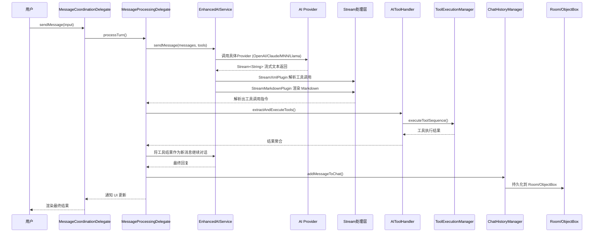

### 6.2 工具调用流程

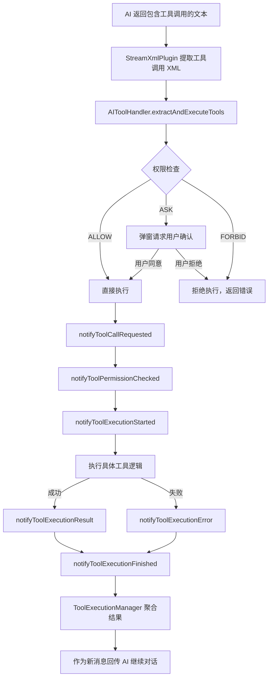

**工具注册方式：**
```kotlin
// 在 AIToolHandler 中注册自定义工具
toolHandler.registerTool("myTool") { params ->
    // 工具实现逻辑
    ToolResult.success("执行结果")
}
```

**权限等级说明：**

| 权限等级 | 行为 |
|----------|------|
| `ALLOW` | 自动执行，无需确认 |
| `ASK` | 每次执行前弹窗询问用户 |
| `FORBID` | 始终拒绝，返回错误信息 |

### 6.3 脚本引擎工作原理

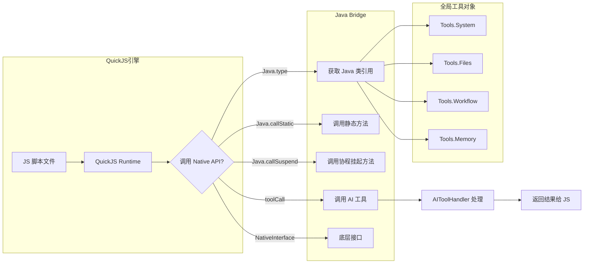

**常用 JS API 示例：**
```javascript
// 调用系统工具
const result = await toolCall('readFile', { path: '/sdcard/test.txt' });

// 使用全局对象
const sysInfo = Tools.System.getDeviceInfo();

// 调用 Java 方法
const context = Java.type('android.content.Context');
```

### 6.4 工具包生命周期

工具包（ToolPkg）是 ZIP 格式的插件包，包含 `manifest.json` + 脚本文件 + 资源文件。

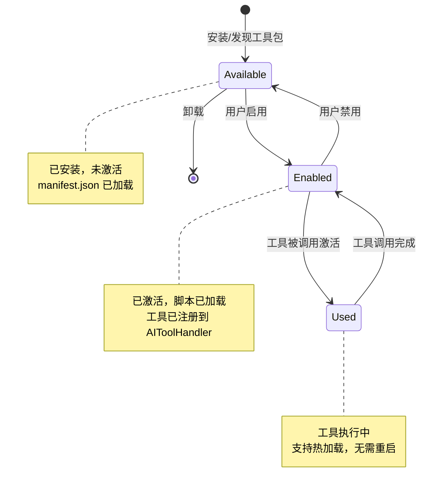

**三种包类型：**

| 类型 | 说明 | 用途 |
|------|------|------|
| MCP 包 | Model Context Protocol 标准包 | 标准化 AI 工具扩展 |
| Skill 包 | 技能脚本包 | 自定义 JS 功能脚本 |
| Sandbox Package | 沙箱安全包 | 隔离执行的受限脚本 |

**manifest.json 结构示例：**
```json
{
  "name": "my-tool-pkg",
  "version": "1.0.0",
  "type": "skill",
  "entry": "main.js",
  "tools": [
    {
      "name": "myTool",
      "description": "工具描述",
      "parameters": { ... }
    }
  ]
}
```

### 6.5 工作流执行流程

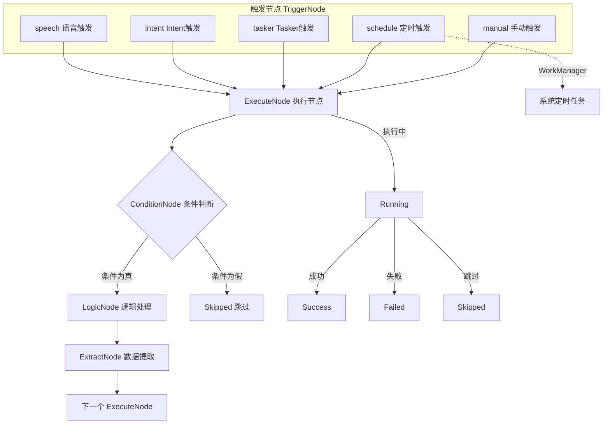

**节点类型说明：**

| 节点类型 | 功能 |
|----------|------|
| `TriggerNode` | 工作流入口，支持多种触发方式 |
| `ExecuteNode` | 执行 AI 任务或调用工具 |
| `ConditionNode` | 条件分支，根据结果决定走向 |
| `LogicNode` | 逻辑运算（AND/OR/NOT 等） |
| `ExtractNode` | 从上一步结果中提取数据 |

### 6.6 记忆系统架构

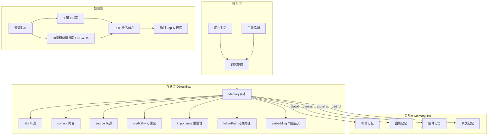

---

## 7. 数据存储架构

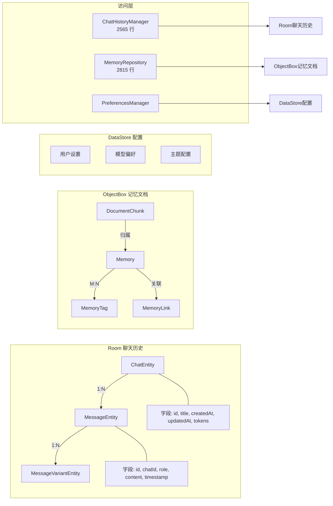

**各存储职责：**

| 存储 | 版本 | 存储内容 | 访问类 |
|------|------|----------|--------|
| Room | v18 | 聊天记录、消息、消息变体 | ChatHistoryManager |
| ObjectBox | v5.3 | 记忆、标签、文档分块 | MemoryRepository |
| DataStore | — | 用户设置、模型配置、主题 | PreferencesManager |

---

## 8. 应用初始化流程

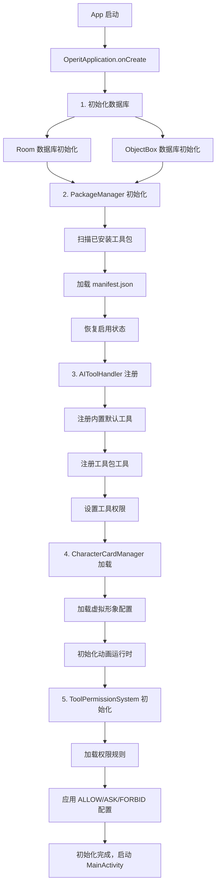

**`OperitApplication` 关键职责（653 行）：**
- 全局单例容器（DI 根节点）
- 数据库连接池管理
- 工具系统启动与协调
- 异常处理与崩溃上报

---

## 9. 服务架构

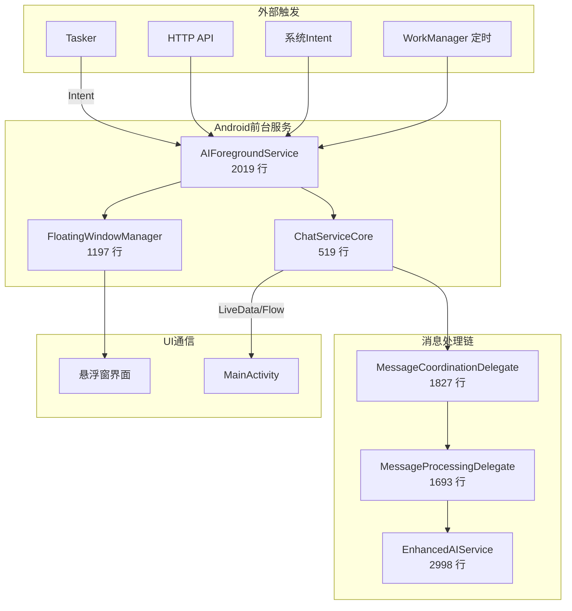

**关键服务说明：**

| 服务/组件 | 行数 | 职责 |
|-----------|------|------|
| `AIForegroundService` | 2019 | 前台服务，保活后台 AI 对话 |
| `ChatServiceCore` | 519 | 聊天会话核心逻辑 |
| `FloatingWindowManager` | 1197 | 悬浮窗生命周期管理 |
| `MessageCoordinationDelegate` | 1827 | 消息协调，多来源统一入口 |
| `MessageProcessingDelegate` | 1693 | 消息处理，驱动 AI 对话循环 |

---

## 10. 构建指南

### 环境要求

| 工具 | 版本要求 |
|------|----------|
| JDK | 17 |
| Android SDK | 36 |
| NDK | 25.1.8937393 |
| Node.js | 16+ |
| Python | 3.8+ |
| Git | 支持 submodule |

### 构建步骤

#### 第一步：克隆仓库（含子模块）
```bash
git clone --recurse-submodules https://github.com/your-org/Operit.git
cd Operit
```

如果已克隆但忘了 `--recurse-submodules`：
```bash
git submodule update --init --recursive
```

#### 第二步：下载预编译资源

从 Google Drive 下载以下压缩包并解压到对应目录：

| 文件 | 解压目标 |
|------|----------|
| `models.zip` | `app/src/main/assets/models/` |
| `subpack.zip` | `app/src/main/assets/subpack/` |
| `jniLibs.zip` | `app/src/main/jniLibs/` |
| `libs.zip` | `app/libs/` |

#### 第三步：构建 Web 前端
```bash
npm --prefix web-chat install
npm run build:webchat
```

#### 第四步：同步示例包
```bash
python3 sync_example_packages.py
```

#### 第五步：构建 APK
```bash
# Debug 版本
./gradlew assembleDebug

# Release 版本（需配置签名）
./gradlew assembleRelease

# Nightly 版本
./gradlew assembleNightly
```

### 构建类型

| 类型 | 说明 | 适用场景 |
|------|------|----------|
| `debug` | 包含调试信息，不混淆 | 开发调试 |
| `release` | 混淆压缩，需签名 | 正式发布 |
| `nightly` | 夜间构建，可能不稳定 | 测试最新特性 |

### Gradle 性能优化配置

`gradle.properties` 中已配置以下优化：
```properties
# JVM 堆内存 8GB
org.gradle.jvmargs=-Xmx8g

# 并行构建 16 个 Worker
org.gradle.workers.max=16

# 启用构建缓存
org.gradle.caching=true
```

---

## 11. 开发指引

### 新增 AI 工具

1. 在 `core/tools/defaultTool/` 下创建工具实现文件
2. 实现工具执行逻辑，返回 `ToolResult`
3. 在 `AIToolHandler` 中调用 `registerTool()` 注册
4. 在 `ToolPermissionSystem` 中配置默认权限等级

```kotlin
// 示例：注册一个自定义工具
class MyCustomTool {
    fun register(handler: AIToolHandler) {
        handler.registerTool("myCustomTool") { params ->
            val input = params["input"]?.toString() ?: ""
            // 执行业务逻辑
            ToolResult.success("处理结果: $input")
        }
    }
}
```

### 新增 AI Provider

1. 在 `api/chat/llmprovider/` 下创建新 Provider 类
2. 实现 `AIService` 接口，重点实现 `sendMessage()` 返回 `Flow<String>`
3. 在 `EnhancedAIService` 中注册新 Provider
4. 在设置界面添加 Provider 选项

```kotlin
class MyProvider : AIService {
    override suspend fun sendMessage(
        messages: List<Message>,
        tools: List<Tool>
    ): Flow<String> = flow {
        // 实现流式响应
        emit("响应文本片段")
    }
}
```

### 新增工具包（ToolPkg）

1. 创建 `manifest.json` 定义工具元数据
2. 编写 `main.js` 实现工具逻辑
3. 打包为 ZIP 格式
4. 放入设备的工具包目录，App 会自动发现

**最小化工具包结构：**
```
my-tool-pkg.zip
├── manifest.json    # 工具元数据（必须）
├── main.js          # 入口脚本（必须）
└── assets/          # 静态资源（可选）
```

### 开发工作流节点

1. 在 `core/workflow/` 下找到节点基类
2. 继承对应节点类型（`ExecuteNode` / `ConditionNode` 等）
3. 实现 `execute()` 方法
4. 在工作流编辑器 UI 中注册新节点类型

### 调试技巧

**查看工具调用日志：**
```bash
adb logcat -s "AIToolHandler" "ToolExecutionManager"
```

**查看 AI 对话流：**
```bash
adb logcat -s "EnhancedAIService" "MessageProcessingDelegate"
```

**查看插件包加载：**
```bash
adb logcat -s "PackageManager"
```

### 重要文件索引

| 文件/位置 | 用途 | 关注场景 |
|-----------|------|----------|
| `OperitApplication.kt` | 应用入口，初始化顺序 | 调试启动问题 |
| `AIToolHandler.kt` | 工具调度核心 | 工具开发/调试 |
| `EnhancedAIService.kt` | AI 服务增强层 | AI 对话逻辑 |
| `PackageManager.kt` | 插件包管理 | 插件开发 |
| `ChatHistoryManager.kt` | 聊天历史 | 数据持久化 |
| `MemoryRepository.kt` | 记忆系统 | 记忆功能开发 |
| `Stream.kt` | 流式处理框架 | 流式输出处理 |
| `StreamXmlPlugin.kt` | XML工具调用解析 | 工具调用解析 |

---

> **提示**：项目使用 Kotlin Coroutines + Flow 进行异步处理，建议熟悉 `StateFlow`、`SharedFlow` 和 `suspend` 函数。数据库操作均在 IO 协程上下文中执行，UI 更新通过 `collectAsState()` 在 Compose 中响应式绑定。

---

*本文档基于 Operit AI v1.10.1 编写，如有更新请参考最新源码。*
