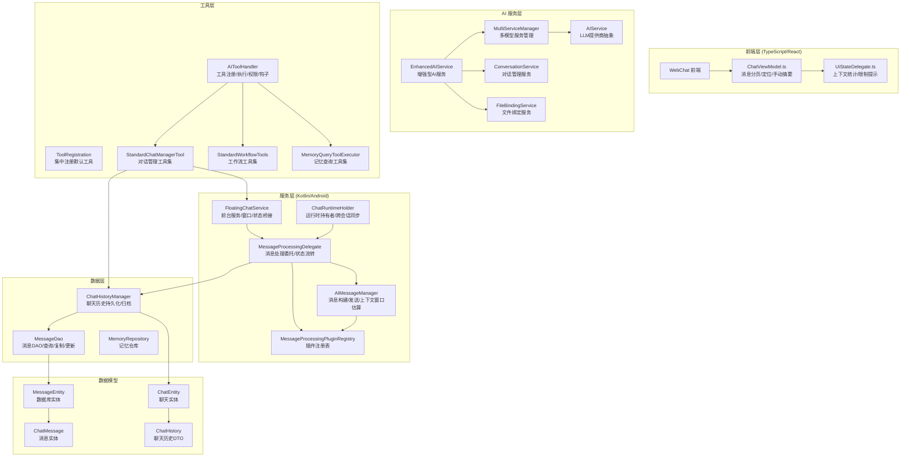
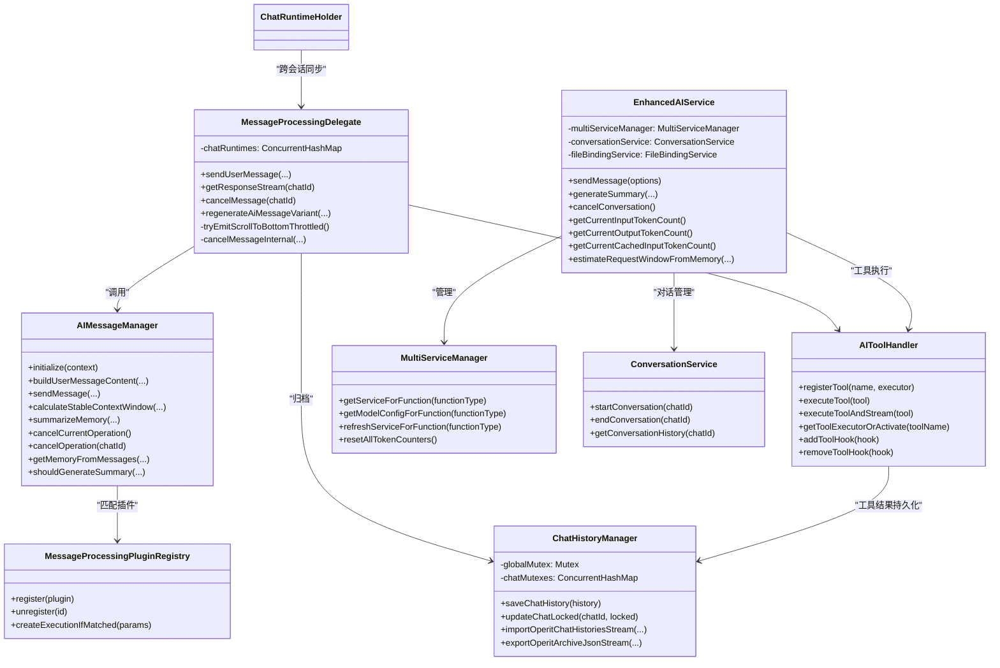
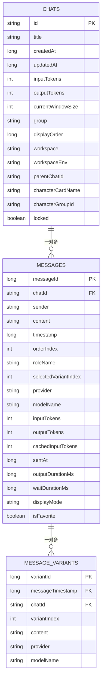
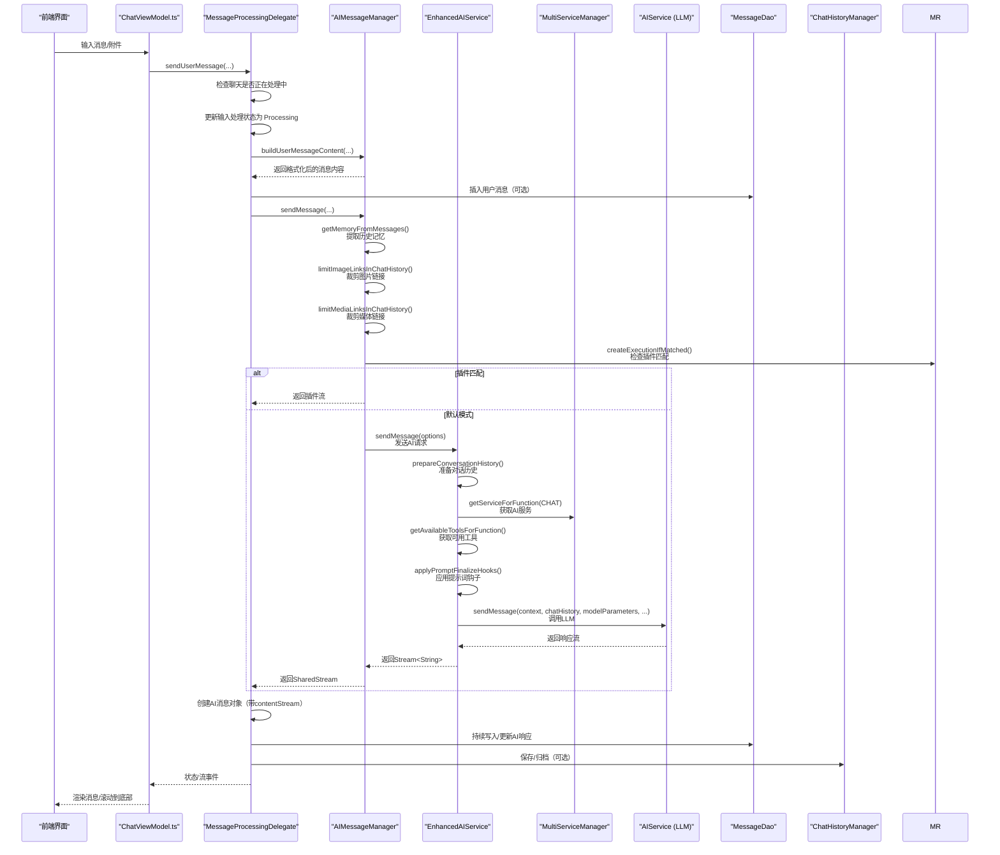
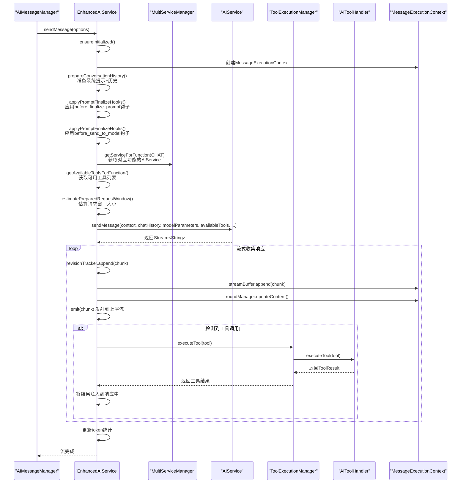
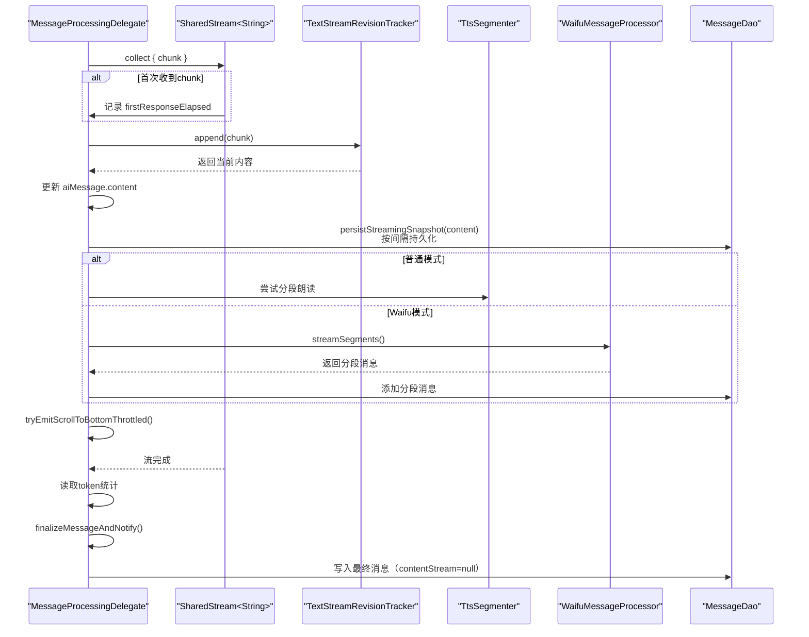
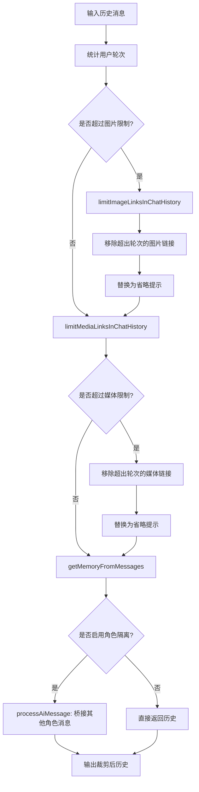
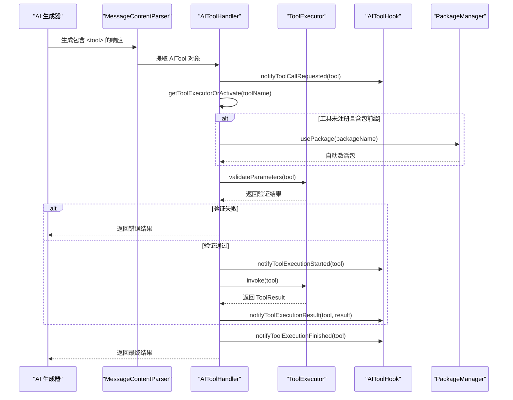
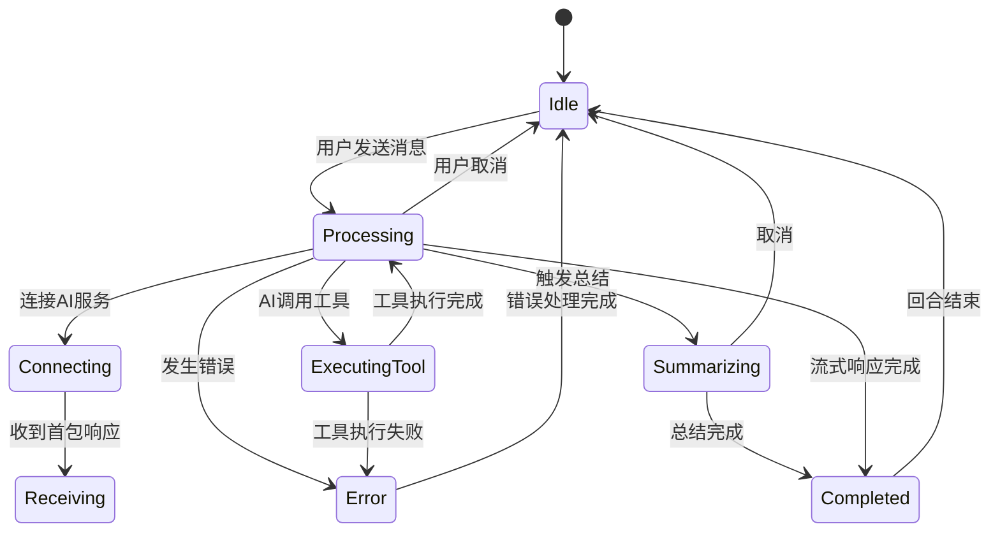
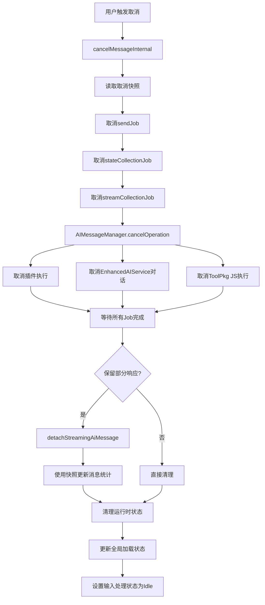

# Operit AI 对话系统设计思想与详细流程分析

## 一、设计思想概述

Operit 的 AI 对话系统采用**"分层架构 + 流式处理 + 插件扩展 + 多模态支持"**的设计思想，核心设计理念包括：

1. **无状态核心管理器**：`AIMessageManager` 作为单例对象，不持有任何特定聊天的状态，所有数据通过方法参数传入，确保高并发场景下的线程安全与可复用性
2. **委托-代理模式**：`MessageProcessingDelegate` 负责端到端的消息处理流程编排，将 UI 状态管理、数据持久化、AI 服务调用解耦
3. **流式响应优先**：支持 `SharedStream` 流式输出与实时渲染，通过 `TextStreamRevisionTracker` 实现内容回溯与修订
4. **上下文智能管理**：通过总结生成、媒体链接裁剪、角色隔离等策略，有效控制上下文窗口大小
5. **插件化扩展**：`MessageProcessingPluginRegistry` 提供可插拔的消息处理机制，允许第三方插件接管消息流程
6. **多模态支持**：原生支持文本、图片、音频、视频、附件、工作区等多种输入输出形式
7. **并发安全**：使用 `ConcurrentHashMap`、`Mutex` 等机制保护聊天与消息的写入操作

---

## 二、软件架构图

### 2.1 整体架构分层



### 2.2 核心组件依赖关系



---

## 三、数据模型设计

### 3.1 ER 关系图



### 3.2 核心数据类

| 类名 | 职责 | 关键字段 |
|------|------|----------|
| `ChatMessage` | 运行态消息，跨进程传输 | sender, content, timestamp, roleName, contentStream, inputTokens, outputTokens, cachedInputTokens |
| `MessageEntity` | Room 数据库实体 | messageId, chatId, sender, content, orderIndex, displayMode |
| `ChatEntity` | 聊天元数据实体 | id, title, createdAt, characterCardName, characterGroupId, locked |
| `ChatHistory` | 聊天历史 DTO | id, title, messages, inputTokens, outputTokens, currentWindowSize |
| `PromptTurn` | AI 请求的历史回合 | kind (USER/ASSISTANT/SUMMARY), content |
| `MessageExecutionContext` | 单次请求执行上下文 | executionId, streamBuffer, roundManager, isConversationActive, eventChannel |

---

## 四、AI 对话详细流程

### 4.1 消息发送主流程



### 4.2 EnhancedAIService 内部消息处理流程



### 4.3 流式响应处理流程



### 4.4 上下文窗口管理流程



### 4.5 工具调用处理流程



### 4.6 消息生命周期状态机



### 4.7 取消与清理流程



---

## 五、核心机制详解

### 5.1 历史记忆提取（getMemoryFromMessages）

```kotlin
fun getMemoryFromMessages(
    messages: List<ChatMessage>,
    splitByRole: Boolean = false,
    targetRoleName: String? = null,
    groupOrchestrationMode: Boolean = false
): List<PromptTurn>
```

**处理逻辑**：
1. 找到最后一条总结消息，只处理总结之后的消息
2. 判断是否启用角色隔离模式（`splitByRole && targetRoleName != null`）
3. 处理每条消息：
   - **AI消息**：清理思考内容，角色隔离模式下将其他角色消息桥接为用户消息（添加 `[From role: xxx]` 前缀）
   - **用户消息**：群组编排模式下添加 `[From user]` 前缀
   - **总结消息**：转换为 `PromptTurnKind.SUMMARY`

### 5.2 媒体链接裁剪策略

```kotlin
private fun limitImageLinksInChatHistory(
    history: List<PromptTurn>,
    keepLastUserImageTurns: Int
): List<PromptTurn>
```

**策略说明**：
- 按用户轮次统计，只保留最近 N 轮用户消息中的图片链接
- 超出限制的图片链接被移除，内容替换为 `[图片内容已省略]`
- 同理适用于音视频链接（`limitMediaLinksInChatHistory`）

### 5.3 并发安全机制

```kotlin
// ChatHistoryManager 中的互斥锁
private val globalMutex = Mutex()
private val chatMutexes = ConcurrentHashMap<String, Mutex>()

private fun chatMutex(chatId: String): Mutex {
    return chatMutexes.getOrPut(chatId) { Mutex() }
}
```

**保护措施**：
- 每个聊天有独立的 `Mutex`，确保同一聊天内的写入串行化
- 归档保存前对消息时间戳进行去重校验
- 批量插入消息与变体时，先删除旧数据再插入，保证原子性

### 5.4 跨会话同步机制

```kotlin
class ChatRuntimeHolder {
    private val cores = ConcurrentHashMap<ChatRuntimeSlot, ChatServiceCore>()
    
    private fun setupCrossSessionSync() {
        registerChatSelectionSync(MAIN -> FLOATING)
        registerTurnSync(MAIN -> FLOATING)
        registerTurnSync(FLOATING -> MAIN)
    }
}
```

**同步内容**：
- **聊天选择同步**：主会话切换聊天时，自动同步到浮动窗口
- **回合完成同步**：回合结束后，同步 token 统计和消息重载

### 5.5 插件扩展机制

```kotlin
interface MessageProcessingPlugin {
    val id: String
    suspend fun createExecutionIfMatched(
        params: MessageProcessingHookParams
    ): MessageProcessingExecution?
}

object MessageProcessingPluginRegistry {
    private val plugins = CopyOnWriteArrayList<MessageProcessingPlugin>()
    
    suspend fun createExecutionIfMatched(params): MessageProcessingExecution? {
        for (plugin in plugins) {
            val execution = plugin.createExecutionIfMatched(params)
            if (execution != null) return execution
        }
        return null
    }
}
```

**扩展点**：
- 开发者可注册自定义插件接管消息处理流程
- 插件匹配成功后，完全接管后续的消息发送与响应处理

### 5.6 提示词钩子系统（PromptHookRegistry）

```kotlin
object PromptHookRegistry {
    fun dispatchPromptFinalizeHooks(context: PromptHookContext): PromptHookContext
    fun dispatchPromptEstimateHistoryHooks(context: PromptHookContext): PromptHookContext
    fun dispatchPromptEstimateFinalizeHooks(context: PromptHookContext): PromptHookContext
}
```

**钩子阶段**：
1. **before_finalize_prompt**：在提示词最终确定前，允许修改 processedInput 和 preparedHistory
2. **before_send_to_model**：在发送到模型前，进行最后的调整
3. **estimate 阶段**：在估算窗口大小时应用钩子

### 5.7 流式修订机制（TextStreamRevisionTracker）

```kotlin
class TextStreamRevisionTracker {
    fun append(chunk: String): String
    fun savepoint(id: String)
    fun rollback(id: String): String?
}
```

**工作原理**：
- 支持 SAVEPOINT 和 ROLLBACK 事件
- 当 AI 决定回溯内容时，可以回退到之前的保存点
- 通过 `TextStreamEventCarrier` 在流中传递修订事件

---

## 六、性能优化策略

| 优化点 | 实现方式 | 效果 |
|--------|----------|------|
| 流式输出 | `SharedStream.shareRevisable(replay = Int.MAX_VALUE)` | 减少等待时间，支持UI重组后恢复 |
| 滚动节流 | `STREAM_SCROLL_THROTTLE_MS = 200L` | 降低UI抖动 |
| 持久化间隔 | `STREAM_PERSIST_INTERVAL_MS = 1000L` | 减少数据库IO压力 |
| 媒体链接裁剪 | 按用户轮次限制图片/音视频链接 | 显著降低上下文体积 |
| 稳定窗口估算 | `calculateStableContextWindow()` | 避免频繁超限重试 |
| 流式导入导出 | JsonReader 流式解析 | 降低内存峰值 |
| 并发执行上下文 | `MessageExecutionContext` 隔离 | 支持多请求并发处理 |

---

## 七、关键文件索引

| 文件路径 | 职责 |
|----------|------|
| `app/src/main/java/com/ai/assistance/operit/core/chat/AIMessageManager.kt` | 消息构建、发送、上下文管理、总结生成 |
| `app/src/main/java/com/ai/assistance/operit/services/core/MessageProcessingDelegate.kt` | 消息处理委托、流式响应收集、状态管理 |
| `app/src/main/java/com/ai/assistance/operit/data/repository/ChatHistoryManager.kt` | 聊天历史持久化、导入导出、并发控制 |
| `app/src/main/java/com/ai/assistance/operit/data/model/ChatMessage.kt` | 运行态消息数据类 |
| `app/src/main/java/com/ai/assistance/operit/data/model/MessageEntity.kt` | Room 消息实体 |
| `app/src/main/java/com/ai/assistance/operit/data/model/ChatEntity.kt` | Room 聊天实体 |
| `app/src/main/java/com/ai/assistance/operit/core/tools/AIToolHandler.kt` | 工具注册、执行、流式处理 |
| `app/src/main/java/com/ai/assistance/operit/api/chat/EnhancedAIService.kt` | 增强型AI服务、对话管理、工具执行 |
| `app/src/main/java/com/ai/assistance/operit/api/chat/ChatRuntimeHolder.kt` | 跨会话同步、运行时管理 |
| `app/src/main/java/com/ai/assistance/operit/core/chat/plugins/MessageProcessingPluginRegistry.kt` | 消息处理插件注册表 |
| `web-chat/src/ui/features/chat/viewmodel/ChatViewModel.ts` | 前端聊天视图模型 |
| `web-chat/src/ui/features/chat/viewmodel/UiStateDelegate.ts` | 前端上下文统计与状态委托 |

---

## 八、总结

Operit 的 AI 对话系统通过分层架构和精心设计的组件协作，实现了以下核心能力：

1. **高扩展性**：插件机制允许开发者自定义消息处理流程，PromptHook 系统支持提示词的动态修改
2. **强鲁棒性**：无状态设计 + 并发互斥 + 完善的错误处理 + 流式修订机制
3. **优性能**：流式处理 + 智能裁剪 + 节流控制 + 并发执行上下文隔离
4. **富交互**：支持角色隔离、群组编排、工具调用、自动朗读、Waifu 模式等高级特性
5. **数据安全**：Room 持久化 + 流式导入导出 + 变体管理 + 取消快照保留
6. **多模型支持**：MultiServiceManager 支持多种 LLM 提供商的动态切换

整个系统的设计充分体现了**"关注点分离"**和**"单一职责原则"**，每个组件只负责明确的职责，通过清晰的接口进行协作，从而构建出稳定、可扩展的 AI 对话能力。
