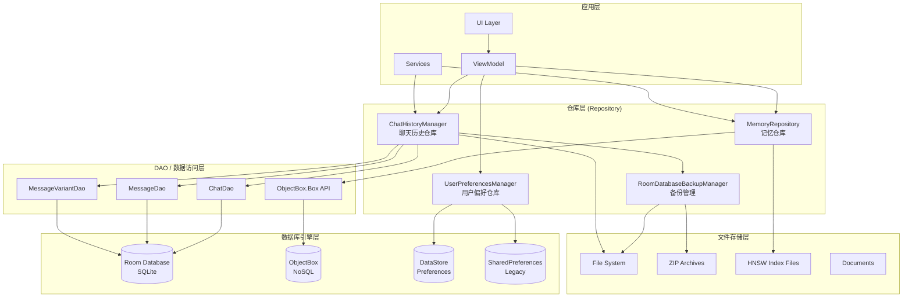
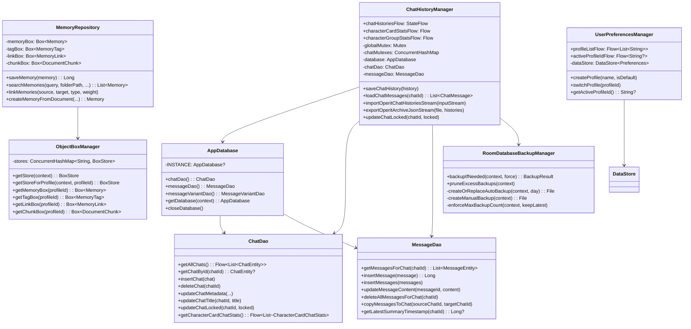
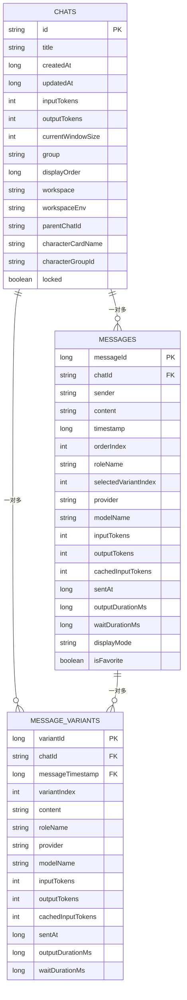
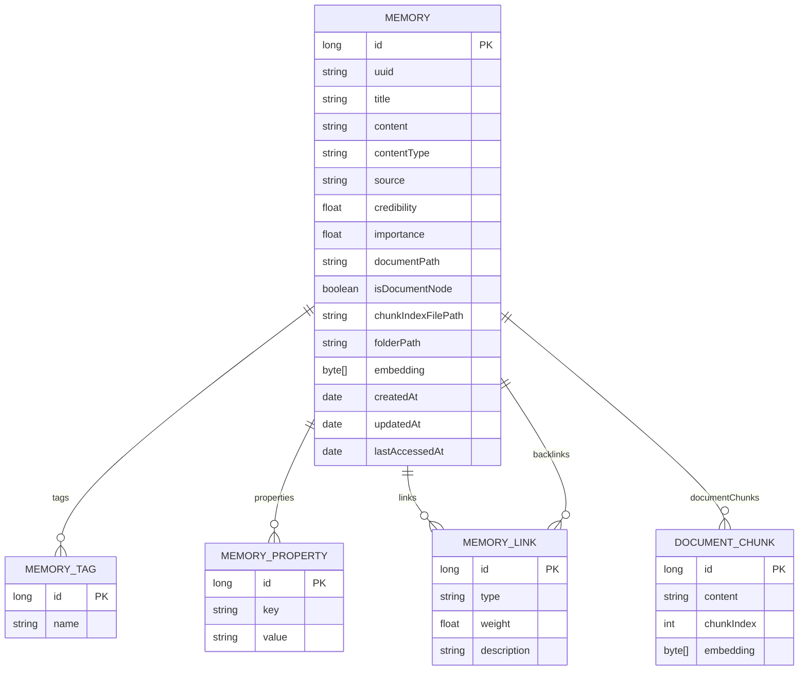
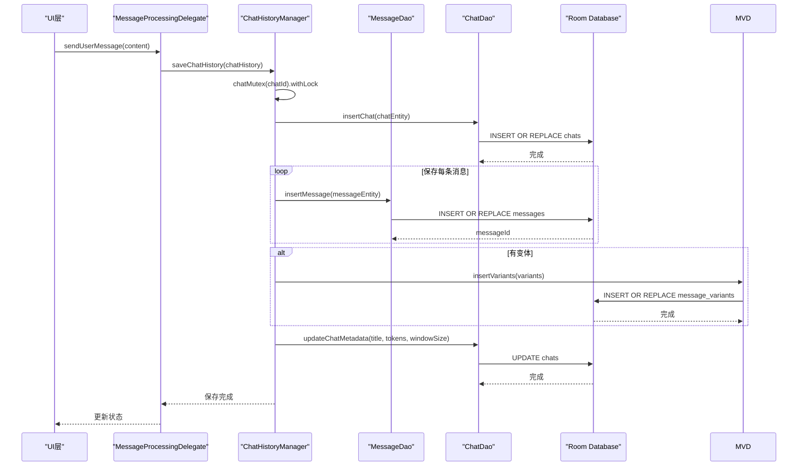
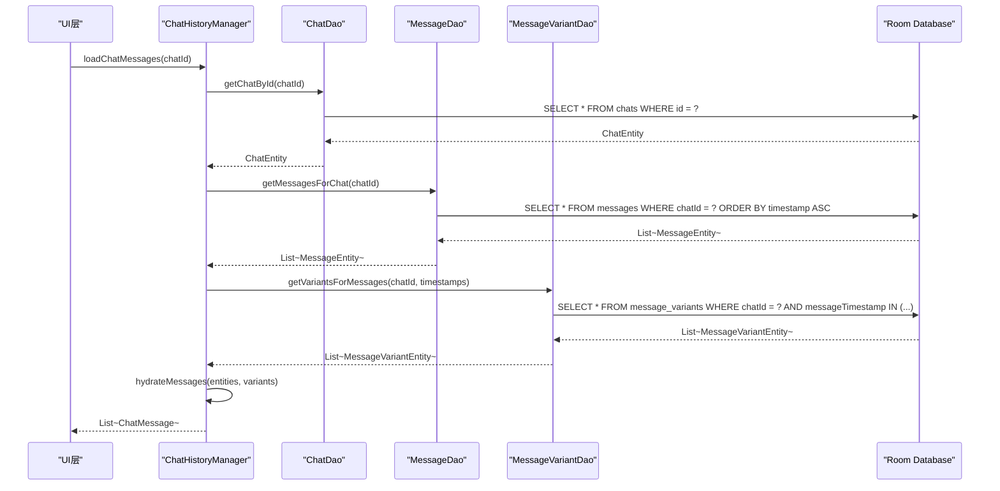
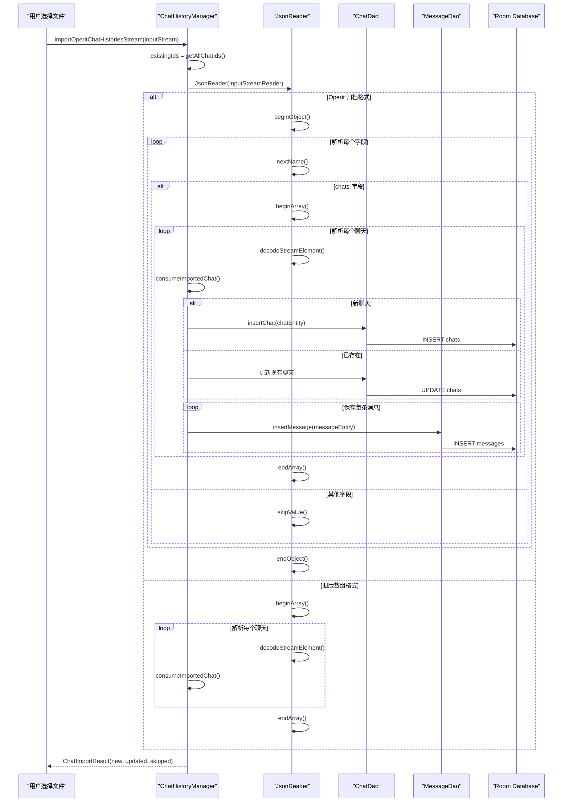
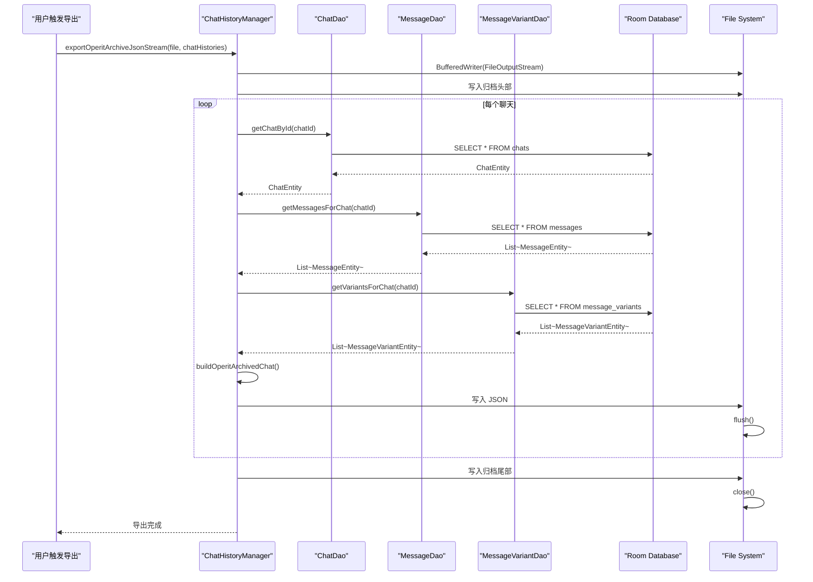
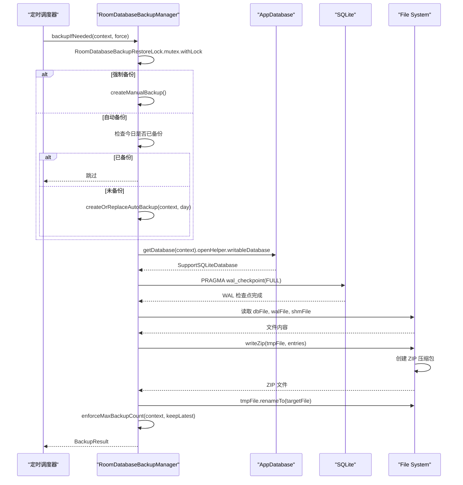
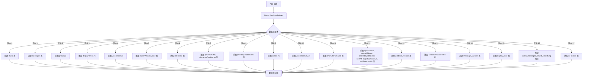

# Operit 数据存储系统设计思想与详细流程分析

## 一、设计思想概述

Operit 的数据存储系统采用**"多引擎协同 + 分层抽象 + 并发安全 + 流式处理"**的架构设计，核心设计思想包括：

1. **双数据库引擎**：Room（SQLite）处理结构化关系数据（聊天、消息），ObjectBox（NoSQL）处理知识图谱数据（记忆、向量）
2. **仓库模式（Repository Pattern）**：`ChatHistoryManager`、`MemoryRepository` 等仓库类封装数据访问逻辑，提供高层业务接口
3. **DAO 抽象**：Room 通过 DAO 接口定义数据访问，ObjectBox 通过 Box API 直接操作
4. **并发安全**：使用 `Mutex`、`ConcurrentHashMap`、`CopyOnWriteArrayList` 等机制保护并发读写
5. **流式导入导出**：JSON 流式解析/序列化，支持大文件的增量处理
6. **数据迁移策略**：Room 通过 Migration 逐步升级 Schema，ObjectBox 通过版本号管理
7. **备份恢复机制**：自动/手动 ZIP 备份，WAL 模式支持，保留策略管理
8. **多租户隔离**：通过 `profileId` 实现不同用户配置的数据隔离

---

## 二、软件架构图

### 2.1 整体架构分层



### 2.2 核心组件类图



---

## 三、数据模型设计

### 3.1 Room 数据库 ER 图



### 3.2 ObjectBox 数据模型



### 3.3 核心数据类

| 类名 | 数据库 | 职责 | 关键字段 |
|------|--------|------|----------|
| `ChatEntity` | Room | 聊天元数据 | id, title, createdAt, updatedAt, group, displayOrder, locked |
| `MessageEntity` | Room | 消息记录 | messageId, chatId, sender, content, timestamp, orderIndex, roleName |
| `MessageVariantEntity` | Room | 消息变体 | variantId, chatId, messageTimestamp, variantIndex, content |
| `Memory` | ObjectBox | 记忆节点 | id, uuid, title, content, contentType, embedding, folderPath |
| `MemoryLink` | ObjectBox | 记忆关联 | id, type, weight, description, source, target |
| `MemoryTag` | ObjectBox | 记忆标签 | id, name |
| `DocumentChunk` | ObjectBox | 文档分块 | id, content, chunkIndex, embedding |
| `ChatHistory` | DTO | 聊天历史传输 | id, title, messages, createdAt, updatedAt, inputTokens, outputTokens |
| `ChatMessage` | DTO | 消息传输 | sender, content, timestamp, roleName, contentStream, inputTokens |

---

## 四、数据存储详细流程

### 4.1 消息保存流程



### 4.2 聊天历史加载流程



### 4.3 流式导入流程



### 4.4 流式导出流程



### 4.5 数据库备份流程



### 4.6 Room 数据库迁移流程



---

## 五、核心机制详解

### 5.1 并发安全机制

```kotlin
// ChatHistoryManager.kt
private val globalMutex = Mutex()
private val chatMutexes = ConcurrentHashMap<String, Mutex>()

private fun chatMutex(chatId: String): Mutex {
    return chatMutexes.getOrPut(chatId) { Mutex() }
}

suspend fun saveChatHistory(chatHistory: ChatHistory) {
    chatMutex(chatHistory.id).withLock {
        // 保存聊天和消息
    }
}
```

**设计要点**：
- **全局互斥锁**：`globalMutex` 用于全局操作（如导入导出）
- **聊天级互斥锁**：每个聊天有独立的 `Mutex`，确保同一聊天的写入串行化
- **ConcurrentHashMap**：线程安全的锁存储

### 5.2 消息水合（Hydrate）机制

```kotlin
// ChatHistoryManager.kt
private suspend fun hydrateMessages(
    chatId: String,
    messageEntities: List<MessageEntity>,
): List<ChatMessage> {
    if (messageEntities.isEmpty()) {
        return emptyList()
    }
    val visibleTimestamps = messageEntities.map { it.timestamp }
    val variants = messageVariantDao.getVariantsForMessages(chatId, visibleTimestamps)
    return hydrateMessages(messageEntities, variants)
}

private fun hydrateMessages(
    messageEntities: List<MessageEntity>,
    variants: List<MessageVariantEntity>,
): List<ChatMessage> {
    val variantsByTimestamp = variants.groupBy { it.messageTimestamp }
    return messageEntities.map { messageEntity ->
        val baseMessage = messageEntity.toChatMessage()
        val messageVariants = variantsByTimestamp[messageEntity.timestamp].orEmpty()
        val variantCount = messageVariants.size + 1
        if (messageEntity.selectedVariantIndex == 0) {
            baseMessage.copy(
                selectedVariantIndex = 0,
                variantCount = variantCount,
            )
        } else {
            val selectedVariant =
                messageVariants.first { it.variantIndex == messageEntity.selectedVariantIndex }
            selectedVariant.applyTo(baseMessage, variantCount)
        }
    }
}
```

**设计要点**：
- **批量查询变体**：一次性查询所有消息的变体，减少数据库访问
- **按时间戳分组**：使用 `groupBy` 快速查找对应变体
- **变体选择**：根据 `selectedVariantIndex` 选择当前显示的变体内容

### 5.3 流式 JSON 解析

```kotlin
// ChatHistoryManager.kt
private suspend fun importOperitChatHistoriesStream(
    inputStream: InputStream,
    existingIds: MutableSet<String>,
): ChatImportResult {
    val counters = ImportCounters()
    var importedIndex = 0

    JsonReader(InputStreamReader(inputStream, StandardCharsets.UTF_8)).use { reader ->
        reader.isLenient = true
        when (reader.peek()) {
            JsonToken.BEGIN_OBJECT -> {
                reader.beginObject()
                while (reader.hasNext()) {
                    when (reader.nextName()) {
                        "chats" -> {
                            reader.beginArray()
                            while (reader.hasNext()) {
                                importedIndex++
                                val archivedChat = decodeStreamElement(reader) {
                                    operitArchiveJson.decodeFromString<OperitArchivedChat>(it)
                                }
                                consumeImportedChat(
                                    StreamImportedChat.Archive(archivedChat),
                                    existingIds,
                                    counters,
                                    importedIndex,
                                )
                            }
                            reader.endArray()
                        }
                        else -> reader.skipValue()
                    }
                }
                reader.endObject()
            }
            JsonToken.BEGIN_ARRAY -> {
                // 旧版格式处理
            }
        }
    }
    return ChatImportResult(counters.newCount, counters.updatedCount, counters.skippedCount)
}
```

**设计要点**：
- **流式解析**：使用 `JsonReader` 逐元素解析，避免加载整个文件到内存
- **格式兼容**：支持 Operit 归档格式（对象）和旧版格式（数组）
- **增量处理**：每处理 20 条记录输出进度日志
- **错误跳过**：`isLenient = true` 允许宽松的 JSON 解析

### 5.4 数据库迁移策略

```kotlin
// AppDatabase.kt
@Database(
    entities = [ChatEntity::class, MessageEntity::class, MessageVariantEntity::class],
    version = 18,
    exportSchema = false
)
abstract class AppDatabase : RoomDatabase() {
    companion object {
        fun getDatabase(context: Context): AppDatabase {
            return INSTANCE ?: synchronized(this) {
                val instance = Room.databaseBuilder(
                    context.applicationContext,
                    AppDatabase::class.java,
                    "app_database"
                )
                .addMigrations(
                    MIGRATION_1_2, MIGRATION_2_3, MIGRATION_3_4,
                    MIGRATION_4_5, MIGRATION_5_6, MIGRATION_6_7,
                    MIGRATION_7_8, MIGRATION_8_9, MIGRATION_9_10,
                    MIGRATION_10_11, MIGRATION_11_12, MIGRATION_12_13,
                    MIGRATION_13_14, MIGRATION_14_15, MIGRATION_15_16,
                    MIGRATION_16_17, MIGRATION_17_18
                )
                .build()
                INSTANCE = instance
                instance
            }
        }
    }
}
```

**迁移策略**：
- **逐步迁移**：从版本 1 到 18，共 17 次迁移
- **安全添加列**：使用 `try-catch` 包裹 ALTER TABLE，避免重复添加
- **数据填充**：迁移 3_4 中用 `updatedAt` 填充 `displayOrder`
- **表删除**：迁移 13_14 删除废弃的 `problem_records` 表
- **索引创建**：迁移 16_17 创建复合索引 `index_messages_chatId_timestamp`

### 5.5 备份恢复机制

```kotlin
// RoomDatabaseBackupManager.kt
suspend fun backupIfNeeded(context: Context, force: Boolean): BackupResult {
    return RoomDatabaseBackupRestoreLock.mutex.withLock {
        val preferences = RoomDatabaseBackupPreferences.getInstance(context)
        val enabled = preferences.isDailyBackupEnabled()
        val maxBackupCount = preferences.getMaxBackupCount()
        
        if (!enabled && !force) {
            return@withLock BackupResult(performed = false, skippedReason = "disabled")
        }
        
        if (force) {
            val backupFile = createManualBackup(context)
            enforceMaxBackupCount(context, keepLatest = maxBackupCount)
            return@withLock BackupResult(performed = true, backupFile = backupFile)
        }
        
        val today = LocalDate.now().format(DateTimeFormatter.ISO_DATE)
        val lastValue = preferences.lastBackupDayFlow.first()
        if (lastValue == today) {
            return@withLock BackupResult(performed = false, skippedReason = "already_backed_up_today")
        }
        
        val backupFile = createOrReplaceAutoBackup(context, today)
        preferences.markSuccess(today, System.currentTimeMillis())
        enforceMaxBackupCount(context, keepLatest = maxBackupCount)
        BackupResult(performed = true, backupFile = backupFile)
    }
}
```

**备份策略**：
- **WAL 检查点**：备份前执行 `PRAGMA wal_checkpoint(FULL)` 确保数据一致性
- **三文件备份**：同时备份 `.db`、`.db-wal`、`.db-shm` 文件
- **ZIP 压缩**：使用 ZIP 格式压缩备份文件
- **保留策略**：默认保留最近 7 个备份，支持 1-100 个
- **自动/手动**：支持每日自动备份和手动触发备份

### 5.6 多租户隔离（Profile）

```kotlin
// ObjectBoxManager.kt
class ObjectBoxManager private constructor(context: Context) {
    private val stores = ConcurrentHashMap<String, BoxStore>()
    
    fun getStoreForProfile(context: Context, profileId: String): BoxStore {
        return stores.getOrPut(profileId) {
            val profileDir = File(context.filesDir, "objectbox_profiles/$profileId")
            MyObjectBox.builder()
                .androidContext(context.applicationContext)
                .directory(profileDir)
                .build()
        }
    }
    
    fun getMemoryBox(profileId: String): Box<Memory> {
        return getStoreForProfile(profileId).boxFor(Memory::class.java)
    }
}

// UserPreferencesManager.kt
class UserPreferencesManager private constructor(context: Context) {
    private val dataStore: DataStore<Preferences> = context.userPreferencesDataStore
    
    val activeProfileIdFlow: Flow<String?> = dataStore.data
        .map { preferences -> preferences[ACTIVE_PROFILE_ID] }
    
    suspend fun createProfile(name: String, isDefault: Boolean = false) {
        val profileId = if (isDefault) "default" else "profile_${System.currentTimeMillis()}"
        // 保存配置信息
    }
    
    suspend fun switchProfile(profileId: String) {
        dataStore.edit { preferences ->
            preferences[ACTIVE_PROFILE_ID] = profileId
        }
    }
}
```

**隔离策略**：
- **ObjectBox**：每个 profile 有独立的目录 `objectbox_profiles/{profileId}`
- **DataStore**：使用 `preferencesDataStore(name = "user_preferences")` 存储配置
- **默认配置**：自动创建 `default` profile，向后兼容
- **切换机制**：切换 profile 时更新 `ACTIVE_PROFILE_ID`，重新加载对应数据

---

## 六、性能优化策略

| 优化点 | 实现方式 | 效果 |
|--------|----------|------|
| 索引优化 | `index_messages_chatId`、`index_messages_chatId_timestamp` | 加速聊天消息查询 |
| 批量插入 | `insertMessages(messages: List<MessageEntity>)` | 减少数据库事务开销 |
| 流式处理 | `JsonReader` 流式解析/序列化 | 降低内存峰值，支持大文件 |
| WAL 模式 | SQLite WAL（Write-Ahead Logging） | 提高并发读写性能 |
| 互斥锁粒度 | 聊天级 `Mutex` | 减少锁竞争 |
| 延迟加载 | `chatHistoriesFlow` 不加载完整消息 | 提升侧边栏性能 |
| 状态流共享 | `StateFlow` + `SharingStarted.Lazily` | 减少重复查询 |
| 备份压缩 | ZIP 压缩备份文件 | 减少存储空间 |
| 增量导出 | 流式写入 JSON | 实时反馈进度 |
| 变体批量查询 | 一次性查询所有变体 | 减少数据库访问次数 |

---

## 七、关键文件索引

| 文件路径 | 职责 |
|----------|------|
| `app/src/main/java/com/ai/assistance/operit/data/db/AppDatabase.kt` | Room 数据库配置、实体定义、迁移管理 |
| `app/src/main/java/com/ai/assistance/operit/data/db/ObjectBox.kt` | ObjectBox 数据库初始化和管理 |
| `app/src/main/java/com/ai/assistance/operit/data/dao/ChatDao.kt` | 聊天数据访问对象 |
| `app/src/main/java/com/ai/assistance/operit/data/dao/MessageDao.kt` | 消息数据访问对象 |
| `app/src/main/java/com/ai/assistance/operit/data/dao/MessageVariantDao.kt` | 消息变体数据访问对象 |
| `app/src/main/java/com/ai/assistance/operit/data/repository/ChatHistoryManager.kt` | 聊天历史仓库（CRUD、导入导出、并发控制） |
| `app/src/main/java/com/ai/assistance/operit/data/repository/MemoryRepository.kt` | 记忆仓库（CRUD、搜索、索引管理） |
| `app/src/main/java/com/ai/assistance/operit/data/backup/RoomDatabaseBackupManager.kt` | Room 数据库备份管理器 |
| `app/src/main/java/com/ai/assistance/operit/data/backup/RoomDatabaseBackupWorker.kt` | 数据库备份后台任务 |
| `app/src/main/java/com/ai/assistance/operit/data/preferences/UserPreferencesManager.kt` | 用户偏好设置管理器 |
| `app/src/main/java/com/ai/assistance/operit/data/model/ChatEntity.kt` | 聊天实体类 |
| `app/src/main/java/com/ai/assistance/operit/data/model/MessageEntity.kt` | 消息实体类 |
| `app/src/main/java/com/ai/assistance/operit/data/model/MessageVariantEntity.kt` | 消息变体实体类 |
| `app/src/main/java/com/ai/assistance/operit/data/model/ChatHistory.kt` | 聊天历史 DTO |
| `app/src/main/java/com/ai/assistance/operit/data/model/ChatMessage.kt` | 消息 DTO |
| `app/src/main/java/com/ai/assistance/operit/data/model/Memory.kt` | 记忆实体类 |
| `app/src/main/java/com/ai/assistance/operit/data/model/DocumentChunk.kt` | 文档分块实体类 |

---

## 八、总结

Operit 的数据存储系统通过**多引擎协同**和**分层抽象**，实现了以下核心能力：

1. **双数据库引擎**：Room（SQLite）处理结构化数据，ObjectBox（NoSQL）处理知识图谱和向量数据
2. **仓库模式**：`ChatHistoryManager`、`MemoryRepository` 等提供高层业务接口
3. **DAO 抽象**：Room 通过 DAO 接口定义数据访问，ObjectBox 通过 Box API 直接操作
4. **并发安全**：全局锁 + 聊天级锁 + 线程安全集合
5. **流式处理**：JSON 流式解析/序列化，支持大文件的增量处理
6. **数据迁移**：17 次 Room 迁移，逐步升级 Schema
7. **备份恢复**：自动/手动 ZIP 备份，WAL 检查点，保留策略
8. **多租户隔离**：`profileId` 实现不同用户配置的数据隔离
9. **性能优化**：索引、批量插入、WAL 模式、延迟加载、状态流共享
10. **数据一致性**：WAL 检查点、互斥锁、事务保护

整个系统的设计充分体现了**"关注点分离"**和**"单一职责原则"**，通过清晰的层次结构和接口定义，实现了稳定、高效、可扩展的数据存储能力。
