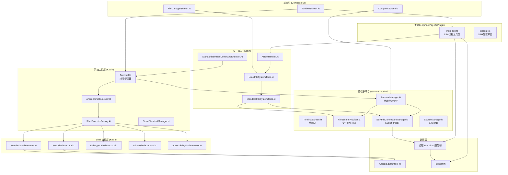
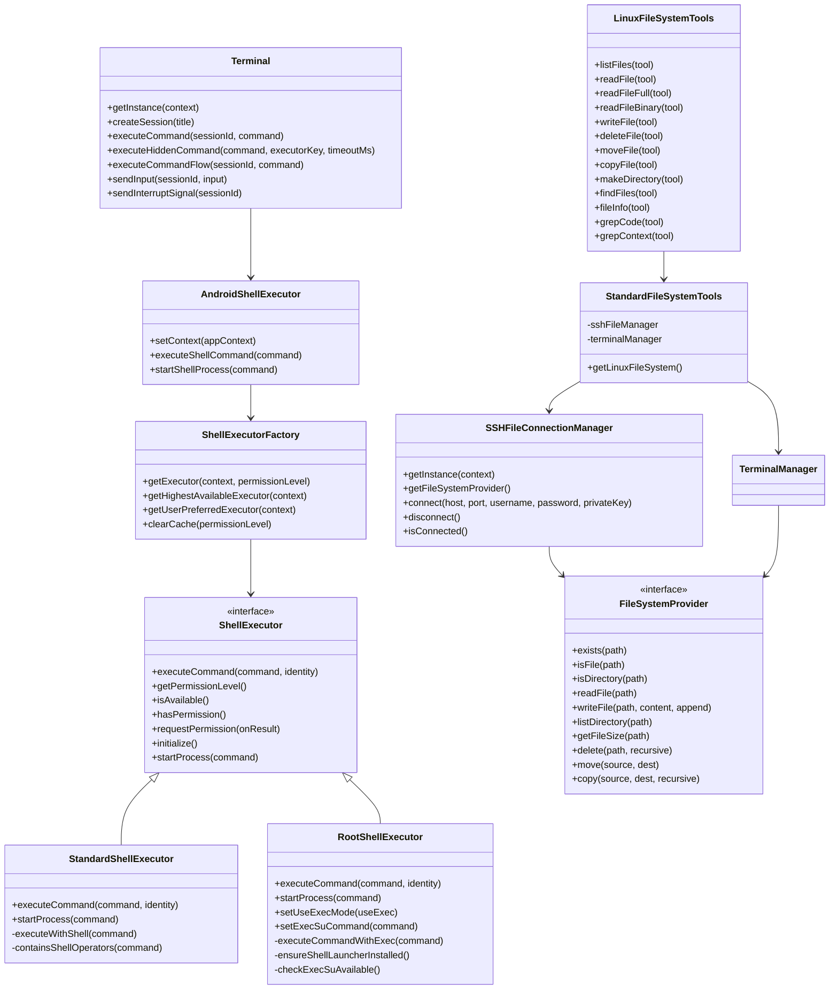
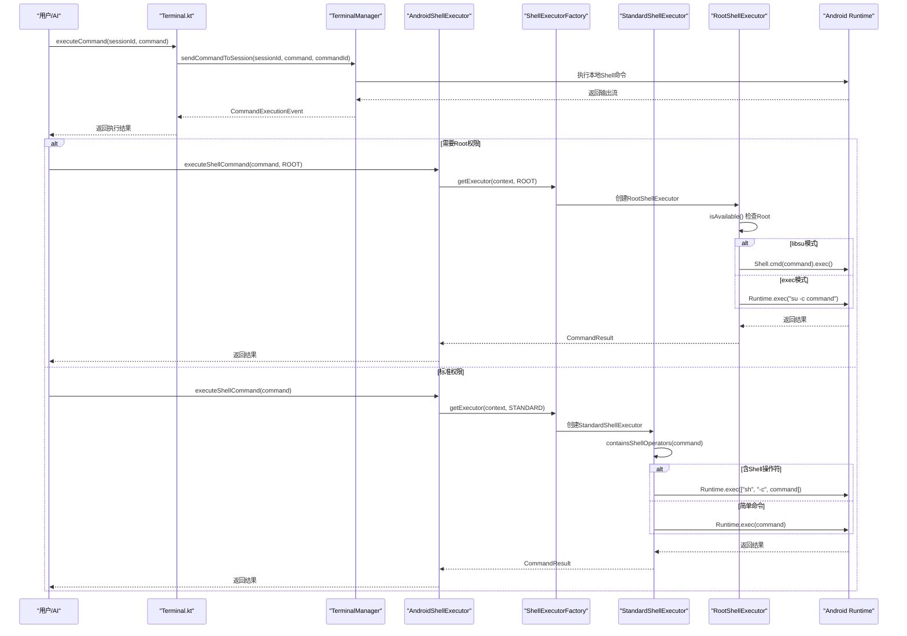
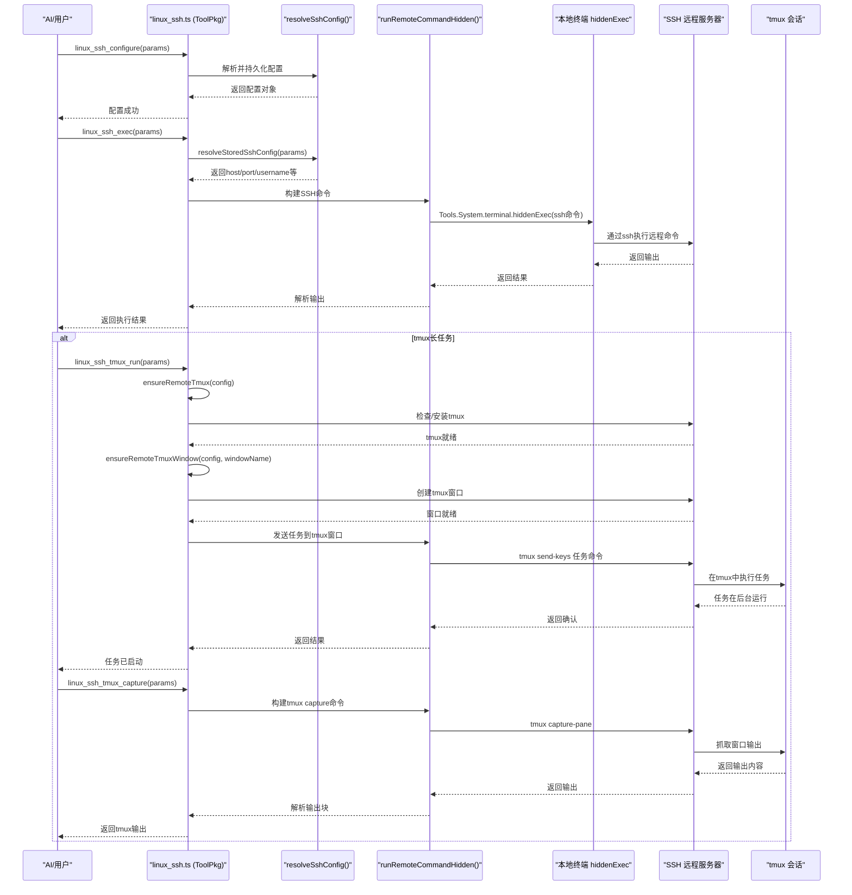
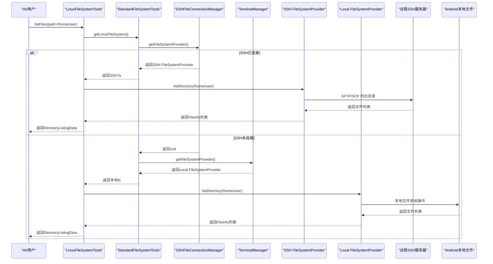
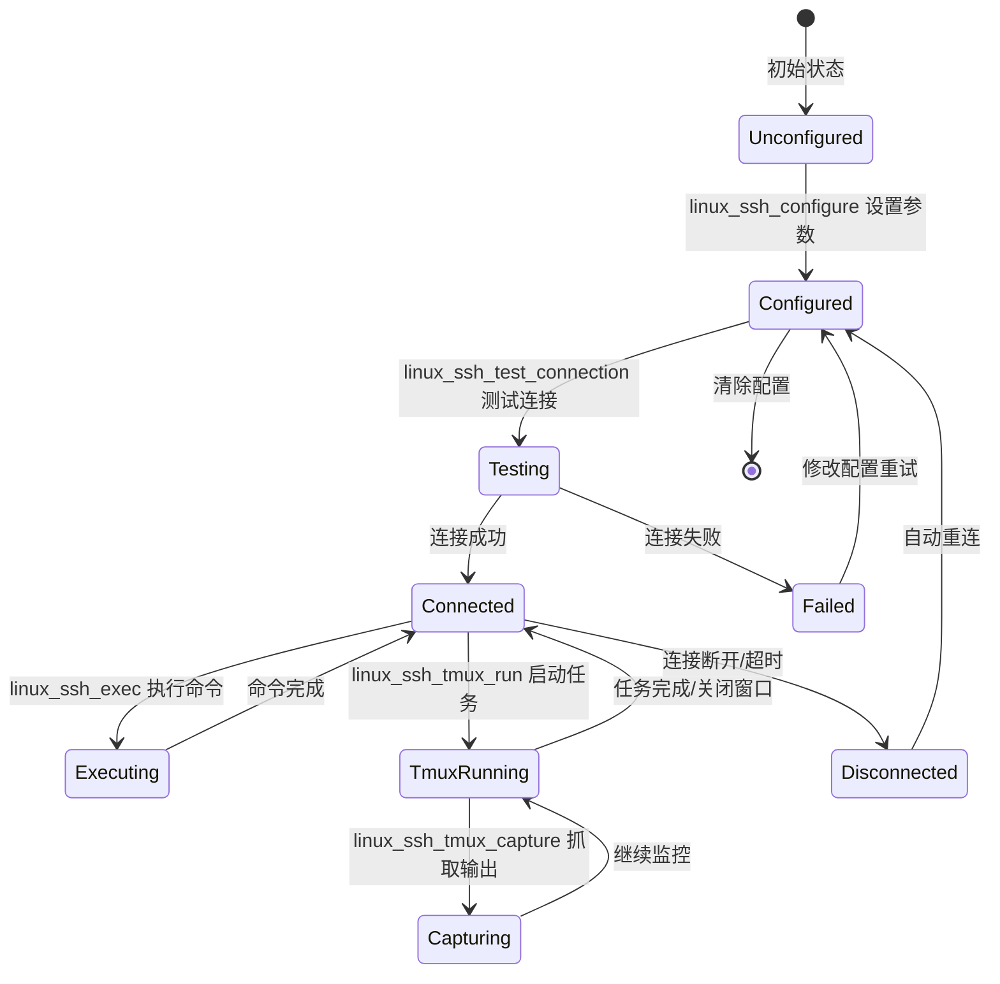
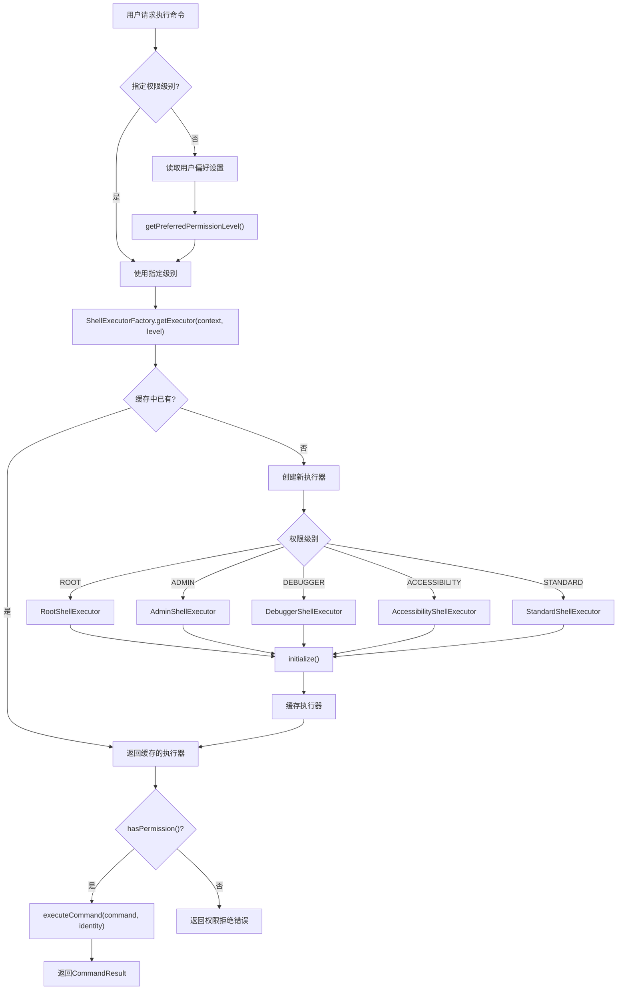

# Operit Linux 环境运行架构设计分析

## 一、设计思想概述

Operit 项目对 Linux 环境的支持采用**"分层抽象 + 插件化工具包 + 多模式执行"**的架构设计，核心设计思想包括：

1. **本地与远程统一抽象**：通过 `FileSystemProvider` 接口统一本地 Linux 环境（Termux/Terminal）和远程 SSH 环境的文件操作
2. **权限分级执行**：通过 `ShellExecutor` 接口实现 STANDARD、ROOT、DEBUGGER、ADMIN、ACCESSIBILITY 五级权限的 Shell 命令执行
3. **SSH 远程连接插件化**：`linux_ssh` 工具包作为独立插件，提供完整的 SSH 连接、tmux 会话管理、远程文件操作能力
4. **终端集成能力复用**：基于 `terminal` 模块（独立子项目）提供本地终端会话管理，复用于本地 Linux 环境执行
5. **隐藏执行器隔离**：通过 `hiddenExec` 机制在独立终端会话中执行命令，避免污染用户交互会话

---

## 二、软件架构图

### 2.1 整体架构分层



### 2.2 Linux 环境核心组件关系



---

## 三、Linux 环境运行详细流程

### 3.1 本地 Linux 环境执行流程



### 3.2 远程 SSH Linux 环境执行流程



### 3.3 文件系统操作流程（本地/远程统一）



### 3.4 SSH 配置与连接状态机



### 3.5 权限级别与执行器选择流程



---

## 四、核心机制详解

### 4.1 本地终端执行机制（Terminal.kt）

```kotlin
class Terminal private constructor(private val context: Context) {
    private val terminalManager = TerminalManager.getInstance(context)
    
    suspend fun executeCommand(sessionId: String, command: String): String? {
        val deferred = CompletableDeferred<String>()
        val commandId = UUID.randomUUID().toString()
        
        // 订阅命令执行事件
        val job = scope.launch {
            commandEvents
                .filter { it.sessionId == sessionId && it.commandId == commandId }
                .collect { event ->
                    if (event.isCompleted) {
                        deferred.complete(event.outputChunk ?: output.toString())
                    } else {
                        output.append(event.outputChunk)
                    }
                }
        }
        
        // 发送命令到指定会话
        terminalManager.sendCommandToSession(sessionId, command, commandId)
        return deferred.await()
    }
    
    suspend fun executeHiddenCommand(
        command: String,
        executorKey: String = "default",
        timeoutMs: Long = 120000L
    ): HiddenExecResult {
        return terminalManager.executeHiddenCommand(command, executorKey, timeoutMs)
    }
}
```

**关键设计**：
- **会话隔离**：每个命令在独立会话中执行，通过 `sessionId` 区分
- **命令追踪**：使用 `commandId` 追踪特定命令的输出事件
- **隐藏执行器**：`hiddenExec` 在后台终端会话中执行，不干扰用户交互
- **流式输出**：支持 `executeCommandFlow` 返回 Flow，实时获取输出

### 4.2 SSH 远程执行机制（linux_ssh.ts）

```typescript
async function runRemoteCommandHidden(config, remoteCommand, timeoutMs, scope) {
    const runner = async function execute(command, commandTimeoutMs) {
        return await runLocalHiddenCommand(command, commandTimeoutMs, effectiveScope);
    };
    
    // 1. 确保本地SSH依赖已安装
    await ensureLocalSshDependencies(config, runner);
    
    // 2. 构建SSH命令
    const command = buildSshCommand(config, remoteCommand, false);
    
    // 3. 在本地终端通过ssh执行
    const result = await runner(command, timeoutMs || config.timeoutMs);
    return result;
}

function buildSshCommand(config, remoteCommand, interactive) {
    const authPrefix = (config.password && !config.privateKeyPath)
        ? `SSHPASS=${shellQuote(config.password)} sshpass -e `
        : "";
    const keyPart = config.privateKeyPath ? ` -i ${shellQuote(config.privateKeyPath)}` : "";
    const target = `${config.username}@${config.host}`;
    const options = buildSshOptions(config);
    const tty = interactive ? " -tt" : "";
    return `${authPrefix}ssh${tty}${keyPart} ${options} -p ${config.port} ${shellQuote(target)} ${shellQuote(remoteCommand)}`;
}
```

**关键设计**：
- **本地SSH代理**：在 Android 本地终端执行 `ssh` 命令，通过 SSH 协议连接远程服务器
- **自动依赖安装**：自动检测并安装 `openssh-client` 和 `sshpass`
- **密码/密钥双认证**：支持密码认证（通过 sshpass）和私钥认证
- **配置持久化**：通过环境变量 `LINUX_SSH_*` 持久化连接配置

### 4.3 tmux 会话管理机制

```typescript
async function ensureRemoteTmux(config) {
    const installScript = [
        "if command -v tmux >/dev/null 2>&1; then",
        "  echo '__TMUX_READY__'",
        "  exit 0",
        "fi",
        // 自动安装tmux（apt/dnf/yum/pacman）
        "...",
        "echo '__TMUX_INSTALL_FAILED__'"
    ].join("\n");
    
    const result = await runRemoteCommandHidden(config, buildRemoteShellCommand(installScript), 240_000, "tmux");
    return result.output.includes("__TMUX_READY__");
}

async function linux_ssh_tmux_run(params) {
    // 1. 确保tmux已安装
    const tmuxReady = await ensureRemoteTmux(config);
    // 2. 创建/获取tmux窗口
    const windowReady = await ensureRemoteTmuxWindow(config, requestedWindowName);
    // 3. 构建任务启动脚本
    const script = buildTmuxLaunchScript(command, workdir);
    // 4. 通过ssh发送任务到tmux窗口
    const result = await runRemoteCommandWithLocalStdinHidden(config, command, script, timeoutMs, "tmux");
    return result;
}
```

**关键设计**：
- **会话持久化**：tmux 会话在 SSH 断开后保持运行
- **窗口自动管理**：自动创建 `operit_ai` 会话和 `task-N` 窗口
- **输入/输出分离**：通过 `tmux send-keys` 发送输入，`tmux capture-pane` 抓取输出
- **控制键映射**：支持 Enter、Tab、Ctrl+C 等控制键的远程发送

### 4.4 文件系统统一抽象

```kotlin
// StandardFileSystemTools.kt
protected fun getLinuxFileSystem(): FileSystemProvider {
    // 先尝试获取SSH连接的文件系统
    val sshProvider = sshFileManager.getFileSystemProvider()
    if (sshProvider != null) {
        return sshProvider  // 使用SSH远程文件系统
    }
    // 否则使用本地Terminal的文件系统
    return terminalManager.getFileSystemProvider()
}

// LinuxFileSystemTools.kt
class LinuxFileSystemTools(context: Context) : StandardFileSystemTools(context) {
    private val fs get() = getLinuxFileSystem()
    
    override suspend fun listFiles(tool: AITool): ToolResult {
        val path = tool.parameters.find { it.name == "path" }?.value ?: ""
        val fileInfoList = fs.listDirectory(path)
        // ...
    }
}
```

**关键设计**：
- **动态切换**：运行时自动检测 SSH 连接状态，优先使用 SSH 文件系统
- **接口统一**：`FileSystemProvider` 接口统一本地和远程文件操作
- **路径验证**：`PathValidator.validateLinuxPath()` 验证 Linux 路径格式（`/` 或 `~` 开头）
- **环境标识**：返回数据包含 `env = "linux"` 标识

### 4.5 权限分级执行机制

```kotlin
// ShellExecutorFactory.kt
fun getExecutor(context: Context, permissionLevel: AndroidPermissionLevel): ShellExecutor {
    executors[permissionLevel]?.let { return it }
    
    val executor = when (permissionLevel) {
        AndroidPermissionLevel.ROOT -> RootShellExecutor(context)
        AndroidPermissionLevel.ADMIN -> AdminShellExecutor(context)
        AndroidPermissionLevel.DEBUGGER -> DebuggerShellExecutor(context)
        AndroidPermissionLevel.ACCESSIBILITY -> AccessibilityShellExecutor(context)
        AndroidPermissionLevel.STANDARD -> StandardShellExecutor(context)
    }
    executor.initialize()
    executors[permissionLevel] = executor
    return executor
}

// RootShellExecutor.kt
override suspend fun executeCommand(command: String, identity: ShellIdentity): ShellExecutor.CommandResult {
    return when (identity) {
        ShellIdentity.SHELL -> {
            // 使用shell launcher二进制执行
            val launcherPath = ensureShellLauncherInstalled()
            if (useExecMode) {
                // exec模式: su -c "launcher command"
                val process = Runtime.getRuntime().exec(buildSuExecCommand("$launcherPath $command"))
                // ...
            } else {
                // libsu模式: Shell.cmd("launcher command").exec()
                val shellResult = Shell.cmd("$launcherPath $command").exec()
                // ...
            }
        }
        ShellIdentity.ROOT, ShellIdentity.DEFAULT, ShellIdentity.APP -> {
            if (useExecMode) {
                executeCommandWithExec(command)
            } else {
                Shell.cmd(command).exec()
            }
        }
    }
}
```

**关键设计**：
- **五级权限**：STANDARD → ACCESSIBILITY → DEBUGGER → ADMIN → ROOT
- **双模式Root执行**：支持 `libsu` 库模式和传统 `exec su` 模式
- **Shell身份隔离**：通过 `ShellIdentity` 区分 APP/ROOT/SHELL 执行上下文
- **缓存机制**：执行器实例按权限级别缓存，避免重复初始化

---

## 五、数据模型设计

### 5.1 SSH 配置数据流

```mermaid
erDiagram
    ENV["环境变量"] ||--o{ CFG["SSH配置"] : "存储"
    CFG ||--o{ CONN["SSH连接"] : "建立"
    CONN ||--o{ SESS["终端会话"] : "创建"
    SESS ||--o{ CMD["命令执行"] : "发送"
    CMD ||--o{ OUT["输出结果"] : "返回"
    
    ENV {
        string LINUX_SSH_HOST
        string LINUX_SSH_PORT
        string LINUX_SSH_USERNAME
        string LINUX_SSH_PASSWORD
        string LINUX_SSH_PRIVATE_KEY_PATH
        string LINUX_SSH_TIMEOUT_MS
    }
    
    CFG {
        string host
        int port
        string username
        string password
        string privateKeyPath
        int timeoutMs
    }
    
    CONN {
        string connectionId
        string status
        long connectedAt
    }
    
    SESS {
        string sessionId
        string executorKey
        string scope
    }
    
    CMD {
        string command
        int timeoutMs
        string scope
    }
    
    OUT {
        int exitCode
        boolean timedOut
        string output
        string error
    }
```

---

## 六、关键文件索引

| 文件路径 | 职责 |
|----------|------|
| `examples/linux_ssh/src/packages/linux_ssh.ts` | SSH远程工具包核心实现（16个工具函数） |
| `examples/linux_ssh/src/linux_ssh_setup/index.ui.ts` | SSH配置UI界面（Compose DSL） |
| `examples/linux_ssh/manifest.json` | 工具包清单配置 |
| `app/src/main/java/com/ai/assistance/operit/core/tools/system/Terminal.kt` | 终端管理器封装（单例） |
| `app/src/main/java/com/ai/assistance/operit/core/tools/system/OperitTerminalManager.kt` | OperitTerminal应用管理 |
| `app/src/main/java/com/ai/assistance/operit/core/tools/system/AndroidShellExecutor.kt` | Shell执行统一入口 |
| `app/src/main/java/com/ai/assistance/operit/core/tools/system/shell/ShellExecutor.kt` | Shell执行器接口定义 |
| `app/src/main/java/com/ai/assistance/operit/core/tools/system/shell/ShellExecutorFactory.kt` | 执行器工厂（缓存+分级） |
| `app/src/main/java/com/ai/assistance/operit/core/tools/system/shell/StandardShellExecutor.kt` | 标准权限执行器 |
| `app/src/main/java/com/ai/assistance/operit/core/tools/system/shell/RootShellExecutor.kt` | Root权限执行器（libsu/exec双模式） |
| `app/src/main/java/com/ai/assistance/operit/core/tools/defaultTool/standard/LinuxFileSystemTools.kt` | Linux文件系统工具集 |
| `app/src/main/java/com/ai/assistance/operit/core/tools/defaultTool/standard/StandardFileSystemTools.kt` | 文件系统工具基类（SSH/本地切换） |
| `app/src/main/java/com/ai/assistance/operit/core/tools/defaultTool/PathValidator.kt` | 路径验证（Linux/Android） |
| `app/src/main/java/com/ai/assistance/operit/core/tools/defaultTool/standard/StandardTerminalCommandExecutor.kt` | 终端命令执行工具 |

---

## 七、总结

Operit 的 Linux 环境运行架构通过**分层抽象**和**插件化设计**，实现了以下核心能力：

1. **本地Linux执行**：基于 Android Runtime 的 Shell 执行，支持 STANDARD/ROOT 等多级权限
2. **远程SSH连接**：通过 `linux_ssh` 工具包实现完整的 SSH 远程操作，支持密码/密钥认证
3. **tmux会话管理**：远程任务通过 tmux 持久化运行，支持断线重连和输出抓取
4. **文件系统统一**：`FileSystemProvider` 接口统一本地和远程文件操作，AI 工具透明切换
5. **终端集成复用**：`terminal` 子项目提供本地终端能力，复用于 SSH 代理和本地执行
6. **隐藏执行隔离**：`hiddenExec` 机制确保后台命令不污染用户交互会话

整个系统的设计充分体现了**"统一抽象、分层实现、插件扩展"**的思想，使得 AI 能够以一致的方式操作本地和远程 Linux 环境。
