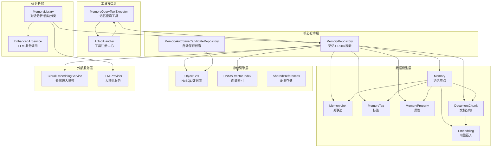
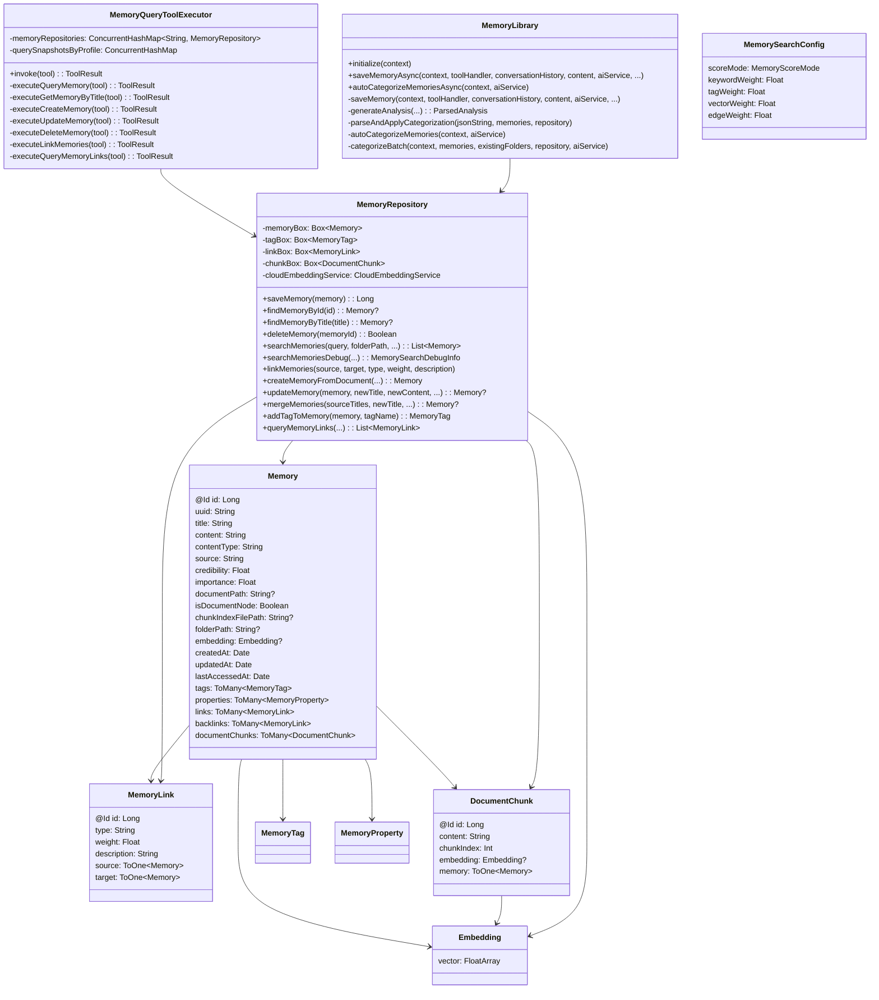
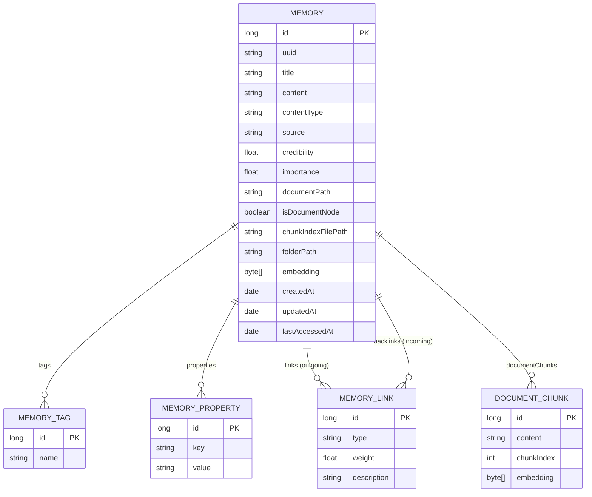
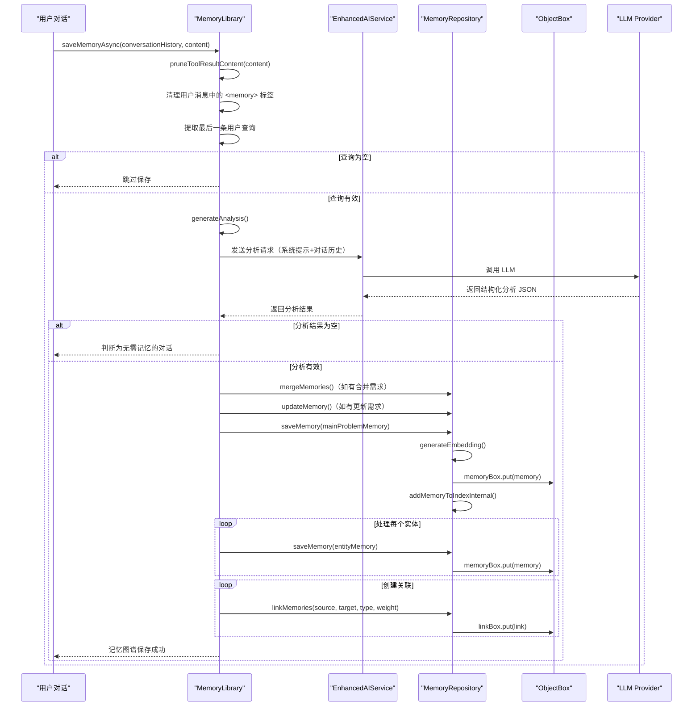
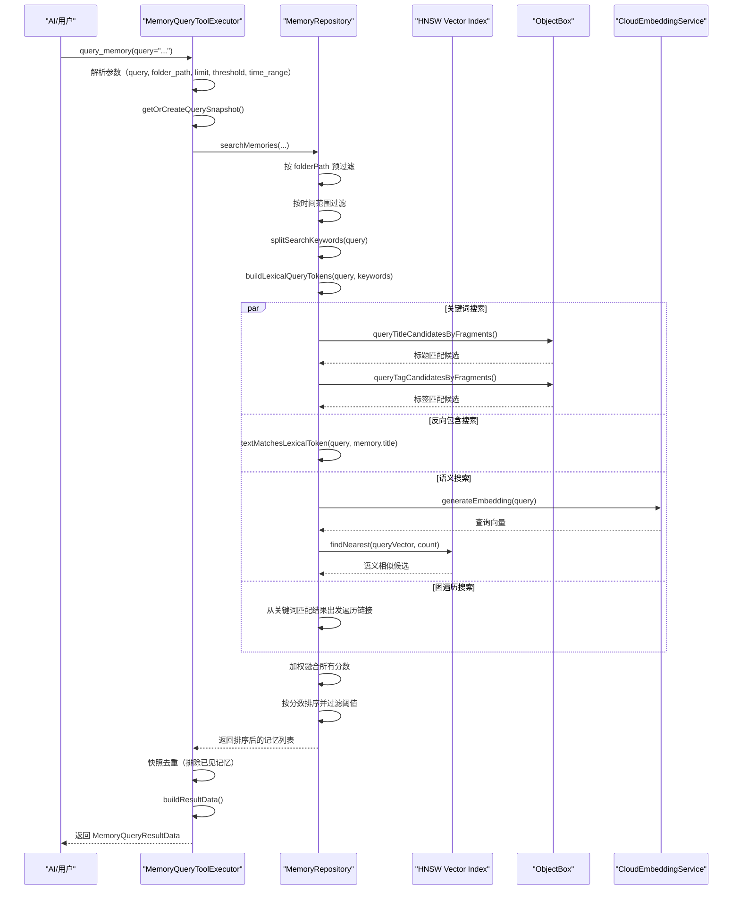
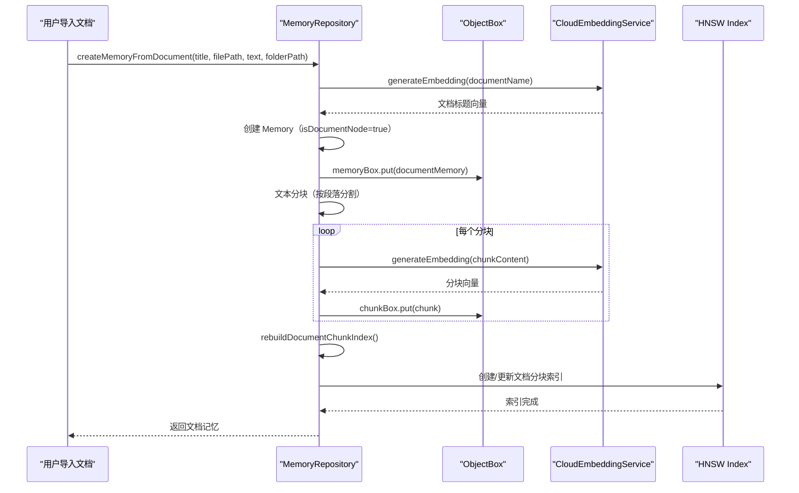
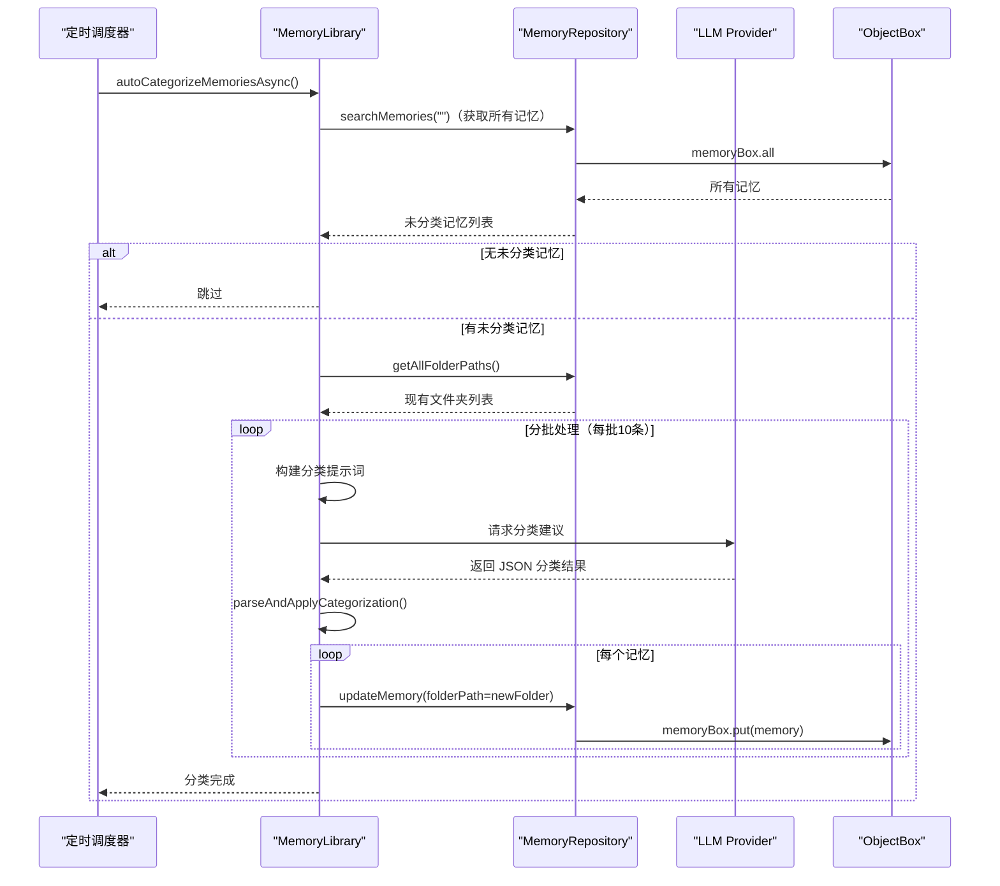
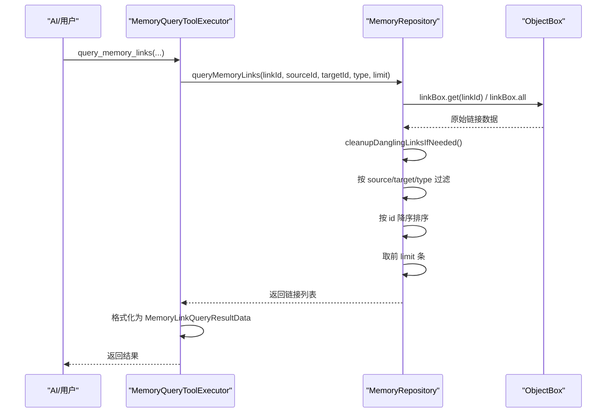
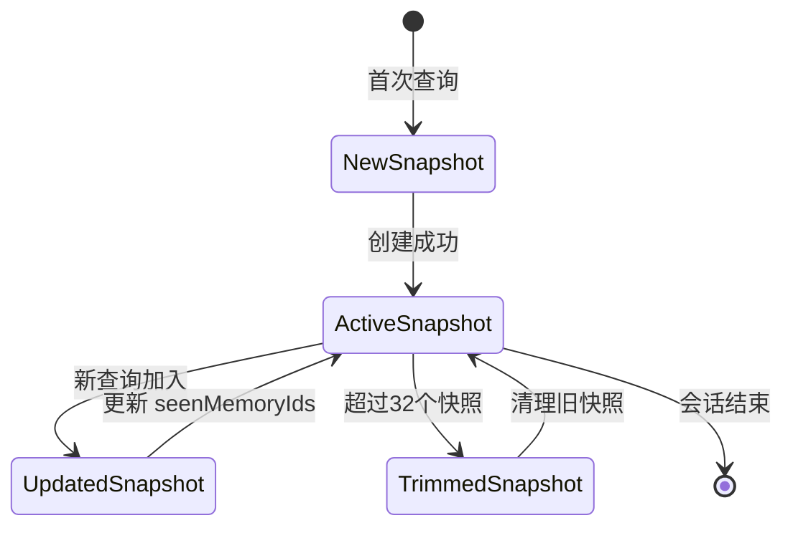

# Operit 记忆管理系统设计思想与详细流程分析

## 一、设计思想概述

Operit 的记忆管理系统采用**"知识图谱 + 向量语义 + 多模态搜索"**的架构设计，核心设计思想包括：

1. **知识图谱存储**：以 `Memory` 为核心节点，`MemoryLink` 为边，构建可关联的知识图谱结构
2. **向量语义检索**：通过 `Embedding` 向量嵌入和 HNSW 索引实现语义相似度搜索
3. **多模态混合搜索**：支持关键词、标签、语义、图遍历四种搜索模式的加权组合
4. **文档分块索引**：大文档自动分块，每块独立生成向量嵌入，支持细粒度检索
5. **AI 自动分析**：`MemoryLibrary` 使用 LLM 自动分析对话内容，提取实体和关系
6. **快照去重机制**：`QuerySnapshot` 机制避免同一查询会话中重复返回相同记忆
7. **自动分类整理**：AI 自动为未分类记忆分配文件夹路径，保持知识库有序
8. **多租户隔离**：通过 `profileId` 实现不同用户/配置的记忆数据隔离

---

## 二、软件架构图

### 2.1 整体架构分层



### 2.2 核心组件类图



---

## 三、数据模型设计

### 3.1 ER 关系图



### 3.2 核心数据类

| 类名 | 职责 | 关键字段 |
|------|------|----------|
| `Memory` | 记忆节点实体 | id, uuid, title, content, contentType, source, credibility, importance, folderPath, embedding, createdAt, updatedAt |
| `MemoryLink` | 记忆关联边 | id, type, weight, description, source, target |
| `MemoryTag` | 记忆标签 | id, name, parent |
| `MemoryProperty` | 记忆属性（键值对） | id, key, value |
| `DocumentChunk` | 文档分块 | id, content, chunkIndex, embedding, memory |
| `Embedding` | 向量嵌入包装 | vector: FloatArray |
| `MemorySearchConfig` | 搜索配置 | scoreMode, keywordWeight, tagWeight, vectorWeight, edgeWeight |
| `MemoryAutoSaveCandidate` | 自动保存候选 | chatId, triggerMessageTimestamp, status, attemptCount |

---

## 四、记忆管理详细流程

### 4.1 记忆保存主流程（AI 自动分析）



### 4.2 记忆搜索流程（多模态混合搜索）



### 4.3 文档记忆创建流程



### 4.4 记忆自动分类流程



### 4.5 记忆链接查询流程



### 4.6 快照去重机制



---

## 五、核心机制详解

### 5.1 混合搜索评分机制

```kotlin
// MemoryRepository.kt
private fun resolveSearchWeights(
    scoreMode: MemoryScoreMode,
    keywordWeight: Float,
    tagWeight: Float,
    semanticWeight: Float,
    edgeWeight: Float,
    keywordCount: Int
): ResolvedSearchWeights {
    val (modeKeywordMultiplier, modeSemanticMultiplier, modeEdgeMultiplier) = when (scoreMode) {
        MemoryScoreMode.BALANCED -> Triple(1.0, 1.0, 1.0)
        MemoryScoreMode.KEYWORD_FIRST -> Triple(1.3, 0.8, 0.9)
        MemoryScoreMode.SEMANTIC_FIRST -> Triple(0.8, 1.3, 1.1)
    }
    val semanticKeywordNormFactor =
        if (keywordCount > 0) 1.0 / sqrt(keywordCount.toDouble()) else 1.0

    return ResolvedSearchWeights(
        scoreMode = scoreMode,
        effectiveKeywordWeight = normalizedKeywordWeight * modeKeywordMultiplier,
        effectiveTagWeight = normalizedTagWeight * modeKeywordMultiplier,
        effectiveSemanticWeight = normalizedSemanticWeight * modeSemanticMultiplier.toFloat(),
        effectiveEdgeWeight = normalizedEdgeWeight * modeEdgeMultiplier,
        semanticKeywordNormFactor = semanticKeywordNormFactor
    )
}
```

**搜索模式**：
- **BALANCED**：关键词、语义、图遍历权重均衡
- **KEYWORD_FIRST**：关键词权重提升 30%，语义权重降低 20%
- **SEMANTIC_FIRST**：语义权重提升 30%，关键词权重降低 20%

**评分公式**：
- 关键词分数：`RRF(rank) * importance * keywordWeight * coverageMultiplier`
- 语义分数：`cosineSimilarity(query, memory) * semanticWeight * normFactor`
- 图遍历分数：从关键词匹配结果出发，沿链接传播分数

### 5.2 HNSW 向量索引管理

```kotlin
// MemoryRepository.kt
private fun rebuildMemoryVectorIndexForDimension(
    dimension: Int,
    excludedMemoryId: Long? = null
): Int {
    val items = memoryBox.all
        .asSequence()
        .filter { memory -> excludedMemoryId == null || memory.id != excludedMemoryId }
        .mapNotNull { memory ->
            val itemDimension = memory.embedding?.vector?.size ?: return@mapNotNull null
            if (itemDimension != dimension) return@mapNotNull null
            createMemoryIndexItem(memory)
        }
        .toList()

    val indexFile = memoryIndexFileForDimension(dimension)
    deleteIndexFileIfExists(indexFile)
    if (items.isEmpty()) return 0

    val manager = VectorIndexManager<IndexItem<Long, Long>, Long>(
        dimensions = dimension,
        maxElements = items.size.coerceAtLeast(1),
        indexFile = indexFile
    )
    items.forEach { item -> manager.addItem(item) }
    manager.save()
    manager.close()
    return items.size
}
```

**关键设计**：
- **按维度分索引**：不同维度的向量存储在独立的 HNSW 索引文件中
- **增量重建**：记忆增删改时重建对应维度的索引
- **文档分块索引**：文档节点的分块单独建立 HNSW 索引
- **索引文件命名**：`memory_hnsw_{profileId}_{dimension}.idx`

### 5.3 关键词扩展与分词

```kotlin
// MemoryRepository.kt
private fun expandKeywordToken(token: String): Set<String> {
    val normalized = token.trim().lowercase(Locale.ROOT)
    if (normalized.isBlank()) return emptySet()

    val expanded = linkedSetOf<String>()
    if (shouldKeepRawLexicalToken(normalized)) {
        expanded.add(normalized)
    }

    // 优先使用项目内已集成的 Jieba 分词，提升中文检索召回质量
    val jiebaTokens = TextSegmenter.segment(normalized)
        .map { it.trim().lowercase(Locale.ROOT) }
        .filter { shouldKeepRawLexicalToken(it) }
    expanded.addAll(jiebaTokens)

    return expanded.filterTo(linkedSetOf()) { shouldKeepRawLexicalToken(it) }
}

private fun isSearchableLexicalBody(text: String): Boolean {
    if (text.length !in 2..24) return false
    return text.any { ch -> ch.isLetterOrDigit() || ch.code in 0x4E00..0x9FFF }
}
```

**分词策略**：
- **保留原词**：原始查询词直接保留
- **Jieba 分词**：中文内容使用 Jieba 分词补充
- **长度过滤**：只保留 2-24 字符的 token
- **字符过滤**：必须包含字母、数字或中文字符
- **通配符支持**：支持 `*` 通配符匹配

### 5.4 快照去重机制

```kotlin
// MemoryQueryToolExecutor.kt
private data class QuerySnapshotState(
    val id: String,
    val seenMemoryIds: MutableSet<Long> = ConcurrentHashMap.newKeySet<Long>(),
    val lock: Any = Any(),
    @Volatile var lastAccessAtMs: Long = System.currentTimeMillis()
)

private val querySnapshotsByProfile =
    ConcurrentHashMap<String, ConcurrentHashMap<String, QuerySnapshotState>>()

private fun getOrCreateQuerySnapshot(profileId: String, requestedSnapshotId: String?): Pair<QuerySnapshotState, Boolean> {
    val store = getQuerySnapshotStore(profileId)
    val now = System.currentTimeMillis()

    if (requestedSnapshotId == null) {
        // 生成新快照
        val generatedSnapshot = QuerySnapshotState(id = UUID.randomUUID().toString())
        if (store.putIfAbsent(generatedSnapshot.id, generatedSnapshot) == null) {
            trimOldSnapshots(store)
            return generatedSnapshot to true
        }
    }

    store[requestedSnapshotId]?.let { existingSnapshot ->
        existingSnapshot.lastAccessAtMs = now
        return existingSnapshot to false
    }
    // ...
}
```

**去重策略**：
- **快照隔离**：每个查询会话有独立的 `seenMemoryIds` 集合
- **自动清理**：每个 profile 最多保留 32 个快照，按 LRU 淘汰
- **并发安全**：使用 `synchronized(lock)` 保护快照更新
- **跨查询去重**：同一快照内，已返回的记忆不会再次返回

### 5.5 AI 自动分析（MemoryLibrary）

```kotlin
// MemoryLibrary.kt
private suspend fun saveMemory(...) {
    // 1. 清理对话内容
    val prunedContent = pruneToolResultContent(context, content)
    val processedHistory = conversationHistory
        .filter { it.first != "system" }
        .map { (role, msgContent) ->
            val cleanedContent = if (role == "user") {
                msgContent.replace(Regex("<memory>.*?</memory>", RegexOption.DOT_MATCHES_ALL), "").trim()
            } else {
                msgContent
            }
            role to cleanedContent
        }

    // 2. 生成结构化分析
    val analysis = generateAnalysis(
        context = context,
        aiService = aiService,
        query = query,
        solution = prunedContent,
        conversationHistory = processedHistory,
        memoryRepository = memoryRepository,
        profileId = profileId
    )

    // 3. 应用分析结果
    // - 合并记忆
    analysis.mergedEntities.forEach { merge ->
        memoryRepository.mergeMemories(...)
    }
    // - 更新记忆
    analysis.updatedEntities.forEach { update ->
        memoryRepository.updateMemory(...)
    }
    // - 创建主问题记忆
    val mainProblemMemory = Memory(title = mainProblem.title, content = mainProblem.content, ...)
    memoryRepository.saveMemory(mainProblemMemory)
    // - 创建实体记忆
    analysis.extractedEntities.forEach { entity ->
        val memory = Memory(title = entity.title, content = entity.content, ...)
        memoryRepository.saveMemory(memory)
    }
    // - 创建链接
    analysis.links.forEach { link ->
        memoryRepository.linkMemories(source, target, link.type, link.weight)
    }
}
```

**分析内容**：
- **mainProblem**：对话的核心问题
- **extractedEntities**：提取的实体（概念、事件、人物等）
- **links**：实体之间的关系
- **updatedEntities**：需要更新的现有记忆
- **mergedEntities**：需要合并的记忆组
- **userPreferences**：用户偏好更新

### 5.6 向量嵌入生成

```kotlin
// MemoryRepository.kt
private suspend fun generateEmbedding(text: String, config: CloudEmbeddingConfig): Embedding? {
    return cloudEmbeddingService.generateEmbedding(config, text)
}

// 保存记忆时自动生成嵌入
suspend fun saveMemory(memory: Memory): Long = withContext(Dispatchers.IO) {
    val cloudConfig = searchSettingsPreferences.loadCloudEmbedding()
    val textForEmbedding = generateTextForEmbedding(memory)
    if (textForEmbedding.isNotBlank()) {
        memory.embedding = generateEmbedding(textForEmbedding, cloudConfig)
    }
    val id = memoryBox.put(memory)
    addMemoryToIndexInternal(memory, previousDimension = previousDimension)
    id
}
```

**嵌入策略**：
- **云端服务**：通过 `CloudEmbeddingService` 调用外部嵌入 API
- **自动触发**：保存/更新记忆时自动生成嵌入
- **维度追踪**：记录向量维度，按维度分索引
- **文档嵌入**：文档节点使用标题嵌入，分块使用内容嵌入

---

## 六、性能优化策略

| 优化点 | 实现方式 | 效果 |
|--------|----------|------|
| HNSW 索引 | 按维度分文件存储 | 快速近似最近邻搜索 |
| 关键词扩展 | Jieba 分词 + 通配符 | 提升中文检索召回率 |
| 预过滤 | folderPath + 时间范围 | 减少搜索空间 |
| 快照去重 | ConcurrentHashMap + LRU | 避免重复返回 |
| 增量重建 | 只重建受影响维度 | 减少索引重建开销 |
| 批量分类 | 每批10条记忆 | 减少 LLM 调用次数 |
| 悬挂链接清理 | 30秒间隔定时清理 | 保持数据一致性 |
| 并发安全 | Mutex + synchronized | 线程安全的数据操作 |

---

## 七、关键文件索引

| 文件路径 | 职责 |
|----------|------|
| `app/src/main/java/com/ai/assistance/operit/data/repository/MemoryRepository.kt` | 记忆核心仓库（CRUD、搜索、索引管理） |
| `app/src/main/java/com/ai/assistance/operit/api/chat/library/MemoryLibrary.kt` | AI 自动分析、记忆保存、自动分类 |
| `app/src/main/java/com/ai/assistance/operit/core/tools/defaultTool/standard/MemoryQueryToolExecutor.kt` | 记忆查询工具执行器 |
| `app/src/main/java/com/ai/assistance/operit/data/model/Memory.kt` | 记忆、标签、链接、属性实体定义 |
| `app/src/main/java/com/ai/assistance/operit/data/model/DocumentChunk.kt` | 文档分块实体 |
| `app/src/main/java/com/ai/assistance/operit/data/model/Embedding.kt` | 向量嵌入包装类 |
| `app/src/main/java/com/ai/assistance/operit/data/model/MemorySearchConfig.kt` | 搜索配置数据类 |
| `app/src/main/java/com/ai/assistance/operit/data/model/MemoryAutoSaveCandidate.kt` | 自动保存候选实体 |
| `app/src/main/java/com/ai/assistance/operit/data/preferences/MemorySearchSettingsPreferences.kt` | 搜索设置持久化 |
| `app/src/main/java/com/ai/assistance/operit/services/CloudEmbeddingService.kt` | 云端嵌入服务 |
| `app/src/main/java/com/ai/assistance/operit/util/vector/VectorIndexManager.kt` | HNSW 向量索引管理 |
| `app/src/main/java/com/ai/assistance/operit/util/TextSegmenter.kt` | 文本分词工具 |

---

## 八、总结

Operit 的记忆管理系统通过**知识图谱**和**向量语义**的结合，实现了以下核心能力：

1. **结构化存储**：`Memory` + `MemoryLink` + `MemoryTag` 构建知识图谱
2. **语义检索**：`Embedding` + HNSW 索引实现语义相似度搜索
3. **混合搜索**：关键词、标签、语义、图遍历四种模式加权融合
4. **文档分块**：大文档自动分块，每块独立索引
5. **AI 自动分析**：LLM 自动提取实体、关系和用户偏好
6. **自动分类**：AI 为未分类记忆分配文件夹路径
7. **快照去重**：查询会话级别的记忆去重机制
8. **多租户隔离**：`profileId` 实现数据隔离
9. **并发安全**：Mutex + synchronized 保护关键操作
10. **性能优化**：HNSW 索引、预过滤、增量重建等

整个系统的设计充分体现了**"结构化 + 语义化 + 自动化"**的思想，通过知识图谱保持记忆的结构化关系，通过向量嵌入实现语义检索，通过 AI 自动化降低用户维护成本。
