# Operit AI — AI Agent 软件架构设计与业务流程

## 一、AI Agent 系统定位

Operit AI 的 Agent 系统是一个**多模态、多工具、多轮推理的智能体架构**，核心能力包括：

| 能力 | 说明 |
|------|------|
| **多轮工具调用** | AI 自主决定何时调用工具、调用哪个工具、如何处理结果 |
| **80+ 内置工具** | 文件系统、HTTP、终端、UI 自动化、浏览器、记忆库、工作流等 |
| **MCP 插件生态** | 通过 Node.js 桥接加载第三方 MCP 工具 |
| **ToolPkg 扩展** | JS 工具包 + Compose DSL UI + Prompt 钩子 |
| **视觉 Agent** | PhoneAgent 基于视觉语言模型理解屏幕并执行操作 |
| **子 Agent** | `run_ui_subagent` 启动独立 UI 自动化子任务 |
| **文件绑定** | AI 生成代码 → n-gram 模糊匹配 → 增量编辑文件 |
| **Prompt 钩子** | 7 阶段钩子系统，ToolPkg 可注入/修改提示词 |
| **多模型路由** | 对话/摘要/翻译/图像识别等使用不同模型配置 |

---

## 二、整体架构设计思想

### 2.1 六层架构

```
┌─────────────────────────────────────────────────────────────────────────────┐
│                         用户交互层 (User Interaction)                        │
│  ┌─────────────┐ ┌─────────────┐ ┌─────────────┐                           │
│  │  ChatScreen │ │  ToolboxScreen│ │  WorkflowScreen│                      │
│  │  (AI 聊天)  │ │  (工具箱)    │ │  (工作流)    │                          │
│  └──────┬──────┘ └──────┬──────┘ └──────┬──────┘                           │
├─────────┼───────────────┼───────────────┼──────────────────────────────────┤
│         └───────────────┴───────┬───────┘                                   │
│                                 ▼                                           │
│  ┌─────────────────────────────────────────────────────────────────────┐   │
│  │                    会话管理层 (Session Management)                     │   │
│  │  ┌─────────────┐ ┌─────────────┐ ┌─────────────┐ ┌─────────────┐   │   │
│  │  │ChatServiceCore│ │ChatRuntimeHolder│ │ChatRuntimeSlot│ │ 6 Delegates│   │   │
│  │  │(服务核心)    │ │(运行时持有者) │ │(MAIN/FLOATING)│ │(委托)      │   │   │
│  │  └─────────────┘ └─────────────┘ └─────────────┘ └─────────────┘   │   │
│  └─────────────────────────────────────────────────────────────────────┘   │
├─────────────────────────────────────────────────────────────────────────────┤
│  ┌─────────────────────────────────────────────────────────────────────┐   │
│  │                    编排层 (Orchestration)                              │   │
│  │  ┌─────────────────────────────────────────────────────────────────┐│   │
│  │  │                    EnhancedAIService                              ││   │
│  │  │  ┌──────────────┐ ┌──────────────┐ ┌──────────────────────────┐││   │
│  │  │  │MultiServiceMgr│ │ConversationSvc│ │ToolExecutionManager     │││   │
│  │  │  │(多模型路由)   │ │(对话准备)    │ │(工具执行管理)            │││   │
│  │  │  └──────────────┘ └──────────────┘ └──────────────────────────┘││   │
│  │  │  ┌──────────────┐ ┌──────────────┐ ┌──────────────────────────┐││   │
│  │  │  │FileBindingSvc│ │ConvRoundMgr  │ │InputProcessor            │││   │
│  │  │  │(文件绑定)    │ │(轮次管理)    │ │(输入处理)                │││   │
│  │  │  └──────────────┘ └──────────────┘ └──────────────────────────┘││   │
│  │  └─────────────────────────────────────────────────────────────────┘│   │
│  └─────────────────────────────────────────────────────────────────────┘   │
├─────────────────────────────────────────────────────────────────────────────┤
│  ┌─────────────────────────────────────────────────────────────────────┐   │
│  │                    工具层 (Tools)                                      │   │
│  │  ┌──────────────┐ ┌──────────────┐ ┌──────────────┐ ┌──────────────┐│   │
│  │  │ AIToolHandler │ │PackageManager│ │ PhoneAgent   │ │ MCPManager   ││   │
│  │  │(工具注册/执行)│ │(包管理)      │ │(视觉Agent)   │ │(MCP客户端)   ││   │
│  │  └──────────────┘ └──────────────┘ └──────────────┘ └──────────────┘│   │
│  └─────────────────────────────────────────────────────────────────────┘   │
├─────────────────────────────────────────────────────────────────────────────┤
│  ┌─────────────────────────────────────────────────────────────────────┐   │
│  │                    钩子层 (Hooks)                                      │   │
│  │  ┌──────────────┐ ┌──────────────┐ ┌──────────────┐ ┌──────────────┐│   │
│  │  │PromptHookReg │ │AIToolHook    │ │AppLifecycle  │ │ToolPkgBridge ││   │
│  │  │(7阶段提示钩子)│ │(工具生命周期)│ │(应用生命周期)│ │(JS→Kotlin)   ││   │
│  │  └──────────────┘ └──────────────┘ └──────────────┘ └──────────────┘│   │
│  └─────────────────────────────────────────────────────────────────────┘   │
├─────────────────────────────────────────────────────────────────────────────┤
│  ┌─────────────────────────────────────────────────────────────────────┐   │
│  │                    提示词层 (Prompts)                                  │   │
│  │  ┌──────────────┐ ┌──────────────┐ ┌──────────────┐ ┌──────────────┐│   │
│  │  │SystemPrompt  │ │ToolPrompts   │ │FunctionalPpts│ │ToolPkgPrompts││   │
│  │  │Config(动态)  │ │(80+工具描述) │ │(功能提示词)  │ │(包注入)      ││   │
│  │  └──────────────┘ └──────────────┘ └──────────────┘ └──────────────┘│   │
│  └─────────────────────────────────────────────────────────────────────┘   │
└─────────────────────────────────────────────────────────────────────────────┘
```

### 2.2 核心设计模式

| 模式 | 应用位置 | 说明 |
|------|----------|------|
| **ReAct 循环** | EnhancedAIService | Reasoning + Acting 交替，AI 思考→调用工具→观察结果→继续思考 |
| **中央编排器** | EnhancedAIService | 单一入口管理对话、工具、文件绑定等全部流程 |
| **策略模式** | AIService / MultiServiceManager | 按功能类型路由到不同 AI 提供商 |
| **钩子链** | PromptHookRegistry | 7 阶段钩子链，支持 ToolPkg 注入修改 |
| **委托模式** | ChatServiceCore 6 Delegates | 将聊天业务拆分为独立委托 |
| **观察者模式** | AIToolHook / ToolProgressBus | 工具执行生命周期通知 |
| **Agent 循环** | PhoneAgent | 截屏→AI分析→执行动作→截屏 循环 |
| **自动激活** | AIToolHandler | 工具名含 `:` 时自动激活 Package/MCP |

### 2.3 设计原则

1. **AI 自主决策**：AI 完全决定何时调用工具、调用哪个、如何组合，系统不预设流程
2. **多轮推理**：工具结果自动回传 AI，AI 可继续推理和调用更多工具
3. **可扩展性**：4 种工具扩展方式（内置/MCP/Skill/ToolPkg），7 阶段钩子链
4. **安全控制**：工具权限系统、角色卡工具限制、CLI 模式拦截、执行限制
5. **并发安全**：`MessageExecutionContext` 隔离每次请求的执行上下文

---

## 三、核心编排器 — EnhancedAIService

### 3.1 类结构

```kotlin
class EnhancedAIService private constructor(private val context: Context) {
    companion object {
        fun getInstance(context: Context): EnhancedAIService           // 全局单例
        fun getChatInstance(context: Context, chatId: String): EnhancedAIService  // 按聊天隔离
        fun releaseChatInstance(chatId: String)                        // 释放聊天实例
    }

    // 核心组件
    private val multiServiceManager: MultiServiceManager         // 多模型路由
    private val conversationService: ConversationService         // 对话管理
    private val fileBindingService: FileBindingService           // 文件绑定
    private val conversationRoundManager: ConversationRoundManager // 轮次管理
    private val toolHandler: AIToolHandler                       // 工具处理器
    private val packageManager: PackageManager                   // 包管理器

    // 核心方法
    suspend fun sendMessage(options: SendMessageOptions): Stream<String>
    suspend fun applyFileBinding(originalContent: String, aiGeneratedCode: String): Pair<String, String>
    suspend fun translateText(text: String): String
    suspend fun generateSummary(messages: List<Pair<String, String>>): String
    fun cancelConversation()
}
```

### 3.2 sendMessage 核心流程

```
sendMessage(options)
    │
    ├──► 1. 输入处理
    │       InputProcessor.processUserInput(message, chatId)
    │       • 分发 PromptInputHooks（ToolPkg 可修改用户输入）
    │
    ├──► 2. 准备对话历史
    │       conversationService.prepareConversationHistory(...)
    │       │
    │       ├──► 分发 PromptHistoryHooks
    │       ├──► 构建系统提示词
    │       │       • 角色卡提示词
    │       │       • 工作区指南
    │       │       • 工具使用指南
    │       │       • 可用工具列表
    │       │       • 分发 SystemPromptComposeHooks
    │       │       • 分发 ToolPromptComposeHooks
    │       │
    │       ├──► 处理 XML 标签分割（think/status/tool_result/tool）
    │       └──► 合并连续相同角色消息
    │
    ├──► 3. 获取 AI 服务
    │       multiServiceManager.getServiceForFunction(functionType)
    │       • CHAT → 对话模型
    │       • SUMMARY → 摘要模型
    │       • TRANSLATION → 翻译模型
    │       • IMAGE_RECOGNITION → 视觉模型
    │
    ├──► 4. 获取可用工具列表
    │       toolHandler.getAvailableToolDescriptions()
    │       • 内置工具 + MCP 工具 + Package 工具
    │
    ├──► 5. 分发 PromptFinalizeHooks
    │       • ToolPkg 可最终修改完整 Prompt
    │
    ├──► 6. 发送到 AI 模型
    │       aiService.sendMessage(context, history, modelParameters)
    │       • 返回 Stream<String>（流式响应）
    │
    ├──► 7. 流式收集响应
    │       collector.collect(stream)
    │       • 实时解析 <tool> 标签
    │       • 实时解析 <think/> 标签
    │
    ├──► 8. 处理流完成 (processStreamCompletion)
    │       │
    │       ├──► 检测工具调用
    │       │       ToolExecutionManager.extractToolInvocations(response)
    │       │       • 解析 <tool>name<param>...</param></tool> 格式
    │       │
    │       ├──► 处理截断修复
    │       │       • 检测不完整的工具调用
    │       │       • 尝试修复或丢弃
    │       │
    │       └──► 如果有工具调用 → handleToolInvocation()
    │
    ├──► 9. 处理工具调用 (handleToolInvocation)
    │       │
    │       ├──► ToolExecutionManager.executeInvocations(...)
    │       │       │
    │       │       ├──► 工具暴露模式拦截（CLI/FULL）
    │       │       ├──► 角色卡工具权限拦截
    │       │       ├──► 权限检查（弹窗确认）
    │       │       ├──► 注入包调用上下文
    │       │       ├──► 并行/串行分组执行
    │       │       │       • 并行工具：list_files, read_file, grep_code 等
    │       │       │       • 串行工具：write_file, execute_shell 等
    │       │       └──► 按原始顺序聚合结果
    │       │
    │       ├──► 格式化工具结果
    │       │       ConversationMarkupManager.formatToolResultForMessage(result)
    │       │       • 截断过长结果（MAX_FINAL_TOOL_RESULT_MESSAGE_CHARS = 64KB）
    │       │
    │       ├──► 将工具结果添加到对话历史
    │       │
    │       └──► 递归调用 sendMessage（回到步骤 1）
    │               • AI 继续推理
    │               • 可能再次调用工具
    │               • 直到无工具调用或达到限制
    │
    └──► 10. 返回最终 AI 回复
```

---

## 四、意图路由机制

### 4.1 路由架构总览

Operit AI 的意图路由是一个**三层路由体系**，将用户的自然语言请求从"意图识别"到"工具执行"进行分层分发：

```
┌─────────────────────────────────────────────────────────────────────────────┐
│                        第一层：LLM 意图分类路由                               │
│                                                                             │
│   用户输入 ──► LLM 推理 ──► 输出 <tool name="xxx"> 标签                      │
│                                                                             │
│   路由维度：                                                                 │
│   • 工具选择：AI 自主决定调用哪个工具                                         │
│   • 参数填充：AI 从上下文中提取参数值                                         │
│   • 多工具编排：AI 可一次输出多个工具调用                                      │
└──────────────────────────────┬──────────────────────────────────────────────┘
                               │
┌──────────────────────────────▼──────────────────────────────────────────────┐
│                        第二层：工具发现与激活路由                              │
│                                                                             │
│   AIToolHandler.getToolExecutorOrActivate(toolName)                         │
│                                                                             │
│   三阶段查找：                                                               │
│   ① 直接查找 availableTools[name]                                           │
│   ② 含 ":" → 自动激活 Package/MCP → 再次查找                                │
│   ③ MCP 不活跃 → 自动重新激活 → 再次查找                                    │
└──────────────────────────────┬──────────────────────────────────────────────┘
                               │
┌──────────────────────────────▼──────────────────────────────────────────────┐
│                        第三层：执行器路由                                     │
│                                                                             │
│   根据 ToolExecutor 类型分发：                                               │
│   • 内置工具 → Kotlin ToolExecutor（StandardUITools / FileSystemTools / ...）│
│   • Package 工具 → PackageToolExecutor → JS 运行时                          │
│   • MCP 工具 → MCPToolExecutor → Node.js 进程                              │
│   • SubAgent → PhoneAgent / ChatManagerTool（嵌套 AI 调用）                  │
└─────────────────────────────────────────────────────────────────────────────┘
```

### 4.2 LLM 驱动的意图分类与工具选择

Operit AI 的意图分类**完全由 LLM 自主决策**，系统不预设硬编码的路由规则。LLM 基于系统提示词中的工具描述和用户输入，自主判断应该调用哪个工具。

#### 4.2.1 工具描述注入机制

系统通过两种方式将工具能力告知 LLM：

**方式一：XML 标签模式（文本补全模型）**

```
系统提示词中包含工具使用指南 + 工具列表描述：

## 可用工具

### 基础工具
- use_package: 激活一个工具包
- sleep: 暂停执行

### 文件系统工具
- read_file: 读取文件内容
- write_file: 写入文件
- list_files: 列出目录内容
- grep_code: 搜索代码
- grep_context: 基于意图的语义搜索
...

### HTTP 工具
- visit_web: 访问网页
...

### 记忆库工具
- query_memory: 查询记忆库
- save_memory: 保存到记忆库
...
```

LLM 输出格式：
```xml
<tool name="read_file"><param name="path">/sdcard/test.txt</param></tool>
```

**方式二：Tool Call API 模式（支持 Function Calling 的模型）**

```kotlin
// EnhancedAIService.kt
val availableTools = getAvailableToolsForFunction(functionType, roleCardId, ...)
// 返回 List<ToolPrompt>，包含工具名、描述、参数结构

// 传递给 AI 服务
aiService.sendMessage(
    context = ...,
    chatHistory = ...,
    availableTools = availableTools,  // 结构化工具定义
    ...
)
```

Tool Call API 模式下额外注册 `package_proxy` 工具作为统一代理入口：
```kotlin
ToolPrompt(
    name = "package_proxy",
    description = "Proxy tool for package tools activated by use_package.",
    parametersStructured = listOf(
        ToolParameterSchema(name = "tool_name", ...),
        ToolParameterSchema(name = "params", ...)
    )
)
```

#### 4.2.2 工具分类体系

`SystemToolPrompts` 将 80+ 工具组织为 4 大公开分类 + 内部工具分类：

| 分类 | 工具示例 | 说明 |
|------|----------|------|
| **basicTools** | use_package, sleep | 基础控制工具 |
| **fileSystemTools** | read_file, write_file, list_files, grep_code, grep_context, find_files | 文件系统操作 |
| **httpTools** | visit_web | HTTP 网络请求 |
| **memoryTools** | query_memory, save_memory, get_memory_by_title | 记忆库管理 |
| **internalTools** | execute_shell, start_app, tap, swipe, setInputText, run_ui_subagent, send_message_to_ai | 内部高级工具 |

`getAIAllCategoriesEn/Cn` 方法根据模型能力动态调整工具参数暴露：

```kotlin
// 当后端有图像/音频/视频识别能力但模型本身不支持时，暴露 intent 参数
val shouldExposeIntent =
    (hasBackendImageRecognition && !chatModelHasDirectImage) ||
    (hasBackendAudioRecognition && !chatModelHasDirectAudio) ||
    (hasBackendVideoRecognition && !chatModelHasDirectVideo)

// read_file 工具动态参数
if (tool.name == "read_file") {
    filteredParams = tool.parametersStructured.filter { param ->
        when (param.name) {
            "direct_image" -> false    // 始终隐藏
            "direct_audio" -> false    // 始终隐藏
            "direct_video" -> false    // 始终隐藏
            "intent" -> shouldExposeIntent  // 按需暴露
            else -> true
        }
    }
}
```

#### 4.2.3 LLM 意图分类决策树

LLM 基于工具描述和用户输入，自主进行意图分类和工具选择：

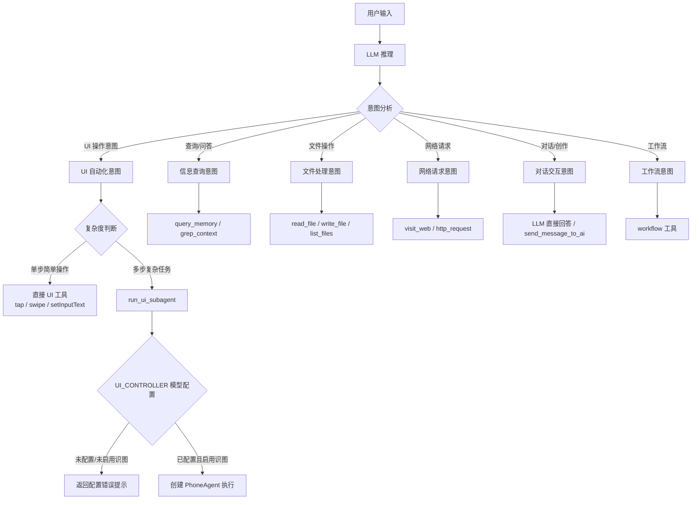
```mermaid
flowchart TD
    UserInput[用户输入] --> LLM[LLM 推理]

    LLM --> IntentAnalysis{意图分析}

    IntentAnalysis -->|UI 操作意图| UIIntent[UI 自动化意图]
    IntentAnalysis -->|查询/问答| QueryIntent[信息查询意图]
    IntentAnalysis -->|文件操作| FileIntent[文件处理意图]
    IntentAnalysis -->|网络请求| NetIntent[网络请求意图]
    IntentAnalysis -->|对话/创作| ChatIntent[对话交互意图]
    IntentAnalysis -->|工作流| WorkflowIntent[工作流意图]

    UIIntent --> UIComplexity{复杂度判断}
    UIComplexity -->|单步简单操作| DirectUITool[直接 UI 工具<br/>tap / swipe / setInputText]
    UIComplexity -->|多步复杂任务| SubAgent[run_ui_subagent]

    SubAgent --> ModelCheck{UI_CONTROLLER 模型配置}
    ModelCheck -->|未配置/未启用识图| ConfigError[返回配置错误提示]
    ModelCheck -->|已配置且启用识图| ExecuteSubAgent[创建 PhoneAgent 执行]

    QueryIntent --> QueryTool[query_memory / grep_context]
    FileIntent --> FileTool[read_file / write_file / list_files]
    NetIntent --> NetTool[visit_web / http_request]
    ChatIntent --> DirectAnswer[LLM 直接回答 / send_message_to_ai]
    WorkflowIntent --> WorkflowTool[workflow 工具]
```

#### 4.2.4 决策矩阵

| 维度 | 使用 SubAgent | 使用直接工具 | 使用 LLM 直接回答 |
|------|--------------|-------------|-------------------|
| **步骤数量** | ≥ 3 步 | 1-2 步 | 0 步 |
| **视觉理解** | 需要识图 | 无需识图 | 无需识图 |
| **条件判断** | 有条件分支 | 线性流程 | 无流程 |
| **错误恢复** | 需要容错 | 简单执行 | 不涉及 |
| **跨应用** | 跨多个应用 | 单应用内 | 不涉及 |

### 4.3 工具发现与三层自动激活

`AIToolHandler.getToolExecutorOrActivate()` 是意图路由的核心方法，实现三层渐进式工具发现：

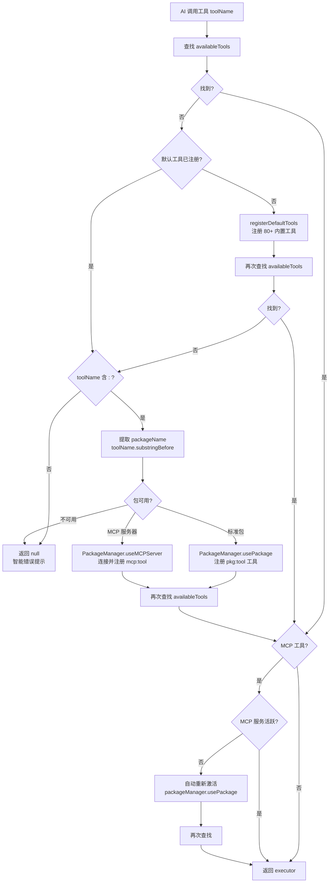
```mermaid
flowchart TD
    Start[AI 调用工具 toolName] --> Lookup1[查找 availableTools]

    Lookup1 --> Found1{找到?}
    Found1 -->|是| CheckMCP{MCP 工具?}
    Found1 -->|否| CheckDefault{默认工具已注册?}

    CheckDefault -->|否| RegisterDefault[registerDefaultTools<br/>注册 80+ 内置工具]
    RegisterDefault --> Lookup2[再次查找 availableTools]
    Lookup2 --> Found2{找到?}
    Found2 -->|是| CheckMCP
    Found2 -->|否| CheckColon

    CheckDefault -->|是| CheckColon
    CheckColon{toolName 含 : ?}
    CheckColon -->|否| NotFound[返回 null<br/>智能错误提示]
    CheckColon -->|是| ExtractPkg[提取 packageName<br/>toolName.substringBefore]

    ExtractPkg --> CheckAvail{包可用?}
    CheckAvail -->|标准包| UsePackage[PackageManager.usePackage<br/>注册 pkg:tool 工具]
    CheckAvail -->|MCP 服务器| UseMCP[PackageManager.useMCPServer<br/>连接并注册 mcp:tool]
    CheckAvail -->|不可用| NotFound

    UsePackage --> Lookup3[再次查找 availableTools]
    UseMCP --> Lookup3
    Lookup3 --> CheckMCP

    CheckMCP -->|否| ReturnExecutor[返回 executor]
    CheckMCP -->|是| CheckActive{MCP 服务活跃?}
    CheckActive -->|是| ReturnExecutor
    CheckActive -->|否| Reactivate[自动重新激活<br/>packageManager.usePackage]
    Reactivate --> Lookup4[再次查找]
    Lookup4 --> ReturnExecutor
```

**关键代码** — [AIToolHandler.kt](file:///Users/liangyingjie/Documents/my_agent_projects/Operit/app/src/main/java/com/ai/assistance/operit/core/tools/AIToolHandler.kt)：

```kotlin
fun getToolExecutorOrActivate(toolName: String): ToolExecutor? {
    var executor = availableTools[toolName]

    // 阶段1: 默认工具未注册时先注册
    if (executor == null && !defaultToolsRegistered.get()) {
        registerDefaultTools()
        executor = availableTools[toolName]
    }

    // 阶段2: 含 ":" 的工具名 → 自动激活 Package/MCP
    if (executor == null && toolName.contains(':')) {
        val packageName = toolName.substringBefore(':', missingDelimiterValue = "")
        if (packageName.isNotBlank()) {
            val packageManager = getOrCreatePackageManager()
            val isPackageAvailable = packageManager.getAvailablePackages().containsKey(packageName)
            val isMcpAvailable = packageManager.getAvailableServerPackages().containsKey(packageName)
            if (isPackageAvailable || isMcpAvailable) {
                packageManager.usePackage(packageName)
                executor = availableTools[toolName]
            }
        }
    }

    // 阶段3: MCP 服务不活跃时自动重新激活
    if (executor != null && toolName.contains(':')) {
        val packageName = toolName.substringBefore(':', missingDelimiterValue = "")
        if (packageName.isNotBlank()) {
            val packageManager = getOrCreatePackageManager()
            val isMcpAvailable = packageManager.getAvailableServerPackages().containsKey(packageName)
            if (isMcpAvailable && !isMcpServiceActive(packageName)) {
                packageManager.usePackage(packageName)
                executor = availableTools[toolName]
            }
        }
    }

    return executor
}
```

#### 工具名冒号约定

包内工具统一使用 `packageName:toolName` 命名格式，系统通过检测 `:` 来触发自动激活：

| 工具名格式 | 解析逻辑 | 示例 |
|-----------|----------|------|
| `tool_name` | 直接查找内置工具 | `read_file` |
| `pkg:tool` | 提取 `pkg`，激活 Package，查找 `pkg:tool` | `weather:get_forecast` |
| `mcp:tool` | 提取 `mcp`，激活 MCP 服务器，查找 `mcp:tool` | `filesystem:read_file` |

**解析实现**：

```kotlin
// AIToolHandler.kt — 使用 substringBefore 提取包名
val packageName = toolName.substringBefore(':', missingDelimiterValue = "")

// MCPToolExecutor.kt — 使用 split 分割，支持工具名含冒号
val toolNameParts = tool.name.split(":")
val serverName = toolNameParts[0]
val actualToolName = toolNameParts.subList(1, toolNameParts.size).joinToString(":")

// JsToolManager.kt — 使用 indexOf 找第一个冒号
val separatorIndex = toolName.indexOf(':')
return toolName.substring(0, separatorIndex) to toolName.substring(separatorIndex + 1)
```

#### 工具不可用时的智能错误提示

当工具查找失败时，`buildToolNotAvailableErrorMessage` 根据工具名格式给出针对性提示：

| 情况 | 错误提示 | 示例 |
|------|----------|------|
| 含 `.` 不含 `:` | "请使用 `packName:toolName` 格式" | `weather.forecast` → 提示用 `weather:forecast` |
| 含 `:` 但包不存在 | "Package not found" | `unknown:tool` |
| 含 `:` 但工具是 advice-only | "This tool is advice-only" | `pkg:info_tool` |
| 直接用包名当工具名 | "是工具包不是工具，请先 use_package" | `weather` |

### 4.4 SubAgent 路由模式

SubAgent 是意图路由中的特殊模式——工具执行器内部启动一个**嵌套的 AI 推理循环**，形成 Agent 嵌套：

```
主 AI 循环 (EnhancedAIService ReAct Loop)
    │
    ├──► 普通工具调用
    │       ToolExecutor.invoke() → 直接返回结果
    │
    └──► SubAgent 工具调用
            │
            ├──► run_ui_subagent
            │       StandardUITools.runUiSubAgent()
            │       → 创建 PhoneAgent
            │       → 独立的截屏-推理-执行循环
            │       → 使用 UI_CONTROLLER 专用模型
            │       → 返回 AutomationExecutionResult
            │
            └──► send_message_to_ai
                    ChatManagerTool.sendMessageToAI()
                    → 创建独立 EnhancedAIService 实例
                    → 独立的 ReAct 循环
                    → 使用 CHAT 模型
                    → 返回 AI 回复结果
```

#### 4.4.1 run_ui_subagent 调用链路

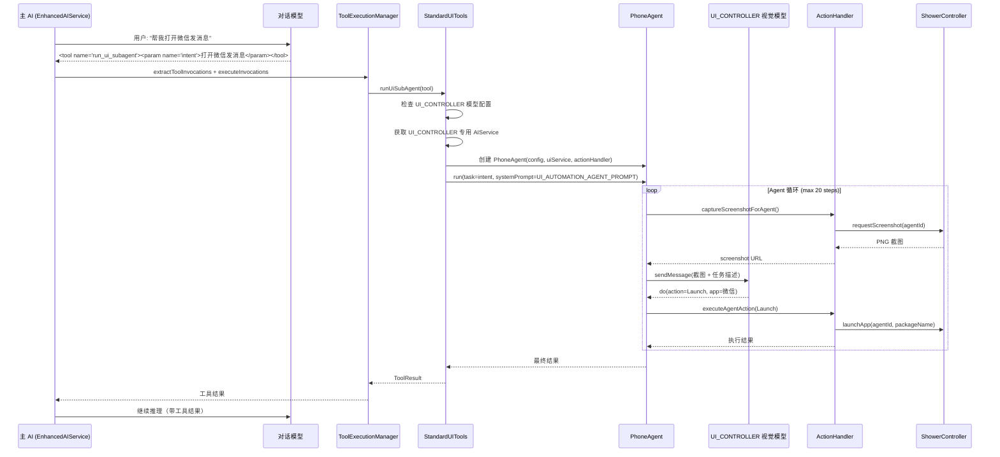
```mermaid
sequenceDiagram
    participant MainAI as 主 AI (EnhancedAIService)
    participant LLM as 对话模型
    participant TEM as ToolExecutionManager
    participant UITools as StandardUITools
    participant PhoneAgent as PhoneAgent
    participant VLM as UI_CONTROLLER 视觉模型
    participant AH as ActionHandler
    participant Shower as ShowerController

    MainAI->>LLM: 用户: "帮我打开微信发消息"
    LLM-->>MainAI: <tool name="run_ui_subagent"><param name="intent">打开微信发消息</param></tool>

    MainAI->>TEM: extractToolInvocations + executeInvocations
    TEM->>UITools: runUiSubAgent(tool)

    UITools->>UITools: 检查 UI_CONTROLLER 模型配置
    UITools->>UITools: 获取 UI_CONTROLLER 专用 AIService
    UITools->>PhoneAgent: 创建 PhoneAgent(config, uiService, actionHandler)

    UITools->>PhoneAgent: run(task=intent, systemPrompt=UI_AUTOMATION_AGENT_PROMPT)

    loop Agent 循环 (max 20 steps)
        PhoneAgent->>AH: captureScreenshotForAgent()
        AH->>Shower: requestScreenshot(agentId)
        Shower-->>AH: PNG 截图
        AH-->>PhoneAgent: screenshot URL

        PhoneAgent->>VLM: sendMessage(截图 + 任务描述)
        VLM-->>PhoneAgent: do(action=Launch, app=微信)

        PhoneAgent->>AH: executeAgentAction(Launch)
        AH->>Shower: launchApp(agentId, packageName)
        AH-->>PhoneAgent: 执行结果
    end

    PhoneAgent-->>UITools: 最终结果
    UITools-->>TEM: ToolResult
    TEM-->>MainAI: 工具结果
    MainAI->>LLM: 继续推理（带工具结果）
```

#### 4.4.2 SubAgent 工具注册

```kotlin
// ToolRegistration.kt — run_ui_subagent 注册
handler.registerTool(
    name = "run_ui_subagent",
    descriptionGenerator = { tool ->
        val intent = tool.parameters.find { it.name == "intent" }?.value ?: ""
        val maxSteps = tool.parameters.find { it.name == "max_steps" }?.value ?: "20"
        buildString {
            append(s(R.string.toolreg_run_ui_subagent_desc, intent, maxSteps))
            append(s(R.string.toolreg_run_ui_subagent_hint))
        }
    },
    executor = { tool -> runBlocking(Dispatchers.IO) { uiTools.runUiSubAgent(tool) } }
)

// ToolRegistration.kt — send_message_to_ai 注册
handler.registerTool(
    name = "send_message_to_ai",
    executor = { tool -> runBlocking(Dispatchers.IO) { chatManagerTool.sendMessageToAI(tool) } }
)
handler.registerTool(
    name = "send_message_to_ai_streaming",
    executor = object : ToolExecutor {
        override fun invoke(tool: AITool): ToolResult = ...
        override fun invokeAndStream(tool: AITool): Flow<ToolResult> =
            chatManagerTool.sendMessageToAIStream(tool)
    }
)
```

#### 4.4.3 JS 桥接层 SubAgent 定义

```javascript
// JsTools.kt 中定义的 JS 工具桥接
var Tools = {
    UI: {
        runSubAgent: (intent, maxSteps, agentId, targetApp) => {
            const params = { intent: String(intent || "") };
            if (maxSteps !== undefined) params.max_steps = String(maxSteps);
            if (agentId !== undefined && agentId !== null && String(agentId).length > 0)
                params.agent_id = String(agentId);
            if (targetApp !== undefined && targetApp !== null && String(targetApp).length > 0)
                params.target_app = String(targetApp);
            return toolCall("run_ui_subagent", params);
        },
    },
    Chat: {
        sendMessage: (message, chatId, roleCardId, senderName, options = {}) => {
            return toolCall("send_message_to_ai", params);
        },
        sendMessageStreaming: (message, chatId, roleCardId, senderName, options = {}) => {
            return toolCall("send_message_to_ai_streaming", params, toolOptions);
        },
    }
};
```

### 4.5 多模型功能路由（FunctionType）

不同类型的 AI 任务路由到不同的模型配置，通过 `FunctionType` 枚举和 `MultiServiceManager` 实现：

```kotlin
enum class FunctionType {
    CHAT,                    // 常规对话
    SUMMARY,                 // 对话总结
    MEMORY,                  // 记忆库处理
    UI_CONTROLLER,           // UI 自动化控制
    TRANSLATION,             // 翻译功能
    GREP,                    // Grep 上下文检索/代码搜索规划
    ROLE_RESPONSE_PLANNER,   // 角色回答顺序规划
    IMAGE_RECOGNITION,       // 图像识别
    AUDIO_RECOGNITION,       // 音频识别
    VIDEO_RECOGNITION        // 视频识别
}
```

#### 路由机制

```
EnhancedAIService
    │
    └──► MultiServiceManager.getServiceForFunction(functionType)
            │
            ├──► functionalConfigManager.getConfigMappingForFunction(functionType)
            │       返回 (configId, modelIndex) 映射
            │
            ├──► modelConfigManager.getModelConfigFlow(configId)
            │       返回对应配置的 ModelConfigData
            │
            ├──► createServiceFromConfig(config, modelIndex)
            │       创建 AIService 实例
            │
            └──► 缓存到 serviceInstances[functionType]
                    后续相同 FunctionType 直接复用
```

#### 功能路由与意图路由的协作

```
用户输入: "帮我打开微信发消息"
    │
    ▼
主 AI 循环 (FunctionType.CHAT 模型)
    │
    ├── LLM 决定调用 run_ui_subagent
    │
    ▼
StandardUITools.runUiSubAgent()
    │
    ├── 获取 UI_CONTROLLER 专用模型配置
    │   val uiConfig = EnhancedAIService.getModelConfigForFunction(context, FunctionType.UI_CONTROLLER)
    │
    ├── 检查识图能力
    │   if (!uiConfig.enableDirectImageProcessing) → 返回错误
    │
    ├── 获取 UI_CONTROLLER 专用 AIService
    │   val uiService = EnhancedAIService.getAIServiceForFunction(context, FunctionType.UI_CONTROLLER)
    │
    └── 创建 PhoneAgent 使用 UI_CONTROLLER 模型
        PhoneAgent(uiService = uiService, ...)
```

#### 速率限制

```kotlin
class RateLimitedAIService(private val delegate: AIService) : AIService {
    // 速率限制：每分钟最多 N 次请求
    // 并发限制：最多 M 个并发请求
    // 超时保护：单次请求最长 T 秒
}
```

### 4.6 CLI 模式路由（search + proxy）

对于不支持 Function Calling 的本地模型（Ollama、LM Studio、MNN、Llama.cpp 等），系统自动切换为 CLI 模式，使用 **search + proxy** 两步代理方式暴露工具能力：

```kotlin
enum class ToolExposureMode {
    FULL,   // 完整模式：直接暴露所有工具描述
    CLI;    // CLI 模式：只暴露 search + proxy 两个入口

    companion object {
        fun resolve(providerType: ApiProviderType): ToolExposureMode {
            return when (providerType) {
                ApiProviderType.LMSTUDIO,
                ApiProviderType.OLLAMA,
                ApiProviderType.OPENAI_LOCAL,
                ApiProviderType.MNN,
                ApiProviderType.LLAMA_CPP -> CLI
                else -> FULL
            }
        }
    }
}
```

#### CLI 模式工作流程

```
AI 需要执行工具时：
    │
    ├──► Step 1: search(query)
    │       搜索隐藏的工具目录
    │       返回匹配的工具名称和描述
    │
    └──► Step 2: proxy(tool_name, params)
            代理执行实际工具
            返回工具执行结果
```

**CLI 模式下的工具白名单**：

```kotlin
private val PUBLIC_TOOL_NAMES = linkedSetOf(
    "search",   // 搜索工具目录
    "proxy"     // 代理执行工具
)
```

**CLI 模式下的系统提示词替换**：

```kotlin
if (toolExposureMode == ToolExposureMode.CLI) {
    prompt = prompt
        .replace("TOOL_USAGE_GUIDELINES_SECTION", CliToolModeSupport.buildCliModePrompt(useEnglish))
        .replace("PACKAGE_SYSTEM_GUIDELINES_SECTION", "")
        .replace("ACTIVE_PACKAGES_SECTION", "")
        .replace("AVAILABLE_TOOLS_SECTION", "")
}
```

CLI 模式下不直接列出工具列表和包系统说明，而是替换为 search+proxy 使用说明。

### 4.7 完整路由流程图

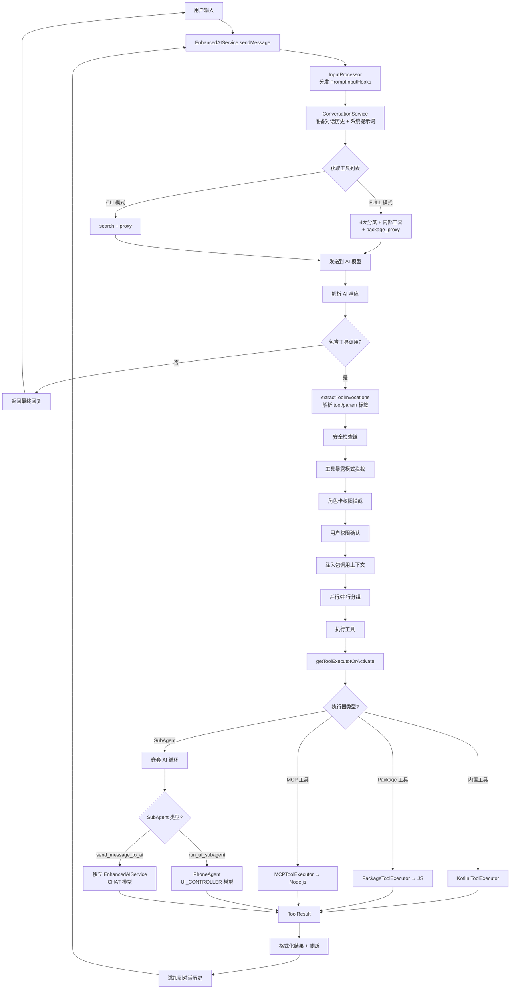
```mermaid
flowchart TB
    User[用户输入] --> EAS[EnhancedAIService.sendMessage]

    EAS --> InputProc[InputProcessor<br/>分发 PromptInputHooks]
    InputProc --> ConvSvc[ConversationService<br/>准备对话历史 + 系统提示词]

    ConvSvc --> ToolList{获取工具列表}
    ToolList -->|FULL 模式| FullTools[4大分类 + 内部工具<br/>+ package_proxy]
    ToolList -->|CLI 模式| CliTools[search + proxy]

    FullTools --> SendLLM[发送到 AI 模型]
    CliTools --> SendLLM

    SendLLM --> ParseResponse[解析 AI 响应]

    ParseResponse --> HasTool{包含工具调用?}
    HasTool -->|否| FinalReply[返回最终回复]
    HasTool -->|是| ExtractTools[extractToolInvocations<br/>解析 tool/param 标签]

    ExtractTools --> SecurityCheck[安全检查链]
    SecurityCheck --> ExposureMode[工具暴露模式拦截]
    ExposureMode --> RoleCardCheck[角色卡权限拦截]
    RoleCardCheck --> PermCheck[用户权限确认]
    PermCheck --> InjectCtx[注入包调用上下文]
    InjectCtx --> Grouping[并行/串行分组]

    Grouping --> Execute[执行工具]

    Execute --> FindExecutor[getToolExecutorOrActivate]
    FindExecutor --> ExecutorType{执行器类型?}

    ExecutorType -->|内置工具| KotlinExec[Kotlin ToolExecutor]
    ExecutorType -->|Package 工具| PkgExec[PackageToolExecutor → JS]
    ExecutorType -->|MCP 工具| McpExec[MCPToolExecutor → Node.js]
    ExecutorType -->|SubAgent| SubAgentExec[嵌套 AI 循环]

    SubAgentExec --> SubAgentType{SubAgent 类型?}
    SubAgentType -->|run_ui_subagent| PhoneAgentExec[PhoneAgent<br/>UI_CONTROLLER 模型]
    SubAgentType -->|send_message_to_ai| ChatAgentExec[独立 EnhancedAIService<br/>CHAT 模型]

    KotlinExec --> ToolResult[ToolResult]
    PkgExec --> ToolResult
    McpExec --> ToolResult
    PhoneAgentExec --> ToolResult
    ChatAgentExec --> ToolResult

    ToolResult --> FormatResult[格式化结果 + 截断]
    FormatResult --> AddHistory[添加到对话历史]
    AddHistory --> EAS

    FinalReply --> User
```

---

## 五、工具系统架构

### 5.1 工具注册与执行

```
┌─────────────────────────────────────────────────────────────────────────────┐
│                            AIToolHandler                                     │
│                         (工具注册/查找/执行中心)                               │
└─────────────────────────────────────────────────────────────────────────────┘
        │
        ├──► registerTool(name, executor)  ──►  availableTools[name] = executor
        │
        ├──► executeTool(tool: AITool)
        │       │
        │       ├──► 1. 通知 Hook: onToolCallRequested
        │       ├──► 2. 查找 executor
        │       │       • 直接查找 availableTools[name]
        │       │       • 未找到 → getToolExecutorOrActivate(name)
        │       │               • name 含 ":" → 自动激活 Package/MCP
        │       │               • "pkg:tool" → PackageManager.usePackage("pkg")
        │       │               • "mcp:tool" → MCPManager.getOrCreateClient("mcp")
        │       ├──► 3. 参数验证: executor.validateParameters(tool)
        │       ├──► 4. 通知 Hook: onToolPermissionChecked
        │       ├──► 5. 通知 Hook: onToolExecutionStarted
        │       ├──► 6. 执行: executor.invoke(tool) → ToolResult
        │       ├──► 7. 通知 Hook: onToolExecutionResult
        │       └──► 8. 通知 Hook: onToolExecutionFinished
        │
        └──► executeToolAndStream(tool: AITool) → Flow<ToolResult>
                • 支持流式结果（中间结果 + 最终结果）
```

### 5.2 四种工具扩展方式

| 方式 | 格式 | 执行器 | 扩展能力 |
|------|------|--------|----------|
| **内置工具** | `tool_name` | Kotlin ToolExecutor | 80+ 默认工具 |
| **MCP 插件** | `server:tool` | MCPToolExecutor | Node.js 第三方工具 |
| **Package 工具** | `pkg:tool` | PackageToolExecutor | JS 脚本工具 |
| **ToolPkg** | `pkg:tool` | PackageToolExecutor | JS + Compose DSL + 钩子 |

### 5.3 工具执行管理器 — ToolExecutionManager

```
executeInvocations(invocations, ...)
    │
    ├──► 1. 工具暴露模式拦截
    │       • CLI 模式 → 只允许白名单工具
    │       • FULL 模式 → 允许所有工具
    │
    ├──► 2. 角色卡工具权限拦截
    │       • 角色卡定义了 allowedTools → 只允许列表内工具
    │
    ├──► 3. 权限检查
    │       • 敏感工具（execute_shell, write_file 等）→ 弹窗确认
    │       • 非敏感工具 → 自动授权
    │
    ├──► 4. 注入包调用上下文
    │       • __operit_package_caller_name
    │       • __operit_package_caller_card_id
    │       • __operit_package_chat_id
    │
    ├──► 5. 并行/串行分组
    │       • 并行组：list_files, read_file, read_file_part, grep_code, grep_context,
    │                 find_files, query_memory, get_memory_by_title, file_info, file_exists
    │       • 串行组：其他所有工具
    │
    ├──► 6. 执行
    │       • 并行组 → coroutineScope { launch { ... } } 并发执行
    │       • 串行组 → 逐个执行
    │
    └──► 7. 按原始顺序聚合结果
```

---

## 六、PhoneAgent — 视觉 UI 自动化 Agent

### 6.1 架构

```
┌─────────────────────────────────────────────────────────────────────────────┐
│                            PhoneAgent                                        │
│                    (视觉语言模型驱动的 UI 自动化)                               │
└─────────────────────────────────────────────────────────────────────────────┘
        │
        ├──► AgentConfig(maxSteps = 20)
        │
        ├──► run(task, systemPrompt, onStep, isPausedFlow, targetApp)
        │       │
        │       ├──► 确保虚拟屏幕就绪
        │       │       • ShowerController.ensureDisplay()
        │       │       • 或 VirtualDisplayManager.ensureVirtualDisplay()
        │       │
        │       ├──► 预热 Shower（可选）
        │       │
        │       └──► 循环执行 _executeStep() 直到完成
        │               │
        │               ├──► 1. 截屏
        │               │       captureScreenshotForAgent()
        │               │       • Shower 虚拟屏截图
        │               │       • 或标准截屏工具
        │               │
        │               ├──► 2. 构建多模态消息
        │               │       • 系统提示词（UI 自动化 Agent Prompt）
        │               │       • 截屏图片
        │               │       • 任务描述
        │               │
        │               ├──► 3. 调用视觉语言模型
        │               │       uiService.sendMessage(...)
        │               │
        │               ├──► 4. 解析 AI 响应
        │               │       parseThinkingAndAction(response)
        │               │       • 提取思考过程
        │               │       • 解析动作指令
        │               │
        │               ├──► 5. 执行动作
        │               │       ActionHandler.handle(action)
        │               │       • Launch → 启动应用
        │               │       • Tap → 点击坐标
        │               │       • Type → 输入文本
        │               │       • Swipe → 滑动
        │               │       • Back → 返回键
        │               │       • Home → 主页键
        │               │       • Wait → 等待
        │               │       • Take_over → 交还用户控制
        │               │
        │               └──► 6. 检查完成条件
        │                       • finish(message=...) → 任务完成
        │                       • maxSteps 达到 → 强制结束
        │                       • 异常 → 报错退出
        │
        └──► PhoneAgentJobRegistry
                • 管理所有活跃 Agent 协程
                • 支持按 agentId 取消
                • 支持全局取消
```

### 6.2 动作格式

```
AI 输出格式：
    do(action=Launch, app=com.example.app)
    do(action=Tap, x=500, y=800)
    do(action=Type, text=Hello World)
    do(action=Swipe, startX=500, startY=800, endX=500, endY=400, duration=300)
    do(action=Back)
    do(action=Home)
    do(action=Wait, duration=1000)
    do(action=Take_over)
    finish(message=任务已完成)
```

### 6.3 Shower 虚拟屏集成

```
PhoneAgent
    │
    ├──► ShowerController (全局单例)
    │       │
    │       ├──► instances: Map<agentId, ClientShowerController>
    │       │
    │       ├──► ensureDisplay(agentId, width, height, dpi, bitrate)
    │       │       • 创建虚拟显示屏
    │       │
    │       ├──► tap/swipe/key(agentId, ...)
    │       │       • 注入触摸/按键事件
    │       │
    │       ├──► requestScreenshot(agentId)
    │       │       • 截取当前帧
    │       │
    │       └──► shutdown(agentId)
    │               • 销毁虚拟屏
    │
    ├──► ShowerServerManager
    │       • 管理 shower-server.jar 生命周期
    │       • 从 assets 拷贝并启动
    │
    └──► ShowerBinderRegistry
            • 管理 IShowerService Binder 连接
            • 接收广播通知服务就绪
```

---

## 七、Prompt 钩子系统

### 7.1 七阶段钩子链

```
用户输入
    │
    ├──► Stage 1: PromptInputHook
    │       • 修改用户原始输入
    │       • ToolPkg 可注入预处理逻辑
    │
    ├──► Stage 2: PromptHistoryHook
    │       • 修改对话历史
    │       • ToolPkg 可添加/删除/修改历史消息
    │
    ├──► Stage 3: PromptEstimateHistoryHook
    │       • 修改估算用的对话历史（Token 计数）
    │
    ├──► Stage 4: SystemPromptComposeHook
    │       • 修改系统提示词
    │       • ToolPkg 可注入自定义指令
    │
    ├──► Stage 5: ToolPromptComposeHook
    │       • 修改工具提示词
    │       • ToolPkg 可添加/隐藏/修改工具描述
    │
    ├──► Stage 6: PromptFinalizeHook
    │       • 最终修改完整 Prompt（发送前）
    │       • ToolPkg 可做最终调整
    │
    └──► Stage 7: PromptEstimateFinalizeHook
            • 最终修改估算用 Prompt（Token 计数）
```

### 7.2 ToolPkg 钩子桥接

```
ToolPkg JS 脚本
    │
    ├──► registerToolPkgPromptHook({ event: "toolpkg_system_prompt_compose", ... })
    │
    ├──► ToolPkgPromptHookBridge (Kotlin)
    │       • 将 JS 钩子注册转换为 PromptHookRegistry 钩子
    │       • 7 个桥接对象对应 7 个阶段
    │
    └──► PromptHookRegistry (Kotlin)
            • 分发钩子事件
            • 应用钩子修改
```

### 7.3 其他钩子系统

| 钩子系统 | 触发时机 | 用途 |
|----------|----------|------|
| **AIToolHook** | 工具执行生命周期 | 通知 UI 更新、日志记录 |
| **AppLifecycleHook** | 应用生命周期事件 | ToolPkg 响应前后台切换 |
| **ToolLifecycleHook** | 工具执行前后 | ToolPkg 拦截/修改工具行为 |
| **XmlRenderHook** | XML 标签渲染 | ToolPkg 自定义消息渲染 |
| **MessageProcessingHook** | 消息处理 | ToolPkg 修改消息内容 |

---

## 八、文件绑定系统

### 8.1 设计思想

AI 生成代码后，不是直接覆盖文件，而是通过**结构化编辑指令**进行增量修改：

1. AI 输出包含 `[START-REPLACE]`/`[START-DELETE]` 标记的编辑指令
2. 每个编辑指令包含 `[OLD]`（旧内容）和 `[NEW]`（新内容）
3. `FileBindingService` 使用 **n-gram 模糊匹配** 在原始文件中定位旧内容
4. 执行替换或删除操作
5. 生成 unified diff 供用户确认

### 8.2 核心算法

```
processFileBinding(originalContent, aiGeneratedCode)
    │
    ├──► 解析编辑指令
    │       • [START-REPLACE]...[OLD]...[NEW]...[END-REPLACE]
    │       • [START-DELETE]...[OLD]...[END-DELETE]
    │
    ├──► n-gram 模糊匹配
    │       • 将 [OLD] 内容按 n-gram 分割
    │       • 在原始文件中滑动窗口搜索
    │       • 计算相似度分数
    │       • 选择最佳匹配位置
    │
    ├──► 执行编辑操作
    │       • REPLACE → 替换旧内容为新内容
    │       • DELETE → 删除旧内容
    │
    ├──► 歧义检测
    │       • 多重完美匹配 → 拒绝替换
    │       • 无匹配 → 跳过
    │
    ├──► 边界保留
    │       • 保留缩进
    │       • 保留行尾空白
    │
    └──► 生成 unified diff
            generateUnifiedDiff(original, modified)
```

---

## 九、记忆系统设计

### 9.1 系统架构总览

Operit 的记忆系统是一个基于**知识图谱**的长期记忆管理架构，支持多路混合搜索、自动知识提取和语义向量索引：

```
┌─────────────────────────────────────────────────────────────────────────────┐
│                          UI 层                                               │
│  MemoryScreen / MemoryViewModel / GraphVisualizer / FolderNavigator          │
├─────────────────────────────────────────────────────────────────────────────┤
│                          工具执行层                                          │
│  MemoryQueryToolExecutor (AI 工具接口，11 个工具)                             │
│  ToolRegistration (工具注册)                                                 │
├─────────────────────────────────────────────────────────────────────────────┤
│                          业务逻辑层                                          │
│  MemoryLibrary (核心：分析对话 + 构建知识图谱)                                 │
│  MemoryAutoSaveScheduler (定时自动保存，60s tick)                             │
├─────────────────────────────────────────────────────────────────────────────┤
│                          数据存储层                                          │
│  MemoryRepository (CRUD + 混合搜索 + 向量索引)                               │
│  MemoryAutoSaveCandidateRepository (候选队列)                                │
│  ObjectBoxManager (ObjectBox 数据库，按 profileId 隔离)                      │
│  CloudEmbeddingService (云端 Embedding 生成)                                 │
│  VectorIndexManager (HNSW 向量索引)                                          │
├─────────────────────────────────────────────────────────────────────────────┤
│                          数据模型层                                          │
│  Memory / MemoryTag / MemoryLink / MemoryProperty                           │
│  DocumentChunk / Embedding / MemoryAutoSaveCandidate                        │
│  MemorySearchConfig / MemoryScoreMode                                       │
└─────────────────────────────────────────────────────────────────────────────┘
```

### 9.2 数据模型

#### 9.2.1 核心实体关系

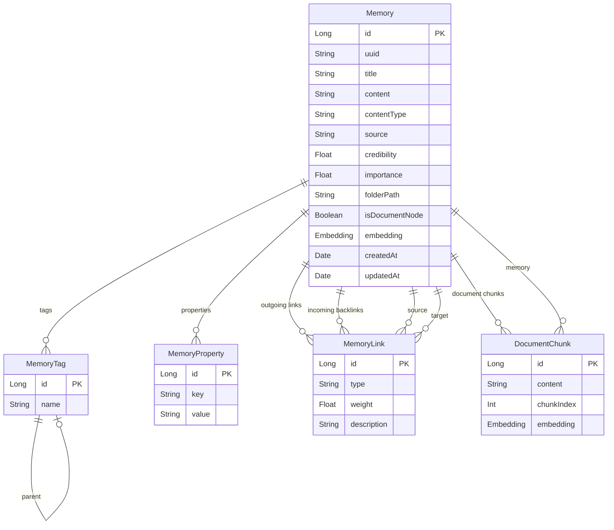
```mermaid
erDiagram
    Memory ||--o{ MemoryTag : "tags"
    Memory ||--o{ MemoryProperty : "properties"
    Memory ||--o{ MemoryLink : "outgoing links"
    Memory ||--o{ MemoryLink : "incoming backlinks"
    Memory ||--o{ DocumentChunk : "document chunks"
    MemoryTag ||--o| MemoryTag : "parent"
    MemoryLink }o--|| Memory : "source"
    MemoryLink }o--|| Memory : "target"
    DocumentChunk }o--|| Memory : "memory"

    Memory {
        Long id PK
        String uuid
        String title
        String content
        String contentType
        String source
        Float credibility
        Float importance
        String folderPath
        Boolean isDocumentNode
        Embedding embedding
        Date createdAt
        Date updatedAt
    }

    MemoryTag {
        Long id PK
        String name
    }

    MemoryLink {
        Long id PK
        String type
        Float weight
        String description
    }

    MemoryProperty {
        Long id PK
        String key
        String value
    }

    DocumentChunk {
        Long id PK
        String content
        Int chunkIndex
        Embedding embedding
    }
```

#### 9.2.2 Memory 实体

```kotlin
@Entity
data class Memory(
    @Id var id: Long = 0,
    var uuid: String = UUID.randomUUID().toString(),
    var title: String = "",              // 简短标题/摘要
    var content: String = "",            // 详细内容
    var contentType: String = "text/plain",
    var source: String = "unknown",      // 来源 (user_input, chat_summary, memory_analysis 等)
    var credibility: Float = 0.5f,       // 可信度 0.0-1.0
    var importance: Float = 0.5f,        // 重要性 0.0-1.0
    var documentPath: String? = null,    // 外部文档路径
    var isDocumentNode: Boolean = false, // 是否代表外部文档
    @Index var folderPath: String? = null, // 文件夹路径分类
    var embedding: Embedding? = null,    // 向量嵌入
    var createdAt: Date = Date(),
    var updatedAt: Date = Date(),
    var lastAccessedAt: Date = Date()
)
```

**关系**：
- `tags: ToMany<MemoryTag>` — 标签（多对多）
- `properties: ToMany<MemoryProperty>` — 键值对属性
- `links: ToMany<MemoryLink>` — 出边关联
- `backlinks: ToMany<MemoryLink>` — 入边关联（反向链接）
- `documentChunks: ToMany<DocumentChunk>` — 文档分块

#### 9.2.3 关联与标签

**MemoryLink** — 定义记忆间关系：
```kotlin
@Entity
data class MemoryLink(
    @Id var id: Long = 0,
    var type: String = "related",   // 关联类型 (causes, explains, part_of 等)
    var weight: Float = 1.0f,       // 关联强度 0.0-1.0
    var description: String = ""
)
```

**MemoryTag** — 支持层级结构：
```kotlin
@Entity
data class MemoryTag(
    @Id var id: Long = 0,
    var name: String = ""
) {
    lateinit var parent: ToOne<MemoryTag>    // 父标签
    lateinit var memories: ToMany<Memory>    // 该标签下的记忆
}
```

### 9.3 存储层设计

#### 9.3.1 ObjectBox 数据库

记忆系统使用 **ObjectBox**（非 Room）作为数据库，按 `profileId` 隔离存储：

```kotlin
object ObjectBoxManager {
    private val stores = ConcurrentHashMap<String, BoxStore>()

    fun get(context: Context, profileId: String): BoxStore {
        // 每个 profileId 有独立目录：objectbox_profiles/{profileId}
        // "default" profile 使用 "objectbox" 目录（向后兼容）
        MyObjectBox.builder()
            .androidContext(context.applicationContext)
            .directory(dbDir)
            .build()
    }
}
```

#### 9.3.2 MemoryRepository

[MemoryRepository.kt](file:///Users/liangyingjie/Documents/my_agent_projects/Operit/app/src/main/java/com/ai/assistance/operit/data/repository/MemoryRepository.kt) 是记忆系统的核心存储层（约 2814 行），提供完整的 CRUD + 搜索 + 向量索引能力：

```
MemoryRepository
    │
    ├──► CRUD 操作
    │       saveMemory() / findMemoryById() / findMemoryByTitle() / deleteMemory()
    │       createMemory() / updateMemory() / mergeMemories()
    │
    ├──► Link 操作
    │       linkMemories() / queryMemoryLinks() / updateLink() / deleteLink()
    │
    ├──► Tag 操作
    │       addTagToMemory()
    │
    ├──► 文件夹操作
    │       getAllFolderPaths() / getMemoriesByFolderPath()
    │       createFolder() / renameFolder() / deleteFolder() / moveMemoriesToFolder()
    │
    ├──► 文档操作
    │       createMemoryFromDocument() / getChunksForMemory()
    │       searchChunksInDocument() / updateChunk()
    │
    ├──► 混合搜索
    │       searchMemories() / runSearchMemoriesWithDebug()
    │
    ├──► 向量索引
    │       rebuildAllMemoryVectorIndices() / rebuildDocumentChunkIndex()
    │       addMemoryToIndexInternal()
    │
    └──► 导入导出
            exportMemoriesToJson() / importMemoriesFromJson(strategy)
                    • SKIP / UPDATE / CREATE_NEW 三种策略
```

### 9.4 混合搜索算法

记忆搜索采用**多路召回 + RRF 融合**的混合搜索策略：

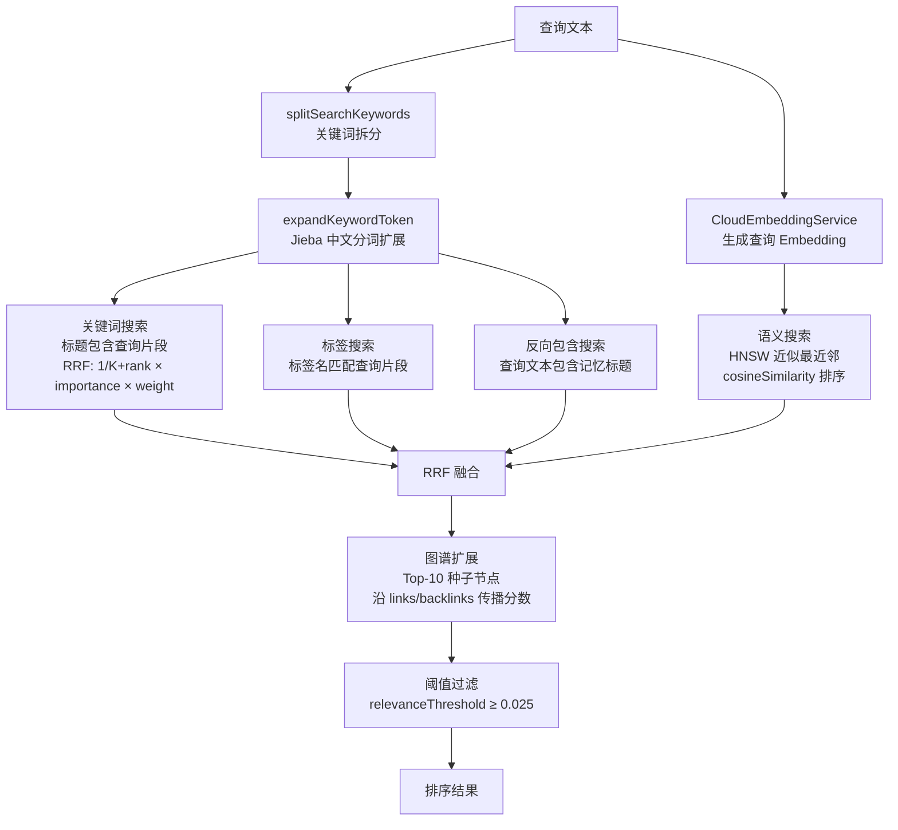
```mermaid
flowchart TD
    Query[查询文本] --> Split[splitSearchKeywords<br/>关键词拆分]
    Split --> Jieba[expandKeywordToken<br/>Jieba 中文分词扩展]

    Jieba --> Keyword[关键词搜索<br/>标题包含查询片段<br/>RRF: 1/K+rank × importance × weight]
    Jieba --> Tag[标签搜索<br/>标签名匹配查询片段]
    Jieba --> Reverse[反向包含搜索<br/>查询文本包含记忆标题]

    Query --> Embed[CloudEmbeddingService<br/>生成查询 Embedding]
    Embed --> Semantic[语义搜索<br/>HNSW 近似最近邻<br/>cosineSimilarity 排序]

    Keyword --> RRF[RRF 融合]
    Tag --> RRF
    Reverse --> RRF
    Semantic --> RRF

    RRF --> GraphExpand[图谱扩展<br/>Top-10 种子节点<br/>沿 links/backlinks 传播分数]
    GraphExpand --> Filter[阈值过滤<br/>relevanceThreshold ≥ 0.025]
    Filter --> Result[排序结果]
```

#### 搜索权重配置

```kotlin
enum class MemoryScoreMode { BALANCED, KEYWORD_FIRST, SEMANTIC_FIRST }

// 权重解析
MemoryScoreMode.BALANCED       -> (keyword=1.0x, semantic=1.0x, edge=1.0x)
MemoryScoreMode.KEYWORD_FIRST  -> (keyword=1.3x, semantic=0.8x, edge=0.9x)
MemoryScoreMode.SEMANTIC_FIRST -> (keyword=0.8x, semantic=1.3x, edge=1.1x)
```

#### 向量索引

- 使用 **HNSW** (Hierarchical Navigable Small World) 算法
- 按维度分索引文件：`memory_hnsw_{profileId}_{dimension}.idx`
- 文档区块索引：`doc_index_{profileId}_{memoryId}_{dimension}.hnsw`
- 增量更新时采用**重建策略**而非增量添加

#### Embedding 生成

- 使用云端 Embedding API（OpenAI 兼容格式）
- 记忆保存时自动生成 embedding
- 文档分块独立生成 embedding
- 支持批量重建

### 9.5 AI 工具接口

#### 9.5.1 工具列表

AI 可通过以下 11 个工具操作记忆库：

| 工具名 | 功能 | 参数 |
|--------|------|------|
| `query_memory` | 搜索记忆 | query, folder_path, threshold, snapshot_id |
| `get_memory_by_title` | 精确标题检索 | title, include_content |
| `create_memory` | 创建记忆 | title, content, tags, folder_path |
| `update_memory` | 更新记忆 | old_title, new_title, new_content |
| `delete_memory` | 删除记忆 | title |
| `move_memory` | 移动到文件夹 | title, folder_path |
| `link_memories` | 创建关联 | source_title, target_title, type, description |
| `query_memory_links` | 查询关联 | title, type |
| `update_memory_link` | 更新关联 | source, target, type, weight |
| `delete_memory_link` | 删除关联 | source, target, type |
| `update_user_preferences` | 更新用户偏好 | key-value pairs |

#### 9.5.2 Snapshot 去重机制

`query_memory` 支持 `snapshot_id` 参数，跨多次查询排除已返回的记忆，避免 AI 在同一轮对话中重复获取相同记忆。

#### 9.5.3 工具提示词分层

| 分类 | 工具 | 可见性 |
|------|------|--------|
| **基础记忆工具** | query_memory, get_memory_by_title | 始终可见（公开分类） |
| **扩展记忆工具** | create/update/delete/link 等 | 内部工具分类 |

### 9.6 自动知识提取

#### 9.6.1 MemoryLibrary — 核心智能层

[MemoryLibrary.kt](file:///Users/liangyingjie/Documents/my_agent_projects/Operit/app/src/main/java/com/ai/assistance/operit/api/chat/library/MemoryLibrary.kt) 负责从对话中自动提取知识图谱：

```
saveMemory() 核心流程
    │
    ├──► 1. 裁剪对话历史
    │       去除 system 消息、清理 <memory> 标签、精简工具结果
    │
    ├──► 2. generateAnalysis() — AI 分析对话
    │       │
    │       ├── buildCandidateSearchQuery() — 构建搜索查询
    │       ├── memoryRepository.searchMemories() — 检索相关候选（最多 15 条）
    │       ├── findAndDescribeDuplicates() — 检测重复记忆
    │       ├── FunctionalPrompts.buildKnowledgeGraphExtractionPrompt() — 构建提取提示词
    │       └── parseAnalysisResult() — 解析 AI JSON 结果
    │
    ├──► 3. 执行合并操作（mergedEntities）
    │
    ├──► 4. 执行更新操作（updatedEntities）
    │
    ├──► 5. 更新用户偏好（userPreferences）
    │
    ├──► 6. 创建主要问题记忆节点（mainProblem）
    │
    ├──► 7. 处理提取的实体（extractedEntities）
    │       支持别名去重（aliasFor）
    │
    └──► 8. 创建记忆间的关联（links）
```

#### 9.6.2 AI 分析返回的 JSON 结构

```json
{
  "main": ["标题", "内容", ["标签"], "文件夹路径"],
  "new": [["标题", "内容", ["标签"], "文件夹", "别名指向"]],
  "links": [["源标题", "目标标题", "关联类型", "描述", 权重]],
  "update": [["要更新的标题", "新内容", "原因", 可信度, 重要性]],
  "merge": [{"source_titles": [...], "new_title": "...", "new_content": "...", "reason": "..."}],
  "user": {"age": "...", "gender": "...", "personality": "..."}
}
```

#### 9.6.3 自动分类

`autoCategorizeMemories()` 方法：
- 查找所有未分类记忆（folderPath 为空）
- 分批（每批 10 条）调用 AI 进行分类
- AI 返回 JSON 数组 `[{"title": "...", "folder": "..."}]`
- 更新记忆的 folderPath 并重新生成 embedding

### 9.7 自动保存调度

#### 9.7.1 触发机制

```
AI 回复完成
    ↓
EnhancedAIService.finalizeReply()
    ↓
if (enableMemoryAutoUpdate && !isSubTask && content.isNotBlank())
    MemoryAutoSaveCandidateRepository.enqueue(chatId, timestamp)
```

#### 9.7.2 MemoryAutoSaveScheduler

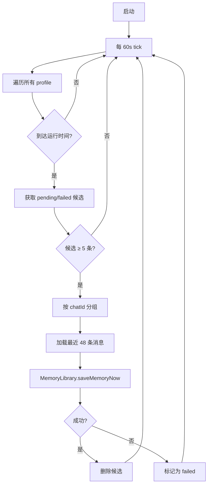
```mermaid
flowchart TD
    Start[启动] --> Tick[每 60s tick]
    Tick --> Profiles[遍历所有 profile]
    Profiles --> CheckTime{到达运行时间?}
    CheckTime -->|否| Tick
    CheckTime -->|是| GetCandidates[获取 pending/failed 候选]
    GetCandidates --> CheckCount{候选 ≥ 5 条?}
    CheckCount -->|否| Tick
    CheckCount -->|是| GroupBy[按 chatId 分组]
    GroupBy --> Load[加载最近 48 条消息]
    Load --> Save[MemoryLibrary.saveMemoryNow]
    Save --> Success{成功?}
    Success -->|是| DeleteCand[删除候选]
    Success -->|否| MarkFailed[标记为 failed]
    DeleteCand --> Tick
    MarkFailed --> Tick
```

**配置**：自动保存间隔默认 15 分钟，范围 1-180 分钟。

### 9.8 记忆与对话的集成

记忆通过**附件机制**注入到对话中：

```kotlin
// AttachmentDelegate.kt
suspend fun captureMemoryFolders(folderPaths: List<String>) {
    val memoryContext = buildMemoryContextXml(folderPaths)
    // 创建附件: fileName="memory_context.xml", mimeType="application/xml"
}

private fun buildMemoryContextXml(folderPaths: List<String>): String {
    return """
<memory_context>
 <available_folders>
  - folder1
  - folder2
 </available_folders>
 <instruction>
- **CRITICAL**: To search within the folders listed above, you **MUST** use the `query_memory` tool...
- Example: <tool name="query_memory"><param name="query">search query</param><param name="folder_path">folder1</param></tool>
 </instruction>
</memory_context>"""
}
```

**集成流程**：

```
用户选择记忆文件夹 → AttachmentDelegate.captureMemoryFolders()
    ↓
buildMemoryContextXml() → 生成 <memory_context> XML 附件
    ↓
附件注入对话 → AI 读取后使用 query_memory 工具主动搜索记忆
```

### 9.9 完整记忆系统流程图

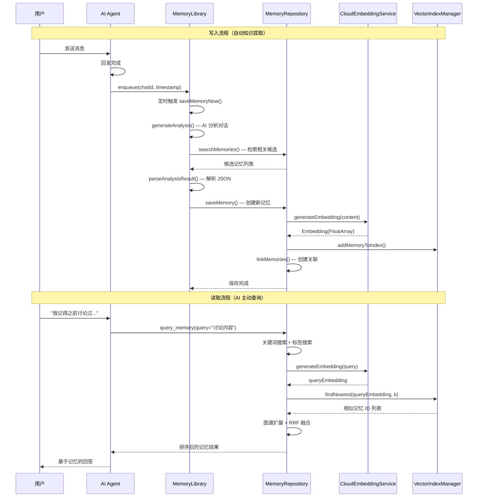
```mermaid
sequenceDiagram
    participant User as 用户
    participant AI as AI Agent
    participant ML as MemoryLibrary
    participant MR as MemoryRepository
    participant CES as CloudEmbeddingService
    participant VI as VectorIndexManager

    Note over User,VI: 写入流程（自动知识提取）

    User->>AI: 发送消息
    AI->>AI: 回复完成
    AI->>ML: enqueue(chatId, timestamp)
    ML->>ML: 定时触发 saveMemoryNow()
    ML->>ML: generateAnalysis() — AI 分析对话
    ML->>MR: searchMemories() — 检索相关候选
    MR-->>ML: 候选记忆列表
    ML->>ML: parseAnalysisResult() — 解析 JSON
    ML->>MR: saveMemory() — 创建新记忆
    MR->>CES: generateEmbedding(content)
    CES-->>MR: Embedding(FloatArray)
    MR->>VI: addMemoryToIndex()
    MR->>MR: linkMemories() — 创建关联
    MR-->>ML: 保存完成

    Note over User,VI: 读取流程（AI 主动查询）

    User->>AI: "我记得之前讨论过..."
    AI->>MR: query_memory(query="讨论内容")
    MR->>MR: 关键词搜索 + 标签搜索
    MR->>CES: generateEmbedding(query)
    CES-->>MR: queryEmbedding
    MR->>VI: findNearest(queryEmbedding, k)
    VI-->>MR: 相似记忆 ID 列表
    MR->>MR: 图谱扩展 + RRF 融合
    MR-->>AI: 排序后的记忆结果
    AI-->>User: 基于记忆的回答
```

---

## 十、对话系统设计

### 10.1 系统架构总览

Operit 的对话系统采用**分层委托架构**，将复杂的聊天业务拆分为 6 个独立 Delegate，由 ChatServiceCore 统一协调：

```
┌─────────────────────────────────────────────────────────────────────────────┐
│                          UI 层                                               │
│  ChatViewModel / AIChatScreen / FloatingChatService                          │
├─────────────────────────────────────────────────────────────────────────────┤
│                          服务协调层                                          │
│  ChatServiceCore (组合 6 Delegates + EnhancedAIService)                      │
│  ┌──────────────┐ ┌──────────────┐ ┌──────────────────────────────────┐    │
│  │UiStateDelegate│ │ApiConfigDel  │ │TokenStatisticsDelegate           │    │
│  │(UI 状态)      │ │(API 配置)    │ │(Token 统计)                      │    │
│  └──────────────┘ └──────────────┘ └──────────────────────────────────┘    │
│  ┌──────────────┐ ┌──────────────┐ ┌──────────────────────────────────┐    │
│  │AttachmentDel │ │ChatHistoryDel│ │MessageProcessingDelegate         │    │
│  │(附件管理)    │ │(历史管理)    │ │(消息处理/流式收集)               │    │
│  └──────────────┘ └──────────────┘ └──────────────────────────────────┘    │
│  ┌──────────────────────────────────────────────────────────────────────┐  │
│  │MessageCoordinationDelegate (总结/续聊/Token超限/群组编排)              │  │
│  └──────────────────────────────────────────────────────────────────────┘  │
├─────────────────────────────────────────────────────────────────────────────┤
│                          AI 消息管理层                                       │
│  AIMessageManager (准备响应流 / 角色卡解析 / 取消操作)                        │
│  EnhancedAIService (ReAct 循环 / 工具检测执行 / 流式处理)                     │
├─────────────────────────────────────────────────────────────────────────────┤
│                          对话准备层                                          │
│  ConversationService (历史准备 / XML 标签拆分 / 对话总结)                     │
│  SystemPromptConfig (动态系统提示词构建)                                      │
│  ConversationRoundManager (轮次管理)                                         │
├─────────────────────────────────────────────────────────────────────────────┤
│                          数据持久层                                          │
│  ChatHistoryManager (Repository)                                             │
│  AppDatabase → ChatDao / MessageDao / MessageVariantDao                      │
│  CharacterCardManager (DataStore)                                            │
│  TokenCacheManager (公共前缀缓存优化)                                         │
└─────────────────────────────────────────────────────────────────────────────┘
```

### 10.2 数据模型

#### 10.2.1 核心实体关系

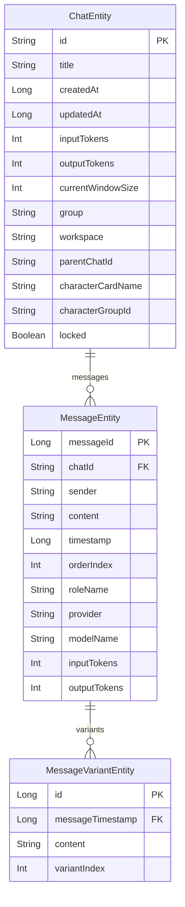
```mermaid
erDiagram
    ChatEntity ||--o{ MessageEntity : "messages"
    MessageEntity ||--o{ MessageVariantEntity : "variants"
    ChatEntity {
        String id PK
        String title
        Long createdAt
        Long updatedAt
        Int inputTokens
        Int outputTokens
        Int currentWindowSize
        String group
        String workspace
        String parentChatId
        String characterCardName
        String characterGroupId
        Boolean locked
    }
    MessageEntity {
        Long messageId PK
        String chatId FK
        String sender
        String content
        Long timestamp
        Int orderIndex
        String roleName
        String provider
        String modelName
        Int inputTokens
        Int outputTokens
    }
    MessageVariantEntity {
        Long id PK
        Long messageTimestamp FK
        String content
        Int variantIndex
    }
```

#### 10.2.2 ChatMessage — 核心消息实体

```kotlin
@Serializable
data class ChatMessage(
    val sender: String,                    // "user" or "ai"
    var content: String = "",
    val timestamp: Long = ChatMessageTimestampAllocator.next(),
    val roleName: String = "",             // 角色名字段
    val selectedVariantIndex: Int = 0,     // 当前选中的回答版本
    val variantCount: Int = 1,             // 可切换的回答版本数量
    val provider: String = "",             // 供应商
    val modelName: String = "",            // 模型名称
    val inputTokens: Int = 0,              // 本轮输入 token
    val outputTokens: Int = 0,             // 本轮输出 token
    val cachedInputTokens: Int = 0,        // 缓存命中的输入 token
    val sentAt: Long = 0L,                 // 请求发送时间
    val outputDurationMs: Long = 0L,       // 输出耗时
    val waitDurationMs: Long = 0L,         // 等待首包耗时
    val displayMode: ChatMessageDisplayMode = NORMAL,
    val isFavorite: Boolean = false,
    @Transient val contentStream: Stream<String>? = null  // 流式内容
)
```

#### 10.2.3 PromptTurn — 对话轮次抽象

```kotlin
enum class PromptTurnKind {
    SYSTEM, USER, ASSISTANT, TOOL_CALL, TOOL_RESULT, SUMMARY
}

data class PromptTurn(
    val kind: PromptTurnKind,
    val content: String,
    val toolName: String? = null,
    val metadata: Map<String, Any?> = emptyMap()
)
```

扩展函数：
- `mergeAdjacentTurns()` — 合并相邻同类型轮次（排除 SYSTEM/TOOL_CALL/TOOL_RESULT）
- `appendUserTurnIfMissing()` — 确保末尾有用户轮次

### 10.3 六 Delegate 架构

| Delegate | 职责 | 核心方法 |
|----------|------|----------|
| **UiStateDelegate** | UI 状态管理 | 错误消息、Toast、权限级别、文件选择器 |
| **ApiConfigDelegate** | API 配置管理 | API Key、端点、模型名、上下文长度、思维模式、总结阈值 |
| **TokenStatisticsDelegate** | Token 统计 | 按 chatId 维护累计 token 计数和窗口大小 |
| **AttachmentDelegate** | 附件管理 | 文件/图片/位置附件、OCR 识别、记忆文件夹注入 |
| **ChatHistoryDelegate** | 聊天历史管理 | 聊天列表、消息窗口分页、创建/删除/切换聊天 |
| **MessageProcessingDelegate** | 消息处理 | 消息发送/接收、流式收集、工具调用循环、重新生成变体 |
| **MessageCoordinationDelegate** | 消息协调 | 总结触发/取消、Token 超限处理、自动续聊、群组编排 |

### 10.4 对话历史管理

#### 10.4.1 ConversationService — 历史准备

[ConversationService.kt](file:///Users/liangyingjie/Documents/my_agent_projects/Operit/app/src/main/java/com/ai/assistance/operit/api/chat/enhance/ConversationService.kt) 将 ChatMessage 列表转换为 PromptTurn 列表：

```
prepareConversationHistory()
    │
    ├──► 1. dispatchHistoryHooks(before_prepare_history)
    │
    ├──► 2. 处理每条消息
    │       ├── processChatMessageWithTools() — 按 XML 标签拆分
    │       │   ├── <think(ing)> → ASSISTANT 消息（思考内容）
    │       │   ├── <tool> → TOOL_CALL 消息
    │       │   ├── <tool_result> → TOOL_RESULT 消息
    │       │   └── <status> → 根据 type 决定角色
    │       ├── 合并相邻同角色消息
    │       └── 规范化 tool_result 格式
    │
    ├──► 3. dispatchHistoryHooks(after_prepare_history)
    │
    └──► 4. 返回 List<PromptTurn>
```

#### 10.4.2 XML 标签处理

ChatMarkupRegex 定义了对话中的 XML 标签正则：

| 标签 | 正则 | 用途 |
|------|------|------|
| `<tool name="...">` | `toolCallPattern` | 工具调用 |
| `<tool_result>` | `toolResultTag` | 工具结果 |
| `<think(ing)>` | `thinkTag` | AI 思考过程 |
| `<status>` | `statusTag` | 状态指示 |

**随机标签名**：`generateRandomToolTagName()` 生成随机后缀（如 `tool_Ab3x`），避免模型输出固定格式，`normalizeToolLikeTagName()` 将其归一化。

#### 10.4.3 角色隔离模式

在群组编排中，不同角色的消息需要隔离：

```
非角色隔离模式：
  所有 ai 消息 → ASSISTANT

角色隔离模式：
  当前角色的消息 → ASSISTANT
  其他角色的消息 → USER，添加 [From role: xxx] 前缀
  用户消息 → 添加 [From user] 前缀
```

### 10.5 上下文窗口管理

> 上下文管理系统的完整设计详见 **十二、上下文管理系统设计**。

### 10.6 系统提示词动态构建

> 提示词系统的完整设计详见 **十一、提示词系统设计**。

### 10.7 角色卡系统

#### 10.7.1 CharacterCard 数据模型

```kotlin
@Entity(tableName = "character_cards")
data class CharacterCard(
    @PrimaryKey val id: String,
    val name: String,
    val characterSetting: String = "",     // 角色设定（引导词）
    val openingStatement: String = "",     // 开场白
    val advancedCustomPrompt: String = "", // 高级自定义引导词
    val chatModelBindingMode: String = FOLLOW_GLOBAL,  // 对话模型绑定模式
    val chatModelConfigId: String? = null, // 固定绑定配置 ID
    val memoryProfileBindingMode: String = FOLLOW_GLOBAL, // 记忆配置绑定
    val toolAccessConfig: CharacterCardToolAccessConfig = ...,  // 工具白名单
    val isDefault: Boolean = false,
)
```

#### 10.7.2 角色卡与对话的集成

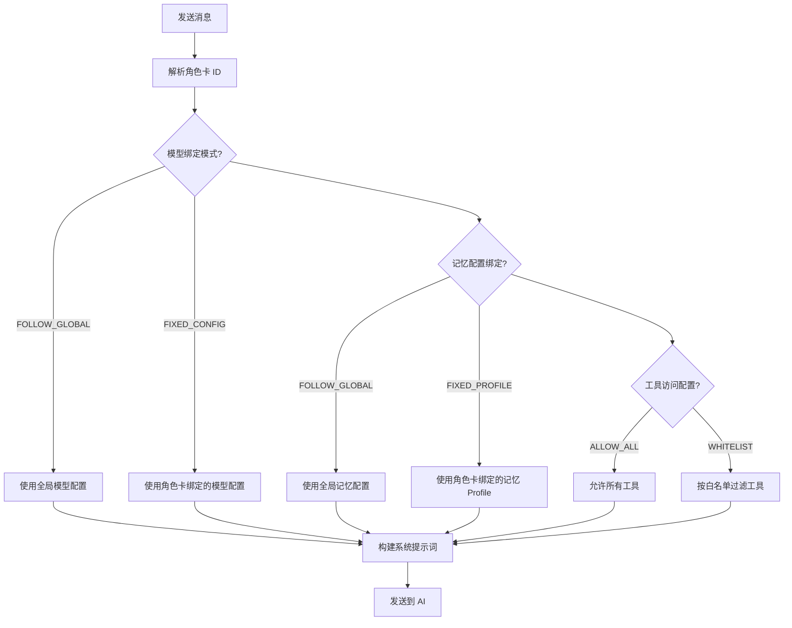
```mermaid
flowchart TD
    Start[发送消息] --> ResolveCard[解析角色卡 ID]
    ResolveCard --> CheckModel{模型绑定模式?}
    CheckModel -->|FOLLOW_GLOBAL| GlobalConfig[使用全局模型配置]
    CheckModel -->|FIXED_CONFIG| CardConfig[使用角色卡绑定的模型配置]

    CheckModel --> CheckMemory{记忆配置绑定?}
    CheckMemory -->|FOLLOW_GLOBAL| GlobalMemory[使用全局记忆配置]
    CheckMemory -->|FIXED_PROFILE| CardMemory[使用角色卡绑定的记忆 Profile]

    CheckMemory --> CheckTool{工具访问配置?}
    CheckTool -->|ALLOW_ALL| AllTools[允许所有工具]
    CheckTool -->|WHITELIST| FilterTools[按白名单过滤工具]

    GlobalConfig --> BuildPrompt[构建系统提示词]
    CardConfig --> BuildPrompt
    GlobalMemory --> BuildPrompt
    CardMemory --> BuildPrompt
    AllTools --> BuildPrompt
    FilterTools --> BuildPrompt
    BuildPrompt --> Send[发送到 AI]
```

#### 10.7.3 群组编排

```
群组编排流程：
    │
    ├──► 1. planResponseOrder() — 规划回答顺序
    │       使用 ROLE_RESPONSE_PLANNER 功能模型
    │
    ├──► 2. 按规划顺序依次调用
    │       for each member in order:
    │           sendMessageInternal(member)
    │           awaitTurnComplete()
    │
    └──► 3. 所有成员完成 → 返回最终结果
```

### 10.8 对话轮次管理

#### 10.8.1 执行上下文隔离

每个 `sendMessage` 调用创建独立的 `MessageExecutionContext`：

```kotlin
private data class MessageExecutionContext(
    val executionId: Int,
    val streamBuffer: StringBuilder = StringBuilder(),
    val roundManager: ConversationRoundManager = ConversationRoundManager(),
    val isConversationActive: AtomicBoolean = AtomicBoolean(true),
    val conversationHistory: MutableList<PromptTurn>,
    val eventChannel: MutableSharedStream<TextStreamEvent>,
)
```

#### 10.8.2 ConversationRoundManager

```kotlin
class ConversationRoundManager {
    private val roundContents = mutableMapOf<Int, String>()  // 轮次号 → 内容
    private val currentResponseRound = AtomicInteger(0)       // 当前轮次

    fun initializeNewConversation()  // 重置所有轮次
    fun updateContent(content)       // 更新当前轮次内容
    fun startNewRound()              // 递增轮次号，开始新轮
    fun getDisplayContent()          // 获取不含轮次分隔符的展示内容
    fun getRawContent()              // 获取含 --- Round N --- 分隔符的原始内容
}
```

#### 10.8.3 轮次切换

```
AI 响应流收集完成
    ↓
提取工具调用 (extractToolInvocations)
    ↓
执行工具
    ↓
roundManager.startNewRound() — 开始新轮次
    ↓
将工具结果加入 conversationHistory
    ↓
再次调用 serviceForFunction.sendMessage() — 发送新请求
    ↓
收集新响应 — 循环直到无工具调用
```

### 10.9 流式处理

#### 10.9.1 流式响应处理

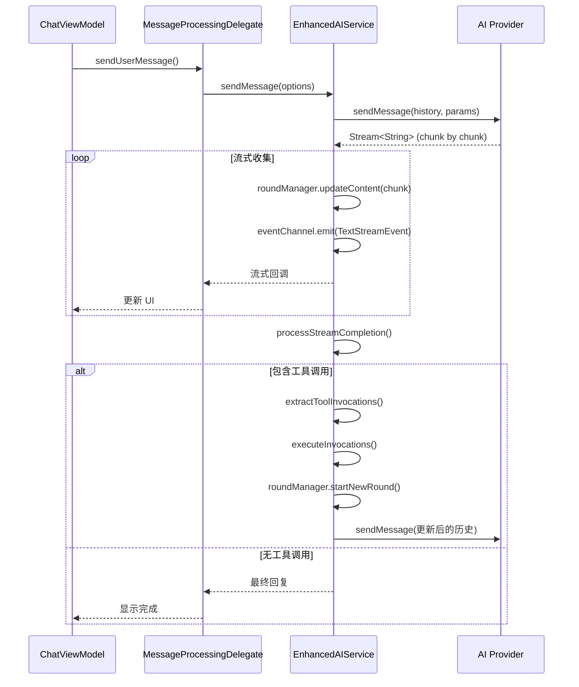
```mermaid
sequenceDiagram
    participant UI as ChatViewModel
    participant MPD as MessageProcessingDelegate
    participant EAS as EnhancedAIService
    participant AI as AI Provider

    UI->>MPD: sendUserMessage()
    MPD->>EAS: sendMessage(options)
    EAS->>AI: sendMessage(history, params)
    AI-->>EAS: Stream<String> (chunk by chunk)

    loop 流式收集
        EAS->>EAS: roundManager.updateContent(chunk)
        EAS->>EAS: eventChannel.emit(TextStreamEvent)
        EAS-->>MPD: 流式回调
        MPD-->>UI: 更新 UI
    end

    EAS->>EAS: processStreamCompletion()
    alt 包含工具调用
        EAS->>EAS: extractToolInvocations()
        EAS->>EAS: executeInvocations()
        EAS->>EAS: roundManager.startNewRound()
        EAS->>AI: sendMessage(更新后的历史)
    else 无工具调用
        EAS-->>MPD: 最终回复
        MPD-->>UI: 显示完成
    end
```

#### 10.9.2 Tool Call API 转换

不同 AI Provider 的工具调用格式统一转换为 XML 标签：

| Provider | 原始格式 | 转换目标 |
|----------|----------|----------|
| OpenAI | `tool_calls` JSON | `<tool name="..."><param>...</param></tool>` |
| Claude | `content_block_start/delta/stop` | `<tool name="..."><param>...</param></tool>` |
| 本地模型 | 文本中的 XML 标签 | 直接使用 |

#### 10.9.3 修订追踪

`TextStreamRevisionTracker` 支持流式输出中的修订（SAVEPOINT/ROLLBACK），用于工具调用时回滚已输出但不完整的内容。

### 10.10 取消与中断机制

取消操作采用**分层传播**策略：

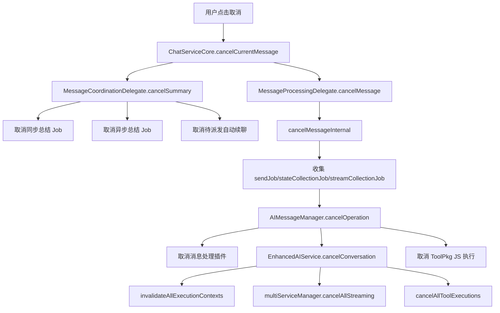
```mermaid
flowchart TD
    User[用户点击取消] --> CSC[ChatServiceCore.cancelCurrentMessage]

    CSC --> MCD[MessageCoordinationDelegate.cancelSummary]
    CSC --> MPD[MessageProcessingDelegate.cancelMessage]

    MCD --> CancelSync[取消同步总结 Job]
    MCD --> CancelAsync[取消异步总结 Job]
    MCD --> CancelAuto[取消待派发自动续聊]

    MPD --> CancelInternal[cancelMessageInternal]
    CancelInternal --> CollectJobs[收集 sendJob/stateCollectionJob/streamCollectionJob]
    CollectJobs --> AMM[AIMessageManager.cancelOperation]

    AMM --> CancelPlugin[取消消息处理插件]
    AMM --> CancelEAS[EnhancedAIService.cancelConversation]
    AMM --> CancelJS[取消 ToolPkg JS 执行]

    CancelEAS --> InvalidateCtx[invalidateAllExecutionContexts]
    CancelEAS --> CancelStream[multiServiceManager.cancelAllStreaming]
    CancelEAS --> CancelTools[cancelAllToolExecutions]
```

### 10.11 完整对话流程图

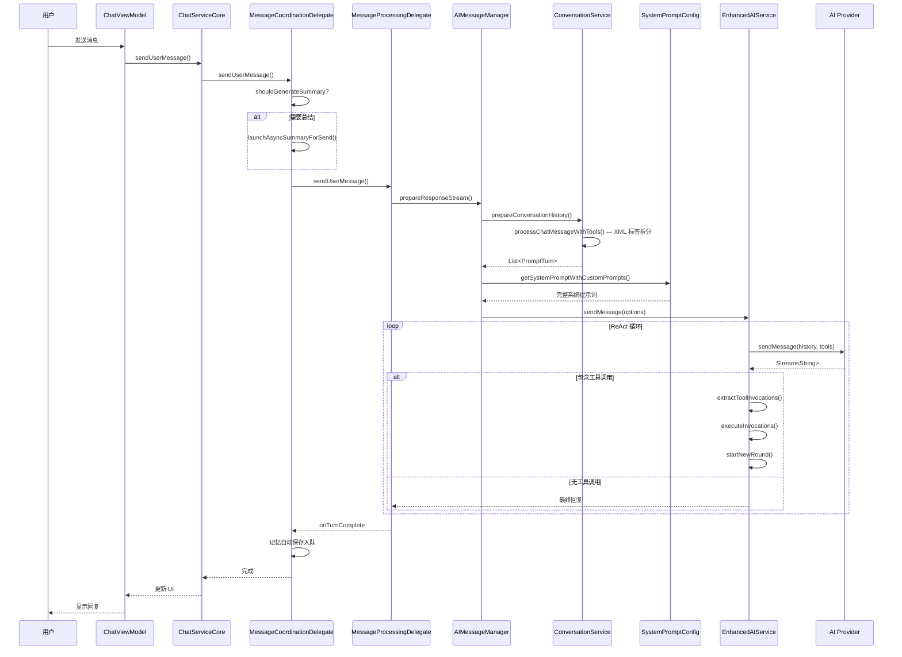
```mermaid
sequenceDiagram
    participant User as 用户
    participant VM as ChatViewModel
    participant CSC as ChatServiceCore
    participant MCD as MessageCoordinationDelegate
    participant MPD as MessageProcessingDelegate
    participant AMM as AIMessageManager
    participant CS as ConversationService
    participant SPC as SystemPromptConfig
    participant EAS as EnhancedAIService
    participant AI as AI Provider

    User->>VM: 发送消息
    VM->>CSC: sendUserMessage()
    CSC->>MCD: sendUserMessage()

    MCD->>MCD: shouldGenerateSummary?
    alt 需要总结
        MCD->>MCD: launchAsyncSummaryForSend()
    end

    MCD->>MPD: sendUserMessage()
    MPD->>AMM: prepareResponseStream()

    AMM->>CS: prepareConversationHistory()
    CS->>CS: processChatMessageWithTools() — XML 标签拆分
    CS-->>AMM: List<PromptTurn>

    AMM->>SPC: getSystemPromptWithCustomPrompts()
    SPC-->>AMM: 完整系统提示词

    AMM->>EAS: sendMessage(options)

    loop ReAct 循环
        EAS->>AI: sendMessage(history, tools)
        AI-->>EAS: Stream<String>

        alt 包含工具调用
            EAS->>EAS: extractToolInvocations()
            EAS->>EAS: executeInvocations()
            EAS->>EAS: startNewRound()
        else 无工具调用
            EAS-->>MPD: 最终回复
        end
    end

    MPD-->>MCD: onTurnComplete
    MCD->>MCD: 记忆自动保存入队
    MCD-->>CSC: 完成
    CSC-->>VM: 更新 UI
    VM-->>User: 显示回复
```

---

## 十一、提示词系统设计

### 11.1 系统架构总览

Operit 的提示词系统采用**四层分层架构**，从顶层模板到底层钩子注入，形成完整的动态提示词工程体系：

```
┌─────────────────────────────────────────────────────────────────────────────┐
│                    Layer 1: 系统提示词 (SystemPromptConfig)                    │
│    模板 + Section 占位符替换 + 角色卡自定义 + 群组编排                         │
├─────────────────────────────────────────────────────────────────────────────┤
│                    Layer 2: 工具提示词 (SystemToolPrompts)                     │
│    结构化工具定义 + 动态参数暴露 + 可见性过滤 + SAF书签注入                     │
├─────────────────────────────────────────────────────────────────────────────┤
│                    Layer 3: 功能提示词 (FunctionalPrompts)                     │
│    UI控制器 / 知识图谱提取 / 对话摘要 / 角色卡生成 / 翻译等                    │
├─────────────────────────────────────────────────────────────────────────────┤
│                    Layer 4: 钩子注入 (PromptHookRegistry + Bridge)             │
│    7阶段钩子管道 + ToolPkg JS桥接 + CLI模式适配                                │
└─────────────────────────────────────────────────────────────────────────────┘
```

### 11.2 系统提示词动态构建

#### 11.2.1 Section 占位符模板

系统提示词采用 **Section 占位符模板** 方式构建，模板定义了 6 个可替换区域：

```
系统提示词模板：
    BEGIN_SELF_INTRODUCTION_SECTION     ← 自我介绍（可自定义，角色卡注入点）
    WORKSPACE_GUIDELINES_SECTION        ← 工作区指引（读取 .operitrules 等规则文件）
    TOOL_USAGE_GUIDELINES_SECTION       ← 工具使用说明（XML格式 / ToolCall格式 / CLI格式）
    PACKAGE_SYSTEM_GUIDELINES_SECTION   ← 包系统指引（完整版 / ToolCall版 / 空）
    ACTIVE_PACKAGES_SECTION             ← 激活的工具包（动态构建包列表）
    AVAILABLE_TOOLS_SECTION             ← 可用工具列表（完整描述 / 空）
```

#### 11.2.2 三种模式分支

根据 `toolExposureMode` 和 `useToolCallApi`，Section 替换分为三种模式：

| Section | FULL 模式 | Tool Call API 模式 | CLI 模式 |
|---------|----------|-------------------|---------|
| `TOOL_USAGE_GUIDELINES` | XML 格式工具调用说明 | 空（工具通过 API 字段发送） | CLI search+proxy 说明 |
| `PACKAGE_SYSTEM_GUIDELINES` | 完整包系统说明 | ToolCall 版本（无 XML 格式） | 空 |
| `ACTIVE_PACKAGES` | 动态构建包列表 | 动态构建包列表 | 空 |
| `AVAILABLE_TOOLS` | 完整工具描述列表 | 空（通过 API tools 字段发送） | 空 |

**模式自动选择逻辑**：

```kotlin
enum class ToolExposureMode {
    FULL,   // 云端 API（OpenAI, Claude 等）
    CLI;    // 本地推理（Ollama, LMStudio, MNN, llama.cpp 等）

    companion object {
        fun resolve(providerType: ApiProviderType): ToolExposureMode {
            return when (providerType) {
                LMSTUDIO, OLLAMA, OPENAI_LOCAL, MNN, LLAMA_CPP -> CLI
                else -> FULL
            }
        }
    }
}
```

#### 11.2.3 完整动态构建流程

```
getSystemPromptWithCustomPrompts()
    │
    ├──► 1. dispatchSystemPromptComposeHooks(before_compose)
    │       钩子可完全覆盖 systemPrompt
    │
    ├──► 2. getSystemPrompt() — 基础模板 + Section 替换
    │       ├── 根据语言选择中/英文模板
    │       ├── 读取工作区规则文件 → WORKSPACE_GUIDELINES_SECTION
    │       ├── 动态构建包列表 → ACTIVE_PACKAGES_SECTION
    │       ├── 根据模式替换 TOOL_USAGE / PACKAGE / TOOLS
    │       └── 根据视觉/音频/视频能力调整
    │
    ├──► 3. applyCustomPrompts() — 角色卡自定义提示词
    │       将 customIntroPrompt 替换 BEGIN_SELF_INTRODUCTION_SECTION
    │
    ├──► 4. buildGroupOrchestrationHint() — 群组编排提示
    │       包含角色回答规划提示 + 分视角历史说明 + 参与者列表
    │
    ├──► 5. dispatchSystemPromptComposeHooks(compose_sections)
    │       钩子可修改已组装的提示词
    │
    └──► 6. dispatchSystemPromptComposeHooks(after_compose)
            钩子可做最终修改
```

#### 11.2.4 子任务代理模板

```kotlin
val SUBTASK_AGENT_PROMPT_TEMPLATE =
    """
    BEHAVIOR GUIDELINES:
    - You are a subtask-focused AI agent...
    - TOOL SCHEDULING: All tools may be called either in parallel or sequentially...
    - Summarize and Conclude...

    TOOL_USAGE_GUIDELINES_SECTION
    PACKAGE_SYSTEM_GUIDELINES_SECTION
    ACTIVE_PACKAGES_SECTION
    AVAILABLE_TOOLS_SECTION
    """.trimIndent()
```

子任务代理**没有自我介绍和工作区指南**，专注于任务执行，用于 `send_message_to_ai` 等嵌套 Agent 场景。

### 11.3 工具提示词系统

#### 11.3.1 工具分类体系

```
SystemToolPrompts
├── basicTools          ← 基础工具 (sleep, use_package)
├── fileSystemTools     ← 文件系统工具 (read_file, write_file, list_files, grep_code 等 10 个)
├── httpTools           ← HTTP 工具 (visit_web)
├── memoryTools         ← 记忆库工具 (query_memory, get_memory_by_title)
└── internalToolCategories ← 内部工具 (来自 SystemToolPromptsInternal)
    ├── execute_shell
    ├── create_terminal_session
    ├── execute_in_terminal_session
    ├── start_app / tap / swipe / setInputText
    ├── run_ui_subagent
    └── send_message_to_ai / send_message_to_ai_streaming
```

#### 11.3.2 结构化工具定义

每个工具使用 `ToolPrompt` 结构化定义：

```kotlin
ToolPrompt(
    name = "read_file",
    description = "Read the content of a file...",
    parametersStructured = listOf(
        ToolParameterSchema(name = "path", type = "string", description = "...", required = true),
        ToolParameterSchema(name = "environment", type = "string", description = "...", required = false),
        ToolParameterSchema(name = "intent", type = "string", description = "...", required = false),
    ),
    details = "..."  // 可选的详细说明
)
```

工具分类使用 `SystemToolPromptCategory`：

```kotlin
SystemToolPromptCategory(
    categoryName = "File System Tools",
    tools = listOf(...),
    categoryFooter = "..."  // 可选的分类尾部说明
)
```

#### 11.3.3 参数动态暴露

工具参数根据模型的**多模态能力**动态调整，避免暴露模型无法使用的参数：

```kotlin
val shouldExposeIntent =
    (hasBackendImageRecognition && !chatModelHasDirectImage) ||
    (hasBackendAudioRecognition && !chatModelHasDirectAudio) ||
    (hasBackendVideoRecognition && !chatModelHasDirectVideo)

// read_file 工具动态参数
if (tool.name == "read_file") {
    filteredParams = tool.parametersStructured.filter { param ->
        when (param.name) {
            "direct_image" -> false    // 始终隐藏（通过 Tool Call API image 字段传递）
            "direct_audio" -> false    // 始终隐藏
            "direct_video" -> false    // 始终隐藏
            "intent" -> shouldExposeIntent  // 仅后端识别需要时暴露
            else -> true
        }
    }
}
```

**参数暴露决策矩阵**：

| 参数 | 暴露条件 | 原因 |
|------|---------|------|
| `direct_image` | 始终不暴露 | 通过 Tool Call API 的 image 字段传递 |
| `direct_audio` | 始终不暴露 | 同上 |
| `direct_video` | 始终不暴露 | 同上 |
| `intent` | 后端识别服务可用 且 模型无直接能力 | 仅在需要后端识别时才暴露 |

#### 11.3.4 工具可见性过滤

角色卡工具白名单通过 `applyToolVisibility` 实现过滤：

```kotlin
private fun applyToolVisibility(
    categories: List<SystemToolPromptCategory>,
    toolVisibility: Map<String, Boolean>
): List<SystemToolPromptCategory> {
    return categories.mapNotNull { category ->
        val visibleTools = category.tools.filter { tool ->
            toolVisibility[tool.name] ?: true  // 默认可见
        }
        if (visibleTools.isEmpty()) null else category.copy(tools = visibleTools)
    }
}
```

#### 11.3.5 SAF 书签动态注入

SAF（Storage Access Framework）书签名被动态注入到 `read_file` 工具描述尾部：

```
**Attached Local Storage Repository:**
- environment (optional): you can also use `environment="repo:<repositoryName>"`...
- Available repositories: repo:Documents, repo:Downloads
```

#### 11.3.6 工具提示词生成流程（含钩子）

```
generateToolsPromptEn/Cn()
    │
    ├──► 1. 构建 categories（根据参数动态调整）
    │
    ├──► 2. buildToolHookPayload(categories) → 转为 Map 结构
    │
    ├──► 3. dispatchToolPromptComposeHooks(before_compose)
    │       钩子可完全覆盖 toolPrompt
    │
    ├──► 4. 若钩子未覆盖 → applyToolVisibility + joinToString 生成默认提示词
    │
    ├──► 5. dispatchToolPromptComposeHooks(filter_tool_prompt_items)
    │       钩子可过滤/修改工具列表
    │
    ├──► 6. dispatchToolPromptComposeHooks(after_compose)
    │       钩子可做最终修改
    │
    └──► 7. 返回最终 toolPrompt
```

### 11.4 功能提示词

[FunctionalPrompts.kt](file:///home/meizu/Documents/my_agent_projects/Operit/app/src/main/java/com/ai/assistance/operit/core/config/FunctionalPrompts.kt) 为独立功能模块提供专用提示词：

| 功能模块 | 方法/常量 | 用途 |
|---------|----------|------|
| **对话摘要** | `SUMMARY_PROMPT` / `SUMMARY_PROMPT_EN` | 生成对话摘要的固定格式提示词 |
| **文件合并** | `FILE_BINDING_MERGE_PROMPT` | `// ... existing code ...` 占位符合并 |
| **记忆自动分类** | `buildMemoryAutoCategorizePrompt()` | 为记忆分配合适的文件夹路径 |
| **知识图谱提取** | `buildKnowledgeGraphExtractionPrompt()` | 从对话中构建长期记忆图谱 |
| **UI 控制器** | `UI_CONTROLLER_PROMPT` | 单步 UI 自动化（返回 JSON） |
| **UI 自动化代理** | `UI_AUTOMATION_AGENT_PROMPT` | 多步 UI 自动化（AutoGLM 风格） |
| **代码搜索** | `grepContextRefineWithReadPrompt()` / `grepContextSelectPrompt()` | grep_code 多轮搜索精炼 |
| **角色卡生成** | `personaCardGenerationSystemPrompt()` | 8 步角色卡生成流程 |
| **群聊发言规划** | `GROUP_ROLE_RESPONSE_PLANNER_PROMPT` | 规划群聊成员发言顺序 |
| **翻译** | `translationSystemPrompt()` | 翻译助手 |
| **包描述生成** | `packageDescriptionSystemPrompt()` | 为 MCP 工具包生成描述 |
| **虚拟形象情绪** | `avatarMoodRulesText()` | 驱动虚拟形象动作的 mood 标签规则 |

#### 11.4.1 知识图谱提取提示词架构

这是最复杂的功能提示词，包含完整的结构化输出规范：

```
[写入前先过筛] → 只记录用户特异且可复用的信息
[抽取策略]     → 优先 update/merge，其次 new（最多5条）
[语气策略]     → 可变表达方式，不变入库标准
[标题与内容写法] → 事件优先，不写定义
[连接关系规则] → 需要明确证据才建边
[示例]         → 10+种场景的期望输出
[输出格式]     → 严格 JSON: main/new/update/merge/links/user
```

输出 Schema：

```json
{
  "main": ["Title", "Content", ["tags"], "folder_path"] | null,
  "new": [["Title", "Content", ["tags"], "folder_path", "alias_for_or_null"], ...],
  "update": [["Title", "New content", "Reason", credibility, importance], ...],
  "merge": [{"source_titles":["A","B"], "new_title":"...", "new_content":"...", "reason":"..."}, ...],
  "links": [["Source", "Target", "RELATION_TYPE", "Description", weight], ...],
  "user": { "age": "...", "gender": "...", "personality": "..." }
}
```

#### 11.4.2 UI 自动化代理提示词

采用 AutoGLM 风格的 `think/answer` 格式：

```
<think{think}</think_>
<answer>{action}</answer>
```

支持的操作指令：`Launch`, `Tap`, `Type`, `Swipe`, `Long Press`, `Double Tap`, `Back`, `Home`, `Wait`, `finish` 等 19 条严格规则。

### 11.5 七阶段钩子系统

#### 11.5.1 钩子数据模型

```kotlin
data class PromptHookContext(
    val stage: String,                    // 当前阶段名
    val chatId: String? = null,
    val functionType: String? = null,
    val rawInput: String? = null,         // 原始用户输入
    val processedInput: String? = null,   // 处理后的输入
    val chatHistory: List<PromptTurn>,    // 聊天历史
    val preparedHistory: List<PromptTurn>,// 准备好的历史
    val systemPrompt: String? = null,     // 系统提示词
    val toolPrompt: String? = null,       // 工具提示词
    val availableTools: List<Map<String, Any?>>,  // 可用工具列表
    val metadata: Map<String, Any?>       // 元数据
)

data class PromptHookMutation(
    val rawInput: String? = null,
    val processedInput: String? = null,
    val chatHistory: List<PromptTurn>? = null,
    val preparedHistory: List<PromptTurn>? = null,
    val systemPrompt: String? = null,
    val toolPrompt: String? = null,
    val metadata: Map<String, Any?> = emptyMap()
)
```

**Mutation 合并规则**：非 null 字段覆盖，metadata 做 merge（`current.metadata + mutation.metadata`）。

#### 11.5.2 七阶段钩子接口

| 阶段 | 接口 | 触发时机 | 可修改字段 |
|------|------|---------|-----------|
| 1 | `PromptInputHook` | 用户输入预处理 | `processedInput`, `rawInput` |
| 2 | `PromptHistoryHook` | 聊天历史准备 | `chatHistory`, `preparedHistory` |
| 3 | `PromptEstimateHistoryHook` | 估算 Token 时的历史 | `chatHistory`, `preparedHistory` |
| 4 | `SystemPromptComposeHook` | 系统提示词组装 | `systemPrompt` |
| 5 | `ToolPromptComposeHook` | 工具提示词组装 | `toolPrompt` |
| 6 | `PromptFinalizeHook` | 最终提示词定稿 | `processedInput`, `preparedHistory` |
| 7 | `PromptEstimateFinalizeHook` | 估算 Token 时的定稿 | `processedInput`, `preparedHistory` |

#### 11.5.3 分发机制

```kotlin
private fun <THook> dispatch(
    initialContext: PromptHookContext,
    hooks: List<THook>,
    hookLabel: String,
    invoke: (THook, PromptHookContext) -> PromptHookMutation?
): PromptHookContext {
    var current = initialContext
    hooks.forEach { hook ->
        val mutation = runCatching { invoke(hook, current) }
            .onFailure { error -> AppLogger.e(TAG, "$hookLabel callback failed", error) }
            .getOrNull() ?: return@forEach
        current = applyMutation(current, mutation)
    }
    return current
}
```

关键特性：
- **链式处理**：每个钩子接收上一个钩子的输出作为输入
- **容错**：单个钩子失败不影响后续钩子（`runCatching`）
- **线程安全**：使用 `CopyOnWriteArrayList` 存储钩子
- **去重注册**：注册时先按 id 移除旧钩子

#### 11.5.4 SystemPromptComposeHook 的三个子阶段

```
Stage 1: before_compose_system_prompt  → 钩子可完全覆盖系统提示词
Stage 2: compose_system_prompt_sections → 钩子可修改已组装的提示词
Stage 3: after_compose_system_prompt    → 钩子可做最终修改
```

#### 11.5.5 ToolPromptComposeHook 的三个子阶段

```
Stage 1: before_compose_tool_prompt  → 钩子可完全覆盖工具提示词
Stage 2: filter_tool_prompt_items    → 钩子可过滤/修改工具列表
Stage 3: after_compose_tool_prompt   → 钩子可做最终修改
```

### 11.6 ToolPkg 钩子桥接

[ToolPkgPromptHookBridge.kt](file:///home/meizu/Documents/my_agent_projects/Operit/app/src/main/java/com/ai/assistance/operit/plugins/toolpkg/ToolPkgPromptHookBridge.kt) 是 **ToolPkg 运行时** 与 **PromptHookRegistry** 之间的桥梁，将 7 个内部 Bridge 对象注册为 7 阶段钩子：

```
ToolPkg JS 脚本
    │
    ├──► registerToolPkgPromptHook({ event: "toolpkg_system_prompt_compose", ... })
    │
    ├──► ToolPkgPromptHookBridge (Kotlin)
    │       • 将 JS 钩子注册转换为 PromptHookRegistry 钩子
    │       • 7 个桥接对象对应 7 个阶段
    │       • 通过 ToolPkgRuntimeChangeListener 同步钩子注册
    │
    └──► PromptHookRegistry (Kotlin)
            • 分发钩子事件
            • 应用钩子修改
```

**分发流程**：

```
1. 遍历该阶段的所有 ToolPkg 钩子注册
2. 对每个注册，调用 manager.runToolPkgMainHook()
   - 传入 containerPackageName, functionName, event, eventPayload
3. 解码返回结果 (decodeToolPkgHookResult)
4. 根据阶段类型解析为 PromptHookMutation
5. 应用 mutation 到当前 context
6. 返回合并后的最终 mutation
```

**各阶段的 Mutation 解析**：

| 阶段 | 解析方法 | 返回类型 |
|------|---------|---------|
| PromptInput | `parsePromptInputMutation` | String→processedInput, JSONObject→全字段 |
| PromptHistory | `parsePromptHistoryMutation` | JSONArray→chatHistory/preparedHistory |
| SystemPromptCompose | `parseSystemPromptMutation` | String→systemPrompt |
| ToolPromptCompose | `parseToolPromptMutation` | String→toolPrompt |
| PromptFinalize | `parsePromptFinalizeMutation` | String→processedInput, JSONArray→preparedHistory |

### 11.7 CLI 模式提示词

#### 11.7.1 CLI 模式架构

对于不支持 Function Calling 的本地模型，系统自动切换为 CLI 模式，使用 **search + proxy** 两步代理方式暴露工具能力：

```
AI 需要执行工具时：
    │
    ├──► Step 1: search(query)
    │       搜索隐藏的工具目录
    │       返回匹配的工具名称、描述和参数提示
    │
    └──► Step 2: proxy(tool_name, params)
            代理执行实际工具
            返回工具执行结果
```

#### 11.7.2 隐藏工具目录构建

从多个来源构建完整的隐藏工具目录：

| 来源类型 | 说明 |
|---------|------|
| BUILTIN | 内置工具（SystemToolPrompts） |
| INTERNAL | 内部工具（SystemToolPromptsInternal） |
| PACKAGE | JS 包工具（PackageManager） |
| ACTIVATION | 技能包（SkillRepository） |
| MCP | MCP 工具（MCPLocalServer） |

每个目录条目结构：

```kotlin
data class HiddenToolCatalogEntry(
    val targetToolName: String,       // 实际工具名（如 "read_file" 或 "pkg:tool"）
    val displayName: String,          // 显示名
    val description: String,          // 描述
    val parameterHints: List<String>, // 参数提示
    val sourceKind: HiddenToolSourceKind,  // 来源类型
    val keywords: List<String>,       // 搜索关键词
    val suggestedParamsJson: String?  // 建议的参数 JSON
)
```

#### 11.7.3 搜索评分算法

| 匹配条件 | 分数 |
|---------|------|
| displayName/targetName 完全匹配 | +300 |
| displayName/targetName 前缀匹配 | +140 |
| displayName/targetName 包含匹配 | +100 |
| description/keywords 包含 | +40 |
| params 包含 | +25 |
| 每个搜索词在 name 中匹配 | +40 |
| 每个搜索词在 keywords 中匹配 | +16 |
| 每个搜索词在 description 中匹配 | +12 |
| 每个搜索词在 params 中匹配 | +8 |
| 所有搜索词都匹配 | +30 |

### 11.8 FULL 模式 vs CLI 模式对比

| 维度 | FULL 模式 | CLI 模式 |
|------|---------|--------|
| **适用模型** | 云端 API（OpenAI, Claude 等） | 本地推理（Ollama, LMStudio 等） |
| **工具暴露方式** | 所有工具直接列出 | 只有 search+proxy 两个公开工具 |
| **工具描述位置** | 系统提示词中完整展示 | 隐藏在目录中，按需搜索 |
| **调用格式** | XML 格式 `<tool name="...">` | search → proxy 两步调用 |
| **包系统说明** | 完整展示 | 不展示 |
| **参数暴露** | 动态调整（根据模型能力） | 通过 search 结果展示参数提示 |
| **Token 消耗** | 较高（完整工具列表） | 较低（按需搜索） |
| **Tool Call API 兼容** | 支持（工具通过 API 字段发送） | 不适用 |

### 11.9 完整提示词构建流程图

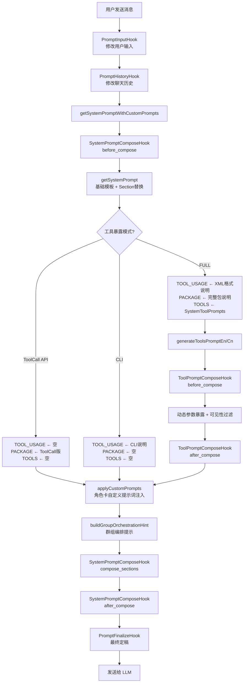
```mermaid
flowchart TB
    UserInput[用户发送消息] --> InputHook[PromptInputHook<br/>修改用户输入]

    InputHook --> HistoryHook[PromptHistoryHook<br/>修改聊天历史]

    HistoryHook --> BuildSystem[getSystemPromptWithCustomPrompts]

    BuildSystem --> BeforeCompose[SystemPromptComposeHook<br/>before_compose]
    BeforeCompose --> BaseTemplate[getSystemPrompt<br/>基础模板 + Section替换]

    BaseTemplate --> ModeCheck{工具暴露模式?}

    ModeCheck -->|FULL| FullMode[TOOL_USAGE ← XML格式说明<br/>PACKAGE ← 完整包说明<br/>TOOLS ← SystemToolPrompts]
    ModeCheck -->|ToolCall API| TcaMode[TOOL_USAGE ← 空<br/>PACKAGE ← ToolCall版<br/>TOOLS ← 空]
    ModeCheck -->|CLI| CliMode[TOOL_USAGE ← CLI说明<br/>PACKAGE ← 空<br/>TOOLS ← 空]

    FullMode --> ToolPrompt[generateToolsPromptEn/Cn]
    ToolPrompt --> ToolBefore[ToolPromptComposeHook<br/>before_compose]
    ToolBefore --> ToolFilter[动态参数暴露 + 可见性过滤]
    ToolFilter --> ToolAfter[ToolPromptComposeHook<br/>after_compose]

    TcaMode --> CustomPrompts
    CliMode --> CustomPrompts
    ToolAfter --> CustomPrompts

    CustomPrompts[applyCustomPrompts<br/>角色卡自定义提示词注入] --> GroupHint[buildGroupOrchestrationHint<br/>群组编排提示]
    GroupHint --> ComposeHook[SystemPromptComposeHook<br/>compose_sections]
    ComposeHook --> AfterHook[SystemPromptComposeHook<br/>after_compose]

    AfterHook --> Finalize[PromptFinalizeHook<br/>最终定稿]
    Finalize --> SendLLM[发送给 LLM]
```

---

## 十二、上下文管理系统设计

### 12.1 系统架构总览

Operit 的上下文管理系统负责**Token 预算管理、对话历史截断、执行上下文隔离和流式消息处理**，确保在有限的上下文窗口内高效运行多轮推理：

```
┌─────────────────────────────────────────────────────────────────────────────┐
│                          输入处理层                                          │
│  InputProcessor (PromptInputHooks 分发)                                      │
├─────────────────────────────────────────────────────────────────────────────┤
│                          对话准备层                                          │
│  ConversationService (历史准备 / XML标签拆分 / 消息合并)                       │
│  SystemPromptConfig (动态系统提示词构建)                                      │
├─────────────────────────────────────────────────────────────────────────────┤
│                          Token 管理层                                        │
│  TokenCacheManager (公共前缀缓存优化)                                         │
│  MNNProvider.trimHistoryToTokenBudget (二分查找精确裁剪)                       │
├─────────────────────────────────────────────────────────────────────────────┤
│                          截断与总结层                                         │
│  MessageCoordinationDelegate (总结触发 / Token超限处理 / 自动续聊)              │
│  AIMessageManager.shouldGenerateSummary (触发条件判断)                         │
├─────────────────────────────────────────────────────────────────────────────┤
│                          执行隔离层                                          │
│  MessageExecutionContext (并发隔离 / 轮次管理 / 事件通道)                       │
│  ConversationRoundManager (多轮对话轮次切换)                                   │
├─────────────────────────────────────────────────────────────────────────────┤
│                          数据持久层                                          │
│  ChatHistoryManager (Repository)                                             │
│  AppDatabase → ChatDao / MessageDao / MessageVariantDao                      │
└─────────────────────────────────────────────────────────────────────────────┘
```

### 12.2 Token 计数与预算管理

#### 12.2.1 TokenCacheManager — 公共前缀缓存优化

[TokenCacheManager.kt](file:///home/meizu/Documents/my_agent_projects/Operit/app/src/main/java/com/ai/assistance/operit/util/TokenCacheManager.kt) 利用公共前缀缓存避免重复计算相同内容的 Token：

```kotlin
private var previousChatHistory: List<Pair<String, String>> = emptyList()  // 上一次的聊天历史
private var previousHistoryTokenCount = 0                                    // 对应的 token 数量
private var _cachedInputTokenCount = 0      // 缓存命中的 token 数量
private var _currentInputTokenCount = 0     // 当前请求新增的 token 数量
private var _outputTokenCount = 0           // 输出 token 数量
```

**核心计算流程**：

```
calculateInputTokens(chatHistory, toolsJson, updateState)
    │
    ├──► 1. 将 toolsJson 拼接到 System Prompt 前面
    │       使工具定义也能被前缀匹配缓存
    │
    ├──► 2. findCommonPrefixLength(current, previous)
    │       逐条比较两个历史列表，返回公共前缀长度
    │
    ├──► 3. 缓存部分直接复用 previousHistoryTokenCount
    │       新增部分重新计算 estimateTokenCount()
    │
    ├──► 4. updateState=false 时为只读预估模式，不更新内部状态
    │
    └──► 5. 更新 previousChatHistory 和 previousHistoryTokenCount
```

**Gemini 缓存统计**：对于支持服务端缓存统计的 API（如 Gemini），使用 `updateActualTokens()` 用服务端返回的实际值覆盖本地估算。

#### 12.2.2 MNN 本地模型 — 二分查找精确裁剪

[MNNProvider.kt](file:///home/meizu/Documents/my_agent_projects/Operit/app/src/main/java/com/ai/assistance/operit/api/chat/llmprovider/MNNProvider.kt) 使用 MNN 原生 tokenizer 进行精确 Token 计数，并通过二分查找裁剪历史到 Token 预算内：

```kotlin
private fun trimHistoryToTokenBudget(
    session: MNNLlmSession,
    history: List<Pair<String, String>>,
    maxPromptTokens: Int
): List<Pair<String, String>>
```

**二分查找裁剪算法**：

```
1. 快速路径: 如果完整历史已不超过预算，直接返回

2. 保护 system prompt: 识别并保留第一条 system 消息

3. 二分搜索: 在 [systemPrefixCount, history.size - 1] 范围内
   搜索最小裁剪起点
   ┌───────────────────────────────────────────────┐
   │  low = systemPrefixCount                       │
   │  high = history.size - 1                       │
   │  while (low < high):                           │
   │      mid = (low + high) / 2                    │
   │      candidate = system + history[mid..end]    │
   │      tokens = session.countTokensWithHistory() │
   │      if tokens > maxPromptTokens:              │
   │          low = mid + 1   // token 太多，裁剪更多│
   │      else:                                     │
   │          high = mid      // token 够少，尝试更少│
   └───────────────────────────────────────────────┘

4. 构建最终结果: system + history[low..end]

5. 兜底: 如果裁剪后仍超预算（system 本身就很大），
   尝试去掉 system
```

**Token 预算计算**：

```kotlin
val maxAllTokens = readModelMaxAllTokens(modelDir)  // 从 llm_config.json 读取
val effectiveMaxNewTokens = (requestedMaxNewTokens.coerceAtMost(8192))
val maxPromptTokens = (maxAllTokens - effectiveMaxNewTokens).coerceAtLeast(128)
val safeHistory = trimHistoryToTokenBudget(session, conversationHistory, maxPromptTokens)
```

**精确 Token 计数**：MNN 使用实际的 tokenizer（而非估算），`countTokensWithHistory` 方法会考虑聊天模板（chat template）的格式化开销，比纯文本计数更精确。

### 12.3 历史截断与总结策略

截断通过**总结机制**实现，而非简单截断。系统在 Token 使用率超过阈值时，自动生成对话总结并替换旧消息。

#### 12.3.1 总结触发条件

`AIMessageManager.shouldGenerateSummary` 判断是否需要生成总结：

```kotlin
fun shouldGenerateSummary(
    messages: List<ChatMessage>,
    currentTokens: Int,
    maxTokens: Int,
    tokenUsageThreshold: Double,        // 默认 0.7~0.8
    enableSummary: Boolean,
    enableSummaryByMessageCount: Boolean,
    summaryMessageCountThreshold: Int
): Boolean
```

**触发条件（满足任一即可）**：

| 条件 | 公式 | 说明 |
|------|------|------|
| Token 使用率超阈值 | `currentTokens / maxTokens >= tokenUsageThreshold` | 默认阈值 0.7~0.8 |
| 消息条数超阈值 | 自上次总结后的 user 消息数 >= `summaryMessageCountThreshold` | 按消息数触发 |

#### 12.3.2 三种总结场景

**场景 1：发送前异步总结**（`launchAsyncSummaryForSend`）

在 `sendMessageInternal` 中，发送消息前检查是否需要总结：

```
sendMessageInternal()
    │
    ├──► shouldGenerateSummary() → true
    │
    ├──► launchAsyncSummaryForSend()
    │       异步生成总结，不阻塞当前消息发送
    │
    └──► tokenUsageThresholdForSend += 0.5
            提高阈值，避免立即再次触发
```

关键点：**异步总结不阻塞消息发送**，总结完成后插入历史记录并刷新上下文窗口。

**场景 2：Token 超限触发总结**（`handleTokenLimitExceeded`）

在 AI 回复过程中（工具调用后），如果 Token 使用率超过阈值：

```
processStreamCompletion()
    │
    ├──► 计算当前 usageRatio
    │
    └──► if (usageRatio >= tokenUsageThreshold)
            ├──► onTokenLimitExceeded?.invoke()
            ├──► context.isConversationActive.set(false)  // 终止当前对话
            └──► return  // 直接返回，后续流程由回调处理
```

回调触发 `summarizeHistory(autoContinue = true)`，总结后自动续写。

**场景 3：手动触发总结**（`manuallySummarizeConversation`）

用户主动触发的总结操作。

#### 12.3.3 总结核心逻辑

```
summarizeHistory(autoContinue, promptFunctionType, chatIdOverride, ...)
    │
    ├──► 1. 检查是否已在总结中（防重入）
    │
    ├──► 2. 设置 UI 状态为 Summarizing
    │
    ├──► 3. AIMessageManager.summarizeMemory()
    │       使用 SUMMARY 模型生成对话总结
    │
    ├──► 4. addSummaryMessage()
    │       将总结消息插入历史记录
    │
    ├──► 5. refreshStableContextWindow()
    │       刷新上下文窗口
    │
    └──► 6. if (autoContinue == true)
            ├── 当前无其他请求 → 直接发送续写消息
            └── 当前有请求在处理 → 排队等待 (queuePendingAutoContinuation)
```

#### 12.3.4 自动续聊排队机制

```
queuePendingAutoContinuation(chatId, promptFunctionType, ...)
    │
    ├──► 1. cancelPendingAutoContinuation(chatId)
    │
    ├──► 2. setSuppressIdleCompletedStateForChat(chatId, true)
    │       抑制 Idle 完成状态
    │
    ├──► 3. 创建 PendingAutoContinuationRequest
    │
    └──► 4. request.waitJob = launch {
            ├── awaitTurnComplete(chatId, targetCounter)
            │       等待上一轮完成
            └── sendMessageInternal(isContinuation = true, isAutoContinuation = true)
                    派发自动续聊
            }
```

#### 12.3.5 完整截断与总结流程图

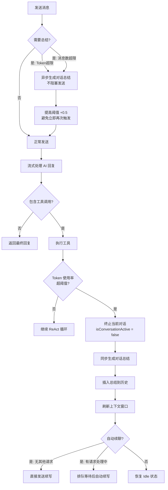
```mermaid
flowchart TD
    Send[发送消息] --> CheckSummary{需要总结?}
    CheckSummary -->|否| Normal[正常发送]
    CheckSummary -->|是: Token超限| AsyncSummary[异步生成对话总结<br/>不阻塞发送]
    CheckSummary -->|是: 消息数超限| AsyncSummary

    AsyncSummary --> RaiseThreshold[提高阈值 +0.5<br/>避免立即再次触发]
    RaiseThreshold --> Normal

    Normal --> StreamProcess[流式处理 AI 回复]
    StreamProcess --> ToolCall{包含工具调用?}

    ToolCall -->|否| FinalReply[返回最终回复]
    ToolCall -->|是| ExecuteTools[执行工具]

    ExecuteTools --> CheckToken{Token 使用率<br/>超阈值?}
    CheckToken -->|否| ContinueLoop[继续 ReAct 循环]
    CheckToken -->|是| Terminate[终止当前对话<br/>isConversationActive = false]

    Terminate --> SyncSummary[同步生成对话总结]
    SyncSummary --> InsertSummary[插入总结到历史]
    InsertSummary --> RefreshWindow[刷新上下文窗口]
    RefreshWindow --> AutoContinue{自动续聊?}
    AutoContinue -->|是: 无其他请求| DirectContinue[直接发送续写]
    AutoContinue -->|是: 有请求处理中| QueueContinue[排队等待后自动续写]
    AutoContinue -->|否| Idle[恢复 Idle 状态]
```

### 12.4 执行上下文隔离

#### 12.4.1 MessageExecutionContext

每个 `sendMessage` 调用创建独立的 `MessageExecutionContext`，实现并发请求之间的隔离：

```kotlin
private data class MessageExecutionContext(
    val executionId: Int,                                          // 唯一执行 ID
    val streamBuffer: StringBuilder = StringBuilder(),             // 流式输出缓冲区
    val roundManager: ConversationRoundManager = ConversationRoundManager(),  // 轮次管理器
    val isConversationActive: AtomicBoolean = AtomicBoolean(true), // 对话是否活跃
    val conversationHistory: MutableList<PromptTurn>,              // 对话历史（可变）
    val eventChannel: MutableSharedStream<TextStreamEvent>,        // 事件通道
)
```

#### 12.4.2 上下文管理方法

| 方法 | 作用 |
|------|------|
| `registerExecutionContext(context)` | 注册到 `activeExecutionContexts` ConcurrentHashMap |
| `unregisterExecutionContext(context)` | 从 Map 中移除 |
| `invalidateExecutionContext(context, reason)` | 将 `isConversationActive` 设为 false，终止该上下文 |
| `invalidateAllExecutionContexts(reason)` | 使所有活跃上下文失效 |
| `isExecutionContextActive(context)` | 检查上下文是否仍活跃且在 Map 中 |

#### 12.4.3 并发隔离设计

```
┌──────────────────────────────────────────────────────────────┐
│  activeExecutionContexts: ConcurrentHashMap<Int, Context>     │
│                                                               │
│  ┌─────────────────┐  ┌─────────────────┐  ┌──────────────┐ │
│  │ Context #1       │  │ Context #2       │  │ Context #3   │ │
│  │ executionId=1    │  │ executionId=2    │  │ executionId=3│ │
│  │ roundManager     │  │ roundManager     │  │ roundManager │ │
│  │ streamBuffer     │  │ streamBuffer     │  │ streamBuffer │ │
│  │ isActive=true    │  │ isActive=false   │  │ isActive=true│ │
│  │ convHistory      │  │ convHistory      │  │ convHistory  │ │
│  └─────────────────┘  └─────────────────┘  └──────────────┘ │
│                                                               │
│  Token超限 → invalidate #1 → isActive=false → 安全终止       │
│  用户取消 → invalidateAll → 所有 isActive=false              │
└──────────────────────────────────────────────────────────────┘
```

多个并发请求可以并行执行，互不干扰。`isConversationActive` 作为原子标志位，用于在 Token 超限、用户取消等场景下安全终止特定上下文。

### 12.5 对话轮次管理

#### 12.5.1 ConversationRoundManager

[ConversationRoundManager.kt](file:///home/meizu/Documents/my_agent_projects/Operit/app/src/main/java/com/ai/assistance/operit/api/chat/enhance/ConversationRoundManager.kt) 管理单次 AI 请求中的多轮对话（工具调用触发的新轮次）：

```kotlin
class ConversationRoundManager {
    private val roundContents = mutableMapOf<Int, String>()     // 轮次号 → 内容
    private val currentResponseRound = AtomicInteger(0)          // 当前轮次号
    private val roundSeparatorPattern = Regex("--- Round \\d+ ---\n")  // 轮次分隔符正则
}
```

| 方法 | 作用 |
|------|------|
| `initializeNewConversation()` | 重置轮次为 0，清空所有内容 |
| `startNewRound()` | 原子递增轮次号，初始化空内容，返回新轮次号 |
| `updateContent(content)` | 更新当前轮次内容 |
| `appendContent(content)` | 向当前轮次追加内容 |
| `getDisplayContent()` | 按轮次顺序拼接内容（去除分隔符），用于 UI 展示 |
| `getRawContent()` | 带轮次分隔符的原始内容 |

#### 12.5.2 轮次切换流程

```
用户发送消息 → Round 0 (AI 回复)
    │
    ├──► 检测到工具调用 → startNewRound() → Round 1 (工具结果 + AI 继续回复)
    │       │
    │       ├──► 再次检测工具调用 → startNewRound() → Round 2 ...
    │       │
    │       └──► 无工具调用 → 结束
    │
    └──► 无工具调用 → 结束（单轮对话）
```

### 12.6 消息流式处理

#### 12.6.1 XML 标签解析

ChatMarkupRegex 定义了对话中的 XML 标签正则，用于从 AI 流式输出中实时提取结构化信息：

| 标签 | 正则 | 用途 |
|------|------|------|
| `<tool name="...">` | `toolCallPattern` | 工具调用 |
| `<tool_result>` | `toolResultTag` | 工具结果 |
| `<think(ing)>` | `thinkTag` | AI 思考过程 |
| `<status>` | `statusTag` | 状态指示 |

**随机标签名**：`generateRandomToolTagName()` 生成随机后缀（如 `tool_Ab3x`），避免模型输出固定格式，`normalizeToolLikeTagName()` 将其归一化。

#### 12.6.2 Tool Call API 转换

不同 AI Provider 的工具调用格式统一转换为 XML 标签：

| Provider | 原始格式 | 转换目标 |
|----------|----------|----------|
| OpenAI | `tool_calls` JSON | `<tool name="..."><param>...</param></tool>` |
| Claude | `content_block_start/delta/stop` | `<tool name="..."><param>...</param></tool>` |
| 本地模型 | 文本中的 XML 标签 | 直接使用 |

#### 12.6.3 修订追踪

`TextStreamRevisionTracker` 支持流式输出中的修订（SAVEPOINT/ROLLBACK），用于工具调用时回滚已输出但不完整的内容。

### 12.7 输入处理与钩子分发

[InputProcessor.kt](file:///home/meizu/Documents/my_agent_projects/Operit/app/src/main/java/com/ai/assistance/operit/api/chat/enhance/InputProcessor.kt) 是用户输入进入上下文管理系统的入口：

```kotlin
object InputProcessor {
    suspend fun processUserInput(input: String, chatId: String? = null): String {
        // 阶段1: before_process
        val beforeContext = PromptHookRegistry.dispatchPromptInputHooks(
            PromptHookContext(stage = "before_process", chatId = chatId, rawInput = input, processedInput = input)
        )
        val processedInput = beforeContext.processedInput ?: beforeContext.rawInput ?: input

        // 阶段2: after_process
        val afterContext = PromptHookRegistry.dispatchPromptInputHooks(
            beforeContext.copy(stage = "after_process", processedInput = processedInput)
        )
        return afterContext.processedInput ?: processedInput
    }
}
```

### 12.8 完整上下文管理流程图

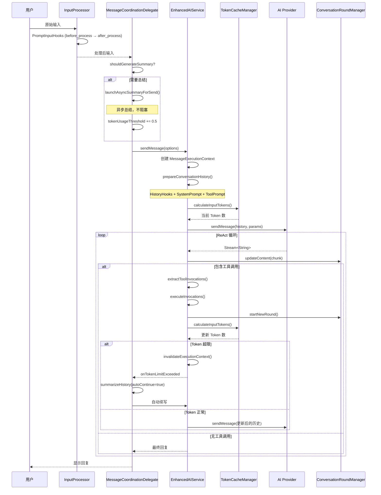
```mermaid
sequenceDiagram
    participant User as 用户
    participant IP as InputProcessor
    participant MCD as MessageCoordinationDelegate
    participant EAS as EnhancedAIService
    participant TCM as TokenCacheManager
    participant AI as AI Provider
    participant CRM as ConversationRoundManager

    User->>IP: 原始输入
    IP->>IP: PromptInputHooks (before_process → after_process)
    IP-->>MCD: 处理后输入

    MCD->>MCD: shouldGenerateSummary?
    alt 需要总结
        MCD->>MCD: launchAsyncSummaryForSend()
        Note over MCD: 异步总结，不阻塞
        MCD->>MCD: tokenUsageThreshold += 0.5
    end

    MCD->>EAS: sendMessage(options)

    EAS->>EAS: 创建 MessageExecutionContext
    EAS->>EAS: prepareConversationHistory()
    Note over EAS: HistoryHooks + SystemPrompt + ToolPrompt

    EAS->>TCM: calculateInputTokens()
    TCM-->>EAS: 当前 Token 数

    EAS->>AI: sendMessage(history, params)

    loop ReAct 循环
        AI-->>EAS: Stream<String>
        EAS->>CRM: updateContent(chunk)

        alt 包含工具调用
            EAS->>EAS: extractToolInvocations()
            EAS->>EAS: executeInvocations()
            EAS->>CRM: startNewRound()

            EAS->>TCM: calculateInputTokens()
            TCM-->>EAS: 更新 Token 数

            alt Token 超限
                EAS->>EAS: invalidateExecutionContext()
                EAS-->>MCD: onTokenLimitExceeded
                MCD->>MCD: summarizeHistory(autoContinue=true)
                MCD->>EAS: 自动续写
            else Token 正常
                EAS->>AI: sendMessage(更新后的历史)
            end
        else 无工具调用
            EAS-->>MCD: 最终回复
        end
    end

    MCD-->>User: 显示回复
```

---

## 十三、Skill 系统设计

### 13.1 系统定位

Skill 系统是 Operit 中与 ToolPkg（JS 工具包）和 MCP（Model Context Protocol）并列的三大"包"扩展机制之一。Skill 的核心理念是：**以 Markdown 文件（SKILL.md）为载体，向 AI 注入领域知识/指令，让 AI 优先使用 Skill 提供的指令和捆绑脚本来完成任务**。与 ToolPkg 提供可执行工具不同，Skill 更偏向"知识注入 + 脚本辅助"模式。

### 13.2 三种包扩展机制对比

| 维度 | Skill | ToolPkg | MCP |
|------|-------|---------|-----|
| **载体格式** | SKILL.md (Markdown) | .toolpkg (HJSON/JS) | MCP Server Config |
| **核心机制** | 知识注入（系统提示词） | 工具注册（可执行 JS 函数） | 工具注册（远程过程调用） |
| **激活方式** | `use_package` | `use_package` | `use_package` |
| **激活后效果** | 注入提示词到上下文 | 注册工具到 AIToolHandler | 建立 MCP 连接并注册工具 |
| **AI 可见性** | SkillVisibilityPreferences 控制 | PackageManager enabled 控制 | MCPManager 注册控制 |
| **角色卡控制** | `allowedSkills` 白名单 | `allowedPackages` 白名单 | `allowedMcpServers` 白名单 |
| **存储位置** | `Downloads/Operit/skills/` | assets/packages + 缓存 | MCP 配置 |
| **执行方式** | AI 根据提示词自主使用终端工具 | JS 引擎执行 | JSON-RPC 远程调用 |

**核心区别**：Skill 不注册任何可执行工具，而是通过提示词让 AI "知道"如何使用 Skill 提供的脚本和知识。ToolPkg 和 MCP 则注册具体的可调用工具。

### 13.3 数据模型

#### 13.3.1 SkillPackage

```kotlin
data class SkillPackage(
    val name: String,          // Skill 名称（来自 SKILL.md 的 frontmatter 或目录名）
    val description: String,   // Skill 描述
    val directory: File,       // Skill 所在的目录
    val skillFile: File        // SKILL.md 文件本身
)
```

核心信息只有 `name` 和 `description`，实际的知识内容全部存储在 `skillFile`（SKILL.md）中。

#### 13.3.2 SkillMetadata（市场发布元数据）

```kotlin
@Serializable
data class SkillMetadata(
    val description: String = "",
    @JsonNames("repoUrl")
    val repositoryUrl: String,
    val category: String = "",
    val tags: String = "",
    @JsonNames("version")
    val version: String = ""
)
```

用于 Skill 市场（GitHub Issue）发布和解析，存储在 Issue body 的 HTML 注释 `<!-- operit-skill-json: {...} -->` 中。

### 13.4 Skill 的发现和注册

#### 13.4.1 SkillManager — 核心发现引擎

[SkillManager.kt](file:///home/meizu/Documents/my_agent_projects/Operit/app/src/main/java/com/ai/assistance/operit/core/tools/skill/SkillManager.kt) 为单例模式，负责 Skill 的发现、加载、解析、删除。

**存储位置**：`Downloads/Operit/skills/` 目录

**发现流程**（`refreshAvailableSkills()`）：

```
1. 扫描 Downloads/Operit/skills/ 下的所有子目录
2. 在每个子目录中查找 SKILL.md（优先大写，回退小写 skill.md）
3. 解析 SKILL.md 的 YAML frontmatter 提取 name 和 description
4. 如果 frontmatter 中没有 name/description
   → 在前 40 行中继续搜索 key: value 格式
5. 如果 name 仍为空 → 使用目录名作为 Skill 名称
6. 检测重名冲突，记录到 skillLoadErrors
7. 构建内存缓存 availableSkills: MutableMap<String, SkillPackage>
```

**元数据解析**（`parseSkillMetadata()`）：

- 优先解析 YAML frontmatter（`---` 包围的区域）
- 回退到前 40 行的 `key: value` 格式解析
- 支持 `name` 和 `description` 两个关键字段

**关键方法**：

| 方法 | 返回类型 | 说明 |
|------|---------|------|
| `refreshAvailableSkills()` | Unit | 刷新内存缓存 |
| `getAvailableSkills()` | Map<String, SkillPackage> | 获取所有可用 Skill（先刷新） |
| `getAvailableSkillsSnapshot()` | Pair<Map, Map> | 获取 Skill + 错误信息快照 |
| `readSkillContent(skillName)` | String? | 读取 SKILL.md 全文 |
| `deleteSkill(skillName)` | Boolean | 删除 Skill 目录 |
| `getSkillSystemPrompt(skillName)` | String? | 生成 AI 可用的系统提示词 |
| `importSkillFromZip(zipFile, subDirPath?)` | String | 从 ZIP 导入 Skill |

#### 13.4.2 SkillRepository — 数据仓库层

[SkillRepository.kt](file:///home/meizu/Documents/my_agent_projects/Operit/app/src/main/java/com/ai/assistance/operit/data/skill/SkillRepository.kt) 封装 SkillManager 并增加三种导入方式：

**1. 从 ZIP 导入**（`importSkillFromZip`）

```
ZIP 文件 → 解压 → 查找 SKILL.md → 复制到 skills 目录
```

**2. 从 GitHub 仓库导入**（`importSkillFromGitHubRepo`）

```
GitHub URL → 解析 owner/repo/branch/subdir → 下载 ZIP → 调用 ZIP 导入
→ 写入 .operit_repo_url 标记文件
```

支持的 GitHub URL 格式：
- `github.com/owner/repo`
- `github.com/owner/repo/tree/branch/subdir`
- `github.com/owner/repo/blob/branch/path/to/SKILL.md`
- `raw.githubusercontent.com/owner/repo/branch/...`

**3. 直接输入导入**（`importSkillFromDirectInput`）

```
用户输入 ID/描述/内容 → 生成 SKILL.md → 可选附件存入 assets 子目录
```

#### 13.4.3 SkillRepoZipPoolManager — ZIP 缓存池

```kotlin
object SkillRepoZipPoolManager {
    const val maxPoolSize = 6     // 最大缓存 6 个 ZIP 文件
    // 基于 SHA-256 哈希生成文件名
    // LRU 淘汰策略（按最后修改时间排序）
    // Mutex 并发安全
    // .download 临时文件 → 完成后原子重命名为 .zip
}
```

### 13.5 Skill 的激活和执行

#### 13.5.1 统一激活入口

Skill 与 ToolPkg、MCP 共享 `use_package` 工具作为激活入口，PackageManager 按优先级查找：

```
use_package(package_name)
    │
    ├──► 1. 检查是否为 ToolPkg（JS 工具包） → 加载并注册工具
    ├──► 2. 检查是否为 Skill → 生成系统提示词注入
    ├──► 3. 检查是否为 MCP Server → 激活 MCP 连接
    └──► 4. 都不匹配 → 返回 "Package not found"
```

#### 13.5.2 Skill 激活流程

当 `use_package` 的 `package_name` 匹配到 Skill 时：

```
1. 可见性检查
   SkillVisibilityPreferences.isSkillVisibleToAi(skillName)

2. 生成系统提示词
   SkillManager.getSkillSystemPrompt(skillName)

3. 提示词注入到对话上下文
```

**`getSkillSystemPrompt()` 生成的提示词结构**：

```
Using package (Skill): {skillName}
Use Time: {当前时间}
Execution policy:
Prioritize using the skill-provided instructions and bundled scripts,
and complete tasks with terminal-related tools.
Description: {description}
SKILL.md path: {绝对路径}
Skill directory: {目录绝对路径}
Directory structure:
{目录树文本}
SKILL.md:
{SKILL.md 完整内容}
```

关键特点：
- Skill 激活后**不会注册新的工具**到 AIToolHandler，而是通过**系统提示词注入**方式让 AI 获知 Skill 的知识
- 提示词中包含完整的目录结构，让 AI 知道 Skill 目录下有哪些可用脚本/资源
- 执行策略明确指示 AI "优先使用 Skill 提供的指令和捆绑脚本，通过终端相关工具完成任务"

### 13.6 AI 可见性机制

#### 13.6.1 SkillVisibilityPreferences

[SkillVisibilityPreferences.kt](file:///home/meizu/Documents/my_agent_projects/Operit/app/src/main/java/com/ai/assistance/operit/data/preferences/SkillVisibilityPreferences.kt) 使用 SharedPreferences 存储每个 Skill 的 AI 可见性：

```kotlin
fun isSkillVisibleToAi(skillName: String): Boolean
fun setSkillVisibleToAi(skillName: String, visible: Boolean)
```

- **存储键生成**：对 Skill 名称做 SHA-256 哈希，取前 16 位作为 key（`skill_visible_{hash16}`），避免特殊字符问题
- **兼容性**：支持从旧版 key 格式自动迁移到新格式
- **默认值**：新 Skill 默认对 AI 可见（`true`）

#### 13.6.2 系统提示词中的 Skill 列表

在构建系统提示词时，Skill 与 ToolPkg、MCP 一起被列在 "Available packages" 区域：

```kotlin
val skillPackages = SkillRepository.getInstance(context)
    .getAiVisibleSkillPackages()
    .filterKeys { skillName ->
        allowedSkillNames?.contains(skillName) ?: true
    }
```

AI 看到的格式：

```
Available packages:
- packageName : description    (ToolPkg)
- serverName : description     (MCP)
- skillName : description      (Skill)
```

#### 13.6.3 角色卡访问控制

角色卡通过 `allowedSkills` 白名单控制 Skill 访问权限：

```kotlin
data class CharacterCardToolAccessConfig(
    val enabled: Boolean = false,
    val allowedBuiltinTools: List<String> = emptyList(),
    val allowedPackages: List<String> = emptyList(),
    val allowedSkills: List<String> = emptyList(),       // Skill 白名单
    val allowedMcpServers: List<String> = emptyList()
)
```

运行时通过 `CharacterCardToolAccessResolver.isExternalSourceAllowed(sourceName)` 统一判断 Skill/Package/MCP 是否被当前角色卡允许。

### 13.7 Skill 包结构

#### 13.7.1 目录结构

```
Downloads/Operit/skills/
└── {skillName}/              # Skill 目录（名称即 Skill ID）
    ├── SKILL.md              # 必需：Skill 入口文件
    ├── assets/               # 可选：附件目录（直接输入导入时创建）
    │   ├── script.sh
    │   └── config.json
    ├── scripts/              # 可选：脚本目录
    └── .operit_repo_url      # 可选：GitHub 来源标记文件
```

#### 13.7.2 SKILL.md 格式

支持 YAML frontmatter：

```markdown
---
name: "My Skill"
description: "A skill that does something useful"
---

# My Skill

Instructions for the AI...
```

也支持简化的 `key: value` 格式（前 40 行内）：

```markdown
name: My Skill
description: A skill that does something useful

# Instructions...
```

#### 13.7.3 市场发布格式

Skill 通过 GitHub Issue 发布到 `AAswordman/OperitSkillMarket` 仓库：

```html
<!-- operit-skill-json: {"description":"...","repositoryUrl":"...","category":"...","version":"v1"} -->
<!-- operit-parser-version: v1 -->

## Skill 信息
{description}

## 仓库信息
- 仓库地址: {repositoryUrl}

## 安装方法
1. 打开 Operit
2. 进入 Skill 配置页面
3. 输入仓库地址: {repositoryUrl}
4. 点击导入
```

### 13.8 CLI 模式下 Skill 的集成

在 CLI 工具模式下，Skill 作为 `HiddenToolSourceKind.ACTIVATION` 类型的隐藏工具目录条目出现：

```kotlin
val skillPackages = SkillRepository.getInstance(context)
    .getAiVisibleSkillPackages()
    .filterKeys { roleCardToolAccess.isExternalSourceAllowed(it) }

skillPackages.forEach { (skillName, skillPackage) ->
    addActivationEntry(
        entries = entries,
        displayName = skillName,
        description = skillPackage.description,
        keywordTag = "skill",
        sourceKind = HiddenToolSourceKind.ACTIVATION
    )
}
```

AI 需要先通过 `search` 工具发现 Skill，再通过 `proxy` 工具调用 `use_package` 来激活。

### 13.9 Skill 生命周期流程图

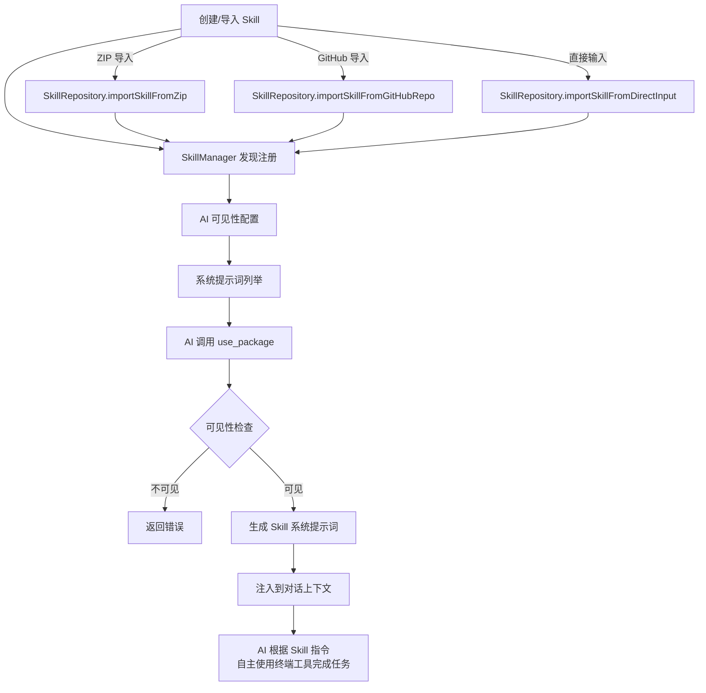
```mermaid
flowchart TD
    Create[创建/导入 Skill] --> Discover[SkillManager 发现注册]
    Discover --> Visibility[AI 可见性配置]
    Visibility --> ListInPrompt[系统提示词列举]
    ListInPrompt --> AIActivate[AI 调用 use_package]
    AIActivate --> CheckVisibility{可见性检查}
    CheckVisibility -->|不可见| Denied[返回错误]
    CheckVisibility -->|可见| GeneratePrompt[生成 Skill 系统提示词]
    GeneratePrompt --> InjectContext[注入到对话上下文]
    InjectContext --> AIExecute[AI 根据 Skill 指令<br/>自主使用终端工具完成任务]

    Create --> |ZIP 导入| ImportZip[SkillRepository.importSkillFromZip]
    Create --> |GitHub 导入| ImportGithub[SkillRepository.importSkillFromGitHubRepo]
    Create --> |直接输入| ImportDirect[SkillRepository.importSkillFromDirectInput]

    ImportZip --> Discover
    ImportGithub --> Discover
    ImportDirect --> Discover
```

---

## 十四、项目安全机制

### 14.1 安全架构总览

Operit 的安全机制采用**多层纵深防御**策略，从工具暴露、角色卡白名单、用户确认、权限分级到 Shell 执行安全，形成了一条完整的工具执行安全检查链：

```
┌─────────────────────────────────────────────────────────────────────────────┐
│                          工具执行安全检查链                                    │
│                                                                             │
│  AI 响应 → 提取工具调用 → 安全检查链 → 执行                                  │
│                                    │                                        │
│                                    ├── 1. 工具暴露模式拦截 (ToolExposureMode)│
│                                    ├── 2. 角色卡工具权限拦截 (RoleCard)       │
│                                    ├── 3. 用户权限确认 (PermissionSystem)     │
│                                    ├── 4. 参数验证 (validateParameters)       │
│                                    └── 5. 安全执行 (executeToolSafely)        │
├─────────────────────────────────────────────────────────────────────────────┤
│                          Shell 执行安全                                      │
│  5 级权限体系：STANDARD → ACCESSIBILITY → DEBUGGER → ADMIN → ROOT            │
│  严格模式：不降级，不可用则拒绝                                               │
├─────────────────────────────────────────────────────────────────────────────┤
│                          数据安全                                            │
│  API Key 脱敏 + Key 池轮询 + DataStore 加密存储                               │
│  SAF 文件访问 + URI 验证 + 路径规范化                                        │
│  MCP 连接认证 + 进程隔离                                                     │
├─────────────────────────────────────────────────────────────────────────────┤
│                          审计与监控                                          │
│  AIToolHook 6 阶段生命周期通知 + ToolPkg 拦截/修改能力                        │
└─────────────────────────────────────────────────────────────────────────────┘
```

### 14.2 工具执行安全检查链

#### 14.2.1 第 1 层：工具暴露模式拦截

根据 AI Provider 类型自动选择工具暴露模式：

```kotlin
enum class ToolExposureMode {
    FULL,   // 云端 API：所有工具直接暴露
    CLI;    // 本地推理：只暴露 search + proxy

    companion object {
        fun resolve(providerType: ApiProviderType): ToolExposureMode {
            return when (providerType) {
                LMSTUDIO, OLLAMA, OPENAI_LOCAL, MNN, LLAMA_CPP -> CLI
                else -> FULL
            }
        }
    }
}
```

CLI 模式下，所有真实工具隐藏在 `proxy` 后面，模型必须先 `search` 发现工具，再通过 `proxy` 代理执行，防止本地模型因工具列表过长而混乱。

**拦截逻辑**：

```kotlin
for (invocation in invocations) {
    val deniedResult = buildToolExposureDeniedResult(context, invocation, toolExposureMode)
    if (deniedResult == null) {
        toolExposurePermittedInvocations.add(invocation)
    } else {
        toolExposureDeniedResults.add(deniedResult)
    }
}
```

#### 14.2.2 第 2 层：角色卡工具白名单拦截

角色卡通过四维白名单控制工具访问：

```kotlin
data class CharacterCardToolAccessConfig(
    val enabled: Boolean = false,                     // 是否启用自定义白名单
    val allowedBuiltinTools: List<String> = emptyList(), // 允许的内置工具
    val allowedPackages: List<String> = emptyList(),     // 允许的 Package
    val allowedSkills: List<String> = emptyList(),       // 允许的 Skill
    val allowedMcpServers: List<String> = emptyList()    // 允许的 MCP 服务器
)
```

**解析逻辑**（[CharacterCardToolAccessResolver.kt](file:///home/meizu/Documents/my_agent_projects/Operit/app/src/main/java/com/ai/assistance/operit/data/preferences/CharacterCardToolAccessResolver.kt)）：

1. 如果角色卡未启用自定义白名单（`enabled=false`），则允许所有工具
2. 如果启用，则将全局可见性与角色卡白名单取**交集**
3. 如果 `use_package` 工具被禁止，则所有外部源（Package/Skill/MCP）也被禁止
4. 外部源过滤：只保留角色卡白名单中明确允许的 Package/Skill/MCP

**运行时拦截**：

```kotlin
for (invocation in toolExposurePermittedInvocations) {
    val deniedResult = if (roleCardToolAccess?.customEnabled == true &&
        !isInvocationAllowedForRoleCard(invocation, roleCardToolAccess)
    ) {
        buildRoleCardDeniedResult(context, invocation)
    } else {
        null
    }
}
```

`isInvocationAllowedForRoleCard()` 对不同工具名格式分别处理：

| 工具名格式 | 判断逻辑 |
|-----------|---------|
| `search` | 始终允许 |
| `proxy` | 检查其代理的实际目标工具 |
| `use_package` | 检查白名单 + 检查包名是否在允许列表 |
| `package_proxy` | 类似 proxy 的检查 |
| `pkg:tool` 格式 | 提取包名检查是否在允许列表 |
| 普通内置工具 | 检查 `isBuiltinToolAllowed()` |

#### 14.2.3 第 3 层：用户权限确认

[ToolPermissionSystem.kt](file:///home/meizu/Documents/my_agent_projects/Operit/app/src/main/java/com/ai/assistance/operit/ui/permissions/ToolPermissionSystem.kt) 实现三级权限控制：

```kotlin
enum class PermissionLevel {
    ALLOW,      // 自动允许，不询问
    ASK,        // 每次都询问用户
    FORBID;     // 永远禁止
}
```

**检查流程**：

```
checkToolPermission()
    │
    ├──► 1. 读取 DataStore 中的主开关（master switch）
    ├──► 2. 读取工具特定覆盖（优先于主开关）
    ├──► 3. ALLOW → 直接放行
    ├──► 4. FORBID → 直接拒绝
    └──► 5. ASK → 弹出悬浮窗确认
```

**用户确认弹窗**（[PermissionRequestOverlay.kt](file:///home/meizu/Documents/my_agent_projects/Operit/app/src/main/java/com/ai/assistance/operit/ui/permissions/PermissionRequestOverlay.kt)）：

- 使用系统悬浮窗（`TYPE_APPLICATION_OVERLAY`）显示 Compose UI
- 提供三个选项：允许（ALLOW）、拒绝（DENY）、始终允许（ALWAYS_ALLOW）
- 60 秒超时自动拒绝
- 选择"始终允许"会持久化到 DataStore

**deny_tool 标记**：如果工具调用的原始文本包含 `deny_tool`，则跳过权限检查直接放行（用于内部工具调用）。

#### 14.2.4 第 4 层：参数验证与安全执行

```kotlin
fun executeToolSafely(invocation, executor, toolHandler): Flow<ToolResult> {
    val validationResult = executor.validateParameters(invocation.tool)
    if (!validationResult.valid) {
        return flow { emit(ToolResult(error = "Invalid parameters: ...")) }
    }
    return executor.invokeAndStream(invocation.tool).catch { e -> ... }
}
```

#### 14.2.5 完整安全检查链流程图

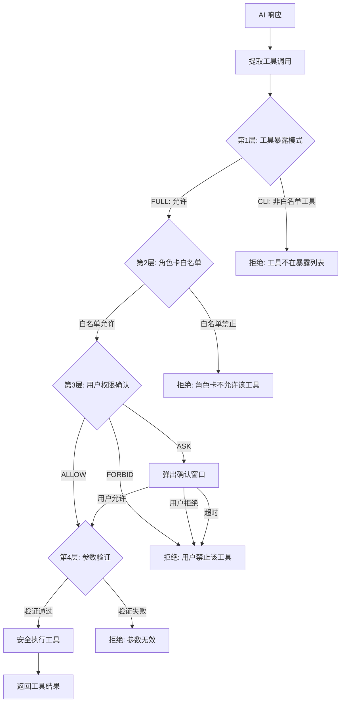
```mermaid
flowchart TD
    AIResponse[AI 响应] --> Extract[提取工具调用]
    Extract --> Layer1{第1层: 工具暴露模式}

    Layer1 -->|FULL: 允许| Layer2
    Layer1 -->|CLI: 非白名单工具| Deny1[拒绝: 工具不在暴露列表]

    Layer2{第2层: 角色卡白名单} -->|白名单允许| Layer3
    Layer2 -->|白名单禁止| Deny2[拒绝: 角色卡不允许该工具]

    Layer3{第3层: 用户权限确认} -->|ALLOW| Execute
    Layer3 -->|FORBID| Deny3[拒绝: 用户禁止该工具]
    Layer3 -->|ASK| Confirm[弹出确认窗口]

    Confirm -->|用户允许| Execute
    Confirm -->|用户拒绝| Deny3
    Confirm -->|超时| Deny3

    Execute{第4层: 参数验证} -->|验证通过| SafeExec[安全执行工具]
    Execute -->|验证失败| Deny4[拒绝: 参数无效]

    SafeExec --> Result[返回工具结果]
```

### 14.3 Shell 命令执行安全

#### 14.3.1 五级权限体系

```kotlin
enum class AndroidPermissionLevel {
    STANDARD,      // 普通应用权限
    ACCESSIBILITY, // 无障碍服务权限
    DEBUGGER,      // 调试权限
    ADMIN,         // 管理员权限（Shizuku）
    ROOT;          // Root 权限
}
```

#### 14.3.2 Shell 执行器工厂

```kotlin
fun getExecutor(context: Context, permissionLevel: AndroidPermissionLevel): ShellExecutor {
    return when (permissionLevel) {
        ROOT -> RootShellExecutor(context)
        ADMIN -> AdminShellExecutor(context)
        DEBUGGER -> DebuggerShellExecutor(context)
        ACCESSIBILITY -> AccessibilityShellExecutor(context)
        STANDARD -> StandardShellExecutor(context)
    }
}
```

关键安全机制：
- **严格模式**：使用用户首选权限级别，如果该级别不可用则直接拒绝，**不做降级**
- **权限验证**：每次执行前检查 `executor.isAvailable() && permStatus.granted`
- **缓存隔离**：每个权限级别有独立的执行器缓存

#### 14.3.3 Root 权限管理

[RootAuthorizer.kt](file:///home/meizu/Documents/my_agent_projects/Operit/app/src/main/java/com/ai/assistance/operit/core/tools/system/RootAuthorizer.kt) 采用多策略检测：

| 检测策略 | 方法 | 说明 |
|---------|------|------|
| libsu 检测 | `Shell.isAppGrantedRoot()` | Magisk 标准 Root 授权检测 |
| KernelSU 检测 | 执行 `su --version` | 检查输出是否包含 "KernelSU" |
| 文件系统检测 | 检查 `/system/bin/su` 等路径 | 传统 su 二进制文件检测 |
| which 命令检测 | `which su` | PATH 环境变量中的 su |

[RootShellExecutor.kt](file:///home/meizu/Documents/my_agent_projects/Operit/app/src/main/java/com/ai/assistance/operit/core/tools/system/shell/RootShellExecutor.kt) 支持两种执行模式：

| 模式 | 方法 | 适用场景 |
|------|------|---------|
| libsu 模式 | `Shell.cmd(command).exec()` | Magisk（默认） |
| exec 模式 | `Runtime.getRuntime().exec("su -c command")` | KernelSU 等 |

Shell 身份区分：

```kotlin
enum class ShellIdentity {
    DEFAULT,   // 默认
    APP,       // 应用身份
    ROOT,      // Root 身份
    SHELL      // Shell 身份（通过 operit_shell_exec launcher 执行）
}
```

`SHELL` 身份使用专用的 `operit_shell_exec` 二进制 launcher，从 assets 复制到本地并设置可执行权限，确保在 Root 环境下以 shell 用户身份执行命令。

### 14.4 文件访问安全

#### 14.4.1 SAF（Storage Access Framework）安全机制

[SafFileSystemTools.kt](file:///home/meizu/Documents/my_agent_projects/Operit/app/src/main/java/com/ai/assistance/operit/core/tools/defaultTool/standard/SafFileSystemTools.kt) 实现了多层文件访问安全：

| 安全层 | 机制 | 说明 |
|--------|------|------|
| **书签绑定** | `environment="repo:<bookmarkName>"` | 文件操作必须指定 SAF 书签 |
| **URI 验证** | `resolveSafPathToDocumentUriOrNull()` | 所有路径解析为 content:// URI |
| **权限继承** | 持久化 URI 权限 | 来自用户在系统文件选择器中授予的权限 |
| **路径规范化** | `normalizeAbsolutePath()` | 防止路径遍历攻击 |
| **文件大小限制** | `MAX_FILE_READ_BYTES` | 限制读取大小 |
| **二进制文件保护** | `FileUtils.isTextLike()` | 防止将二进制文件作为文本读取 |

#### 14.4.2 DocumentProvider 安全

- `WorkspaceDocumentsProvider` 和 `MemoryDocumentsProvider` 都要求 `android.permission.MANAGE_DOCUMENTS` 权限
- `android:exported="true"` + `android:grantUriPermissions="true"` 允许受控的跨应用访问

### 14.5 API Key 安全管理

[ApiKeyProvider.kt](file:///home/meizu/Documents/my_agent_projects/Operit/app/src/main/java/com/ai/assistance/operit/api/chat/llmprovider/ApiKeyProvider.kt) 实现 API Key 的安全管理：

| 安全特性 | 实现方式 |
|---------|---------|
| **日志脱敏** | `apiKey.take(4)...apiKey.takeLast(4)` 只显示首尾 4 位 |
| **Key 池轮询** | `MultiApiKeyProvider` 支持多 Key 轮询，避免单 Key 过度使用 |
| **可用性过滤** | 已测试为不可用的 Key 会被自动跳过 |
| **Mutex 保护** | Key 选择过程使用 `Mutex` 保证线程安全 |
| **存储方式** | API Key 存储在 DataStore（基于 SharedPreferences） |

```kotlin
interface ApiKeyProvider {
    suspend fun getApiKey(): String
}

class SingleApiKeyProvider(private val apiKey: String) : ApiKeyProvider
class MultiApiKeyProvider(configId, modelConfigManager) : ApiKeyProvider
```

### 14.6 MCP 连接安全

MCP 连接安全机制：

| 安全层 | 机制 | 说明 |
|--------|------|------|
| **服务注册验证** | 必须提供 `name` 和 `type` | 本地服务必须有 `command`，远程服务必须有 `endpoint` |
| **远程连接认证** | `bearerToken` + 自定义 `headers` | 支持多种认证方式 |
| **进程隔离** | 独立 helper 进程 | 每个 MCP 服务运行在独立进程中，通过 IPC 通信 |
| **工具缓存** | `mcpToolsMap` | 未激活的服务无法获取工具列表 |

```javascript
registerService(name, info) {
    if (!name || !info.type) return false;
    if (info.type === 'local' && !info.command) return false;
    if (info.type === 'remote' && !info.endpoint) return false;
    const serviceInfo = {
        bearerToken: info.bearerToken,
        headers: info.headers,
    };
}
```

### 14.7 工具生命周期审计

[AIToolHook.kt](file:///home/meizu/Documents/my_agent_projects/Operit/app/src/main/java/com/ai/assistance/operit/core/tools/AIToolHook.kt) 提供完整的工具执行生命周期追踪：

```kotlin
interface AIToolHook {
    fun onToolCallRequested(tool: AITool)           // 工具调用请求
    fun onToolPermissionChecked(tool: AITool, granted: Boolean, reason: String?)  // 权限检查结果
    fun onToolExecutionStarted(tool: AITool)        // 执行开始
    fun onToolExecutionResult(tool: AITool, result: ToolResult)  // 执行结果
    fun onToolExecutionError(tool: AITool, throwable: Throwable) // 执行异常
    fun onToolExecutionFinished(tool: AITool)       // 执行完成
}
```

ToolPkg 可以通过 `ToolPkgToolLifecycleBridge` 拦截和修改工具行为，实现自定义安全策略。

### 14.8 安全架构总览表

| 安全层 | 拦截点 | 核心机制 | 关键文件 |
|--------|--------|----------|----------|
| **工具暴露模式** | 工具列表生成 | FULL/CLI 双模式 | CliToolModeSupport.kt |
| **角色卡白名单** | 工具调用前 | 四维白名单（内置/Package/Skill/MCP） | CharacterCardToolAccessResolver.kt |
| **用户确认** | 工具执行前 | ALLOW/ASK/FORBID 三级 | ToolPermissionSystem.kt |
| **参数验证** | 工具执行时 | executor.validateParameters() | ToolExecutionManager.kt |
| **Shell 权限分级** | Shell 命令执行 | 5 级权限体系，严格模式不降级 | ShellExecutorFactory.kt |
| **Root 管理** | Root 命令执行 | 多策略检测，libsu/exec 双模式 | RootAuthorizer.kt |
| **SAF 文件访问** | 文件操作 | 书签绑定 + URI 验证 + 路径规范化 | SafFileSystemTools.kt |
| **API Key** | 网络请求 | 日志脱敏 + Key 池轮询 + 可用性过滤 | ApiKeyProvider.kt |
| **MCP 安全** | MCP 连接 | bearerToken + headers 认证 + 进程隔离 | bridge/index.js |
| **审计钩子** | 全生命周期 | 6 阶段通知链 | AIToolHook.kt |

---

## 十五、完整架构图（Mermaid）

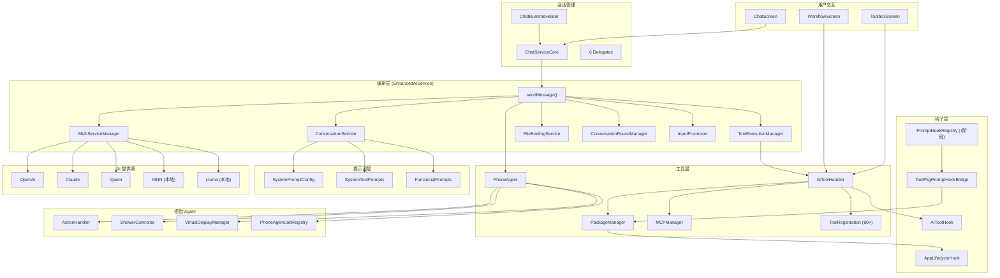
```mermaid
flowchart TB
    subgraph User["用户交互"]
        ChatUI["ChatScreen"]
        ToolboxUI["ToolboxScreen"]
        WorkflowUI["WorkflowScreen"]
    end

    subgraph Session["会话管理"]
        ChatCore["ChatServiceCore"]
        RuntimeHolder["ChatRuntimeHolder"]
        Delegates["6 Delegates"]
    end

    subgraph Orchestrator["编排层 (EnhancedAIService)"]
        SendMsg["sendMessage()"]
        MultiSvc["MultiServiceManager"]
        ConvSvc["ConversationService"]
        ToolExecMgr["ToolExecutionManager"]
        FileBind["FileBindingService"]
        ConvRound["ConversationRoundManager"]
        InputProc["InputProcessor"]
    end

    subgraph Tools["工具层"]
        ToolHandler["AIToolHandler"]
        PkgMgr["PackageManager"]
        PhoneAgent["PhoneAgent"]
        MCPMgr["MCPManager"]
        ToolReg["ToolRegistration (80+)"]
    end

    subgraph Hooks["钩子层"]
        PromptHooks["PromptHookRegistry (7阶段)"]
        ToolHooks["AIToolHook"]
        LifecycleHooks["AppLifecycleHook"]
        ToolPkgBridge["ToolPkgPromptHookBridge"]
    end

    subgraph Prompts["提示词层"]
        SysPrompt["SystemPromptConfig"]
        ToolPrompts["SystemToolPrompts"]
        FuncPrompts["FunctionalPrompts"]
    end

    subgraph Agent["视觉 Agent"]
        ActionHandler["ActionHandler"]
        ShowerCtrl["ShowerController"]
        VirtualDisplay["VirtualDisplayManager"]
        AgentJobs["PhoneAgentJobRegistry"]
    end

    subgraph AI["AI 提供商"]
        OpenAI["OpenAI"]
        Claude["Claude"]
        Qwen["Qwen"]
        MNN["MNN (本地)"]
        Llama["Llama (本地)"]
    end

    ChatUI --> ChatCore
    ToolboxUI --> ToolHandler
    WorkflowUI --> ToolHandler

    ChatCore --> SendMsg
    RuntimeHolder --> ChatCore

    SendMsg --> MultiSvc
    SendMsg --> ConvSvc
    SendMsg --> ToolExecMgr
    SendMsg --> FileBind
    SendMsg --> ConvRound
    SendMsg --> InputProc

    ToolExecMgr --> ToolHandler
    ToolHandler --> PkgMgr
    ToolHandler --> MCPMgr
    ToolHandler --> ToolReg

    ConvSvc --> SysPrompt
    ConvSvc --> ToolPrompts
    ConvSvc --> FuncPrompts

    PromptHooks --> ToolPkgBridge
    ToolPkgBridge --> PkgMgr

    SendMsg --> PhoneAgent
    PhoneAgent --> ActionHandler
    PhoneAgent --> ShowerCtrl
    PhoneAgent --> VirtualDisplay
    PhoneAgent --> AgentJobs

    MultiSvc --> OpenAI
    MultiSvc --> Claude
    MultiSvc --> Qwen
    MultiSvc --> MNN
    MultiSvc --> Llama

    ToolHandler --> ToolHooks
    PkgMgr --> LifecycleHooks
```

---

## 十六、ReAct 循环完整流程图

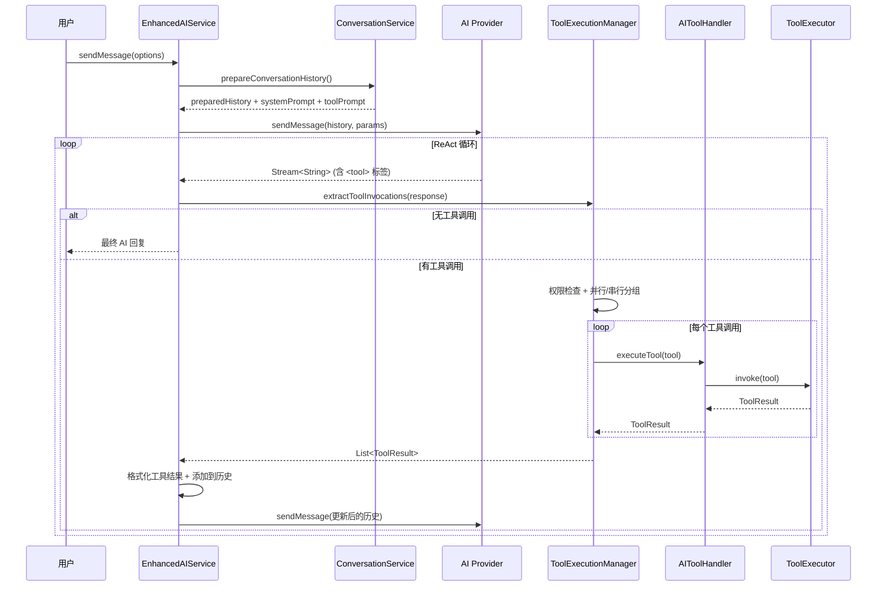
```mermaid
sequenceDiagram
    participant User as 用户
    participant EAS as EnhancedAIService
    participant Conv as ConversationService
    participant AI as AI Provider
    participant TEM as ToolExecutionManager
    participant TH as AIToolHandler
    participant Tool as ToolExecutor

    User->>EAS: sendMessage(options)
    EAS->>Conv: prepareConversationHistory()
    Conv-->>EAS: preparedHistory + systemPrompt + toolPrompt
    EAS->>AI: sendMessage(history, params)
    
    loop ReAct 循环
        AI-->>EAS: Stream<String> (含 <tool> 标签)
        EAS->>TEM: extractToolInvocations(response)
        
        alt 无工具调用
            EAS-->>User: 最终 AI 回复
        else 有工具调用
            TEM->>TEM: 权限检查 + 并行/串行分组
            loop 每个工具调用
                TEM->>TH: executeTool(tool)
                TH->>Tool: invoke(tool)
                Tool-->>TH: ToolResult
                TH-->>TEM: ToolResult
            end
            TEM-->>EAS: List<ToolResult>
            EAS->>EAS: 格式化工具结果 + 添加到历史
            EAS->>AI: sendMessage(更新后的历史)
        end
    end
```

---

## 十七、PhoneAgent 执行流程图

```mermaid
sequenceDiagram
    participant AI as EnhancedAIService
    participant PA as PhoneAgent
    participant VLM as 视觉语言模型
    participant SC as ShowerController
    participant AH as ActionHandler

    AI->>PA: run(task, systemPrompt)
    PA->>SC: ensureDisplay(agentId)
    SC-->>PA: displayId

    loop Agent 循环 (max 20 steps)
        PA->>SC: requestScreenshot(agentId)
        SC-->>PA: screenshot (PNG)
        PA->>VLM: sendMessage(截图 + 任务)
        VLM-->>PA: "do(action=Tap, x=500, y=800)"
        PA->>PA: parseThinkingAndAction()
        PA->>AH: handle(Tap, x=500, y=800)
        AH->>SC: tap(agentId, 500, 800)
        PA->>PA: onStep(StepResult)

        alt finish(message=...)
            PA-->>AI: 任务结果
        end
    end

    PA-->>AI: 最终结果
```

---

## 十八、关键文件路径索引

| 文件 | 路径 | 职责 |
|------|------|------|
| EnhancedAIService.kt | `api/chat/EnhancedAIService.kt` | 核心编排器 |
| ChatRuntimeHolder.kt | `api/chat/ChatRuntimeHolder.kt` | 运行时槽位管理 |
| ChatRuntimeSlot.kt | `api/chat/ChatRuntimeSlot.kt` | MAIN/FLOATING 枚举 |
| MultiServiceManager.kt | `api/chat/enhance/MultiServiceManager.kt` | 多模型功能路由 |
| ConversationService.kt | `api/chat/enhance/ConversationService.kt` | 对话管理 |
| ToolExecutionManager.kt | `api/chat/enhance/ToolExecutionManager.kt` | 工具执行管理 |
| FileBindingService.kt | `api/chat/enhance/FileBindingService.kt` | 文件绑定 |
| ConversationRoundManager.kt | `api/chat/enhance/ConversationRoundManager.kt` | 轮次管理 |
| InputProcessor.kt | `api/chat/enhance/InputProcessor.kt` | 输入处理 |
| AIToolHandler.kt | `core/tools/AIToolHandler.kt` | 工具注册/执行/自动激活路由 |
| AIToolHook.kt | `core/tools/AIToolHook.kt` | 工具生命周期钩子 |
| ToolRegistration.kt | `core/tools/ToolRegistration.kt` | 80+ 工具注册（含 SubAgent） |
| PhoneAgent.kt | `core/tools/agent/PhoneAgent.kt` | 视觉 UI Agent |
| ShowerController.kt | `core/tools/agent/ShowerController.kt` | 虚拟屏控制 |
| MCPToolExecutor.kt | `core/tools/mcp/MCPToolExecutor.kt` | MCP 工具执行与路由 |
| MCPRepository.kt | `data/mcp/MCPRepository.kt` | MCP 插件注册管理 |
| PackageManager.kt | `core/tools/packTool/PackageManager.kt` | 包管理器（激活/注册/注销） |
| JsTools.kt | `core/tools/javascript/JsTools.kt` | JS 工具桥接层（SubAgent 定义） |
| JsToolManager.kt | `core/tools/javascript/JsToolManager.kt` | JS 工具名解析 |
| CliToolModeSupport.kt | `core/tools/climode/CliToolModeSupport.kt` | CLI 模式 search+proxy |
| PromptHookRegistry.kt | `core/chat/hooks/PromptHookRegistry.kt` | 7 阶段提示钩子 |
| SystemPromptConfig.kt | `core/config/SystemPromptConfig.kt` | 系统提示词 |
| SystemToolPrompts.kt | `core/config/SystemToolPrompts.kt` | 工具分类与提示词 |
| SystemToolPromptsInternal.kt | `core/config/SystemToolPromptsInternal.kt` | 内部工具提示词 |
| FunctionalPrompts.kt | `core/config/FunctionalPrompts.kt` | 功能提示词（UI_CONTROLLER 等） |
| FunctionType.kt | `data/model/FunctionType.kt` | 功能类型枚举（10 种） |
| ChatMarkupRegex.kt | `util/ChatMarkupRegex.kt` | 工具调用正则匹配 |
| SkillManager.kt | `core/tools/skill/SkillManager.kt` | Skill 发现/加载/解析/删除 |
| SkillRepository.kt | `data/skill/SkillRepository.kt` | Skill 数据仓库（ZIP/GitHub/直接输入导入） |
| SkillVisibilityPreferences.kt | `data/preferences/SkillVisibilityPreferences.kt` | Skill AI 可见性控制 |
| SkillRepoZipPoolManager.kt | `util/SkillRepoZipPoolManager.kt` | GitHub ZIP 缓存池 |
| ToolPermissionSystem.kt | `ui/permissions/ToolPermissionSystem.kt` | 工具权限确认系统 |
| PermissionRequestOverlay.kt | `ui/permissions/PermissionRequestOverlay.kt` | 权限确认悬浮窗 |
| CharacterCardToolAccessResolver.kt | `data/preferences/CharacterCardToolAccessResolver.kt` | 角色卡工具白名单解析 |
| ShellExecutorFactory.kt | `core/tools/system/shell/ShellExecutorFactory.kt` | Shell 执行器工厂 |
| RootAuthorizer.kt | `core/tools/system/RootAuthorizer.kt` | Root 权限检测 |
| RootShellExecutor.kt | `core/tools/system/shell/RootShellExecutor.kt` | Root Shell 执行器 |
| SafFileSystemTools.kt | `core/tools/defaultTool/standard/SafFileSystemTools.kt` | SAF 文件系统工具 |
| ApiKeyProvider.kt | `api/chat/llmprovider/ApiKeyProvider.kt` | API Key 安全管理 |

---

*文档生成时间: 2026-05-15*
*基于 Operit AI 项目代码深度分析*
*意图路由机制章节参考：Operit Agent 意图路由机制详解.md*
