# Operit AI — AI Agent 软件架构设计与业务流程

## 一、AI Agent 系统定位

Operit AI 的 Agent 系统是一个**多模态、多工具、多轮推理的智能体架构**，核心能力包括：

| 能力 | 说明 |
|------|------|
| **多轮工具调用** | AI 自主决定何时调用工具、调用哪个工具、如何处理结果 |
| **80+ 内置工具** | 文件系统、HTTP、终端、UI 自动化、浏览器、记忆库、工作流等 |
| **MCP 插件生态** | 通过 Node.js 桥接加载第三方 MCP 工具 |
| **ToolPkg 扩展** | JS 工具包 + Compose DSL UI + Prompt 钩子 |
| **视觉 Agent** | PhoneAgent 基于视觉语言模型理解屏幕并执行操作 |
| **子 Agent** | `run_ui_subagent` 启动独立 UI 自动化子任务 |
| **文件绑定** | AI 生成代码 → n-gram 模糊匹配 → 增量编辑文件 |
| **Prompt 钩子** | 7 阶段钩子系统，ToolPkg 可注入/修改提示词 |
| **多模型路由** | 对话/摘要/翻译/图像识别等使用不同模型配置 |

---

## 二、整体架构设计思想

### 2.1 六层架构

```
┌─────────────────────────────────────────────────────────────────────────────┐
│                         用户交互层 (User Interaction)                        │
│  ┌─────────────┐ ┌─────────────┐ ┌─────────────┐                           │
│  │  ChatScreen │ │  ToolboxScreen│ │  WorkflowScreen│                      │
│  │  (AI 聊天)  │ │  (工具箱)    │ │  (工作流)    │                          │
│  └──────┬──────┘ └──────┬──────┘ └──────┬──────┘                           │
├─────────┼───────────────┼───────────────┼──────────────────────────────────┤
│         └───────────────┴───────┬───────┘                                   │
│                                 ▼                                           │
│  ┌─────────────────────────────────────────────────────────────────────┐   │
│  │                    会话管理层 (Session Management)                     │   │
│  │  ┌─────────────┐ ┌─────────────┐ ┌─────────────┐ ┌─────────────┐   │   │
│  │  │ChatServiceCore│ │ChatRuntimeHolder│ │ChatRuntimeSlot│ │ 6 Delegates│   │   │
│  │  │(服务核心)    │ │(运行时持有者) │ │(MAIN/FLOATING)│ │(委托)      │   │   │
│  │  └─────────────┘ └─────────────┘ └─────────────┘ └─────────────┘   │   │
│  └─────────────────────────────────────────────────────────────────────┘   │
├─────────────────────────────────────────────────────────────────────────────┤
│  ┌─────────────────────────────────────────────────────────────────────┐   │
│  │                    编排层 (Orchestration)                              │   │
│  │  ┌─────────────────────────────────────────────────────────────────┐│   │
│  │  │                    EnhancedAIService                              ││   │
│  │  │  ┌──────────────┐ ┌──────────────┐ ┌──────────────────────────┐││   │
│  │  │  │MultiServiceMgr│ │ConversationSvc│ │ToolExecutionManager     │││   │
│  │  │  │(多模型路由)   │ │(对话准备)    │ │(工具执行管理)            │││   │
│  │  │  └──────────────┘ └──────────────┘ └──────────────────────────┘││   │
│  │  │  ┌──────────────┐ ┌──────────────┐ ┌──────────────────────────┐││   │
│  │  │  │FileBindingSvc│ │ConvRoundMgr  │ │InputProcessor            │││   │
│  │  │  │(文件绑定)    │ │(轮次管理)    │ │(输入处理)                │││   │
│  │  │  └──────────────┘ └──────────────┘ └──────────────────────────┘││   │
│  │  └─────────────────────────────────────────────────────────────────┘│   │
│  └─────────────────────────────────────────────────────────────────────┘   │
├─────────────────────────────────────────────────────────────────────────────┤
│  ┌─────────────────────────────────────────────────────────────────────┐   │
│  │                    工具层 (Tools)                                      │   │
│  │  ┌──────────────┐ ┌──────────────┐ ┌──────────────┐ ┌──────────────┐│   │
│  │  │ AIToolHandler │ │PackageManager│ │ PhoneAgent   │ │ MCPManager   ││   │
│  │  │(工具注册/执行)│ │(包管理)      │ │(视觉Agent)   │ │(MCP客户端)   ││   │
│  │  └──────────────┘ └──────────────┘ └──────────────┘ └──────────────┘│   │
│  └─────────────────────────────────────────────────────────────────────┘   │
├─────────────────────────────────────────────────────────────────────────────┤
│  ┌─────────────────────────────────────────────────────────────────────┐   │
│  │                    钩子层 (Hooks)                                      │   │
│  │  ┌──────────────┐ ┌──────────────┐ ┌──────────────┐ ┌──────────────┐│   │
│  │  │PromptHookReg │ │AIToolHook    │ │AppLifecycle  │ │ToolPkgBridge ││   │
│  │  │(7阶段提示钩子)│ │(工具生命周期)│ │(应用生命周期)│ │(JS→Kotlin)   ││   │
│  │  └──────────────┘ └──────────────┘ └──────────────┘ └──────────────┘│   │
│  └─────────────────────────────────────────────────────────────────────┘   │
├─────────────────────────────────────────────────────────────────────────────┤
│  ┌─────────────────────────────────────────────────────────────────────┐   │
│  │                    提示词层 (Prompts)                                  │   │
│  │  ┌──────────────┐ ┌──────────────┐ ┌──────────────┐ ┌──────────────┐│   │
│  │  │SystemPrompt  │ │ToolPrompts   │ │FunctionalPpts│ │ToolPkgPrompts││   │
│  │  │Config(动态)  │ │(80+工具描述) │ │(功能提示词)  │ │(包注入)      ││   │
│  │  └──────────────┘ └──────────────┘ └──────────────┘ └──────────────┘│   │
│  └─────────────────────────────────────────────────────────────────────┘   │
└─────────────────────────────────────────────────────────────────────────────┘
```

### 2.2 核心设计模式

| 模式 | 应用位置 | 说明 |
|------|----------|------|
| **ReAct 循环** | EnhancedAIService | Reasoning + Acting 交替，AI 思考→调用工具→观察结果→继续思考 |
| **中央编排器** | EnhancedAIService | 单一入口管理对话、工具、文件绑定等全部流程 |
| **策略模式** | AIService / MultiServiceManager | 按功能类型路由到不同 AI 提供商 |
| **钩子链** | PromptHookRegistry | 7 阶段钩子链，支持 ToolPkg 注入修改 |
| **委托模式** | ChatServiceCore 6 Delegates | 将聊天业务拆分为独立委托 |
| **观察者模式** | AIToolHook / ToolProgressBus | 工具执行生命周期通知 |
| **Agent 循环** | PhoneAgent | 截屏→AI分析→执行动作→截屏 循环 |
| **自动激活** | AIToolHandler | 工具名含 `:` 时自动激活 Package/MCP |

### 2.3 设计原则

1. **AI 自主决策**：AI 完全决定何时调用工具、调用哪个、如何组合，系统不预设流程
2. **多轮推理**：工具结果自动回传 AI，AI 可继续推理和调用更多工具
3. **可扩展性**：4 种工具扩展方式（内置/MCP/Skill/ToolPkg），7 阶段钩子链
4. **安全控制**：工具权限系统、角色卡工具限制、CLI 模式拦截、执行限制
5. **并发安全**：`MessageExecutionContext` 隔离每次请求的执行上下文

---

## 三、核心编排器 — EnhancedAIService

### 3.1 类结构

```kotlin
class EnhancedAIService private constructor(private val context: Context) {
    companion object {
        fun getInstance(context: Context): EnhancedAIService           // 全局单例
        fun getChatInstance(context: Context, chatId: String): EnhancedAIService  // 按聊天隔离
        fun releaseChatInstance(chatId: String)                        // 释放聊天实例
    }

    // 核心组件
    private val multiServiceManager: MultiServiceManager         // 多模型路由
    private val conversationService: ConversationService         // 对话管理
    private val fileBindingService: FileBindingService           // 文件绑定
    private val conversationRoundManager: ConversationRoundManager // 轮次管理
    private val toolHandler: AIToolHandler                       // 工具处理器
    private val packageManager: PackageManager                   // 包管理器

    // 核心方法
    suspend fun sendMessage(options: SendMessageOptions): Stream<String>
    suspend fun applyFileBinding(originalContent: String, aiGeneratedCode: String): Pair<String, String>
    suspend fun translateText(text: String): String
    suspend fun generateSummary(messages: List<Pair<String, String>>): String
    fun cancelConversation()
}
```

### 3.2 sendMessage 核心流程

```
sendMessage(options)
    │
    ├──► 1. 输入处理
    │       InputProcessor.processUserInput(message, chatId)
    │       • 分发 PromptInputHooks（ToolPkg 可修改用户输入）
    │
    ├──► 2. 准备对话历史
    │       conversationService.prepareConversationHistory(...)
    │       │
    │       ├──► 分发 PromptHistoryHooks
    │       ├──► 构建系统提示词
    │       │       • 角色卡提示词
    │       │       • 工作区指南
    │       │       • 工具使用指南
    │       │       • 可用工具列表
    │       │       • 分发 SystemPromptComposeHooks
    │       │       • 分发 ToolPromptComposeHooks
    │       │
    │       ├──► 处理 XML 标签分割（think/status/tool_result/tool）
    │       └──► 合并连续相同角色消息
    │
    ├──► 3. 获取 AI 服务
    │       multiServiceManager.getServiceForFunction(functionType)
    │       • CHAT → 对话模型
    │       • SUMMARY → 摘要模型
    │       • TRANSLATION → 翻译模型
    │       • IMAGE_RECOGNITION → 视觉模型
    │
    ├──► 4. 获取可用工具列表
    │       toolHandler.getAvailableToolDescriptions()
    │       • 内置工具 + MCP 工具 + Package 工具
    │
    ├──► 5. 分发 PromptFinalizeHooks
    │       • ToolPkg 可最终修改完整 Prompt
    │
    ├──► 6. 发送到 AI 模型
    │       aiService.sendMessage(context, history, modelParameters)
    │       • 返回 Stream<String>（流式响应）
    │
    ├──► 7. 流式收集响应
    │       collector.collect(stream)
    │       • 实时解析 <tool> 标签
    │       • 实时解析 <think/> 标签
    │
    ├──► 8. 处理流完成 (processStreamCompletion)
    │       │
    │       ├──► 检测工具调用
    │       │       ToolExecutionManager.extractToolInvocations(response)
    │       │       • 解析 <tool>name<param>...</param></tool> 格式
    │       │
    │       ├──► 处理截断修复
    │       │       • 检测不完整的工具调用
    │       │       • 尝试修复或丢弃
    │       │
    │       └──► 如果有工具调用 → handleToolInvocation()
    │
    ├──► 9. 处理工具调用 (handleToolInvocation)
    │       │
    │       ├──► ToolExecutionManager.executeInvocations(...)
    │       │       │
    │       │       ├──► 工具暴露模式拦截（CLI/FULL）
    │       │       ├──► 角色卡工具权限拦截
    │       │       ├──► 权限检查（弹窗确认）
    │       │       ├──► 注入包调用上下文
    │       │       ├──► 并行/串行分组执行
    │       │       │       • 并行工具：list_files, read_file, grep_code 等
    │       │       │       • 串行工具：write_file, execute_shell 等
    │       │       └──► 按原始顺序聚合结果
    │       │
    │       ├──► 格式化工具结果
    │       │       ConversationMarkupManager.formatToolResultForMessage(result)
    │       │       • 截断过长结果（MAX_FINAL_TOOL_RESULT_MESSAGE_CHARS = 64KB）
    │       │
    │       ├──► 将工具结果添加到对话历史
    │       │
    │       └──► 递归调用 sendMessage（回到步骤 1）
    │               • AI 继续推理
    │               • 可能再次调用工具
    │               • 直到无工具调用或达到限制
    │
    └──► 10. 返回最终 AI 回复
```

---

## 四、意图路由机制

### 4.1 路由架构总览

Operit AI 的意图路由是一个**三层路由体系**，将用户的自然语言请求从"意图识别"到"工具执行"进行分层分发：

```
┌─────────────────────────────────────────────────────────────────────────────┐
│                        第一层：LLM 意图分类路由                               │
│                                                                             │
│   用户输入 ──► LLM 推理 ──► 输出 <tool name="xxx"> 标签                      │
│                                                                             │
│   路由维度：                                                                 │
│   • 工具选择：AI 自主决定调用哪个工具                                         │
│   • 参数填充：AI 从上下文中提取参数值                                         │
│   • 多工具编排：AI 可一次输出多个工具调用                                      │
└──────────────────────────────┬──────────────────────────────────────────────┘
                               │
┌──────────────────────────────▼──────────────────────────────────────────────┐
│                        第二层：工具发现与激活路由                              │
│                                                                             │
│   AIToolHandler.getToolExecutorOrActivate(toolName)                         │
│                                                                             │
│   三阶段查找：                                                               │
│   ① 直接查找 availableTools[name]                                           │
│   ② 含 ":" → 自动激活 Package/MCP → 再次查找                                │
│   ③ MCP 不活跃 → 自动重新激活 → 再次查找                                    │
└──────────────────────────────┬──────────────────────────────────────────────┘
                               │
┌──────────────────────────────▼──────────────────────────────────────────────┐
│                        第三层：执行器路由                                     │
│                                                                             │
│   根据 ToolExecutor 类型分发：                                               │
│   • 内置工具 → Kotlin ToolExecutor（StandardUITools / FileSystemTools / ...）│
│   • Package 工具 → PackageToolExecutor → JS 运行时                          │
│   • MCP 工具 → MCPToolExecutor → Node.js 进程                              │
│   • SubAgent → PhoneAgent / ChatManagerTool（嵌套 AI 调用）                  │
└─────────────────────────────────────────────────────────────────────────────┘
```

### 4.2 LLM 驱动的意图分类与工具选择

Operit AI 的意图分类**完全由 LLM 自主决策**，系统不预设硬编码的路由规则。LLM 基于系统提示词中的工具描述和用户输入，自主判断应该调用哪个工具。

#### 4.2.1 工具描述注入机制

系统通过两种方式将工具能力告知 LLM：

**方式一：XML 标签模式（文本补全模型）**

```
系统提示词中包含工具使用指南 + 工具列表描述：

## 可用工具

### 基础工具
- use_package: 激活一个工具包
- sleep: 暂停执行

### 文件系统工具
- read_file: 读取文件内容
- write_file: 写入文件
- list_files: 列出目录内容
- grep_code: 搜索代码
- grep_context: 基于意图的语义搜索
...

### HTTP 工具
- visit_web: 访问网页
...

### 记忆库工具
- query_memory: 查询记忆库
- save_memory: 保存到记忆库
...
```

LLM 输出格式：
```xml
<tool name="read_file"><param name="path">/sdcard/test.txt</param></tool>
```

**方式二：Tool Call API 模式（支持 Function Calling 的模型）**

```kotlin
// EnhancedAIService.kt
val availableTools = getAvailableToolsForFunction(functionType, roleCardId, ...)
// 返回 List<ToolPrompt>，包含工具名、描述、参数结构

// 传递给 AI 服务
aiService.sendMessage(
    context = ...,
    chatHistory = ...,
    availableTools = availableTools,  // 结构化工具定义
    ...
)
```

Tool Call API 模式下额外注册 `package_proxy` 工具作为统一代理入口：
```kotlin
ToolPrompt(
    name = "package_proxy",
    description = "Proxy tool for package tools activated by use_package.",
    parametersStructured = listOf(
        ToolParameterSchema(name = "tool_name", ...),
        ToolParameterSchema(name = "params", ...)
    )
)
```

#### 4.2.2 工具分类体系

`SystemToolPrompts` 将 80+ 工具组织为 4 大公开分类 + 内部工具分类：

| 分类 | 工具示例 | 说明 |
|------|----------|------|
| **basicTools** | use_package, sleep | 基础控制工具 |
| **fileSystemTools** | read_file, write_file, list_files, grep_code, grep_context, find_files | 文件系统操作 |
| **httpTools** | visit_web | HTTP 网络请求 |
| **memoryTools** | query_memory, save_memory, get_memory_by_title | 记忆库管理 |
| **internalTools** | execute_shell, start_app, tap, swipe, setInputText, run_ui_subagent, send_message_to_ai | 内部高级工具 |

`getAIAllCategoriesEn/Cn` 方法根据模型能力动态调整工具参数暴露：

```kotlin
// 当后端有图像/音频/视频识别能力但模型本身不支持时，暴露 intent 参数
val shouldExposeIntent =
    (hasBackendImageRecognition && !chatModelHasDirectImage) ||
    (hasBackendAudioRecognition && !chatModelHasDirectAudio) ||
    (hasBackendVideoRecognition && !chatModelHasDirectVideo)

// read_file 工具动态参数
if (tool.name == "read_file") {
    filteredParams = tool.parametersStructured.filter { param ->
        when (param.name) {
            "direct_image" -> false    // 始终隐藏
            "direct_audio" -> false    // 始终隐藏
            "direct_video" -> false    // 始终隐藏
            "intent" -> shouldExposeIntent  // 按需暴露
            else -> true
        }
    }
}
```

#### 4.2.3 LLM 意图分类决策树

LLM 基于工具描述和用户输入，自主进行意图分类和工具选择：

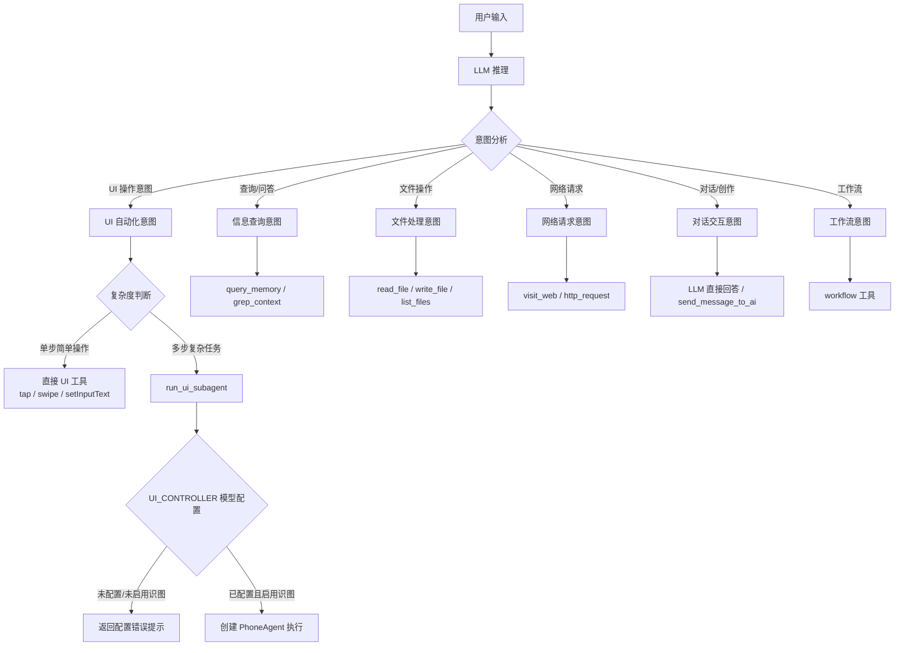
```mermaid
flowchart TD
    UserInput[用户输入] --> LLM[LLM 推理]

    LLM --> IntentAnalysis{意图分析}

    IntentAnalysis -->|UI 操作意图| UIIntent[UI 自动化意图]
    IntentAnalysis -->|查询/问答| QueryIntent[信息查询意图]
    IntentAnalysis -->|文件操作| FileIntent[文件处理意图]
    IntentAnalysis -->|网络请求| NetIntent[网络请求意图]
    IntentAnalysis -->|对话/创作| ChatIntent[对话交互意图]
    IntentAnalysis -->|工作流| WorkflowIntent[工作流意图]

    UIIntent --> UIComplexity{复杂度判断}
    UIComplexity -->|单步简单操作| DirectUITool[直接 UI 工具<br/>tap / swipe / setInputText]
    UIComplexity -->|多步复杂任务| SubAgent[run_ui_subagent]

    SubAgent --> ModelCheck{UI_CONTROLLER 模型配置}
    ModelCheck -->|未配置/未启用识图| ConfigError[返回配置错误提示]
    ModelCheck -->|已配置且启用识图| ExecuteSubAgent[创建 PhoneAgent 执行]

    QueryIntent --> QueryTool[query_memory / grep_context]
    FileIntent --> FileTool[read_file / write_file / list_files]
    NetIntent --> NetTool[visit_web / http_request]
    ChatIntent --> DirectAnswer[LLM 直接回答 / send_message_to_ai]
    WorkflowIntent --> WorkflowTool[workflow 工具]
```

#### 4.2.4 决策矩阵

| 维度 | 使用 SubAgent | 使用直接工具 | 使用 LLM 直接回答 |
|------|--------------|-------------|-------------------|
| **步骤数量** | ≥ 3 步 | 1-2 步 | 0 步 |
| **视觉理解** | 需要识图 | 无需识图 | 无需识图 |
| **条件判断** | 有条件分支 | 线性流程 | 无流程 |
| **错误恢复** | 需要容错 | 简单执行 | 不涉及 |
| **跨应用** | 跨多个应用 | 单应用内 | 不涉及 |

### 4.3 工具发现与三层自动激活

`AIToolHandler.getToolExecutorOrActivate()` 是意图路由的核心方法，实现三层渐进式工具发现：

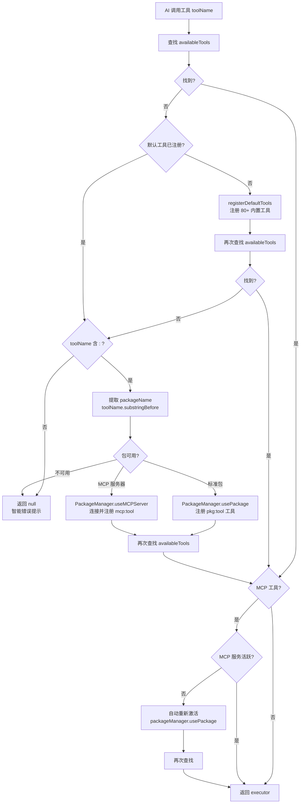
```mermaid
flowchart TD
    Start[AI 调用工具 toolName] --> Lookup1[查找 availableTools]

    Lookup1 --> Found1{找到?}
    Found1 -->|是| CheckMCP{MCP 工具?}
    Found1 -->|否| CheckDefault{默认工具已注册?}

    CheckDefault -->|否| RegisterDefault[registerDefaultTools<br/>注册 80+ 内置工具]
    RegisterDefault --> Lookup2[再次查找 availableTools]
    Lookup2 --> Found2{找到?}
    Found2 -->|是| CheckMCP
    Found2 -->|否| CheckColon

    CheckDefault -->|是| CheckColon
    CheckColon{toolName 含 : ?}
    CheckColon -->|否| NotFound[返回 null<br/>智能错误提示]
    CheckColon -->|是| ExtractPkg[提取 packageName<br/>toolName.substringBefore]

    ExtractPkg --> CheckAvail{包可用?}
    CheckAvail -->|标准包| UsePackage[PackageManager.usePackage<br/>注册 pkg:tool 工具]
    CheckAvail -->|MCP 服务器| UseMCP[PackageManager.useMCPServer<br/>连接并注册 mcp:tool]
    CheckAvail -->|不可用| NotFound

    UsePackage --> Lookup3[再次查找 availableTools]
    UseMCP --> Lookup3
    Lookup3 --> CheckMCP

    CheckMCP -->|否| ReturnExecutor[返回 executor]
    CheckMCP -->|是| CheckActive{MCP 服务活跃?}
    CheckActive -->|是| ReturnExecutor
    CheckActive -->|否| Reactivate[自动重新激活<br/>packageManager.usePackage]
    Reactivate --> Lookup4[再次查找]
    Lookup4 --> ReturnExecutor
```

**关键代码** — [AIToolHandler.kt](file:///Users/liangyingjie/Documents/my_agent_projects/Operit/app/src/main/java/com/ai/assistance/operit/core/tools/AIToolHandler.kt)：

```kotlin
fun getToolExecutorOrActivate(toolName: String): ToolExecutor? {
    var executor = availableTools[toolName]

    // 阶段1: 默认工具未注册时先注册
    if (executor == null && !defaultToolsRegistered.get()) {
        registerDefaultTools()
        executor = availableTools[toolName]
    }

    // 阶段2: 含 ":" 的工具名 → 自动激活 Package/MCP
    if (executor == null && toolName.contains(':')) {
        val packageName = toolName.substringBefore(':', missingDelimiterValue = "")
        if (packageName.isNotBlank()) {
            val packageManager = getOrCreatePackageManager()
            val isPackageAvailable = packageManager.getAvailablePackages().containsKey(packageName)
            val isMcpAvailable = packageManager.getAvailableServerPackages().containsKey(packageName)
            if (isPackageAvailable || isMcpAvailable) {
                packageManager.usePackage(packageName)
                executor = availableTools[toolName]
            }
        }
    }

    // 阶段3: MCP 服务不活跃时自动重新激活
    if (executor != null && toolName.contains(':')) {
        val packageName = toolName.substringBefore(':', missingDelimiterValue = "")
        if (packageName.isNotBlank()) {
            val packageManager = getOrCreatePackageManager()
            val isMcpAvailable = packageManager.getAvailableServerPackages().containsKey(packageName)
            if (isMcpAvailable && !isMcpServiceActive(packageName)) {
                packageManager.usePackage(packageName)
                executor = availableTools[toolName]
            }
        }
    }

    return executor
}
```

#### 工具名冒号约定

包内工具统一使用 `packageName:toolName` 命名格式，系统通过检测 `:` 来触发自动激活：

| 工具名格式 | 解析逻辑 | 示例 |
|-----------|----------|------|
| `tool_name` | 直接查找内置工具 | `read_file` |
| `pkg:tool` | 提取 `pkg`，激活 Package，查找 `pkg:tool` | `weather:get_forecast` |
| `mcp:tool` | 提取 `mcp`，激活 MCP 服务器，查找 `mcp:tool` | `filesystem:read_file` |

**解析实现**：

```kotlin
// AIToolHandler.kt — 使用 substringBefore 提取包名
val packageName = toolName.substringBefore(':', missingDelimiterValue = "")

// MCPToolExecutor.kt — 使用 split 分割，支持工具名含冒号
val toolNameParts = tool.name.split(":")
val serverName = toolNameParts[0]
val actualToolName = toolNameParts.subList(1, toolNameParts.size).joinToString(":")

// JsToolManager.kt — 使用 indexOf 找第一个冒号
val separatorIndex = toolName.indexOf(':')
return toolName.substring(0, separatorIndex) to toolName.substring(separatorIndex + 1)
```

#### 工具不可用时的智能错误提示

当工具查找失败时，`buildToolNotAvailableErrorMessage` 根据工具名格式给出针对性提示：

| 情况 | 错误提示 | 示例 |
|------|----------|------|
| 含 `.` 不含 `:` | "请使用 `packName:toolName` 格式" | `weather.forecast` → 提示用 `weather:forecast` |
| 含 `:` 但包不存在 | "Package not found" | `unknown:tool` |
| 含 `:` 但工具是 advice-only | "This tool is advice-only" | `pkg:info_tool` |
| 直接用包名当工具名 | "是工具包不是工具，请先 use_package" | `weather` |

### 4.4 SubAgent 路由模式

SubAgent 是意图路由中的特殊模式——工具执行器内部启动一个**嵌套的 AI 推理循环**，形成 Agent 嵌套：

```
主 AI 循环 (EnhancedAIService ReAct Loop)
    │
    ├──► 普通工具调用
    │       ToolExecutor.invoke() → 直接返回结果
    │
    └──► SubAgent 工具调用
            │
            ├──► run_ui_subagent
            │       StandardUITools.runUiSubAgent()
            │       → 创建 PhoneAgent
            │       → 独立的截屏-推理-执行循环
            │       → 使用 UI_CONTROLLER 专用模型
            │       → 返回 AutomationExecutionResult
            │
            └──► send_message_to_ai
                    ChatManagerTool.sendMessageToAI()
                    → 创建独立 EnhancedAIService 实例
                    → 独立的 ReAct 循环
                    → 使用 CHAT 模型
                    → 返回 AI 回复结果
```

#### 4.4.1 run_ui_subagent 调用链路

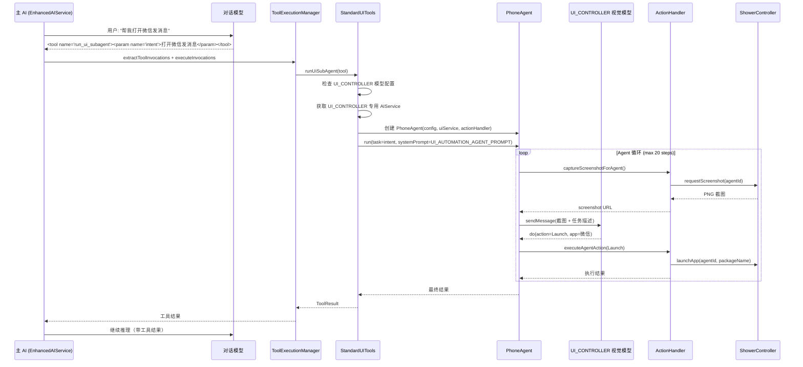
```mermaid
sequenceDiagram
    participant MainAI as 主 AI (EnhancedAIService)
    participant LLM as 对话模型
    participant TEM as ToolExecutionManager
    participant UITools as StandardUITools
    participant PhoneAgent as PhoneAgent
    participant VLM as UI_CONTROLLER 视觉模型
    participant AH as ActionHandler
    participant Shower as ShowerController

    MainAI->>LLM: 用户: "帮我打开微信发消息"
    LLM-->>MainAI: <tool name="run_ui_subagent"><param name="intent">打开微信发消息</param></tool>

    MainAI->>TEM: extractToolInvocations + executeInvocations
    TEM->>UITools: runUiSubAgent(tool)

    UITools->>UITools: 检查 UI_CONTROLLER 模型配置
    UITools->>UITools: 获取 UI_CONTROLLER 专用 AIService
    UITools->>PhoneAgent: 创建 PhoneAgent(config, uiService, actionHandler)

    UITools->>PhoneAgent: run(task=intent, systemPrompt=UI_AUTOMATION_AGENT_PROMPT)

    loop Agent 循环 (max 20 steps)
        PhoneAgent->>AH: captureScreenshotForAgent()
        AH->>Shower: requestScreenshot(agentId)
        Shower-->>AH: PNG 截图
        AH-->>PhoneAgent: screenshot URL

        PhoneAgent->>VLM: sendMessage(截图 + 任务描述)
        VLM-->>PhoneAgent: do(action=Launch, app=微信)

        PhoneAgent->>AH: executeAgentAction(Launch)
        AH->>Shower: launchApp(agentId, packageName)
        AH-->>PhoneAgent: 执行结果
    end

    PhoneAgent-->>UITools: 最终结果
    UITools-->>TEM: ToolResult
    TEM-->>MainAI: 工具结果
    MainAI->>LLM: 继续推理（带工具结果）
```

#### 4.4.2 SubAgent 工具注册

```kotlin
// ToolRegistration.kt — run_ui_subagent 注册
handler.registerTool(
    name = "run_ui_subagent",
    descriptionGenerator = { tool ->
        val intent = tool.parameters.find { it.name == "intent" }?.value ?: ""
        val maxSteps = tool.parameters.find { it.name == "max_steps" }?.value ?: "20"
        buildString {
            append(s(R.string.toolreg_run_ui_subagent_desc, intent, maxSteps))
            append(s(R.string.toolreg_run_ui_subagent_hint))
        }
    },
    executor = { tool -> runBlocking(Dispatchers.IO) { uiTools.runUiSubAgent(tool) } }
)

// ToolRegistration.kt — send_message_to_ai 注册
handler.registerTool(
    name = "send_message_to_ai",
    executor = { tool -> runBlocking(Dispatchers.IO) { chatManagerTool.sendMessageToAI(tool) } }
)
handler.registerTool(
    name = "send_message_to_ai_streaming",
    executor = object : ToolExecutor {
        override fun invoke(tool: AITool): ToolResult = ...
        override fun invokeAndStream(tool: AITool): Flow<ToolResult> =
            chatManagerTool.sendMessageToAIStream(tool)
    }
)
```

#### 4.4.3 JS 桥接层 SubAgent 定义

```javascript
// JsTools.kt 中定义的 JS 工具桥接
var Tools = {
    UI: {
        runSubAgent: (intent, maxSteps, agentId, targetApp) => {
            const params = { intent: String(intent || "") };
            if (maxSteps !== undefined) params.max_steps = String(maxSteps);
            if (agentId !== undefined && agentId !== null && String(agentId).length > 0)
                params.agent_id = String(agentId);
            if (targetApp !== undefined && targetApp !== null && String(targetApp).length > 0)
                params.target_app = String(targetApp);
            return toolCall("run_ui_subagent", params);
        },
    },
    Chat: {
        sendMessage: (message, chatId, roleCardId, senderName, options = {}) => {
            return toolCall("send_message_to_ai", params);
        },
        sendMessageStreaming: (message, chatId, roleCardId, senderName, options = {}) => {
            return toolCall("send_message_to_ai_streaming", params, toolOptions);
        },
    }
};
```

### 4.5 多模型功能路由（FunctionType）

不同类型的 AI 任务路由到不同的模型配置，通过 `FunctionType` 枚举和 `MultiServiceManager` 实现：

```kotlin
enum class FunctionType {
    CHAT,                    // 常规对话
    SUMMARY,                 // 对话总结
    MEMORY,                  // 记忆库处理
    UI_CONTROLLER,           // UI 自动化控制
    TRANSLATION,             // 翻译功能
    GREP,                    // Grep 上下文检索/代码搜索规划
    ROLE_RESPONSE_PLANNER,   // 角色回答顺序规划
    IMAGE_RECOGNITION,       // 图像识别
    AUDIO_RECOGNITION,       // 音频识别
    VIDEO_RECOGNITION        // 视频识别
}
```

#### 路由机制

```
EnhancedAIService
    │
    └──► MultiServiceManager.getServiceForFunction(functionType)
            │
            ├──► functionalConfigManager.getConfigMappingForFunction(functionType)
            │       返回 (configId, modelIndex) 映射
            │
            ├──► modelConfigManager.getModelConfigFlow(configId)
            │       返回对应配置的 ModelConfigData
            │
            ├──► createServiceFromConfig(config, modelIndex)
            │       创建 AIService 实例
            │
            └──► 缓存到 serviceInstances[functionType]
                    后续相同 FunctionType 直接复用
```

#### 功能路由与意图路由的协作

```
用户输入: "帮我打开微信发消息"
    │
    ▼
主 AI 循环 (FunctionType.CHAT 模型)
    │
    ├── LLM 决定调用 run_ui_subagent
    │
    ▼
StandardUITools.runUiSubAgent()
    │
    ├── 获取 UI_CONTROLLER 专用模型配置
    │   val uiConfig = EnhancedAIService.getModelConfigForFunction(context, FunctionType.UI_CONTROLLER)
    │
    ├── 检查识图能力
    │   if (!uiConfig.enableDirectImageProcessing) → 返回错误
    │
    ├── 获取 UI_CONTROLLER 专用 AIService
    │   val uiService = EnhancedAIService.getAIServiceForFunction(context, FunctionType.UI_CONTROLLER)
    │
    └── 创建 PhoneAgent 使用 UI_CONTROLLER 模型
        PhoneAgent(uiService = uiService, ...)
```

#### 速率限制

```kotlin
class RateLimitedAIService(private val delegate: AIService) : AIService {
    // 速率限制：每分钟最多 N 次请求
    // 并发限制：最多 M 个并发请求
    // 超时保护：单次请求最长 T 秒
}
```

### 4.6 CLI 模式路由（search + proxy）

对于不支持 Function Calling 的本地模型（Ollama、LM Studio、MNN、Llama.cpp 等），系统自动切换为 CLI 模式，使用 **search + proxy** 两步代理方式暴露工具能力：

```kotlin
enum class ToolExposureMode {
    FULL,   // 完整模式：直接暴露所有工具描述
    CLI;    // CLI 模式：只暴露 search + proxy 两个入口

    companion object {
        fun resolve(providerType: ApiProviderType): ToolExposureMode {
            return when (providerType) {
                ApiProviderType.LMSTUDIO,
                ApiProviderType.OLLAMA,
                ApiProviderType.OPENAI_LOCAL,
                ApiProviderType.MNN,
                ApiProviderType.LLAMA_CPP -> CLI
                else -> FULL
            }
        }
    }
}
```

#### CLI 模式工作流程

```
AI 需要执行工具时：
    │
    ├──► Step 1: search(query)
    │       搜索隐藏的工具目录
    │       返回匹配的工具名称和描述
    │
    └──► Step 2: proxy(tool_name, params)
            代理执行实际工具
            返回工具执行结果
```

**CLI 模式下的工具白名单**：

```kotlin
private val PUBLIC_TOOL_NAMES = linkedSetOf(
    "search",   // 搜索工具目录
    "proxy"     // 代理执行工具
)
```

**CLI 模式下的系统提示词替换**：

```kotlin
if (toolExposureMode == ToolExposureMode.CLI) {
    prompt = prompt
        .replace("TOOL_USAGE_GUIDELINES_SECTION", CliToolModeSupport.buildCliModePrompt(useEnglish))
        .replace("PACKAGE_SYSTEM_GUIDELINES_SECTION", "")
        .replace("ACTIVE_PACKAGES_SECTION", "")
        .replace("AVAILABLE_TOOLS_SECTION", "")
}
```

CLI 模式下不直接列出工具列表和包系统说明，而是替换为 search+proxy 使用说明。

### 4.7 完整路由流程图

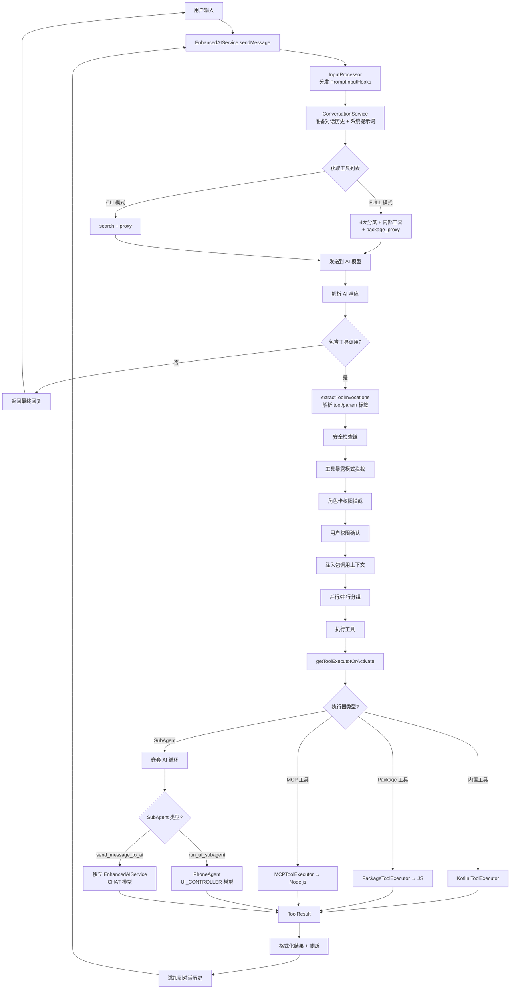
```mermaid
flowchart TB
    User[用户输入] --> EAS[EnhancedAIService.sendMessage]

    EAS --> InputProc[InputProcessor<br/>分发 PromptInputHooks]
    InputProc --> ConvSvc[ConversationService<br/>准备对话历史 + 系统提示词]

    ConvSvc --> ToolList{获取工具列表}
    ToolList -->|FULL 模式| FullTools[4大分类 + 内部工具<br/>+ package_proxy]
    ToolList -->|CLI 模式| CliTools[search + proxy]

    FullTools --> SendLLM[发送到 AI 模型]
    CliTools --> SendLLM

    SendLLM --> ParseResponse[解析 AI 响应]

    ParseResponse --> HasTool{包含工具调用?}
    HasTool -->|否| FinalReply[返回最终回复]
    HasTool -->|是| ExtractTools[extractToolInvocations<br/>解析 tool/param 标签]

    ExtractTools --> SecurityCheck[安全检查链]
    SecurityCheck --> ExposureMode[工具暴露模式拦截]
    ExposureMode --> RoleCardCheck[角色卡权限拦截]
    RoleCardCheck --> PermCheck[用户权限确认]
    PermCheck --> InjectCtx[注入包调用上下文]
    InjectCtx --> Grouping[并行/串行分组]

    Grouping --> Execute[执行工具]

    Execute --> FindExecutor[getToolExecutorOrActivate]
    FindExecutor --> ExecutorType{执行器类型?}

    ExecutorType -->|内置工具| KotlinExec[Kotlin ToolExecutor]
    ExecutorType -->|Package 工具| PkgExec[PackageToolExecutor → JS]
    ExecutorType -->|MCP 工具| McpExec[MCPToolExecutor → Node.js]
    ExecutorType -->|SubAgent| SubAgentExec[嵌套 AI 循环]

    SubAgentExec --> SubAgentType{SubAgent 类型?}
    SubAgentType -->|run_ui_subagent| PhoneAgentExec[PhoneAgent<br/>UI_CONTROLLER 模型]
    SubAgentType -->|send_message_to_ai| ChatAgentExec[独立 EnhancedAIService<br/>CHAT 模型]

    KotlinExec --> ToolResult[ToolResult]
    PkgExec --> ToolResult
    McpExec --> ToolResult
    PhoneAgentExec --> ToolResult
    ChatAgentExec --> ToolResult

    ToolResult --> FormatResult[格式化结果 + 截断]
    FormatResult --> AddHistory[添加到对话历史]
    AddHistory --> EAS

    FinalReply --> User
```

---

## 五、工具系统架构

### 5.1 工具注册与执行

```
┌─────────────────────────────────────────────────────────────────────────────┐
│                            AIToolHandler                                     │
│                         (工具注册/查找/执行中心)                               │
└─────────────────────────────────────────────────────────────────────────────┘
        │
        ├──► registerTool(name, executor)  ──►  availableTools[name] = executor
        │
        ├──► executeTool(tool: AITool)
        │       │
        │       ├──► 1. 通知 Hook: onToolCallRequested
        │       ├──► 2. 查找 executor
        │       │       • 直接查找 availableTools[name]
        │       │       • 未找到 → getToolExecutorOrActivate(name)
        │       │               • name 含 ":" → 自动激活 Package/MCP
        │       │               • "pkg:tool" → PackageManager.usePackage("pkg")
        │       │               • "mcp:tool" → MCPManager.getOrCreateClient("mcp")
        │       ├──► 3. 参数验证: executor.validateParameters(tool)
        │       ├──► 4. 通知 Hook: onToolPermissionChecked
        │       ├──► 5. 通知 Hook: onToolExecutionStarted
        │       ├──► 6. 执行: executor.invoke(tool) → ToolResult
        │       ├──► 7. 通知 Hook: onToolExecutionResult
        │       └──► 8. 通知 Hook: onToolExecutionFinished
        │
        └──► executeToolAndStream(tool: AITool) → Flow<ToolResult>
                • 支持流式结果（中间结果 + 最终结果）
```

### 5.2 四种工具扩展方式

| 方式 | 格式 | 执行器 | 扩展能力 |
|------|------|--------|----------|
| **内置工具** | `tool_name` | Kotlin ToolExecutor | 80+ 默认工具 |
| **MCP 插件** | `server:tool` | MCPToolExecutor | Node.js 第三方工具 |
| **Package 工具** | `pkg:tool` | PackageToolExecutor | JS 脚本工具 |
| **ToolPkg** | `pkg:tool` | PackageToolExecutor | JS + Compose DSL + 钩子 |

### 5.3 工具执行管理器 — ToolExecutionManager

```
executeInvocations(invocations, ...)
    │
    ├──► 1. 工具暴露模式拦截
    │       • CLI 模式 → 只允许白名单工具
    │       • FULL 模式 → 允许所有工具
    │
    ├──► 2. 角色卡工具权限拦截
    │       • 角色卡定义了 allowedTools → 只允许列表内工具
    │
    ├──► 3. 权限检查
    │       • 敏感工具（execute_shell, write_file 等）→ 弹窗确认
    │       • 非敏感工具 → 自动授权
    │
    ├──► 4. 注入包调用上下文
    │       • __operit_package_caller_name
    │       • __operit_package_caller_card_id
    │       • __operit_package_chat_id
    │
    ├──► 5. 并行/串行分组
    │       • 并行组：list_files, read_file, read_file_part, grep_code, grep_context,
    │                 find_files, query_memory, get_memory_by_title, file_info, file_exists
    │       • 串行组：其他所有工具
    │
    ├──► 6. 执行
    │       • 并行组 → coroutineScope { launch { ... } } 并发执行
    │       • 串行组 → 逐个执行
    │
    └──► 7. 按原始顺序聚合结果
```

---

## 六、PhoneAgent — 视觉 UI 自动化 Agent

### 6.1 架构

```
┌─────────────────────────────────────────────────────────────────────────────┐
│                            PhoneAgent                                        │
│                    (视觉语言模型驱动的 UI 自动化)                               │
└─────────────────────────────────────────────────────────────────────────────┘
        │
        ├──► AgentConfig(maxSteps = 20)
        │
        ├──► run(task, systemPrompt, onStep, isPausedFlow, targetApp)
        │       │
        │       ├──► 确保虚拟屏幕就绪
        │       │       • ShowerController.ensureDisplay()
        │       │       • 或 VirtualDisplayManager.ensureVirtualDisplay()
        │       │
        │       ├──► 预热 Shower（可选）
        │       │
        │       └──► 循环执行 _executeStep() 直到完成
        │               │
        │               ├──► 1. 截屏
        │               │       captureScreenshotForAgent()
        │               │       • Shower 虚拟屏截图
        │               │       • 或标准截屏工具
        │               │
        │               ├──► 2. 构建多模态消息
        │               │       • 系统提示词（UI 自动化 Agent Prompt）
        │               │       • 截屏图片
        │               │       • 任务描述
        │               │
        │               ├──► 3. 调用视觉语言模型
        │               │       uiService.sendMessage(...)
        │               │
        │               ├──► 4. 解析 AI 响应
        │               │       parseThinkingAndAction(response)
        │               │       • 提取思考过程
        │               │       • 解析动作指令
        │               │
        │               ├──► 5. 执行动作
        │               │       ActionHandler.handle(action)
        │               │       • Launch → 启动应用
        │               │       • Tap → 点击坐标
        │               │       • Type → 输入文本
        │               │       • Swipe → 滑动
        │               │       • Back → 返回键
        │               │       • Home → 主页键
        │               │       • Wait → 等待
        │               │       • Take_over → 交还用户控制
        │               │
        │               └──► 6. 检查完成条件
        │                       • finish(message=...) → 任务完成
        │                       • maxSteps 达到 → 强制结束
        │                       • 异常 → 报错退出
        │
        └──► PhoneAgentJobRegistry
                • 管理所有活跃 Agent 协程
                • 支持按 agentId 取消
                • 支持全局取消
```

### 6.2 动作格式

```
AI 输出格式：
    do(action=Launch, app=com.example.app)
    do(action=Tap, x=500, y=800)
    do(action=Type, text=Hello World)
    do(action=Swipe, startX=500, startY=800, endX=500, endY=400, duration=300)
    do(action=Back)
    do(action=Home)
    do(action=Wait, duration=1000)
    do(action=Take_over)
    finish(message=任务已完成)
```

### 6.3 Shower 虚拟屏集成

```
PhoneAgent
    │
    ├──► ShowerController (全局单例)
    │       │
    │       ├──► instances: Map<agentId, ClientShowerController>
    │       │
    │       ├──► ensureDisplay(agentId, width, height, dpi, bitrate)
    │       │       • 创建虚拟显示屏
    │       │
    │       ├──► tap/swipe/key(agentId, ...)
    │       │       • 注入触摸/按键事件
    │       │
    │       ├──► requestScreenshot(agentId)
    │       │       • 截取当前帧
    │       │
    │       └──► shutdown(agentId)
    │               • 销毁虚拟屏
    │
    ├──► ShowerServerManager
    │       • 管理 shower-server.jar 生命周期
    │       • 从 assets 拷贝并启动
    │
    └──► ShowerBinderRegistry
            • 管理 IShowerService Binder 连接
            • 接收广播通知服务就绪
```

---

## 七、Prompt 钩子系统

### 7.1 七阶段钩子链

```
用户输入
    │
    ├──► Stage 1: PromptInputHook
    │       • 修改用户原始输入
    │       • ToolPkg 可注入预处理逻辑
    │
    ├──► Stage 2: PromptHistoryHook
    │       • 修改对话历史
    │       • ToolPkg 可添加/删除/修改历史消息
    │
    ├──► Stage 3: PromptEstimateHistoryHook
    │       • 修改估算用的对话历史（Token 计数）
    │
    ├──► Stage 4: SystemPromptComposeHook
    │       • 修改系统提示词
    │       • ToolPkg 可注入自定义指令
    │
    ├──► Stage 5: ToolPromptComposeHook
    │       • 修改工具提示词
    │       • ToolPkg 可添加/隐藏/修改工具描述
    │
    ├──► Stage 6: PromptFinalizeHook
    │       • 最终修改完整 Prompt（发送前）
    │       • ToolPkg 可做最终调整
    │
    └──► Stage 7: PromptEstimateFinalizeHook
            • 最终修改估算用 Prompt（Token 计数）
```

### 7.2 ToolPkg 钩子桥接

```
ToolPkg JS 脚本
    │
    ├──► registerToolPkgPromptHook({ event: "toolpkg_system_prompt_compose", ... })
    │
    ├──► ToolPkgPromptHookBridge (Kotlin)
    │       • 将 JS 钩子注册转换为 PromptHookRegistry 钩子
    │       • 7 个桥接对象对应 7 个阶段
    │
    └──► PromptHookRegistry (Kotlin)
            • 分发钩子事件
            • 应用钩子修改
```

### 7.3 其他钩子系统

| 钩子系统 | 触发时机 | 用途 |
|----------|----------|------|
| **AIToolHook** | 工具执行生命周期 | 通知 UI 更新、日志记录 |
| **AppLifecycleHook** | 应用生命周期事件 | ToolPkg 响应前后台切换 |
| **ToolLifecycleHook** | 工具执行前后 | ToolPkg 拦截/修改工具行为 |
| **XmlRenderHook** | XML 标签渲染 | ToolPkg 自定义消息渲染 |
| **MessageProcessingHook** | 消息处理 | ToolPkg 修改消息内容 |

---

## 八、文件绑定系统

### 8.1 设计思想

AI 生成代码后，不是直接覆盖文件，而是通过**结构化编辑指令**进行增量修改：

1. AI 输出包含 `[START-REPLACE]`/`[START-DELETE]` 标记的编辑指令
2. 每个编辑指令包含 `[OLD]`（旧内容）和 `[NEW]`（新内容）
3. `FileBindingService` 使用 **n-gram 模糊匹配** 在原始文件中定位旧内容
4. 执行替换或删除操作
5. 生成 unified diff 供用户确认

### 8.2 核心算法

```
processFileBinding(originalContent, aiGeneratedCode)
    │
    ├──► 解析编辑指令
    │       • [START-REPLACE]...[OLD]...[NEW]...[END-REPLACE]
    │       • [START-DELETE]...[OLD]...[END-DELETE]
    │
    ├──► n-gram 模糊匹配
    │       • 将 [OLD] 内容按 n-gram 分割
    │       • 在原始文件中滑动窗口搜索
    │       • 计算相似度分数
    │       • 选择最佳匹配位置
    │
    ├──► 执行编辑操作
    │       • REPLACE → 替换旧内容为新内容
    │       • DELETE → 删除旧内容
    │
    ├──► 歧义检测
    │       • 多重完美匹配 → 拒绝替换
    │       • 无匹配 → 跳过
    │
    ├──► 边界保留
    │       • 保留缩进
    │       • 保留行尾空白
    │
    └──► 生成 unified diff
            generateUnifiedDiff(original, modified)
```

---

## 九、记忆系统设计

### 9.1 系统架构总览

Operit 的记忆系统是一个基于**知识图谱**的长期记忆管理架构，支持多路混合搜索、自动知识提取和语义向量索引：

```
┌─────────────────────────────────────────────────────────────────────────────┐
│                          UI 层                                               │
│  MemoryScreen / MemoryViewModel / GraphVisualizer / FolderNavigator          │
├─────────────────────────────────────────────────────────────────────────────┤
│                          工具执行层                                          │
│  MemoryQueryToolExecutor (AI 工具接口，11 个工具)                             │
│  ToolRegistration (工具注册)                                                 │
├─────────────────────────────────────────────────────────────────────────────┤
│                          业务逻辑层                                          │
│  MemoryLibrary (核心：分析对话 + 构建知识图谱)                                 │
│  MemoryAutoSaveScheduler (定时自动保存，60s tick)                             │
├─────────────────────────────────────────────────────────────────────────────┤
│                          数据存储层                                          │
│  MemoryRepository (CRUD + 混合搜索 + 向量索引)                               │
│  MemoryAutoSaveCandidateRepository (候选队列)                                │
│  ObjectBoxManager (ObjectBox 数据库，按 profileId 隔离)                      │
│  CloudEmbeddingService (云端 Embedding 生成)                                 │
│  VectorIndexManager (HNSW 向量索引)                                          │
├─────────────────────────────────────────────────────────────────────────────┤
│                          数据模型层                                          │
│  Memory / MemoryTag / MemoryLink / MemoryProperty                           │
│  DocumentChunk / Embedding / MemoryAutoSaveCandidate                        │
│  MemorySearchConfig / MemoryScoreMode                                       │
└─────────────────────────────────────────────────────────────────────────────┘
```

### 9.2 数据模型

#### 9.2.1 核心实体关系

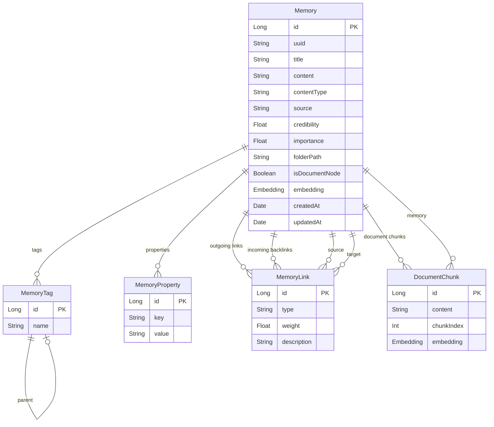
```mermaid
erDiagram
    Memory ||--o{ MemoryTag : "tags"
    Memory ||--o{ MemoryProperty : "properties"
    Memory ||--o{ MemoryLink : "outgoing links"
    Memory ||--o{ MemoryLink : "incoming backlinks"
    Memory ||--o{ DocumentChunk : "document chunks"
    MemoryTag ||--o| MemoryTag : "parent"
    MemoryLink }o--|| Memory : "source"
    MemoryLink }o--|| Memory : "target"
    DocumentChunk }o--|| Memory : "memory"

    Memory {
        Long id PK
        String uuid
        String title
        String content
        String contentType
        String source
        Float credibility
        Float importance
        String folderPath
        Boolean isDocumentNode
        Embedding embedding
        Date createdAt
        Date updatedAt
    }

    MemoryTag {
        Long id PK
        String name
    }

    MemoryLink {
        Long id PK
        String type
        Float weight
        String description
    }

    MemoryProperty {
        Long id PK
        String key
        String value
    }

    DocumentChunk {
        Long id PK
        String content
        Int chunkIndex
        Embedding embedding
    }
```

#### 9.2.2 Memory 实体

```kotlin
@Entity
data class Memory(
    @Id var id: Long = 0,
    var uuid: String = UUID.randomUUID().toString(),
    var title: String = "",              // 简短标题/摘要
    var content: String = "",            // 详细内容
    var contentType: String = "text/plain",
    var source: String = "unknown",      // 来源 (user_input, chat_summary, memory_analysis 等)
    var credibility: Float = 0.5f,       // 可信度 0.0-1.0
    var importance: Float = 0.5f,        // 重要性 0.0-1.0
    var documentPath: String? = null,    // 外部文档路径
    var isDocumentNode: Boolean = false, // 是否代表外部文档
    @Index var folderPath: String? = null, // 文件夹路径分类
    var embedding: Embedding? = null,    // 向量嵌入
    var createdAt: Date = Date(),
    var updatedAt: Date = Date(),
    var lastAccessedAt: Date = Date()
)
```

**关系**：
- `tags: ToMany<MemoryTag>` — 标签（多对多）
- `properties: ToMany<MemoryProperty>` — 键值对属性
- `links: ToMany<MemoryLink>` — 出边关联
- `backlinks: ToMany<MemoryLink>` — 入边关联（反向链接）
- `documentChunks: ToMany<DocumentChunk>` — 文档分块

#### 9.2.3 关联与标签

**MemoryLink** — 定义记忆间关系：
```kotlin
@Entity
data class MemoryLink(
    @Id var id: Long = 0,
    var type: String = "related",   // 关联类型 (causes, explains, part_of 等)
    var weight: Float = 1.0f,       // 关联强度 0.0-1.0
    var description: String = ""
)
```

**MemoryTag** — 支持层级结构：
```kotlin
@Entity
data class MemoryTag(
    @Id var id: Long = 0,
    var name: String = ""
) {
    lateinit var parent: ToOne<MemoryTag>    // 父标签
    lateinit var memories: ToMany<Memory>    // 该标签下的记忆
}
```

### 9.3 存储层设计

#### 9.3.1 ObjectBox 数据库

记忆系统使用 **ObjectBox**（非 Room）作为数据库，按 `profileId` 隔离存储：

```kotlin
object ObjectBoxManager {
    private val stores = ConcurrentHashMap<String, BoxStore>()

    fun get(context: Context, profileId: String): BoxStore {
        // 每个 profileId 有独立目录：objectbox_profiles/{profileId}
        // "default" profile 使用 "objectbox" 目录（向后兼容）
        MyObjectBox.builder()
            .androidContext(context.applicationContext)
            .directory(dbDir)
            .build()
    }
}
```

#### 9.3.2 MemoryRepository

[MemoryRepository.kt](file:///Users/liangyingjie/Documents/my_agent_projects/Operit/app/src/main/java/com/ai/assistance/operit/data/repository/MemoryRepository.kt) 是记忆系统的核心存储层（约 2814 行），提供完整的 CRUD + 搜索 + 向量索引能力：

```
MemoryRepository
    │
    ├──► CRUD 操作
    │       saveMemory() / findMemoryById() / findMemoryByTitle() / deleteMemory()
    │       createMemory() / updateMemory() / mergeMemories()
    │
    ├──► Link 操作
    │       linkMemories() / queryMemoryLinks() / updateLink() / deleteLink()
    │
    ├──► Tag 操作
    │       addTagToMemory()
    │
    ├──► 文件夹操作
    │       getAllFolderPaths() / getMemoriesByFolderPath()
    │       createFolder() / renameFolder() / deleteFolder() / moveMemoriesToFolder()
    │
    ├──► 文档操作
    │       createMemoryFromDocument() / getChunksForMemory()
    │       searchChunksInDocument() / updateChunk()
    │
    ├──► 混合搜索
    │       searchMemories() / runSearchMemoriesWithDebug()
    │
    ├──► 向量索引
    │       rebuildAllMemoryVectorIndices() / rebuildDocumentChunkIndex()
    │       addMemoryToIndexInternal()
    │
    └──► 导入导出
            exportMemoriesToJson() / importMemoriesFromJson(strategy)
                    • SKIP / UPDATE / CREATE_NEW 三种策略
```

### 9.4 混合搜索算法

记忆搜索采用**多路召回 + RRF 融合**的混合搜索策略：

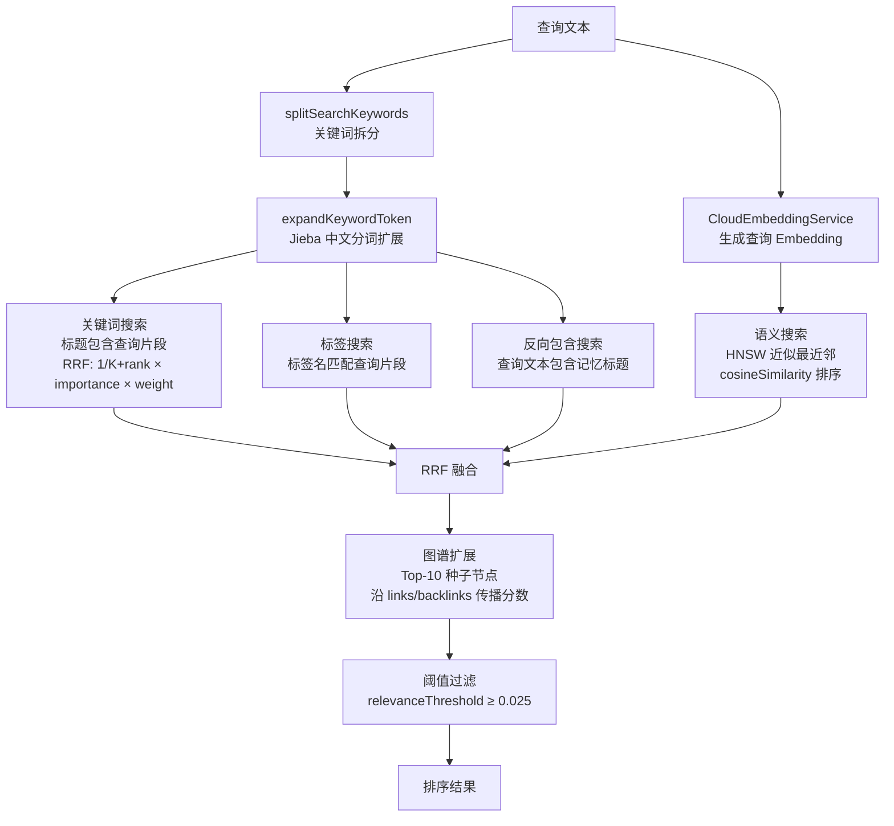
```mermaid
flowchart TD
    Query[查询文本] --> Split[splitSearchKeywords<br/>关键词拆分]
    Split --> Jieba[expandKeywordToken<br/>Jieba 中文分词扩展]

    Jieba --> Keyword[关键词搜索<br/>标题包含查询片段<br/>RRF: 1/K+rank × importance × weight]
    Jieba --> Tag[标签搜索<br/>标签名匹配查询片段]
    Jieba --> Reverse[反向包含搜索<br/>查询文本包含记忆标题]

    Query --> Embed[CloudEmbeddingService<br/>生成查询 Embedding]
    Embed --> Semantic[语义搜索<br/>HNSW 近似最近邻<br/>cosineSimilarity 排序]

    Keyword --> RRF[RRF 融合]
    Tag --> RRF
    Reverse --> RRF
    Semantic --> RRF

    RRF --> GraphExpand[图谱扩展<br/>Top-10 种子节点<br/>沿 links/backlinks 传播分数]
    GraphExpand --> Filter[阈值过滤<br/>relevanceThreshold ≥ 0.025]
    Filter --> Result[排序结果]
```

#### 搜索权重配置

```kotlin
enum class MemoryScoreMode { BALANCED, KEYWORD_FIRST, SEMANTIC_FIRST }

// 权重解析
MemoryScoreMode.BALANCED       -> (keyword=1.0x, semantic=1.0x, edge=1.0x)
MemoryScoreMode.KEYWORD_FIRST  -> (keyword=1.3x, semantic=0.8x, edge=0.9x)
MemoryScoreMode.SEMANTIC_FIRST -> (keyword=0.8x, semantic=1.3x, edge=1.1x)
```

#### 向量索引

- 使用 **HNSW** (Hierarchical Navigable Small World) 算法
- 按维度分索引文件：`memory_hnsw_{profileId}_{dimension}.idx`
- 文档区块索引：`doc_index_{profileId}_{memoryId}_{dimension}.hnsw`
- 增量更新时采用**重建策略**而非增量添加

#### Embedding 生成

- 使用云端 Embedding API（OpenAI 兼容格式）
- 记忆保存时自动生成 embedding
- 文档分块独立生成 embedding
- 支持批量重建

### 9.5 AI 工具接口

#### 9.5.1 工具列表

AI 可通过以下 11 个工具操作记忆库：

| 工具名 | 功能 | 参数 |
|--------|------|------|
| `query_memory` | 搜索记忆 | query, folder_path, threshold, snapshot_id |
| `get_memory_by_title` | 精确标题检索 | title, include_content |
| `create_memory` | 创建记忆 | title, content, tags, folder_path |
| `update_memory` | 更新记忆 | old_title, new_title, new_content |
| `delete_memory` | 删除记忆 | title |
| `move_memory` | 移动到文件夹 | title, folder_path |
| `link_memories` | 创建关联 | source_title, target_title, type, description |
| `query_memory_links` | 查询关联 | title, type |
| `update_memory_link` | 更新关联 | source, target, type, weight |
| `delete_memory_link` | 删除关联 | source, target, type |
| `update_user_preferences` | 更新用户偏好 | key-value pairs |

#### 9.5.2 Snapshot 去重机制

`query_memory` 支持 `snapshot_id` 参数，跨多次查询排除已返回的记忆，避免 AI 在同一轮对话中重复获取相同记忆。

#### 9.5.3 工具提示词分层

| 分类 | 工具 | 可见性 |
|------|------|--------|
| **基础记忆工具** | query_memory, get_memory_by_title | 始终可见（公开分类） |
| **扩展记忆工具** | create/update/delete/link 等 | 内部工具分类 |

### 9.6 自动知识提取

#### 9.6.1 MemoryLibrary — 核心智能层

[MemoryLibrary.kt](file:///Users/liangyingjie/Documents/my_agent_projects/Operit/app/src/main/java/com/ai/assistance/operit/api/chat/library/MemoryLibrary.kt) 负责从对话中自动提取知识图谱：

```
saveMemory() 核心流程
    │
    ├──► 1. 裁剪对话历史
    │       去除 system 消息、清理 <memory> 标签、精简工具结果
    │
    ├──► 2. generateAnalysis() — AI 分析对话
    │       │
    │       ├── buildCandidateSearchQuery() — 构建搜索查询
    │       ├── memoryRepository.searchMemories() — 检索相关候选（最多 15 条）
    │       ├── findAndDescribeDuplicates() — 检测重复记忆
    │       ├── FunctionalPrompts.buildKnowledgeGraphExtractionPrompt() — 构建提取提示词
    │       └── parseAnalysisResult() — 解析 AI JSON 结果
    │
    ├──► 3. 执行合并操作（mergedEntities）
    │
    ├──► 4. 执行更新操作（updatedEntities）
    │
    ├──► 5. 更新用户偏好（userPreferences）
    │
    ├──► 6. 创建主要问题记忆节点（mainProblem）
    │
    ├──► 7. 处理提取的实体（extractedEntities）
    │       支持别名去重（aliasFor）
    │
    └──► 8. 创建记忆间的关联（links）
```

#### 9.6.2 AI 分析返回的 JSON 结构

```json
{
  "main": ["标题", "内容", ["标签"], "文件夹路径"],
  "new": [["标题", "内容", ["标签"], "文件夹", "别名指向"]],
  "links": [["源标题", "目标标题", "关联类型", "描述", 权重]],
  "update": [["要更新的标题", "新内容", "原因", 可信度, 重要性]],
  "merge": [{"source_titles": [...], "new_title": "...", "new_content": "...", "reason": "..."}],
  "user": {"age": "...", "gender": "...", "personality": "..."}
}
```

#### 9.6.3 自动分类

`autoCategorizeMemories()` 方法：
- 查找所有未分类记忆（folderPath 为空）
- 分批（每批 10 条）调用 AI 进行分类
- AI 返回 JSON 数组 `[{"title": "...", "folder": "..."}]`
- 更新记忆的 folderPath 并重新生成 embedding

### 9.7 自动保存调度

#### 9.7.1 触发机制

```
AI 回复完成
    ↓
EnhancedAIService.finalizeReply()
    ↓
if (enableMemoryAutoUpdate && !isSubTask && content.isNotBlank())
    MemoryAutoSaveCandidateRepository.enqueue(chatId, timestamp)
```

#### 9.7.2 MemoryAutoSaveScheduler

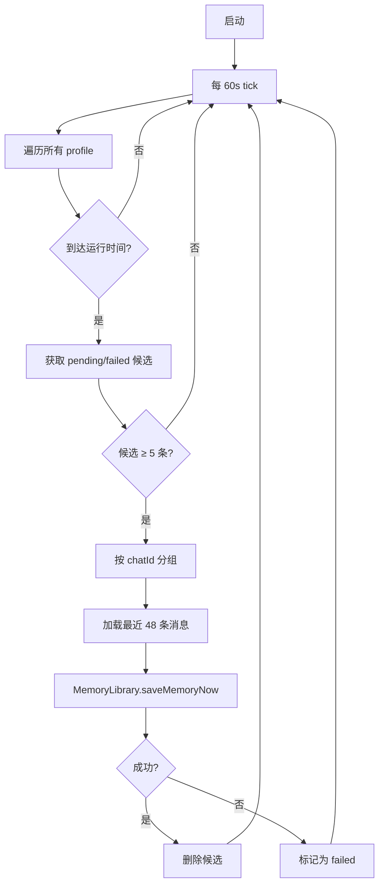
```mermaid
flowchart TD
    Start[启动] --> Tick[每 60s tick]
    Tick --> Profiles[遍历所有 profile]
    Profiles --> CheckTime{到达运行时间?}
    CheckTime -->|否| Tick
    CheckTime -->|是| GetCandidates[获取 pending/failed 候选]
    GetCandidates --> CheckCount{候选 ≥ 5 条?}
    CheckCount -->|否| Tick
    CheckCount -->|是| GroupBy[按 chatId 分组]
    GroupBy --> Load[加载最近 48 条消息]
    Load --> Save[MemoryLibrary.saveMemoryNow]
    Save --> Success{成功?}
    Success -->|是| DeleteCand[删除候选]
    Success -->|否| MarkFailed[标记为 failed]
    DeleteCand --> Tick
    MarkFailed --> Tick
```

**配置**：自动保存间隔默认 15 分钟，范围 1-180 分钟。

### 9.8 记忆与对话的集成

记忆通过**附件机制**注入到对话中：

```kotlin
// AttachmentDelegate.kt
suspend fun captureMemoryFolders(folderPaths: List<String>) {
    val memoryContext = buildMemoryContextXml(folderPaths)
    // 创建附件: fileName="memory_context.xml", mimeType="application/xml"
}

private fun buildMemoryContextXml(folderPaths: List<String>): String {
    return """
<memory_context>
 <available_folders>
  - folder1
  - folder2
 </available_folders>
 <instruction>
- **CRITICAL**: To search within the folders listed above, you **MUST** use the `query_memory` tool...
- Example: <tool name="query_memory"><param name="query">search query</param><param name="folder_path">folder1</param></tool>
 </instruction>
</memory_context>"""
}
```

**集成流程**：

```
用户选择记忆文件夹 → AttachmentDelegate.captureMemoryFolders()
    ↓
buildMemoryContextXml() → 生成 <memory_context> XML 附件
    ↓
附件注入对话 → AI 读取后使用 query_memory 工具主动搜索记忆
```

### 9.9 完整记忆系统流程图

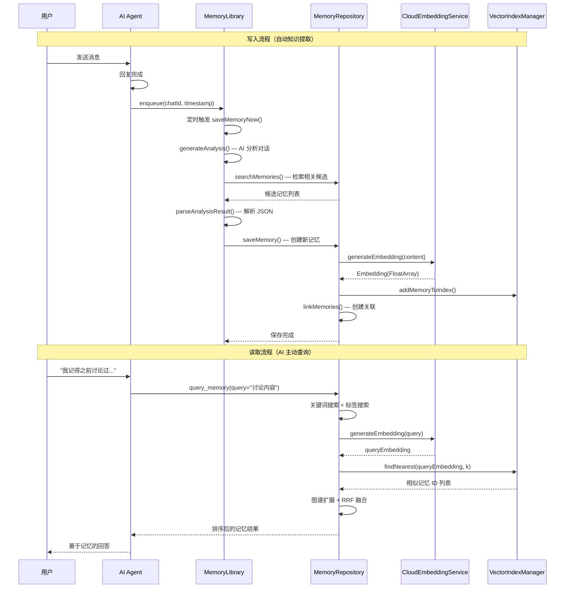
```mermaid
sequenceDiagram
    participant User as 用户
    participant AI as AI Agent
    participant ML as MemoryLibrary
    participant MR as MemoryRepository
    participant CES as CloudEmbeddingService
    participant VI as VectorIndexManager

    Note over User,VI: 写入流程（自动知识提取）

    User->>AI: 发送消息
    AI->>AI: 回复完成
    AI->>ML: enqueue(chatId, timestamp)
    ML->>ML: 定时触发 saveMemoryNow()
    ML->>ML: generateAnalysis() — AI 分析对话
    ML->>MR: searchMemories() — 检索相关候选
    MR-->>ML: 候选记忆列表
    ML->>ML: parseAnalysisResult() — 解析 JSON
    ML->>MR: saveMemory() — 创建新记忆
    MR->>CES: generateEmbedding(content)
    CES-->>MR: Embedding(FloatArray)
    MR->>VI: addMemoryToIndex()
    MR->>MR: linkMemories() — 创建关联
    MR-->>ML: 保存完成

    Note over User,VI: 读取流程（AI 主动查询）

    User->>AI: "我记得之前讨论过..."
    AI->>MR: query_memory(query="讨论内容")
    MR->>MR: 关键词搜索 + 标签搜索
    MR->>CES: generateEmbedding(query)
    CES-->>MR: queryEmbedding
    MR->>VI: findNearest(queryEmbedding, k)
    VI-->>MR: 相似记忆 ID 列表
    MR->>MR: 图谱扩展 + RRF 融合
    MR-->>AI: 排序后的记忆结果
    AI-->>User: 基于记忆的回答
```

---

## 十、对话系统设计

### 10.1 系统架构总览

Operit 的对话系统采用**分层委托架构**，将复杂的聊天业务拆分为 6 个独立 Delegate，由 ChatServiceCore 统一协调：

```
┌─────────────────────────────────────────────────────────────────────────────┐
│                          UI 层                                               │
│  ChatViewModel / AIChatScreen / FloatingChatService                          │
├─────────────────────────────────────────────────────────────────────────────┤
│                          服务协调层                                          │
│  ChatServiceCore (组合 6 Delegates + EnhancedAIService)                      │
│  ┌──────────────┐ ┌──────────────┐ ┌──────────────────────────────────┐    │
│  │UiStateDelegate│ │ApiConfigDel  │ │TokenStatisticsDelegate           │    │
│  │(UI 状态)      │ │(API 配置)    │ │(Token 统计)                      │    │
│  └──────────────┘ └──────────────┘ └──────────────────────────────────┘    │
│  ┌──────────────┐ ┌──────────────┐ ┌──────────────────────────────────┐    │
│  │AttachmentDel │ │ChatHistoryDel│ │MessageProcessingDelegate         │    │
│  │(附件管理)    │ │(历史管理)    │ │(消息处理/流式收集)               │    │
│  └──────────────┘ └──────────────┘ └──────────────────────────────────┘    │
│  ┌──────────────────────────────────────────────────────────────────────┐  │
│  │MessageCoordinationDelegate (总结/续聊/Token超限/群组编排)              │  │
│  └──────────────────────────────────────────────────────────────────────┘  │
├─────────────────────────────────────────────────────────────────────────────┤
│                          AI 消息管理层                                       │
│  AIMessageManager (准备响应流 / 角色卡解析 / 取消操作)                        │
│  EnhancedAIService (ReAct 循环 / 工具检测执行 / 流式处理)                     │
├─────────────────────────────────────────────────────────────────────────────┤
│                          对话准备层                                          │
│  ConversationService (历史准备 / XML 标签拆分 / 对话总结)                     │
│  SystemPromptConfig (动态系统提示词构建)                                      │
│  ConversationRoundManager (轮次管理)                                         │
├─────────────────────────────────────────────────────────────────────────────┤
│                          数据持久层                                          │
│  ChatHistoryManager (Repository)                                             │
│  AppDatabase → ChatDao / MessageDao / MessageVariantDao                      │
│  CharacterCardManager (DataStore)                                            │
│  TokenCacheManager (公共前缀缓存优化)                                         │
└─────────────────────────────────────────────────────────────────────────────┘
```

### 10.2 数据模型

#### 10.2.1 核心实体关系

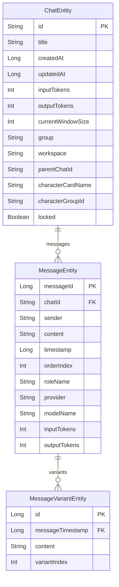
```mermaid
erDiagram
    ChatEntity ||--o{ MessageEntity : "messages"
    MessageEntity ||--o{ MessageVariantEntity : "variants"
    ChatEntity {
        String id PK
        String title
        Long createdAt
        Long updatedAt
        Int inputTokens
        Int outputTokens
        Int currentWindowSize
        String group
        String workspace
        String parentChatId
        String characterCardName
        String characterGroupId
        Boolean locked
    }
    MessageEntity {
        Long messageId PK
        String chatId FK
        String sender
        String content
        Long timestamp
        Int orderIndex
        String roleName
        String provider
        String modelName
        Int inputTokens
        Int outputTokens
    }
    MessageVariantEntity {
        Long id PK
        Long messageTimestamp FK
        String content
        Int variantIndex
    }
```

#### 10.2.2 ChatMessage — 核心消息实体

```kotlin
@Serializable
data class ChatMessage(
    val sender: String,                    // "user" or "ai"
    var content: String = "",
    val timestamp: Long = ChatMessageTimestampAllocator.next(),
    val roleName: String = "",             // 角色名字段
    val selectedVariantIndex: Int = 0,     // 当前选中的回答版本
    val variantCount: Int = 1,             // 可切换的回答版本数量
    val provider: String = "",             // 供应商
    val modelName: String = "",            // 模型名称
    val inputTokens: Int = 0,              // 本轮输入 token
    val outputTokens: Int = 0,             // 本轮输出 token
    val cachedInputTokens: Int = 0,        // 缓存命中的输入 token
    val sentAt: Long = 0L,                 // 请求发送时间
    val outputDurationMs: Long = 0L,       // 输出耗时
    val waitDurationMs: Long = 0L,         // 等待首包耗时
    val displayMode: ChatMessageDisplayMode = NORMAL,
    val isFavorite: Boolean = false,
    @Transient val contentStream: Stream<String>? = null  // 流式内容
)
```

#### 10.2.3 PromptTurn — 对话轮次抽象

```kotlin
enum class PromptTurnKind {
    SYSTEM, USER, ASSISTANT, TOOL_CALL, TOOL_RESULT, SUMMARY
}

data class PromptTurn(
    val kind: PromptTurnKind,
    val content: String,
    val toolName: String? = null,
    val metadata: Map<String, Any?> = emptyMap()
)
```

扩展函数：
- `mergeAdjacentTurns()` — 合并相邻同类型轮次（排除 SYSTEM/TOOL_CALL/TOOL_RESULT）
- `appendUserTurnIfMissing()` — 确保末尾有用户轮次

### 10.3 六 Delegate 架构

| Delegate | 职责 | 核心方法 |
|----------|------|----------|
| **UiStateDelegate** | UI 状态管理 | 错误消息、Toast、权限级别、文件选择器 |
| **ApiConfigDelegate** | API 配置管理 | API Key、端点、模型名、上下文长度、思维模式、总结阈值 |
| **TokenStatisticsDelegate** | Token 统计 | 按 chatId 维护累计 token 计数和窗口大小 |
| **AttachmentDelegate** | 附件管理 | 文件/图片/位置附件、OCR 识别、记忆文件夹注入 |
| **ChatHistoryDelegate** | 聊天历史管理 | 聊天列表、消息窗口分页、创建/删除/切换聊天 |
| **MessageProcessingDelegate** | 消息处理 | 消息发送/接收、流式收集、工具调用循环、重新生成变体 |
| **MessageCoordinationDelegate** | 消息协调 | 总结触发/取消、Token 超限处理、自动续聊、群组编排 |

### 10.4 对话历史管理

#### 10.4.1 ConversationService — 历史准备

[ConversationService.kt](file:///Users/liangyingjie/Documents/my_agent_projects/Operit/app/src/main/java/com/ai/assistance/operit/api/chat/enhance/ConversationService.kt) 将 ChatMessage 列表转换为 PromptTurn 列表：

```
prepareConversationHistory()
    │
    ├──► 1. dispatchHistoryHooks(before_prepare_history)
    │
    ├──► 2. 处理每条消息
    │       ├── processChatMessageWithTools() — 按 XML 标签拆分
    │       │   ├── <think(ing)> → ASSISTANT 消息（思考内容）
    │       │   ├── <tool> → TOOL_CALL 消息
    │       │   ├── <tool_result> → TOOL_RESULT 消息
    │       │   └── <status> → 根据 type 决定角色
    │       ├── 合并相邻同角色消息
    │       └── 规范化 tool_result 格式
    │
    ├──► 3. dispatchHistoryHooks(after_prepare_history)
    │
    └──► 4. 返回 List<PromptTurn>
```

#### 10.4.2 XML 标签处理

ChatMarkupRegex 定义了对话中的 XML 标签正则：

| 标签 | 正则 | 用途 |
|------|------|------|
| `<tool name="...">` | `toolCallPattern` | 工具调用 |
| `<tool_result>` | `toolResultTag` | 工具结果 |
| `<think(ing)>` | `thinkTag` | AI 思考过程 |
| `<status>` | `statusTag` | 状态指示 |

**随机标签名**：`generateRandomToolTagName()` 生成随机后缀（如 `tool_Ab3x`），避免模型输出固定格式，`normalizeToolLikeTagName()` 将其归一化。

#### 10.4.3 角色隔离模式

在群组编排中，不同角色的消息需要隔离：

```
非角色隔离模式：
  所有 ai 消息 → ASSISTANT

角色隔离模式：
  当前角色的消息 → ASSISTANT
  其他角色的消息 → USER，添加 [From role: xxx] 前缀
  用户消息 → 添加 [From user] 前缀
```

### 10.5 上下文窗口管理

#### 10.5.1 Token 计数

**TokenCacheManager** 利用公共前缀缓存优化重复计算：

```
calculateInputTokens(chatHistory, toolsJson)
    │
    ├──► 1. 将 toolsJson 拼接到 System Prompt 前面
    ├──► 2. 找到与之前历史的公共前缀长度
    ├──► 3. 缓存部分直接复用，新增部分重新计算
    └──► 4. 使用 ChatUtils.estimateTokenCount() 估算
```

**MNN 本地模型**使用二分查找精确裁剪历史到 token 预算内。

#### 10.5.2 历史截断策略

截断通过**总结机制**实现，而非简单截断：

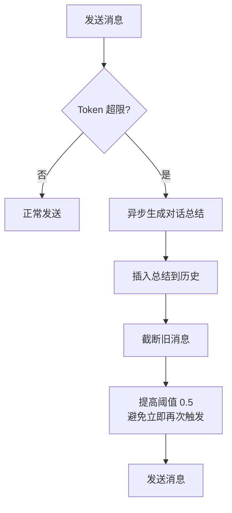
```mermaid
flowchart TD
    Send[发送消息] --> Check{Token 超限?}
    Check -->|否| Normal[正常发送]
    Check -->|是| Summary[异步生成对话总结]
    Summary --> Insert[插入总结到历史]
    Insert --> Trim[截断旧消息]
    Trim --> RaiseThreshold[提高阈值 0.5<br/>避免立即再次触发]
    RaiseThreshold --> Send2[发送消息]
```

### 10.6 系统提示词动态构建

#### 10.6.1 SystemPromptConfig 模板结构

```
系统提示词模板：
    BEGIN_SELF_INTRODUCTION_SECTION     ← 自我介绍（可自定义）
    WORKSPACE_GUIDELINES_SECTION        ← 工作区指引
    TOOL_USAGE_GUIDELINES_SECTION       ← 工具使用说明
    PACKAGE_SYSTEM_GUIDELINES_SECTION   ← 包系统指引
    ACTIVE_PACKAGES_SECTION             ← 激活的工具包
    AVAILABLE_TOOLS_SECTION             ← 可用工具列表
```

#### 10.6.2 动态构建流程

```
getSystemPromptWithCustomPrompts()
    │
    ├──► 1. dispatchSystemPromptComposeHooks(before_compose)
    │
    ├──► 2. getSystemPrompt() — 根据参数动态填充
    │       ├── 根据语言选择中/英文模板
    │       ├── 根据自定义模板覆盖
    │       ├── 读取工作区规则文件
    │       ├── 根据工具模式（CLI/ToolCall API/默认）调整格式
    │       └── 根据视觉/音频/视频能力调整
    │
    ├──► 3. applyCustomPrompts() — 替换自我介绍 Section
    │
    ├──► 4. buildGroupOrchestrationHint() — 群组编排提示
    │
    └──► 5. dispatchSystemPromptComposeHooks(compose/after_compose)
```

### 10.7 角色卡系统

#### 10.7.1 CharacterCard 数据模型

```kotlin
@Entity(tableName = "character_cards")
data class CharacterCard(
    @PrimaryKey val id: String,
    val name: String,
    val characterSetting: String = "",     // 角色设定（引导词）
    val openingStatement: String = "",     // 开场白
    val advancedCustomPrompt: String = "", // 高级自定义引导词
    val chatModelBindingMode: String = FOLLOW_GLOBAL,  // 对话模型绑定模式
    val chatModelConfigId: String? = null, // 固定绑定配置 ID
    val memoryProfileBindingMode: String = FOLLOW_GLOBAL, // 记忆配置绑定
    val toolAccessConfig: CharacterCardToolAccessConfig = ...,  // 工具白名单
    val isDefault: Boolean = false,
)
```

#### 10.7.2 角色卡与对话的集成

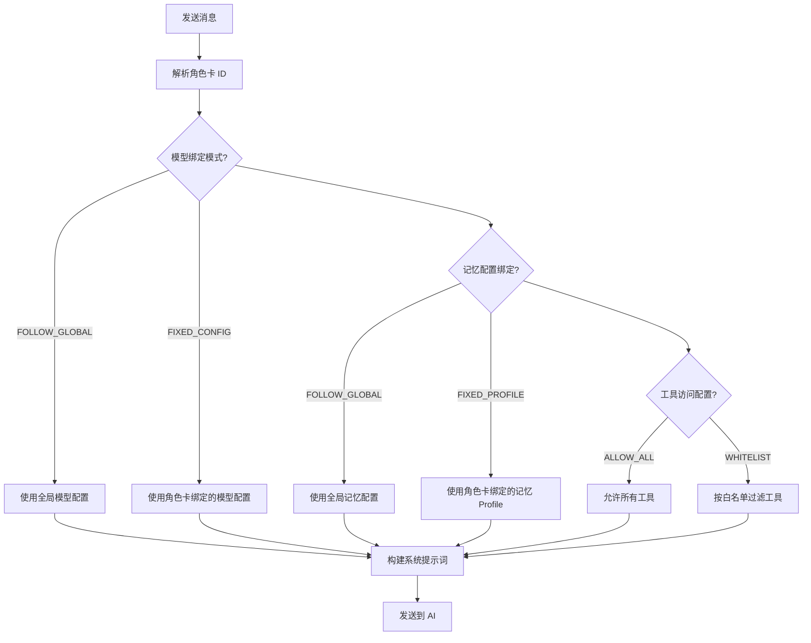
```mermaid
flowchart TD
    Start[发送消息] --> ResolveCard[解析角色卡 ID]
    ResolveCard --> CheckModel{模型绑定模式?}
    CheckModel -->|FOLLOW_GLOBAL| GlobalConfig[使用全局模型配置]
    CheckModel -->|FIXED_CONFIG| CardConfig[使用角色卡绑定的模型配置]

    CheckModel --> CheckMemory{记忆配置绑定?}
    CheckMemory -->|FOLLOW_GLOBAL| GlobalMemory[使用全局记忆配置]
    CheckMemory -->|FIXED_PROFILE| CardMemory[使用角色卡绑定的记忆 Profile]

    CheckMemory --> CheckTool{工具访问配置?}
    CheckTool -->|ALLOW_ALL| AllTools[允许所有工具]
    CheckTool -->|WHITELIST| FilterTools[按白名单过滤工具]

    GlobalConfig --> BuildPrompt[构建系统提示词]
    CardConfig --> BuildPrompt
    GlobalMemory --> BuildPrompt
    CardMemory --> BuildPrompt
    AllTools --> BuildPrompt
    FilterTools --> BuildPrompt
    BuildPrompt --> Send[发送到 AI]
```

#### 10.7.3 群组编排

```
群组编排流程：
    │
    ├──► 1. planResponseOrder() — 规划回答顺序
    │       使用 ROLE_RESPONSE_PLANNER 功能模型
    │
    ├──► 2. 按规划顺序依次调用
    │       for each member in order:
    │           sendMessageInternal(member)
    │           awaitTurnComplete()
    │
    └──► 3. 所有成员完成 → 返回最终结果
```

### 10.8 对话轮次管理

#### 10.8.1 执行上下文隔离

每个 `sendMessage` 调用创建独立的 `MessageExecutionContext`：

```kotlin
private data class MessageExecutionContext(
    val executionId: Int,
    val streamBuffer: StringBuilder = StringBuilder(),
    val roundManager: ConversationRoundManager = ConversationRoundManager(),
    val isConversationActive: AtomicBoolean = AtomicBoolean(true),
    val conversationHistory: MutableList<PromptTurn>,
    val eventChannel: MutableSharedStream<TextStreamEvent>,
)
```

#### 10.8.2 ConversationRoundManager

```kotlin
class ConversationRoundManager {
    private val roundContents = mutableMapOf<Int, String>()  // 轮次号 → 内容
    private val currentResponseRound = AtomicInteger(0)       // 当前轮次

    fun initializeNewConversation()  // 重置所有轮次
    fun updateContent(content)       // 更新当前轮次内容
    fun startNewRound()              // 递增轮次号，开始新轮
    fun getDisplayContent()          // 获取不含轮次分隔符的展示内容
    fun getRawContent()              // 获取含 --- Round N --- 分隔符的原始内容
}
```

#### 10.8.3 轮次切换

```
AI 响应流收集完成
    ↓
提取工具调用 (extractToolInvocations)
    ↓
执行工具
    ↓
roundManager.startNewRound() — 开始新轮次
    ↓
将工具结果加入 conversationHistory
    ↓
再次调用 serviceForFunction.sendMessage() — 发送新请求
    ↓
收集新响应 — 循环直到无工具调用
```

### 10.9 流式处理

#### 10.9.1 流式响应处理

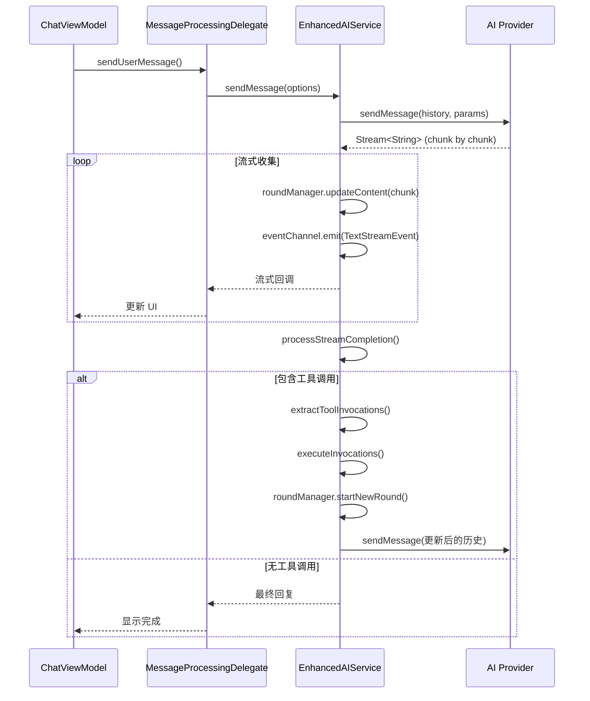
```mermaid
sequenceDiagram
    participant UI as ChatViewModel
    participant MPD as MessageProcessingDelegate
    participant EAS as EnhancedAIService
    participant AI as AI Provider

    UI->>MPD: sendUserMessage()
    MPD->>EAS: sendMessage(options)
    EAS->>AI: sendMessage(history, params)
    AI-->>EAS: Stream<String> (chunk by chunk)

    loop 流式收集
        EAS->>EAS: roundManager.updateContent(chunk)
        EAS->>EAS: eventChannel.emit(TextStreamEvent)
        EAS-->>MPD: 流式回调
        MPD-->>UI: 更新 UI
    end

    EAS->>EAS: processStreamCompletion()
    alt 包含工具调用
        EAS->>EAS: extractToolInvocations()
        EAS->>EAS: executeInvocations()
        EAS->>EAS: roundManager.startNewRound()
        EAS->>AI: sendMessage(更新后的历史)
    else 无工具调用
        EAS-->>MPD: 最终回复
        MPD-->>UI: 显示完成
    end
```

#### 10.9.2 Tool Call API 转换

不同 AI Provider 的工具调用格式统一转换为 XML 标签：

| Provider | 原始格式 | 转换目标 |
|----------|----------|----------|
| OpenAI | `tool_calls` JSON | `<tool name="..."><param>...</param></tool>` |
| Claude | `content_block_start/delta/stop` | `<tool name="..."><param>...</param></tool>` |
| 本地模型 | 文本中的 XML 标签 | 直接使用 |

#### 10.9.3 修订追踪

`TextStreamRevisionTracker` 支持流式输出中的修订（SAVEPOINT/ROLLBACK），用于工具调用时回滚已输出但不完整的内容。

### 10.10 取消与中断机制

取消操作采用**分层传播**策略：

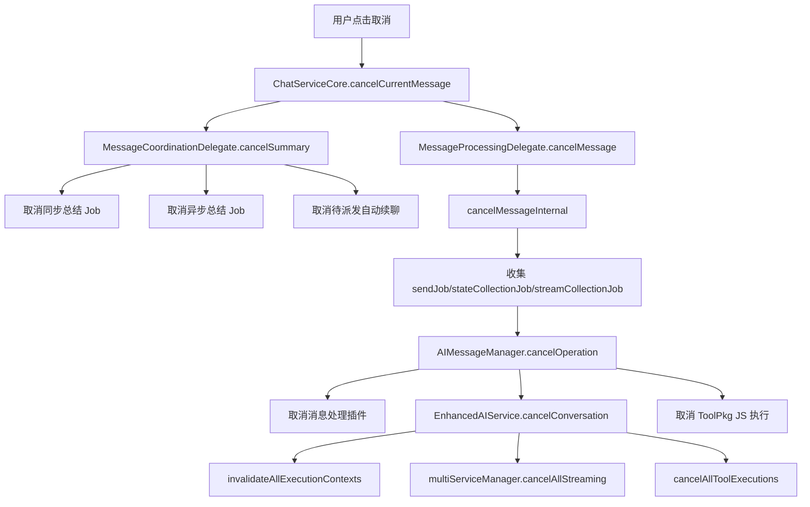
```mermaid
flowchart TD
    User[用户点击取消] --> CSC[ChatServiceCore.cancelCurrentMessage]

    CSC --> MCD[MessageCoordinationDelegate.cancelSummary]
    CSC --> MPD[MessageProcessingDelegate.cancelMessage]

    MCD --> CancelSync[取消同步总结 Job]
    MCD --> CancelAsync[取消异步总结 Job]
    MCD --> CancelAuto[取消待派发自动续聊]

    MPD --> CancelInternal[cancelMessageInternal]
    CancelInternal --> CollectJobs[收集 sendJob/stateCollectionJob/streamCollectionJob]
    CollectJobs --> AMM[AIMessageManager.cancelOperation]

    AMM --> CancelPlugin[取消消息处理插件]
    AMM --> CancelEAS[EnhancedAIService.cancelConversation]
    AMM --> CancelJS[取消 ToolPkg JS 执行]

    CancelEAS --> InvalidateCtx[invalidateAllExecutionContexts]
    CancelEAS --> CancelStream[multiServiceManager.cancelAllStreaming]
    CancelEAS --> CancelTools[cancelAllToolExecutions]
```

### 10.11 完整对话流程图

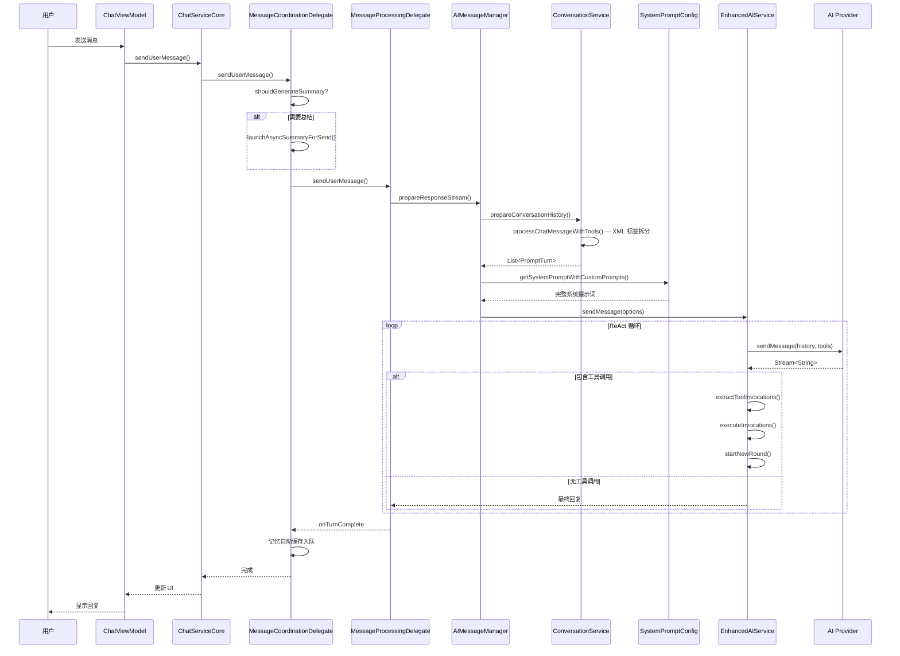
```mermaid
sequenceDiagram
    participant User as 用户
    participant VM as ChatViewModel
    participant CSC as ChatServiceCore
    participant MCD as MessageCoordinationDelegate
    participant MPD as MessageProcessingDelegate
    participant AMM as AIMessageManager
    participant CS as ConversationService
    participant SPC as SystemPromptConfig
    participant EAS as EnhancedAIService
    participant AI as AI Provider

    User->>VM: 发送消息
    VM->>CSC: sendUserMessage()
    CSC->>MCD: sendUserMessage()

    MCD->>MCD: shouldGenerateSummary?
    alt 需要总结
        MCD->>MCD: launchAsyncSummaryForSend()
    end

    MCD->>MPD: sendUserMessage()
    MPD->>AMM: prepareResponseStream()

    AMM->>CS: prepareConversationHistory()
    CS->>CS: processChatMessageWithTools() — XML 标签拆分
    CS-->>AMM: List<PromptTurn>

    AMM->>SPC: getSystemPromptWithCustomPrompts()
    SPC-->>AMM: 完整系统提示词

    AMM->>EAS: sendMessage(options)

    loop ReAct 循环
        EAS->>AI: sendMessage(history, tools)
        AI-->>EAS: Stream<String>

        alt 包含工具调用
            EAS->>EAS: extractToolInvocations()
            EAS->>EAS: executeInvocations()
            EAS->>EAS: startNewRound()
        else 无工具调用
            EAS-->>MPD: 最终回复
        end
    end

    MPD-->>MCD: onTurnComplete
    MCD->>MCD: 记忆自动保存入队
    MCD-->>CSC: 完成
    CSC-->>VM: 更新 UI
    VM-->>User: 显示回复
```

---

## 十一、完整架构图（Mermaid）

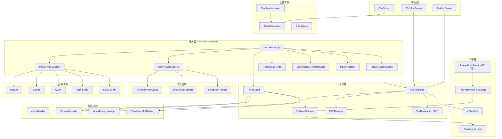
```mermaid
flowchart TB
    subgraph User["用户交互"]
        ChatUI["ChatScreen"]
        ToolboxUI["ToolboxScreen"]
        WorkflowUI["WorkflowScreen"]
    end

    subgraph Session["会话管理"]
        ChatCore["ChatServiceCore"]
        RuntimeHolder["ChatRuntimeHolder"]
        Delegates["6 Delegates"]
    end

    subgraph Orchestrator["编排层 (EnhancedAIService)"]
        SendMsg["sendMessage()"]
        MultiSvc["MultiServiceManager"]
        ConvSvc["ConversationService"]
        ToolExecMgr["ToolExecutionManager"]
        FileBind["FileBindingService"]
        ConvRound["ConversationRoundManager"]
        InputProc["InputProcessor"]
    end

    subgraph Tools["工具层"]
        ToolHandler["AIToolHandler"]
        PkgMgr["PackageManager"]
        PhoneAgent["PhoneAgent"]
        MCPMgr["MCPManager"]
        ToolReg["ToolRegistration (80+)"]
    end

    subgraph Hooks["钩子层"]
        PromptHooks["PromptHookRegistry (7阶段)"]
        ToolHooks["AIToolHook"]
        LifecycleHooks["AppLifecycleHook"]
        ToolPkgBridge["ToolPkgPromptHookBridge"]
    end

    subgraph Prompts["提示词层"]
        SysPrompt["SystemPromptConfig"]
        ToolPrompts["SystemToolPrompts"]
        FuncPrompts["FunctionalPrompts"]
    end

    subgraph Agent["视觉 Agent"]
        ActionHandler["ActionHandler"]
        ShowerCtrl["ShowerController"]
        VirtualDisplay["VirtualDisplayManager"]
        AgentJobs["PhoneAgentJobRegistry"]
    end

    subgraph AI["AI 提供商"]
        OpenAI["OpenAI"]
        Claude["Claude"]
        Qwen["Qwen"]
        MNN["MNN (本地)"]
        Llama["Llama (本地)"]
    end

    ChatUI --> ChatCore
    ToolboxUI --> ToolHandler
    WorkflowUI --> ToolHandler

    ChatCore --> SendMsg
    RuntimeHolder --> ChatCore

    SendMsg --> MultiSvc
    SendMsg --> ConvSvc
    SendMsg --> ToolExecMgr
    SendMsg --> FileBind
    SendMsg --> ConvRound
    SendMsg --> InputProc

    ToolExecMgr --> ToolHandler
    ToolHandler --> PkgMgr
    ToolHandler --> MCPMgr
    ToolHandler --> ToolReg

    ConvSvc --> SysPrompt
    ConvSvc --> ToolPrompts
    ConvSvc --> FuncPrompts

    PromptHooks --> ToolPkgBridge
    ToolPkgBridge --> PkgMgr

    SendMsg --> PhoneAgent
    PhoneAgent --> ActionHandler
    PhoneAgent --> ShowerCtrl
    PhoneAgent --> VirtualDisplay
    PhoneAgent --> AgentJobs

    MultiSvc --> OpenAI
    MultiSvc --> Claude
    MultiSvc --> Qwen
    MultiSvc --> MNN
    MultiSvc --> Llama

    ToolHandler --> ToolHooks
    PkgMgr --> LifecycleHooks
```

---

## 十、ReAct 循环完整流程图

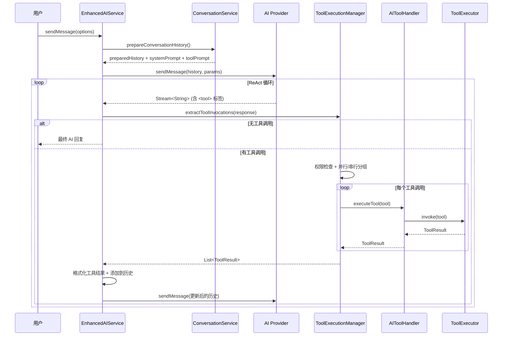
```mermaid
sequenceDiagram
    participant User as 用户
    participant EAS as EnhancedAIService
    participant Conv as ConversationService
    participant AI as AI Provider
    participant TEM as ToolExecutionManager
    participant TH as AIToolHandler
    participant Tool as ToolExecutor

    User->>EAS: sendMessage(options)
    EAS->>Conv: prepareConversationHistory()
    Conv-->>EAS: preparedHistory + systemPrompt + toolPrompt
    EAS->>AI: sendMessage(history, params)
    
    loop ReAct 循环
        AI-->>EAS: Stream<String> (含 <tool> 标签)
        EAS->>TEM: extractToolInvocations(response)
        
        alt 无工具调用
            EAS-->>User: 最终 AI 回复
        else 有工具调用
            TEM->>TEM: 权限检查 + 并行/串行分组
            loop 每个工具调用
                TEM->>TH: executeTool(tool)
                TH->>Tool: invoke(tool)
                Tool-->>TH: ToolResult
                TH-->>TEM: ToolResult
            end
            TEM-->>EAS: List<ToolResult>
            EAS->>EAS: 格式化工具结果 + 添加到历史
            EAS->>AI: sendMessage(更新后的历史)
        end
    end
```

---

## 十一、PhoneAgent 执行流程图

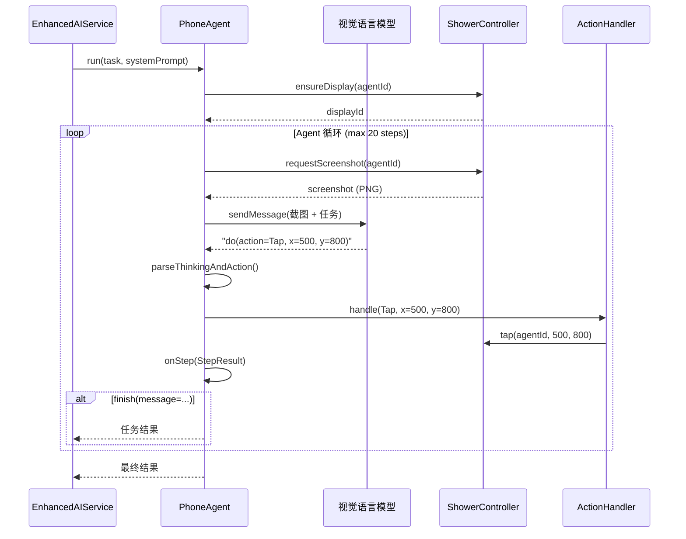
```mermaid
sequenceDiagram
    participant AI as EnhancedAIService
    participant PA as PhoneAgent
    participant VLM as 视觉语言模型
    participant SC as ShowerController
    participant AH as ActionHandler

    AI->>PA: run(task, systemPrompt)
    PA->>SC: ensureDisplay(agentId)
    SC-->>PA: displayId

    loop Agent 循环 (max 20 steps)
        PA->>SC: requestScreenshot(agentId)
        SC-->>PA: screenshot (PNG)
        PA->>VLM: sendMessage(截图 + 任务)
        VLM-->>PA: "do(action=Tap, x=500, y=800)"
        PA->>PA: parseThinkingAndAction()
        PA->>AH: handle(Tap, x=500, y=800)
        AH->>SC: tap(agentId, 500, 800)
        PA->>PA: onStep(StepResult)

        alt finish(message=...)
            PA-->>AI: 任务结果
        end
    end

    PA-->>AI: 最终结果
```

---

## 十二、关键文件路径索引

| 文件 | 路径 | 职责 |
|------|------|------|
| EnhancedAIService.kt | `api/chat/EnhancedAIService.kt` | 核心编排器 |
| ChatRuntimeHolder.kt | `api/chat/ChatRuntimeHolder.kt` | 运行时槽位管理 |
| ChatRuntimeSlot.kt | `api/chat/ChatRuntimeSlot.kt` | MAIN/FLOATING 枚举 |
| MultiServiceManager.kt | `api/chat/enhance/MultiServiceManager.kt` | 多模型功能路由 |
| ConversationService.kt | `api/chat/enhance/ConversationService.kt` | 对话管理 |
| ToolExecutionManager.kt | `api/chat/enhance/ToolExecutionManager.kt` | 工具执行管理 |
| FileBindingService.kt | `api/chat/enhance/FileBindingService.kt` | 文件绑定 |
| ConversationRoundManager.kt | `api/chat/enhance/ConversationRoundManager.kt` | 轮次管理 |
| InputProcessor.kt | `api/chat/enhance/InputProcessor.kt` | 输入处理 |
| AIToolHandler.kt | `core/tools/AIToolHandler.kt` | 工具注册/执行/自动激活路由 |
| AIToolHook.kt | `core/tools/AIToolHook.kt` | 工具生命周期钩子 |
| ToolRegistration.kt | `core/tools/ToolRegistration.kt` | 80+ 工具注册（含 SubAgent） |
| PhoneAgent.kt | `core/tools/agent/PhoneAgent.kt` | 视觉 UI Agent |
| ShowerController.kt | `core/tools/agent/ShowerController.kt` | 虚拟屏控制 |
| MCPToolExecutor.kt | `core/tools/mcp/MCPToolExecutor.kt` | MCP 工具执行与路由 |
| MCPRepository.kt | `data/mcp/MCPRepository.kt` | MCP 插件注册管理 |
| PackageManager.kt | `core/tools/packTool/PackageManager.kt` | 包管理器（激活/注册/注销） |
| JsTools.kt | `core/tools/javascript/JsTools.kt` | JS 工具桥接层（SubAgent 定义） |
| JsToolManager.kt | `core/tools/javascript/JsToolManager.kt` | JS 工具名解析 |
| CliToolModeSupport.kt | `core/tools/climode/CliToolModeSupport.kt` | CLI 模式 search+proxy |
| PromptHookRegistry.kt | `core/chat/hooks/PromptHookRegistry.kt` | 7 阶段提示钩子 |
| SystemPromptConfig.kt | `core/config/SystemPromptConfig.kt` | 系统提示词 |
| SystemToolPrompts.kt | `core/config/SystemToolPrompts.kt` | 工具分类与提示词 |
| SystemToolPromptsInternal.kt | `core/config/SystemToolPromptsInternal.kt` | 内部工具提示词 |
| FunctionalPrompts.kt | `core/config/FunctionalPrompts.kt` | 功能提示词（UI_CONTROLLER 等） |
| FunctionType.kt | `data/model/FunctionType.kt` | 功能类型枚举（10 种） |
| ChatMarkupRegex.kt | `util/ChatMarkupRegex.kt` | 工具调用正则匹配 |

---

*文档生成时间: 2026-05-14*
*基于 Operit AI 项目代码深度分析*
*意图路由机制章节参考：Operit Agent 意图路由机制详解.md*
