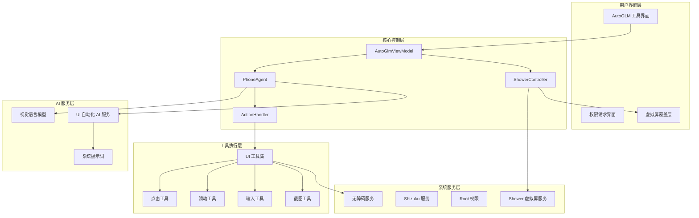
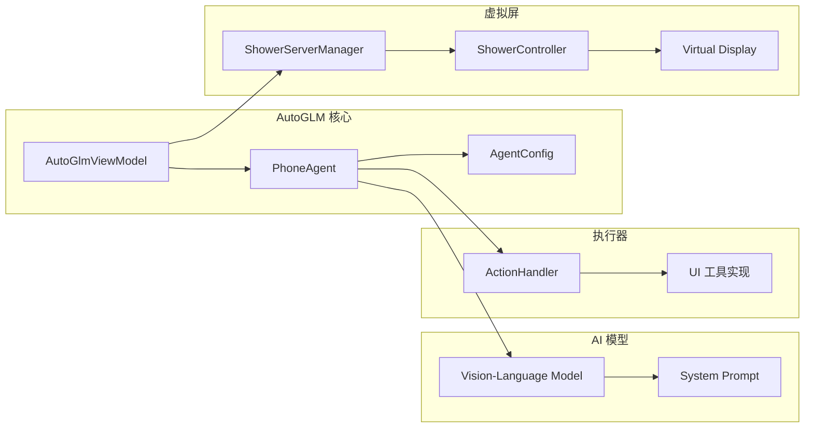
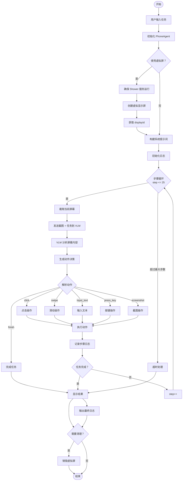
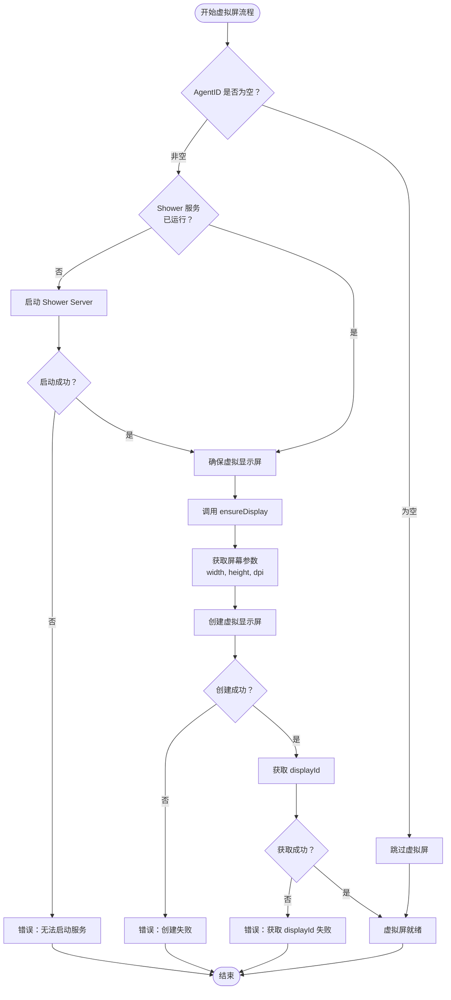
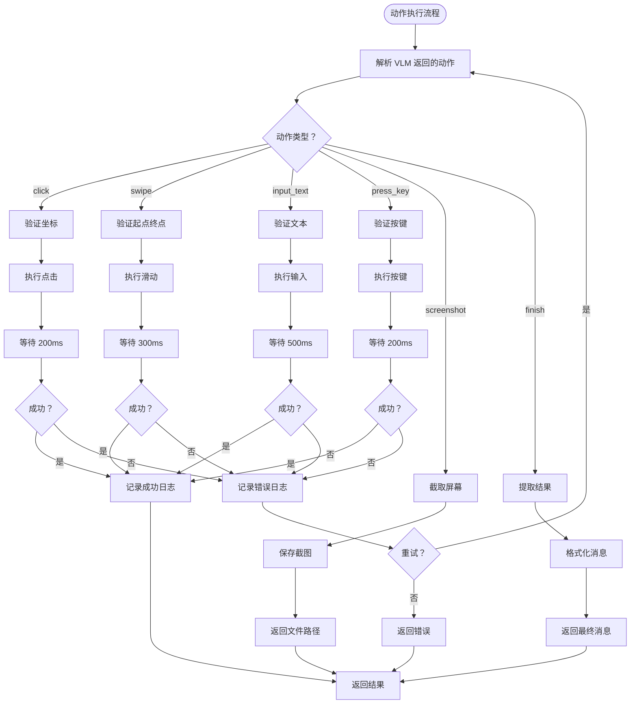
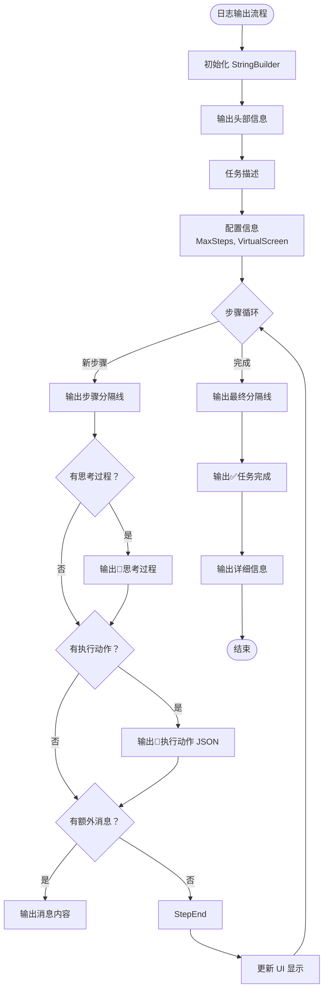
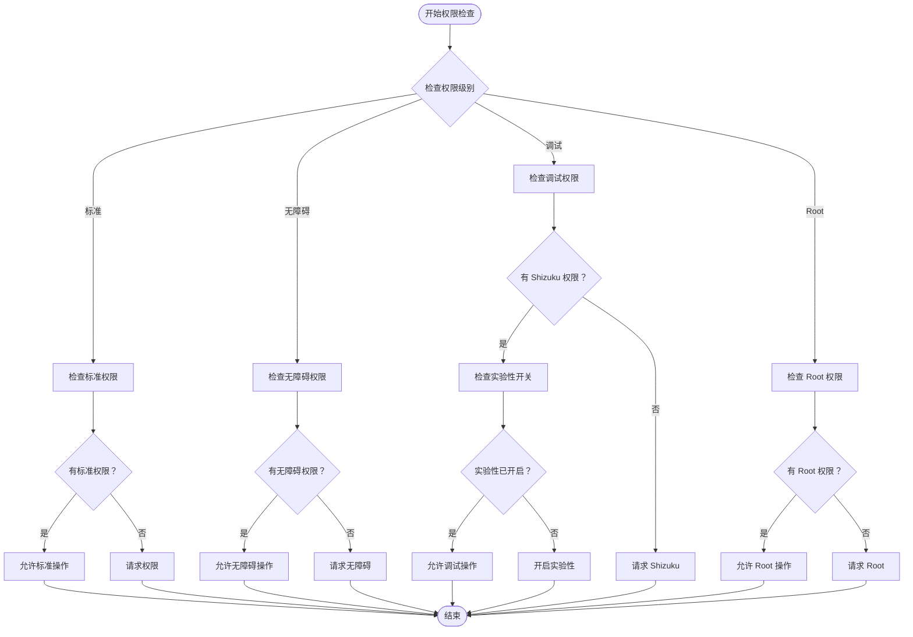
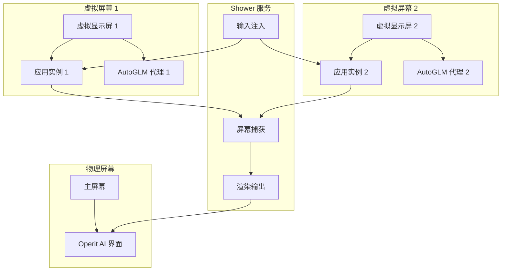

# Operit AI AutoGLM 功能详解

> AutoGLM（Automatic GLM）是 Operit AI 提供的**UI 自动化代理功能**，通过 AI 模型理解屏幕内容并自动执行操作，完成用户指定的复杂任务。

**核心特性**：
- ✅ AI 驱动的 UI 自动化
- ✅ 视觉语言模型理解屏幕
- ✅ 支持虚拟屏并行执行
- ✅ 实时日志和进度显示
- ✅ 多步骤任务自动规划

---

## 目录

1. [功能概述](#1-功能概述)
2. [系统架构](#2-系统架构)
3. [本地配置模型](#3-本地配置模型)
4. [工作流程](#4-工作流程)
5. [详细流程图](#5-详细流程图)
6. [使用指南](#6-使用指南)
7. [核心组件](#7-核心组件)
8. [权限要求](#8-权限要求)
9. [虚拟屏支持](#9-虚拟屏支持)
10. [日志格式](#10-日志格式)
11. [故障排查](#11-故障排查)
12. [高级配置](#12-高级配置)

---

## 1. 功能概述

### 1.1 什么是 AutoGLM

**AutoGLM**（Automatic GLM）是一个基于 AI 的 UI 自动化代理系统，能够：

1. **理解用户意图**：接收自然语言任务描述
2. **分析屏幕内容**：使用视觉语言模型（VLM）理解当前界面
3. **规划执行步骤**：自动分解任务为多个操作步骤
4. **执行 UI 操作**：点击、滑动、输入文本、截图等
5. **实时反馈进度**：显示思考过程和执行日志

### 1.2 应用场景

#### 日常任务自动化
- "打开微信，给张三发消息说晚上一起吃饭"
- "打开支付宝，查看我的余额宝收益"
- "打开抖音，点赞最新的视频"

#### 复杂操作流程
- "帮我预订明天北京到上海的机票"
- "在淘宝上搜索 iPhone 15，按价格排序，找到最便宜的"
- "打开美团，点一份肯德基外卖送到公司"

#### 批量操作
- "把所有未读微信消息标记为已读"
- "清理手机中所有截图"
- "备份所有聊天记录到云盘"

### 1.3 技术特点

| 特性 | 说明 |
|------|------|
| **AI 驱动** | 使用 VLM（Vision-Language Model）理解屏幕 |
| **多步骤规划** | 自动分解复杂任务为可执行步骤 |
| **实时反馈** | 显示思考过程、执行动作、结果状态 |
| **虚拟屏支持** | 支持并行执行多个代理任务 |
| **权限分级** | 标准/无障碍/调试/Root 多级别支持 |
| **流式输出** | 边思考边输出，类似人类思考过程 |

---

## 2. 系统架构

### 2.1 整体架构图



### 2.2 组件关系图



---

## 3. 本地配置模型

### 3.1 模型选择

AutoGLM 功能**不直接使用本地模型**，而是通过以下方式配置：

#### 方式 A：使用在线模型（默认）

**配置的模型**：
- **UI 控制器专用模型**（FunctionType.UI_CONTROLLER）
- 通常是**视觉语言模型**（VLM）
- 支持图片理解和 UI 元素识别

**配置方法**：
1. 打开 **设置** → **模型管理**
2. 选择 **UI 控制器模型**
3. 选择在线模型：
   - GPT-4V
   - Qwen-VL
   - Gemini Pro Vision
   - 其他 VLM 模型

#### 方式 B：使用本地 VLM 模型（高级）

**支持的本地模型**：
- **Qwen-VL**（通义千问视觉版）
- **LLaVA**（Large Language-and-Vision Assistant）
- **CogVLM**（智谱视觉语言模型）

**配置步骤**：

1. **下载本地 VLM 模型**
   ```bash
   # 示例：下载 Qwen-VL
   huggingface-cli download Qwen/Qwen-VL-Chat-GGUF \
     qwen-vl-chat-q4_k_m.gguf \
     --local-dir ./models
   ```

2. **传输到手机**
   ```bash
   adb push qwen-vl-chat-q4_k_m.gguf \
     /sdcard/Download/Operit/models/
   ```

3. **在 Operit AI 中配置**
   - 打开 **设置** → **模型管理** → **本地模型**
   - 点击 **"+"** 添加模型
   - 选择 `.gguf` 文件
   - 填写信息：
     ```
     名称：Qwen-VL-Chat
     描述：通义千问视觉语言模型
     上下文长度：4096
     推理引擎：Llama.cpp
     ```

4. **设置为 UI 控制器模型**
   - 设置 → 模型管理
   - 找到 Qwen-VL-Chat
   - 点击菜单 → **设为 UI 控制器模型**

### 3.2 模型配置参数

#### 基础配置

| 参数 | 说明 | 推荐值 |
|------|------|--------|
| **模型类型** | UI 控制器模型 | VLM（视觉语言模型） |
| **上下文长度** | 最大上下文窗口 | 4096 |
| **最大输出长度** | 单次响应最大 token 数 | 1024 |

#### 高级配置

| 参数 | 说明 | 推荐值 |
|------|------|--------|
| **Temperature** | 随机性 | 0.7 |
| **Top P** | 核采样阈值 | 0.9 |
| **Top K** | 候选词数量 | 40 |
| **重复惩罚** | 防止重复 | 1.1 |

### 3.3 模型性能要求

| 模型类型 | 最小内存 | 推荐内存 | 推理速度 |
|----------|----------|----------|----------|
| **在线 VLM** | 无要求 | 无要求 | 快（云端） |
| **本地 3B VLM** | 3 GB | 4 GB | 中等 |
| **本地 7B VLM** | 5 GB | 8 GB | 较慢 |
| **本地 13B VLM** | 9 GB | 12 GB | 慢 |

**推荐**：使用在线 VLM 模型（速度快、准确性高）

---

## 4. 工作流程

### 4.1 任务执行流程

```
1. 用户输入任务
   ↓
2. 初始化代理（PhoneAgent）
   ↓
3. 构建系统提示词（System Prompt）
   ↓
4. 启动虚拟屏（可选）
   ↓
5. 进入主循环（最多 25 步）
   │
   ├─ 5.1 截取当前屏幕
   ├─ 5.2 发送图片 + 任务到 VLM
   ├─ 5.3 VLM 分析并返回动作
   ├─ 5.4 解析动作（点击/滑动/输入等）
   ├─ 5.5 执行动作
   ├─ 5.6 记录日志和进度
   ├─ 5.7 检查是否完成
   │    ├─ 完成 → 退出循环
   │    └─ 未完成 → 继续下一步
   │
6. 输出最终结果
   ↓
7. 清理资源（可选）
```

### 4.2 单步骤详细流程

```
步骤 N：
├─ 输入：当前屏幕截图 + 任务描述 + 历史上下文
├─ 处理：VLM 分析 → 生成动作决策
├─ 输出：JSON 格式动作
│   {
│     "action": "click",
│     "x": 540,
│     "y": 960,
│     "description": "点击'发送'按钮"
│   }
├─ 执行：ActionHandler 执行动作
├─ 验证：检查动作是否成功
└─ 反馈：更新日志和进度
```

---

## 5. 详细流程图

### 5.1 完整执行流程图



### 5.2 虚拟屏创建流程图



### 5.3 动作执行流程图



### 5.4 日志输出流程图



---

## 6. 使用指南

### 6.1 快速开始

#### 步骤 1：打开 AutoGLM 工具

1. 打开 **Operit AI** App
2. 进入 **工具箱**
3. 找到 **AutoGLM** 或 **UI 自动化**
4. 点击进入

#### 步骤 2：配置参数

**输入任务**：
```
打开微信，给张三发消息说晚上一起吃饭
```

**虚拟屏选项**：
- ✅ 使用虚拟屏（并行执行，不干扰当前操作）
- ❌ 不使用虚拟屏（在当前屏幕执行）

#### 步骤 3：执行任务

1. 点击 **Execute** 按钮
2. 等待任务执行
3. 查看实时日志
4. 任务完成后查看结果

### 6.2 示例任务

#### 示例 1：发送微信消息

**任务**：
```
打开微信，找到"张三"，发送消息"晚上 7 点老地方见"
```

**执行过程**：
```
[16:30:15] ==================================================
[16:30:15] Task: 打开微信，找到"张三"，发送消息"晚上 7 点老地方见"
[16:30:15] Max Steps: 25
[16:30:15] Use Virtual Screen: false
[16:30:15] ==================================================

[16:30:16] ==================================================
[16:30:16] 💭 思考过程:
[16:30:16] --------------------------------------------------
[16:30:16] 用户想要发送微信消息给张三。我需要：
[16:30:16] 1. 打开微信应用
[16:30:16] 2. 找到聊天列表中的张三
[16:30:16] 3. 点击进入聊天
[16:30:16] 4. 输入消息并发送
[16:30:16] 首先，我需要找到微信图标并点击。
[16:30:16] --------------------------------------------------
[16:30:16] 🎯 执行动作:
[16:30:16] {
[16:30:16]   "action": "click",
[16:30:16]   "x": 540,
[16:30:16]   "y": 1200,
[16:30:16]   "description": "点击微信图标"
[16:30:16] }
[16:30:16] ==================================================

[16:30:17] ==================================================
[16:30:17] 💭 思考过程:
[16:30:17] --------------------------------------------------
[16:30:17] 微信已打开，现在需要在聊天列表中找到张三。
[16:30:17] 我看到聊天列表中有"张三"，需要点击进入。
[16:30:17] --------------------------------------------------
[16:30:17] 🎯 执行动作:
[16:30:17] {
[16:30:17]   "action": "click",
[16:30:17]   "x": 320,
[16:30:17]   "y": 450,
[16:30:17]   "description": "点击张三的聊天"
[16:30:17] }
[16:30:17] ==================================================

[16:30:18] ==================================================
[16:30:18] 💭 思考过程:
[16:30:18] --------------------------------------------------
[16:30:18] 已进入与张三的聊天界面。
[16:30:18] 现在需要点击输入框，输入消息内容。
[16:30:18] --------------------------------------------------
[16:30:18] 🎯 执行动作:
[16:30:18] {
[16:30:18]   "action": "input_text",
[16:30:18]   "text": "晚上 7 点老地方见",
[16:30:18]   "description": "输入消息内容"
[16:30:18] }
[16:30:18] ==================================================

[16:30:19] ==================================================
[16:30:19] 💭 思考过程:
[16:30:19] --------------------------------------------------
[16:30:19] 消息已输入，现在需要点击发送按钮。
[16:30:19] 发送按钮通常在右下角，是绿色的。
[16:30:19] --------------------------------------------------
[16:30:19] 🎯 执行动作:
[16:30:19] {
[16:30:19]   "action": "click",
[16:30:19]   "x": 920,
[16:30:19]   "y": 1600,
[16:30:19]   "description": "点击发送按钮"
[16:30:19] }
[16:30:19] ==================================================

[16:30:20] 🎉 ==================================================
[16:30:20] ✅ 任务完成：消息已发送给张三
[16:30:20] ✅ 共执行 4 个步骤
[16:30:20] ✅ 耗时：5 秒
```

#### 示例 2：淘宝购物

**任务**：
```
打开淘宝，搜索"iPhone 15"，按价格从低到高排序，找到最便宜的加入购物车
```

#### 示例 3：清理手机

**任务**：
```
打开文件管理器，找到所有截图文件，删除它们
```

### 6.3 最佳实践

#### 任务描述技巧

1. **明确具体**：
   - ✅ "打开微信，给张三发消息"
   - ❌ "发个消息"

2. **分步骤描述**：
   - ✅ "打开支付宝 → 点击余额宝 → 查看收益"
   - ❌ "看看我的收益"

3. **提供关键信息**：
   - ✅ "打开美团，搜索'肯德基'，点第一个店铺"
   - ❌ "点个外卖"

#### 虚拟屏使用场景

**使用虚拟屏**：
- 并行执行多个任务
- 不干扰当前操作
- 后台自动化

**不使用虚拟屏**：
- 简单快速任务
- 需要在当前屏幕操作
- 调试和测试

---

## 7. 核心组件

### 7.1 AutoGlmViewModel

**职责**：
- 管理 UI 状态
- 协调整个执行流程
- 处理用户输入
- 更新日志显示

**关键方法**：
```kotlin
// 执行任务
fun executeTask(task: String, useVirtualScreen: Boolean)

// 取消任务
fun cancelTask()

// 构建系统提示词
private fun buildUiAutomationSystemPrompt(): String

// 记录步骤日志
private fun appendStepLog(builder: StringBuilder, stepIndex: Int, stepResult: StepResult)
```

### 7.2 PhoneAgent

**职责**：
- AI 代理核心逻辑
- 与 VLM 交互
- 步骤规划和执行
- 上下文管理

**关键属性**：
```kotlin
val config: AgentConfig          // 代理配置
val uiService: AIService         // AI 服务
val actionHandler: ActionHandler // 动作处理器
val agentId: String              // 代理 ID
val stepCount: Int               // 步骤计数
```

**关键方法**：
```kotlin
// 运行代理
suspend fun run(
    task: String,
    systemPrompt: String,
    onStep: (StepResult) -> Unit,
    isPausedFlow: StateFlow<Boolean>
): String
```

### 7.3 ActionHandler

**职责**：
- 解析 VLM 返回的动作
- 执行具体的 UI 操作
- 验证动作结果

**支持的动作类型**：
- `click` - 点击
- `swipe` - 滑动
- `input_text` - 输入文本
- `press_key` - 按键
- `screenshot` - 截图
- `finish` - 完成任务

### 7.4 ShowerController

**职责**：
- 管理虚拟显示屏
- 控制屏幕投射
- 处理输入事件

**关键方法**：
```kotlin
// 确保服务运行
fun ensureServerStarted(context: Context): Boolean

// 确保显示屏存在
fun ensureDisplay(agentId: String, context: Context, width: Int, height: Int, dpi: Int): Boolean

// 获取显示屏 ID
fun getDisplayId(agentId: String): Int?

// 获取视频流
fun getVideoStream(agentId: String): Flow<Bitmap>
```

---

## 8. 权限要求

### 8.1 权限级别

AutoGLM 支持多种权限级别：

| 权限级别 | 功能 | 要求 |
|----------|------|------|
| **标准** | 基础 UI 操作 | 普通授权 |
| **无障碍** | 完整 UI 自动化 | 无障碍服务授权 |
| **调试** | 虚拟屏支持 | Shizuku + 实验性功能 |
| **Root** | 系统级操作 | Root 授权 |

### 8.2 权限检查流程



### 8.3 权限获取方法

#### 无障碍权限

1. 打开 **设置** → **无障碍**
2. 找到 **Operit AI**
3. 开启开关
4. 确认授权

#### Shizuku 权限

1. 安装 **Shizuku** App
2. 启动 Shizuku（无线调试或 ADB）
3. 打开 **Operit AI**
4. 授予 Shizuku 权限

#### Root 权限

1. 确保手机已 Root
2. 打开 **Magisk**
3. 找到 **Operit AI**
4. 授予 Root 权限

---

## 9. 虚拟屏支持

### 9.1 什么是虚拟屏

**虚拟屏**（Virtual Display）是 Android 系统提供的多显示屏功能，允许：

- 创建多个独立的显示屏
- 每个显示屏运行不同的应用
- 并行执行多个任务
- 不干扰主屏幕操作

### 9.2 虚拟屏工作原理



### 9.3 虚拟屏配置

#### 前提条件

- ✅ Android 10+
- ✅ 解锁 Bootloader
- ✅ Shizuku 已安装并授权
- ✅ 开启实验性功能

#### 开启实验性功能

1. 打开 **设置** → **高级设置**
2. 找到 **实验性虚拟屏**
3. 开启开关
4. 重启 App

#### 使用虚拟屏

```kotlin
// 在 AutoGLM 中
useVirtualScreen = true  // 启用虚拟屏
```

### 9.4 虚拟屏优势

| 优势 | 说明 |
|------|------|
| **并行执行** | 同时运行多个代理任务 |
| **互不干扰** | 不影响主屏幕操作 |
| **独立实例** | 每个虚拟屏独立的应用实例 |
| **后台运行** | 可以在后台执行任务 |
| **资源隔离** | 每个虚拟屏独立的资源管理 |

### 9.5 虚拟屏限制

| 限制 | 说明 |
|------|------|
| **性能开销** | 每个虚拟屏占用额外内存和 CPU |
| **兼容性** | 部分应用不支持虚拟屏 |
| **权限要求** | 需要 Shizuku 和实验性权限 |
| **系统限制** | Android 10+ 才支持 |

---

## 10. 日志格式

### 10.1 日志结构

```
[HH:MM:SS] ==================================================
[HH:MM:SS] Task: {任务描述}
[HH:MM:SS] Max Steps: {最大步数}
[HH:MM:SS] Use Virtual Screen: {true/false}
[HH:MM:SS] ==================================================

[HH:MM:SS] ==================================================
[HH:MM:SS] 💭 思考过程:
[HH:MM:SS] --------------------------------------------------
[HH:MM:SS] {思考内容}
[HH:MM:SS] --------------------------------------------------
[HH:MM:SS] 🎯 执行动作:
[HH:MM:SS] {
[HH:MM:SS]   "action": "{动作类型}",
[HH:MM:SS]   "x": {x 坐标},
[HH:MM:SS]   "y": {y 坐标},
[HH:MM:SS]   "description": "{动作描述}"
[HH:MM:SS] }
[HH:MM:SS] ==================================================

...（更多步骤）

[HH:MM:SS] 🎉 ==================================================
[HH:MM:SS] ✅ 任务完成：{完成消息}
[HH:MM:SS] ✅ 共执行 {N} 个步骤
[HH:MM:SS] ✅ 耗时：{X} 秒
```

### 10.2 日志符号说明

| 符号 | 含义 |
|------|------|
| 💭 | 思考过程 |
| 🎯 | 执行动作 |
| 🎉 | 任务完成 |
| ✅ | 成功状态 |
| ❌ | 失败状态 |
| ⚠️ | 警告信息 |
| ℹ️ | 提示信息 |

### 10.3 日志级别

| 级别 | 说明 | 示例 |
|------|------|------|
| **INFO** | 信息 | 任务开始、步骤执行 |
| **DEBUG** | 调试 | 详细参数、中间状态 |
| **WARN** | 警告 | 重试、性能问题 |
| **ERROR** | 错误 | 执行失败、异常 |

---

## 11. 故障排查

### 11.1 常见问题

#### 问题 A：任务执行失败

**症状**：
- 执行几步后失败
- 提示"无法完成操作"

**可能原因**：
1. 权限不足
2. 应用不兼容
3. 屏幕内容复杂
4. 网络问题（在线模型）

**解决方案**：
```bash
# 1. 检查权限
设置 → 应用管理 → Operit AI → 权限 → 确保已授权

# 2. 检查无障碍服务
设置 → 无障碍 → Operit AI → 开启

# 3. 检查网络连接
确保网络畅通（使用在线模型时）

# 4. 查看日志
adb logcat | grep -i "autoglm\|phoneagent"
```

#### 问题 B：虚拟屏创建失败

**症状**：
- 提示"无法创建虚拟屏"
- Shower 服务启动失败

**解决方案**：
```bash
# 1. 检查 Shizuku 是否运行
adb shell sh /sdcard/Android/data/moe.shizuku.privileged.api/start.sh

# 2. 检查实验性开关
设置 → 高级设置 → 实验性虚拟屏 → 开启

# 3. 重启 Shower 服务
设置 → 开发者选项 → 重启 Shower 服务

# 4. 查看日志
adb logcat | grep -i "shower\|virtualdisplay"
```

#### 问题 C：执行速度过慢

**症状**：
- 每步耗时 > 5 秒
- 总执行时间过长

**解决方案**：
1. **降低模型复杂度**
   - 使用更快的模型
   - 减少上下文长度

2. **优化任务描述**
   - 更具体的描述
   - 减少歧义

3. **减少最大步数**
   - 设置 → AutoGLM → 最大步数 → 15

4. **使用本地模型**
   - 减少网络延迟

### 11.2 日志分析

#### 查看日志

```bash
# 实时查看
adb logcat | grep -i "autoglm"

# 保存日志
adb logcat -d > autoglm_log.txt

# 过滤特定级别
adb logcat | grep -E "AutoGlm|PhoneAgent|ActionHandler"
```

#### 常见错误代码

| 错误代码 | 含义 | 解决方案 |
|----------|------|----------|
| `ERR_PERMISSION_DENIED` | 权限被拒绝 | 重新授权 |
| `ERR_ACCESSIBILITY_NOT_ENABLED` | 无障碍未开启 | 开启无障碍 |
| `ERR_SHOWER_SERVER_FAILED` | Shower 服务失败 | 重启服务 |
| `ERR_VIRTUAL_DISPLAY_CREATE_FAILED` | 虚拟屏创建失败 | 检查权限和配置 |
| `ERR_VLM_TIMEOUT` | VLM 响应超时 | 检查网络或换模型 |
| `ERR_ACTION_EXECUTION_FAILED` | 动作执行失败 | 检查坐标和应用状态 |
| `ERR_MAX_STEPS_EXCEEDED` | 超过最大步数 | 增加最大步数或优化任务 |

---

## 12. 高级配置

### 12.1 自定义系统提示词

**位置**：
```
设置 → 高级设置 → 自定义提示词 → AutoGLM
```

**默认提示词**：
```
你是一个智能 UI 自动化助手，帮助用户完成手机上的各种任务。

当前日期：{formattedDate}

你可以执行以下动作：
- click: 点击屏幕上的某个位置
- swipe: 滑动屏幕
- input_text: 输入文本
- press_key: 按下物理按键（返回、主页等）
- screenshot: 截取当前屏幕
- finish: 完成任务

请分析当前屏幕内容，决定下一步动作。
```

**自定义提示词示例**：
```
你是一个专业的手机自动化专家。

任务要求：
1. 优先使用点击操作
2. 避免不必要的滑动
3. 输入文本时确保输入法正确
4. 每步操作后等待 500ms

当前日期：{formattedDate}
```

### 12.2 调整最大步数

**默认值**：25 步

**调整方法**：
1. 设置 → AutoGLM → 最大步数
2. 输入新值（1-50）

**推荐值**：
- 简单任务：10-15 步
- 中等任务：15-25 步
- 复杂任务：25-35 步

### 12.3 配置动作延迟

**默认延迟**：
- 点击：200ms
- 滑动：300ms
- 输入：500ms
- 按键：200ms

**调整方法**：
```kotlin
// 在 ActionHandler 中配置
val actionHandler = ActionHandler(
    context = context,
    screenWidth = width,
    screenHeight = height,
    clickDelay = 200L,
    swipeDelay = 300L,
    inputDelay = 500L,
    keyDelay = 200L
)
```

### 12.4 使用暂停功能

**暂停功能**允许在执行过程中暂停代理：

```kotlin
val pausedState = MutableStateFlow(false)

// 暂停
pausedState.value = true

// 继续
pausedState.value = false

// 在 run 方法中使用
agent.run(
    task = task,
    systemPrompt = systemPrompt,
    onStep = onStep,
    isPausedFlow = pausedState
)
```

---

## 总结

### AutoGLM 核心流程

```
1. 用户输入任务
   ↓
2. 配置模型和参数
   ↓
3. 初始化代理（PhoneAgent）
   ↓
4. 构建系统提示词
   ↓
5. （可选）创建虚拟屏
   ↓
6. 进入主循环（最多 25 步）
   │
   ├─ 截图 → VLM 分析 → 生成动作 → 执行 → 记录日志
   │
7. 任务完成或超时
   ↓
8. 输出结果和日志
   ↓
9. （可选）清理虚拟屏
```

### 关键配置项

| 配置项 | 位置 | 推荐值 |
|--------|------|--------|
| **UI 控制器模型** | 设置 → 模型管理 | GPT-4V / Qwen-VL |
| **最大步数** | AutoGLM 设置 | 25 |
| **虚拟屏** | 执行选项 | 按需开启 |
| **权限级别** | 权限设置 | 无障碍/调试 |

### 最佳实践

1. **任务描述**：具体、明确、分步骤
2. **模型选择**：在线 VLM（速度快、准确）
3. **权限配置**：至少无障碍，推荐调试
4. **虚拟屏**：并行任务时使用
5. **日志分析**：定期检查，优化配置

---

**文档版本**：v1.0  
**最后更新**：2026-05-12  
**维护者**：Operit AI Team  
**参考文档**：
- [工具系统设计思想与详细流程分析](file:///home/meizu/Documents/my_agent_projects/Operit/my_docs/工具系统设计思想与详细流程分析.md)
- [Operit AI 本地模型运行使用指南](file:///home/meizu/Documents/my_agent_projects/Operit/my_docs/Operit AI 本地模型运行使用指南.md)
