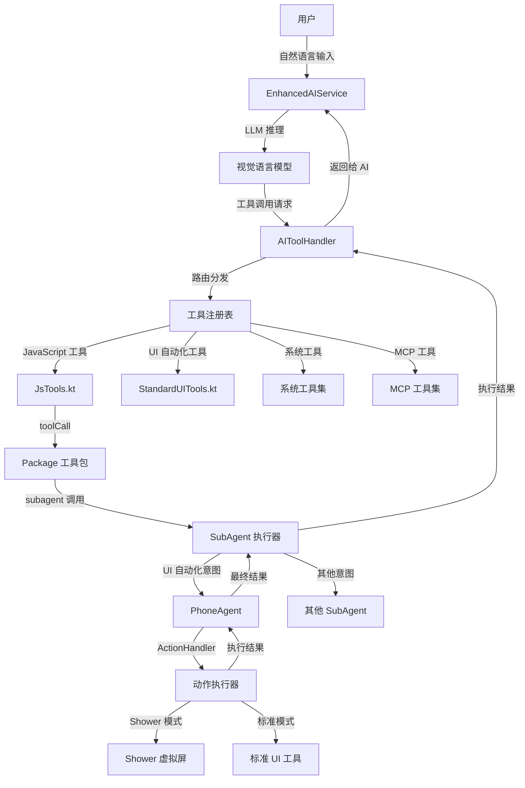
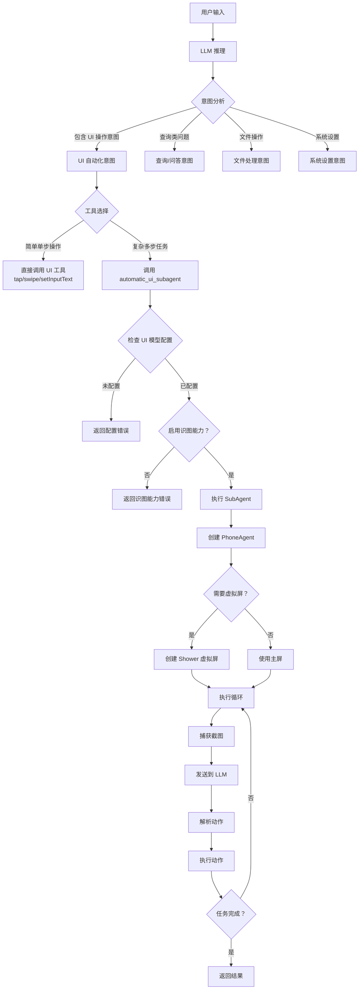
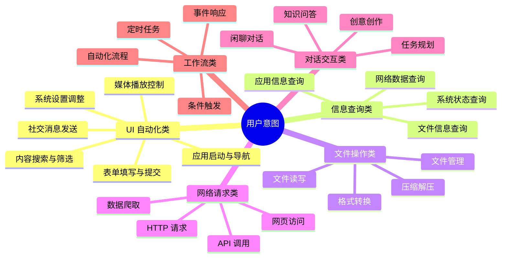
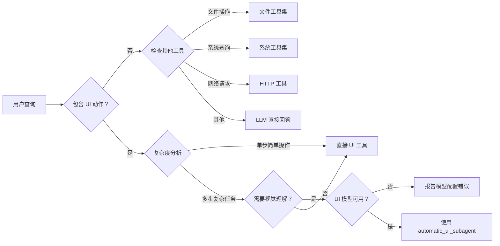
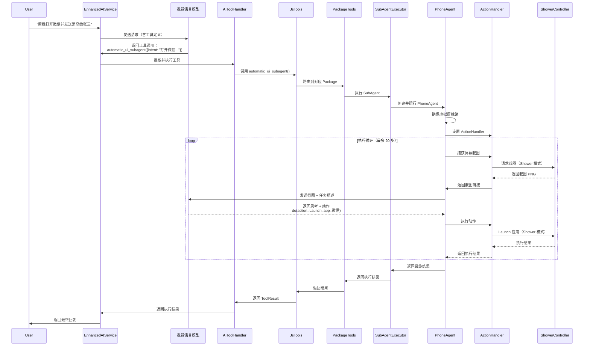
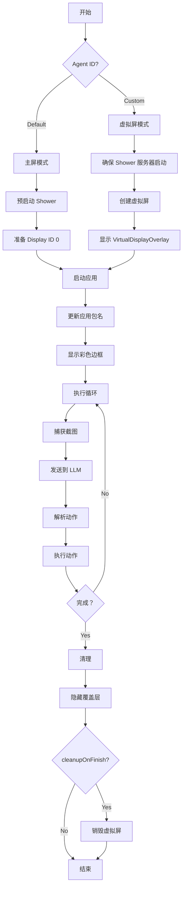

# Operit Agent 意图路由机制详解

## 概述

Operit AI 采用分层式的 Agent 架构，通过意图路由机制将用户的自然语言请求分发到不同的专用子 Agent（SubAgent）中执行。本文档详细解析意图路由的工作原理，重点关注 `automatic_ui_subagent` 的注册、调用和执行流程。

## 整体架构

### 系统架构图



### 核心组件

| 组件 | 职责 | 位置 |
|------|------|------|
| **EnhancedAIService** | AI 对话服务，负责 LLM 推理 | API 层 |
| **AIToolHandler** | 工具调用管理器，负责工具提取和执行 | 核心工具层 |
| **ToolExecutor** | 工具执行器接口 | 工具注册 |
| **JsTools** | JavaScript 工具桥接层 | JS 运行时 |
| **PackageTools** | Package 工具包管理器 | JS 插件系统 |
| **StandardUITools** | UI 自动化工具基类 | 标准工具 |
| **PhoneAgent** | UI 自动化子 Agent 执行器 | Agent 核心 |
| **ActionHandler** | 动作解析和执行器 | Agent 执行 |
| **ShowerController** | 虚拟屏控制器 | 显示系统 |

---

## 意图路由流程

### 用户意图识别与工具选择决策

#### 1. 意图识别的触发点

当用户输入自然语言请求后，系统会经过以下多层判断流程来决定是否使用 `automatic_ui_subagent`：



#### 2. LLM 如何决定调用 automatic_ui_subagent

LLM 基于以下特征判断是否需要调用 `automatic_ui_subagent`：

##### 完整的用户意图分类体系

Operit AI 将用户意图分为以下 **6 大主类别**，每个主类别下又细分为多个子类别：



##### 触发 automatic_ui_subagent 的完整场景清单

以下是 **必须使用 automatic_ui_subagent** 的完整场景列表，按应用场景分类：

###### A. 应用启动与导航类（15 个场景）

| 编号 | 场景描述 | 典型示例 | 复杂度 |
|------|----------|----------|--------|
| A01 | 启动单个应用 | "打开微信" | ⭐⭐ |
| A02 | 启动应用并进入特定页面 | "打开支付宝的扫一扫" | ⭐⭐⭐ |
| A03 | 跨应用导航 | "从微信跳转到浏览器打开链接" | ⭐⭐⭐⭐ |
| A04 | 深层链接导航 | "打开设置→开发者选项→USB 调试" | ⭐⭐⭐⭐ |
| A05 | 多步骤应用切换 | "打开微信，返回桌面，再打开抖音" | ⭐⭐⭐⭐ |
| A06 | 应用内搜索导航 | "在淘宝搜索 '手机'" | ⭐⭐⭐ |
| A07 | 标签页切换 | "在浏览器中切换到第二个标签页" | ⭐⭐⭐ |
| A08 | 弹窗处理 | "打开应用，关闭弹出的广告" | ⭐⭐⭐ |
| A09 | 权限对话框处理 | "打开相机，允许权限请求" | ⭐⭐⭐ |
| A10 | 登录状态检查 | "打开微博，如果未登录则跳过" | ⭐⭐⭐⭐ |
| A11 | 版本更新处理 | "打开应用，忽略更新提示" | ⭐⭐⭐ |
| A12 | 引导页面跳过 | "首次打开应用，跳过所有引导页" | ⭐⭐⭐ |
| A13 | 底部导航切换 | "在微信中切换到'发现'标签" | ⭐⭐ |
| A14 | 侧边栏菜单操作 | "打开侧边栏，点击'设置'" | ⭐⭐⭐ |
| A15 | 返回上一级 | "在设置中返回上一级菜单" | ⭐⭐ |

###### B. 内容搜索与筛选类（12 个场景）

| 编号 | 场景描述 | 典型示例 | 复杂度 |
|------|----------|----------|--------|
| B01 | 应用内搜索 | "在淘宝搜索 iPhone 15" | ⭐⭐⭐ |
| B02 | 搜索结果筛选 | "搜索 '手机'，按价格从低到高排序" | ⭐⭐⭐⭐ |
| B03 | 多关键词搜索 | "搜索 '连衣裙'，选择 '夏季' 和 '红色'" | ⭐⭐⭐⭐ |
| B04 | 搜索结果翻页 | "搜索 '耳机'，找到第 3 页的第 2 个商品" | ⭐⭐⭐⭐ |
| B05 | 筛选条件组合 | "在京东搜索 '笔记本'，筛选 5000-7000 元" | ⭐⭐⭐⭐ |
| B06 | 搜索结果对比 | "搜索 '手机'，对比前 3 个商品的价格" | ⭐⭐⭐⭐⭐ |
| B07 | 历史搜索清除 | "打开搜索历史，删除所有记录" | ⭐⭐⭐ |
| B08 | 热门搜索点击 | "点击微博的热搜第一名" | ⭐⭐⭐ |
| B09 | 搜索建议选择 | "输入 'i'，选择第三个搜索建议" | ⭐⭐⭐ |
| B10 | 搜索过滤器重置 | "重置所有筛选条件" | ⭐⭐⭐ |
| B11 | 搜索结果收藏 | "搜索 '歌曲'，收藏第一首" | ⭐⭐⭐⭐ |
| B12 | 搜索结果分享 | "搜索 '视频'，分享到微信" | ⭐⭐⭐⭐ |

###### C. 表单填写与提交类（15 个场景）

| 编号 | 场景描述 | 典型示例 | 复杂度 |
|------|----------|----------|--------|
| C01 | 单字段输入 | "在搜索框输入 'hello'" | ⭐⭐ |
| C02 | 多字段填写 | "填写姓名、电话、地址" | ⭐⭐⭐⭐ |
| C03 | 下拉框选择 | "选择省份为 '广东省'" | ⭐⭐⭐ |
| C04 | 单选框选择 | "选择性别为 '女'" | ⭐⭐⭐ |
| C05 | 多选框勾选 | "勾选兴趣爱好：音乐、运动" | ⭐⭐⭐⭐ |
| C06 | 日期选择器 | "选择出生日期为 2000-01-01" | ⭐⭐⭐⭐ |
| C07 | 时间选择器 | "设置闹钟时间为 07:30" | ⭐⭐⭐⭐ |
| C08 | 滑块拖动 | "将音量滑块拖到 50%" | ⭐⭐⭐⭐ |
| C09 | 开关切换 | "打开蓝牙开关" | ⭐⭐⭐ |
| C10 | 文件上传 | "点击上传按钮，选择图片" | ⭐⭐⭐⭐⭐ |
| C11 | 验证码识别 | "输入图形验证码 'ABCD'" | ⭐⭐⭐⭐⭐ |
| C12 | 表单提交 | "填写完成后点击提交" | ⭐⭐⭐ |
| C13 | 表单重置 | "清空所有填写的内容" | ⭐⭐⭐ |
| C14 | 错误修正 | "如果提示手机号错误，修改为 13800138000" | ⭐⭐⭐⭐⭐ |
| C15 | 多步骤表单 | "填写第一步，点击下一步，完成第二步" | ⭐⭐⭐⭐⭐ |

###### D. 社交消息发送类（12 个场景）

| 编号 | 场景描述 | 典型示例 | 复杂度 |
|------|----------|----------|--------|
| D01 | 微信单人消息 | "给张三发消息说晚上一起吃饭" | ⭐⭐⭐⭐ |
| D02 | 微信群消息 | "在项目群里发 '明天开会'" | ⭐⭐⭐⭐ |
| D03 | QQ 消息发送 | "给李四发 QQ 消息" | ⭐⭐⭐⭐ |
| D04 | 短信发送 | "发送短信到 10086 查询话费" | ⭐⭐⭐⭐ |
| D05 | 邮件发送 | "发送邮件到 test@example.com" | ⭐⭐⭐⭐⭐ |
| D06 | 朋友圈发布 | "发朋友圈：今天天气真好" | ⭐⭐⭐⭐ |
| D07 | 微博发布 | "发微博并配图" | ⭐⭐⭐⭐⭐ |
| D08 | 消息回复 | "回复微信最后一条消息 '好的'" | ⭐⭐⭐⭐ |
| D09 | 消息转发 | "转发这条消息给王五" | ⭐⭐⭐⭐ |
| D10 | 消息撤回 | "撤回刚刚发送的消息" | ⭐⭐⭐⭐ |
| D11 | 联系人添加 | "添加手机号为 13800138000 的联系人" | ⭐⭐⭐⭐⭐ |
| D12 | 群组创建 | "创建群聊，拉入张三和李四" | ⭐⭐⭐⭐⭐ |

###### E. 媒体播放控制类（10 个场景）

| 编号 | 场景描述 | 典型示例 | 复杂度 |
|------|----------|----------|--------|
| E01 | 音乐播放 | "播放周杰伦的稻香" | ⭐⭐⭐⭐ |
| E02 | 播放暂停 | "暂停当前播放的音乐" | ⭐⭐⭐ |
| E03 | 上一首/下一首 | "播放下一首歌" | ⭐⭐⭐ |
| E04 | 音量调节 | "将媒体音量调到 30%" | ⭐⭐⭐ |
| E05 | 播放列表切换 | "切换到'我喜欢'的播放列表" | ⭐⭐⭐⭐ |
| E06 | 视频播放 | "在 B 站播放'罗翔说刑法'" | ⭐⭐⭐⭐ |
| E07 | 视频进度拖动 | "将视频进度拖到 5 分钟处" | ⭐⭐⭐⭐ |
| E08 | 倍速播放 | "设置视频播放速度为 2.0 倍" | ⭐⭐⭐⭐ |
| E09 | 全屏切换 | "将视频切换为全屏模式" | ⭐⭐⭐ |
| E10 | 弹幕开关 | "打开视频弹幕" | ⭐⭐⭐ |

###### F. 系统设置调整类（10 个场景）

| 编号 | 场景描述 | 典型示例 | 复杂度 |
|------|----------|----------|--------|
| F01 | WiFi 开关 | "打开 WiFi" | ⭐⭐⭐ |
| F02 | 蓝牙开关 | "关闭蓝牙" | ⭐⭐⭐ |
| F03 | 亮度调节 | "将屏幕亮度调到 50%" | ⭐⭐⭐⭐ |
| F04 | 音量调节 | "将铃声音量调到最大" | ⭐⭐⭐ |
| F05 | 飞行模式 | "打开飞行模式" | ⭐⭐⭐ |
| F06 | 热点开关 | "打开个人热点" | ⭐⭐⭐⭐ |
| F07 | 定位开关 | "打开 GPS 定位" | ⭐⭐⭐ |
| F08 | 勿扰模式 | "开启勿扰模式" | ⭐⭐⭐ |
| F09 | 开发者选项 | "打开 USB 调试模式" | ⭐⭐⭐⭐ |
| F10 | 应用权限 | "允许微信的相机权限" | ⭐⭐⭐⭐ |

###### G. 电商购物类（10 个场景）

| 编号 | 场景描述 | 典型示例 | 复杂度 |
|------|----------|----------|--------|
| G01 | 商品浏览 | "打开淘宝，浏览首页推荐" | ⭐⭐⭐ |
| G02 | 商品详情查看 | "点击第一个商品，查看详情" | ⭐⭐⭐⭐ |
| G03 | 加入购物车 | "将这个商品加入购物车" | ⭐⭐⭐⭐ |
| G04 | 立即购买 | "直接购买这个商品" | ⭐⭐⭐⭐⭐ |
| G05 | 订单查看 | "查看我的待收货订单" | ⭐⭐⭐⭐ |
| G06 | 物流查询 | "查询第一个订单的物流信息" | ⭐⭐⭐⭐ |
| G07 | 优惠券领取 | "领取店铺优惠券" | ⭐⭐⭐⭐ |
| G08 | 收藏商品 | "收藏这个商品" | ⭐⭐⭐⭐ |
| G09 | 店铺关注 | "关注这个店铺" | ⭐⭐⭐⭐ |
| G10 | 客服咨询 | "联系客服咨询商品" | ⭐⭐⭐⭐⭐ |

###### H. 内容浏览类（8 个场景）

| 编号 | 场景描述 | 典型示例 | 复杂度 |
|------|----------|----------|--------|
| H01 | 新闻浏览 | "打开今日头条，浏览推荐新闻" | ⭐⭐⭐ |
| H02 | 视频浏览 | "打开抖音，刷 10 个视频" | ⭐⭐⭐ |
| H03 | 文章阅读 | "打开微信公众号文章" | ⭐⭐⭐ |
| H04 | 图片查看 | "查看相册中的第一张图片" | ⭐⭐⭐ |
| H05 | 评论查看 | "查看这条微博的评论" | ⭐⭐⭐ |
| H06 | 点赞操作 | "给这条内容点赞" | ⭐⭐⭐ |
| H07 | 收藏操作 | "收藏这篇文章" | ⭐⭐⭐ |
| H08 | 分享操作 | "分享到微信朋友圈" | ⭐⭐⭐⭐ |

###### I. 游戏辅助类（5 个场景）

| 编号 | 场景描述 | 典型示例 | 复杂度 |
|------|----------|----------|--------|
| I01 | 游戏启动 | "启动王者荣耀" | ⭐⭐ |
| I02 | 任务完成 | "完成每日任务" | ⭐⭐⭐⭐⭐ |
| I03 | 物品购买 | "在商店购买皮肤" | ⭐⭐⭐⭐ |
| I04 | 活动参与 | "参与限时活动" | ⭐⭐⭐⭐ |
| I05 | 战绩查看 | "查看我的战绩" | ⭐⭐⭐ |

###### J. 办公效率类（8 个场景）

| 编号 | 场景描述 | 典型示例 | 复杂度 |
|------|----------|----------|--------|
| J01 | 文档编辑 | "打开 WPS，编辑文档" | ⭐⭐⭐⭐ |
| J02 | 表格填写 | "在 Excel 中填写数据" | ⭐⭐⭐⭐ |
| J03 | 演示文稿创建 | "创建新的 PPT" | ⭐⭐⭐⭐ |
| J04 | 邮件处理 | "查看并回复工作邮件" | ⭐⭐⭐⭐ |
| J05 | 日程安排 | "在日历中添加明天上午 10 点的会议" | ⭐⭐⭐⭐ |
| J06 | 待办事项 | "在待办中添加'买牛奶'" | ⭐⭐⭐ |
| J07 | 文件扫描 | "使用扫描全能王扫描文件" | ⭐⭐⭐⭐ |
| J08 | 翻译操作 | "使用有道翻译官翻译文本" | ⭐⭐⭐ |

###### K. 生活服务类（10 个场景）

| 编号 | 场景描述 | 典型示例 | 复杂度 |
|------|----------|----------|--------|
| K01 | 外卖点餐 | "在美团点一份宫保鸡丁" | ⭐⭐⭐⭐⭐ |
| K02 | 打车服务 | "在滴滴叫车到公司" | ⭐⭐⭐⭐⭐ |
| K03 | 酒店预订 | "在携程预订明天的酒店" | ⭐⭐⭐⭐⭐ |
| K04 | 电影票购买 | "购买今晚的电影票" | ⭐⭐⭐⭐⭐ |
| K05 | 快递查询 | "查询快递到哪儿了" | ⭐⭐⭐⭐ |
| K06 | 天气查询 | "查看明天的天气" | ⭐⭐⭐ |
| K07 | 地图导航 | "导航到最近的地铁站" | ⭐⭐⭐⭐ |
| K08 | 美食搜索 | "搜索附近的川菜馆" | ⭐⭐⭐⭐ |
| K09 | 团购购买 | "购买美团团购券" | ⭐⭐⭐⭐ |
| K10 | 生活缴费 | "缴纳电费 100 元" | ⭐⭐⭐⭐ |

##### 决策矩阵：何时使用 automatic_ui_subagent

| 维度 | 使用 SubAgent | 使用直接工具 | 说明 |
|------|--------------|-------------|------|
| **步骤数量** | ≥ 3 步 | 1-2 步 | 多步骤任务需要 SubAgent 规划 |
| **视觉理解需求** | 需要识图 | 无需识图 | 需要理解屏幕内容时用 SubAgent |
| **条件判断** | 有条件分支 | 线性流程 | 需要"如果...就..."逻辑时用 SubAgent |
| **错误处理** | 需要容错 | 简单执行 | SubAgent 可自动处理异常情况 |
| **跨应用** | 跨多个应用 | 单应用内 | 跨应用任务需要 SubAgent 协调 |
| **动态内容** | 内容不固定 | 固定位置 | 动态内容需要视觉定位 |
| **用户确认** | 无需确认 | 需要确认 | 敏感操作用直接工具 + 用户确认 |

##### 不触发 automatic_ui_subagent 的情况

| 情况 | 原因 | 替代方案 | 示例 |
|------|------|----------|------|
| 简单单步操作 | 无需视觉理解 | 直接调用 `tap`、`swipe` 等工具 | "点击屏幕中心" |
| 纯文本问答 | 无需 UI 操作 | 直接由 LLM 回答 | "今天天气怎么样？" |
| 文件操作 | 文件系统工具 | 调用 `read_file`、`write_file` | "读取 /sdcard/test.txt" |
| 系统查询 | 系统工具 | 调用 `get_system_setting` | "查询电池电量" |
| HTTP 请求 | 网络工具 | 调用 `http_request` | "GET https://api.example.com" |
| 敏感操作需确认 | 安全考虑 | 直接工具 + 用户确认 | "删除所有文件" |
| 精确坐标操作 | 无需理解内容 | `tap(x, y)` 直接点击 | "点击坐标 (500, 300)" |
| 定时任务 | 工作流工具 | `workflow` 定时触发 | "每天早上 8 点提醒我" |

#### 3. 工具选择的决策树



#### 4. 系统提示词（System Prompt）的作用

系统通过为 UI_CONTROLLER 功能配置专门的 System Prompt，引导 LLM 正确识别 UI 自动化意图：

```kotlin
// FunctionalPrompts.uiControllerPrompt() 简化版
fun uiControllerPrompt(useEnglish: Boolean): String {
    return """
    你是一个 UI 自动化助手，专门帮助用户完成 Android 界面上的复杂操作任务。
    
    你的能力：
    1. 理解用户的自然语言任务描述
    2. 分析当前屏幕截图内容
    3. 规划执行步骤（最多 20 步）
    4. 执行点击、滑动、输入、启动应用等操作
    
    典型任务示例：
    - "打开微信，给张三发消息"
    - "在设置中打开开发者选项"
    - "启动浏览器并访问 example.com"
    
    如果任务需要 UI 自动化，请使用 automatic_ui_subagent 工具。
    """.trimIndent()
}
```

这个 System Prompt 会：
1. **定义角色**：明确 LLM 的 UI 自动化助手身份
2. **列举能力**：告诉 LLM 能做什么操作
3. **提供示例**：通过典型任务示例引导 LLM 识别类似请求
4. **明确工具**：直接指出使用 `automatic_ui_subagent` 工具

#### 5. 功能模型配置检查

在决定使用 `automatic_ui_subagent` 后，系统会进行严格的配置检查：

```kotlin
// StandardUITools.kt (第 221-239 行)
val uiConfig = EnhancedAIService.getModelConfigForFunction(context, FunctionType.UI_CONTROLLER)
if (!uiConfig.enableDirectImageProcessing) {
    return ToolResult(
        toolName = tool.name,
        success = false,
        result = StringResultData(""),
        error = "当前 UI 控制器模型未启用识图能力，请在设置 - 功能模型中为 UI 控制器功能选择支持图片理解的模型后再试。"
    )
}
```

**检查流程**：
1. 获取 `UI_CONTROLLER` 功能绑定的模型配置
2. 检查是否启用了 `enableDirectImageProcessing`（识图能力）
3. 如果未启用，返回详细错误信息引导用户配置

**配置要求**：
- ✅ 必须选择支持视觉理解的模型（VLM）
- ✅ 必须在功能模型设置中为 `UI_CONTROLLER` 绑定该模型
- ✅ 必须启用"直接识图"选项

### 完整调用链路



---

## automatic_ui_subagent 注册流程

### 1. JavaScript 工具定义

在 [`JsTools.kt`](file:///home/meizu/Documents/my_agent_projects/Operit/app/src/main/java/com/ai/assistance/operit/core/tools/javascript/JsTools.kt) 中定义了便捷的 JavaScript 工具调用方法：

```javascript
// JsTools.kt 中定义
var Tools = {
    // ...其他工具
    SubAgents: {
        automatic_ui: (intent, max_steps, agent_id, target_app) => {
            const params = { intent };
            if (max_steps !== undefined) params.max_steps = String(max_steps);
            if (agent_id !== undefined) params.agent_id = agent_id;
            if (target_app !== undefined) params.target_app = target_app;
            return toolCall("automatic_ui_subagent", params);
        }
        // ...其他 SubAgent
    }
};
```

### 2. Package 工具包注册

在 `automatic_ui_subagent.js` Package 中注册工具：

```javascript
// app/src/main/assets/packages/automatic_ui_subagent.js
export default {
  meta: {
    name: "automatic_ui_subagent",
    version: "1.0.0",
    description: "UI 自动化子 Agent 工具包"
  },
  
  tools: {
    /**
     * 在 Ubuntu 环境中执行终端命令并收集输出结果
     * @param {string} params.intent - 用户的 UI 自动化意图
     * @param {number} params.max_steps - 最大执行步数（默认 20）
     * @param {string} params.agent_id - Agent ID（用于虚拟屏标识）
     * @param {string} params.target_app - 目标应用包名或名称
     */
    async automatic_ui_subagent(params) {
      const intent = params.intent;
      const maxSteps = params.max_steps || "20";
      const agentId = params.agent_id || "default";
      const targetApp = params.target_app;
      
      // 调用 Kotlin 层的 runUiSubAgent 方法
      return await toolCall("run_ui_subagent", {
        intent,
        max_steps: maxSteps,
        agent_id: agentId,
        target_app: targetApp
      });
    }
  }
};
```

### 3. Kotlin 层工具注册

在 [`ToolRegistration.kt`](file:///home/meizu/Documents/my_agent_projects/Operit/app/src/main/java/com/ai/assistance/operit/core/tools/ToolRegistration.kt) 中注册 `run_ui_subagent` 工具：

```kotlin
// ToolRegistration.kt
fun registerAllTools(handler: AIToolHandler, context: Context) {
    // ...其他工具注册
    
    // 注册 run_ui_subagent 工具
    handler.registerTool(
        name = "run_ui_subagent",
        description = { tool ->
            """
            执行 UI 自动化子 Agent，用于完成复杂的 UI 操作任务。
            参数：
            - intent: 用户的 UI 自动化意图（必需）
            - max_steps: 最大执行步数（可选，默认 20）
            - agent_id: Agent 标识符（可选，用于虚拟屏管理）
            - target_app: 目标应用（可选，用于预启动）
            """.trimIndent()
        },
        executor = { tool ->
            // 调用 StandardUITools.runUiSubAgent() 方法
            val uiTools = StandardUITools(context)
            uiTools.runUiSubAgent(tool)
        }
    )
}
```

### 4. StandardUITools 实现

在 [`StandardUITools.kt`](file:///home/meizu/Documents/my_agent_projects/Operit/app/src/main/java/com/ai/assistance/operit/core/tools/defaultTool/standard/StandardUITools.kt) 中实现 `runUiSubAgent` 方法：

```kotlin
// StandardUITools.kt (第 407-527 行)
/**
 * Executes a lightweight UI automation subagent loop using the UI_CONTROLLER function type.
 * This subagent uses the UI_AUTOMATION_AGENT_PROMPT and returns an AutomationExecutionResult
 * that contains a log of all <think>/<answer> pairs and parsed actions.
 */
open suspend fun runUiSubAgent(tool: AITool): ToolResult {
    val intent = tool.parameters.find { it.name == "intent" }?.value
    val maxSteps = tool.parameters.find { it.name == "max_steps" }?.value?.toIntOrNull() ?: 20
    val requestedAgentId = tool.parameters.find { it.name == "agent_id" }?.value
    val targetApp = tool.parameters.find { it.name == "target_app" }?.value

    if (intent.isNullOrBlank()) {
        return ToolResult(
            toolName = tool.name,
            success = false,
            result = StringResultData(""),
            error = "Missing required parameter: intent"
        )
    }

    // 获取专用于 UI_CONTROLLER 的模型配置
    val uiConfig = EnhancedAIService.getModelConfigForFunction(context, FunctionType.UI_CONTROLLER)
    if (!uiConfig.enableDirectImageProcessing) {
        return ToolResult(
            toolName = tool.name,
            success = false,
            result = StringResultData(""),
            error = "当前 UI 控制器模型未启用识图能力..."
        )
    }

    // 获取专用于 UI_CONTROLLER 的 AIService 实例
    val uiService = EnhancedAIService.getAIServiceForFunction(context, FunctionType.UI_CONTROLLER)
    val systemPrompt = buildUiAutomationSystemPrompt()

    val metrics = context.resources.displayMetrics
    val screenWidth = metrics.widthPixels
    val screenHeight = metrics.heightPixels

    val agentConfig = AgentConfig(maxSteps = maxSteps)
    val actionHandler = ActionHandler(
        context = context,
        screenWidth = screenWidth,
        screenHeight = screenHeight,
        toolImplementations = this
    )

    val agentId = if (!requestedAgentId.isNullOrBlank()) requestedAgentId else "default"
    val agent = PhoneAgent(
        context = context,
        config = agentConfig,
        uiService = uiService,
        actionHandler = actionHandler,
        agentId = agentId,
        cleanupOnFinish = false
    )

    val pausedState = MutableStateFlow(false)

    val finalMessage = agent.run(
        task = intent,
        systemPrompt = systemPrompt,
        isPausedFlow = pausedState,
        targetApp = targetApp
    )

    // ...构建并返回 AutomationExecutionResult
}
```

---

## PhoneAgent 执行流程

### 1. PhoneAgent 初始化

```kotlin
// PhoneAgent.kt (第 119-143 行)
class PhoneAgent(
    private val context: Context,
    private val config: AgentConfig,
    private val uiService: AIService,  // 专用的 UI 模型服务
    private val actionHandler: ActionHandler,
    val agentId: String = "default",
    private val cleanupOnFinish: Boolean = (agentId != "default"),
) {
    private var _stepCount = 0
    val stepCount: Int get() = _stepCount

    private val _contextHistory = mutableListOf<Pair<String, String>>()
    val contextHistory: List<Pair<String, String>> get() = _contextHistory.toList()

    private var pauseFlow: StateFlow<Boolean>? = null

    private val requiresVirtualScreen: Boolean = agentId.isNotBlank() && agentId != "default"
    private val isMainScreenAgent: Boolean = agentId.isBlank() || agentId == "default"

    init {
        actionHandler.setAgentId(agentId)
    }
}
```

### 2. PhoneAgent.run() 主循环

```kotlin
// PhoneAgent.kt (第 355-593 行)
suspend fun run(
    task: String,
    systemPrompt: String,
    onStep: (suspend (StepResult) -> Unit)? = null,
    isPausedFlow: StateFlow<Boolean>? = null,
    targetApp: String? = null
): String {
    // 1. 确保虚拟屏就绪
    val requiredVirtualScreenError = ensureRequiredVirtualScreenOrError()
    if (requiredVirtualScreenError != null) {
        return requiredVirtualScreenError
    }

    // 2. 预启动应用（如果指定了 targetApp）
    val hasShowerDisplayAtStart = hasShowerDisplay("...")
    val (prewarmedShowerDisplay, prewarmError) = prewarmShowerIfNeeded(
        hasShowerDisplayAtStart, 
        targetApp
    )

    // 3. 显示进度覆盖层
    val progressOverlay = UIAutomationProgressOverlay.getInstance(context)
    progressOverlay.show(
        config.maxSteps,
        context.getString(R.string.phone_agent_thinking),
        onCancel = { /* 取消逻辑 */ },
        onToggleTakeOver = { isPaused -> pausedMutable?.value = isPaused }
    )

    // 4. 重置状态并添加系统提示
    reset()
    _contextHistory.add("system" to systemPrompt)
    pauseFlow = isPausedFlow

    // 5. 执行第一步（带用户任务描述）
    awaitIfPaused()
    var result = _executeStep(task, isFirst = true)

    // 6. 主循环：直到完成或达到最大步数
    while (_stepCount < config.maxSteps) {
        awaitIfPaused()
        result = _executeStep(null, isFirst = false)
        onStep?.invoke(result)

        if (result.finished) {
            return result.message ?: "Task completed"
        }
    }

    return "Max steps reached"
}
```

### 3. 单步执行流程

```kotlin
// PhoneAgent.kt (第 601-660 行)
private suspend fun _executeStep(userPrompt: String?, isFirst: Boolean): StepResult {
    _stepCount++

    // 1. 捕获屏幕截图
    val screenshotLink = actionHandler.captureScreenshotForAgent()
    val screenInfo = buildString {
        if (screenshotLink != null) {
            appendLine("[SCREENSHOT] Below is the latest screen image:")
            appendLine(screenshotLink)
        } else {
            appendLine("No screenshot available for this step.")
        }
    }.trim()

    // 2. 构建用户消息
    val userMessage = if (isFirst) {
        "$userPrompt\n\n$screenInfo"
    } else {
        "** Screen Info **\n\n$screenInfo"
    }

    _contextHistory.add("user" to userMessage)

    // 3. 调用 LLM 获取响应
    val responseStream = uiService.sendMessage(
        context = context,
        chatHistory = _contextHistory.toList().toPromptTurns(),
        enableThinking = false,
        stream = true,
        preserveThinkInHistory = true
    )

    val contentBuilder = StringBuilder()
    responseStream.collect { chunk -> contentBuilder.append(chunk) }
    val fullResponse = contentBuilder.toString().trim()

    // 4. 解析思考和动作
    val (thinking, answer) = parseThinkingAndAction(fullResponse)
    val historyEntry = "<think>$thinking</think><answer>$answer</answer>"
    _contextHistory.add("assistant" to historyEntry)

    // 5. 解析动作并执行
    val parsedAction = parseAgentAction(answer)
    actionHandler.removeImagesFromLastUserMessage(_contextHistory)

    if (parsedAction.metadata == "finish") {
        val message = parsedAction.fields["message"] ?: "Task finished."
        return StepResult(success = true, finished = true, action = parsedAction, thinking = thinking, message = message)
    }

    if (parsedAction.metadata == "do") {
        awaitIfPaused()
        val execResult = actionHandler.executeAgentAction(parsedAction)
        if (execResult.shouldFinish) {
             return StepResult(success = execResult.success, finished = true, action = parsedAction, thinking = thinking, message = execResult.message)
        }
        return StepResult(success = execResult.success, finished = false, action = parsedAction, thinking = thinking, message = execResult.message)
    }

    val errorMessage = "Unknown action format: ${parsedAction.metadata}"
    return StepResult(success = false, finished = true, action = parsedAction, thinking = thinking, message = errorMessage)
}
```

---

## ActionHandler 动作执行

### 1. 动作解析格式

LLM 返回的动作格式：

```
finish(message="任务已完成")
do(action=Launch, app=微信)
do(action=Tap, element=[500, 300])
do(action=Type, text=Hello)
do(action=Swipe, start=[500, 800], end=[500, 200])
do(action=Back)
do(action=Home)
do(action=Wait, duration=2 seconds)
do(action=Take_over, message="需要用户介入")
```

### 2. 动作执行器

```kotlin
// PhoneAgent.kt (第 960-1045 行)
suspend fun executeAgentAction(parsed: ParsedAgentAction): ActionExecResult {
    val actionName = parsed.actionName ?: return fail(message = "Missing action name")
    val fields = parsed.fields

    val showerCtx = resolveShowerUsageContext()
    return when (actionName) {
        "Launch" -> {
            val app = fields["app"] ?: return fail(message = "No app name specified")
            val packageName = resolveAppPackageName(app)
            
            if (showerCtx.isAdbOrHigher && !isMainScreenAgent()) {
                // Shower 虚拟屏模式
                val hasLaunchableTarget = pm.getLaunchIntentForPackage(packageName) != null
                ensureVirtualDisplayIfAdbOrHigher()
                
                val created = ShowerController.ensureDisplay(agentId, context, width, height, dpi)
                val launched = if (created && hasLaunchableTarget) {
                    ShowerController.launchApp(agentId, packageName)
                } else false

                if (created && launched) {
                    VirtualDisplayOverlay.getInstance(context, agentId)
                        .updateCurrentAppPackageName(packageName)
                    useShowerIndicatorForAgent(context, agentId)
                    delay(POST_LAUNCH_DELAY_MS)
                    ok()
                } else {
                    fail(message = "Failed to launch on Shower virtual display")
                }
            } else {
                // 标准模式
                val result = aiToolManager.executeTool(
                    AITool("start_app", listOf(ToolParameter("package_name", packageName)))
                )
                if (result.success) {
                    delay(POST_LAUNCH_DELAY_MS)
                    ok()
                } else {
                    fail(message = result.error ?: "Failed to launch app")
                }
            }
        }

        "Tap" -> {
            val element = fields["element"] ?: return fail(message = "No element for Tap")
            val (x, y) = parseRelativePoint(element) 
                ?: return fail(message = "Invalid coordinates: $element")
            
            val exec = withAgentUiHiddenForAction(showerCtx) {
                if (showerCtx.canUseShowerForInput) {
                    val okTap = ShowerController.tap(agentId, x, y)
                    if (okTap) ok() else fail(message = "Shower TAP failed")
                } else {
                    val params = withDisplayParam(listOf(
                        ToolParameter("x", x.toString()), 
                        ToolParameter("y", y.toString())
                    ))
                    val result = toolImplementations.tap(AITool("tap", params))
                    if (result.success) ok() else fail(message = result.error ?: "Tap failed")
                }
            }
            if (exec.success && !exec.shouldFinish) delay(POST_NON_WAIT_ACTION_DELAY_MS)
            exec
        }

        "Type" -> {
            val text = fields["text"] ?: ""
            val exec = withAgentUiHiddenForAction(showerCtx) {
                if (showerCtx.canUseShowerForInput) {
                    // Shower 模式：使用剪贴板粘贴
                    val clipboard = context.getSystemService(Context.CLIPBOARD_SERVICE) as ClipboardManager
                    clipboard.setPrimaryClip(ClipData.newPlainText("operit_input", text))
                    delay(100)
                    val pasted = ShowerController.key(agentId, KeyEvent.KEYCODE_PASTE)
                    if (pasted) ok() else fail(message = "Shower PASTE failed")
                } else {
                    // 标准模式
                    val params = withDisplayParam(listOf(ToolParameter("text", text)))
                    val result = toolImplementations.setInputText(AITool("set_input_text", params))
                    if (result.success) ok() else fail(message = result.error ?: "Type failed")
                }
            }
            if (exec.success && !exec.shouldFinish) delay(POST_NON_WAIT_ACTION_DELAY_MS)
            exec
        }

        "Swipe" -> { /* 类似 Tap 的实现 */ }
        "Back" -> { /* 返回键 */ }
        "Home" -> { /* Home 键 */ }
        "Wait" -> {
            val seconds = fields["duration"]?.replace("seconds", "")?.trim()?.toDoubleOrNull() ?: 1.0
            delay((seconds * 1000).toLong().coerceAtLeast(0L))
            ok()
        }
        "Take_over" -> ok(shouldFinish = true, message = fields["message"] ?: "User takeover required")
        else -> fail(message = "Unknown action: $actionName")
    }
}
```

---

## Shower 虚拟屏集成

### 1. ShowerController 功能

`ShowerController` 提供虚拟屏的完整控制能力：

```kotlin
object ShowerController {
    // 确保虚拟屏显示存在
    fun ensureDisplay(
        agentId: String,
        context: Context,
        width: Int,
        height: Int,
        dpi: Int,
        bitrateKbps: Int = 3000
    ): Boolean

    // 获取虚拟屏 ID
    fun getDisplayId(agentId: String): Int?

    // 启动应用到虚拟屏
    fun launchApp(agentId: String, packageName: String): Boolean

    // 截图
    fun requestScreenshot(agentId: String): ByteArray?

    // 点击
    fun tap(agentId: String, x: Int, y: Int): Boolean

    // 滑动
    fun swipe(agentId: String, startX: Int, startY: Int, endX: Int, endY: Int): Boolean

    // 按键
    fun key(agentId: String, keyCode: Int): Boolean
    fun keyWithMeta(agentId: String, keyCode: Int, metaState: Int): Boolean
}
```

### 2. 虚拟屏工作流程



---

## 权限和安全

### 1. 权限级别

Operit 支持多种权限级别：

```kotlin
enum class AndroidPermissionLevel {
    STANDARD,      // 标准权限（无需 Root）
    DEBUGGER,      // 调试器权限（Shizuku）
    ADMIN,         // 设备管理员
    ROOT           // Root 权限
}
```

### 2. 权限检查流程

```kotlin
// PhoneAgent.kt (第 68-111 行)
private fun resolvePrivilegedExecutionState(
    context: Context,
    androidPermissionPreferences: AndroidPermissionPreferences,
    checkDebuggerShizuku: Boolean = true
): PrivilegedExecutionState {
    val preferredLevel = androidPermissionPreferences.getPreferredPermissionLevel()
        ?: AndroidPermissionLevel.STANDARD

    var isAdbOrHigher = when (preferredLevel) {
        AndroidPermissionLevel.DEBUGGER,
        AndroidPermissionLevel.ADMIN,
        AndroidPermissionLevel.ROOT -> true
        else -> false
    }

    if (isAdbOrHigher) {
        val experimentalEnabled = try {
            DisplayPreferencesManager.getInstance(context)
                .isExperimentalVirtualDisplayEnabled()
        } catch (e: Exception) {
            true
        }
        if (!experimentalEnabled) {
            isAdbOrHigher = false
        }
    }

    val hasDebuggerShizukuAccess = if (checkDebuggerShizuku &&
        isAdbOrHigher &&
        preferredLevel == AndroidPermissionLevel.DEBUGGER
    ) {
        val isShizukuRunning = ShizukuAuthorizer.isShizukuServiceRunning()
        val hasShizukuPermission = if (isShizukuRunning) {
            ShizukuAuthorizer.hasShizukuPermission()
        } else false
        isShizukuRunning && hasShizukuPermission
    } else {
        true
    }

    return PrivilegedExecutionState(
        isAdbOrHigher = isAdbOrHigher,
        hasDebuggerShizukuAccess = hasDebuggerShizukuAccess
    )
}
```

---

## 错误处理和恢复

### 1. 常见错误场景

| 错误场景 | 错误信息 | 处理方式 |
|----------|----------|----------|
| 缺少 intent 参数 | "Missing required parameter: intent" | 返回 ToolResult.error |
| UI 模型未启用识图 | "当前 UI 控制器模型未启用识图能力..." | 引导用户配置模型 |
| 虚拟屏创建失败 | "虚拟屏创建失败" | 检查权限和 Shizuku 状态 |
| 达到最大步数 | "Max steps reached" | 返回最终状态 |
| 用户取消 | "User cancelled UI automation" | 清理资源并退出 |

### 2. 异常处理

```kotlin
// StandardUITools.kt (第 510-526 行)
} catch (e: CancellationException) {
    AppLogger.e(TAG, "UI subagent cancelled", e)
    ToolResult(
        toolName = tool.name,
        success = false,
        result = StringResultData(""),
        error = "Error running UI subagent: ${e.message}"
    )
} catch (e: Exception) {
    AppLogger.e(TAG, "Error running UI subagent", e)
    ToolResult(
        toolName = tool.name,
        success = false,
        result = StringResultData(""),
        error = "Error running UI subagent: ${e.message}"
    )
}
```

---

## 性能优化

### 1. 截图优化

- **Shower 模式**：通过 WebSocket 直接获取虚拟屏帧，无需压缩
- **标准模式**：使用 MediaProjection 捕获，通过 ImagePoolManager 压缩

```kotlin
// PhoneAgent.kt (第 826-875 行)
suspend fun captureScreenshotForAgent(): String? {
    val showerCtx = resolveShowerUsageContext()
    
    // 隐藏覆盖层，确保截图干净
    floatingService?.setStatusIndicatorVisible(false)
    progressOverlay.setOverlayVisible(false)
    delay(200)

    var screenshotLink: String? = null
    var dimensions: Pair<Int, Int>? = null

    try {
        if (showerCtx.canUseShowerForInput) {
            // Shower 模式：直接获取 PNG
            val (link, dims) = captureScreenshotViaShower()
            screenshotLink = link
            dimensions = dims
        }

        if (screenshotLink == null) {
            // 标准模式：MediaProjection + 压缩
            val (bitmap, fallbackDims) = toolImplementations.captureScreenshotBitmap(screenshotTool)
            if (bitmap != null) {
                val (compressedLink, rawDims) = saveCompressedScreenshotFromBitmap(bitmap)
                screenshotLink = compressedLink
                dimensions = fallbackDims ?: rawDims
                bitmap.recycle()
            }
        }
    } finally {
        // 恢复覆盖层
        floatingService?.setStatusIndicatorVisible(true)
        progressOverlay.setOverlayVisible(true)
    }

    // 更新屏幕尺寸
    if (dimensions != null) {
        screenWidth = dimensions.first
        screenHeight = dimensions.second
    }
    return screenshotLink
}
```

### 2. 延迟优化

```kotlin
companion object {
    private const val POST_LAUNCH_DELAY_MS = 1000L      // 启动后延迟
    private const val POST_NON_WAIT_ACTION_DELAY_MS = 500L  // 非等待动作后延迟
}
```

---

## 调试和日志

### 1. 日志标签

```kotlin
private const val TAG = "UITools"           // UI 工具日志
private const val TAG = "PhoneAgent"        // Agent 执行日志
private const val TAG = "ActionHandler"     // 动作执行日志
private const val TAG = "ShowerController"  // 虚拟屏日志
```

### 2. 关键日志点

```kotlin
// 开始执行
AppLogger.d("PhoneAgent", "[$agentId] run: starting first step for task='$task'")

// 每步执行
AppLogger.d("PhoneAgent", "[$agentId] _executeStep: begin, step=$_stepCount")
AppLogger.d("PhoneAgent", "[$agentId] _executeStep: AI response collected, length=${fullResponse.length}")

// 动作执行
AppLogger.d("PhoneAgent", "[$agentId] executeAgentAction: executing $actionName")

// 错误日志
AppLogger.e("PhoneAgent", "[$agentId] Error running UI subagent", e)
```

---

## 总结

### 核心设计思想

1. **分层路由**：从 LLM → ToolHandler → Package → SubAgent → PhoneAgent → ActionHandler
2. **统一接口**：所有工具通过 `ToolExecutor` 接口统一调用
3. **双模式支持**：标准模式和 Shower 虚拟屏模式无缝切换
4. **视觉理解**：使用 VLM（视觉语言模型）理解屏幕内容
5. **渐进式执行**：思考 - 动作循环，最多 20 步完成复杂任务

### 关键优势

- ✅ **模块化设计**：各组件职责清晰，易于扩展
- ✅ **类型安全**：Kotlin 强类型系统保证编译期安全
- ✅ **异步执行**：协程支持高效的异步操作
- ✅ **错误恢复**：完善的异常处理和日志记录
- ✅ **性能优化**：截图压缩、延迟控制、资源管理

### 扩展方向

- 添加新的 SubAgent 类型（如文件处理、数据分析）
- 扩展 ActionHandler 支持更多动作类型
- 集成更多虚拟屏功能（多实例、分组管理）
- 优化 LLM 提示工程，提高动作准确性

---

## 相关文档

- [Operit 工具生态系统设计思想与详细流程分析](./Operit%20工具生态系统设计思想与详细流程分析.md)
- [项目初始化流程图](./项目初始化流程图.md)
- [workflow_intent_trigger](../docs/workflow_intent_trigger.md)
- [PhoneAgent 源码](../app/src/main/java/com/ai/assistance/operit/core/tools/agent/PhoneAgent.kt)
- [StandardUITools 源码](../app/src/main/java/com/ai/assistance/operit/core/tools/defaultTool/standard/StandardUITools.kt)
