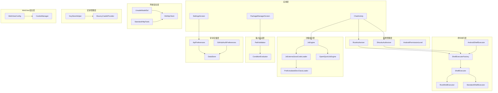
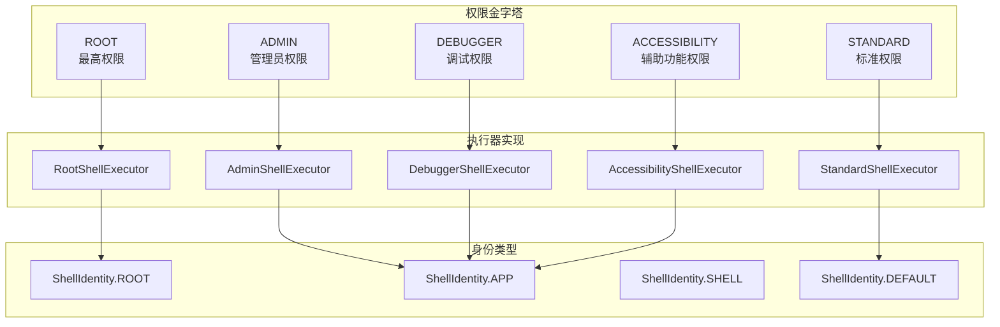
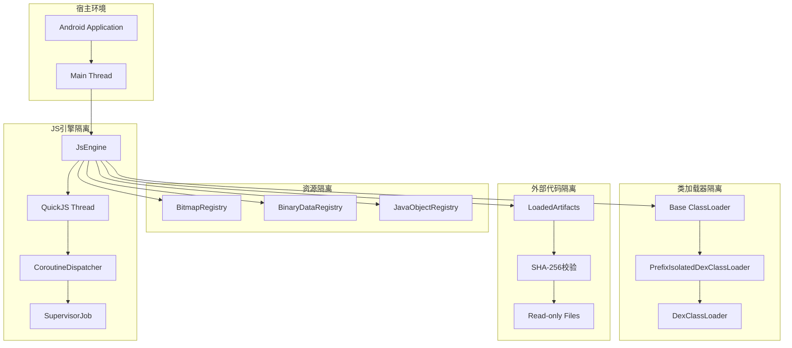
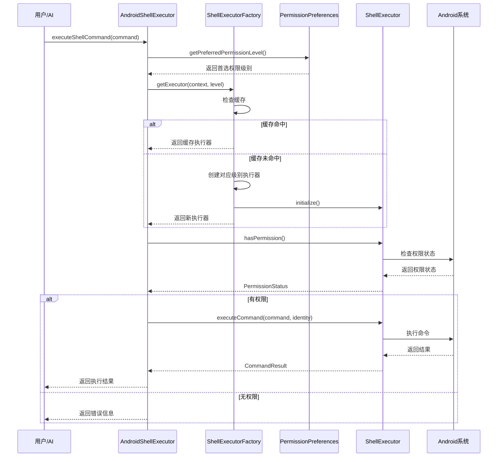
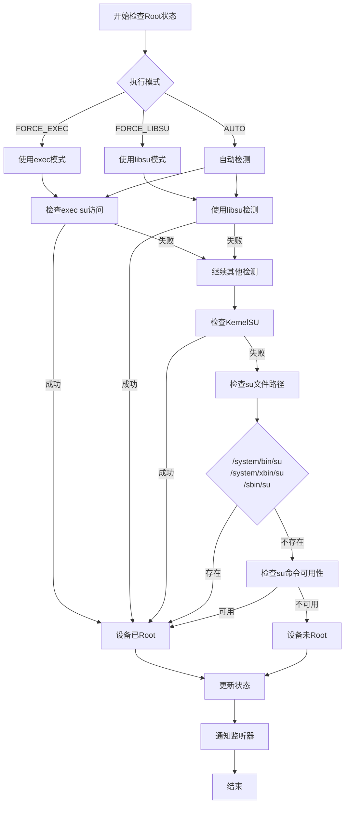
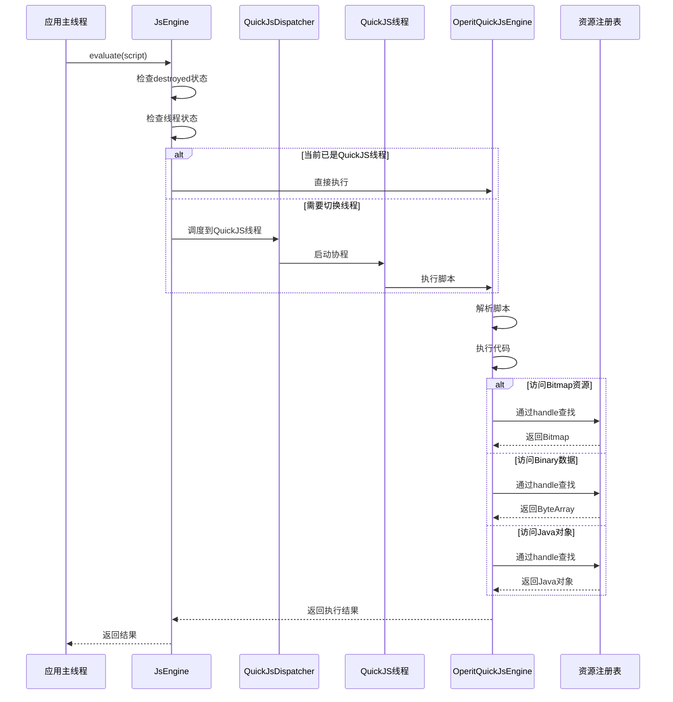
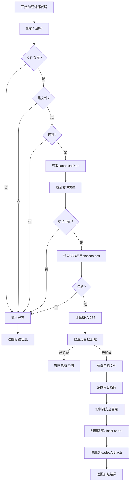
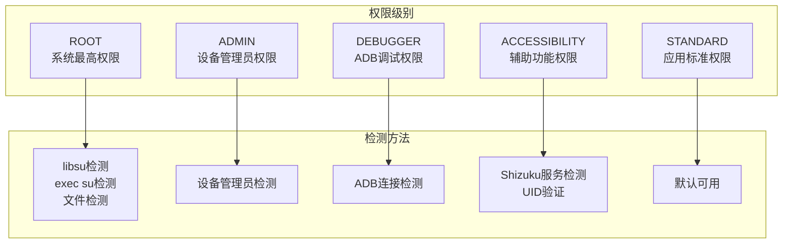
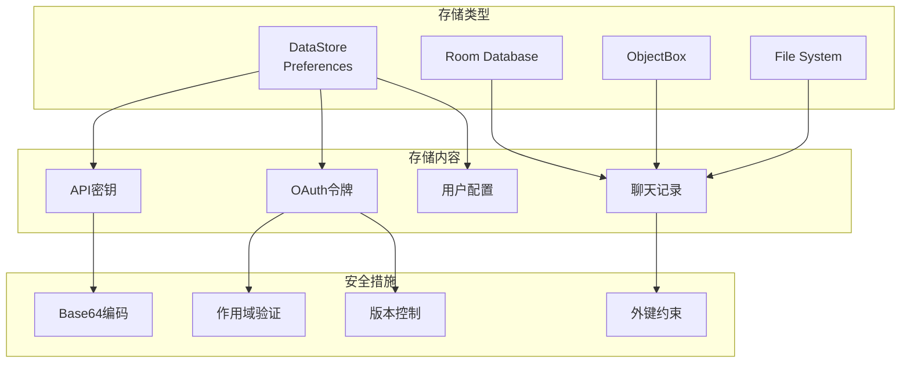

# Operit 安全机制设计思想与详细流程分析

## 一、概述

Operit 项目采用了一套多层次、多维度的安全机制体系，覆盖从系统权限管理到 JavaScript 沙箱执行、从网络安全到数据存储安全的各个方面。安全设计遵循**最小权限原则**、**纵深防御原则**和**安全默认原则**，通过分层隔离和严格验证确保应用和用户数据的安全。

### 1.1 设计目标

- **最小权限原则**：每个组件只拥有完成其功能所需的最小权限
- **纵深防御**：多层安全机制叠加，单点失效不会导致整体安全崩溃
- **安全默认**：默认配置即安全配置，无需用户手动调整
- **隔离执行**：不可信代码在隔离环境中运行，限制其对系统的访问
- **输入验证**：对所有外部输入进行严格验证和过滤
- **安全存储**：敏感数据加密存储，防止未授权访问

### 1.2 安全机制概览

| 安全领域 | 核心组件 | 安全机制 |
|---------|---------|---------|
| **权限管理** | RootAuthorizer, ShizukuAuthorizer | 多级权限检查、动态授权 |
| **Shell执行** | ShellExecutorFactory, AndroidShellExecutor | 权限分级执行、身份隔离 |
| **JS沙箱** | JsEngine, JsExternalJavaCodeLoader | 线程隔离、类加载器隔离、资源限制 |
| **网络安全** | UnsafeModelSsl, StandardHttpTools | SSL/TLS配置、证书验证、代理支持 |
| **输入验证** | PathValidator | 路径规范化、格式验证 |
| **安全存储** | ApiPreferences, GitHubAuthPreferences | DataStore加密、令牌安全存储 |
| **密钥管理** | KeyStoreHelper | 密钥库管理、BouncyCastle集成 |
| **WebView安全** | WebViewConfig | 安全浏览、混合内容控制 |
| **OAuth认证** | GitHubOAuthCoordinator | 状态校验、CSRF防护 |

---

## 二、软件架构图

### 2.1 安全机制整体架构



### 2.2 权限分级架构



### 2.3 JS沙箱隔离架构



---

## 三、安全流程图

### 3.1 Shell命令执行安全流程



### 3.2 Root权限检查流程



### 3.3 JS沙箱执行安全流程



### 3.4 外部Java代码加载安全流程



### 3.5 OAuth认证安全流程

```mermaid
sequenceDiagram
    participant User as 用户
    participant App as 应用
    coordinator as GitHubOAuthCoordinator
    participant Pref as GitHubAuthPreferences
    participant GitHub as GitHub API

    User->>App: 点击登录
    App->>coordinator: createExternalAuthorizationUrl()
    coordinator->>Pref: 生成并保存state
    coordinator-->>App: 返回授权URL
    App->>GitHub: 打开授权页面
    User->>GitHub: 授权
    GitHub-->>App: 重定向到callback URI

    App->>coordinator: completeExternalLogin(uri)
    coordinator->>Pref: consumePendingOAuthState()
    Pref-->>coordinator: 返回expectedState

    coordinator->>coordinator: 验证URI格式
    coordinator->>coordinator: 比较state

    alt state不匹配
        coordinator-->>App: 返回失败
    else state匹配
        coordinator->>coordinator: 检查error参数
        alt 有错误
            coordinator-->>App: 返回失败
        else 无错误
            coordinator->>GitHub: 用code换取token
            GitHub-->>coordinator: 返回access_token
            coordinator->>GitHub: 获取用户信息
            GitHub-->>coordinator: 返回用户数据
            coordinator->>Pref: saveAuthInfo()
            coordinator-->>App: 返回成功
        end
    end
```

---

## 四、核心设计思想

### 4.1 权限分级模型

Operit 实现了五级权限模型，从高到低依次为：



**设计特点**：
- **降级执行**：优先使用用户指定的权限级别，失败时不会自动降级（严格模式）
- **身份隔离**：通过 `ShellIdentity` 区分 ROOT/APP/SHELL/DEFAULT 身份
- **状态监听**：权限状态变更时通知所有监听器

### 4.2 沙箱隔离模型

JS 引擎采用多层隔离机制：

| 隔离层次 | 机制 | 说明 |
|---------|------|------|
| **线程隔离** | 单线程执行器 | 所有 JS 代码在独立线程执行 |
| **调度器隔离** | CoroutineDispatcher | 协程调度限制在特定线程 |
| **资源隔离** | ConcurrentHashMap | Bitmap/Binary/Java对象分别存储 |
| **类加载器隔离** | PrefixIsolatedDexClassLoader | 按包名前缀隔离类加载 |
| **文件系统隔离** | SHA-256命名 | 外部代码复制到只读目录 |

### 4.3 安全默认配置

**WebView 安全配置**：
- `safeBrowsingEnabled = true`（Android O+）
- 混合内容模式显式配置
- Cookie 管理严格控制
- JavaScript 启用但限制弹窗

**HTTP 工具安全配置**：
- 默认验证 SSL 证书
- 支持代理配置
- 可选忽略 SSL（`ignoreSsl` 参数）
- 超时控制（连接15s，读取20s）

### 4.4 输入验证策略

**路径验证**：
```kotlin
object PathValidator {
    fun validateAndroidPath(path: String, toolName: String, paramName: String = "path"): ToolResult? {
        if (path.isBlank()) {
            return ToolResult(/* 错误：路径为空 */)
        }
        if (!path.startsWith("/")) {
            return ToolResult(/* 错误：必须是绝对路径 */)
        }
        return null // 验证通过
    }

    fun validateLinuxPath(path: String, toolName: String, paramName: String = "path"): ToolResult? {
        if (path.isBlank()) {
            return ToolResult(/* 错误：路径为空 */)
        }
        if (!path.startsWith("/") && !path.startsWith("~")) {
            return ToolResult(/* 错误：必须以/或~开头 */)
        }
        return null // 验证通过
    }
}
```

**验证原则**：
- 白名单验证：只允许已知安全的格式
- 提前失败：在操作前验证，避免副作用
- 明确错误：返回详细的错误信息

---

## 五、关键代码解析

### 5.1 权限状态管理

```kotlin
interface ShellExecutor {
    suspend fun executeCommand(command: String, identity: ShellIdentity = ShellIdentity.DEFAULT): CommandResult
    fun getPermissionLevel(): AndroidPermissionLevel
    fun isAvailable(): Boolean
    fun requestPermission(onResult: (Boolean) -> Unit)
    fun hasPermission(): PermissionStatus
    fun initialize()
    suspend fun startProcess(command: String): ShellProcess

    data class PermissionStatus(
        val granted: Boolean,
        val reason: String = if (granted) "Permission granted" else "Permission denied"
    ) {
        companion object {
            fun granted() = PermissionStatus(true)
            fun denied(reason: String) = PermissionStatus(false, reason)
        }
    }
}
```

**设计思想**：
- 统一的执行器接口，屏蔽底层差异
- `PermissionStatus` 包含详细失败原因
- 支持同步和异步权限请求

### 5.2 Root 权限检测

```kotlin
fun isDeviceRooted(): Boolean {
    // 方法1: 使用libsu检测
    val isRoot = Shell.isAppGrantedRoot() ?: false
    if (isRoot) return true

    // 方法2: 检查KernelSU
    if (checkKernelSu()) return true

    // 方法3: 检查常见的su路径
    val suPaths = arrayOf(
        "/system/bin/su",
        "/system/xbin/su",
        "/sbin/su",
        "/system/app/Superuser.apk",
        "/system/app/SuperSU.apk"
    )
    for (path in suPaths) {
        if (File(path).exists()) return true
    }

    // 方法4: 检查是否可以执行su命令
    val process = Runtime.getRuntime().exec(arrayOf("which", "su"))
    return process.waitFor() == 0
}
```

**设计思想**：
- 多方法检测，提高准确性
- 优先使用库检测，回退到文件检测
- 区分设备 Root 和应用 Root 权限

### 5.3 Shizuku 权限验证

```kotlin
private fun isAllowedShizukuUid(uid: Int): Boolean {
    return uid == 0 || uid == 2000
}

internal fun getOrResolveShizukuConnection(): ShizukuConnectionInfo? {
    // 1. 检查ping
    val pingSucceeded = Shizuku.pingBinder()
    // 2. 获取binder
    val binder = Shizuku.getBinder()
    if (binder == null || !binder.isBinderAlive) return null
    // 3. 验证UID
    val uid = Shizuku.getUid()
    if (!isAllowedShizukuUid(uid)) return null
    // 4. 缓存连接
    return cacheConnection(uid, binder)
}
```

**设计思想**：
- UID 白名单：只允许 root(0) 和 shell(2000)
- 连接缓存：避免重复检查
- 生命周期管理：binder 死亡时清理缓存

### 5.4 JS 引擎线程隔离

```kotlin
class JsEngine(private val context: Context) {
    private val quickJsExecutor = Executors.newSingleThreadExecutor { runnable ->
        Thread(runnable, "OperitQuickJsEngine").apply {
            isDaemon = true
            quickJsThread = this
        }
    }
    private val quickJsDispatcher = quickJsExecutor.asCoroutineDispatcher()

    private fun <T> runOnQuickJsThreadBlocking(block: () -> T): T {
        return if (Thread.currentThread() === quickJsThread) {
            block()
        } else {
            runBlocking(quickJsDispatcher) { block() }
        }
    }
}
```

**设计思想**：
- 单线程执行器：避免多线程竞争
- 守护线程：不阻止 JVM 退出
- 线程检查：避免不必要的线程切换

### 5.5 外部代码加载安全

```kotlin
private fun prepareLoadableSourceFile(
    sourceType: SourceType,
    sourceFile: File,
    canonicalPath: String
): File {
    val targetDir = ensurePreparedSourceDir()
    val targetFile = File(targetDir, buildPreparedSourceFileName(sourceType, canonicalPath))

    // 删除已存在的文件
    if (targetFile.exists()) {
        require(targetFile.delete()) { "failed to replace" }
    }

    // 复制并设置只读
    sourceFile.inputStream().use { input ->
        FileOutputStream(targetFile).use { output ->
            require(targetFile.setReadOnly()) { "failed to mark read-only" }
            input.copyTo(output)
            output.fd.sync()
        }
    }

    // 验证文件属性
    require(targetFile.exists() && targetFile.isFile)
    require(targetFile.canRead())
    require(!targetFile.canWrite()) { "must be read-only" }

    return targetFile
}
```

**设计思想**：
- SHA-256 命名：防止文件名冲突和遍历攻击
- 只读设置：防止运行时修改
- 属性验证：确保文件状态符合预期

### 5.6 API 密钥安全存储

```kotlin
class ApiPreferences private constructor(private val context: Context) {
    private val Context.apiDataStore: DataStore<Preferences> by preferencesDataStore(name = "api_settings")

    // 默认API密钥使用Base64编码
    private const val ENCODED_API_KEY = "c2stNmI4NTYyMjUzNmFjNDhjMDgwYzUwNDhhYjVmNWQxYmQ="
    val DEFAULT_API_KEY: String by lazy { decodeApiKey(ENCODED_API_KEY) }

    suspend fun saveApiSettings(apiKey: String, endpoint: String, modelName: String) {
        context.apiDataStore.edit { preferences ->
            preferences[API_KEY] = apiKey
            preferences[API_ENDPOINT] = endpoint
            preferences[MODEL_NAME] = modelName
        }
    }
}
```

**设计思想**：
- DataStore 存储：类型安全、异步操作
- Base64 编码：避免明文存储（虽然可逆，但增加提取难度）
- 懒加载解码：延迟解码，减少内存暴露

### 5.7 GitHub OAuth 安全

```kotlin
class GitHubAuthPreferences(private val context: Context) {
    companion object {
        private const val REQUIRED_AUTH_VERSION = 2
        private const val GITHUB_REDIRECT_SCHEME = "operit"
        private const val GITHUB_REDIRECT_HOST = "github-oauth-callback"

        fun createOAuthState(): String {
            val chars = "ABCDEFGHIJKLMNOPQRSTUVWXYZabcdefghijklmnopqrstuvwxyz0123456789"
            return (1..32).map { chars.random() }.joinToString("")
        }
    }

    private fun isAuthSessionCurrent(preferences: Preferences): Boolean {
        val grantedScopes = parseScopeSet(preferences[GRANTED_SCOPE])
        val authVersion = preferences[AUTH_VERSION] ?: 0L
        return authVersion >= REQUIRED_AUTH_VERSION && grantedScopes.containsAll(requiredScopes)
    }
}
```

**设计思想**：
- State 参数：防止 CSRF 攻击
- 版本控制：支持认证协议升级
- 作用域验证：确保获取了所有必需权限

---

## 六、网络安全机制

### 6.1 SSL/TLS 配置

```kotlin
internal object UnsafeModelSsl {
    fun apply(builder: OkHttpClient.Builder): OkHttpClient.Builder {
        val trustManager = object : X509TrustManager {
            override fun checkClientTrusted(chain: Array<out X509Certificate>?, authType: String?) {}
            override fun checkServerTrusted(chain: Array<out X509Certificate>?, authType: String?) {}
            override fun getAcceptedIssuers(): Array<X509Certificate> = emptyArray()
        }

        val sslContext = SSLContext.getInstance("TLS")
        sslContext.init(null, arrayOf<TrustManager>(trustManager), SecureRandom())

        return builder
            .sslSocketFactory(sslContext.socketFactory, trustManager)
            .hostnameVerifier { _, _ -> true }
    }
}
```

**注意**：此配置关闭了证书验证，仅用于特定场景（如自签名证书），默认情况下应启用证书验证。

### 6.2 HTTP 工具安全配置

```kotlin
private fun buildConfigurableClient(
    connectTimeout: Long = 15,
    readTimeout: Long = 20,
    writeTimeout: Long = 15,
    followRedirects: Boolean = true,
    followSslRedirects: Boolean = true,
    useCookies: Boolean = true,
    proxyHost: String? = null,
    proxyPort: Int = 0,
    ignoreSsl: Boolean = false
): OkHttpClient {
    val builder = OkHttpClient.Builder()
        .connectTimeout(connectTimeout, TimeUnit.SECONDS)
        .readTimeout(readTimeout, TimeUnit.SECONDS)
        .writeTimeout(writeTimeout, TimeUnit.SECONDS)
        .followRedirects(followRedirects)
        .followSslRedirects(followSslRedirects)

    if (useCookies) {
        builder.cookieJar(cookieJar)
    }

    if (!proxyHost.isNullOrBlank() && proxyPort > 0) {
        val proxy = Proxy(Proxy.Type.HTTP, InetSocketAddress(proxyHost, proxyPort))
        builder.proxy(proxy)
    }

    if (ignoreSsl) {
        applyUnsafeSsl(builder)
    }

    return builder.build()
}
```

**安全特性**：
- 超时控制：防止资源耗尽攻击
- Cookie 管理：内存存储，应用退出即清除
- 代理支持：支持企业代理环境
- SSL 可选：支持自签名证书场景

---

## 七、数据存储安全

### 7.1 安全存储架构



### 7.2 令牌存储安全

```kotlin
class GitHubAuthPreferences(private val context: Context) {
    private val json = Json { 
        ignoreUnknownKeys = true
        isLenient = true
    }

    suspend fun saveAuthInfo(
        accessToken: String,
        tokenType: String = "bearer",
        expiresIn: Long? = null,
        refreshToken: String? = null,
        userInfo: GitHubUser,
        grantedScope: String? = null
    ) {
        context.githubAuthDataStore.edit { preferences ->
            preferences[IS_LOGGED_IN] = true
            preferences[ACCESS_TOKEN] = accessToken
            preferences[TOKEN_TYPE] = tokenType
            preferences[USER_INFO] = json.encodeToString(userInfo)
            preferences[LAST_LOGIN_TIME] = System.currentTimeMillis()
            preferences[AUTH_VERSION] = REQUIRED_AUTH_VERSION.toLong()
            preferences[GRANTED_SCOPE] = grantedScope.orEmpty()
            
            expiresIn?.let {
                preferences[TOKEN_EXPIRES_AT] = System.currentTimeMillis() + (it * 1000)
            }
            
            refreshToken?.let {
                preferences[REFRESH_TOKEN] = it
            }
        }
    }
}
```

**安全措施**：
- DataStore 加密：Android 自动加密 DataStore 数据
- 过期检查：自动验证令牌是否过期
- 完整清除：登出时清除所有认证数据

---

## 八、密钥管理

### 8.1 KeyStoreHelper 设计

```kotlin
class KeyStoreHelper {
    companion object {
        fun registerBouncyCastleProvider(): Boolean {
            Security.removeProvider("BC")
            val provider = BouncyCastleProvider()
            val position = Security.insertProviderAt(provider, 1)
            bcProvider = provider
            return position > 0
        }

        fun validateKeystore(file: File, type: String, password: String): Boolean {
            if (type == "PKCS12") {
                registerBouncyCastleProvider()
            }
            val keyStore = getKeyStoreInstance(type) ?: return false
            FileInputStream(file).use { input ->
                keyStore.load(input, password.toCharArray())
                return keyStore.aliases().hasMoreElements()
            }
        }

        fun getOrCreateKeystore(context: Context): File {
            registerBouncyCastleProvider()
            
            // 先尝试PKCS12格式
            val pkcs12KeyStoreFile = File(context.filesDir, "pkcs12.keystore")
            if (pkcs12KeyStoreFile.exists() && validateKeystore(pkcs12KeyStoreFile, "PKCS12", "android")) {
                return pkcs12KeyStoreFile
            }
            
            // 再尝试JKS格式
            val jksKeyStoreFile = File(context.filesDir, "jks.jks")
            if (jksKeyStoreFile.exists() && validateKeystore(jksKeyStoreFile, "JKS", "android")) {
                return jksKeyStoreFile
            }
            
            // 尝试从assets加载
            // ...
            
            return pkcs12KeyStoreFile
        }
    }
}
```

**设计思想**：
- BouncyCastle 集成：提供强大的加密算法支持
- 多格式支持：PKCS12 和 JKS 格式
- 自动恢复：从 assets 加载默认密钥库
- 验证优先：使用前先验证密钥库有效性

---

## 九、WebView 安全

### 9.1 WebView 安全配置

```kotlin
object WebViewConfig {
    @SuppressLint("SetJavaScriptEnabled", "ClickableViewAccessibility")
    fun createWebView(context: Context): WebView {
        return WebView(context).apply {
            settings.apply {
                javaScriptEnabled = true
                domStorageEnabled = true
                databaseEnabled = true
                setSupportMultipleWindows(true)
                javaScriptCanOpenWindowsAutomatically = true
                allowContentAccess = true
                allowFileAccess = true
                loadWithOverviewMode = true
                useWideViewPort = true

                // 显式允许混合内容
                if (Build.VERSION.SDK_INT >= Build.VERSION_CODES.LOLLIPOP) {
                    mixedContentMode = WebSettings.MIXED_CONTENT_ALWAYS_ALLOW
                }

                // 安全浏览
                if (Build.VERSION.SDK_INT >= Build.VERSION_CODES.O) {
                    try {
                        safeBrowsingEnabled = true
                    } catch (e: Throwable) {
                        AppLogger.w("WebViewConfig", "Safe browsing not supported")
                    }
                }
            }

            // Cookie配置
            val cookieManager = CookieManager.getInstance()
            cookieManager.setAcceptCookie(true)
            cookieManager.setAcceptThirdPartyCookies(this, true)

            // 调试模式
            WebView.setWebContentsDebuggingEnabled(true)
        }
    }
}
```

**安全特性**：
- Safe Browsing：检测恶意网站
- Cookie 控制：接受第三方 Cookie 但隔离存储
- 混合内容：显式配置，避免意外暴露
- 调试控制：开发时启用，生产环境可关闭

---

## 十、安全机制总结

### 10.1 优势

1. **多层权限模型**：五级权限分级，适应不同场景需求
2. **严格输入验证**：路径验证、格式验证、类型验证
3. **沙箱隔离**：线程隔离、资源隔离、类加载器隔离
4. **安全存储**：DataStore 加密、令牌过期管理
5. **网络安全**：SSL/TLS 支持、超时控制、代理支持
6. **OAuth 安全**：State 校验、作用域验证、版本控制

### 10.2 改进建议

1. **证书固定**：对关键 API 实施证书固定（Certificate Pinning）
2. **代码混淆**：使用 ProGuard/R8 混淆敏感代码
3. **根检测增强**：增加更多 Root 检测方法，提高准确性
4. **生物识别**：对敏感操作增加生物识别验证
5. **审计日志**：记录所有安全相关操作，便于追溯
6. **自动锁定**：长时间未使用后自动清除敏感数据

### 10.3 安全最佳实践

```kotlin
// 1. 始终验证输入
val validationResult = PathValidator.validateAndroidPath(path, toolName)
if (validationResult != null) {
    return validationResult // 返回验证错误
}

// 2. 使用最小权限
val executor = ShellExecutorFactory.getExecutor(context, AndroidPermissionLevel.STANDARD)

// 3. 检查权限状态
val permStatus = executor.hasPermission()
if (!permStatus.granted) {
    return CommandResult(false, "", permStatus.reason)
}

// 4. 安全存储敏感数据
context.dataStore.edit { preferences ->
    preferences[API_KEY] = encrypt(apiKey)
}

// 5. 验证 OAuth 状态
if (returnedState != expectedState) {
    return Result.failure(IllegalStateException("OAuth state mismatch"))
}
```

---

## 十一、总结

Operit 项目的安全机制体现了以下核心设计思想：

1. **分层防御**：从权限管理到沙箱执行，多层安全机制叠加
2. **最小权限**：每个组件只拥有完成工作所需的最小权限
3. **安全默认**：默认配置即安全配置，减少用户配置错误
4. **隔离执行**：不可信代码在隔离环境中运行，限制系统访问
5. **严格验证**：对所有外部输入进行验证，防止注入攻击
6. **安全存储**：敏感数据加密存储，防止未授权访问

该安全机制为应用提供了可靠的安全保障，同时保持了功能的完整性和用户体验的流畅性。
