# Operit 本地模块系统设计思想与详细流程分析

## 一、概述

Operit 的本地模块系统（Local Module System）是整个应用的核心扩展架构，它提供了一套完整的插件化机制，允许开发者通过 JavaScript/TypeScript 编写可动态加载、卸载、执行的模块。该系统不仅支持传统的 JS 工具包（ToolPackage），还引入了更先进的 `.toolpkg` 容器格式，并集成了 MCP（Model Context Protocol）服务器作为外部模块来源。

### 1.1 设计目标

- **动态扩展性**：支持运行时动态加载和卸载模块，无需重新编译应用
- **多格式兼容**：同时支持传统 JS 文件、HJSON 文件和 `.toolpkg` 压缩包格式
- **沙箱执行**：通过 QuickJS 引擎提供安全的 JavaScript 执行环境
- **生命周期管理**：完整的模块生命周期控制（发现、加载、启用、激活、禁用、卸载）
- **UI 集成**：支持模块注册 Compose DSL 界面、导航入口、桌面小部件
- **Hook 系统**：提供丰富的扩展点（消息处理、提示词组合、工具生命周期等）
- **MCP 集成**：支持将外部 MCP 服务器作为模块接入

### 1.2 核心术语

| 术语 | 说明 |
|------|------|
| **ToolPackage** | 传统 JS 格式的工具包，包含元数据和工具定义 |
| **ToolPkg** | 新一代模块容器格式（`.toolpkg`），支持子包、资源、UI 等 |
| **PackageManager** | 模块管理核心类，负责所有模块的生命周期管理 |
| **JsEngine** | JavaScript 执行引擎，基于 QuickJS 实现 |
| **AIToolHandler** | AI 工具处理器，负责注册和管理可执行工具 |
| **MCP** | Model Context Protocol，外部 AI 工具服务协议 |

---

## 二、软件架构图

### 2.1 整体架构

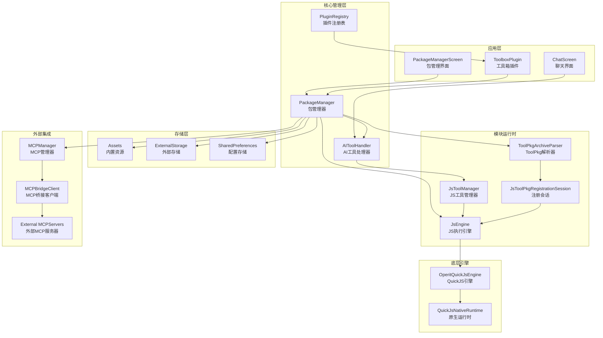

### 2.2 模块层次结构

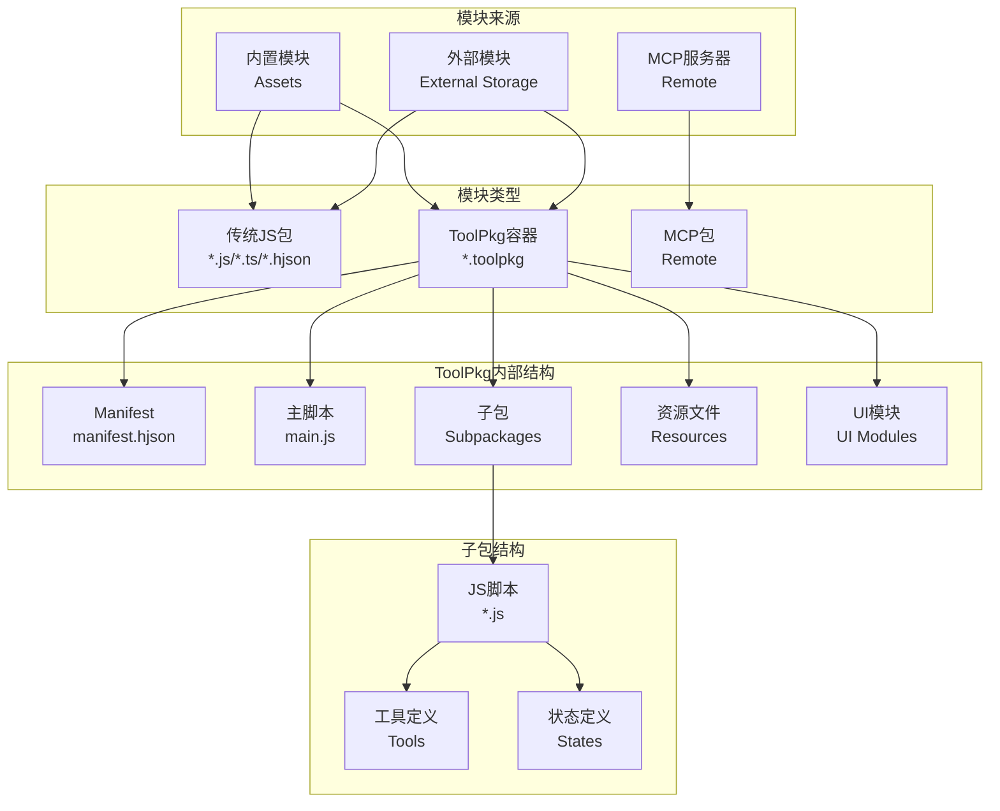

### 2.3 核心类关系图

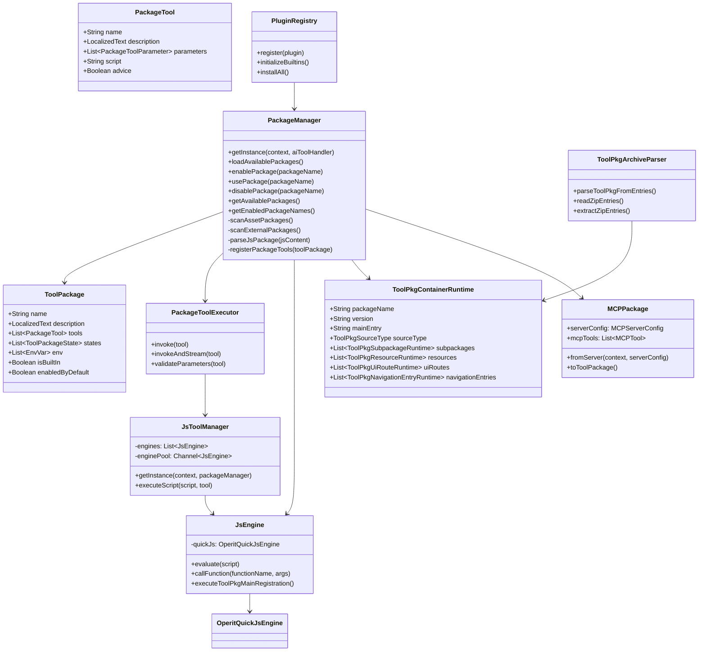

---

## 三、模块生命周期流程图

### 3.1 完整生命周期流程

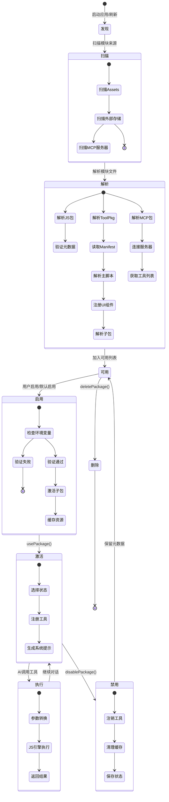

### 3.2 模块加载详细流程

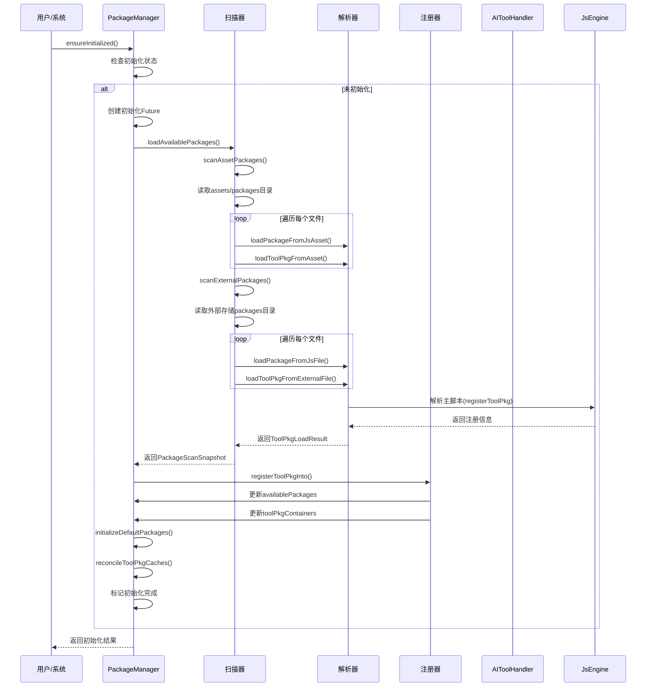

### 3.3 工具执行流程

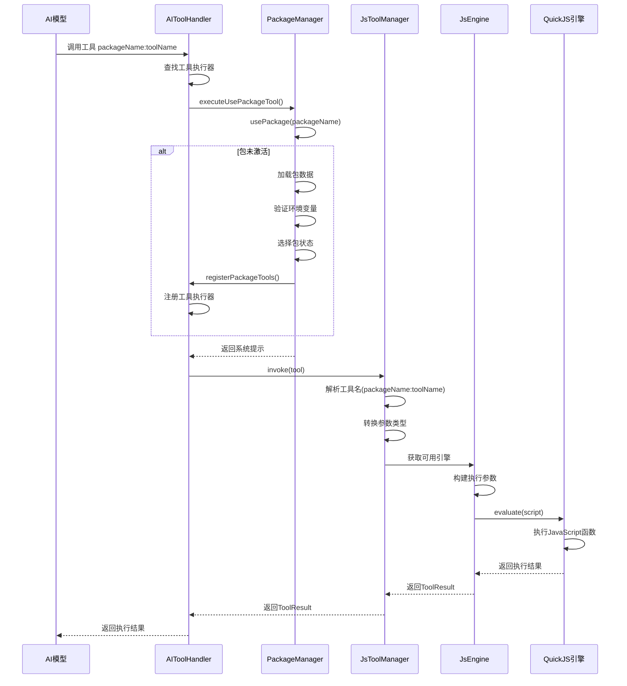

### 3.4 ToolPkg 解析流程

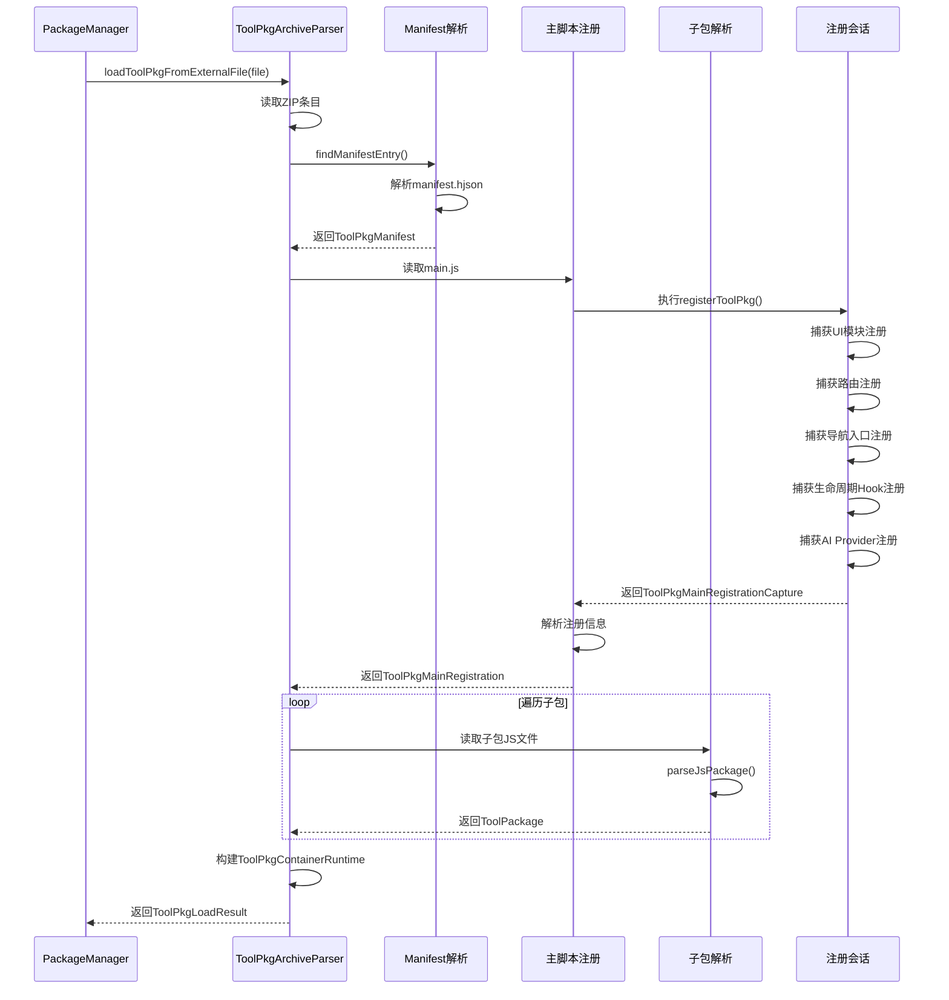

---

## 四、核心设计思想

### 4.1 三层状态管理

模块系统采用三层状态模型：

1. **Available（可用）**：所有扫描到的模块，无论是否启用
2. **Enabled（已启用）**：用户明确启用的模块，但工具尚未注册到 AI
3. **Active（已激活）**：当前会话中已注册工具的模块

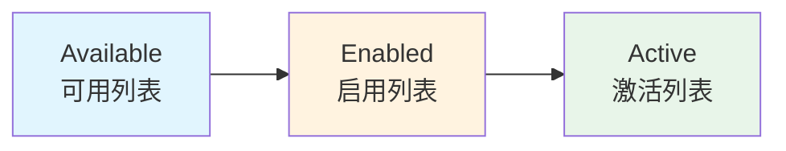

### 4.2 双格式兼容架构

系统同时支持传统 JS 包和新一代 ToolPkg 容器：

| 特性 | 传统 JS 包 | ToolPkg 容器 |
|------|-----------|-------------|
| 文件格式 | `.js`/`.ts`/`.hjson` | `.toolpkg` (ZIP) |
| 元数据位置 | 文件头部注释 | `manifest.hjson` |
| 子包支持 | 否 | 是 |
| 资源文件 | 否 | 是 |
| UI 模块 | 否 | 是 |
| 生命周期 Hook | 否 | 是 |
| 桌面小部件 | 否 | 是 |

### 4.3 沙箱执行模型

JavaScript 代码在隔离的 QuickJS 环境中执行：

- **线程隔离**：每个 JsEngine 运行在独立的单线程执行器中
- **引擎池化**：JsToolManager 维护最多 4 个引擎的池，避免频繁创建销毁
- **资源隔离**：Bitmap、二进制数据、Java 对象分别存储在独立的注册表中
- **超时控制**：支持执行超时和取消机制

### 4.4 Hook 扩展系统

ToolPkg 支持丰富的 Hook 注册点：

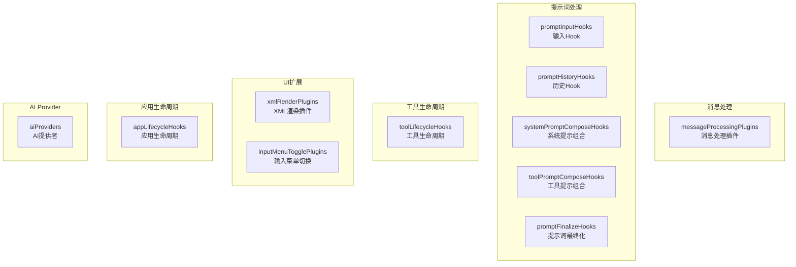

### 4.5 MCP 集成架构

MCP（Model Context Protocol）服务器作为外部模块来源：

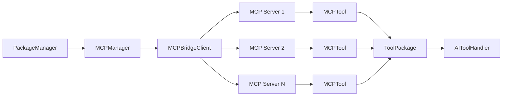

---

## 五、关键代码解析

### 5.1 PackageManager 初始化逻辑

```kotlin
private fun ensureInitializationStarted(): CompletableFuture<Unit> {
    synchronized(initLock) {
        if (isInitialized) {
            return CompletableFuture.completedFuture(Unit)
        }
        initializationFuture?.let { return it }

        val future = CompletableFuture<Unit>()
        initializationFuture = future

        initializationScope.launch {
            try {
                runtimeCachesReady = false
                // 创建外部包目录
                externalPackagesDir
                // 加载可用包信息
                loadAvailablePackages()
                // 自动导入默认包
                initializeDefaultPackages()
                reconcileToolPkgCaches()

                synchronized(initLock) {
                    isInitialized = true
                }
                refreshToolPkgRuntimeState(persistIfChanged = true)
                future.complete(Unit)
            } catch (e: Exception) {
                future.completeExceptionally(e)
            }
        }
        return future
    }
}
```

### 5.2 工具注册机制

```kotlin
private fun registerPackageTools(toolPackage: ToolPackage) {
    val packageToolExecutor = PackageToolExecutor(toolPackage, context, this)
    val executableTools = toolPackage.tools.filter { !it.advice }
    val newToolNames = executableTools.map { "${toolPackage.name}:${it.name}" }.toSet()
    val oldToolNames = activePackageToolNames[toolPackage.name] ?: emptySet()
    
    // 注销旧工具
    (oldToolNames - newToolNames).forEach { toolName ->
        aiToolHandler.unregisterTool(toolName)
    }
    activePackageToolNames[toolPackage.name] = newToolNames

    // 注册新工具
    executableTools.forEach { packageTool ->
        val toolName = "${toolPackage.name}:${packageTool.name}"
        aiToolHandler.registerTool(toolName) { tool ->
            packageToolExecutor.invoke(tool)
        }
    }
}
```

### 5.3 JsEngine 执行模型

```kotlin
class JsEngine(private val context: Context) {
    private val quickJsExecutor = Executors.newSingleThreadExecutor { runnable ->
        Thread(runnable, "OperitQuickJsEngine").apply {
            isDaemon = true
            quickJsThread = this
        }
    }
    private val quickJsDispatcher = quickJsExecutor.asCoroutineDispatcher()

    private fun <T> runOnQuickJsThreadBlocking(block: () -> T): T {
        return if (Thread.currentThread() === quickJsThread) {
            block()
        } else {
            runBlocking(quickJsDispatcher) { block() }
        }
    }

    fun <T> evaluate(script: String, fileName: String = "<eval>"): T? {
        return runOnQuickJsThreadBlocking {
            val result = runtime.eval(script, fileName)
            runtime.executePendingJobs()
            if (!result.success) {
                error(result.describeFailure("QuickJS evaluation failed"))
            }
            decodeJsonValue(result.valueJson) as T?
        }
    }
}
```

### 5.4 ToolPkg 解析核心

```kotlin
internal object ToolPkgArchiveParser {
    fun parseToolPkgFromEntries(
        entries: Map<String, ByteArray>,
        sourceType: ToolPkgSourceType,
        sourcePath: String,
        isBuiltIn: Boolean,
        parseJsPackage: (String, (String, String) -> Unit) -> ToolPackage?,
        parseMainRegistration: (String, String, String) -> ToolPkgMainRegistrationParseResult,
        reportPackageLoadError: (String, String) -> Unit
    ): ToolPkgLoadResult {
        // 1. 查找并解析 manifest
        val manifestEntryName = findManifestEntry(entries)
            ?: throw IllegalArgumentException("manifest.hjson or manifest.json not found")
        val manifest = parseToolPkgManifest(manifestText, manifestEntryName)

        // 2. 读取主脚本
        val mainScriptText = findZipEntryContent(entries, normalizedMainEntry)
            ?.toString(StandardCharsets.UTF_8)
            ?: throw IllegalArgumentException("Cannot find manifest.main entry")

        // 3. 执行主脚本注册
        val mainRegistrationResult = parseMainRegistration(mainScriptText, manifest.toolpkgId, normalizedMainEntry)
        
        // 4. 解析子包
        val subpackagePackages = mutableListOf<ToolPackage>()
        manifest.subpackages.forEach { subpackage ->
            val entryBytes = findZipEntryContent(entries, normalizedSubpackageEntry)
            val jsContent = entryBytes.toString(StandardCharsets.UTF_8)
            val parsedPackage = parseJsPackage(jsContent) { _, error -> reportPackageLoadError(packageName, error) }
            subpackagePackages.add(parsedPackage)
        }

        // 5. 构建运行时对象
        val containerRuntime = ToolPkgContainerRuntime(
            packageName = manifest.toolpkgId,
            displayName = containerDisplayName,
            // ... 其他属性
        )

        return ToolPkgLoadResult(
            containerPackage = containerPackage,
            subpackagePackages = subpackagePackages,
            containerRuntime = containerRuntime
        )
    }
}
```

### 5.5 MCP 包转换

```kotlin
data class MCPPackage(
    val serverConfig: MCPServerConfig,
    val mcpTools: List<MCPTool> = emptyList()
) {
    companion object {
        fun loadFromServer(context: Context, serverConfig: MCPServerConfig): LoadResult {
            val bridgeClient = MCPBridgeClient(context, serverConfig.name)
            val connected = runBlocking { bridgeClient.connect() }
            if (!connected) {
                return LoadResult(null, bridgeClient.getLastConnectionFailureDetail())
            }
            
            val jsonTools = runBlocking { bridgeClient.getTools() }
            val mcpTools = jsonTools.mapNotNull { jsonTool ->
                val name = jsonTool.optString("name", "")
                val description = jsonTool.optString("description", "")
                // 提取参数信息
                val params = mutableListOf<MCPToolParameter>()
                val inputSchema = jsonTool.optJSONObject("inputSchema")
                // ... 参数解析
                MCPTool(name, description, params)
            }
            
            return LoadResult(MCPPackage(serverConfig, mcpTools))
        }
    }

    fun toToolPackage(): ToolPackage {
        val tools = mcpTools.map { mcpTool ->
            PackageTool(
                name = mcpTool.name,
                description = LocalizedText.of(mcpTool.description),
                parameters = mcpTool.parameters.map { /* 转换参数 */ },
                script = generateScriptPlaceholder(serverConfig.name, mcpTool.name)
            )
        }
        
        return ToolPackage(
            name = serverConfig.name,
            description = LocalizedText.of(serverConfig.description),
            tools = tools,
            category = "MCP"
        )
    }
}
```

---

## 六、数据流图

### 6.1 模块加载数据流

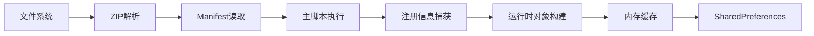

### 6.2 工具执行数据流


---

## 七、缓存机制

### 7.1 ToolPkg 缓存策略

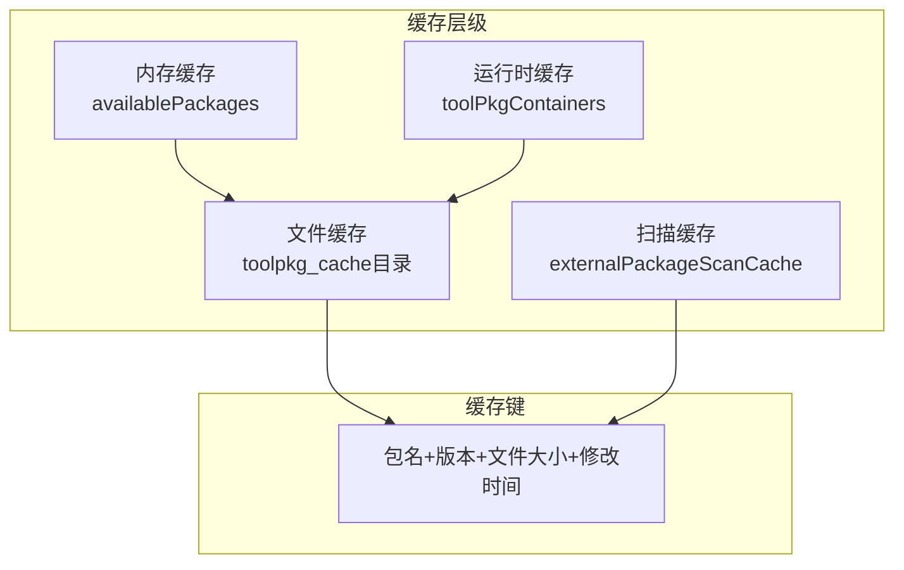

### 7.2 缓存签名构建

```kotlin
private fun buildToolPkgCacheSignature(runtime: ToolPkgContainerRuntime): String? {
    return when (runtime.sourceType) {
        ToolPkgSourceType.EXTERNAL -> {
            buildString {
                append("external|")
                append(sourceFile.absolutePath)
                append('|')
                append(sourceFile.length())
                append('|')
                append(sourceFile.lastModified())
                append('|')
                append(runtime.version)
                append('|')
                append(runtime.mainEntry)
            }
        }
        ToolPkgSourceType.ASSET -> {
            buildString {
                append("asset|")
                append(runtime.sourcePath)
                append('|')
                append(apkFile.length())
                append('|')
                append(apkFile.lastModified())
            }
        }
    }
}
```

---

## 八、安全设计

### 8.1 执行隔离

- **线程隔离**：每个 JsEngine 运行在独立线程
- **引擎隔离**：不同模块使用不同的引擎实例
- **资源隔离**：通过注册表管理共享资源

### 8.2 包来源验证

```kotlin
private fun isExternalPackageSourcePath(sourcePath: String?): Boolean {
    if (sourcePath.isNullOrBlank()) return false
    val candidateCanonicalPath = runCatching { File(sourcePath).canonicalPath }.getOrElse { return false }
    val externalRootCanonicalPath = runCatching { externalPackagesDir.canonicalPath }.getOrElse { externalPackagesDir.absolutePath }
    return candidateCanonicalPath.equals(externalRootCanonicalPath, ignoreCase = true) ||
        candidateCanonicalPath.startsWith(externalRootCanonicalPath + File.separator, ignoreCase = true)
}
```

### 8.3 环境变量控制

```kotlin
// 验证必需的环境变量
val missingRequiredEnv = mutableListOf<String>()
toolPackage.env.forEach { envVar ->
    val value = envPreferences.getEnv(envVar.name)
    if (envVar.required && value.isNullOrEmpty()) {
        missingRequiredEnv.add(envVar.name)
    }
}
if (missingRequiredEnv.isNotEmpty()) {
    return "Package requires environment variables: ${missingRequiredEnv.joinToString(", ")}"
}
```

---

## 九、UI 集成架构

### 9.1 Compose DSL 渲染流程

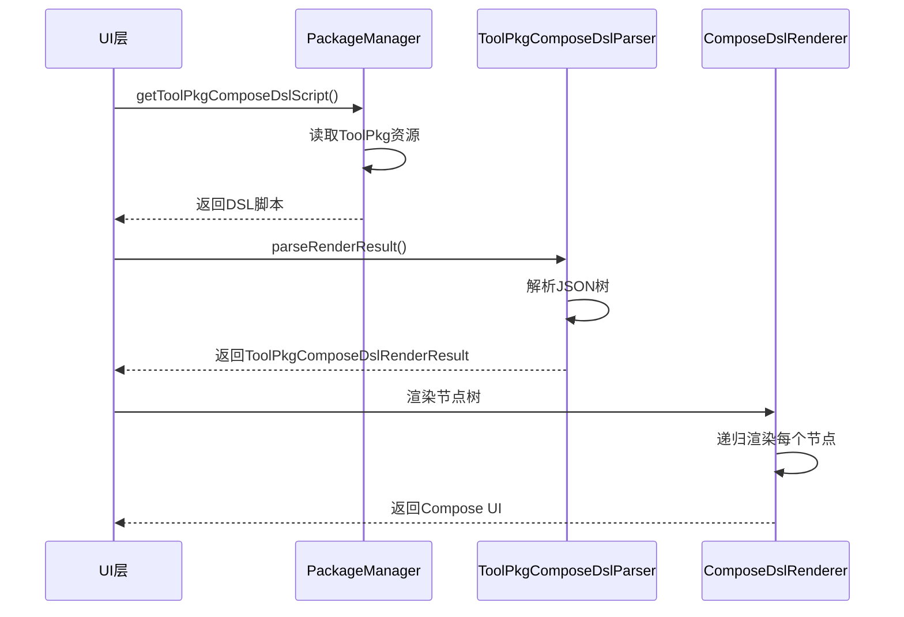

### 9.2 导航入口注册

```kotlin
// ToolPkg 可以注册导航入口
data class ToolPkgNavigationEntryRuntime(
    val id: String,
    val routeId: String,
    val surface: String,  // "toolbox" 或 "main_sidebar_plugins"
    val title: LocalizedText,
    val action: ToolPkgNavigationActionHookRuntime? = null,
    val icon: String? = null,
    val order: Int = 0
)
```

---

## 十、总结

Operit 的本地模块系统是一个设计精良、功能丰富的插件化架构，具有以下特点：

1. **高度可扩展**：支持多种模块格式和丰富的扩展点
2. **安全可靠**：通过 QuickJS 沙箱和线程隔离保证执行安全
3. **性能优化**：引擎池化、多级缓存、异步加载
4. **生态友好**：支持传统 JS 包、ToolPkg 容器和 MCP 服务器
5. **UI 深度集成**：支持 Compose DSL、导航入口、桌面小部件
6. **生命周期完整**：从发现到卸载的完整生命周期管理

该系统为 Operit 提供了强大的扩展能力，使第三方开发者能够轻松地为应用添加新功能，同时保持了核心应用的稳定性和安全性。
