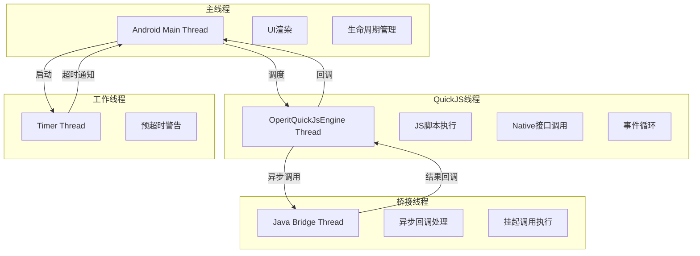
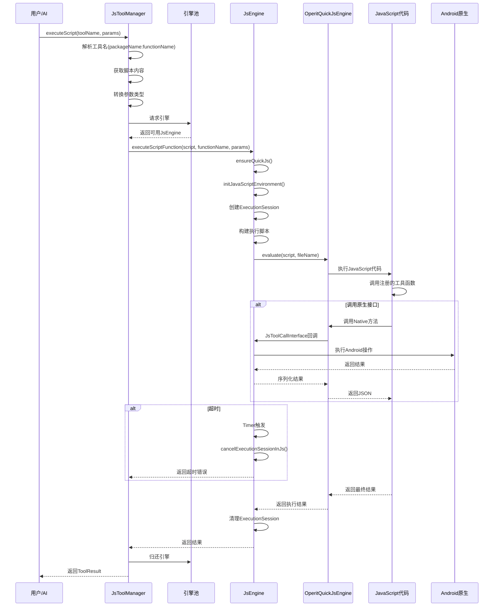
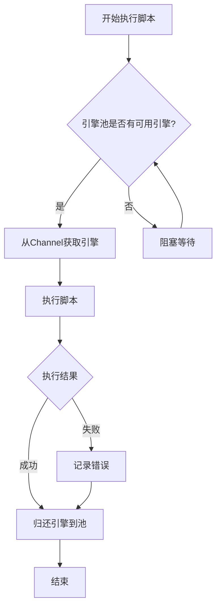
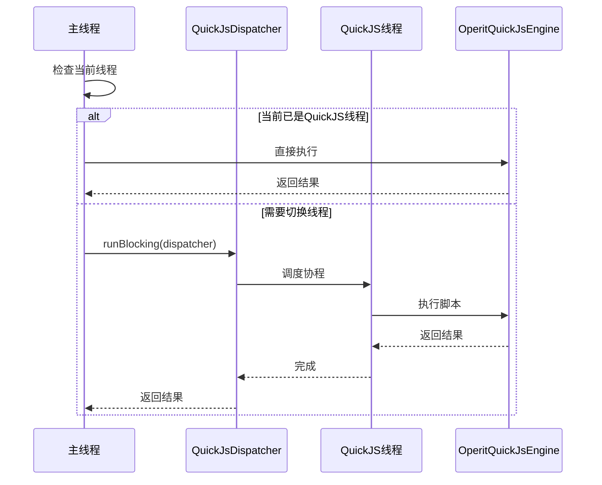
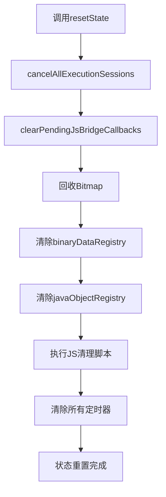
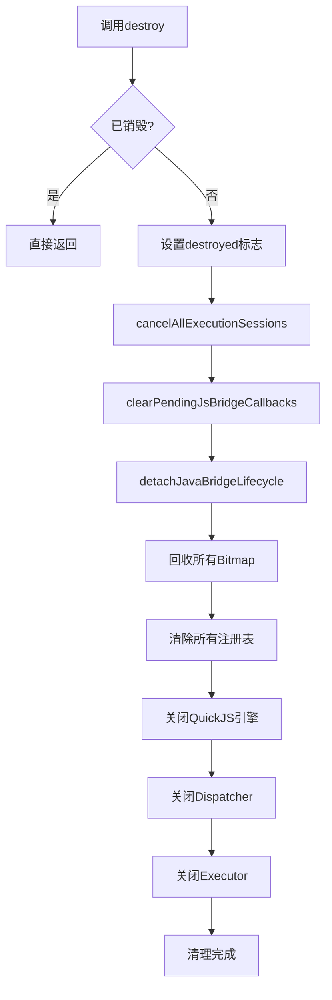
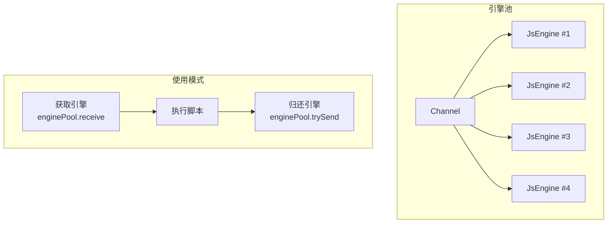
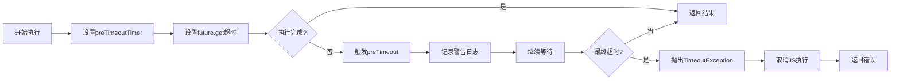

# Operit 沙箱执行系统设计思想与详细流程分析

## 一、概述

Operit 的沙箱执行系统（Sandbox Execution System）是项目的核心安全架构，负责在隔离环境中执行不可信的 JavaScript 代码。该系统基于 QuickJS 引擎构建，通过多层隔离机制确保外部代码无法直接访问或破坏宿主系统的关键资源。

### 1.1 设计目标

- **执行隔离**：所有 JavaScript 代码在独立的线程和内存空间中执行
- **资源控制**：严格限制脚本对系统资源（文件、网络、内存）的访问
- **状态隔离**：每个执行会话拥有独立的状态，防止会话间数据泄露
- **超时控制**：防止脚本无限执行导致资源耗尽
- **安全桥接**：提供受控的 JavaScript ↔ Java 双向通信机制
- **错误隔离**：脚本错误不会导致宿主应用崩溃

### 1.2 核心组件

| 组件 | 职责 | 文件位置 |
|------|------|---------|
| **JsEngine** | 沙箱引擎核心，管理 QuickJS 运行时和资源 | `JsEngine.kt` |
| **JsToolManager** | 引擎池管理器，调度多个 JsEngine 实例 | `JsToolManager.kt` |
| **OperitQuickJsEngine** | QuickJS 引擎封装，提供底层 JS 执行能力 | `OperitQuickJsEngine.kt` |
| **JsExternalJavaCodeLoader** | 外部 Java 代码加载器，实现类加载器隔离 | `JsExternalJavaCodeLoader.kt` |
| **JsToolPkgExecutionContext** | 工具包执行上下文，管理临时资源解析 | `JsToolPkgExecutionContext.kt` |
| **JsToolPkgRegistrationSession** | 注册会话管理，捕获 UI 模块和 Hook 注册 | `JsToolPkgRegistrationSession.kt` |

---

## 二、软件架构图

### 2.1 沙箱执行系统整体架构

```mermaid
graph TB
    subgraph "应用层"
        A[ChatActivity]
        B[PackageManager]
        C[ToolExecutionManager]
    end

    subgraph "引擎管理层"
        D[JsToolManager]
        E[引擎池<br/>Channel<JsEngine>]
        F[MAX_CONCURRENT_ENGINES=4]
    end

    subgraph "沙箱引擎层"
        G[JsEngine #1]
        H[JsEngine #2]
        I[JsEngine #3]
        J[JsEngine #4]
    end

    subgraph "QuickJS运行时层"
        K[OperitQuickJsEngine]
        L[QuickJS Native]
        M[JS Bootstrap Modules]
    end

    subgraph "资源隔离层"
        N[BitmapRegistry]
        O[BinaryDataRegistry]
        P[JavaObjectRegistry]
        Q[ExternalJavaCodeLoader]
    end

    subgraph "JavaScript接口层"
        R[JsToolCallInterface]
        S[@JavascriptInterface]
        T[Native Bridge]
    end

    subgraph "执行会话层"
        U[ExecutionSession]
        V[PendingJsBridgeCallback]
        W[CompletableFuture]
    end

    A --> D
    B --> D
    C --> D
    D --> E
    E --> G
    E --> H
    E --> I
    E --> J
    G --> K
    H --> K
    I --> K
    J --> K
    K --> L
    K --> M
    G --> N
    G --> O
    G --> P
    G --> Q
    G --> R
    R --> S
    S --> T
    G --> U
    G --> V
    U --> W
```

### 2.2 线程隔离架构



### 2.3 资源注册表架构

```mermaid
graph LR
    subgraph "资源注册表"
        A[ConcurrentHashMap<String, Bitmap>]
        B[ConcurrentHashMap<String, ByteArray>]
        C[ConcurrentHashMap<String, Any>]
    end

    subgraph "访问控制"
        D[BitmapHandle]
        E[BinaryHandle<br/>@binary_handle:]
        F[JavaObjectHandle]
    end

    subgraph "生命周期"
        G[创建]
        H[使用]
        I[回收/清除]
    end

    A --> D
    B --> E
    C --> F
    D --> G
    E --> G
    F --> G
    G --> H
    H --> I
```

---

## 三、沙箱执行流程图

### 3.1 完整执行流程



### 3.2 引擎池调度流程



### 3.3 线程切换流程



### 3.4 状态重置流程



### 3.5 销毁流程



---

## 四、核心设计思想

### 4.1 线程隔离模型

所有 JavaScript 代码在独立的单线程执行器中运行：

```kotlin
private val quickJsExecutor = Executors.newSingleThreadExecutor { runnable ->
    Thread(runnable, "OperitQuickJsEngine").apply {
        isDaemon = true
        quickJsThread = this
    }
}
private val quickJsDispatcher = quickJsExecutor.asCoroutineDispatcher()
```

**设计特点**：
- **单线程执行**：避免多线程竞争和死锁
- **守护线程**：不阻止 JVM 退出
- **线程标识**：通过 `quickJsThread` 变量标识当前线程
- **线程检查**：`runOnQuickJsThreadBlocking` 自动判断是否需要线程切换

### 4.2 引擎池化模型



**设计特点**：
- **固定数量**：`MAX_CONCURRENT_ENGINES = 4`，防止资源耗尽
- **Channel 调度**：使用 Kotlin Channel 实现生产者-消费者模式
- **自动归还**：`withEngine` 模式确保引擎使用完毕后归还
- **阻塞等待**：当所有引擎都被占用时，请求会阻塞等待

### 4.3 资源注册表隔离

三个独立的 ConcurrentHashMap 管理不同类型的资源：

| 注册表 | 类型 | 用途 | 清理方式 |
|-------|------|------|---------|
| **bitmapRegistry** | `ConcurrentHashMap<String, Bitmap>` | 存储图片资源 | `recycle()` + `clear()` |
| **binaryDataRegistry** | `ConcurrentHashMap<String, ByteArray>` | 存储二进制数据 | `clear()` |
| **javaObjectRegistry** | `ConcurrentHashMap<String, Any>` | 存储Java对象引用 | `clear()` |

**安全特性**：
- **句柄访问**：通过随机生成的 UUID 句柄访问，而非直接引用
- **自动回收**：引擎重置时自动清理所有资源
- **内存控制**：Bitmap 显式调用 `recycle()` 释放内存

### 4.4 执行会话隔离

每个脚本执行都有独立的 `ExecutionSession`：

```kotlin
private data class ExecutionSession(
    val callId: String,
    val future: CompletableFuture<Any?>,
    val intermediateResultCallback: ((Any?) -> Unit)?,
    val envOverrides: Map<String, String>,
    val packageChatId: String?,
    val toolPkgLogSnapshot: JsToolPkgExecutionContext.LogSnapshot,
    val executionListener: JsExecutionListener?
)
```

**隔离特性**：
- **独立 Future**：每个会话有自己的 CompletableFuture
- **环境覆盖**：支持会话级别的环境变量覆盖
- **聊天隔离**：通过 `packageChatId` 支持按聊天取消执行
- **日志快照**：记录执行上下文便于调试

### 4.5 超时控制机制



**超时参数**：
- **主超时**：`JsTimeoutConfig.MAIN_TIMEOUT_SECONDS`（默认 60 秒）
- **预超时**：`JsTimeoutConfig.PRE_TIMEOUT_SECONDS`（提前警告）
- **脚本超时**：`JsTimeoutConfig.SCRIPT_TIMEOUT_MS`（协程级别）

---

## 五、关键代码解析

### 5.1 引擎初始化与线程安全

```kotlin
private fun ensureQuickJs() {
    check(!destroyed.get()) { "JsEngine already destroyed" }
    if (quickJs != null) {
        return
    }
    synchronized(quickJsInitLock) {
        check(!destroyed.get()) { "JsEngine already destroyed" }
        if (quickJs != null) {
            return
        }
        try {
            val engine = runOnQuickJsThreadBlocking {
                OperitQuickJsEngine().also {
                    it.bindNativeInterface(toolCallInterface)
                }
            }
            quickJs = engine
        } catch (e: Exception) {
            AppLogger.e(TAG, "Error initializing QuickJS: ${e.message}", e)
            throw e
        }
    }
}
```

**设计思想**：
- **双重检查锁定**：先检查后同步，提高性能
- **线程安全初始化**：在 QuickJS 线程中创建引擎
- **Native 接口绑定**：初始化时绑定 JavaScript 接口
- **异常处理**：初始化失败时记录日志并抛出异常

### 5.2 引擎池调度实现

```kotlin
class JsToolManager private constructor(
    private val context: Context,
    private val packageManager: PackageManager
) {
    companion object {
        private const val MAX_CONCURRENT_ENGINES = 4
    }

    private val engines = List(MAX_CONCURRENT_ENGINES) { JsEngine(context) }
    private val enginePool = Channel<JsEngine>(capacity = MAX_CONCURRENT_ENGINES).also { pool ->
        engines.forEach(pool::trySend)
    }

    private suspend fun <T> withEngine(block: suspend (JsEngine) -> T): T {
        val engine = enginePool.receive()
        return try {
            block(engine)
        } finally {
            enginePool.trySend(engine)
        }
    }

    private fun <T> withEngineBlocking(block: (JsEngine) -> T): T {
        return runBlocking {
            withEngine { engine -> block(engine) }
        }
    }
}
```

**设计思想**：
- **固定引擎数量**：防止资源无限增长
- **Channel 通信**：使用 Kotlin Channel 实现线程安全调度
- **自动归还**：`finally` 确保引擎一定归还
- **阻塞模式**：`withEngineBlocking` 支持同步调用

### 5.3 脚本执行封装

```kotlin
internal fun executeScriptFunction(
    script: String,
    functionName: String,
    params: Map<String, Any?>,
    envOverrides: Map<String, String> = emptyMap(),
    onIntermediateResult: ((Any?) -> Unit)? = null,
    timeoutSec: Long = JsTimeoutConfig.MAIN_TIMEOUT_SECONDS.toLong(),
    executionListener: JsExecutionListener? = null
): Any? {
    // 1. 确保引擎初始化
    ensureQuickJs()
    if (!jsEnvironmentInitialized) {
        initJavaScriptEnvironment()
    }

    // 2. 创建执行会话
    val callId = nextExecutionCallId()
    val session = createExecutionSession(
        callId = callId,
        script = script,
        functionName = functionName,
        params = params,
        envOverrides = envOverrides,
        onIntermediateResult = onIntermediateResult,
        executionListener = executionListener
    )
    activeExecutionSessions[callId] = session

    // 3. 构建执行参数
    val executionArgsJson = JSONArray()
        .put(callId)
        .put(paramsObject)
        .put(script)
        .put(functionName)
        .put(safeTimeoutSec)
        .put(preTimeoutMs)
        .toString()

    // 4. 启动执行
    launchQuickJsFunctionCall(
        functionName = TOOLPKG_EXECUTION_ENTRY_FUNCTION,
        argsJson = executionArgsJson,
        callSite = "quickjs/runtime/execute-script.call"
    )

    // 5. 等待结果（带超时）
    val preTimeoutTimer = java.util.Timer()
    return try {
        preTimeoutTimer.schedule(/* 预超时警告 */)
        session.future.get(safeTimeoutSec, TimeUnit.SECONDS)
    } catch (e: TimeoutException) {
        cancelExecutionSessionInJs(callId, "Script execution timed out")
        "Error: Script execution timed out"
    } finally {
        preTimeoutTimer.cancel()
    }
}
```

**设计思想**：
- **会话管理**：每个执行都有独立的会话和 Future
- **参数序列化**：使用 JSON 传递参数，类型安全
- **超时控制**：双层超时（预超时警告 + 最终超时）
- **错误处理**：超时后主动取消 JS 执行

### 5.4 状态重置实现

```kotlin
private fun resetState(cancellationMessage: String = "Execution canceled: new execution started") {
    // 1. 取消所有执行会话
    cancelAllExecutionSessions(cancellationMessage)
    
    // 2. 清除挂起的桥接回调
    clearPendingJsBridgeCallbacks("java bridge callback canceled: $cancellationMessage")
    
    // 3. 回收Bitmap资源
    bitmapRegistry.values.forEach { it.recycle() }
    bitmapRegistry.clear()
    
    // 4. 清除其他注册表
    binaryDataRegistry.clear()
    javaObjectRegistry.clear()
    
    // 5. 执行JS清理脚本
    if (quickJs != null) {
        launchQuickJsEvaluation(
            script = """
                (function() {
                    var root = typeof globalThis !== 'undefined'
                        ? globalThis
                        : (typeof window !== 'undefined' ? window : this);
                    if (typeof root.__operitClearAllTimers === 'function') {
                        root.__operitClearAllTimers();
                    }
                })();
            """.trimIndent(),
            fileName = "quickjs/runtime/reset-state.js"
        )
    }
}
```

**设计思想**：
- **全面清理**：取消会话、清除回调、回收资源
- **显式回收**：Bitmap 调用 `recycle()` 释放内存
- **JS 清理**：执行脚本清除 JavaScript 定时器
- **原子操作**：确保状态一致性

### 5.5 销毁流程实现

```kotlin
fun destroy() {
    if (!destroyed.compareAndSet(false, true)) {
        return
    }
    try {
        // 1. 取消所有执行
        cancelAllExecutionSessions("Engine destroyed")
        clearPendingJsBridgeCallbacks("java bridge callback canceled: Engine destroyed")
        toolCallInterface.detachJavaBridgeLifecycle()

        // 2. 清理资源注册表
        bitmapRegistry.values.forEach { it.recycle() }
        bitmapRegistry.clear()
        binaryDataRegistry.clear()
        javaObjectRegistry.clear()

        // 3. 关闭QuickJS引擎
        val engine = quickJs
        if (engine != null) {
            runOnQuickJsThreadBlocking(allowWhenDestroyed = true) {
                engine.close()
            }
        }
        quickJs = null
        quickJsThread = null
        jsEnvironmentInitialized = false

        // 4. 关闭调度器
        quickJsDispatcher.close()
        quickJsExecutor.shutdownNow()
    } catch (e: Exception) {
        AppLogger.e(TAG, "Error during JsEngine destruction: ${e.message}", e)
    }
}
```

**设计思想**：
- **原子标志**：`compareAndSet` 确保只销毁一次
- **资源释放**：按依赖顺序释放资源
- **线程安全**：在 QuickJS 线程中关闭引擎
- **异常处理**：即使出错也继续清理

---

## 六、JavaScript 接口设计

### 6.1 Native 接口桥接

`JsToolCallInterface` 提供了丰富的 `@JavascriptInterface` 方法：

| 类别 | 方法 | 说明 |
|------|------|------|
| **包管理** | `isPackageImported` | 检查包是否已导入 |
| | `importPackage` | 导入包 |
| | `removePackage` | 移除包 |
| | `usePackage` | 使用包 |
| **工具调用** | `callTool` | 同步调用工具 |
| | `callToolAsync` | 异步调用工具 |
| | `callToolAsyncStreaming` | 流式调用工具 |
| **资源管理** | `readToolPkgResource` | 读取工具包资源 |
| | `readToolPkgTextResource` | 读取文本资源 |
| **Java桥接** | `javaClassExists` | 检查类是否存在 |
| | `javaNewInstance` | 创建实例 |
| | `javaCallStatic` | 调用静态方法 |
| | `javaCallInstance` | 调用实例方法 |
| **UI操作** | `navigateToRoute` | 导航到路由 |
| | `measureComposeText` | 测量文本 |
| **日志** | `logInfo` | 记录信息日志 |
| | `logError` | 记录错误日志 |
| | `reportError` | 报告详细错误 |

### 6.2 桥接调用安全限制

```kotlin
private fun invokeJavaBridgeJsObjectCallbackSync(
    jsObjectId: String,
    methodName: String,
    argsJson: String
): String {
    // 禁止在主线程同步调用
    if (Looper.myLooper() == Looper.getMainLooper()) {
        return JSONObject()
            .put("success", false)
            .put("error", "java bridge callback cannot synchronously invoke JS on main thread")
            .toString()
    }

    // 禁止在QuickJS线程同步调用
    if (Thread.currentThread() === quickJsThread) {
        return JSONObject()
            .put("success", false)
            .put("error", "java bridge callback cannot synchronously invoke JS from quickjs thread")
            .toString()
    }

    // 执行调用...
}
```

**安全限制**：
- **主线程禁止**：防止阻塞 UI
- **QuickJS 线程禁止**：防止死锁
- **超时控制**：30 秒超时
- **自动清理**：完成后移除回调映射

---

## 七、外部代码加载隔离

### 7.1 类加载器隔离

```kotlin
class PrefixIsolatedDexClassLoader(
    dexPath: String,
    optimizedDirectory: File?,
    librarySearchPath: String?,
    parent: ClassLoader
) : DexClassLoader(dexPath, optimizedDirectory, librarySearchPath, parent) {
    override fun loadClass(name: String, resolve: Boolean): Class<*> {
        // 优先加载指定前缀的类
        if (name.startsWith("com.ai.assistance.operit.")) {
            return super.loadClass(name, resolve)
        }
        // 其他类委托给父加载器
        return parent.loadClass(name)
    }
}
```

**隔离特性**：
- **前缀隔离**：按包名前缀隔离类加载
- **双亲委派**：非隔离类委托给父加载器
- **独立实例**：每个外部代码有独立的 ClassLoader

### 7.2 文件系统隔离

```kotlin
private fun prepareLoadableSourceFile(
    sourceType: SourceType,
    sourceFile: File,
    canonicalPath: String
): File {
    val targetDir = ensurePreparedSourceDir()
    val targetFile = File(targetDir, buildPreparedSourceFileName(sourceType, canonicalPath))

    // 设置只读权限
    sourceFile.inputStream().use { input ->
        FileOutputStream(targetFile).use { output ->
            require(targetFile.setReadOnly()) { "failed to mark read-only" }
            input.copyTo(output)
            output.fd.sync()
        }
    }

    // 验证文件属性
    require(targetFile.exists() && targetFile.isFile)
    require(targetFile.canRead())
    require(!targetFile.canWrite()) { "must be read-only" }

    return targetFile
}
```

**隔离特性**：
- **只读文件**：防止运行时修改
- **SHA-256 命名**：防止文件名冲突
- **属性验证**：确保文件状态符合预期
- **安全目录**：复制到应用私有目录

---

## 八、错误处理与日志

### 8.1 错误提取与格式化

```kotlin
private fun extractErrorLogMessage(error: String): String {
    return try {
        if (error.startsWith("{") && error.endsWith("}")) {
            val errorJson = JSONObject(error)
            if (errorJson.has("formatted")) {
                return errorJson.getString("formatted")
            }
            if (errorJson.has("error") && errorJson.has("message")) {
                val errorType = errorJson.getString("error")
                val errorMsg = errorJson.getString("message")
                var message = "$errorType: $errorMsg"
                if (errorJson.has("details")) {
                    val details = errorJson.getJSONObject("details")
                    if (details.has("fileName") && details.has("lineNumber")) {
                        message += "\nAt ${details.getString("fileName")}:${details.getString("lineNumber")}"
                    }
                    if (details.has("stack")) {
                        message += "\nStack: ${details.getString("stack")}"
                    }
                }
                return message
            }
        }
        error
    } catch (e: Exception) {
        AppLogger.d(TAG, "Error parsing error message as JSON: ${e.message}")
        error
    }
}
```

**设计特点**：
- **JSON 解析**：提取结构化的错误信息
- **堆栈跟踪**：保留文件位置和堆栈信息
- **降级处理**：解析失败时返回原始错误

### 8.2 执行监听器

```kotlin
interface JsExecutionListener {
    fun onCallLog(callId: String, level: String, message: String)
    fun onIntermediateResult(callId: String, value: Any?)
    fun onCompleted(callId: String, result: String)
    fun onFailed(callId: String, error: String)
}
```

**用途**：
- **日志收集**：收集脚本执行日志
- **中间结果**：获取流式执行结果
- **完成通知**：执行完成时通知
- **错误通知**：执行失败时通知

---

## 九、总结

Operit 的沙箱执行系统体现了以下核心设计思想：

1. **线程隔离**：所有 JS 代码在独立的单线程执行器中运行，避免多线程竞争
2. **引擎池化**：固定数量的引擎实例，通过 Channel 实现高效调度
3. **资源隔离**：三个独立的 ConcurrentHashMap 管理不同类型的资源
4. **会话隔离**：每个执行都有独立的会话和 Future，支持按聊天取消
5. **超时控制**：双层超时机制（预超时警告 + 最终超时），防止资源耗尽
6. **安全桥接**：受控的 JavaScript ↔ Java 双向通信，禁止危险操作
7. **状态重置**：全面的状态清理，确保每次执行的独立性
8. **错误隔离**：脚本错误不会导致宿主应用崩溃

该沙箱系统为 Operit 提供了安全、可靠的脚本执行环境，使第三方模块能够在受控条件下运行，同时保护了宿主系统的安全。
