# Operit 测试策略设计思想与详细流程分析

## 一、概述

Operit 项目采用了一套多层次、多类型的测试策略，覆盖从底层工具函数到复杂业务逻辑的各个方面。测试体系以 **JUnit 4** 为核心框架，结合 **AndroidJUnit4** 进行仪器化测试，通过精细的测试分类和针对性的测试方法，确保代码质量和功能稳定性。

### 1.1 设计目标

- **全面覆盖**：覆盖单元测试、集成测试、仪器化测试等多个层次
- **快速反馈**：单元测试在 JVM 上快速运行，提供即时反馈
- **真实环境验证**：仪器化测试在 Android 环境中验证实际行为
- **回归防护**：通过自动化测试防止功能退化
- **边界条件验证**：重点测试边界条件和异常情况

### 1.2 测试类型概览

| 测试类型 | 测试框架 | 运行环境 | 测试范围 | 文件位置 |
|---------|---------|---------|---------|---------|
| **单元测试** | JUnit 4 | JVM | 纯逻辑、算法、工具函数 | `src/test/java/` |
| **仪器化测试** | AndroidJUnit4 | Android 模拟器/设备 | 依赖 Android 环境的组件 | `src/androidTest/java/` |

---

## 二、软件架构图

### 2.1 测试体系整体架构

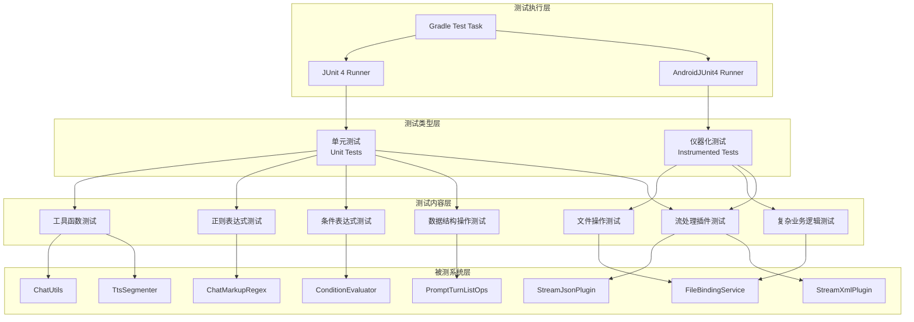

### 2.2 测试依赖架构

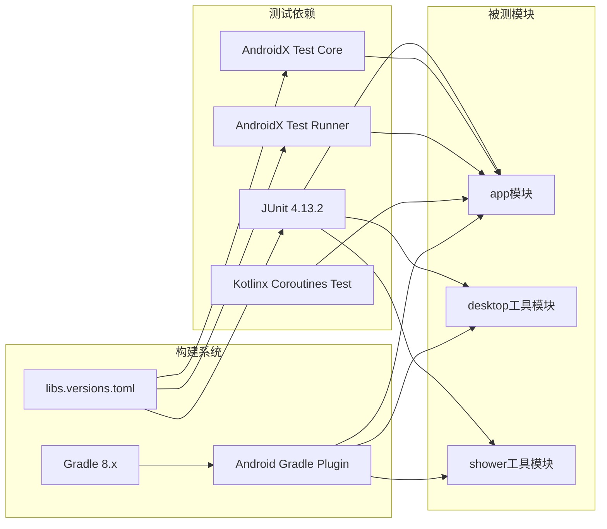

### 2.3 测试类关系图

```mermaid
classDiagram
    class ChatUtilsTest {
        +stripGeminiThoughtSignatureMeta_removesMatchingMeta()
        +stripGeminiThoughtSignatureMeta_preservesPlainText()
        +geminiProviderModel_recognizesGooglePrefix()
        +removeThinkingContent_removesThinkBlock()
        +extractThinkingContent_returnsCleanContent()
        +estimateTokenCount_countsEnglishApproximately()
        +extractJson_returnsEmbeddedObject()
        +extractJsonArray_returnsEmbeddedArray()
    }

    class ToolingRegressionTest {
        +toolResultAnyPattern_matchesToolResult()
        +toolResultWithNameAnyPattern_extractsNameAndBody()
        +statusPattern_extractsBody()
        +nameAttr_extractsNameAttribute()
        +contentTag_extractsInnerContent()
        +attachmentDataTag_extractsAttachmentPayload()
    }

    class ConditionEvaluatorTest {
        +emptyExpression_defaultsToTrue()
        +booleanTrueLiteral_isTrue()
        +identifierReadsBooleanCapability()
        +unaryNot_invertsTruthyValue()
        +andOperator_requiresBothSides()
        +orOperator_acceptsOneTruthySide()
        +equality_comparesNumbers()
        +greaterThan_comparesNumbers()
        +inOperator_matchesArrayLiteral()
    }

    class PromptTurnListOpsTest {
        +withContent_returnsSameInstanceWhenUnchanged()
        +appendUserTurnIfMissing_appendsWhenLastDiffers()
        +mergeAdjacentTurns_mergesUserTurns()
        +roleContentPairs_roundTrip()
    }

    class TtsSegmenterTest {
        +decimalNumber_isNotSplitByDot()
        +versionNumber_isNotSplitByDot()
        +sentenceEndingDot_stillSplitsNormally()
    }

    class StreamJsonPluginTest {
        +testSimpleJsonObject()
        +testNestedJsonObject()
        +testJsonWithEscapedChars()
        +testSimpleJsonObject_Pure()
        +testNestedJsonObject_Pure()
    }

    class StreamXmlPluginTest {
        +testInitialState()
        +testStartTagDetection()
        +testEndTagRecognition()
        +testFailedMatch()
        +testResetFunction()
    }

    class FileBindingServiceTest {
        +testComplexMixedOperations_ShouldApplyCorrectly()
        +testBoundaryOperations_AtStartAndEndOfFile()
        +testFuzzyReplace_ShouldNotEarlyStopOnWrongWindowSize()
        +testHighComplexityMixedOperations_ShouldSucceed()
        +testExtremeComplexity_TortureTest()
    }

    class ToolExecutionManagerTest {
        +testToolExecution()
    }

    class StreamAndroidTest {
        +testStreamProcessing()
    }
```

---

## 三、测试流程图

### 3.1 单元测试执行流程

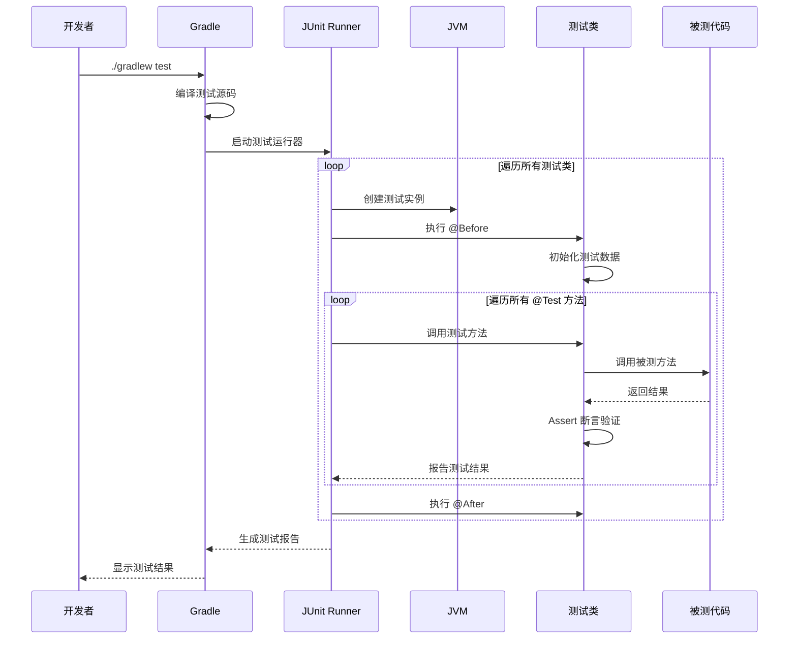

### 3.2 仪器化测试执行流程

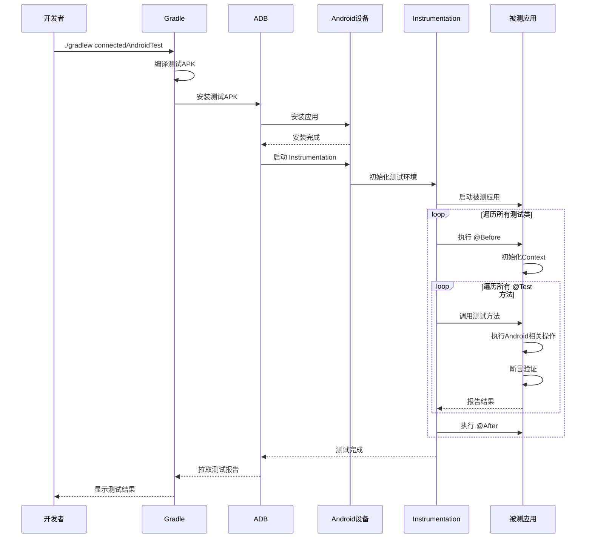

### 3.3 测试分类与选择流程

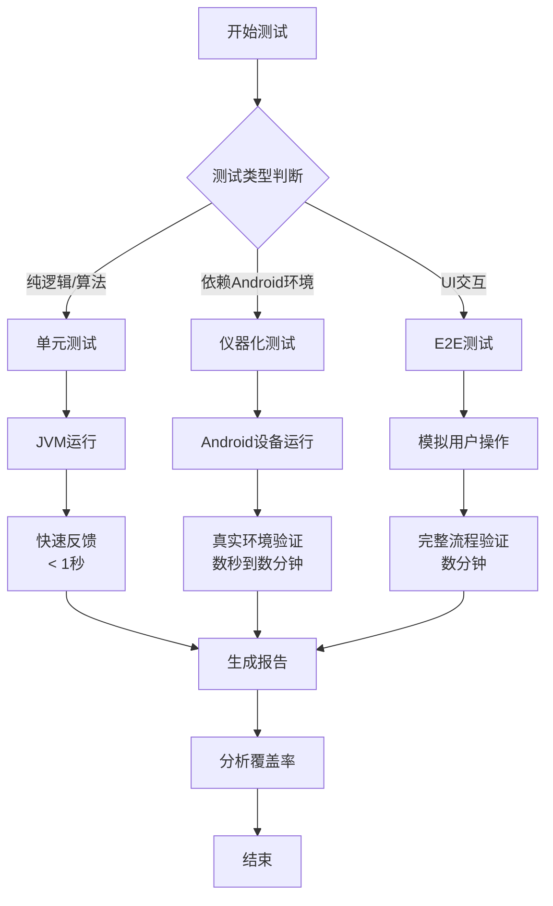

---

## 四、核心设计思想

### 4.1 测试金字塔模型

Operit 的测试策略遵循经典的测试金字塔模型：


**当前项目特点**：
- **单元测试为主**：大量纯 JVM 测试，覆盖工具函数、正则表达式、条件表达式等
- **仪器化测试为辅**：针对依赖 Android Context 的组件进行测试
- **缺乏 E2E 测试**：目前未发现 UI 自动化测试或完整流程测试

### 4.2 命名驱动测试设计

项目采用 **描述性命名规范**，每个测试方法名清晰描述测试场景和预期结果：

```kotlin
// 格式: [被测方法]_[场景]_[预期结果]
@Test fun stripGeminiThoughtSignatureMeta_removesMatchingMeta()
@Test fun emptyExpression_defaultsToTrue()
@Test fun decimalNumber_isNotSplitByDot()
@Test fun testComplexMixedOperations_ShouldApplyCorrectly()
```

**命名规范特点**：
- 使用下划线分隔语义单元
- 包含被测方法名、测试场景、预期结果
- 无需注释即可理解测试意图
- 便于测试失败时快速定位问题

### 4.3 边界条件优先

测试设计重点关注边界条件和异常情况：

| 测试类 | 边界条件覆盖 |
|-------|------------|
| `ConditionEvaluatorTest` | 空表达式、空白表达式、未定义标识符、未闭合字符串、不平衡括号 |
| `ChatUtilsTest` | 未闭合的 think 标签、空字符串、混合文本 |
| `FileBindingServiceTest` | 文件开头/结尾操作、空行、越界行号 |
| `TtsSegmenterTest` | 小数点、版本号、句尾句号 |

### 4.4 状态机测试

`StreamXmlPluginTest` 采用状态机测试方法：

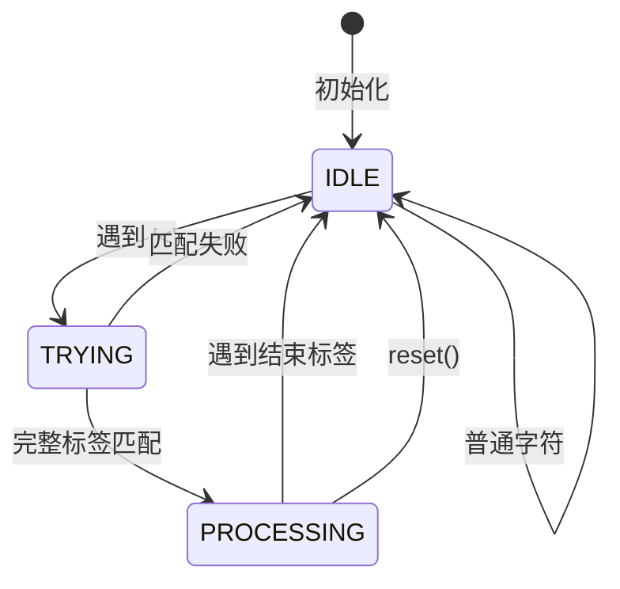

测试覆盖所有状态转换路径，确保状态机正确性。

### 4.5 数据驱动测试

`FileBindingServiceTest` 采用数据驱动测试思想，通过多组复杂数据验证同一功能：

- **简单场景**：单行插入、删除
- **边界场景**：文件开头/结尾操作
- **复杂场景**：多操作混合（INSERT + DELETE + REPLACE）
- **极限场景**： torture test（折磨测试），大量操作组合

---

## 五、测试详细流程

### 5.1 单元测试详细流程

#### 5.1.1 工具函数测试流程

以 `ChatUtilsTest` 为例：

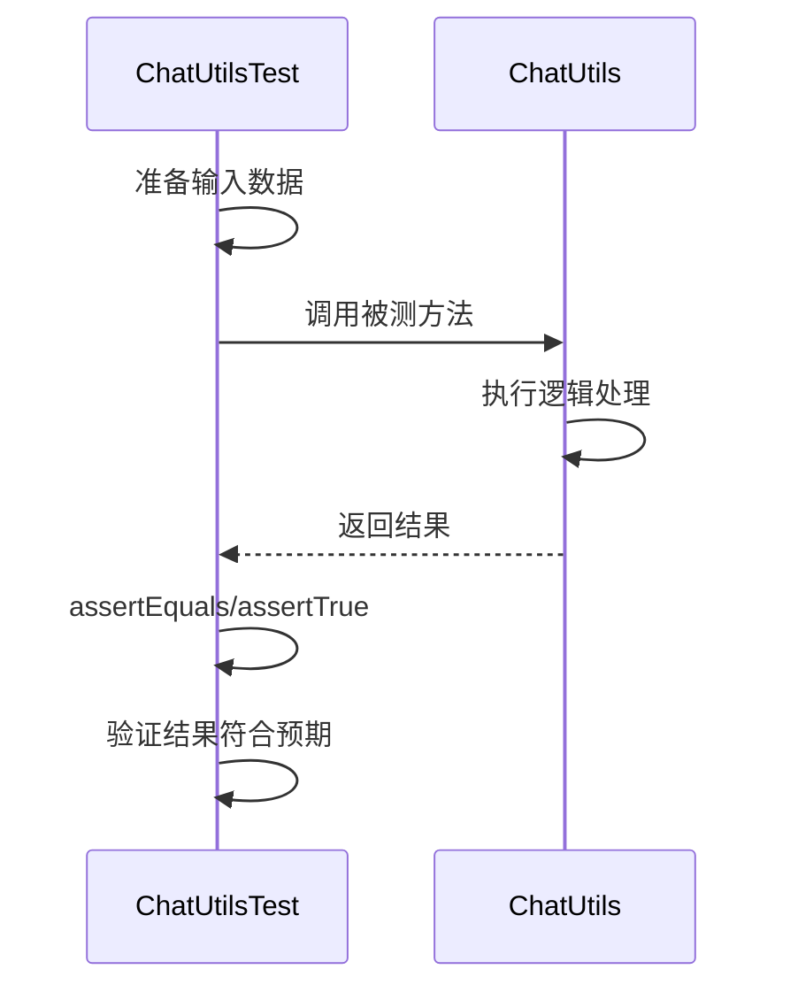

**测试方法示例**：

```kotlin
@Test fun stripGeminiThoughtSignatureMeta_removesMatchingMeta() {
    assertEquals(
        "hello", 
        ChatUtils.stripGeminiThoughtSignatureMeta(
            "hello<meta provider=\"gemini:thought_signature\">sig</meta>"
        )
    )
}
```

**测试特点**：
- 输入输出明确
- 无副作用
- 快速执行
- 独立性强

#### 5.1.2 正则表达式测试流程

以 `ToolingRegressionTest` 为例：

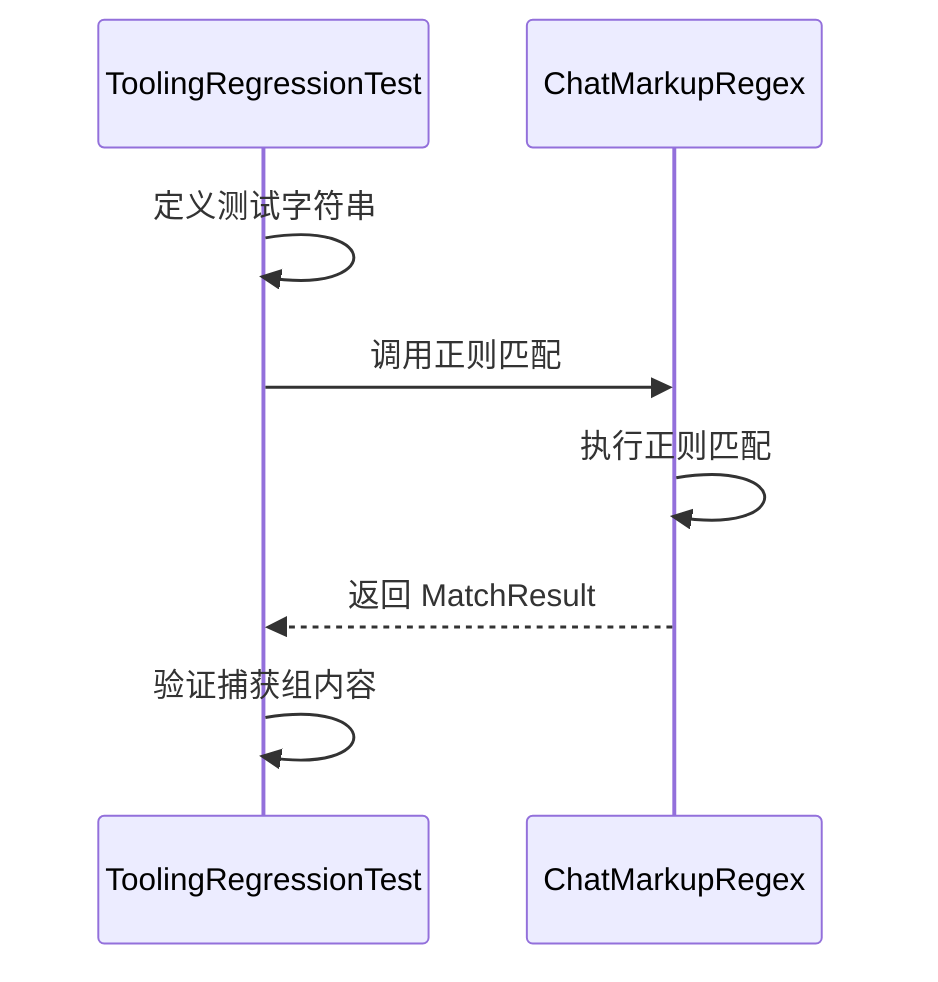

**测试方法示例**：

```kotlin
@Test fun toolResultWithNameAnyPattern_extractsNameAndBody() {
    val match = ChatMarkupRegex.toolResultWithNameAnyPattern
        .find("<tool_result name=\"run\">done</tool_result>")
    assertEquals("run", match!!.groupValues[2])
    assertEquals("done", match.groupValues[3])
}
```

**测试特点**：
- 验证正则模式正确性
- 验证捕获组顺序
- 覆盖自闭合标签和闭合标签

#### 5.1.3 条件表达式测试流程

以 `ConditionEvaluatorTest` 为例：

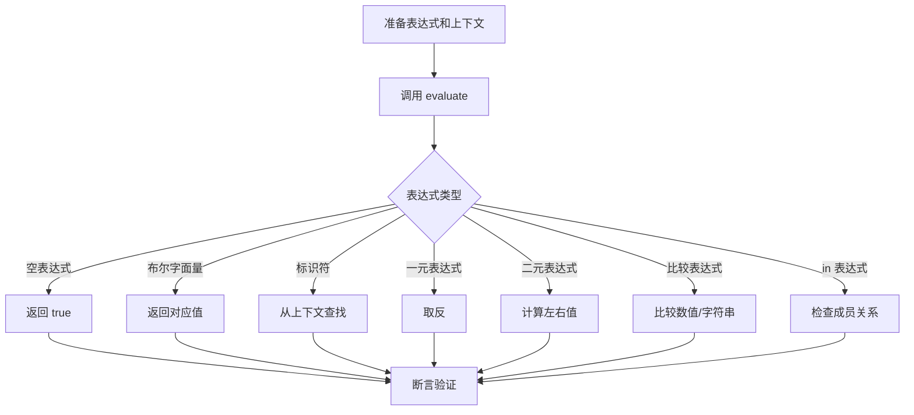

**测试覆盖**：
- 字面量：`true`, `false`, `''`, `'ok'`, `[1]`, `[]`
- 运算符：`!`, `&&`, `||`, `==`, `!=`, `>`, `>=`, `<`, `<=`, `in`
- 优先级：`&&` 优先于 `||`，括号可覆盖
- 异常：`@`, `'abc`, `(true`

### 5.2 仪器化测试详细流程

#### 5.2.1 流处理插件测试流程

以 `StreamJsonPluginTest` 为例：

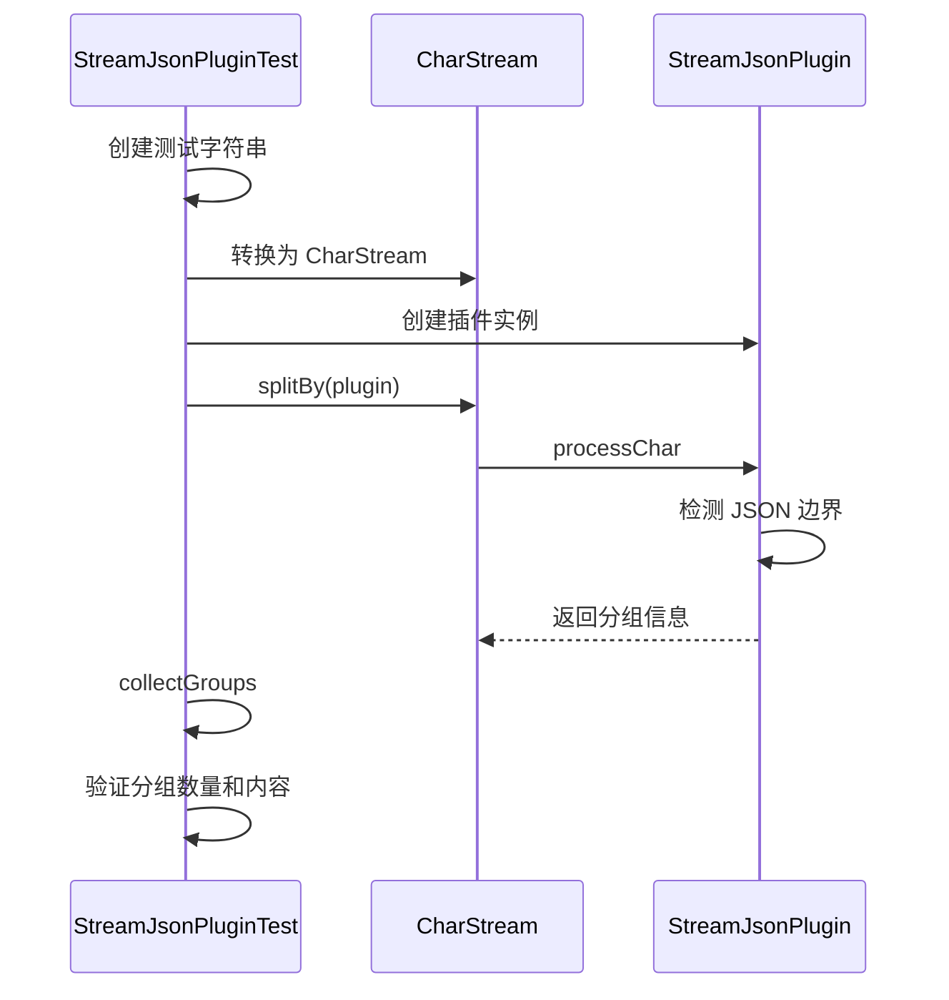

**测试方法示例**：

```kotlin
@Test fun testSimpleJsonObject() = runBlocking {
    val json = """{"key":"value","number":123}"""
    val stream = "Some text before $json and some after".asCharStream()
    val plugin = StreamJsonPlugin()
    
    val groups = collectGroups(stream, plugin)
    
    assertEquals(3, groups.size)
    assertNull(groups[0].tag)
    assertEquals("Some text before ", groups[0].content)
    assertSame(plugin, groups[1].tag)
    assertEquals(json, groups[1].content)
}
```

**测试特点**：
- 使用 `runBlocking` 测试挂起函数
- 验证流分组正确性
- 测试转义字符处理
- 对比 `StreamJsonPlugin` 和 `StreamPureJsonPlugin`

#### 5.2.2 文件操作测试流程

以 `FileBindingServiceTest` 为例：

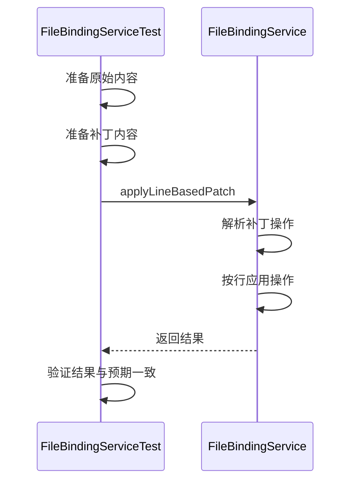

**测试方法示例**：

```kotlin
@Test fun testComplexMixedOperations_ShouldApplyCorrectly() {
    val originalContent = """fun main() {
    println("Hello, Original World!")
    // ...
}"""
    
    val patch = """
// [START-DELETE:9-11]
// [END-DELETE]
// [START-REPLACE:4-6]
    val x = 100
    val y = 200
    val sum = x + y
// [END-REPLACE]
""".trim()
    
    val (success, resultContent) = invokeApplyLineBasedPatch(originalContent, patch)
    
    assertEquals(true, success)
    assertEquals(expectedContent, resultContent)
}
```

**测试特点**：
- 使用反射测试私有方法
- 复杂多操作混合验证
- 边界条件测试（文件开头/结尾）
- 模糊匹配测试

---

## 六、测试组织结构

### 6.1 目录结构

```
Operit/
├── app/
│   ├── src/
│   │   ├── test/
│   │   │   └── java/
│   │   │       └── com/ai/assistance/operit/
│   │   │           ├── util/
│   │   │           │   ├── ChatUtilsTest.kt
│   │   │           │   ├── ChatUtilsJsonExtractionTest.kt
│   │   │           │   ├── ToolingRegressionTest.kt
│   │   │           │   └── TtsSegmenterTest.kt
│   │   │           ├── core/
│   │   │           │   ├── chat/hooks/
│   │   │           │   │   └── PromptTurnListOpsTest.kt
│   │   │           │   └── tools/condition/
│   │   │           │       └── ConditionEvaluatorTest.kt
│   │   │           └── ...
│   │   └── androidTest/
│   │       └── java/
│   │           └── com/ai/assistance/operit/
│   │               ├── api/chat/enhance/
│   │               │   ├── ToolExecutionManagerTest.kt
│   │               │   └── FileBindingServiceTest.kt
│   │               ├── util/stream/
│   │               │   ├── StreamAndroidTest.kt
│   │               │   └── plugins/
│   │               │       ├── StreamJsonPluginTest.kt
│   │               │       └── StreamXmlPluginTest.kt
│   │               └── ...
│   └── build.gradle.kts
├── tools/
│   ├── desktop/
│   │   └── app/src/test/
│   └── shower/
│       └── app/src/test/
└── gradle/
    └── libs.versions.toml
```

### 6.2 测试与被测代码对应关系

| 被测代码 | 测试代码 | 测试类型 |
|---------|---------|---------|
| `ChatUtils` | `ChatUtilsTest` | 单元测试 |
| `ChatUtils` | `ChatUtilsJsonExtractionTest` | 单元测试 |
| `ChatMarkupRegex` | `ToolingRegressionTest` | 单元测试 |
| `ConditionEvaluator` | `ConditionEvaluatorTest` | 单元测试 |
| `PromptTurnListOps` | `PromptTurnListOpsTest` | 单元测试 |
| `TtsSegmenter` | `TtsSegmenterTest` | 单元测试 |
| `FileBindingService` | `FileBindingServiceTest` | 仪器化测试 |
| `ToolExecutionManager` | `ToolExecutionManagerTest` | 仪器化测试 |
| `StreamJsonPlugin` | `StreamJsonPluginTest` | 仪器化测试 |
| `StreamXmlPlugin` | `StreamXmlPluginTest` | 仪器化测试 |

---

## 七、关键测试代码解析

### 7.1 反射测试私有方法

```kotlin
class FileBindingServiceTest {
    private lateinit var applyLineBasedPatchMethod: Method

    @Before
    fun setUp() {
        // 使用反射获取私有方法
        applyLineBasedPatchMethod = FileBindingService::class.java.getDeclaredMethod(
            "applyLineBasedPatch",
            String::class.java,
            String::class.java
        ).apply {
            isAccessible = true
        }
    }

    private fun invokeApplyLineBasedPatch(originalContent: String, patch: String): Pair<Boolean, String> {
        return applyLineBasedPatchMethod.invoke(fileBindingService, originalContent, patch) as Pair<Boolean, String>
    }
}
```

**设计思想**：
- 优先测试公有 API
- 对于复杂内部逻辑，允许通过反射测试
- 保持被测代码的封装性

### 7.2 协程测试

```kotlin
@Test fun testSimpleJsonObject() = runBlocking {
    val stream = "Some text before $json and some after".asCharStream()
    val plugin = StreamJsonPlugin()
    val groups = collectGroups(stream, plugin)
    assertEquals(3, groups.size)
}
```

**设计思想**：
- 使用 `runBlocking` 在测试中启动协程
- 避免使用 `Dispatchers.Main` 等 Android 特定调度器
- 确保测试在 JVM 上可运行

### 7.3 状态机测试

```kotlin
@Test fun testStartTagDetection() {
    plugin.processChar('<', false)
    assertEquals(PluginState.TRYING, plugin.state)
    plugin.processChar('t', false)
    assertEquals(PluginState.TRYING, plugin.state)
}

@Test fun testCompleteTagRecognitionAndProcessingEnter() {
    val xmlTag = "<test>"
    xmlTag.forEach { plugin.processChar(it, false) }
    assertEquals(PluginState.PROCESSING, plugin.state)
}
```

**设计思想**：
- 逐步验证状态转换
- 每个测试只验证一个状态转换
- 使用 `reset()` 重置状态，确保测试独立性

### 7.4 复杂场景测试

```kotlin
@Test fun testExtremeComplexity_TortureTest() {
    val originalContent = """
// File: Calculator.kt
package com.example.math

class Calculator {
    private var lastResult: Double = 0.0
    // ...
}
    """.trimIndent()

    val patch = """
// [START-REPLACE:1-4]
// File: AdvancedCalculator.kt
package com.example.adv_math

class AdvancedCalculator {
// [END-REPLACE]
// [START-INSERT:after_line=13]
        // A new comment line
// [END-INSERT]
// [START-REPLACE:21-26]
    fun subtract(a: Int, b: Int): Int {
        // A more complex subtraction
        val result = a - b - 1
        lastResult = result.toDouble()
        return result
    }
// [END-REPLACE]
// [START-DELETE:28-31]
// [END-DELETE]
// [START-INSERT:after_line=34]
    fun power(base: Double, exp: Double): Double {
        return Math.pow(base, exp)
    }
// [END-INSERT]
    """.trimIndent()

    val (success, resultContent) = invokeApplyLineBasedPatch(originalContent, patch)
    assertEquals(true, success)
    assertEquals(expectedContent, resultContent.trim())
}
```

**设计思想**：
- 使用 torture test 验证系统鲁棒性
- 组合多种操作类型（REPLACE、INSERT、DELETE）
- 验证操作顺序的正确性（从下到上执行）

---

## 八、测试配置解析

### 8.1 构建配置

```kotlin
// app/build.gradle.kts
android {
    testOptions {
        unitTests {
            isIncludeAndroidResources = true
        }
    }
}

dependencies {
    // 单元测试依赖
    testImplementation(libs.junit)
    
    // 仪器化测试依赖
    androidTestImplementation(libs.androidx.junit)
    androidTestImplementation(libs.androidx.espresso.core)
}
```

**配置特点**：
- `isIncludeAndroidResources = true`：允许单元测试访问 Android 资源
- 分离单元测试和仪器化测试依赖

### 8.2 版本管理

```toml
# gradle/libs.versions.toml
[versions]
junit = "4.13.2"
androidx-test-ext-junit = "1.2.1"
espresso-core = "3.6.1"

[libraries]
junit = { group = "junit", name = "junit", version.ref = "junit" }
androidx-junit = { group = "androidx.test.ext", name = "junit", version.ref = "androidx-test-ext-junit" }
androidx-espresso-core = { group = "androidx.test.espresso", name = "espresso-core", version.ref = "espresso-core" }
```

**配置特点**：
- 使用 TOML 格式集中管理依赖版本
- 明确区分测试库和生产库

---

## 九、测试策略总结

### 9.1 优势

1. **命名规范清晰**：描述性命名使测试意图明确
2. **边界覆盖全面**：重点测试边界条件和异常情况
3. **状态机测试完善**：覆盖所有状态转换路径
4. **复杂场景验证**：通过 torture test 验证系统鲁棒性
5. **分离测试类型**：单元测试和仪器化测试职责清晰

### 9.2 改进建议

1. **增加 Mock 框架**：引入 Mockito 或 MockK 进行依赖隔离
2. **增加覆盖率工具**：集成 JaCoCo 生成测试覆盖率报告
3. **增加 E2E 测试**：使用 Espresso 或 Compose Testing 进行 UI 测试
4. **增加性能测试**：对关键路径进行性能基准测试
5. **增加参数化测试**：使用 `@RunWith(Parameterized::class)` 减少重复代码
6. **增加测试基类**：提取公共的 `@Before` 和 `@After` 逻辑

### 9.3 测试执行命令

```bash
# 运行所有单元测试
./gradlew test

# 运行所有仪器化测试
./gradlew connectedAndroidTest

# 运行特定测试类
./gradlew test --tests "com.ai.assistance.operit.util.ChatUtilsTest"

# 运行特定测试方法
./gradlew test --tests "com.ai.assistance.operit.util.ChatUtilsTest.stripGeminiThoughtSignatureMeta_removesMatchingMeta"
```

---

## 十、总结

Operit 项目的测试策略体现了以下核心设计思想：

1. **分层测试**：单元测试为主，仪器化测试为辅，形成完整的测试体系
2. **命名驱动**：描述性测试命名使测试意图清晰，便于维护
3. **边界优先**：重点覆盖边界条件和异常情况，提高代码鲁棒性
4. **状态机验证**：对状态机组件进行完整的状态转换测试
5. **复杂场景覆盖**：通过 torture test 验证系统在极端情况下的表现

该测试策略为项目提供了可靠的质量保障，同时保持了测试代码的可读性和可维护性。
