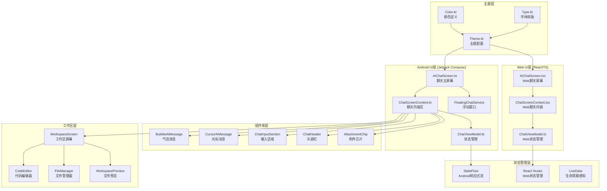
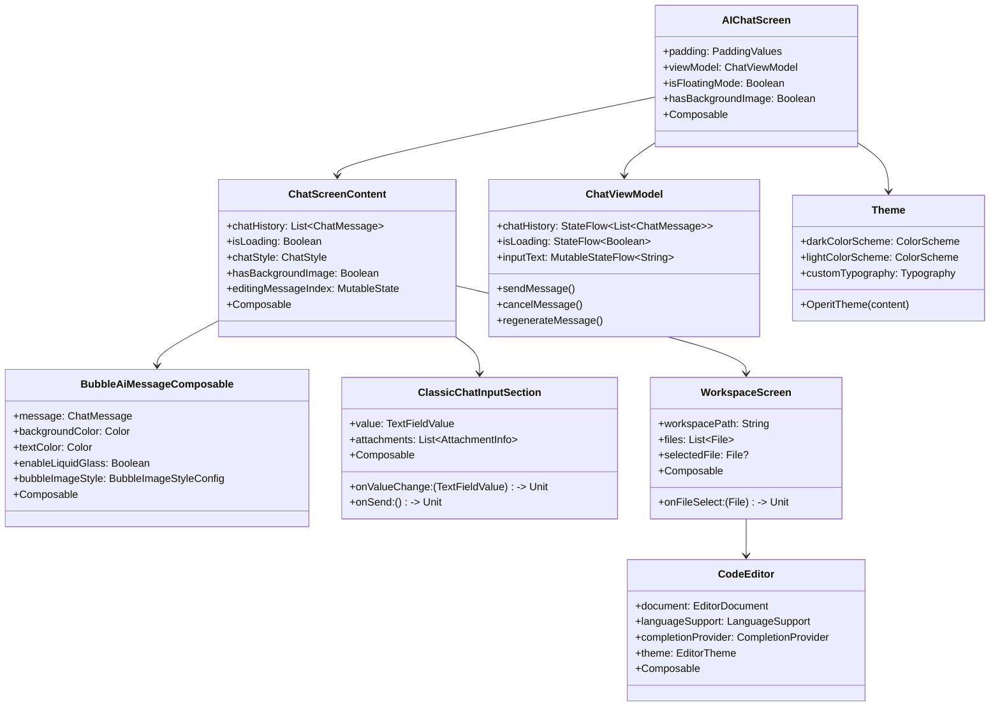
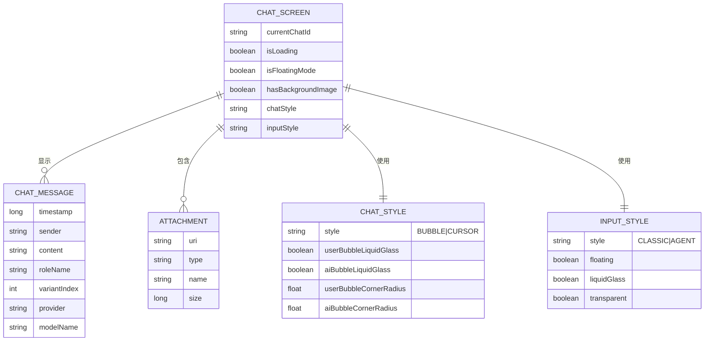
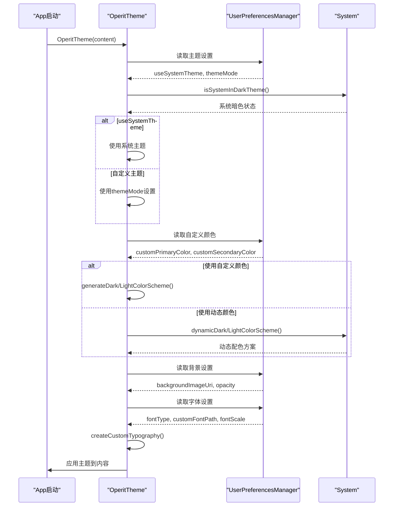
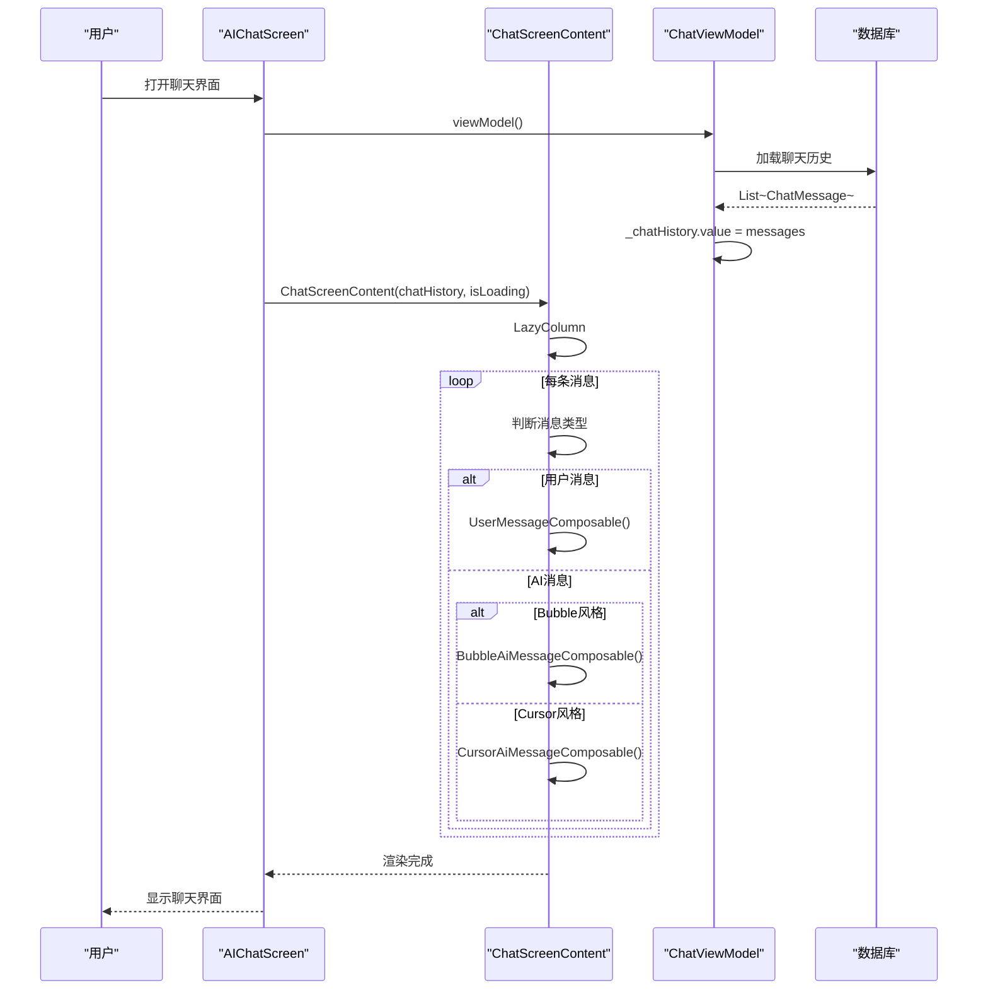
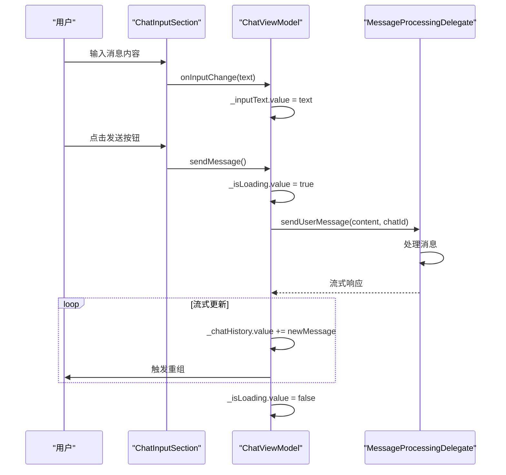
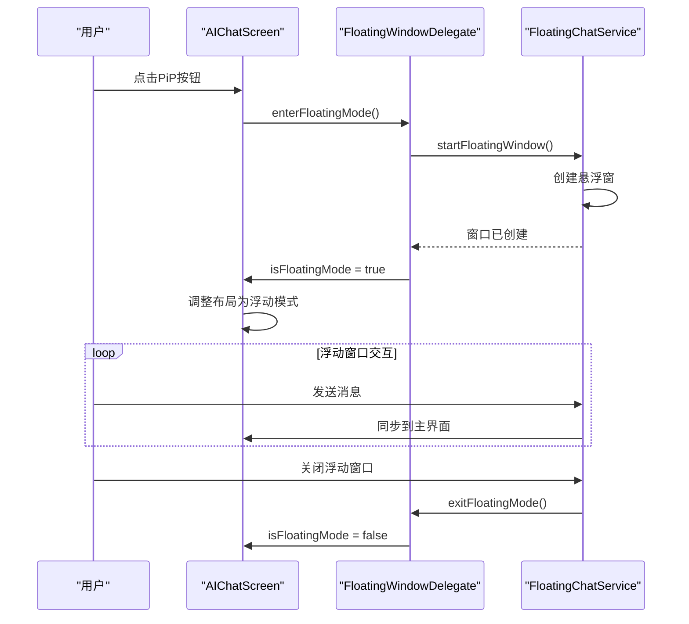
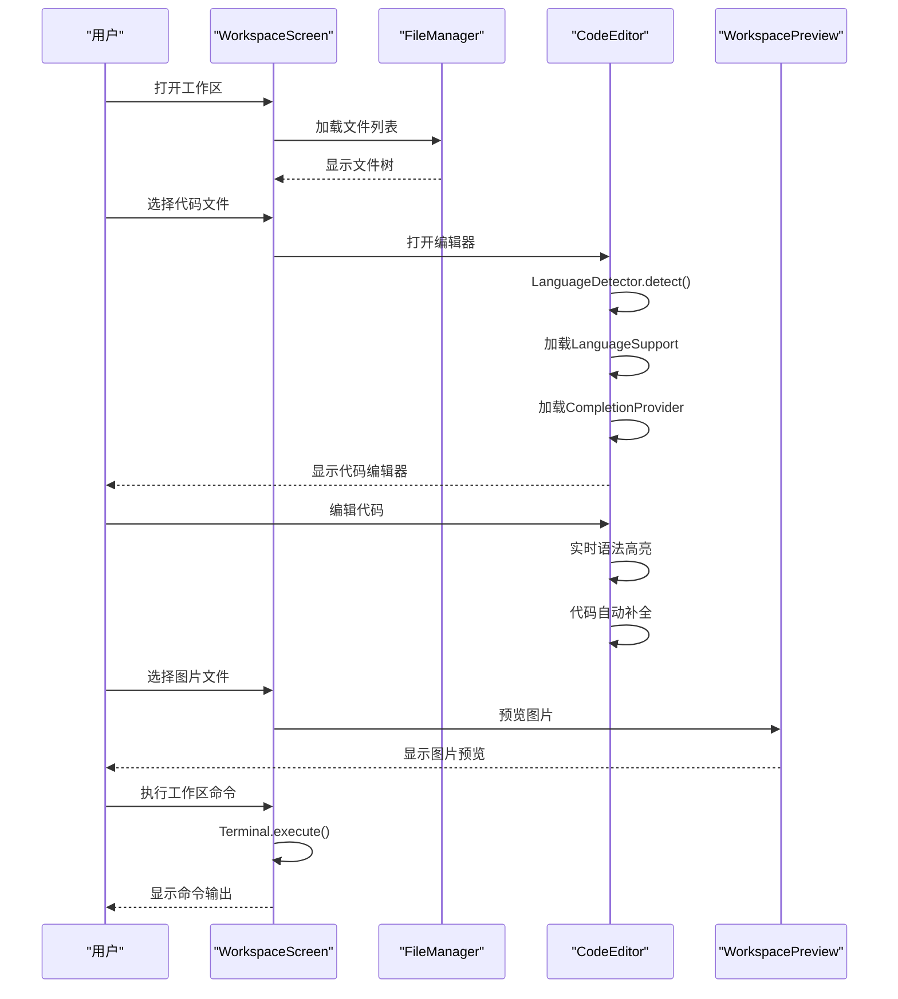

# Operit 界面设计系统设计思想与详细流程分析

## 一、设计思想概述

Operit 的界面设计系统采用**"跨平台统一 + 组件化架构 + 主题驱动 + 状态响应式"**的设计思想，核心设计思想包括：

1. **跨平台双端架构**：Android 端使用 Jetpack Compose，Web 端使用 React/TypeScript，两端共享相似的设计模式和组件结构
2. **组件化设计**：UI 拆分为可复用的原子组件（按钮、输入框）、分子组件（消息气泡、附件芯片）和有机体组件（聊天屏幕、工作区）
3. **主题驱动**：Material Design 3 为基础，支持动态颜色、自定义颜色、背景图片/视频、字体定制等深度主题化
4. **状态响应式**：使用 StateFlow（Android）和 React Hooks（Web）实现数据驱动 UI 自动更新
5. **风格可配置**：支持气泡风格（Bubble）和光标风格（Cursor）两种聊天展示模式
6. **玻璃拟态效果**：支持 Liquid Glass 和 Water Glass 等现代视觉效果
7. **浮动窗口模式**：支持画中画（PiP）浮动聊天窗口，实现多任务并行
8. **工作区集成**：内置代码编辑器、文件管理器、预览系统，形成完整的开发环境

---

## 二、软件架构图

### 2.1 整体架构分层



### 2.2 核心组件类图



---

## 三、数据模型设计

### 3.1 界面状态模型



---

## 四、界面设计详细流程

### 4.1 主题初始化流程



### 4.2 聊天屏幕渲染流程



### 4.3 消息发送交互流程



### 4.4 浮动窗口模式流程



### 4.5 工作区文件操作流程



---

## 五、核心机制详解

### 5.1 主题系统（Theme.kt）

```kotlin
@Composable
fun OperitTheme(content: @Composable () -> Unit) {
    val context = LocalContext.current
    val preferencesManager = remember { UserPreferencesManager.getInstance(context) }
    
    // 获取主题设置
    val useSystemTheme by preferencesManager.useSystemTheme.collectAsState(initial = true)
    val themeMode by preferencesManager.themeMode.collectAsState(initial = THEME_MODE_LIGHT)
    val useCustomColors by preferencesManager.useCustomColors.collectAsState(initial = false)
    
    // 确定是否使用暗色主题
    val systemDarkTheme = isSystemInDarkTheme()
    val darkTheme = if (useSystemTheme) systemDarkTheme else themeMode == THEME_MODE_DARK
    
    // Dynamic color is available on Android 12+
    val dynamicColor = Build.VERSION.SDK_INT >= Build.VERSION_CODES.S
    
    // 基础主题色调
    var colorScheme = when {
        dynamicColor -> {
            if (darkTheme) dynamicDarkColorScheme(context)
            else dynamicLightColorScheme(context)
        }
        darkTheme -> DarkColorScheme
        else -> LightColorScheme
    }
    
    // 应用自定义颜色
    if (useCustomColors) {
        customPrimaryColor?.let { primaryArgb ->
            val primary = Color(primaryArgb)
            val secondary = customSecondaryColor?.let { Color(it) } ?: colorScheme.secondary
            colorScheme = if (darkTheme) {
                generateDarkColorScheme(primary, secondary, onColorMode)
            } else {
                generateLightColorScheme(primary, secondary, onColorMode)
            }
        }
    }
    
    // 创建自定义 Typography
    val customTypography = remember(useCustomFont, fontType, fontScale) {
        createCustomTypography(context, useCustomFont, fontType, systemFontName, customFontPath, fontScale)
    }
    
    MaterialTheme(
        colorScheme = colorScheme,
        typography = customTypography,
        content = content
    )
}
```

**关键设计**：
- **系统主题跟随**：支持跟随系统暗色/亮色模式
- **动态颜色**：Android 12+ 支持 Material You 动态取色
- **自定义颜色**：用户可自定义主色和次色
- **自定义字体**：支持系统字体、自定义字体文件、字体缩放
- **背景媒体**：支持图片/视频背景，可调节透明度

### 5.2 消息气泡组件（BubbleAiMessageComposable）

```kotlin
@Composable
fun BubbleAiMessageComposable(
    message: ChatMessage,
    backgroundColor: Color,
    textColor: Color,
    enableLiquidGlass: Boolean = false,
    enableWaterGlass: Boolean = false,
    bubbleImageStyle: BubbleImageStyleConfig? = null,
    bubbleRoundedCornersEnabled: Boolean = true,
    onLinkClick: ((String) -> Unit)? = null,
) {
    // 头像配置
    val bubbleShowAvatar by preferencesManager.bubbleShowAvatar.collectAsState(initial = true)
    val avatarShapePref by preferencesManager.avatarShape.collectAsState(initial = AVATAR_SHAPE_CIRCLE)
    val aiAvatarUri by remember(message.roleName) {
        // 根据角色名获取头像
        runBlocking {
            val characterCard = characterCardManager.findCharacterCardByName(message.roleName)
            if (characterCard != null) {
                preferencesManager.getAiAvatarForCharacterCardFlow(characterCard.id)
            } else {
                preferencesManager.customAiAvatarUri
            }
        }
    }.collectAsState(initial = null)
    
    // Markdown渲染状态
    val rendererState = remember(message.timestamp) { StreamMarkdownRendererState() }
    
    // XML渲染器（用于思考过程、工具调用）
    val xmlRenderer = remember(showThinkingProcess, showStatusTags) {
        CustomXmlRenderer(showThinkingProcess, showStatusTags)
    }
    
    // 消息布局
    Row(
        modifier = Modifier.fillMaxWidth(),
        horizontalArrangement = Arrangement.Start
    ) {
        // 头像
        if (bubbleShowAvatar) {
            AsyncImage(
                model = aiAvatarUri,
                contentDescription = "AI Avatar",
                modifier = Modifier
                    .size(40.dp)
                    .clip(avatarShape)
            )
        }
        
        // 消息气泡
        Column {
            // 角色名和元数据
            if (showRoleName && message.roleName.isNotEmpty()) {
                Text(text = message.roleName, style = MaterialTheme.typography.labelSmall)
            }
            
            // 消息内容
            Card(
                colors = CardDefaults.cardColors(containerColor = backgroundColor),
                shape = if (bubbleRoundedCornersEnabled) RoundedCornerShape(12.dp) else RectangleShape
            ) {
                // Markdown内容渲染
                StreamMarkdownRenderer(
                    text = message.content,
                    rendererState = rendererState,
                    xmlRenderer = xmlRenderer,
                    textColor = textColor
                )
            }
        }
    }
}
```

**关键设计**：
- **角色头像**：根据角色卡动态加载头像
- **Markdown流式渲染**：支持实时流式内容更新
- **XML扩展渲染**：支持思考过程、工具调用等特殊内容
- **玻璃拟态**：支持 Liquid Glass 和 Water Glass 效果
- **图片样式配置**：可配置图片圆角、边距等

### 5.3 聊天输入区域（ClassicChatInputSection）

```kotlin
@Composable
fun ClassicChatInputSection(
    value: TextFieldValue,
    onValueChange: (TextFieldValue) -> Unit,
    onSend: () -> Unit,
    attachments: List<AttachmentInfo>,
    isLoading: Boolean,
    enableEnterToSend: Boolean = false,
) {
    Column {
        // 附件列表
        if (attachments.isNotEmpty()) {
            LazyRow {
                items(attachments) { attachment ->
                    AttachmentChip(attachment = attachment)
                }
            }
        }
        
        // 输入框和发送按钮
        Row {
            OutlinedTextField(
                value = value,
                onValueChange = onValueChange,
                modifier = Modifier.weight(1f),
                keyboardOptions = KeyboardOptions(
                    imeAction = if (enableEnterToSend) ImeAction.Send else ImeAction.Default
                ),
                keyboardActions = KeyboardActions(
                    onSend = { if (enableEnterToSend) onSend() }
                )
            )
            
            IconButton(onClick = onSend, enabled = !isLoading) {
                Icon(Icons.Default.Send, contentDescription = "Send")
            }
        }
    }
}
```

**关键设计**：
- **附件管理**：支持图片、文件、工作区附件
- **Enter发送**：可配置回车键发送消息
- **输入状态**：根据加载状态禁用发送按钮
- **多行输入**：支持多行文本输入

### 5.4 代码编辑器（CodeEditor）

```kotlin
@Composable
fun CodeEditor(
    document: EditorDocument,
    modifier: Modifier = Modifier
) {
    val context = LocalContext.current
    val language = remember(document.fileName) {
        LanguageDetector.detect(document.fileName)
    }
    val languageSupport = remember(language) {
        LanguageSupportRegistry.getSupport(language)
    }
    val completionProvider = remember(language) {
        CompletionProviderFactory.create(language)
    }
    
    // 语法高亮
    val highlightedText = remember(document.content, languageSupport) {
        languageSupport?.highlight(document.content) ?: document.content
    }
    
    // 代码补全
    var completions by remember { mutableStateOf<List<CompletionItem>>(emptyList()) }
    
    TextField(
        value = document.content,
        onValueChange = { newText ->
            document.updateContent(newText)
            // 触发代码补全
            completionProvider?.provideCompletions(newText, document.cursorPosition)?.let {
                completions = it
            }
        },
        modifier = modifier,
        visualTransformation = SyntaxHighlightingTransformation(highlightedText)
    )
    
    // 显示补全列表
    if (completions.isNotEmpty()) {
        CompletionPopup(completions = completions, onSelect = { completion ->
            document.insertText(completion.text)
            completions = emptyList()
        })
    }
}
```

**关键设计**：
- **语言检测**：自动检测文件类型（Kotlin、JavaScript、HTML、Dart 等）
- **语法高亮**：为不同语言提供专门的语法高亮
- **代码补全**：支持多种语言的自动补全
- **实时预览**：支持代码修改后的实时预览

### 5.5 Web 端主题同步

```typescript
// WebChat 主题同步
export function AIChatScreen() {
  const viewModel = useChatViewModel();
  const fontFaceCss = buildChatFontFaceCss(viewModel.theme);
  const chatThemeStyle = useMemo(() => buildChatThemeStyle(viewModel.theme), [viewModel.theme]);
  
  return (
    <div
      className={[
        'ai-chat-screen',
        viewModel.activeChatStyle === 'bubble' ? 'chat-style-bubble' : 'chat-style-cursor',
        viewModel.theme?.theme_mode === 'light' ? 'theme-light' : 'theme-dark'
      ].join(' ')}
      style={chatThemeStyle}
    >
      {fontFaceCss ? <style>{fontFaceCss}</style> : null}
      <div className="chat-glass-backdrop-source" style={backdropBaseStyle}>
        <div className="chat-glass-backdrop-image" style={backdropImageStyle} />
        <div className="chat-glass-backdrop-tint" style={backdropTintStyle} />
      </div>
      <ChatScreenContent viewModel={viewModel} />
    </div>
  );
}
```

**关键设计**：
- **CSS变量同步**：通过 CSS 变量同步主题颜色
- **字体同步**：动态加载自定义字体
- **背景同步**：支持图片背景、模糊效果
- **风格同步**：Bubble/Cursor 两种风格同步

---

## 六、性能优化策略

| 优化点 | 实现方式 | 效果 |
|--------|----------|------|
| 懒加载 | LazyColumn 懒加载消息 | 减少初始渲染开销 |
| 状态记忆 | remember, rememberSaveable | 避免不必要的重组 |
| 流式采样 | sample(100ms) | 减少高频状态更新 |
| 图片缓存 | Coil AsyncImage | 高效图片加载和缓存 |
| 字体缓存 | rememberCustomTypography | 避免重复创建字体 |
| 重组优化 | key(message.timestamp) | 精确控制重组范围 |
| 背景优化 | 条件渲染背景层 | 无背景时不渲染 |
| Web缓存 | localStorage 存储配置 | 减少重复请求 |

---

## 七、关键文件索引

| 文件路径 | 职责 |
|----------|------|
| `app/src/main/java/com/ai/assistance/operit/ui/theme/Theme.kt` | 主题系统核心，颜色/字体/背景配置 |
| `app/src/main/java/com/ai/assistance/operit/ui/theme/Color.kt` | 颜色定义 |
| `app/src/main/java/com/ai/assistance/operit/ui/theme/Type.kt` | 字体排版定义 |
| `app/src/main/java/com/ai/assistance/operit/ui/features/chat/screens/AIChatScreen.kt` | Android 聊天主屏幕 |
| `app/src/main/java/com/ai/assistance/operit/ui/features/chat/components/ChatScreenContent.kt` | 聊天内容区域 |
| `app/src/main/java/com/ai/assistance/operit/ui/features/chat/viewmodel/ChatViewModel.kt` | Android 聊天状态管理 |
| `app/src/main/java/com/ai/assistance/operit/ui/features/chat/components/style/bubble/BubbleAiMessageComposable.kt` | 气泡消息组件 |
| `app/src/main/java/com/ai/assistance/operit/ui/features/chat/components/style/input/classic/ClassicChatInputSection.kt` | 经典输入区域 |
| `app/src/main/java/com/ai/assistance/operit/ui/features/chat/webview/workspace/WorkspaceScreen.kt` | 工作区屏幕 |
| `app/src/main/java/com/ai/assistance/operit/ui/features/chat/webview/workspace/editor/CodeEditor.kt` | 代码编辑器 |
| `app/src/main/java/com/ai/assistance/operit/ui/components/CustomScaffold.kt` | 自定义 Scaffold |
| `web-chat/src/ui/features/chat/screens/AIChatScreen.tsx` | Web 聊天屏幕 |
| `web-chat/src/ui/features/chat/components/ChatScreenContent.tsx` | Web 聊天内容 |
| `web-chat/src/ui/features/chat/viewmodel/ChatViewModel.ts` | Web 状态管理 |

---

## 八、总结

Operit 的界面设计系统通过**跨平台统一**和**组件化架构**，实现了以下核心能力：

1. **跨平台双端**：Android（Jetpack Compose）和 Web（React/TypeScript）共享设计模式和组件结构
2. **主题驱动**：Material Design 3 为基础，支持动态颜色、自定义颜色、背景媒体、字体定制
3. **组件化设计**：原子组件、分子组件、有机体组件的分层设计
4. **状态响应式**：StateFlow（Android）和 React Hooks（Web）实现数据驱动 UI
5. **风格可配置**：Bubble 和 Cursor 两种聊天展示模式
6. **玻璃拟态**：Liquid Glass 和 Water Glass 现代视觉效果
7. **浮动窗口**：画中画模式支持多任务并行
8. **工作区集成**：代码编辑器、文件管理器、预览系统形成完整开发环境
9. **性能优化**：懒加载、状态记忆、流式采样、图片缓存
10. **无障碍支持**：支持 TalkBack、键盘导航等无障碍功能

整个系统的设计充分体现了**"一致性、可配置性、可扩展性"**的原则，通过统一的设计语言和组件库，实现了跨平台的一致用户体验。
