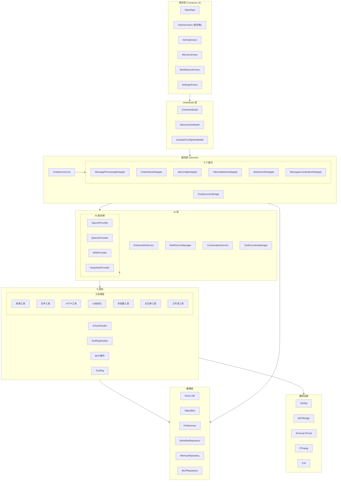

# Operit AI — app 模块软件架构与业务流程快速上手

## 一、项目定位

`app` 模块是 **Operit AI** 的 Android 主模块，承载全部移动端业务。它是一套围绕 **AI 对话** 展开的**高度可扩展智能助手系统**，核心能力包括：

- 多模型 AI 对话（远程 API + 本地 MNN/llama.cpp）
- 80+ 内置工具调用（系统、文件、HTTP、UI 自动化、浏览器、终端等）
- MCP/Skill 插件生态（Node.js 桥接，支持第三方扩展）
- 可视化工作流引擎（节点编排 + 拓扑排序执行）
- 记忆库系统（长期记忆 + 图谱关联）
- Ubuntu 终端（Proot 环境）
- 语音交互（TTS/STT/唤醒词）
- 桌宠/角色卡系统（DragonBones + MMD + Filament）

---

## 二、整体架构设计思想

### 2.1 分层架构（Layered Architecture）

```
┌─────────────────────────────────────────────────────────────────────────────┐
│                              表现层 (Presentation)                           │
│  ┌─────────────┐ ┌─────────────┐ ┌─────────────┐ ┌─────────────┐           │
│  │  Compose UI  │ │  ViewModel  │ │   Screen    │ │  Navigation │           │
│  │  (Screens)   │ │  (StateFlow)│ │   (Route)   │ │   (Router)  │           │
│  └─────────────┘ └─────────────┘ └─────────────┘ └─────────────┘           │
├─────────────────────────────────────────────────────────────────────────────┤
│                              业务层 (Business)                               │
│  ┌─────────────┐ ┌─────────────┐ ┌─────────────┐ ┌─────────────┐           │
│  │ChatServiceCore│ │EnhancedAIService│ │ WorkflowExecutor │ │ AIToolHandler │
│  │  (Delegate)  │ │ (AI Provider)│ │ (DAG Engine) │ │(Tool Registry)│        │
│  └─────────────┘ └─────────────┘ └─────────────┘ └─────────────┘           │
├─────────────────────────────────────────────────────────────────────────────┤
│                              数据层 (Data)                                   │
│  ┌─────────────┐ ┌─────────────┐ ┌─────────────┐ ┌─────────────┐           │
│  │  Room DB    │ │ ObjectBox   │ │ Preferences │ │  Repository │           │
│  │(Chat/Message)│ │(Memory/Tag) │ │(Settings)   │ │  (DAO封装)  │           │
│  └─────────────┘ └─────────────┘ └─────────────┘ └─────────────┘           │
├─────────────────────────────────────────────────────────────────────────────┤
│                              基础设施层 (Infrastructure)                      │
│  ┌─────────────┐ ┌─────────────┐ ┌─────────────┐ ┌─────────────┐           │
│  │  OkHttp/Retrofit│ │  MCP Bridge │ │  Terminal   │ │  FFmpeg/MNN │        │
│  │  (Network)   │ │(Node.js IPC)│ │ (Proot)     │ │ (Native)    │           │
│  └─────────────┘ └─────────────┘ └─────────────┘ └─────────────┘           │
└─────────────────────────────────────────────────────────────────────────────┘
```

### 2.2 架构模式

| 模式 | 应用位置 | 说明 |
|------|----------|------|
| **MVVM** | UI 层 | Compose + ViewModel + StateFlow |
| **委托模式 (Delegate)** | ChatServiceCore | 将聊天逻辑拆分为 6 个独立委托 |
| **单例模式** | 全局管理器 | AIMessageManager, AIToolHandler, EnhancedAIService 等 |
| **仓库模式** | 数据层 | WorkflowRepository, MemoryRepository, MCPRepository |
| **策略模式** | AI 服务 | AIService 接口 + 多提供商实现 |
| **观察者模式** | 状态流转 | StateFlow/SharedFlow 驱动 UI 更新 |
| **插件架构** | 工具系统 | 内置工具 + MCP 插件 + Skill 包 + ToolPkg |

### 2.3 核心设计原则

1. **职责分离**：ChatServiceCore 通过 6 个 Delegate 将聊天业务拆分为独立单元
2. **响应式编程**：大量使用 Kotlin Flow（StateFlow/SharedFlow）实现数据驱动 UI
3. **延迟初始化**：关键组件使用 `by lazy` 或懒加载，优化启动性能
4. **异步优先**：IO 操作全部使用协程（`Dispatchers.IO`），避免阻塞主线程
5. **可扩展性**：工具系统支持 4 种扩展方式（内置、MCP、Skill、ToolPkg）

---

## 三、源码目录结构

```
app/src/main/java/com/ai/assistance/operit/
│
├── api/                          # API 层 — 外部服务接口
│   ├── chat/
│   │   ├── EnhancedAIService.kt      # 增强版 AI 服务（业务编排）
│   │   ├── ChatRuntimeHolder.kt      # 聊天运行时管理
│   │   └── llmprovider/
│   │       ├── AIService.kt          # AI 服务接口（策略模式）
│   │       ├── OpenAIProvider.kt     # OpenAI 实现
│   │       ├── QwenAIProvider.kt     # 通义千问实现
│   │       ├── MNNProvider.kt        # 本地 MNN 模型
│   │       └── ...                   # 其他提供商
│   ├── speech/                   # 语音识别（STT）
│   └── voice/                    # 语音合成（TTS）
│
├── core/                         # 核心层 — 业务逻辑
│   ├── application/
│   │   ├── OperitApplication.kt      # Application 入口
│   │   └── ActivityLifecycleManager.kt
│   ├── chat/
│   │   └── AIMessageManager.kt       # AI 消息管理器
│   ├── tools/
│   │   ├── AIToolHandler.kt          # 工具处理器（注册/执行）
│   │   ├── ToolRegistration.kt       # 工具注册中心（80+ 工具）
│   │   ├── defaultTool/              # 默认工具实现
│   │   ├── mcp/                      # MCP 工具执行
│   │   ├── javascript/               # JS 工具管理
│   │   └── packTool/                 # 工具包管理
│   ├── workflow/
│   │   ├── WorkflowExecutor.kt       # 工作流执行器（拓扑排序）
│   │   └── WorkflowScheduler.kt      # 工作流调度器
│   └── config/                   # 系统提示词配置
│
├── data/                         # 数据层 — 数据访问与存储
│   ├── db/
│   │   └── AppDatabase.kt            # Room 数据库（版本 18）
│   ├── dao/                      # 数据访问对象
│   ├── model/                    # 数据模型（Entity + DTO）
│   │   ├── ChatEntity.kt
│   │   ├── MessageEntity.kt
│   │   ├── Workflow.kt
│   │   └── ...
│   ├── repository/               # 仓库实现
│   ├── mcp/
│   │   └── MCPRepository.kt          # MCP 插件仓库
│   └── preferences/              # 偏好设置管理
│
├── services/                     # 服务层 — 业务编排
│   ├── ChatServiceCore.kt            # 聊天服务核心（6 委托聚合）
│   ├── ChatServiceUiBridge.kt        # UI 桥接接口
│   └── core/                     # 委托实现
│       ├── MessageProcessingDelegate.kt
│       ├── ChatHistoryDelegate.kt
│       ├── ApiConfigDelegate.kt
│       ├── TokenStatisticsDelegate.kt
│       ├── AttachmentDelegate.kt
│       └── MessageCoordinationDelegate.kt
│
├── ui/                           # UI 层 — 界面展示
│   ├── main/
│   │   ├── OperitApp.kt              # 主应用 Compose 入口
│   │   ├── MainActivity.kt           # Activity 入口
│   │   ├── screens/
│   │   │   └── OperitScreens.kt      # 屏幕定义（密封类）
│   │   └── navigation/               # 自定义导航路由系统
│   ├── features/                 # 功能模块
│   │   ├── chat/                     # AI 聊天
│   │   ├── assistant/                # 助手配置
│   │   ├── memory/                   # 记忆库
│   │   ├── workflow/                 # 工作流
│   │   ├── packages/                 # 插件市场
│   │   ├── toolbox/                  # 工具箱
│   │   └── settings/                 # 设置
│   └── floating/                 # 悬浮窗/桌宠
│
└── plugins/                      # 插件系统
    └── PluginRegistry.kt           # 内置插件注册表
```

---

## 四、核心业务架构

### 4.1 AI 对话架构

```
┌─────────────────────────────────────────────────────────────────────────────┐
│                            AI 对话系统架构                                    │
└─────────────────────────────────────────────────────────────────────────────┘

    ┌──────────────┐
    │   User Input │
    └──────┬───────┘
           │
           ▼
    ┌─────────────────────────────────────────────────────────────────┐
    │                      ChatServiceCore                             │
    │  ┌─────────────┐ ┌─────────────┐ ┌─────────────┐ ┌────────────┐ │
    │  │ApiConfigDelegate│ │ChatHistoryDelegate│ │MessageProcessingDelegate│ │AttachmentDelegate│
    │  │(API配置管理)  │ │(聊天历史管理)  │ │(消息处理/发送) │ │(附件处理)  │
    │  └─────────────┘ └─────────────┘ └─────────────┘ └────────────┘ │
    │  ┌─────────────┐ ┌─────────────┐                                │
    │  │TokenStatisticsDelegate│ │MessageCoordinationDelegate│        │
    │  │(Token统计)   │ │(消息协调)    │                                │
    │  └─────────────┘ └─────────────┘                                │
    └────────────────────────┬────────────────────────────────────────┘
                             │
                             ▼
    ┌─────────────────────────────────────────────────────────────────┐
    │                   EnhancedAIService                              │
    │  ┌─────────────┐ ┌─────────────┐ ┌─────────────┐ ┌────────────┐ │
    │  │MultiServiceManager│ │ConversationService│ │ToolExecutionManager│ │FileBindingService│
    │  │(多服务路由)   │ │(对话管理)    │ │(工具执行管理)  │ │(文件绑定)  │
    │  └─────────────┘ └─────────────┘ └─────────────┘ └────────────┘ │
    │  ┌─────────────┐ ┌─────────────┐                                │
    │  │ConversationMarkupManager│ │ConversationRoundManager│         │
    │  │(对话标记)    │ │(轮次管理)    │                                │
    │  └─────────────┘ └─────────────┘                                │
    └────────────────────────┬────────────────────────────────────────┘
                             │
              ┌──────────────┼──────────────┐
              │              │              │
              ▼              ▼              ▼
    ┌─────────────┐ ┌─────────────┐ ┌─────────────┐
    │  OpenAI     │ │   MNN       │ │   Qwen      │
    │  Provider   │ │  Provider   │ │  Provider   │
    │ (远程API)   │ │ (本地模型)  │ │ (远程API)   │
    └─────────────┘ └─────────────┘ └─────────────┘
```

**关键类说明：**

| 类 | 职责 |
|----|------|
| `ChatServiceCore` | 聊天业务总入口，聚合 6 个 Delegate |
| `EnhancedAIService` | AI 服务编排，管理对话流程、工具调用、文件绑定 |
| `MultiServiceManager` | 按功能类型（对话/函数调用/语音）路由到不同 AI 服务 |
| `ConversationService` | 管理对话上下文、消息历史、提示词组装 |
| `ToolExecutionManager` | 管理工具调用生命周期（注册→执行→回调） |
| `AIService` | 策略接口，统一不同 AI 提供商的调用方式 |

### 4.2 工具系统架构

```
┌─────────────────────────────────────────────────────────────────────────────┐
│                            工具系统架构                                       │
└─────────────────────────────────────────────────────────────────────────────┘

                         ┌─────────────────┐
                         │   AIToolHandler  │
                         │  (工具注册中心)   │
                         └────────┬────────┘
                                  │
        ┌─────────────────────────┼─────────────────────────┐
        │                         │                         │
        ▼                         ▼                         ▼
┌───────────────┐       ┌─────────────────┐       ┌─────────────────┐
│  内置工具      │       │   MCP 插件工具   │       │  ToolPkg 工具   │
│ (80+ 默认)    │       │ (Node.js 桥接)  │       │ (Compose DSL)   │
└───────┬───────┘       └────────┬────────┘       └────────┬────────┘
        │                        │                         │
   ┌────┴────┐              ┌────┴────┐              ┌────┴────┐
   │         │              │         │              │         │
   ▼         ▼              ▼         ▼              ▼         ▼
┌──────┐ ┌──────┐      ┌──────┐ ┌──────┐      ┌──────┐ ┌──────┐
│系统工具│ │文件工具│      │本地插件│ │远程插件│      │UI模块 │ │功能模块│
│终端工具│ │HTTP工具│      │       │       │      │       │       │
│浏览器 │ │UI自动化│      │       │       │      │       │       │
│工作流 │ │记忆库 │      │       │       │      │       │       │
└──────┘ └──────┘      └──────┘ └──────┘      └──────┘ └──────┘
```

**工具注册流程：**

```kotlin
// ToolRegistration.kt — 注册 80+ 内置工具
fun registerAllTools(handler: AIToolHandler, context: Context) {
    // 1. 系统工具
    handler.registerTool(name = "execute_shell", executor = { ... })
    handler.registerTool(name = "device_info", executor = { ... })
    
    // 2. 终端工具
    handler.registerTool(name = "create_terminal_session", executor = { ... })
    handler.registerTool(name = "execute_in_terminal_session", executor = { ... })
    
    // 3. 文件系统工具
    handler.registerTool(name = "list_files", executor = { ... })
    handler.registerTool(name = "read_file", executor = { ... })
    handler.registerTool(name = "write_file", executor = { ... })
    
    // 4. HTTP 工具
    handler.registerTool(name = "http_request", executor = { ... })
    handler.registerTool(name = "multipart_request", executor = { ... })
    
    // 5. UI 自动化工具
    handler.registerTool(name = "click_element", executor = { ... })
    handler.registerTool(name = "capture_screenshot", executor = { ... })
    
    // 6. 浏览器工具
    handler.registerTool(name = "browser_navigate", executor = { ... })
    handler.registerTool(name = "browser_click", executor = { ... })
    
    // 7. 记忆库工具
    handler.registerTool(name = "query_memory", executor = { ... })
    handler.registerTool(name = "create_memory", executor = { ... })
    
    // 8. 工作流工具
    handler.registerTool(name = "trigger_workflow", executor = { ... })
    
    // ... 共 80+ 个工具
}
```

### 4.3 工作流引擎架构

```
┌─────────────────────────────────────────────────────────────────────────────┐
│                            工作流引擎架构                                     │
└─────────────────────────────────────────────────────────────────────────────┘

    ┌─────────────────────────────────────────────────────────────┐
    │                        Workflow (数据模型)                    │
    │  ┌─────────┐ ┌─────────┐ ┌─────────┐ ┌─────────┐          │
    │  │TriggerNode│ │ExecuteNode│ │ConditionNode│ │LogicNode│  │
    │  │(触发节点) │ │(执行节点) │ │(条件节点)   │ │(逻辑节点)│  │
    │  └─────────┘ └─────────┘ └─────────┘ └─────────┘          │
    │  ┌─────────┐ ┌─────────────────────────────────────────┐  │
    │  │ExtractNode│ │WorkflowNodeConnection (节点连接 + 条件)│  │
    │  │(提取节点) │ └─────────────────────────────────────────┘  │
    │  └─────────┘                                              │
    └────────────────────────┬──────────────────────────────────┘
                             │
                             ▼
    ┌─────────────────────────────────────────────────────────────┐
    │                    WorkflowExecutor                          │
    │                                                              │
    │  1. buildDependencyGraph() — 构建依赖图（邻接表 + 入度）      │
    │  2. detectCycle() — DFS 检测有向环                          │
    │  3. executeTopologicalOrder() — 拓扑排序执行                 │
    │     • Kahn 算法（队列 + 入度递减）                           │
    │     • 条件连接判断（success/error/regex）                    │
    │     • 节点引用参数解析（ParameterValue.NodeReference）       │
    │  4. executeNode() — 执行单个节点                            │
    │     • TriggerNode → 标记成功                                │
    │     • ConditionNode → 比较运算（EQ/GT/CONTAINS/IN...）     │
    │     • LogicNode → AND/OR 逻辑运算                           │
    │     • ExtractNode → 正则/JSONPath/子串/随机数提取            │
    │     • ExecuteNode → 调用 AIToolHandler 执行工具             │
    └─────────────────────────────────────────────────────────────┘
```

**工作流节点类型：**

| 节点类型 | 职责 | 示例 |
|----------|------|------|
| `TriggerNode` | 触发工作流 | 手动、定时、Intent、语音 |
| `ExecuteNode` | 执行工具 | 调用 `http_request`、`send_notification` |
| `ConditionNode` | 条件判断 | `EQ`、`GT`、`CONTAINS`、`IN` |
| `LogicNode` | 逻辑运算 | `AND`、`OR` |
| `ExtractNode` | 数据提取 | 正则、JSONPath、子串、随机数 |

### 4.4 数据层架构

```
┌─────────────────────────────────────────────────────────────────────────────┐
│                            数据层架构                                         │
└─────────────────────────────────────────────────────────────────────────────┘

    ┌─────────────────────────────────────────────────────────────┐
    │                         Repository                           │
    │  ┌─────────────┐ ┌─────────────┐ ┌─────────────────────┐  │
    │  │WorkflowRepository│ │MemoryRepository│ │MCPRepository        │  │
    │  │(工作流存储)  │ │(记忆库管理)  │ │(插件安装/卸载/状态) │  │
    │  └──────┬──────┘ └──────┬──────┘ └──────────┬──────────┘  │
    │         │               │                   │             │
    │  ┌──────┴──────┐ ┌──────┴──────┐ ┌──────────┴──────────┐  │
    │  │  Room DB    │ │ ObjectBox   │ │  File System        │  │
    │  │(SQLite)     │ │(NoSQL)      │ │(Plugin Files)       │  │
    │  └─────────────┘ └─────────────┘ └─────────────────────┘  │
    └─────────────────────────────────────────────────────────────┘

    Room 数据库表结构：
    ┌─────────────┐       ┌─────────────┐       ┌─────────────────┐
    │   chats     │◄──────│  messages   │◄──────│ message_variants│
    │             │  1:N  │             │  1:N  │                 │
    │ - id (PK)   │       │ - messageId │       │ - variantId     │
    │ - title     │       │ - chatId(FK)│       │ - messageId(FK) │
    │ - createdAt │       │ - sender    │       │ - content       │
    │ - updatedAt │       │ - content   │       │ - type          │
    │ - inputTokens│      │ - timestamp │       │ - timestamp     │
    │ - outputTokens│     │ - orderIndex│       │                 │
    │ - workspace │       │             │       │                 │
    │ - character │       │             │       │                 │
    └─────────────┘       └─────────────┘       └─────────────────┘
```

---

## 五、核心业务流程

### 5.1 AI 对话流程

```
用户输入消息
    │
    ├──► ChatViewModel.sendMessage()
    │       │
    │       ├──► ChatServiceCore.sendMessageToAI()
    │       │       │
    │       │       ├──► ChatHistoryDelegate.addMessageToChat() — 保存用户消息到 DB
    │       │       │
    │       │       ├──► MessageProcessingDelegate — 构建 Prompt
    │       │       │       • 组装聊天历史
    │       │       │       • 附加系统提示词
    │       │       │       • 附加工具描述
    │       │       │
    │       │       ├──► EnhancedAIService.chat()
    │       │       │       │
    │       │       │       ├──► MultiServiceManager.getServiceForFunction() — 选择 AI 服务
    │       │       │       │
    │       │       │       ├──► ConversationService.buildPrompt() — 构建完整 Prompt
    │       │       │       │       • PromptHookRegistry 执行钩子
    │       │       │       │       • 附加文件绑定
    │       │       │       │
    │       │       │       ├──► AIService.sendMessage() — 调用 AI 提供商
    │       │       │       │       • 流式返回 Stream<String>
    │       │       │       │
    │       │       │       ├──► 实时解析工具调用（Stream 中 <tool> 标签）
    │       │       │       │       • ToolExecutionManager.executeTool()
    │       │       │       │       • AIToolHandler.executeTool()
    │       │       │       │       • 执行具体工具 → 返回 ToolResult
    │       │       │       │
    │       │       │       ├──► 将工具结果送回 AI（多轮 Tool Call）
    │       │       │       │
    │       │       │       └──► 返回最终 AI 回复
    │       │       │
    │       │       ├──► ChatHistoryDelegate — 保存 AI 消息到 DB
    │       │       │
    │       │       ├──► TokenStatisticsDelegate — 更新 Token 统计
    │       │       │
    │       │       └──► UiStateDelegate — 更新 UI 状态
    │       │
    │       └──► ChatViewModel 通过 StateFlow 驱动 UI 更新
    │
    └──► UI 渲染 AI 回复（支持 Markdown、代码高亮、图片、附件）
```

### 5.2 工具调用流程

```
AI 回复流中出现 <tool> 标签
    │
    ├──► MessageContentParser 解析工具调用
    │       • 提取工具名称和参数
    │
    ├──► AIToolHandler.executeTool(AITool)
    │       │
    │       ├──► 检查工具权限（ToolPermissionSystem）
    │       │       • 用户确认 / 自动授权
    │       │
    │       ├──► 查找工具执行器（availableTools[name]）
    │       │       • 内置工具 → 直接执行
    │       │       • MCP 工具 → MCPToolExecutor
    │       │       • Package 工具 → PackageManager
    │       │
    │       ├──► 执行工具
    │       │       • 同步执行 → 返回 ToolResult
    │       │       • 流式执行 → 返回 Flow<ToolResult>
    │       │
    │       ├──► 通知 ToolHook（实时状态更新）
    │       │
    │       └──► 返回 ToolResult（success/result/error）
    │
    └──► 工具结果送回 AI，继续对话
```

### 5.3 MCP 插件加载流程

```
应用启动 / 用户安装插件
    │
    ├──► MCPRepository.syncInstalledStatus()
    │       • 扫描本地插件目录
    │       • 读取 plugin.json 元数据
    │
    ├──► MCPStarter.startAllDeployedPlugins()
    │       │
    │       ├──► 检查 Node.js 环境
    │       │
    │       ├──► 启动 MCP 桥接器（MCPLocalServer）
    │       │       • Node.js 子进程
    │       │       • WebSocket/Stdio 通信
    │       │
    │       ├──► 遍历已安装插件
    │       │       │
    │       │       ├──► 启动插件进程
    │       │       │       • 本地插件 → 启动子进程
    │       │       │       • 远程插件 → 建立连接
    │       │       │
    │       │       ├──► 注册插件服务
    │       │       │       • 工具列表注册
    │       │       │       • 能力声明
    │       │       │
    │       │       ├──► 验证插件状态
    │       │       │       • 健康检查
    │       │       │       • 工具可用性验证
    │       │       │
    │       │       └──► 注册插件工具到 AIToolHandler
    │       │
    │       └──► 所有插件加载完成
    │
    └──► 插件工具可用于 AI 对话
```

### 5.4 工作流执行流程

```
触发工作流（手动/定时/Intent）
    │
    ├──► WorkflowExecutor.executeWorkflow()
    │       │
    │       ├──► 找到触发节点（TriggerNode）
    │       │
    │       ├──► buildDependencyGraph() — 构建依赖图
    │       │       • 邻接表（source → targets）
    │       │       • 入度表（inDegree）
    │       │       • 包含显式连接 + 参数引用依赖
    │       │
    │       ├──► detectCycle() — DFS 检测环
    │       │       • 0=未访问, 1=访问中, 2=已完成
    │       │       • 发现环 → 执行失败
    │       │
    │       ├──► 标记触发节点为 Success
    │       │
    │       └──► executeTopologicalOrder() — 拓扑排序执行
    │               │
    │               ├──► 入度为 0 的节点加入队列
    │               │
    │               ├──► 循环处理队列
    │               │       │
    │               │       ├──► 检查连接条件
    │               │       │       • "success" / "error" / "on_error"
    │               │       │       • 正则匹配
    │               │       │       • 布尔值判断
    │               │       │
    │               │       ├──► 条件不满足 → Skipped
    │               │       │
    │               │       ├──► executeNode() — 执行节点
    │               │       │       • ConditionNode → compareValues()
    │               │       │       • LogicNode → AND/OR
    │               │       │       • ExtractNode → 正则/JSONPath
    │               │       │       • ExecuteNode → AIToolHandler.executeTool()
    │               │       │
    │               │       ├──► 更新节点状态（Success/Failed）
    │               │       │
    │               │       └──► 后继节点入度减 1，入度为 0 加入队列
    │               │
    │               └──► 所有节点执行完成
    │
    └──► 返回 WorkflowExecutionResult
```

---

## 六、导航与 UI 架构

### 6.1 屏幕定义（密封类模式）

```kotlin
// OperitScreens.kt — 所有屏幕定义为密封类子类
sealed class Screen(
    open val navItem: NavItem? = null,
    open val titleRes: Int? = null,
    open val participatesInCrossfadeTransition: Boolean = true,
    open val keepAlive: Boolean = false
) {
    @Composable
    open fun Content(
        navController: NavController,
        navigateTo: ScreenNavigationHandler,
        onGoBack: () -> Unit,
        hasBackgroundImage: Boolean,
        onLoading: (Boolean) -> Unit,
        onError: (String) -> Unit,
        onGestureConsumed: (Boolean) -> Unit
    ) { /* 子类实现 */ }

    // 主屏幕
    data object AiChat : Screen(navItem = NavItem.AiChat) { ... }
    data object MemoryBase : Screen(navItem = NavItem.MemoryBase) { ... }
    data object Packages : Screen(navItem = NavItem.Packages) { ... }
    data object Toolbox : Screen(navItem = NavItem.Toolbox) { ... }
    data object Workflow : Screen(navItem = NavItem.Workflow) { ... }
    data object Settings : Screen(navItem = NavItem.Settings) { ... }
    
    // 子屏幕（带参数）
    data class WorkflowDetail(val workflowId: String) : Screen(...) { ... }
    data class Market(val initialTab: MarketHomeTab) : Screen(...) { ... }
}
```

### 6.2 自定义路由系统

```
┌─────────────────────────────────────────────────────────────────────────────┐
│                            导航系统架构                                       │
└─────────────────────────────────────────────────────────────────────────────┘

    ┌─────────────┐       ┌─────────────┐       ┌─────────────┐
    │ AppRouteCatalog│ ◄───│ AppRouterState │ ◄───│ AppRouterGateway│
    │ (路由目录)   │       │ (路由状态)   │       │ (路由网关)   │
    └──────┬──────┘       └──────┬──────┘       └──────┬──────┘
           │                     │                     │
           ▼                     ▼                     ▼
    ┌─────────────────────────────────────────────────────────────┐
    │                      OperitApp                               │
    │  • 自适应布局（PhoneLayout / TabletLayout）                  │
    │  • 侧边栏导航（NavItem）                                     │
    │  • 插件扩展导航（pluginSidebarEntries）                      │
    │  • 返回栈管理（routerState.canPop）                          │
    └─────────────────────────────────────────────────────────────┘
```

### 6.3 主要屏幕列表

| 屏幕 | 导航项 | 功能 |
|------|--------|------|
| `AiChat` | AI 聊天 | 主聊天界面 |
| `AssistantConfig` | 助手配置 | 角色卡、头像、动画 |
| `MemoryBase` | 记忆库 | 长期记忆管理 |
| `Packages` | 插件市场 | MCP/Skill/Artifact 管理 |
| `Toolbox` | 工具箱 | 文件管理器、终端、日志等 |
| `Workflow` | 工作流 | 自动化流程编排 |
| `Settings` | 设置 | 模型配置、主题、权限等 |

---

## 七、关键设计模式详解

### 7.1 ChatServiceCore 委托模式

```kotlin
class ChatServiceCore(context: Context, coroutineScope: CoroutineScope) {
    // 6 个独立委托，各司其职
    private lateinit var messageProcessingDelegate: MessageProcessingDelegate  // 消息处理
    private lateinit var chatHistoryDelegate: ChatHistoryDelegate              // 历史管理
    private lateinit var apiConfigDelegate: ApiConfigDelegate                  // API 配置
    private lateinit var tokenStatisticsDelegate: TokenStatisticsDelegate      // Token 统计
    private lateinit var attachmentDelegate: AttachmentDelegate                // 附件处理
    private lateinit var messageCoordinationDelegate: MessageCoordinationDelegate // 消息协调
    
    init {
        initializeDelegates() // 初始化所有委托
    }
}
```

**优势**：
- 每个委托独立测试
- 避免 ChatServiceCore 过于臃肿
- 支持不同场景（悬浮窗/主界面）复用相同委托

### 7.2 EnhancedAIService 单例 + 多实例模式

```kotlin
class EnhancedAIService private constructor(context: Context) {
    companion object {
        private var INSTANCE: EnhancedAIService? = null           // 全局单例
        private val CHAT_INSTANCES = ConcurrentHashMap<String, EnhancedAIService>() // 按聊天隔离
        
        fun getInstance(context: Context): EnhancedAIService      // 获取全局实例
        fun getChatInstance(context: Context, chatId: String): EnhancedAIService  // 获取聊天隔离实例
        fun releaseChatInstance(chatId: String)                  // 释放聊天实例
    }
}
```

### 7.3 工具系统策略模式

```kotlin
// 统一接口
interface AIService {
    suspend fun sendMessage(context, chatHistory, modelParameters, ...): Stream<String>
    suspend fun testConnection(context): Result<String>
    suspend fun calculateInputTokens(chatHistory): Int
}

// 多提供商实现
class OpenAIProvider : AIService { ... }
class QwenAIProvider : AIService { ... }
class MNNProvider : AIService { ... }  // 本地模型
class DeepSeekProvider : AIService { ... }
```

---

## 八、扩展机制

### 8.1 四种工具扩展方式

| 方式 | 技术 | 示例 | 复杂度 |
|------|------|------|--------|
| **内置工具** | Kotlin 代码 | `execute_shell`, `list_files` | 低 |
| **MCP 插件** | Node.js + JSON-RPC | 第三方 API 封装 | 中 |
| **Skill 包** | ZIP + 配置文件 | 预设提示词 + 工具组合 | 低 |
| **ToolPkg** | Kotlin DSL + Compose | 自定义 UI 模块 | 高 |

### 8.2 插件市场生态

```
┌─────────────────────────────────────────────────────────────────────────────┐
│                            插件市场架构                                       │
└─────────────────────────────────────────────────────────────────────────────┘

    GitHub Issues (数据源)
         │
         ├──► Artifact（成品插件）
         │       • 直接可用的工具/功能
         │       • 安装后立即可用
         │
         ├──► Skill（技能包）
         │       • 预设角色卡 + 提示词
         │       • 工具访问权限配置
         │
         └──► MCP（模型上下文协议插件）
                 • Node.js 服务
                 • 通过 MCP 桥接与 AI 通信
```

---

## 九、性能优化策略

| 策略 | 实现 | 效果 |
|------|------|------|
| **数据库预热** | `database.openHelper.writableDatabase` | 避免首次查询卡顿 |
| **图片缓存池** | `ImagePoolManager`（磁盘 + 内存）| 快速加载历史图片 |
| **媒体缓存池** | `MediaPoolManager` | 音频/视频预加载 |
| **文本分词预热** | `TextSegmenter.initialize()` | Jieba 分词器预初始化 |
| **后台串行加载** | `delay(800)` + `Dispatchers.IO` | 错峰执行重任务 |
| **ANR 监控** | `AnrMonitor.start()` | 检测主线程阻塞 |
| **流式解析** | `Stream<String>` + 原生 C++ 分割器 | 实时渲染 AI 回复 |
| **Coil 图片加载** | 内存缓存（15% 可用内存）+ 磁盘缓存（50MB）| 高效图片加载 |

---

## 十、完整架构图（Mermaid）



---

## 十一、快速上手路径

### 11.1 新功能开发（以添加新工具为例）

1. **实现工具逻辑**：在 `core/tools/defaultTool/` 下创建新工具类
2. **注册工具**：在 `ToolRegistration.kt` 中调用 `handler.registerTool()`
3. **添加提示词**：在 `SystemToolPrompts.kt` 中定义工具描述
4. **测试**：使用 Toolbox → ToolTester 测试新工具

### 11.2 新页面开发

1. **定义 Screen**：在 `OperitScreens.kt` 中新增 `data object` 或 `data class`
2. **实现 Content**：创建 `@Composable` 函数实现页面 UI
3. **添加导航**：在 `NavItem` 枚举中添加新导航项
4. **注册路由**：在 `AppRouteCatalog` 中注册新路由

### 11.3 新 AI 提供商接入

1. **实现 AIService**：创建新 Provider 类实现 `AIService` 接口
2. **配置模型**：在 `ModelConfigData` 中添加提供商配置
3. **注册服务**：在 `MultiServiceManager` 中注册新服务
4. **测试连接**：使用设置 → 模型配置 → 测试连接

---

*文档生成时间: 2026-05-13*
*基于 Operit AI app 模块代码分析*
