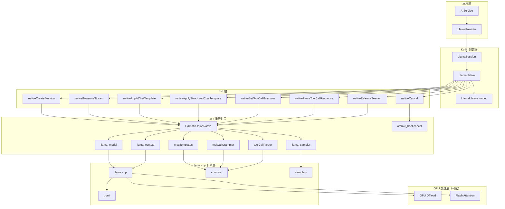

# Operit AI — llama 模块软件架构与业务流程快速上手

## 一、项目定位

`llama` 模块是 **Operit AI** 的 **llama.cpp 本地大语言模型推理引擎 JNI 封装模块**，为 Android 应用提供在设备端直接运行 GGUF 格式大语言模型的能力。它是整个 AI 服务架构中的**本地模型推理后端**，支持纯 CPU 推理以及 GPU 加速（通过 llama.cpp 的 GPU offload 机制）。

### 核心特性

| 特性 | 说明 |
|------|------|
| **llama.cpp 引擎** | 基于 ggerganov/llama.cpp 上游，支持 GGUF 格式模型 |
| **JNI 桥接** | C++ 层实现 JNI 接口，连接 Kotlin 与 llama.cpp |
| **流式生成** | 逐 token 流式输出，支持实时回调到 Java |
| **Chat Template** | 支持模型内置的聊天模板（Jinja2），自动格式化对话 |
| **结构化模板** | 支持 OpenAI 兼容格式的消息 + 工具定义 |
| **采样参数** | temperature、top_p、top_k、重复惩罚等完整采样控制 |
| **工具调用语法** | 支持 Grammar-based 工具调用约束（lazy/pattern/token 触发） |
| **工具调用解析** | 自动解析模型输出的工具调用为 OpenAI 兼容格式 |
| **GPU 卸载** | 支持将部分层卸载到 GPU 加速（需构建支持） |
| **Flash Attention** | 支持 Flash Attention 优化内存和速度 |
| **可中断生成** | 支持取消正在进行的生成任务 |
| **上下文管理** | 自动截断超长 prompt 以适应上下文窗口 |

### 技术栈

| 技术 | 版本/标准 | 用途 |
|------|----------|------|
| llama.cpp | upstream C++ | 本地 LLM 推理引擎 |
| C++ | C++17 | JNI 桥接层 |
| CMake | 3.22.1+ | 原生库构建 |
| Kotlin | JVM 17 | Runtime 封装层 |
| NDK | arm64-v8a | Android 原生开发 |
| nlohmann/json | header-only | JSON 解析（结构化模板） |

---

## 二、整体架构设计思想

### 2.1 分层架构（Layered Architecture）

```
┌─────────────────────────────────────────────────────────────────────────────┐
│                           应用层 (Application)                               │
│  ┌─────────────┐ ┌─────────────┐ ┌─────────────┐                           │
│  │ MNNProvider │ │ LlamaProvider│ │ AIService   │                          │
│  │ (MNN后端)   │ │ (llama后端)  │ │ (统一接口)  │                          │
│  └──────┬──────┘ └──────┬──────┘ └──────┬──────┘                           │
├─────────┼───────────────┼───────────────┼──────────────────────────────────┤
│         │               │               │                                   │
│         └───────────────┴───────┬───────┘                                   │
│                                 ▼                                           │
│  ┌─────────────────────────────────────────────────────────────────────┐   │
│  │                    Kotlin 封装层 (Kotlin Wrapper)                      │   │
│  │  ┌─────────────────┐ ┌─────────────────┐ ┌─────────────────────────┐ │   │
│  │  │   LlamaSession  │ │   LlamaNative   │ │ LlamaLibraryLoader      │ │   │
│  │  │ (会话管理)       │ │ (JNI 方法声明)   │ │ (动态库加载)            │ │   │
│  │  └─────────────────┘ └─────────────────┘ └─────────────────────────┘ │   │
│  └─────────────────────────────────────────────────────────────────────┘   │
├─────────────────────────────────────────────────────────────────────────────┤
│                           JNI 桥接层 (JNI Bridge)                            │
│  ┌─────────────────────────────────────────────────────────────────────┐   │
│  │                    LlamaNative (external methods)                     │   │
│  │  • nativeCreateSession(...) → jlong sessionPtr                       │   │
│  │  • nativeReleaseSession(sessionPtr)                                  │   │
│  │  • nativeCancel(sessionPtr)                                          │   │
│  │  • nativeCountTokens(sessionPtr, text) → Int                         │   │
│  │  • nativeSetSamplingParams(sessionPtr, ...) → Boolean                │   │
│  │  • nativeApplyChatTemplate(sessionPtr, roles, contents, ...) → String│   │
│  │  • nativeApplyStructuredChatTemplate(sessionPtr, messagesJson, ...)  │   │
│  │  • nativeGenerateStream(sessionPtr, prompt, maxTokens, callback)     │   │
│  │  • nativeSetToolCallGrammar(sessionPtr, grammar, triggerPatterns)    │   │
│  │  • nativeClearToolCallGrammar(sessionPtr)                            │   │
│  │  • nativeParseToolCallResponse(sessionPtr, content) → String         │   │
│  └─────────────────────────────────────────────────────────────────────┘   │
├─────────────────────────────────────────────────────────────────────────────┤
│                           C++ 运行时层 (C++ Runtime)                         │
│  ┌─────────────────────────────────────────────────────────────────────┐   │
│  │                      LlamaSessionNative 结构体                        │   │
│  │  • llama_model * model          — 模型实例                          │   │
│  │  • llama_context * ctx          — 上下文实例                        │   │
│  │  • llama_sampler * sampler      — 采样器链                         │   │
│  │  • common_chat_templates_ptr chatTemplates — 聊天模板               │   │
│  │  • SamplingParamsNative samplingParams — 采样参数                  │   │
│  │  • ToolCallGrammarConfigNative toolCallGrammar — 工具语法          │   │
│  │  • common_chat_parser_params toolCallParserParams — 工具解析器     │   │
│  │  • std::atomic_bool cancel      — 取消标志                         │   │
│  └─────────────────────────────────────────────────────────────────────┘   │
├─────────────────────────────────────────────────────────────────────────────┤
│                           llama.cpp 引擎层 (llama.cpp Engine)                │
│  ┌─────────────┐ ┌─────────────┐ ┌─────────────┐ ┌─────────────┐           │
│  │  llama.cpp  │ │   ggml      │ │  common     │ │   samplers  │           │
│  │ (核心推理)   │ │ (张量计算)   │ │ (聊天模板)   │ │ (采样策略)   │           │
│  └─────────────┘ └─────────────┘ └─────────────┘ └─────────────┘           │
└─────────────────────────────────────────────────────────────────────────────┘
```

### 2.2 架构模式

| 模式 | 应用位置 | 说明 |
|------|----------|------|
| **JNI 桥接模式** | C++ ↔ Kotlin | 通过 JNI 实现跨语言调用 |
| **对象池/会话模式** | LlamaSession | 每个模型一个会话，独立管理生命周期 |
| **回调模式** | GenerationCallback | C++ 逐 token 回调到 Java/Kotlin |
| **RAII** | LlamaSessionNative | 构造函数加载模型，析构函数释放资源 |
| **原子操作** | cancel 标志 | `std::atomic_bool` 实现线程安全的中断 |
| **双重检查锁定** | LlamaLibraryLoader | 确保动态库只加载一次 |

### 2.3 核心设计原则

1. **会话隔离**：每个 `LlamaSession` 独立管理模型、上下文、采样器，互不干扰
2. **线程安全**：`LlamaSession` 使用 `synchronized(lock)` 保护指针访问
3. **可中断生成**：`std::atomic_bool cancel` + `abort_callback` 实现随时取消
4. **资源自动管理**：RAII 模式确保 model/context/sampler 正确释放
5. **优雅降级**：无 llama.cpp 子模块时编译为 stub 实现，返回不可用状态
6. **上下文自适应**：超长 prompt 自动截断，保留生成空间

---

## 三、源码目录结构

```
llama/
│
├── src/main/
│   ├── cpp/
│   │   └── llama_jni_stub.cpp      # JNI 桥接 C++ 实现（~1376 行）
│   │
│   └── java/com/ai/assistance/llama/
│       ├── LlamaLibraryLoader.kt       # 动态库加载器（双重检查锁定）
│       ├── LlamaNative.kt              # JNI 方法声明（external）
│       └── LlamaSession.kt             # 会话封装（线程安全）
│
├── CMakeLists.txt                  # CMake 构建配置（条件编译）
├── build.gradle.kts                # Gradle 构建配置（Android Library）
├── consumer-rules.pro              # ProGuard 消费者规则
└── .gitignore

# 依赖文件（由 CMake 在构建时引入）
# third_party/llama.cpp/            # llama.cpp 上游源码（Git 子模块）
#   ├── llama.cpp                   # 核心推理引擎
#   ├── ggml/                       # 张量计算库
#   ├── common/                     # 通用工具（聊天模板、采样器等）
#   ├── include/                    # 头文件
#   └── ...
```

**注意**：`third_party/llama.cpp/` 是 Git 子模块，需要在构建前初始化。CMake 支持两个查找路径：
- 优先：`llama/third_party/llama.cpp/`
- 回退：`llama/../third_party/llama.cpp/`（项目根目录）

---

## 四、核心架构详解

### 4.1 C++ 层 — LlamaSessionNative 结构体

```cpp
// llama_jni_stub.cpp — LlamaSessionNative 核心结构

struct LlamaSessionNative {
    llama_model * model = nullptr;                    // 加载的模型
    llama_context * ctx = nullptr;                    // 推理上下文
    llama_sampler * sampler = nullptr;                // 采样器链
    common_chat_templates_ptr chatTemplates;          // 聊天模板（Jinja2）
    SamplingParamsNative samplingParams;              // 采样参数
    ToolCallGrammarConfigNative toolCallGrammar;      // 工具调用语法约束
    common_chat_parser_params toolCallParserParams;   // 工具调用解析参数
    bool hasToolCallParser = false;                   // 是否启用工具解析
    std::atomic_bool cancel{false};                   // 取消标志（线程安全）
};

struct SamplingParamsNative {
    float temperature = 1.0f;        // 温度（随机性）
    float topP = 1.0f;               // 核采样
    int32_t topK = 0;                // Top-K 采样
    int32_t penaltyLastN = 64;       // 重复惩罚窗口
    float repeatPenalty = 1.0f;      // 重复惩罚系数
    float frequencyPenalty = 0.0f;   // 频率惩罚
    float presencePenalty = 0.0f;    // 存在惩罚
    uint32_t seed = rand();          // 随机种子
};

struct ToolCallGrammarConfigNative {
    std::string grammar;                        // Grammar 字符串（GBNF）
    bool lazy = false;                          // 是否懒加载
    std::vector<std::string> triggerPatterns;   // 触发正则模式
    std::vector<llama_token> triggerTokens;     // 触发 token
    std::string generationPrompt;               // 生成提示前缀
};
```

### 4.2 采样器链构建

```cpp
// createSamplerChain — 构建完整的采样器链

static llama_sampler * createSamplerChain(
    const llama_vocab * vocab,
    float temperature,
    float topP,
    int32_t topK,
    int32_t penaltyLastN,
    float repeatPenalty,
    float frequencyPenalty,
    float presencePenalty,
    uint32_t seed,
    const ToolCallGrammarConfigNative * grammarConfig
) {
    llama_sampler_chain_params sparams = llama_sampler_chain_default_params();
    llama_sampler * chain = llama_sampler_chain_init(sparams);
    
    // 1. 重复惩罚采样器
    llama_sampler_chain_add(chain, llama_sampler_init_penalties(
        penaltyLastN, repeatPenalty, frequencyPenalty, presencePenalty
    ));
    
    // 2. Top-K 采样
    llama_sampler_chain_add(chain, llama_sampler_init_top_k(topK));
    
    // 3. Top-P 采样
    llama_sampler_chain_add(chain, llama_sampler_init_top_p(topP, 1));
    
    // 4. 温度采样
    llama_sampler_chain_add(chain, llama_sampler_init_temp(temperature));
    
    // 5. Grammar 约束（可选）
    if (grammarConfig != nullptr && !grammarConfig->grammar.empty()) {
        if (grammarConfig->lazy) {
            // 懒加载 Grammar：通过 pattern/token 触发
            llama_sampler * grammarSampler = llama_sampler_init_grammar_lazy_patterns(
                vocab,
                grammarConfig->grammar.c_str(),
                "root",
                triggerPatternsC.data(), triggerPatternsC.size(),
                grammarConfig->triggerTokens.data(), grammarConfig->triggerTokens.size()
            );
            llama_sampler_chain_add(chain, grammarSampler);
        } else {
            // 立即启用 Grammar
            llama_sampler * grammarSampler = llama_sampler_init_grammar(
                vocab, grammarConfig->grammar.c_str(), "root"
            );
            llama_sampler_chain_add(chain, grammarSampler);
        }
    }
    
    // 6. 随机分布采样器（最终采样）
    llama_sampler_chain_add(chain, llama_sampler_init_dist(seed));
    
    return chain;
}
```

**采样器链执行顺序**：

```
输入 logits
    │
    ├──► 1. Penalties（重复惩罚）
    │       • 降低已生成 token 的概率
    │       • 频率惩罚 + 存在惩罚
    │
    ├──► 2. Top-K（保留前 K 个）
    │       • 按概率排序，保留 topK 个
    │
    ├──► 3. Top-P（核采样）
    │       • 按概率累积，保留累积概率 >= topP 的最小集合
    │
    ├──► 4. Temperature（温度缩放）
    │       • logits /= temperature
    │       • temperature < 1 → 更确定；temperature > 1 → 更随机
    │
    ├──► 5. Grammar（语法约束）
    │       • 根据 GBNF grammar 过滤非法 token
    │       • 支持懒加载（pattern/token 触发）
    │
    └──► 6. Dist（随机采样）
            • 从剩余分布中随机采样一个 token
```

### 4.3 Kotlin 层 — LlamaSession 封装

```kotlin
// LlamaSession.kt — 线程安全的会话封装

class LlamaSession private constructor(
    private var sessionPtr: Long
) {

    data class Config(
        val nThreads: Int = 4,           // 线程数
        val nCtx: Int = 2048,            // 上下文长度
        val nBatch: Int = 512,           // 批处理大小
        val nUBatch: Int = 512,          // 微批处理大小
        val nGpuLayers: Int = 0,         // GPU 层数
        val useMmap: Boolean = false,    // 使用内存映射
        val flashAttention: Boolean = false,  // Flash Attention
        val kvUnified: Boolean = true,   // 统一 KV 缓存
        val offloadKqv: Boolean = false  // 卸载 KQV 到 GPU
    )

    companion object {
        fun isAvailable(): Boolean = 
            runCatching { LlamaNative.nativeIsAvailable() }.getOrDefault(false)

        fun create(pathModel: String, config: Config): LlamaSession? {
            if (!isAvailable()) return null
            val ptr = LlamaNative.nativeCreateSession(pathModel, ...)
            if (ptr == 0L) return null
            return LlamaSession(ptr)
        }
    }

    @Volatile
    private var released = false
    private val lock = Any()

    private fun checkValid() {
        if (released || sessionPtr == 0L) {
            throw RuntimeException("LlamaSession has been released")
        }
    }

    // 所有操作都通过 synchronized(lock) 保护
    fun countTokens(text: String): Int {
        synchronized(lock) {
            checkValid()
            return LlamaNative.nativeCountTokens(sessionPtr, text)
        }
    }

    fun generateStream(prompt: String, maxTokens: Int, onToken: (String) -> Boolean): Boolean {
        val ptr: Long
        synchronized(lock) {
            checkValid()
            ptr = sessionPtr
        }
        // 注意：生成过程中不持有锁，允许并发调用 cancel()
        return LlamaNative.nativeGenerateStream(ptr, prompt, maxTokens, callback)
    }

    fun cancel() {
        synchronized(lock) {
            if (released || sessionPtr == 0L) return
            LlamaNative.nativeCancel(sessionPtr)
        }
    }

    fun release() {
        val ptr: Long
        synchronized(lock) {
            if (released) return
            released = true
            ptr = sessionPtr
            sessionPtr = 0L
        }
        if (ptr != 0L) {
            LlamaNative.nativeReleaseSession(ptr)
        }
    }
}
```

**设计特点**：

- **双重检查**：`isAvailable()` 检查原生库是否可用
- **空指针保护**：`sessionPtr == 0L` 表示创建失败
- **状态校验**：所有操作前调用 `checkValid()`
- **细粒度锁**：`generateStream` 在获取指针后释放锁，允许 `cancel()` 并发执行
- **安全释放**：`release()` 先标记状态再释放资源，避免 use-after-free

### 4.4 JNI 方法完整列表

| Kotlin 方法 | C++ 函数 | 参数 | 返回值 | 说明 |
|-------------|----------|------|--------|------|
| `nativeIsAvailable()` | `Java_..._nativeIsAvailable` | — | Boolean | 原生库是否可用 |
| `nativeGetUnavailableReason()` | `Java_..._nativeGetUnavailableReason` | — | String | 不可用原因 |
| `nativeCreateSession(...)` | `Java_..._nativeCreateSession` | 模型路径 + 配置 | Long | 创建会话，返回指针 |
| `nativeReleaseSession(ptr)` | `Java_..._nativeReleaseSession` | sessionPtr | — | 释放会话资源 |
| `nativeCancel(ptr)` | `Java_..._nativeCancel` | sessionPtr | — | 设置取消标志 |
| `nativeCountTokens(ptr, text)` | `Java_..._nativeCountTokens` | sessionPtr, text | Int | 计算文本 token 数 |
| `nativeSetSamplingParams(...)` | `Java_..._nativeSetSamplingParams` | sessionPtr + 采样参数 | Boolean | 更新采样参数 |
| `nativeApplyChatTemplate(...)` | `Java_..._nativeApplyChatTemplate` | sessionPtr, roles, contents, addAssistant | String? | 应用简单聊天模板 |
| `nativeApplyStructuredChatTemplate(...)` | `Java_..._nativeApplyStructuredChatTemplate` | sessionPtr, messagesJson, toolsJson, addAssistant | String? | 应用结构化模板（含工具） |
| `nativeGenerateStream(...)` | `Java_..._nativeGenerateStream` | sessionPtr, prompt, maxTokens, callback | Boolean | 流式生成文本 |
| `nativeSetToolCallGrammar(...)` | `Java_..._nativeSetToolCallGrammar` | sessionPtr, grammar, triggerPatterns | Boolean | 设置工具调用语法 |
| `nativeClearToolCallGrammar(ptr)` | `Java_..._nativeClearToolCallGrammar` | sessionPtr | Boolean | 清除工具调用语法 |
| `nativeParseToolCallResponse(...)` | `Java_..._nativeParseToolCallResponse` | sessionPtr, content | String? | 解析工具调用响应 |

---

## 五、核心业务流程

### 5.1 会话创建流程

```
应用层调用 LlamaSession.create(pathModel, config)
    │
    ├──► 检查 isAvailable()
    │       • 无 llama.cpp 子模块 → 返回 false（stub 模式）
    │       • 有子模块且编译成功 → 继续
    │
    ├──► LlamaNative.nativeCreateSession(pathModel, nThreads, nCtx, ...)
    │       │
    │       ├──► C++: ensureBackendInit()
    │       │       • std::call_once → llama_backend_init()
    │       │       • 初始化 GGML 后端（CPU/GPU）
    │       │
    │       ├──► 创建 LlamaSessionNative 实例
    │       │
    │       ├──► 加载模型
    │       │       llama_model_params mparams = llama_model_default_params();
    │       │       mparams.n_gpu_layers = effectiveGpuLayers;
    │       │       mparams.use_mmap = useMmap;
    │       │       session->model = llama_model_load_from_file(path, mparams);
    │       │
    │       ├──► 初始化聊天模板
    │       │       session->chatTemplates = common_chat_templates_init(model, "");
    │       │
    │       ├──► 创建上下文
    │       │       llama_context_params cparams = llama_context_default_params();
    │       │       cparams.n_ctx = nCtx;
    │       │       cparams.n_batch = nBatch;
    │       │       cparams.n_threads = nThreads;
    │       │       cparams.flash_attn_type = ...;
    │       │       cparams.abort_callback = abortCallback;  // 绑定取消回调
    │       │       cparams.abort_callback_data = session;
    │       │       session->ctx = llama_init_from_model(model, cparams);
    │       │
    │       ├──► 构建采样器链
    │       │       createSamplerChain(vocab, temperature=1.0, topP=1.0, ...)
    │       │
    │       └──► 返回 sessionPtr（jlong 指针）
    │
    └──► Kotlin: 包装为 LlamaSession 对象
```

### 5.2 流式生成流程

```
应用层调用 session.generateStream(prompt, maxTokens, onToken)
    │
    ├──► LlamaNative.nativeGenerateStream(sessionPtr, prompt, maxTokens, callback)
    │       │
    │       ├──► 重置状态
    │       │       • session->cancel.store(false)
    │       │       • llama_memory_clear(mem, true) — 清空 KV 缓存
    │       │       • llama_sampler_reset(sampler) — 重置采样器
    │       │
    │       ├──► Tokenize prompt
    │       │       llama_tokenize(vocab, prompt, ..., addSpecial=true)
    │       │       • 移除末尾 EOG/EOS token
    │       │       • 超长截断：保留 n_ctx - reserveForGeneration
    │       │
    │       ├──► Prefill（提示词评估）
    │       │       llama_batch_get_one(promptTokens.data(), nPrompt)
    │       │       llama_decode(ctx, batch)
    │       │       • 如果是 encoder-decoder 模型：先 encode 再 decode
    │       │
    │       ├──► prefillToolCallGenerationPrompt()
    │       │       • 如果启用了工具调用语法，预填充生成提示前缀
    │       │
    │       └──► 生成循环（Generation Loop）
    │               │
    │               for (i = 0; i < maxNew; i++) {
    │                   │
    │                   ├──► 检查取消
    │                   │       if (session->cancel.load()) break;
    │                   │
    │                   ├──► 采样下一个 token
    │                   │       newToken = llama_sampler_sample(sampler, ctx, -1)
    │                   │       llama_sampler_accept(sampler, newToken)
    │                   │
    │                   ├──► 检查 EOG（End of Generation）
    │                   │       if (llama_vocab_is_eog(vocab, newToken)) break;
    │                   │
    │                   ├──► 反序列化已生成 token
    │                   │       llama_detokenize(vocab, generatedTokens, ..., buf)
    │                   │       • 计算 delta = decodedNow - prevDecoded
    │                   │       • 解决多字节 UTF-8 分割问题
    │                   │
    │                   ├──► 回调 Java
    │                   │       env->CallBooleanMethod(callback, midOnToken, jdelta)
    │                   │       • 如果返回 false → 停止生成
    │                   │       • 如果 Java 抛出异常 → 停止生成
    │                   │
    │                   ├──► 检查上下文窗口
    │                   │       if (n_past >= n_ctx) break;
    │                   │
    │                   └──► 解码下一个 token
    │                           llama_batch_get_one(&newToken, 1)
    │                           llama_decode(ctx, batch)
    │                           n_past += 1
    │               }
    │
    └──► 返回生成是否成功
```

**关键设计点**：

- **增量反序列化**：每次生成新 token 后，反序列化全部已生成 token 序列，计算增量文本，解决 token piece 分割多字节字符的问题
- **上下文截断**：如果 prompt 超过上下文窗口，自动截断保留尾部，确保有空间生成回复
- **取消机制**：`cancel.store(true)` → `abortCallback` 返回 true → `llama_decode` 返回 2（aborted）

### 5.3 Chat Template 应用流程

```
应用层调用 session.applyChatTemplate(roles, contents, addAssistant)
    │
    ├──► 简单模板（roles + contents 数组）
    │       │
    │       ├──► 构建 common_chat_msg 数组
    │       │       msg.role = roles[i]
    │       │       msg.content = contents[i]
    │       │
    │       ├──► 构建输入
    │       │       common_chat_templates_inputs inputs;
    │       │       inputs.messages = messages;
    │       │       inputs.add_generation_prompt = addAssistant;
    │       │       inputs.use_jinja = true;
    │       │
    │       └──► 应用模板
    │               common_chat_templates_apply(templates, inputs)
    │               → 返回格式化后的 prompt 字符串
    │
    └──► 结构化模板（OpenAI 兼容格式）
            │
            ├──► 解析 JSON
            │       nlohmann::json::parse(messagesJson)
            │       nlohmann::json::parse(toolsJson)
            │
            ├──► 转换为内部格式
            │       common_chat_msgs_parse_oaicompat(messages)
            │       common_chat_tools_parse_oaicompat(tools)
            │
            ├──► 构建输入
            │       inputs.tool_choice = AUTO / NONE
            │       inputs.add_generation_prompt = addAssistant
            │
            ├──► 应用模板
            │       common_chat_templates_apply(templates, inputs)
            │       → 返回 prompt + 工具调用 grammar
            │
            ├──► 提取 Grammar 配置
            │       buildToolCallGrammarConfig(params)
            │       • grammar 字符串
            │       • lazy 模式
            │       • triggerPatterns / triggerTokens
            │       • generationPrompt
            │
            ├──► 设置工具解析器
            │       session->toolCallParserParams = params
            │       session->hasToolCallParser = !params.parser.empty()
            │
            └──► 重建采样器（启用 Grammar 约束）
                    rebuildSamplerForSession(session)
```

### 5.4 工具调用流程

```
1. 设置工具调用语法
    │
    ├──► session.setToolCallGrammar(grammar, triggerPatterns)
    │       │
    │       ├──► 解析 Grammar 字符串
    │       ├──► 解析触发模式数组
    │       ├──► 保存到 session->toolCallGrammar
    │       └──► rebuildSamplerForSession() — 重建采样器链（加入 Grammar 约束）
    │
    └──► 或：session.applyStructuredChatTemplate(messages, tools, addAssistant)
            • 自动从模板中提取 Grammar 配置
            • 自动设置工具解析器

2. 生成时约束
    │
    ├──► Grammar 采样器在采样链中过滤非法 token
    │       • 确保模型输出符合 Grammar 定义的结构
    │       • 支持懒加载：通过 pattern/token 触发 Grammar 激活
    │
    └──► 预填充生成提示
            prefillToolCallGenerationPrompt()
            • 将 generationPrompt token 预注入采样器

3. 解析工具调用
    │
    ├──► 生成完成后，调用 session.parseToolCallResponse(content)
    │       │
    │       ├──► common_chat_parse(content, false, parserParams)
    │       │       • 使用模型内置的 parser 解析输出
    │       │
    │       ├──► 提取 tool_calls
    │       │       parsed.tool_calls
    │       │
    │       └──► 转换为 OpenAI 兼容 JSON
    │               { "tool_calls": [...] }
    │
    └──► 返回 JSON 字符串给业务层

4. 清除工具调用语法
    │
    └──► session.clearToolCallGrammar()
            • 重置 toolCallGrammar
            • 重建采样器链（移除 Grammar 约束）
```

### 5.5 异常处理与资源释放流程

```
会话释放
    │
    ├──► Kotlin: session.release()
    │       │
    │       ├──► synchronized(lock)
    │       │       • 标记 released = true
    │       │       • 保存 ptr = sessionPtr
    │       │       • sessionPtr = 0L
    │       │
    │       └──► LlamaNative.nativeReleaseSession(ptr)
    │               │
    │               ├──► C++: 释放采样器
    │               │       llama_sampler_free(session->sampler)
    │               │
    │               ├──► 释放上下文
    │               │       llama_free(session->ctx)
    │               │
    │               ├──► 释放聊天模板
    │               │       session->chatTemplates.reset()
    │               │
    │               ├──► 释放模型
    │               │       llama_model_free(session->model)
    │               │
    │               └──► delete session
    │
    └──► 此后所有操作抛出 "LlamaSession has been released"

异常处理
    │
    ├──► 模型加载失败
    │       • 日志记录 → 删除 session → 返回 0
    │
    ├──► 上下文创建失败
    │       • 释放模型 → 删除 session → 返回 0
    │
    ├──► 采样器创建失败
    │       • 释放上下文 → 释放模型 → 删除 session → 返回 0
    │
    ├──► 生成过程中异常
    │       • Java 回调异常 → 清除异常 → 停止生成
    │       • llama_decode 失败 → 日志记录 → 返回 false
    │
    └──► 模板应用异常
            • catch std::exception → 恢复之前状态 → 日志记录 → 返回 null
            • catch ... → 恢复之前状态 → 日志记录 → 返回 null
```

---

## 六、CMake 构建配置

```cmake
# CMakeLists.txt — 条件编译设计

cmake_minimum_required(VERSION 3.22.1)
project("llama_jni")

# 查找 llama.cpp 子模块（两个可能路径）
set(LLAMA_CPP_DIR "${CMAKE_CURRENT_SOURCE_DIR}/third_party/llama.cpp")
set(LLAMA_CPP_DIR_FALLBACK "${CMAKE_CURRENT_SOURCE_DIR}/../third_party/llama.cpp")

if (EXISTS "${LLAMA_CPP_DIR}/CMakeLists.txt")
    set(OPERIT_LLAMA_CPP_DIR "${LLAMA_CPP_DIR}")
elseif (EXISTS "${LLAMA_CPP_DIR_FALLBACK}/CMakeLists.txt")
    set(OPERIT_LLAMA_CPP_DIR "${LLAMA_CPP_DIR_FALLBACK}")
endif()

if (DEFINED OPERIT_LLAMA_CPP_DIR)
    # 找到子模块：构建完整功能
    set(LLAMA_BUILD_COMMON ON CACHE BOOL "" FORCE)   # 构建 common 库（聊天模板）
    set(LLAMA_BUILD_TESTS OFF CACHE BOOL "" FORCE)    # 不构建测试
    set(LLAMA_BUILD_TOOLS OFF CACHE BOOL "" FORCE)    # 不构建工具
    set(LLAMA_BUILD_EXAMPLES OFF CACHE BOOL "" FORCE) # 不构建示例
    set(LLAMA_BUILD_SERVER OFF CACHE BOOL "" FORCE)   # 不构建服务器

    add_subdirectory("${OPERIT_LLAMA_CPP_DIR}" "${CMAKE_BINARY_DIR}/llama.cpp")
endif()

# 构建共享库
add_library(LlamaWrapper SHARED src/main/cpp/llama_jni_stub.cpp)

if (DEFINED OPERIT_LLAMA_CPP_DIR)
    # 完整模式：链接 llama.cpp
    target_compile_definitions(LlamaWrapper PRIVATE OPERIT_HAS_LLAMA_CPP=1)
    target_include_directories(LlamaWrapper PRIVATE
        "${OPERIT_LLAMA_CPP_DIR}"
        "${OPERIT_LLAMA_CPP_DIR}/common"
        "${OPERIT_LLAMA_CPP_DIR}/include"
        "${OPERIT_LLAMA_CPP_DIR}/ggml/include"
    )
    target_link_libraries(LlamaWrapper llama common)
else()
    # Stub 模式：无 llama.cpp，返回不可用
    target_compile_definitions(LlamaWrapper PRIVATE OPERIT_HAS_LLAMA_CPP=0)
endif()

target_link_libraries(LlamaWrapper android log)

# Android 15+ 16KB 页大小支持
target_link_options(LlamaWrapper PRIVATE "-Wl,-z,max-page-size=16384")
```

**条件编译策略**：

| 模式 | 条件 | 行为 |
|------|------|------|
| **完整模式** | `third_party/llama.cpp/` 存在 | 编译完整 JNI 实现，链接 llama + common |
| **Stub 模式** | 子模块缺失 | 编译空实现，`nativeIsAvailable()` 返回 false |

---

## 七、Gradle 构建配置

```kotlin
// build.gradle.kts

plugins {
    alias(libs.plugins.android.library)
    alias(libs.plugins.kotlin.android)
}

android {
    namespace = "com.ai.assistance.llama"
    compileSdk = 36

    defaultConfig {
        minSdk = 26
        targetSdk = 34

        ndk {
            abiFilters.addAll(listOf("arm64-v8a"))  // 仅 arm64
        }

        externalNativeBuild {
            cmake {
                cppFlags += listOf("-std=c++17", "-fno-emulated-tls")
                arguments += listOf(
                    "-DANDROID_STL=c++_static",
                    "-DANDROID_PLATFORM=android-26",
                    "-DANDROID_SUPPORT_FLEXIBLE_PAGE_SIZES=ON",
                    "-DLLAMA_BUILD_COMMON=ON"
                )
            }
        }
    }

    externalNativeBuild {
        cmake {
            path = file("CMakeLists.txt")
            version = "3.22.1"
        }
    }

    compileOptions {
        sourceCompatibility = JavaVersion.VERSION_17
        targetCompatibility = JavaVersion.VERSION_17
    }
}

kotlin {
    compilerOptions {
        jvmTarget = JvmTarget.JVM_17
    }
}
```

---

## 八、完整架构图（Mermaid）



---

## 九、快速上手路径

### 9.1 初始化 llama.cpp 子模块

```bash
# 在项目根目录执行
git submodule update --init --recursive third_party/llama.cpp
```

### 9.2 创建会话并生成文本

```kotlin
// 1. 检查可用性
if (!LlamaSession.isAvailable()) {
    println("llama.cpp 不可用: ${LlamaSession.getUnavailableReason()}")
    return
}

// 2. 创建会话
val session = LlamaSession.create(
    pathModel = "/path/to/model.gguf",
    config = LlamaSession.Config(
        nThreads = 4,
        nCtx = 4096,
        nGpuLayers = 0  // 或设置为 >0 启用 GPU 卸载
    )
) ?: return

// 3. 应用聊天模板
val prompt = session.applyChatTemplate(
    roles = listOf("system", "user"),
    contents = listOf("You are a helpful assistant.", "Hello!"),
    addAssistant = true
) ?: return

// 4. 设置采样参数
session.setSamplingParams(
    temperature = 0.7f,
    topP = 0.9f,
    topK = 40,
    repetitionPenalty = 1.1f
)

// 5. 流式生成
val success = session.generateStream(
    prompt = prompt,
    maxTokens = 256,
    onToken = { token ->
        print(token)  // 实时输出
        true  // 继续生成
    }
)

// 6. 释放资源
session.release()
```

### 9.3 使用结构化模板（支持工具调用）

```kotlin
// 1. 准备 OpenAI 兼容格式的消息
val messagesJson = """
    [
        {"role": "system", "content": "You are a helpful assistant."},
        {"role": "user", "content": "What's the weather?"}
    ]
""".trimIndent()

// 2. 准备工具定义
val toolsJson = """
    [
        {
            "type": "function",
            "function": {
                "name": "get_weather",
                "parameters": {
                    "type": "object",
                    "properties": {
                        "location": {"type": "string"}
                    }
                }
            }
        }
    ]
""".trimIndent()

// 3. 应用结构化模板（自动提取 Grammar）
val prompt = session.applyStructuredChatTemplate(
    messagesJson = messagesJson,
    toolsJson = toolsJson,
    addAssistant = true
) ?: return

// 4. 生成
session.generateStream(prompt, 256) { token ->
    print(token)
    true
}

// 5. 解析工具调用（生成完成后）
val toolCallsJson = session.parseToolCallResponse(fullResponse)
if (toolCallsJson != null) {
    println("Tool calls: $toolCallsJson")
}

// 6. 清除工具调用语法（恢复普通生成）
session.clearToolCallGrammar()
```

### 9.4 取消生成

```kotlin
// 在另一个线程/协程中调用
session.cancel()  // 设置 cancel 标志，生成循环会安全退出
```

---

*文档生成时间: 2026-05-13*
*基于 Operit AI llama 模块代码分析*
