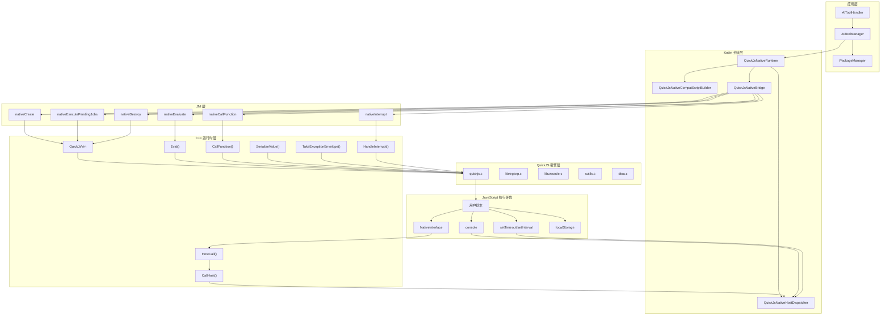

# Operit AI — quickjs 模块软件架构与业务流程快速上手

## 一、项目定位

`quickjs` 模块是 **Operit AI** 的 **QuickJS JavaScript 引擎 JNI 封装模块**，为 Android 应用提供高性能的 JavaScript 执行环境。它是整个工具系统中 **JS 工具（ToolPkg/Script）** 的运行时基础，支持在 Android 端执行用户自定义 JavaScript 代码。

### 核心特性

| 特性 | 说明 |
|------|------|
| **QuickJS 引擎** | 基于 Fabrice Bellard 的 QuickJS，ES2020 支持 |
| **JNI 桥接** | C++ 层实现 JNI 接口，连接 Java/Kotlin 与 QuickJS |
| **Host Bridge** | JS 调用 Java 的双向通信机制 |
| **Timer 支持** | setTimeout/setInterval 定时器实现 |
| **Console 支持** | console.log/info/warn/error/debug 完整实现 |
| **Storage 支持** | localStorage/sessionStorage 内存存储 |
| **中断机制** | 支持强制中断长时间运行的 JS 脚本 |
| **异常处理** | 详细的异常信息收集（堆栈、调用链、上下文） |
| **引擎池** | 最多 4 个并发引擎，Channel 池化管理 |

### 技术栈

| 技术 | 版本/标准 | 用途 |
|------|----------|------|
| QuickJS | upstream C 源码 | JS 引擎核心 |
| C++ | C++17 | JNI 桥接层 |
| C | C11 | QuickJS 源码编译 |
| CMake | 3.22.1+ | 原生库构建 |
| Kotlin | JVM 17 | Runtime 封装层 |
| NDK | arm64-v8a | Android 原生开发 |

---

## 二、整体架构设计思想

### 2.1 分层架构（Layered Architecture）

```
┌─────────────────────────────────────────────────────────────────────────────┐
│                           应用层 (Application)                               │
│  ┌─────────────┐ ┌─────────────┐ ┌─────────────┐                           │
│  │ JsToolManager│ │ PackageManager│ │ AIToolHandler│                         │
│  │ (工具管理)   │ │ (包管理)     │ │ (工具注册)   │                         │
│  └──────┬──────┘ └──────┬──────┘ └──────┬──────┘                           │
├─────────┼───────────────┼───────────────┼──────────────────────────────────┤
│         │               │               │                                   │
│         └───────────────┴───────┬───────┘                                   │
│                                 ▼                                           │
│  ┌─────────────────────────────────────────────────────────────────────┐   │
│  │                    Kotlin 封装层 (Kotlin Wrapper)                      │   │
│  │  ┌─────────────────┐ ┌─────────────────┐ ┌─────────────────────────┐ │   │
│  │  │QuickJsNativeRuntime│ │QuickJsNativeHostDispatcher│ │QuickJsNativeCompatScript│ │   │
│  │  │ (Runtime 封装)   │ │ (HostBridge 实现)│ │ (JS 兼容层构建)         │ │   │
│  │  └─────────────────┘ └─────────────────┘ └─────────────────────────┘ │   │
│  │  ┌─────────────────┐                                                 │   │
│  │  │   JsEngine      │                                                 │   │
│  │  │ (引擎实例封装)   │                                                 │   │
│  │  └─────────────────┘                                                 │   │
│  └─────────────────────────────────────────────────────────────────────┘   │
├─────────────────────────────────────────────────────────────────────────────┤
│                           JNI 桥接层 (JNI Bridge)                            │
│  ┌─────────────────────────────────────────────────────────────────────┐   │
│  │                    QuickJsNativeBridge (object)                      │   │
│  │  • nativeCreate(hostBridge) → jlong handle                           │   │
│  │  • nativeDestroy(handle)                                             │   │
│  │  • nativeEvaluate(handle, script, fileName) → JSON result            │   │
│  │  • nativeCallFunction(handle, funcName, argsJson, callSite) → JSON   │   │
│  │  • nativeExecutePendingJobs(handle, maxJobs) → Int                   │   │
│  │  • nativeInterrupt(handle)                                           │   │
│  └─────────────────────────────────────────────────────────────────────┘   │
├─────────────────────────────────────────────────────────────────────────────┤
│                           C++ 运行时层 (C++ Runtime)                         │
│  ┌─────────────────────────────────────────────────────────────────────┐   │
│  │                        QuickJsVm 类                                  │   │
│  │  • JSRuntime / JSContext 管理                                        │   │
│  │  • Eval / CallFunction 执行                                          │   │
│  │  • HostCallEntry → HostCall → CallHost (JNI 回调 Java)              │   │
│  │  • InterruptHandler 中断处理                                         │   │
│  │  • SerializeValue JSON 序列化                                        │   │
│  │  • TakeExceptionEnvelope 异常封装                                    │   │
│  └─────────────────────────────────────────────────────────────────────┘   │
├─────────────────────────────────────────────────────────────────────────────┤
│                           QuickJS 引擎层 (QuickJS Engine)                    │
│  ┌─────────────┐ ┌─────────────┐ ┌─────────────┐ ┌─────────────┐           │
│  │  quickjs.c  │ │ libregexp.c │ │ libunicode.c│ │  cutils.c   │           │
│  │ (核心引擎)   │ │ (正则引擎)   │ │ (Unicode)   │ │ (工具函数)   │           │
│  └─────────────┘ └─────────────┘ └─────────────┘ └─────────────┘           │
└─────────────────────────────────────────────────────────────────────────────┘
```

### 2.2 架构模式

| 模式 | 应用位置 | 说明 |
|------|----------|------|
| **JNI 桥接模式** | C++ ↔ Kotlin | 通过 JNI 实现跨语言调用 |
| **对象池模式** | JsToolManager | Channel 管理 4 个引擎实例 |
| **代理模式** | NativeInterface Proxy | JS 端代理所有未定义属性为 Host Call |
| **回调模式** | HostBridge | JS 通过 NativeInterface.__call 回调 Java |
| **RAII** | QuickJsVm | 构造函数创建资源，析构函数释放资源 |
| **单例模式** | JsToolManager | 全局单例管理 JS 工具执行 |

### 2.3 核心设计原则

1. **线程安全**：QuickJsVm 使用 `std::mutex` 保护执行，支持多线程环境下的安全调用
2. **资源自动管理**：RAII 模式确保 JSRuntime/JSContext 正确释放，避免内存泄漏
3. **异常信息丰富**：异常收集包括消息、堆栈、文件名、行号、最近 Host 调用链等
4. **可中断执行**：通过原子标志 + QuickJS 中断处理器实现脚本强制终止
5. **兼容层设计**：通过 JS 兼容脚本补齐浏览器环境（console、timer、storage 等）

---

## 三、源码目录结构

```
quickjs/
│
├── src/main/
│   ├── cpp/
│   │   ├── CMakeLists.txt          # CMake 构建配置
│   │   └── quickjs_jni.cpp         # JNI 桥接 C++ 实现（~864 行）
│   │
│   └── java/com/ai/assistance/operit/core/tools/javascript/
│       ├── QuickJsNativeBridge.kt      # JNI 桥接 Kotlin 声明（external 方法）
│       ├── QuickJsNativeRuntime.kt     # Runtime 封装（创建/执行/关闭）
│       ├── QuickJsNativeHostDispatcher.kt # HostBridge 实现（console + timer）
│       └── QuickJsNativeCompatScriptBuilder.kt # JS 兼容层脚本构建
│
├── build.gradle.kts              # Gradle 构建配置（Android Library）
├── README.md                     # 模块说明
└── .gitignore

# 依赖文件（由 CMake 在构建时引入）
# thirdparty/quickjs/             # QuickJS 上游 C 源码（外部目录）
#   ├── quickjs.c                 # QuickJS 核心引擎
#   ├── libregexp.c               # 正则表达式引擎
#   ├── libunicode.c              # Unicode 支持
#   ├── cutils.c                  # C 工具函数
#   └── dtoa.c                    # 浮点数转换
```

**注意**：`thirdparty/quickjs/` 目录在构建时通过 CMake 的相对路径引用（`../../../thirdparty/quickjs`），不在 `quickjs` 模块目录内。

---

## 四、核心架构详解

### 4.1 C++ 层 — QuickJsVm 类

```cpp
// quickjs_jni.cpp — QuickJsVm 核心类

class QuickJsVm {
public:
    // 构造函数：创建 JSRuntime + JSContext + 注册 HostBridge
    QuickJsVm(JavaVM* java_vm, JNIEnv* env, jobject host_bridge);
    
    // 析构函数：释放所有资源
    ~QuickJsVm();
    
    // 执行 JS 脚本
    std::string Eval(const std::string& script, const std::string& file_name);
    
    // 调用全局 JS 函数
    std::string CallFunction(
        const std::string& function_name,
        const std::string& args_json,
        const std::string& call_site
    );
    
    // 执行待处理任务（Promise/microtask）
    int ExecutePendingJobs(int max_jobs);
    
    // 中断执行
    void Interrupt();

private:
    // 安装 NativeInterface 到 JS 全局对象
    void InstallNativeInterface();
    
    // Host Call 入口（C 函数，被 QuickJS 调用）
    static JSValue HostCallEntry(JSContext* context, JSValueConst this_value, int argc, JSValueConst* argv);
    
    // Host Call 实现（调用 Java HostBridge.onCall）
    JSValue HostCall(JSContext* context, int argc, JSValueConst* argv);
    
    // 通过 JNI 调用 Java
    HostCallResult CallHost(const std::string& method, const std::optional<std::string>& args_json);
    
    // 序列化 JSValue 为 JSON
    std::string SerializeValue(JSValueConst value);
    
    // 获取并封装异常信息
    std::string TakeExceptionEnvelope();
    
    // 中断处理器
    static int HandleInterrupt(JSRuntime* runtime, void* opaque);
    
    JavaVM* java_vm_ = nullptr;
    JSRuntime* runtime_ = nullptr;
    JSContext* context_ = nullptr;
    jobject host_bridge_ = nullptr;       // Java HostBridge 全局引用
    jmethodID on_call_method_ = nullptr;  // HostBridge.onCall 方法 ID
    std::mutex lock_;                     // 执行锁
    std::atomic_bool interrupted_;        // 中断标志
    // ... 执行追踪字段
};
```

**关键 JNI 方法映射：**

| JNI 方法 | C++ 函数 | 说明 |
|----------|----------|------|
| `nativeCreate(hostBridge)` | `Java_..._QuickJsNativeBridge_nativeCreate` | 创建 QuickJsVm 实例，返回句柄 |
| `nativeDestroy(handle)` | `Java_..._QuickJsNativeBridge_nativeDestroy` | 销毁 QuickJsVm 实例 |
| `nativeEvaluate(handle, script, fileName)` | `Java_..._nativeEvaluate` | 执行 JS 脚本 |
| `nativeCallFunction(handle, funcName, argsJson, callSite)` | `Java_..._nativeCallFunction` | 调用 JS 函数 |
| `nativeExecutePendingJobs(handle, maxJobs)` | `Java_..._nativeExecutePendingJobs` | 执行待处理任务 |
| `nativeInterrupt(handle)` | `Java_..._nativeInterrupt` | 设置中断标志 |

### 4.2 Kotlin 层 — QuickJsNativeRuntime

```kotlin
// QuickJsNativeRuntime.kt — Kotlin Runtime 封装

class QuickJsNativeRuntime private constructor(
    private val handle: Long,
    private val hostBridge: HostBridge
) : Closeable {

    interface HostBridge {
        fun onCall(method: String, argsJson: String?): String?
    }

    data class EvalResult(
        val success: Boolean,
        val valueJson: String?,       // 成功时的返回值 JSON
        val errorMessage: String?,    // 错误消息
        val errorStack: String?,      // 错误堆栈
        val errorDetailsJson: String? // 详细错误信息 JSON
    )

    companion object {
        fun create(hostBridge: HostBridge): QuickJsNativeRuntime {
            val handle = QuickJsNativeBridge.nativeCreate(hostBridge)
            require(handle != 0L) { "Failed to create QuickJS runtime" }
            return QuickJsNativeRuntime(handle, hostBridge)
        }
    }

    // 执行 JS 脚本
    fun eval(script: String, fileName: String = "<eval>"): EvalResult {
        val resultJson = QuickJsNativeBridge.nativeEvaluate(handle, script, fileName)
        return parseEvalResult(resultJson)
    }

    // 调用 JS 全局函数
    fun callFunction(functionName: String, argsJson: String, callSite: String): EvalResult {
        val resultJson = QuickJsNativeBridge.nativeCallFunction(handle, functionName, argsJson, callSite)
        return parseEvalResult(resultJson)
    }

    // 安装兼容层（console、timer、storage 等）
    fun installCompatLayerOrThrow() {
        val result = eval(script = buildQuickJsCompatScript(), fileName = "<quickjs-compat>")
        executePendingJobs()
        check(result.success) { result.describeFailure("Failed to initialize QuickJS compat layer") }
    }

    // 执行待处理任务（Promise、timer callback）
    fun executePendingJobs(maxJobs: Int = 128): Int {
        return QuickJsNativeBridge.nativeExecutePendingJobs(handle, maxJobs)
    }

    // 分发定时器回调
    fun dispatchTimer(timerId: Int): EvalResult {
        return eval(script = "globalThis.__operitDispatchTimer($timerId)", fileName = "<timer:$timerId>")
    }

    // 清除所有定时器
    fun clearAllTimers(): EvalResult {
        return eval(script = "globalThis.__operitClearAllTimers()", fileName = "<clear-all-timers>")
    }

    // 中断执行
    fun interrupt() {
        if (!closed.get()) {
            QuickJsNativeBridge.nativeInterrupt(handle)
        }
    }

    // 关闭并释放资源
    override fun close() {
        if (closed.compareAndSet(false, true)) {
            QuickJsNativeBridge.nativeDestroy(handle)
        }
    }
}
```

### 4.3 HostBridge — 双向通信核心

```
┌─────────────────────────────────────────────────────────────────────────────┐
│                           HostBridge 通信流程                                 │
└─────────────────────────────────────────────────────────────────────────────┘

    JavaScript 端                              Java/Kotlin 端
    ─────────────                              ─────────────
         │                                           │
         │  1. JS 调用 NativeInterface.xxx()         │
         │     (通过 Proxy 代理)                      │
         │                                           │
         ├──► NativeInterface.__call(method, args) ──┼──► C++ HostCallEntry()
         │                                           │      │
         │                                           │      ├──► QuickJsVm::HostCall()
         │                                           │      │      ├──► 记录调用
         │                                           │      │      └──► CallHost()
         │                                           │      │             │
         │                                           │      │             ├──► JNI AttachCurrentThread
         │                                           │      │             ├──► env->CallObjectMethod(
         │                                           │      │             │      host_bridge_,
         │                                           │      │             │      on_call_method_,
         │                                           │      │             │      j_method, j_args
         │                                           │      │             │    )
         │                                           │      │             │
         │                                           │      │             └──► Java HostBridge.onCall()
         │                                           │      │                    │
         │                                           │      │                    ├──► console.xxx → null
         │                                           │      │                    ├──► scheduleTimer/cancelTimer → 定时器调度
         │                                           │      │                    └──► 其他 → forwardCall() → 业务处理
         │                                           │      │
         │                                           │      ├──► 返回结果给 JS
         │                                           │      │
         │  2. JS 获得返回值 ◄─────────────────────────┼──► JS_NewStringLen()
         │                                           │
         │  3. 定时器到期                              │
         │                                           │
         │◄── dispatchTimer(timerId) ─────────────────┼──► Java 定时器线程回调
         │     执行 __operitDispatchTimer(id)         │
         │                                           │
```

### 4.4 JS 兼容层 — 浏览器环境补齐

```javascript
// buildQuickJsCompatScript() 生成的兼容脚本

(function() {
    // 1. 全局对象标准化
    var root = typeof globalThis !== 'undefined' ? globalThis : this;
    root.globalThis = root;
    root.window = root;
    root.self = root;
    root.global = root;

    // 2. NativeInterface Proxy — 所有属性访问转为 Host Call
    root.NativeInterface = new Proxy({}, {
        get: function(_, property) {
            return function() {
                return callHost(String(property), Array.prototype.slice.call(arguments));
            };
        }
    });

    // 3. Console 实现
    root.console = {};
    ['log', 'info', 'warn', 'error', 'debug'].forEach(function(level) {
        root.console[level] = function() {
            var args = Array.prototype.slice.call(arguments).map(function(value) {
                if (typeof value === 'string') return value;
                try { return JSON.stringify(value); } catch (_error) { return String(value); }
            });
            callHost('console.' + level, args);
        };
    });

    // 4. queueMicrotask
    root.queueMicrotask = function(callback) {
        Promise.resolve().then(callback);
    };

    // 5. Storage（内存实现）
    function createStorage() {
        var store = {};
        return {
            get length() { return Object.keys(store).length; },
            key: function(index) { /* ... */ },
            getItem: function(key) { /* ... */ },
            setItem: function(key, value) { /* ... */ },
            removeItem: function(key) { /* ... */ },
            clear: function() { /* ... */ }
        };
    }
    root.localStorage = createStorage();
    root.sessionStorage = createStorage();

    // 6. performance.now()
    root.performance = { now: function() { return Date.now() - start; } };

    // 7. Timer 实现（委托给 Java 调度）
    root.setTimeout = function(callback, delay) {
        return scheduleTimer(callback, delay, false, arguments);
    };
    root.setInterval = function(callback, delay) {
        return scheduleTimer(callback, delay, true, arguments);
    };
    root.clearTimeout = clearTimer;
    root.clearInterval = clearTimer;

    // 8. 定时器分发入口
    root.__operitDispatchTimer = function(timerId) {
        var entry = timerState.entries[timerId];
        if (!entry.repeat) delete timerState.entries[timerId];
        entry.callback.apply(root, entry.args);
    };
})();
```

### 4.5 定时器调度 — QuickJsNativeHostDispatcher

```kotlin
// QuickJsNativeHostDispatcher.kt — 定时器调度器

class QuickJsNativeHostDispatcher(
    private val dispatchTimer: (Int) -> Unit,  // 回调：触发 JS 定时器
    private val forwardCall: (String, String?) -> String?  // 转发其他调用
) : QuickJsNativeRuntime.HostBridge, Closeable {

    private val scheduler = Executors.newSingleThreadScheduledExecutor { runnable ->
        Thread(runnable, "QuickJsNativeTimer").apply { isDaemon = true }
    }
    private val timerTasks = ConcurrentHashMap<Int, ScheduledFuture<*>>()

    override fun onCall(method: String, argsJson: String?): String? {
        return when {
            method.startsWith("console.") -> null  // console 调用直接忽略
            method == "scheduleTimer" -> { schedule(argsJson); null }
            method == "cancelTimer" -> { cancel(argsJson); null }
            else -> forwardCall(method, argsJson)  // 转发给业务层
        }
    }

    private fun schedule(argsJson: String?) {
        val args = parseArgs(argsJson)
        val timerId = args[0].toIntOrNull() ?: return
        val delayMs = max(0L, args[1].toLongOrNull() ?: 0L)
        val repeat = parseBoolean(args[2] ?: "false")

        timerTasks.remove(timerId)?.cancel(false)
        val task = if (repeat) {
            scheduler.scheduleAtFixedRate(
                { dispatchTimer(timerId) }, delayMs, delayMs, TimeUnit.MILLISECONDS
            )
        } else {
            scheduler.schedule(
                { timerTasks.remove(timerId); dispatchTimer(timerId) },
                delayMs, TimeUnit.MILLISECONDS
            )
        }
        timerTasks[timerId] = task
    }

    private fun cancel(argsJson: String?) {
        val timerId = parseArgs(argsJson).firstOrNull()?.toIntOrNull() ?: return
        timerTasks.remove(timerId)?.cancel(false)
    }

    override fun close() {
        timerTasks.values.forEach { it.cancel(false) }
        timerTasks.clear()
        scheduler.shutdownNow()
    }
}
```

---

## 五、核心业务流程

### 5.1 JS 脚本执行流程

```
业务层调用 JsToolManager.executeScript(toolName, params)
    │
    ├──► 解析 toolName（packageName.functionName）
    │
    ├──► 从 PackageManager 获取脚本内容
    │
    ├──► withEngineBlocking { engine ->
    │       │
    │       ├──► 构建运行时参数（runtimeParams）
    │       │       • 用户参数
    │       │       • __operit_package_state
    │       │       • __operit_package_caller_name
    │       │       • __operit_package_chat_id
    │       │       • __operit_package_caller_card_id
    │       │
    │       └──► JsEngine.executeScriptFunction(script, functionName, params)
    │               │
    │               ├──► QuickJsNativeRuntime.create(hostBridge)
    │               │       • C++: new QuickJsVm(javaVM, env, hostBridge)
    │               │       • 创建 JSRuntime + JSContext
    │               │       • 安装 NativeInterface
    │               │       • 注册中断处理器
    │               │
    │               ├──► runtime.installCompatLayerOrThrow()
    │               │       • 执行兼容层脚本
    │               │       • 注册 console、timer、storage
    │               │
    │               ├──► runtime.eval(script, fileName="<script>")
    │               │       • C++: JS_Eval(context, script, ..., JS_EVAL_TYPE_GLOBAL)
    │               │       • 脚本加载到全局作用域
    │               │
    │               ├──► runtime.executePendingJobs()
    │               │       • 处理 Promise/microtask
    │               │
    │               ├──► runtime.callFunction(functionName, argsJson, callSite)
    │               │       • C++: 从全局对象获取函数
    │               │       • 解析 JSON 参数数组
    │               │       • JS_Call(context, function, global, argc, argv)
    │               │       • 如果函数内调用 NativeInterface.xxx()
    │               │           → HostCallEntry → HostCall → CallHost → Java.onCall()
    │               │
    │               ├──► runtime.executePendingJobs()
    │               │       • 处理异步任务
    │               │
    │               ├──► 解析返回结果
    │               │       • 成功 → 返回 valueJson
    │               │       • 失败 → 解析 errorMessage/errorStack/errorDetailsJson
    │               │
    │               └──► runtime.close()
    │                       • C++: delete QuickJsVm
    │                       • 释放 JSRuntime/JSContext
    │                       • 删除 GlobalRef
    │
    └──► 返回执行结果给业务层
```

### 5.2 流式 JS 工具执行流程

```
业务层调用 JsToolManager.executeScript(script, tool) → Flow<ToolResult>
    │
    ├──► 解析 tool.name（packageName:toolName）
    │
    ├──► convertToolParameters(tool, packageName, functionName)
    │       • 根据工具定义转换参数类型（number/integer/boolean/array/object/string）
    │       • 检查必填参数
    │
    ├──► withEngine { engine ->
    │       │
    │       ├──► 创建 JsExecutionListener（trace 监听）
    │       │       • onCallLog(callId, level, message) → 发送 trace ToolResult
    │       │       • onIntermediateResult(callId, value) → 发送 intermediate ToolResult
    │       │
    │       ├──► withTimeout(JsTimeoutConfig.SCRIPT_TIMEOUT_MS) {
    │       │       engine.executeScriptFunction(script, functionName, runtimeParams, listener)
    │       │   }
    │       │
    │       ├──► 处理结果
    │       │       • 以 "Error:" 开头 → failure ToolResult
    │       │       • 正常结果 → success ToolResult
    │       │
    │       └──► 异常处理
    │               • TimeoutCancellationException → 超时失败
    │               • Exception → 执行失败
    │
    └──► 通过 Flow 发射 ToolResult（支持中间结果和日志）
```

### 5.3 定时器执行流程

```
JS 代码调用 setTimeout(callback, delay)
    │
    ├──► 兼容层：scheduleTimer(callback, delay, repeat=false)
    │       • 生成 timerId
    │       • 存储 callback 到 timerState.entries
    │       • 调用 NativeInterface.scheduleTimer(timerId, delay, false)
    │
    ├──► C++: HostCallEntry → HostCall → CallHost
    │       • JNI 调用 Java: HostBridge.onCall("scheduleTimer", argsJson)
    │
    ├──► QuickJsNativeHostDispatcher.onCall("scheduleTimer", argsJson)
    │       • 解析参数：[timerId, delayMs, repeat]
    │       • scheduler.schedule({ dispatchTimer(timerId) }, delayMs, MILLISECONDS)
    │       • 存储 ScheduledFuture 到 timerTasks
    │
    ├──► 延迟到期
    │       • 定时器线程执行 dispatchTimer(timerId)
    │       • 回调到 JsEngine
    │
    ├──► JsEngine: runtime.dispatchTimer(timerId)
    │       • eval("globalThis.__operitDispatchTimer(timerId)")
    │       • C++: JS_Eval 执行 JS 代码
    │
    ├──► JS: __operitDispatchTimer(timerId)
    │       • 从 timerState.entries 获取 callback
    │       • 执行 callback.apply(root, args)
    │       • callback 可能再次调用 setTimeout → 循环
    │
    └──► 如果是 setInterval（repeat=true）
            • timerState.entries 保留 entry
            • 下次定时器到期继续执行
```

### 5.4 异常处理流程

```
JS 执行抛出异常
    │
    ├──► C++: JS_Eval / JS_Call 返回异常
    │       • JS_IsException(result) == true
    │
    ├──► QuickJsVm::TakeExceptionEnvelope()
    │       │
    │       ├──► JS_GetException(context) → 获取异常对象
    │       │
    │       ├──► 提取异常属性
    │       │       • message（异常消息）
    │       │       • stack（堆栈跟踪）
    │       │       • name（异常类型名称）
    │       │       • fileName（文件名）
    │       │       • lineNumber（行号）
    │       │       • cause（异常原因）
    │       │
    │       ├──► 构建 details_json
    │       │       • evalFileName（当前执行文件名）
    │       │       • scriptLength（脚本长度）
    │       │       • scriptPreview（脚本预览，前 240 字符）
    │       │       • exceptionName/exceptionMessage/exceptionStack
    │       │       • exceptionFileName/exceptionLineNumber/exceptionCause
    │       │       • exceptionDump（异常对象完整字符串）
    │       │       • recentHostCalls（最近 24 次 Host 调用记录）
    │       │       • activeHostCallDepth（当前 Host 调用深度）
    │       │
    │       └──► BuildEvalEnvelope(false, null, message, stack, details_json)
    │
    ├──► 返回 JSON 格式的错误信息给 Kotlin
    │
    ├──► Kotlin: parseEvalResult(resultJson)
    │       • 解析为 EvalResult 对象
    │
    └──► 业务层处理
            • 记录日志
            • 向用户展示错误信息
            • 可选：展示详细错误详情
```

### 5.5 中断执行流程

```
业务层调用 runtime.interrupt()
    │
    ├──► QuickJsNativeBridge.nativeInterrupt(handle)
    │
    ├──► C++: QuickJsVm::Interrupt()
    │       • interrupted_.store(true)
    │
    ├──► QuickJS 引擎周期性调用 HandleInterrupt()
    │       • 检查 interrupted_ 标志
    │       • 如果为 true → 返回 1（请求中断）
    │
    ├──► QuickJS 抛出 InterruptError
    │       • 停止当前执行
    │
    └──► 异常按正常异常流程处理
            • 返回包含 "interrupted" 信息的错误信封
```

---

## 六、CMake 构建配置

```cmake
# CMakeLists.txt

cmake_minimum_required(VERSION 3.22.1)
project(quickjsjni)

# QuickJS 源码目录
set(QUICKJS_DIR "${CMAKE_CURRENT_SOURCE_DIR}/../../../thirdparty/quickjs")
file(READ "${QUICKJS_DIR}/VERSION" QUICKJS_VERSION_RAW)
string(STRIP "${QUICKJS_VERSION_RAW}" QUICKJS_VERSION)

# 构建共享库
add_library(
    quickjsjni
    SHARED
    quickjs_jni.cpp
    ${QUICKJS_DIR}/cutils.c
    ${QUICKJS_DIR}/dtoa.c
    ${QUICKJS_DIR}/libregexp.c
    ${QUICKJS_DIR}/libunicode.c
    ${QUICKJS_DIR}/quickjs.c
)

# 编译定义
target_compile_definitions(
    quickjsjni
    PRIVATE
    _GNU_SOURCE
    CONFIG_VERSION="${QUICKJS_VERSION}"
    NDEBUG
)

# 编译选项（O3 优化）
target_compile_options(
    quickjsjni
    PRIVATE
    -O3                    # 最高优化级别
    -fwrapv                # 有符号整数溢出定义为回绕
    -funsigned-char        # char 类型视为 unsigned
    -Wall -Wextra           # 启用所有警告
    -Wno-sign-compare       # 忽略符号比较警告
    -Wno-missing-field-initializers
    -Wno-unused-parameter
    -Wwrite-strings
    -Wchar-subscripts
)

# C/C++ 标准
set_target_properties(
    quickjsjni
    PROPERTIES
    C_STANDARD 11
    C_STANDARD_REQUIRED ON
    CXX_STANDARD 17
    CXX_STANDARD_REQUIRED ON
)

# 链接库
target_link_libraries(
    quickjsjni
    android
    log
    m
)

# 链接选项
target_link_options(quickjsjni PRIVATE "-Wl,-z,max-page-size=16384")
```

---

## 七、Gradle 构建配置

```kotlin
// build.gradle.kts

plugins {
    alias(libs.plugins.android.library)
    alias(libs.plugins.kotlin.android)
}

android {
    namespace = "com.ai.assistance.quickjs"
    compileSdk = 36

    defaultConfig {
        minSdk = 26

        externalNativeBuild {
            cmake {
                cppFlags("-std=c++17")
            }
        }

        ndk {
            abiFilters.addAll(listOf("arm64-v8a"))  // 仅 arm64
        }
    }

    externalNativeBuild {
        cmake {
            path = file("src/main/cpp/CMakeLists.txt")
        }
    }

    compileOptions {
        sourceCompatibility = JavaVersion.VERSION_17
        targetCompatibility = JavaVersion.VERSION_17
    }
}

kotlin {
    compilerOptions {
        jvmTarget = JvmTarget.JVM_17
    }
}

dependencies {
    implementation(libs.kotlinx.serialization)
}
```

---

## 八、完整架构图（Mermaid）



---

## 九、快速上手路径

### 9.1 新增 JS 工具执行

1. **准备脚本**：编写 JavaScript 工具脚本，暴露全局函数
2. **注册工具**：在 PackageManager 中注册工具包和工具定义
3. **调用执行**：通过 `JsToolManager.executeScript(toolName, params)` 执行
4. **处理结果**：解析返回的字符串结果或 Flow<ToolResult> 流

### 9.2 扩展 HostBridge 功能

1. **修改 QuickJsNativeHostDispatcher.onCall()**
2. **添加新的 method 处理分支**
3. **实现对应的业务逻辑**
4. **JS 端通过 NativeInterface.xxx() 调用**

### 9.3 扩展 JS 兼容层

1. **修改 QuickJsNativeCompatScriptBuilder.kt**
2. **在 buildQuickJsCompatScript() 中添加新的 polyfill**
3. **如需 Native 支持，在 HostDispatcher 中添加对应处理**
4. **重新编译测试**

---

*文档生成时间: 2026-05-13*
*基于 Operit AI quickjs 模块代码分析*
