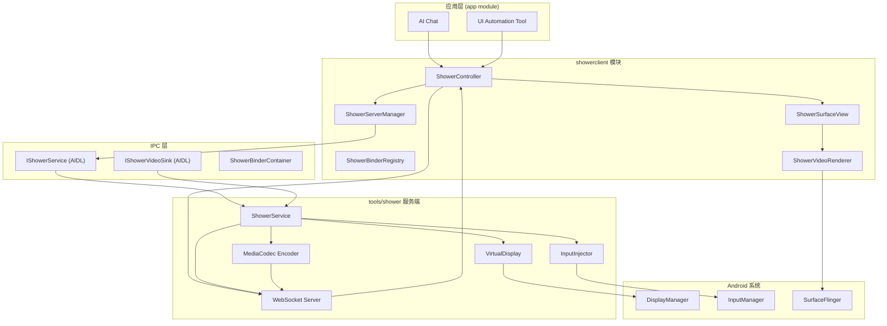

# Operit AI — showerclient 模块软件架构与业务流程快速上手

## 一、项目定位

`showerclient` 模块是 **Operit AI** 的 **虚拟屏（Virtual Display）客户端模块**，负责与 `tools/shower` 服务端的 AIDL 服务进行 IPC 通信，实现虚拟显示屏的创建、视频流接收与渲染、以及触摸/按键输入注入。它是整个 **Shower 投屏系统** 的客户端组件，为 AI 自动化（UI 自动化、远程控制）提供底层基础设施。

### 核心特性

| 特性 | 说明 |
|------|------|
| **AIDL IPC 通信** | 通过 `IShowerService` 与 Shower 服务端跨进程通信 |
| **虚拟屏管理** | 创建/销毁虚拟显示屏（VirtualDisplay） |
| **H.264 视频解码** | MediaCodec 硬件解码视频流并渲染到 Surface |
| **WebSocket 视频流** | 同时支持 WebSocket 接收二进制视频帧 |
| **触摸事件注入** | 单点触摸（tap/swipe/touchDown/Move/Up）和完整 MotionEvent 注入 |
| **按键事件注入** | 支持普通按键和带 Meta 状态的按键注入 |
| **截图功能** | PixelCopy API 捕获当前渲染帧为 PNG |
| **应用启动** | 在指定虚拟屏上启动第三方应用 |
| **多屏支持** | 通过 `displayId` 管理多个虚拟屏 |
| **Binder 注册表** | 集中管理 Shower 服务绑定和生命周期 |

### 技术栈

| 技术 | 用途 |
|------|------|
| Kotlin + Java | 客户端代码 |
| AIDL | 跨进程通信接口定义 |
| MediaCodec | H.264 硬件解码 |
| SurfaceView | 视频渲染 Surface |
| WebSocket | 视频流网络传输 |
| PixelCopy | 帧截图（API 26+） |
| Coroutines | 异步操作 |

---

## 二、整体架构设计思想

### 2.1 分层架构（Layered Architecture）

```
┌─────────────────────────────────────────────────────────────────────────────┐
│                           表现层 (Presentation)                              │
│  ┌─────────────────────────────────────────────────────────────────────┐   │
│  │                    ShowerSurfaceView (SurfaceView)                   │   │
│  │  • SurfaceHolder.Callback 生命周期管理                               │   │
│  │  • 绑定 ShowerController                                             │   │
│  │  • 协调 ShowerVideoRenderer 与 Surface                               │   │
│  └─────────────────────────────────────────────────────────────────────┘   │
├─────────────────────────────────────────────────────────────────────────────┤
│                           业务层 (Business)                                  │
│  ┌─────────────────┐ ┌─────────────────┐ ┌─────────────────────────────┐   │
│  │ShowerController │ │ShowerServerManager│ │    ShowerBinderRegistry    │   │
│  │ (会话控制器)     │ │ (服务端管理器)    │ │    (Binder 注册表)         │   │
│  │ • WebSocket 连接 │ │ • AIDL 服务绑定   │ │ • 服务绑定/解绑            │   │
│  │ • 视频帧分发     │ │ • 服务端生命周期  │ │ • 生命周期监听             │   │
│  │ • 输入事件转发   │ │ • 进程管理        │ │ • 自动重连                 │   │
│  └─────────────────┘ └─────────────────┘ └─────────────────────────────┘   │
├─────────────────────────────────────────────────────────────────────────────┤
│                           渲染层 (Rendering)                                 │
│  ┌─────────────────────────────────────────────────────────────────────┐   │
│  │                    ShowerVideoRenderer                               │   │
│  │  • MediaCodec H.264 解码                                            │   │
│  │  • AVCC ↔ Annex-B 格式转换                                          │   │
│  │  • SPS/PPS 提取与缓存                                               │   │
│  │  • Surface 渲染                                                     │   │
│  │  • PixelCopy 截图                                                   │   │
│  └─────────────────────────────────────────────────────────────────────┘   │
├─────────────────────────────────────────────────────────────────────────────┤
│                           IPC 层 (Inter-Process Communication)               │
│  ┌─────────────────┐ ┌─────────────────┐ ┌─────────────────────────────┐   │
│  │  IShowerService │ │ IShowerVideoSink│ │  ShowerBinderContainer      │   │
│  │  (AIDL 接口)     │ │  (AIDL 回调)    │ │  (Binder 传输包装)          │   │
│  │  • 服务端方法    │ │  • 视频帧回调    │ │  • Parcelable 封装          │   │
│  │  • 输入注入      │ │  • IPC 传输      │ │  • Intent 传递              │   │
│  └─────────────────┘ └─────────────────┘ └─────────────────────────────┘   │
├─────────────────────────────────────────────────────────────────────────────┤
│                           服务端 (Shower Server)                             │
│  ┌─────────────────────────────────────────────────────────────────────┐   │
│  │                    tools/shower (独立 APK)                           │   │
│  │  • VirtualDisplay 创建                                               │   │
│  │  • MediaCodec H.264 编码                                             │   │
│  │  • WebSocket 服务器                                                  │   │
│  │  • AIDL 服务实现                                                     │   │
│  └─────────────────────────────────────────────────────────────────────┘   │
└─────────────────────────────────────────────────────────────────────────────┘
```

### 2.2 架构模式

| 模式 | 应用位置 | 说明 |
|------|----------|------|
| **AIDL 跨进程通信** | IShowerService / IShowerVideoSink | Android 标准 IPC 机制 |
| **门面模式** | ShowerServerManager | 封装 AIDL 服务绑定的复杂性 |
| **注册表模式** | ShowerBinderRegistry | 集中管理 Shower 服务绑定 |
| **观察者模式** | WebSocket + 回调 | 视频帧实时分发 |
| **生产者-消费者** | MediaCodec 解码队列 | 输入缓冲区/输出缓冲区循环 |
| **状态机** | ShowerServerManager 连接状态 | CONNECTING → CONNECTED → DISCONNECTED |

### 2.3 核心设计原则

1. **双通道通信**：AIDL IPC（控制命令）+ WebSocket（视频流）分离，避免 IPC 传输大数据
2. **延迟初始化**：MediaCodec 解码器在收到 SPS/PPS 后才初始化
3. **帧缓存**：Surface 未就绪时缓存视频帧，就绪后批量处理
4. **资源安全**：Surface 销毁时同步释放解码器，避免内存泄漏
5. **重试机制**：Surface 创建后重试获取视频尺寸，解决竞态条件

---

## 三、源码目录结构

```
showerclient/
│
├── src/main/
│   ├── assets/
│   │   └── shower-server.jar           # Shower 服务端 JAR（备用）
│   │
│   ├── java/
│   │   ├── com/ai/assistance/shower/   # AIDL 接口（与 tools/shower 共享）
│   │   │   ├── IShowerService.java     # Shower 服务 AIDL 接口
│   │   │   ├── IShowerVideoSink.java   # 视频接收器 AIDL 回调接口
│   │   │   └── ShowerBinderContainer.java # Binder Parcelable 包装
│   │   │
│   │   └── com/ai/assistance/showerclient/
│   │       ├── ShowerServerManager.kt      # 服务端管理器（AIDL 绑定）
│   │       ├── ShowerController.kt         # 会话控制器（WebSocket + 输入）
│   │       ├── ShowerBinderRegistry.kt     # Binder 注册表
│   │       ├── ShowerVideoRenderer.kt      # H.264 视频解码渲染器
│   │       ├── ShellEnvironment.kt         # Shell 环境配置
│   │       └── ui/
│   │           └── ShowerSurfaceView.kt    # SurfaceView 渲染组件
│   │
│   └── AndroidManifest.xml             # 模块清单
│
├── build.gradle.kts                    # Gradle 构建配置
└── README.md                           # 模块说明
```

---

## 四、核心架构详解

### 4.1 AIDL 接口定义

#### IShowerService — 服务端控制接口

```java
public interface IShowerService extends IInterface {

    // 创建虚拟屏，返回 displayId
    int ensureDisplay(int width, int height, int dpi, int bitrateKbps) throws RemoteException;

    // 销毁虚拟屏
    void destroyDisplay(int displayId) throws RemoteException;

    // 在指定虚拟屏启动应用
    void launchApp(String packageName, int displayId) throws RemoteException;

    // 触摸操作
    void tap(int displayId, float x, float y) throws RemoteException;
    void swipe(int displayId, float x1, float y1, float x2, float y2, long durationMs) throws RemoteException;
    void touchDown(int displayId, float x, float y) throws RemoteException;
    void touchMove(int displayId, float x, float y) throws RemoteException;
    void touchUp(int displayId, float x, float y) throws RemoteException;

    // 完整 MotionEvent 注入
    void injectTouchEvent(int displayId, int action, float x, float y,
                          long downTime, long eventTime, float pressure, float size,
                          int metaState, float xPrecision, float yPrecision,
                          int deviceId, int edgeFlags) throws RemoteException;

    // 按键注入
    void injectKey(int displayId, int keyCode) throws RemoteException;
    void injectKeyWithMeta(int displayId, int keyCode, int metaState) throws RemoteException;

    // 截图
    byte[] requestScreenshot(int displayId) throws RemoteException;

    // 设置视频接收器（AIDL 回调）
    void setVideoSink(int displayId, IBinder sink) throws RemoteException;
}
```

#### IShowerVideoSink — 视频帧回调接口

```java
public interface IShowerVideoSink extends IInterface {
    // 服务端通过 AIDL 回调发送视频帧
    void onVideoFrame(byte[] data) throws RemoteException;
}
```

#### ShowerBinderContainer — Binder 传输包装

```java
public class ShowerBinderContainer implements Parcelable {
    private final IBinder binder;
    // 用于在 Intent 中传递 IBinder（IBinder 本身不是 Parcelable）
}
```

### 4.2 ShowerServerManager — 服务端管理器

```kotlin
class ShowerServerManager(private val context: Context) {

    private var showerService: IShowerService? = null
    private var serviceConnection: ServiceConnection? = null
    private val listeners = mutableListOf<ShowerServiceListener>()

    interface ShowerServiceListener {
        fun onServiceConnected(service: IShowerService)
        fun onServiceDisconnected()
    }

    // 绑定 Shower 服务
    fun bindService(): Boolean { ... }

    // 解绑服务
    fun unbindService() { ... }

    // 获取服务接口
    fun getService(): IShowerService? = showerService

    // 检查服务是否连接
    fun isConnected(): Boolean = showerService != null
}
```

**绑定流程**：

```
bindService()
    │
    ├──► 创建 ServiceConnection
    │       │
    │       ├──► onServiceConnected()
    │       │       • 获取 IShowerService.Stub.asInterface(binder)
    │       │       • 保存到 showerService
    │       │       • 通知所有 listeners
    │       │
    │       └──► onServiceDisconnected()
    │               • showerService = null
    │               • 通知所有 listeners
    │
    ├──► 构建 Intent
    │       • 指向 tools/shower 的 Service
    │
    ├──► context.bindService()
    │       • 建立 AIDL 连接
    │
    └──► 返回绑定结果
```

### 4.3 ShowerController — 会话控制器

```kotlin
class ShowerController(
    private val service: IShowerService,
    private val displayId: Int
) {

    private var webSocket: WebSocket? = null
    private var binaryHandler: ((ByteArray) -> Unit)? = null
    private var videoSize: Pair<Int, Int>? = null

    // WebSocket 连接管理
    fun connectWebSocket(url: String) { ... }
    fun disconnectWebSocket() { ... }

    // 视频尺寸
    fun getVideoSize(): Pair<Int, Int>? = videoSize
    fun setVideoSize(width: Int, height: Int) { videoSize = width to height }

    // 二进制帧处理（由 WebSocket 回调）
    fun setBinaryHandler(handler: ((ByteArray) -> Unit)?) { binaryHandler = handler }
    fun onBinaryMessage(data: ByteArray) { binaryHandler?.invoke(data) }

    // 输入事件转发到 AIDL 服务
    fun tap(x: Float, y: Float) = service.tap(displayId, x, y)
    fun swipe(x1: Float, y1: Float, x2: Float, y2: Float, duration: Long) =
        service.swipe(displayId, x1, y1, x2, y2, duration)
    fun touchDown(x: Float, y: Float) = service.touchDown(displayId, x, y)
    fun touchMove(x: Float, y: Float) = service.touchMove(displayId, x, y)
    fun touchUp(x: Float, y: Float) = service.touchUp(displayId, x, y)
    fun injectKey(keyCode: Int) = service.injectKey(displayId, keyCode)
    fun injectKeyWithMeta(keyCode: Int, metaState: Int) =
        service.injectKeyWithMeta(displayId, keyCode, metaState)

    // 截图
    fun requestScreenshot(): ByteArray? = service.requestScreenshot(displayId)

    // 启动应用
    fun launchApp(packageName: String) = service.launchApp(packageName, displayId)

    // 销毁虚拟屏
    fun destroy() = service.destroyDisplay(displayId)
}
```

### 4.4 ShowerVideoRenderer — H.264 视频解码渲染器

```kotlin
class ShowerVideoRenderer {

    private var decoder: MediaCodec? = null
    private var surface: Surface? = null
    private var csd0: ByteArray? = null  // SPS
    private var csd1: ByteArray? = null  // PPS
    private val pendingFrames = mutableListOf<ByteArray>()
    private var width: Int = 0
    private var height: Int = 0

    // 绑定 Surface
    fun attach(surface: Surface, videoWidth: Int, videoHeight: Int) { ... }

    // 解绑 Surface
    fun detach() { ... }

    // 接收视频帧（H.264 NAL 单元）
    fun onFrame(data: ByteArray) { ... }

    // 截图当前帧
    suspend fun captureCurrentFramePng(): ByteArray? { ... }
}
```

**解码流程**：

```
onFrame(data)
    │
    ├──► 检查 Surface 是否就绪
    │       • 未就绪 → 丢弃帧（记录警告）
    │
    ├──► AVCC → Annex-B 格式转换
    │       • 检测起始码（00 00 00 01 / 00 00 01）
    │       • 无起始码 → 从 AVCC 长度前缀转换
    │
    ├──► 解析 NAL 类型
    │       • NAL 7 (SPS) → 保存到 csd0
    │       • NAL 8 (PPS) → 保存到 csd1
    │       • 其他 → 加入 pendingFrames
    │
    ├──► 当 csd0 和 csd1 都就绪
    │       │
    │       ├──► initDecoderLocked()
    │       │       • MediaFormat.createVideoFormat("video/avc", width, height)
    │       │       • format.setByteBuffer("csd-0", csd0)
    │       │       • format.setByteBuffer("csd-1", csd1)
    │       │       • MediaCodec.createDecoderByType("video/avc")
    │       │       • decoder.configure(format, surface, null, 0)
    │       │       • decoder.start()
    │       │
    │       └──► 处理 pendingFrames
    │               • 将缓存的帧送入解码器
    │
    └──► 解码帧
            │
            ├──► dequeueInputBuffer(10000)
            ├──► 填入 NAL 数据
            ├──► queueInputBuffer()
            ├──► dequeueOutputBuffer()
            ├──► releaseOutputBuffer(render=true)
            └──► 渲染到 Surface
```

### 4.5 ShowerSurfaceView — 渲染组件

```kotlin
class ShowerSurfaceView(
    context: Context,
    attrs: AttributeSet? = null
) : SurfaceView(context, attrs), SurfaceHolder.Callback {

    private val renderer = ShowerVideoRenderer()
    private var controller: ShowerController? = null
    private var attachJob: Job? = null

    // 绑定控制器
    fun bindController(controller: ShowerController) { this.controller = controller }

    // Surface 创建
    override fun surfaceCreated(holder: SurfaceHolder) {
        // 1. 取消之前的 attachJob
        // 2. 启动协程等待 videoSize
        // 3. 重试最多 50 次（5 秒），每 100ms 检查一次
        // 4. 获取到尺寸后：
        //    - holder.setFixedSize(w, h)
        //    - renderer.attach(holder.surface, w, h)
        //    - controller.setBinaryHandler { renderer.onFrame(it) }
    }

    // Surface 销毁
    override fun surfaceDestroyed(holder: SurfaceHolder) {
        // 1. 取消 attachJob
        // 2. controller.setBinaryHandler(null)
        // 3. renderer.detach()
    }

    // 截图
    suspend fun captureCurrentFramePng(): ByteArray? = renderer.captureCurrentFramePng()
}
```

**关键设计**：

- **重试等待**：`surfaceCreated` 后最多等待 5 秒获取 videoSize，解决 Shower 服务端与客户端的启动竞态
- **延迟绑定**：在获取到 videoSize 后才设置 `binaryHandler`，确保解码器初始化前不丢失 SPS/PPS
- **生命周期同步**：Surface 销毁时同步清理所有资源

---

## 五、核心业务流程

### 5.1 虚拟屏创建与视频流接收流程

```
应用层请求创建虚拟屏
    │
    ├──► ShowerServerManager.bindService()
    │       • 绑定 tools/shower 的 AIDL 服务
    │       • 获取 IShowerService 接口
    │
    ├──► IShowerService.ensureDisplay(width, height, dpi, bitrate)
    │       • 服务端创建 VirtualDisplay
    │       • 返回 displayId
    │
    ├──► 创建 ShowerController(service, displayId)
    │       • 绑定 displayId 到控制器
    │
    ├──► ShowerController.connectWebSocket(url)
    │       • 连接 Shower 服务端 WebSocket
    │       • 订阅二进制视频帧
    │
    ├──► ShowerSurfaceView.bindController(controller)
    │       • 将控制器绑定到 SurfaceView
    │
    ├──► SurfaceView.surfaceCreated()
    │       │
    │       ├──► 等待 videoSize（重试 50 次，每次 100ms）
    │       │
    │       ├──► 获取到尺寸后
    │       │       • holder.setFixedSize(w, h)
    │       │       • renderer.attach(surface, w, h)
    │       │
    │       └──► controller.setBinaryHandler { data -> renderer.onFrame(data) }
    │               • WebSocket 收到帧 → 回调到 renderer
    │
    ├──► WebSocket 接收 H.264 帧
    │       │
    │       ├──► 第一帧通常是 SPS (NAL 7)
    │       ├──► 第二帧通常是 PPS (NAL 8)
    │       ├──► renderer.onFrame() 缓存 SPS/PPS
    │       ├──► SPS + PPS 就绪后初始化 MediaCodec
    │       ├──► 后续帧送入解码器
    │       └──► 解码输出渲染到 Surface
    │
    └──► 视频显示在 ShowerSurfaceView 上
```

### 5.2 触摸输入注入流程

```
用户/AI 触发触摸操作
    │
    ├──► 简单触摸（tap/swipe）
    │       │
    │       ├──► ShowerController.tap(x, y)
    │       │       • IShowerService.tap(displayId, x, y)
    │       │       • 服务端注入 MotionEvent.ACTION_DOWN + ACTION_UP
    │       │
    │       └──► ShowerController.swipe(x1, y1, x2, y2, duration)
    │               • IShowerService.swipe(...)
    │               • 服务端插值生成一系列触摸点
    │
    ├──► 精细触摸（touchDown/Move/Up）
    │       │
    │       ├──► ShowerController.touchDown(x, y)
    │       ├──► ShowerController.touchMove(x, y)  // 可多次
    │       └──► ShowerController.touchUp(x, y)
    │
    └──► 完整 MotionEvent
            │
            └──► IShowerService.injectTouchEvent(
                    displayId, action, x, y, downTime, eventTime,
                    pressure, size, metaState, xPrecision, yPrecision,
                    deviceId, edgeFlags
                )
```

### 5.3 按键输入注入流程

```
用户/AI 触发按键
    │
    ├──► 普通按键
    │       ShowerController.injectKey(keyCode)
    │           → IShowerService.injectKey(displayId, keyCode)
    │
    └──► 带 Meta 状态的按键（Ctrl/Alt/Shift）
            ShowerController.injectKeyWithMeta(keyCode, metaState)
                → IShowerService.injectKeyWithMeta(displayId, keyCode, metaState)
```

### 5.4 截图流程

```
请求截图
    │
    ├──► 方式一：AIDL 截图
    │       IShowerService.requestScreenshot(displayId)
    │           → 服务端直接截取 VirtualDisplay 的帧缓冲
    │           → 返回 byte[]（PNG 格式）
    │
    └──► 方式二：PixelCopy 截图（API 26+）
            ShowerSurfaceView.captureCurrentFramePng()
                │
                ├──► ShowerVideoRenderer.captureCurrentFramePng()
                │       │
                │       ├──► 获取当前 Surface
                │       ├──► Bitmap.createBitmap(w, h, ARGB_8888)
                │       ├──► PixelCopy.request(surface, bitmap, callback, handler)
                │       ├──► 等待回调结果
                │       ├──► bitmap.compress(PNG, 100, outputStream)
                │       ├──► bitmap.recycle()
                │       └──► 返回 PNG byte[]
                │
                └──► 返回截图数据
```

### 5.5 资源释放流程

```
销毁虚拟屏 / 退出应用
    │
    ├──► ShowerController.destroy()
    │       • IShowerService.destroyDisplay(displayId)
    │       • 服务端释放 VirtualDisplay
    │
    ├──► ShowerController.disconnectWebSocket()
    │       • 关闭 WebSocket 连接
    │
    ├──► ShowerSurfaceView.surfaceDestroyed()
    │       • 取消 attachJob
    │       • controller.setBinaryHandler(null)
    │       • renderer.detach()
    │           • 停止解码器
    │           • 释放解码器
    │           • 清空缓存帧
    │
    ├──► ShowerServerManager.unbindService()
    │       • context.unbindService(connection)
    │       • showerService = null
    │
    └──► 所有资源释放完毕
```

---

## 六、H.264 格式处理

### 6.1 AVCC ↔ Annex-B 转换

```kotlin
// maybeAvccToAnnexb — 自动检测并转换 H.264 格式

private fun maybeAvccToAnnexb(packet: ByteArray): ByteArray {
    // 检查是否已经是 Annex-B 格式（起始码）
    if (packet.size >= 4) {
        val b0 = packet[0].toInt() and 0xFF
        val b1 = packet[1].toInt() and 0xFF
        val b2 = packet[2].toInt() and 0xFF
        val b3 = packet[3].toInt() and 0xFF
        // 起始码: 00 00 00 01 或 00 00 01
        if (b0 == 0 && b1 == 0 && ((b2 == 0 && b3 == 1) || b2 == 1)) {
            return packet  // 已经是 Annex-B
        }
    }

    // AVCC 格式 → Annex-B 转换
    // AVCC: [4字节长度][NAL数据][4字节长度][NAL数据]...
    // Annex-B: [00 00 00 01][NAL数据][00 00 00 01][NAL数据]...
    val out = ByteArrayOutputStream()
    var i = 0
    while (i + 4 <= packet.size) {
        val nalLen = ((packet[i].toInt() and 0xFF) shl 24) or
                     ((packet[i + 1].toInt() and 0xFF) shl 16) or
                     ((packet[i + 2].toInt() and 0xFF) shl 8) or
                     (packet[i + 3].toInt() and 0xFF)
        i += 4
        if (nalLen <= 0 || i + nalLen > packet.size) return packet
        out.write(byteArrayOf(0, 0, 0, 1))  // Annex-B 起始码
        out.write(packet, i, nalLen)
        i += nalLen
    }
    return out.toByteArray()
}
```

### 6.2 NAL 类型识别

| NAL 类型 | 值 | 说明 |
|----------|-----|------|
| SPS (Sequence Parameter Set) | 7 | 序列参数集，包含视频分辨率、Profile 等 |
| PPS (Picture Parameter Set) | 8 | 图像参数集，包含熵编码模式等 |
| IDR Slice | 5 | 即时解码刷新帧（关键帧） |
| Non-IDR Slice | 1 | 非关键帧 |
| SEI | 6 | 补充增强信息 |
| AUD | 9 | 访问单元分隔符 |

---

## 七、Gradle 构建配置

```kotlin
// build.gradle.kts

plugins {
    alias(libs.plugins.android.library)
    alias(libs.plugins.kotlin.android)
}

android {
    namespace = "com.ai.assistance.showerclient"
    compileSdk = 36

    defaultConfig {
        minSdk = 26
        targetSdk = 34
    }

    compileOptions {
        sourceCompatibility = JavaVersion.VERSION_17
        targetCompatibility = JavaVersion.VERSION_17
    }
}

dependencies {
    implementation(libs.kotlinx.coroutines.android)
    // 依赖 WebSocket 客户端库（如 OkHttp）
    // 依赖 tools/shower 的 AIDL 接口
}
```

---

## 八、完整架构图（Mermaid）



---

## 九、快速上手路径

### 9.1 绑定 Shower 服务

```kotlin
val serverManager = ShowerServerManager(context)

// 绑定服务
val bound = serverManager.bindService()
if (!bound) {
    println("Shower 服务绑定失败")
    return
}

// 获取服务接口
val service = serverManager.getService()
```

### 9.2 创建虚拟屏并接收视频

```kotlin
// 1. 创建虚拟屏
val displayId = service.ensureDisplay(1080, 1920, 320, 4000)

// 2. 创建控制器
val controller = ShowerController(service, displayId)

// 3. 连接 WebSocket
controller.connectWebSocket("ws://localhost:8080")

// 4. 绑定到 SurfaceView
val surfaceView = findViewById<ShowerSurfaceView>(R.id.shower_surface)
surfaceView.bindController(controller)

// 5. 启动应用
controller.launchApp("com.example.app")
```

### 9.3 注入触摸事件

```kotlin
// 点击
controller.tap(500f, 800f)

// 滑动
controller.swipe(500f, 800f, 500f, 400f, 300)

// 精细触摸
controller.touchDown(500f, 800f)
controller.touchMove(500f, 600f)
controller.touchUp(500f, 600f)

// 按键
controller.injectKey(KeyEvent.KEYCODE_ENTER)
controller.injectKeyWithMeta(KeyEvent.KEYCODE_C, KeyEvent.META_CTRL_ON)
```

### 9.4 截图

```kotlin
// AIDL 截图
val pngBytes = service.requestScreenshot(displayId)

// PixelCopy 截图（API 26+）
lifecycleScope.launch {
    val pngBytes = surfaceView.captureCurrentFramePng()
    // 保存或处理 PNG
}
```

### 9.5 释放资源

```kotlin
// 销毁虚拟屏
controller.destroy()

// 解绑服务
serverManager.unbindService()
```

---

*文档生成时间: 2026-05-13*
*基于 Operit AI showerclient 模块代码分析*
