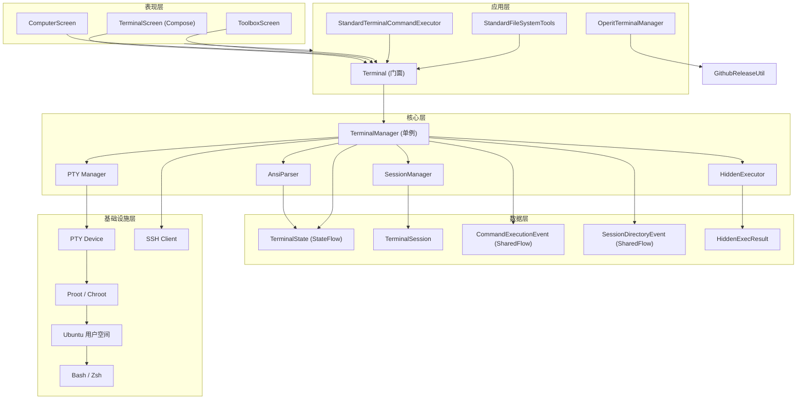

# Operit AI — terminal 模块软件架构与业务流程快速上手

## 一、项目定位

`terminal` 模块是 **Operit AI** 的 **Linux 终端环境模块**，为 Android 应用提供完整的 Ubuntu/Debian Linux 终端体验。它基于 **Proot** 或 **Chroot** 技术在 Android 上运行完整的 Linux 用户空间，支持多会话 PTY（伪终端）、ANSI 控制序列解析、SSH 连接、文件系统操作等丰富功能。

### 核心特性

| 特性 | 说明 |
|------|------|
| **多会话 PTY** | 支持多个独立的伪终端会话 |
| **Ubuntu 环境** | 基于 Proot 的 Ubuntu 24 用户空间 |
| **ANSI 解析** | 完整的 ANSI 控制序列解析（颜色、光标、清屏等） |
| **SSH 连接** | 支持远程 SSH 服务器连接 |
| **隐藏执行器** | 后台静默执行命令，不占用可见会话 |
| **流式输出** | 命令执行过程中实时流式返回输出 |
| **交互式输入** | 支持向运行中的会话发送输入和控制序列 |
| **屏幕捕获** | 获取终端当前屏幕内容（不含滚动历史） |
| **文件系统集成** | 通过终端环境执行文件系统操作 |
| **包管理** | 支持 apt/dpkg 等包管理器操作 |

### 技术栈

| 技术 | 用途 |
|------|------|
| Proot/Chroot | Linux 用户空间模拟 |
| PTY (伪终端) | 终端会话管理 |
| ANSI 转义序列 | 终端显示控制 |
| Kotlin Coroutines + Flow | 异步命令执行与流式输出 |
| SSH (JSch/SSHJ) | 远程连接 |

---

## 二、整体架构设计思想

### 2.1 分层架构（Layered Architecture）

```
┌─────────────────────────────────────────────────────────────────────────────┐
│                           表现层 (Presentation)                              │
│  ┌─────────────┐ ┌─────────────┐ ┌─────────────┐                           │
│  │ TerminalScreen│ │ ComputerScreen│ │ ToolboxScreen │                     │
│  │ (终端界面)   │ │ (电脑模式)   │ │ (工具箱入口) │                         │
│  └──────┬──────┘ └──────┬──────┘ └──────┬──────┘                           │
├─────────┼───────────────┼───────────────┼──────────────────────────────────┤
│         │               │               │                                   │
│         └───────────────┴───────┬───────┘                                   │
│                                 ▼                                           │
│  ┌─────────────────────────────────────────────────────────────────────┐   │
│  │                    应用层封装 (Application Wrapper)                    │   │
│  │  ┌─────────────────┐ ┌─────────────────┐ ┌─────────────────────────┐ │   │
│  │  │    Terminal     │ │StandardTerminal │ │ StandardFileSystemTools │ │   │
│  │  │ (单例门面)      │ │CommandExecutor  │ │ (文件系统工具)          │ │   │
│  │  └─────────────────┘ └─────────────────┘ └─────────────────────────┘ │   │
│  │  ┌─────────────────┐                                                 │   │
│  │  │OperitTerminalManager│                                             │   │
│  │  │ (安装/版本管理)  │                                                 │   │
│  │  └─────────────────┘                                                 │   │
│  └─────────────────────────────────────────────────────────────────────┘   │
├─────────────────────────────────────────────────────────────────────────────┤
│                           核心层 (Core)                                      │
│  ┌─────────────────────────────────────────────────────────────────────┐   │
│  │                    TerminalManager (单例)                             │   │
│  │  • 会话管理（创建/切换/关闭）                                         │   │
│  │  • 命令执行（同步/流式/隐藏）                                         │   │
│  │  • 状态管理（StateFlow/SharedFlow）                                   │   │
│  │  • 环境初始化（Proot/Ubuntu）                                         │   │
│  │  • 输入处理（文本/控制序列）                                          │   │
│  └─────────────────────────────────────────────────────────────────────┘   │
├─────────────────────────────────────────────────────────────────────────────┤
│                           数据层 (Data)                                      │
│  ┌─────────────┐ ┌─────────────┐ ┌─────────────┐ ┌─────────────┐           │
│  │ TerminalState│ │TerminalSession│ │CommandExecution│ │SessionDirectory│   │
│  │ (终端状态)   │ │ (会话数据)   │ │Event (命令事件)│ │Event (目录事件)│   │
│  └─────────────┘ └─────────────┘ └─────────────┘ └─────────────┘           │
│  ┌─────────────┐ ┌─────────────┐                                           │
│  │ HiddenExecResult│ │PackageManagerType│                                   │
│  │ (隐藏执行结果)│ │ (包管理器类型) │                                   │   │
│  └─────────────┘ └─────────────┘                                           │
├─────────────────────────────────────────────────────────────────────────────┤
│                           基础设施层 (Infrastructure)                         │
│  ┌─────────────┐ ┌─────────────┐ ┌─────────────┐ ┌─────────────┐           │
│  │    PTY      │ │   Proot     │ │    SSH      │ │  FileSystem │           │
│  │ (伪终端)    │ │ (Linux环境) │ │ (远程连接)  │ │  Provider   │           │
│  └─────────────┘ └─────────────┘ └─────────────┘ └─────────────┘           │
└─────────────────────────────────────────────────────────────────────────────┘
```

### 2.2 架构模式

| 模式 | 应用位置 | 说明 |
|------|----------|------|
| **门面模式 (Facade)** | Terminal | 为 TerminalManager 提供简化的应用层接口 |
| **单例模式** | Terminal / TerminalManager | 全局唯一实例管理终端服务 |
| **观察者模式** | StateFlow / SharedFlow | 终端状态和事件实时通知 UI |
| **命令模式** | StandardTerminalCommandExecutor | 封装终端操作为工具命令 |
| **流式处理** | Flow<CommandExecutionEvent> | 命令输出实时流式传递 |
| **代理模式** | FileSystemProvider | 通过终端代理文件系统操作 |

### 2.3 核心设计原则

1. **单例门面**：`Terminal` 类作为应用层的统一入口，隐藏 `TerminalManager` 的复杂性
2. **响应式状态**：所有状态通过 `StateFlow`/`SharedFlow` 驱动 UI 更新
3. **流式优先**：命令执行支持 `Flow` 流式返回，实时反馈执行进度
4. **会话隔离**：每个终端会话独立管理，互不干扰
5. **超时控制**：所有命令执行都有超时保护，防止无限阻塞
6. **安全释放**：会话关闭时清理资源，避免内存泄漏

---

## 三、源码目录结构

```
# terminal 模块源码分布在 app 模块中

app/src/main/java/com/ai/assistance/operit/
│
├── core/tools/system/
│   ├── Terminal.kt                     # 应用层终端门面（单例）
│   └── OperitTerminalManager.kt        # 终端安装/版本管理
│
├── core/tools/defaultTool/standard/
│   └── StandardTerminalCommandExecutor.kt  # 终端工具命令执行器
│
├── terminal/                           # terminal 核心包（外部依赖或子模块）
│   ├── TerminalManager.kt              # 终端管理器（单例）
│   ├── CommandExecutionEvent.kt        # 命令执行事件
│   ├── SessionDirectoryEvent.kt        # 会话目录变更事件
│   ├── rememberTerminalEnv.kt          # Compose 环境记忆
│   │
│   ├── data/
│   │   ├── TerminalState.kt            # 终端状态数据类
│   │   ├── TerminalSession.kt          # 会话数据类
│   │   └── PackageManagerType.kt       # 包管理器类型枚举
│   │
│   ├── provider/
│   │   ├── type/
│   │   │   └── HiddenExecResult.kt     # 隐藏执行结果
│   │   ├── filesystem/
│   │   │   └── FileSystemProvider.kt   # 文件系统提供者
│   │   └── ...
│   │
│   ├── view/
│   │   ├── domain/
│   │   │   └── ansi/
│   │   │       └── TerminalChar.kt     # 终端字符（ANSI）
│   │   └── main/
│   │       └── TerminalScreen.kt       # 终端界面 Compose
│   │
│   └── utils/
│       ├── SSHFileConnectionManager.kt # SSH 文件连接
│       └── SourceManager.kt            # 源管理器
```

---

## 四、核心架构详解

### 4.1 Terminal — 应用层门面

```kotlin
// Terminal.kt — 应用层终端门面（单例）

@RequiresApi(Build.VERSION_CODES.O)
class Terminal private constructor(private val context: Context) {

    companion object {
        @Volatile
        private var INSTANCE: Terminal? = null

        fun getInstance(context: Context): Terminal {
            return INSTANCE ?: synchronized(this) {
                INSTANCE ?: Terminal(context.applicationContext).also { INSTANCE = it }
            }
        }
    }

    // 内部持有 TerminalManager 实例
    private val terminalManager = TerminalManager.getInstance(context)
    private val scope = CoroutineScope(Dispatchers.Main)

    // 暴露状态和事件流（从 TerminalManager 透传）
    val commandEvents: SharedFlow<CommandExecutionEvent> = terminalManager.commandExecutionEvents
    val directoryEvents: SharedFlow<SessionDirectoryEvent> = terminalManager.directoryChangeEvents
    val terminalState: StateFlow<TerminalState> = terminalManager.terminalState
    val sessions = terminalManager.sessions
    val currentSessionId = terminalManager.currentSessionId
    val currentDirectory = terminalManager.currentDirectory
    val isInteractiveMode = terminalManager.isInteractiveMode
    val interactivePrompt = terminalManager.interactivePrompt
    val isFullscreen = terminalManager.isFullscreen

    // 初始化环境
    suspend fun initialize(): Boolean = terminalManager.initializeEnvironment()

    // 销毁
    fun destroy() = terminalManager.cleanup()

    // 创建会话
    suspend fun createSession(title: String? = null): String {
        val newSession = terminalManager.createNewSession(title)
        return newSession.id
    }

    // 切换会话
    fun switchToSession(sessionId: String) = terminalManager.switchToSession(sessionId)

    // 关闭会话
    fun closeSession(sessionId: String) = terminalManager.closeSession(sessionId)

    // 执行命令（同步等待完成）
    suspend fun executeCommand(sessionId: String, command: String): String? {
        val commandId = UUID.randomUUID().toString()
        val deferred = CompletableDeferred<String>()
        val output = StringBuilder()

        // 先订阅事件，再发送命令（避免快速命令输出丢失）
        val job = scope.launch {
            commandEvents
                .filter { it.sessionId == sessionId && it.commandId == commandId }
                .collect { event ->
                    if (event.isCompleted) {
                        deferred.complete(event.outputChunk ?: output.toString())
                    } else {
                        output.append(event.outputChunk)
                    }
                }
        }

        // 等待收集器就绪
        val collectorReady = CompletableDeferred<Unit>()
        // ... 确保订阅完成后再发送命令

        terminalManager.sendCommandToSession(sessionId, command, commandId)
        val result = deferred.await()
        job.cancel()
        return result
    }

    // 执行命令（Flow 流式版本）
    fun executeCommandFlow(sessionId: String, command: String): Flow<CommandExecutionEvent> {
        return channelFlow {
            val commandId = UUID.randomUUID().toString()
            val collectorReady = CompletableDeferred<Unit>()

            val collectorJob = launch {
                commandEvents
                    .filter { it.sessionId == sessionId && it.commandId == commandId }
                    .transformWhile { event ->
                        emit(event)
                        !event.isCompleted  // 完成后停止
                    }
                    .collect { send(it) }
            }

            collectorReady.await()
            terminalManager.sendCommandToSession(sessionId, command, commandId)
            collectorJob.join()
        }
    }

    // 隐藏执行（不占用可见会话）
    suspend fun executeHiddenCommand(
        command: String,
        executorKey: String = "default",
        timeoutMs: Long = 120000L
    ): HiddenExecResult {
        return terminalManager.executeHiddenCommand(command, executorKey, timeoutMs)
    }

    // 发送输入
    fun sendInput(sessionId: String, input: String) {
        terminalManager.switchToSession(sessionId)
        terminalManager.sendInput(input)
    }

    // 发送中断信号 (Ctrl+C)
    fun sendInterruptSignal(sessionId: String) {
        terminalManager.switchToSession(sessionId)
        terminalManager.sendInterruptSignal()
    }

    fun isConnected(): Boolean = true
}
```

**设计特点**：

- **单例模式**：全局唯一 `Terminal` 实例
- **门面模式**：封装 `TerminalManager` 的复杂接口，提供简化的应用层 API
- **状态透传**：直接暴露 `TerminalManager` 的 `StateFlow`/`SharedFlow`
- **先订阅后发送**：`executeCommand` 先建立事件订阅再发送命令，避免快速命令的输出在订阅前丢失
- **CompletableDeferred**：使用协程的 `CompletableDeferred` 实现异步等待命令完成

### 4.2 TerminalManager — 核心管理器

```kotlin
// TerminalManager.kt — 终端核心管理器（单例）

class TerminalManager private constructor(context: Context) {

    companion object {
        @Volatile
        private var INSTANCE: TerminalManager? = null

        fun getInstance(context: Context): TerminalManager {
            return INSTANCE ?: synchronized(this) {
                INSTANCE ?: TerminalManager(context).also { INSTANCE = it }
            }
        }
    }

    // 状态流
    val terminalState: StateFlow<TerminalState> = ...
    val sessions: StateFlow<List<TerminalSession>> = ...
    val currentSessionId: StateFlow<String?> = ...
    val currentDirectory: StateFlow<String> = ...
    val isInteractiveMode: StateFlow<Boolean> = ...
    val interactivePrompt: StateFlow<String> = ...
    val isFullscreen: StateFlow<Boolean> = ...

    // 事件流
    val commandExecutionEvents: SharedFlow<CommandExecutionEvent> = ...
    val directoryChangeEvents: SharedFlow<SessionDirectoryEvent> = ...

    // 初始化环境（Proot/Ubuntu）
    suspend fun initializeEnvironment(): Boolean { ... }

    // 创建新会话
    suspend fun createNewSession(title: String?): TerminalSession { ... }

    // 切换会话
    fun switchToSession(sessionId: String) { ... }

    // 关闭会话
    fun closeSession(sessionId: String) { ... }

    // 向指定会话发送命令
    fun sendCommandToSession(sessionId: String, command: String, commandId: String) { ... }

    // 发送输入
    fun sendInput(input: String) { ... }

    // 发送中断信号
    fun sendInterruptSignal() { ... }

    // 隐藏执行
    suspend fun executeHiddenCommand(
        command: String,
        executorKey: String,
        timeoutMs: Long
    ): HiddenExecResult { ... }

    // 清理
    fun cleanup() { ... }
}
```

### 4.3 数据模型

```kotlin
// TerminalState.kt — 终端状态

data class TerminalState(
    val sessions: List<TerminalSession> = emptyList(),
    val currentSessionId: String? = null,
    val isInitialized: Boolean = false,
    val isInitializing: Boolean = false,
    val error: String? = null
)

// TerminalSession.kt — 会话数据
data class TerminalSession(
    val id: String,
    val title: String,
    val isActive: Boolean = false,
    val currentDirectory: String = "~",
    val ansiParser: AnsiParser,           // ANSI 解析器
    val currentExecutingCommand: ExecutingCommand? = null
)

// CommandExecutionEvent.kt — 命令执行事件
data class CommandExecutionEvent(
    val sessionId: String,
    val commandId: String,
    val outputChunk: String,      // 输出片段
    val isCompleted: Boolean,     // 是否完成
    val exitCode: Int = 0         // 退出码
)

// SessionDirectoryEvent.kt — 目录变更事件
data class SessionDirectoryEvent(
    val sessionId: String,
    val directory: String         // 当前目录
)

// HiddenExecResult.kt — 隐藏执行结果
data class HiddenExecResult(
    val output: String,
    val rawOutputPreview: String,
    val exitCode: Int,
    val state: State,             // SUCCESS / TIMEOUT / ERROR
    val error: String
) {
    val isOk: Boolean get() = state == State.SUCCESS

    enum class State { SUCCESS, TIMEOUT, ERROR }
}
```

### 4.4 StandardTerminalCommandExecutor — 工具命令执行器

```kotlin
// StandardTerminalCommandExecutor.kt — 终端工具命令执行器

class StandardTerminalCommandExecutor(private val context: Context) {

    companion object {
        // 会话名称到 ID 的映射缓存
        private val sessionNameToIdMap = ConcurrentHashMap<String, String>()
    }

    // 1. 创建或获取会话
    fun createOrGetSession(tool: AITool): ToolResult { ... }

    // 2. 在会话中执行命令（同步）
    fun executeCommandInSession(tool: AITool): ToolResult { ... }

    // 3. 在会话中执行命令（流式）
    fun executeCommandInSessionStream(tool: AITool): Flow<ToolResult> = flow { ... }

    // 4. 隐藏执行
    fun executeHiddenCommand(tool: AITool): ToolResult { ... }

    // 5. 向会话发送输入
    fun inputInSession(tool: AITool): ToolResult { ... }

    // 6. 关闭会话
    fun closeSession(tool: AITool): ToolResult { ... }

    // 7. 获取会话屏幕内容
    fun getSessionScreen(tool: AITool): ToolResult { ... }
}
```

**支持的终端工具**：

| 工具名称 | 功能 | 执行方式 |
|----------|------|----------|
| `create_terminal_session` | 创建新终端会话 | 同步 |
| `execute_in_terminal_session` | 在会话中执行命令 | 同步/流式 |
| `execute_in_terminal_session_streaming` | 流式执行命令 | 流式 |
| `close_terminal_session` | 关闭会话 | 同步 |
| `input_in_terminal_session` | 发送输入/控制键 | 同步 |
| `get_terminal_session_screen` | 获取屏幕内容 | 同步 |

---

## 五、核心业务流程

### 5.1 终端初始化流程

```
应用启动
    │
    ├──► Terminal.getInstance(context)
    │       • 创建或获取单例
    │
    ├──► Terminal.initialize()
    │       │
    │       ├──► TerminalManager.initializeEnvironment()
    │       │       │
    │       │       ├──► 检查 Proot 环境是否已安装
    │       │       │       • 已安装 → 直接启动
    │       │       │       • 未安装 → 下载/安装 Ubuntu 根文件系统
    │       │       │
    │       │       ├──► 初始化 PTY 子系统
    │       │       │
    │       │       ├──► 启动默认 Shell（bash/zsh）
    │       │       │
    │       │       └──► 设置环境变量（PATH、HOME、TERM 等）
    │       │
    │       └──► 更新 terminalState.isInitialized = true
    │
    └──► 终端就绪，可创建会话
```

### 5.2 创建会话流程

```
用户创建会话 / AI 调用 create_terminal_session
    │
    ├──► Terminal.createSession(title)
    │       │
    │       ├──► TerminalManager.createNewSession(title)
    │       │       │
    │       │       ├──► 生成会话 ID（UUID）
    │       │       │
    │       │       ├──► 创建 PTY（伪终端）
    │       │       │       • 打开 PTY master/slave
    │       │       │       • 配置终端属性（行数、列数、模式）
    │       │       │
    │       │       ├──► 启动 Shell 进程
    │       │       │       • fork() + execve("/bin/bash")
    │       │       │       • 将 slave PTY 绑定到 stdin/stdout/stderr
    │       │       │
    │       │       ├──► 创建 ANSI 解析器
    │       │       │       • 初始化屏幕缓冲区
    │       │       │       • 设置默认颜色/样式
    │       │       │
    │       │       ├──► 启动输出读取线程
    │       │       │       • 循环读取 PTY master
    │       │       │       • 解析 ANSI 序列
    │       │       │       • 更新屏幕缓冲区
    │       │       │       • 发送 CommandExecutionEvent
    │       │       │
    │       │       └──► 添加到 sessions 列表
    │       │
    │       └──► 返回会话 ID
    │
    └──► 更新 sessionNameToIdMap[title] = sessionId
```

### 5.3 命令执行流程（同步）

```
AI 调用 execute_in_terminal_session
    │
    ├──► StandardTerminalCommandExecutor.executeCommandInSession(tool)
    │       │
    │       ├──► 解析参数
    │       │       • command: 要执行的命令
    │       │       • session_id: 目标会话 ID
    │       │       • timeout_ms: 超时时间（默认 30 分钟）
    │       │
    │       ├──► 检查会话是否存在
    │       │       • 不存在 → 返回错误
    │       │
    │       ├──► terminal.executeCommandFlow(sessionId, command)
    │       │       │
    │       │       ├──► 生成 commandId（UUID）
    │       │       │
    │       │       ├──► 建立事件收集器（channelFlow）
    │       │       │       • 订阅 commandEvents
    │       │       │       • 过滤 sessionId + commandId
    │       │       │
    │       │       ├──► TerminalManager.sendCommandToSession(sessionId, command, commandId)
    │       │       │       • 向 PTY 写入命令 + "\n"
    │       │       │       • Shell 执行命令
    │       │       │       • 输出通过 PTY 返回
    │       │       │
    │       │       ├──► 输出读取线程解析 ANSI
    │       │       │       • 更新屏幕缓冲区
    │       │       │       • 发送 CommandExecutionEvent(outputChunk, isCompleted=false)
    │       │       │
    │       │       └──► 命令完成
    │       │               • 发送 CommandExecutionEvent(outputChunk, isCompleted=true)
    │       │
    │       ├──► 收集输出（withTimeout）
    │       │       • 合并所有 outputChunk
    │       │       • 处理 completionOutput
    │       │
    │       ├──► 超时处理
    │       │       • TimeoutCancellationException
    │       │       • exitCode = -1
    │       │       • didTimeout = true
    │       │
    │       └──► 构建 ToolResult
    │               • success = !timedOut
    │               • result = TerminalCommandResultData
    │
    └──► 返回 ToolResult 给 AI
```

### 5.4 命令执行流程（流式）

```
AI 调用 execute_in_terminal_session_streaming
    │
    ├──► StandardTerminalCommandExecutor.executeCommandInSessionStream(tool)
    │       │
    │       ├──► 解析参数（同同步版本）
    │       │
    │       ├──► 检查会话存在
    │       │
    │       ├──► 发射 "start" 事件
    │       │       emit(ToolResult(type="start", command, sessionId))
    │       │
    │       ├──► terminal.executeCommandFlow(sessionId, command)
    │       │       • 同同步版本的流式收集
    │       │
    │       ├──► 收集输出（withTimeout）
    │       │       • 对每个 outputChunk：
    │       │           emit(ToolResult(type="chunk", chunk, chunkIndex, receivedChars))
    │       │       • 实时流式返回给 AI
    │       │
    │       ├──► 命令完成/超时
    │       │       • 发射最终结果 ToolResult
    │       │       • TerminalCommandResultData
    │       │
    │       └──► Flow 结束
    │
    └──► AI 实时接收流式输出
```

### 5.5 隐藏执行流程

```
AI 调用 execute_hidden_command
    │
    ├──► StandardTerminalCommandExecutor.executeHiddenCommand(tool)
    │       │
    │       ├──► 解析参数
    │       │       • command: 命令
    │       │       • executor_key: 执行器标识（默认 "default"）
    │       │       • timeout_ms: 超时（默认 120 秒）
    │       │
    │       ├──► terminal.executeHiddenCommand(command, executorKey, timeoutMs)
    │       │       │
    │       │       ├──► TerminalManager.executeHiddenCommand(...)
    │       │       │       • 使用独立的隐藏执行器（不占用可见会话）
    │       │       │       • 在后台 PTY 中执行命令
    │       │       │       • 收集完整输出
    │       │       │       • 返回 HiddenExecResult
    │       │       │
    │       │       └──► 返回结果
    │       │
    │       ├──► 解析 HiddenExecResult
    │       │       • output: 标准输出
    │       │       • exitCode: 退出码
    │       │       • state: SUCCESS / TIMEOUT / ERROR
    │       │       • error: 错误信息
    │       │
    │       └──► 构建 ToolResult
    │               • result = HiddenTerminalCommandResultData
    │
    └──► 返回 ToolResult
```

### 5.6 输入发送流程

```
AI 调用 input_in_terminal_session
    │
    ├──► StandardTerminalCommandExecutor.inputInSession(tool)
    │       │
    │       ├──► 解析参数
    │       │       • session_id: 目标会话
    │       │       • input: 文本输入（可选）
    │       │       • control: 控制键（可选）
    │       │
    │       ├──► 参数校验
    │       │       • input 和 control 至少提供一个
    │       │
    │       ├──► 处理控制键
    │       │       • "enter" → "\r"
    │       │       • "tab" → "\t"
    │       │       • "esc" → "\u001b"
    │       │       • "up/down/left/right" → ANSI 序列 "\u001b[A/B/D/C"
    │       │       • "ctrl" + input → Ctrl 组合键
    │       │           • "ctrl+c" → 发送中断信号
    │       │           • "ctrl+a"~"ctrl+z" → 控制字符 1~26
    │       │       • "alt" + input → "\u001b" + input
    │       │       • "shift" + input → input.uppercase()
    │       │
    │       ├──► terminal.sendInput(sessionId, input)
    │       │       • 向 PTY 写入输入文本
    │       │       • Shell 接收输入
    │       │
    │       └──► 返回 ToolResult（成功 + 已发送字符数）
    │
    └──► AI 确认输入已发送
```

### 5.7 屏幕捕获流程

```
AI 调用 get_terminal_session_screen
    │
    ├──► StandardTerminalCommandExecutor.getSessionScreen(tool)
    │       │
    │       ├──► 解析 session_id
    │       │
    │       ├──► 查找会话
    │       │       terminal.terminalState.value.sessions.find { it.id == sessionId }
    │       │
    │       ├──► 获取屏幕内容
    │       │       val screen = session.ansiParser.getScreenContent()
    │       │       • 返回二维数组 Array<Array<TerminalChar>>
    │       │       • 每个 TerminalChar 包含字符和样式信息
    │       │
    │       ├──► 渲染为文本
    │       │       screen.map { row ->
    │       │           row.map { cell -> cell.char }.joinToString("")
    │       │       }.joinToString("\n")
    │       │       • 去除每行尾部空格
    │       │       • 去除尾部空行
    │       │
    │       └──► 构建 ToolResult
    │               • result = TerminalSessionScreenResultData(
    │                   sessionId, rows, cols, content, commandRunning
    │               )
    │
    └──► AI 获取当前屏幕内容
```

---

## 六、ANSI 控制序列处理

### 6.1 支持的 ANSI 序列

| 序列 | 功能 | 示例 |
|------|------|------|
| `\u001b[A/B/C/D` | 光标上/下/右/左移动 | `\u001b[2A` 上移 2 行 |
| `\u001b[H` | 光标移动到左上角 | `\u001b[H` |
| `\u001b[J` | 清屏（从光标到末尾） | `\u001b[2J` 清全屏 |
| `\u001b[K` | 清除行（从光标到末尾） | `\u001b[K` |
| `\u001b[?25l/h` | 隐藏/显示光标 | `\u001b[?25l` |
| `\u001b[30-37m` | 设置前景色 | `\u001b[31m` 红色 |
| `\u001b[40-47m` | 设置背景色 | `\u001b[44m` 蓝色背景 |
| `\u001b[1m` | 粗体 | `\u001b[1m` |
| `\u001b[0m` | 重置所有属性 | `\u001b[0m` |
| `\r` | 回车（移到行首） | `\r` |
| `\n` | 换行 | `\n` |
| `\t` | 制表符 | `\t` |
| `\u0007` | 响铃 | `\u0007` |

### 6.2 终端字符结构

```kotlin
// TerminalChar.kt — 终端字符

data class TerminalChar(
    val char: Char = ' ',           // 字符
    val foregroundColor: Int = 0,    // 前景色（ANSI 颜色码）
    val backgroundColor: Int = 0,    // 背景色
    val isBold: Boolean = false,     // 粗体
    val isItalic: Boolean = false,   // 斜体
    val isUnderline: Boolean = false,// 下划线
    val isBlink: Boolean = false,    // 闪烁
    val isReverse: Boolean = false   // 反色
)
```

---

## 七、完整架构图（Mermaid）



---

## 八、快速上手路径

### 8.1 初始化终端环境

```kotlin
// 1. 获取 Terminal 实例
val terminal = Terminal.getInstance(context)

// 2. 初始化环境（异步）
lifecycleScope.launch {
    val success = terminal.initialize()
    if (success) {
        println("终端环境初始化成功")
    } else {
        println("终端环境初始化失败")
    }
}
```

### 8.2 创建会话并执行命令

```kotlin
// 1. 创建会话
val sessionId = terminal.createSession("MySession")

// 2. 执行命令（同步）
lifecycleScope.launch {
    val output = terminal.executeCommand(sessionId, "ls -la")
    println(output)
}

// 3. 执行命令（流式）
lifecycleScope.launch {
    terminal.executeCommandFlow(sessionId, "apt update").collect { event ->
        if (event.isCompleted) {
            println("命令完成，退出码: ${event.exitCode}")
        } else {
            print(event.outputChunk)  // 实时输出
        }
    }
}
```

### 8.3 发送交互式输入

```kotlin
// 发送普通文本
terminal.sendInput(sessionId, "yes")

// 发送控制键
terminal.sendInput(sessionId, "\u0003")  // Ctrl+C（中断）
terminal.sendInput(sessionId, "\u001b[A") // 上箭头
terminal.sendInput(sessionId, "\r")      // Enter
```

### 8.4 隐藏执行

```kotlin
// 后台执行命令（不占用可见会话）
lifecycleScope.launch {
    val result = terminal.executeHiddenCommand(
        command = "cat /etc/os-release",
        executorKey = "default",
        timeoutMs = 30000
    )
    println("输出: ${result.output}")
    println("退出码: ${result.exitCode}")
    println("状态: ${result.state}")
}
```

### 8.5 获取屏幕内容

```kotlin
// 获取当前屏幕内容
val session = terminal.terminalState.value.sessions.find { it.id == sessionId }
val screen = session?.ansiParser?.getScreenContent()
val text = screen?.map { row ->
    row.map { it.char }.joinToString("")
}?.joinToString("\n")
println(text)
```

### 8.6 关闭会话

```kotlin
// 关闭会话
terminal.closeSession(sessionId)

// 销毁终端（应用退出时）
terminal.destroy()
```

---

## 九、工具注册

终端工具通过 `ToolRegistration.kt` 注册到 `AIToolHandler`：

```kotlin
// 注册终端相关工具
handler.registerTool(name = "create_terminal_session", executor = { ... })
handler.registerTool(name = "execute_in_terminal_session", executor = { ... })
handler.registerTool(name = "execute_in_terminal_session_streaming", executor = { ... })
handler.registerTool(name = "close_terminal_session", executor = { ... })
handler.registerTool(name = "input_in_terminal_session", executor = { ... })
handler.registerTool(name = "get_terminal_session_screen", executor = { ... })
```

---

*文档生成时间: 2026-05-13*
*基于 Operit AI terminal 模块代码分析*
