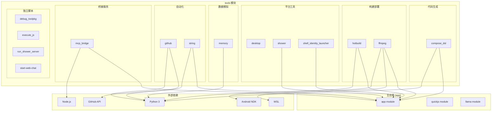

# Operit AI — tools 模块软件架构与业务流程快速上手

## 一、项目定位

`tools` 目录是 **Operit AI** 项目的**开发工具与辅助模块集合**，包含 10 个子模块，覆盖从代码生成、构建部署、字符串管理到虚拟屏服务、MCP 桥接等各个方面。这些工具不直接参与应用运行时，而是为开发、测试、部署和运维提供支撑。

### 子模块概览

| 子模块 | 技术栈 | 职责 |
|--------|--------|------|
| **compose_dsl** | Python + Kotlin 模板 | ToolPkg Compose DSL 代码生成器 |
| **desktop** | Android + Kotlin | 桌面端应用（Android 桌面模式） |
| **ffmpeg** | Shell 脚本 | FFmpeg 跨平台构建脚本 |
| **github** | Python | GitHub 自动化工具（Issue 管理、Skill 导入） |
| **hotbuild** | Python | 热构建与夜间自动构建 |
| **mcp_bridge** | TypeScript + Node.js | MCP 插件桥接器（WebSocket/Stdio） |
| **memory** | Python | 记忆评分模拟与可视化 |
| **shell_identity_launcher** | C++ + CMake | Shell 身份启动器（SELinux 域切换） |
| **shower** | Android + Java/Kotlin | 虚拟屏/投屏服务（WebSocket 视频流） |
| **string** | Python | UI 字符串管理与翻译检查 |

---

## 二、整体架构设计思想

### 2.1 工具集架构

```
┌─────────────────────────────────────────────────────────────────────────────┐
│                            tools 模块架构总览                                 │
└─────────────────────────────────────────────────────────────────────────────┘

    ┌─────────────┐ ┌─────────────┐ ┌─────────────┐ ┌─────────────┐
    │  代码生成    │ │  构建部署    │ │  平台工具    │ │  数据模拟    │
    │             │ │             │ │             │ │             │
    │ compose_dsl │ │   hotbuild  │ │   desktop   │ │   memory    │
    │             │ │             │ │             │ │             │
    └─────────────┘ └─────────────┘ └─────────────┘ └─────────────┘
    ┌─────────────┐ ┌─────────────┐ ┌─────────────┐ ┌─────────────┐
    │  多媒体      │ │  GitHub     │ │  终端增强    │ │  字符串管理  │
    │             │ │  自动化      │ │             │ │             │
    │   ffmpeg    │ │   github    │ │ shell_identity│ │   string   │
    │             │ │             │ │ _launcher   │ │             │
    └─────────────┘ └─────────────┘ └─────────────┘ └─────────────┘
    ┌─────────────────────────┐ ┌─────────────────────────────────┐
    │      MCP 桥接            │ │         虚拟屏服务               │
    │                         │ │                                 │
    │      mcp_bridge         │ │          shower                 │
    │    (TypeScript/Node)    │ │     (Android/WebSocket/H.264)   │
    └─────────────────────────┘ └─────────────────────────────────┘
```

### 2.2 设计原则

1. **单一职责**：每个子模块只负责一个明确的功能领域
2. **独立可运行**：大部分工具可独立运行，不依赖主应用
3. **脚本化优先**：使用 Python/Shell/TypeScript 脚本，便于自动化
4. **跨平台支持**：构建脚本支持 Windows/WSL/macOS/Linux
5. **与主应用松耦合**：通过文件/网络/ADB 与主应用交互

---

## 三、各子模块详解

### 3.1 compose_dsl — ToolPkg Compose DSL 代码生成器

**定位**：为 ToolPkg 插件系统生成 Compose DSL 渲染代码的自动化工具。

**技术栈**：Python 3 + Jinja2 模板引擎

**核心文件**：

| 文件 | 职责 |
|------|------|
| `generate_compose_dsl_artifacts.py` | 主生成脚本，解析 DSL 定义并生成 Kotlin 代码 |
| `templates/ToolPkgComposeDslGeneratedRenderers.kt.tpl` | Kotlin 渲染器模板 |
| `README.md` | 使用说明 |

**工作流程**：

```
ToolPkg 插件定义（JSON/YAML）
    │
    ├──► generate_compose_dsl_artifacts.py
    │       │
    │       ├──► 解析 DSL 定义
    │       │       • 读取组件描述
    │       │       • 提取属性、事件、子组件
    │       │
    │       ├──► 应用 Jinja2 模板
    │       │       • 填充模板变量
    │       │       • 生成 Kotlin 代码
    │       │
    │       └──► 输出到 app 模块
    │               • 生成渲染器类
    │               • 注册到渲染器注册表
    │
    └──► app 模块编译时包含生成的代码
```

**使用方式**：

```bash
# 生成 Compose DSL 代码
python tools/compose_dsl/generate_compose_dsl_artifacts.py \
    --input path/to/toolpkg/dsl.json \
    --output app/src/main/java/.../generated/
```

---

### 3.2 desktop — 桌面端应用

**定位**：Operit AI 的 Android 桌面模式应用，支持在大屏设备（平板/桌面）上运行。

**技术栈**：Android + Kotlin + Jetpack Compose

**核心文件**：

| 文件 | 职责 |
|------|------|
| `app/src/main/AndroidManifest.xml` | 应用清单，声明 QUERY_ALL_PACKAGES 权限 |
| `app/src/main/.../MainActivity.kt` | 桌面模式主 Activity |
| `build.gradle.kts` | 桌面模块构建配置 |

**特点**：

- 独立的 Android 应用模块
- 支持桌面窗口模式（多窗口/自由缩放）
- 与主 app 模块共享部分代码

---

### 3.3 ffmpeg — FFmpeg 跨平台构建

**定位**：为 Android 提供 FFmpeg 原生库的跨平台构建脚本。

**技术栈**：Shell 脚本 + WSL

**核心文件**：

| 文件 | 职责 |
|------|------|
| `build_ffmpeg_kit_wsl.sh` | 在 WSL 环境中构建 FFmpeg Kit |
| `import_local_ffmpeg_kit.ps1` | PowerShell 脚本，导入本地构建的 FFmpeg Kit |

**构建流程**：

```
Windows 开发环境
    │
    ├──► WSL (Ubuntu)
    │       │
    │       ├──► 运行 build_ffmpeg_kit_wsl.sh
    │       │       • 下载 FFmpeg 源码
    │       │       • 配置 Android NDK 交叉编译
    │       │       • 编译 arm64-v8a 库
    │       │       • 生成 .so 文件
    │       │
    │       └──► 输出到共享目录
    │
    └──► Windows PowerShell
            │
            └──► 运行 import_local_ffmpeg_kit.ps1
                    • 复制 .so 文件到 app/libs/
                    • 更新 Gradle 配置
```

---

### 3.4 github — GitHub 自动化工具

**定位**：自动化管理 GitHub Issues、导入 Anthropic Skills、AI 辅助提交。

**技术栈**：Python 3

**核心文件**：

| 文件 | 职责 |
|------|------|
| `commit_ai.py` | AI 辅助生成 Git 提交信息 |
| `import_anthropic_skills.py` | 从 Anthropic 导入 Skill 定义 |
| `list_issues.py` | 列出仓库 Issues |
| `issues_open.md` / `issues_open_ai.md` | Issue 模板 |

**功能列表**：

| 脚本 | 功能 |
|------|------|
| `commit_ai.py` | 分析 git diff，调用 AI 生成规范的 commit message |
| `import_anthropic_skills.py` | 解析 Anthropic 技能定义，转换为 Operit Skill 格式 |
| `list_issues.py` | 批量列出、筛选、导出 GitHub Issues |

---

### 3.5 hotbuild — 热构建与自动构建

**定位**：开发阶段的热重载构建和夜间自动构建发布。

**技术栈**：Python 3

**核心文件**：

| 文件 | 职责 |
|------|------|
| `nightly_auto.py` | 夜间自动构建脚本 |
| `build_patch.py` | 构建补丁包 |
| `apply_patch.py` | 应用补丁包 |
| `install_from_adb.bat` | 通过 ADB 安装构建产物 |

**nightly_auto.py 构建流程**：

```
定时触发（CI/CD 或本地 cron）
    │
    ├──► 解析版本号
    │       • 从 build.gradle.kts 读取 versionName
    │       • 格式：v{major}.{minor}.{patch}+{buildNumber}
    │
    ├──► 执行构建
    │       • ./gradlew assembleRelease
    │       • 签名 APK
    │
    ├──► 生成补丁
    │       • 对比上一个版本
    │       • 生成增量更新包
    │
    ├──► 上传发布
    │       • 上传到分发平台
    │       • 更新版本信息
    │
    └──► 通知
            • 发送构建结果通知
```

---

### 3.6 mcp_bridge — MCP 插件桥接器

**定位**：MCP（Model Context Protocol）插件的 Node.js 桥接器，负责与 Android 应用通信。

**技术栈**：TypeScript + Node.js + WebSocket

**核心文件**：

| 文件 | 职责 |
|------|------|
| `index.ts` | 主入口，启动桥接服务 |
| `spawn-helper.ts` | 子进程管理（启动/监控/重启 MCP 插件） |
| `package.json` | Node.js 依赖配置 |
| `README.md` | 使用说明 |

**架构**：

```
Android App (Java/Kotlin)
    │
    ├──► WebSocket / Stdio
    │       │
    │       └──► mcp_bridge (Node.js)
    │               │
    │               ├──► 启动 MCP 插件子进程
    │               │       • Node.js 脚本
    │               │       • Python 脚本
    │               │       • 可执行文件
    │               │
    │               ├──► 协议转换
    │               │       • JSON-RPC 2.0
    │               │       • MCP 协议封装
    │               │
    │               └──► 生命周期管理
    │                       • 健康检查
    │                       • 自动重启
    │                       • 日志收集
    │
    └──► 工具注册回调
            • 插件工具注册到 AIToolHandler
            • 工具执行请求转发
```

**通信协议**：

| 方向 | 协议 | 说明 |
|------|------|------|
| Android → Bridge | WebSocket / Stdio | 发送工具执行请求 |
| Bridge → Plugin | Stdio / TCP | JSON-RPC 调用 |
| Plugin → Bridge | Stdio / TCP | JSON-RPC 响应 |
| Bridge → Android | WebSocket / Stdio | 返回执行结果 |

---

### 3.7 memory — 记忆评分模拟

**定位**：离线模拟和可视化记忆库候选评分算法，用于调优和测试。

**技术栈**：Python 3 + matplotlib（可选）

**核心文件**：

| 文件 | 职责 |
|------|------|
| `memory_scoring_sim.py` | 评分模拟主脚本 |
| `sample_dataset.json` | 示例数据集 |

**评分算法**：

| 评分维度 | 说明 |
|----------|------|
| **Keyword Match** | 关键词匹配分数 |
| **Reverse Containment** | 反向包含分数 |
| **Semantic Score** | 语义相似度分数 |
| **Graph Propagation** | 图谱传播分数 |
| **RRF (Reciprocal Rank Fusion)** | 倒数排名融合 |

**评分模式**：

| 模式 | 权重配置 |
|------|----------|
| `BALANCED` | (1.0, 1.0, 1.0) |
| `KEYWORD_FIRST` | (1.3, 0.8, 0.9) |
| `SEMANTIC_FIRST` | (0.8, 1.3, 1.1) |

**使用方式**：

```bash
# 运行评分模拟
python tools/memory/memory_scoring_sim.py \
    --dataset sample_dataset.json \
    --mode BALANCED \
    --plot
```

---

### 3.8 shell_identity_launcher — Shell 身份启动器

**定位**：以 `shell` 用户身份（uid/gid 2000）启动进程，用于需要 shell 权限的操作。

**技术栈**：C++ + CMake + NDK

**核心文件**：

| 文件 | 职责 |
|------|------|
| `native-lib.cpp` | C++ 主程序 |
| `CMakeLists.txt` | 构建配置 |
| `build_android.bat` | Windows 构建脚本 |
| `push_android.bat` | ADB 推送脚本 |

**核心逻辑**：

```cpp
// 以 root 运行 → 切换 SELinux 域 → 切换 shell 用户 → execvp 目标命令

int main(int argc, char** argv) {
    // 1. 获取当前 SELinux 上下文
    char* currentContext;
    se::__getcon(&currentContext);
    
    // 2. 尝试切换到 shell 的 SELinux 域
    //    从 Shizuku 源码简化移植
    
    // 3. 切换用户为 shell (uid=2000, gid=2000)
    setuid(2000);
    setgid(2000);
    
    // 4. 执行目标命令
    execvp(argv[1], argv + 1);
}
```

**使用场景**：

- 需要 `shell` 权限执行 ADB 相关命令
- 绕过普通应用的权限限制
- 与系统服务交互

---

### 3.9 shower — 虚拟屏/投屏服务

**定位**：在 Android 上创建虚拟显示屏，并通过 WebSocket 实时传输 H.264 视频流，实现远程投屏和 UI 自动化。

**技术栈**：Android + Java/Kotlin + MediaCodec + WebSocket

**核心文件**：

| 文件 | 职责 |
|------|------|
| `Main.java` | 主程序，WebSocket 服务器 + 虚拟屏 + 视频编码 |
| `MainActivity.kt` | 入口 Activity |
| `DisplayCapture.java` | 屏幕捕获 |
| `InputController.java` | 输入控制（触摸/按键） |
| `IShowerService.java` | AIDL 服务接口 |
| `IShowerVideoSink.java` | 视频流接收接口 |

**架构**：

```
Client (WebSocket)
    │
    ├──► WebSocket 连接
    │       │
    │       └──► Shower Server (Android)
    │               │
    │               ├──► 创建 VirtualDisplay
    │               │       • DisplayManager.createVirtualDisplay()
    │               │       • 绑定到 Surface
    │               │
    │               ├──► MediaCodec 编码
    │               │       • H.264 硬件编码
    │               │       • 配置码率、帧率
    │               │
    │               ├──► 捕获帧
    │               │       • 从 Surface 获取图像
    │               │       • 送入编码器
    │               │
    │               └──► WebSocket 发送
    │                       • 发送 H.264 NAL 单元
    │                       • 客户端解码播放
    │
    └──► 发送控制指令
            • 触摸事件 (touch x y)
            • 按键事件 (key code)
            • 滑动事件 (swipe x1 y1 x2 y2)
```

**支持的虚拟屏标志**：

| 标志 | 说明 |
|------|------|
| `VIRTUAL_DISPLAY_FLAG_PUBLIC` | 公开显示 |
| `VIRTUAL_DISPLAY_FLAG_PRESENTATION` | 演示模式 |
| `VIRTUAL_DISPLAY_FLAG_OWN_CONTENT_ONLY` | 仅显示自有内容 |
| `VIRTUAL_DISPLAY_FLAG_SUPPORTS_TOUCH` | 支持触摸 |
| `VIRTUAL_DISPLAY_FLAG_ROTATES_WITH_CONTENT` | 随内容旋转 |
| `VIRTUAL_DISPLAY_FLAG_TRUSTED` | 受信任显示 |
| `VIRTUAL_DISPLAY_FLAG_OWN_FOCUS` | 独立焦点 |

---

### 3.10 string — UI 字符串管理

**定位**：管理 Android 应用的 UI 字符串资源，支持多语言翻译检查和缺失填充。

**技术栈**：Python 3

**核心文件**：

| 文件 | 职责 |
|------|------|
| `check_strings.py` | 检查字符串翻译完整性 |
| `add_string.py` | 添加新字符串到所有语言 |
| `fill_missing_translations.py` | 自动填充缺失翻译 |
| `count_ui_strings.py` | 统计 UI 字符串数量 |
| `search_string.py` | 搜索字符串 |

**支持的语言**：

| 语言代码 | 语言 |
|----------|------|
| `zh` | 中文（默认） |
| `en` | 英文 |
| `es` | 西班牙语 |
| `pt-BR` | 葡萄牙语（巴西） |
| `ms` | 马来语 |
| `id` | 印尼语 |

**check_strings.py 工作流程**：

```
扫描 app/src/main/res/
    │
    ├──► 发现所有 values-*/strings.xml
    │
    ├──► 对比各语言的字符串集合
    │       • 检查缺失的翻译
    │       • 检查多余的翻译
    │       • 检查格式不一致
    │
    ├──► 生成报告
    │       • 缺失翻译列表
    │       • 统计信息
    │
    └──► 可选：自动填充缺失翻译
            • 调用翻译 API
            • 或复制默认语言
```

**使用方式**：

```bash
# 检查字符串完整性
python tools/string/check_strings.py

# 添加新字符串
python tools/string/add_string.py --key "new_string" --value "新字符串"

# 填充缺失翻译
python tools/string/fill_missing_translations.py --lang en
```

---

## 四、根目录脚本

`tools/` 根目录下还有一些独立的实用脚本：

| 脚本 | 功能 |
|------|------|
| `debug_toolpkg.bat/.py/.sh` | 调试 ToolPkg 插件 |
| `dump_current_compose_dsl_ui.bat` | 导出当前 Compose DSL UI 状态 |
| `execute_js.bat/.sh` | 执行 JS 脚本 |
| `execute_js_dir.bat/.sh` | 批量执行目录下 JS 脚本 |
| `run_sandbox_script.bat/.sh` | 运行沙箱脚本 |
| `run_shower_server.bat` | 启动 Shower 服务 |
| `kill_shower_server.bat` | 停止 Shower 服务 |
| `start-web-chat.sh` | 启动 web-chat 开发服务器 |
| `build_server.bat` | 构建服务器 |
| `qqbot_*.js` | QQ 机器人相关脚本 |
| `shower_ws_client.py` | Shower WebSocket 客户端 |
| `sandboxpackage_dev_install_or_update.js` | 沙箱包开发安装 |

---

## 五、完整架构图（Mermaid）



---

## 六、快速上手路径

### 6.1 生成 Compose DSL 代码

```bash
cd tools/compose_dsl
python generate_compose_dsl_artifacts.py \
    --input ../../path/to/dsl.json \
    --output ../../app/src/main/java/.../generated/
```

### 6.2 构建 FFmpeg

```bash
# WSL 环境
cd tools/ffmpeg
bash build_ffmpeg_kit_wsl.sh

# Windows 导入
powershell -File import_local_ffmpeg_kit.ps1
```

### 6.3 启动 MCP 桥接器

```bash
cd tools/mcp_bridge
npm install
npm run build
npm start
```

### 6.4 运行记忆评分模拟

```bash
cd tools/memory
python memory_scoring_sim.py --dataset sample_dataset.json --plot
```

### 6.5 检查字符串翻译

```bash
cd tools/string
python check_strings.py
python fill_missing_translations.py --lang en
```

### 6.6 构建 Shell Launcher

```bash
cd tools/shell_identity_launcher
# 使用 Android Studio 或命令行
gradlew build
adb push build/.../shell_identity_launcher /data/local/tmp/
```

### 6.7 启动 Shower 服务

```bash
# 构建并安装 Shower APK
cd tools/shower
gradlew installDebug

# 或运行脚本
cd ../..
tools/run_shower_server.bat
```

### 6.8 夜间自动构建

```bash
cd tools/hotbuild
python nightly_auto.py \
    --repo-root ../../ \
    --output-dir ../../build/
```

---

*文档生成时间: 2026-05-13*
*基于 Operit AI tools 模块代码分析*
