# Operit AI — web-chat 模块软件架构与业务流程快速上手

## 一、项目定位

`web-chat` 模块是 **Operit AI** 的**网页端聊天界面**，作为 Android app 的配套 Web 客户端运行。它通过 HTTP API 与后端（Android app 暴露的本地服务器）通信，提供与移动端一致的 AI 对话体验。

### 核心特性

| 特性 | 说明 |
|------|------|
| **实时流式对话** | SSE (Server-Sent Events) 流式接收 AI 回复 |
| **双模式聊天样式** | 气泡模式 (bubble) / 光标模式 (cursor) |
| **双模式输入样式** | 经典模式 (classic) / Agent 模式 (agent) |
| **主题系统** | 完整的 CSS 变量主题，支持自定义字体、背景、配色 |
| **附件上传** | 支持文件附件上传和预览 |
| **消息定位器** | 快速跳转到任意历史消息 |
| **待发送队列** | 消息排队发送机制 |
| **分页加载** | 前后双向分页加载历史消息 |
| **全屏悬浮窗** | 支持全屏模式切换 |

### 技术栈

| 技术 | 版本 | 用途 |
|------|------|------|
| React | ^19.0.0 | UI 框架 |
| TypeScript | ~5.7.2 | 类型系统 |
| Vite | ^6.0.0 | 构建工具 |
| CSS Modules | - | 样式隔离 |
| SSE (EventSource) | - | 流式数据接收 |

---

## 二、整体架构设计思想

### 2.1 分层架构（Layered Architecture）

```
┌─────────────────────────────────────────────────────────────────────────────┐
│                              表现层 (Presentation)                           │
│  ┌─────────────┐ ┌─────────────┐ ┌─────────────┐ ┌─────────────┐           │
│  │   Screen    │ │  Component  │ │    Style    │ │   Theme     │           │
│  │  (AIChat)   │ │  (ChatArea) │ │   (CSS)     │ │  (CSS Var)  │           │
│  └─────────────┘ └─────────────┘ └─────────────┘ └─────────────┘           │
├─────────────────────────────────────────────────────────────────────────────┤
│                              状态层 (State)                                  │
│  ┌─────────────────────────────────────────────────────────────────────┐   │
│  │                     ChatViewModel (React Hooks)                      │   │
│  │  ┌─────────────┐ ┌─────────────┐ ┌─────────────┐ ┌─────────────┐   │   │
│  │  │   useState  │ │   useMemo   │ │  useEffect  │ │    useRef   │   │   │
│  │  │  (40+ 状态) │ │  (计算属性) │ │  (副作用)   │ │  (引用)     │   │   │
│  │  └─────────────┘ └─────────────┘ └─────────────┘ └─────────────┘   │   │
│  └─────────────────────────────────────────────────────────────────────┘   │
├─────────────────────────────────────────────────────────────────────────────┤
│                              业务层 (Business)                               │
│  ┌─────────────┐ ┌─────────────┐ ┌─────────────┐ ┌─────────────┐           │
│  │ UiStateDelegate│ │ FloatingWindow │ │ Configuration │ │  Theme Builder │  │
│  │(状态计算)   │ │   Delegate   │ │   StateHolder  │ │   (CSS)      │  │
│  └─────────────┘ └─────────────┘ └─────────────┘ └─────────────┘           │
├─────────────────────────────────────────────────────────────────────────────┤
│                              数据层 (Data)                                   │
│  ┌─────────────┐ ┌─────────────┐ ┌─────────────┐                           │
│  │   chatApi   │ │  chatTypes  │ │ localStorage │                           │
│  │(HTTP API)   │ │ (TypeScript)│ │  (Token持久化)│                           │
│  └─────────────┘ └─────────────┘ └─────────────┘                           │
└─────────────────────────────────────────────────────────────────────────────┘
```

### 2.2 架构模式

| 模式 | 应用位置 | 说明 |
|------|----------|------|
| **MVVM** | 全局 | React Hooks 实现 ViewModel，JSX 作为 View |
| **自定义 Hook** | ChatViewModel | `useChatViewModel()` 封装全部状态与逻辑 |
| **委托模式** | 状态计算 | `UiStateDelegate` 处理可见聊天列表、上下文统计 |
| **Props 透传** | 组件通信 | 大型 ViewModel 对象通过 props 向下传递 |
| **CSS 变量主题** | 样式系统 | 运行时动态生成 CSS 变量，支持深色/浅色模式 |

### 2.3 核心设计原则

1. **单一 Hook 管理全部状态**：`useChatViewModel()` 集中管理 40+ 个状态，通过一个大对象暴露给 UI
2. **响应式 UI**：所有状态变化通过 React 渲染机制自动驱动 UI 更新
3. **流式优先**：SSE 流式接收 AI 回复，实时更新消息内容
4. **乐观更新**：发送消息时立即在本地渲染乐观消息，提升用户体验
5. **前后分页**：支持双向分页加载历史消息，优化大聊天记录性能

---

## 三、源码目录结构

```
web-chat/
│
├── public/
│   └── favicon.svg               # 网站图标
│
├── scripts/
│   └── sync-to-android-assets.mjs # 同步到 Android assets 的脚本
│
├── src/
│   ├── main.tsx                  # 应用入口（ReactDOM.createRoot）
│   ├── vite-env.d.ts             # Vite 环境类型声明
│   │
│   └── ui/features/chat/         # 聊天功能模块（唯一功能域）
│       │
│       ├── screens/              # 屏幕级组件
│       │   ├── AIChatScreen.tsx      # 主聊天屏幕（根组件）
│       │   └── ConfigurationScreen.tsx # 配置/连接屏幕
│       │
│       ├── components/           # 可复用组件
│       │   ├── ChatScreenContent.tsx   # 聊天屏幕内容布局
│       │   ├── ChatArea.tsx            # 聊天消息列表区域
│       │   ├── ChatScreenHeader.tsx    # 顶部标题栏
│       │   ├── ChatHistorySelector.tsx # 聊天历史选择器（侧边栏）
│       │   ├── CharacterSelectorPanel.tsx # 角色选择面板
│       │   ├── ChatScrollNavigator.tsx  # 消息滚动导航器
│       │   ├── ScrollToBottomButton.tsx # 滚动到底部按钮
│       │   ├── AttachmentChip.tsx       # 附件标签
│       │   ├── AttachmentSelector.tsx   # 附件选择器
│       │   ├── FullscreenInputDialog.tsx # 全屏输入对话框
│       │   ├── SimpleLinearProgressIndicator.tsx # 进度条
│       │   │
│       │   ├── attachments/      # 附件相关组件
│       │   │   └── MessageAttachmentTag.tsx
│       │   │
│       │   ├── part/             # 消息内容渲染组件
│       │   │   ├── MarkdownRenderer.tsx      # Markdown 渲染
│       │   │   ├── ToolDisplayComponents.tsx # 工具调用展示
│       │   │   ├── ToolResultDisplay.tsx     # 工具结果展示
│       │   │   ├── FileDiffDisplay.tsx       # 文件差异展示
│       │   │   ├── CustomXmlRenderer.tsx     # 自定义 XML 渲染
│       │   │   ├── DetailsTagRenderer.tsx    # Details 标签渲染
│       │   │   ├── ParamVisualizer.tsx       # 参数可视化
│       │   │   ├── StructuredExpand.tsx      # 结构化展开
│       │   │   ├── GlassSurface.tsx          # 玻璃拟态表面
│       │   │   ├── DialogComponents.tsx      # 对话框组件
│       │   │   └── XmlCanvasSummaryComponents.tsx # XML 画布摘要
│       │   │
│       │   └── style/            # 样式变体组件
│       │       ├── bubble/       # 气泡样式消息
│       │       │   ├── BubbleStyleChatMessage.tsx
│       │       │   ├── BubbleAiMessageComposable.tsx
│       │       │   ├── BubbleUserMessageComposable.tsx
│       │       │   └── BubbleImageBackgroundSurface.tsx
│       │       │
│       │       ├── cursor/       # 光标样式消息
│       │       │   ├── CursorStyleChatMessage.tsx
│       │       │   ├── AiMessageComposable.tsx
│       │       │   ├── UserMessageComposable.tsx
│       │       │   └── SummaryMessageComposable.tsx
│       │       │
│       │       └── input/        # 输入区域样式
│       │           ├── agent/    # Agent 输入样式
│       │           │   └── AgentChatInputSection.tsx
│       │           ├── classic/  # 经典输入样式
│       │           │   ├── ClassicChatInputSection.tsx
│       │           │   └── ClassicChatSettingsBar.tsx
│       │           └── common/   # 通用输入组件
│       │               ├── InputOverlayPopup.tsx
│       │               ├── InputToolButton.tsx
│       │               ├── ModelSelectorPanel.tsx
│       │               ├── PendingMessageQueuePanel.tsx
│       │               └── CharacterCardModelBindingSwitchConfirmDialog.tsx
│       │
│       ├── viewmodel/            # 状态管理层
│       │   ├── ChatViewModel.ts      # 核心 ViewModel（~1670 行）
│       │   ├── UiStateDelegate.ts    # UI 状态计算委托
│       │   └── FloatingWindowDelegate.ts # 悬浮窗委托
│       │
│       ├── util/                 # 工具层
│       │   ├── chatApi.ts            # HTTP API 封装（fetch + SSE）
│       │   ├── chatTypes.ts          # TypeScript 类型定义
│       │   ├── chatTheme.ts          # 主题构建器
│       │   ├── chatUtils.ts          # 通用工具函数
│       │   ├── chatIcons.tsx         # 图标组件
│       │   ├── ConfigurationStateHolder.ts # 配置状态持久化
│       │   ├── chat-screen.css       # 屏幕级样式
│       │   └── styles/               # 模块化样式
│       │       ├── chat-composer.css
│       │       ├── chat-dialogs.css
│       │       ├── chat-foundation.css
│       │       ├── chat-history.css
│       │       ├── chat-messages.css
│       │       └── chat-structured.css
│       │
│       └── attachments/          # 附件工具
│           └── AttachmentUtils.ts    # 附件处理工具
│
├── index.html                    # HTML 入口
├── package.json                  # 依赖配置
├── tsconfig.json                 # TypeScript 配置
└── vite.config.ts                # Vite 构建配置
```

---

## 四、核心架构详解

### 4.1 ChatViewModel — 单一状态管理中心

```typescript
// ChatViewModel.ts — 核心设计模式：单一 Hook 管理全部状态

export interface ChatViewModelState {
  // 认证状态
  token: string;                    // 当前 Bearer Token
  tokenDraft: string;               // Token 输入草稿
  
  // 启动数据
  boot: WebBootstrapResponse | null; // 启动配置
  theme: WebThemeSnapshot | null;   // 当前主题
  
  // 角色选择
  characterSelector: WebCharacterSelectorResponse | null;
  characterSelectorOpen: boolean;
  characterSelectorLoading: boolean;
  
  // 模型选择
  modelSelector: WebModelSelectorState | null;
  modelSelectorLoading: boolean;
  
  // 聊天列表
  chats: WebChatSummary[];          // 全部聊天
  visibleChats: WebChatSummary[];   // 过滤后的可见聊天
  selectedChatId: string | null;    // 当前选中聊天 ID
  selectedChat: WebChatSummary | null;
  
  // 消息
  messages: WebChatMessage[];       // 当前聊天消息列表
  messageInput: string;             // 输入框内容
  search: string;                   // 搜索关键词
  
  // 附件
  pendingUploads: WebUploadedAttachment[]; // 待发送附件
  attachmentPanelOpen: boolean;
  
  // 待发送队列
  pendingQueueMessages: PendingQueueMessageItem[];
  isPendingQueueExpanded: boolean;
  
  // 状态标志
  error: string | null;
  isConnecting: boolean;            // 连接中
  isBusy: boolean;                  // 忙碌中
  isStreaming: boolean;             // 流式接收中
  inputProcessingStage: InputProcessingStage; // idle/connecting/uploading/streaming
  
  // 历史记录
  historyOpen: boolean;             // 历史面板是否打开
  historyLoading: boolean;
  hasMoreHistoryBefore: boolean;    // 是否有更早消息
  hasMoreHistoryAfter: boolean;     // 是否有更新消息
  isLoadingHistoryBefore: boolean;
  isLoadingHistoryAfter: boolean;
  
  // 主题与样式
  activeChatStyle: ChatStyle;       // 'bubble' | 'cursor'
  activeInputStyle: InputStyle;     // 'classic' | 'agent'
  activeCharacterName: string;
  activeCharacterAvatarUrl: string | null;
  
  // 其他
  autoScrollToBottom: boolean;
  activeStreamingCount: number;     // 活跃流式会话数
  contextStats: ContextStatsSnapshot; // 上下文统计
  historyDisplayMode: HistoryDisplayMode;
  inputSettings: WebInputSettingsState | null;
  memorySelector: WebMemorySelectorState | null;
}

export interface ChatViewModelActions {
  // 认证
  setTokenDraft: (value: string) => void;
  submitToken: () => void;
  
  // 聊天管理
  createConversation: (options?) => Promise<void>;
  renameConversation: (chat, title) => Promise<void>;
  deleteConversation: (chat) => Promise<void>;
  selectChat: (chatId: string) => void;
  reorderConversations: (items) => Promise<void>;
  
  // 消息
  setMessageInput: (value: string) => void;
  sendMessage: () => Promise<void>;
  cancelCurrentMessage: () => void;
  
  // 附件
  uploadFiles: (files) => Promise<void>;
  removePendingUpload: (attachmentId: string) => void;
  
  // 队列
  queueDraftMessage: () => void;
  sendPendingQueueMessage: (id: number) => Promise<void>;
  deletePendingQueueMessage: (id: number) => void;
  editPendingQueueMessage: (id: number) => void;
  
  // 历史分页
  loadOlderMessages: () => Promise<void>;
  loadNewerMessages: () => Promise<void>;
  showLatestMessages: () => Promise<void>;
  
  // 角色/模型/记忆
  switchActivePrompt: (target) => Promise<void>;
  selectModelConfig: (configId, modelIndex) => Promise<void>;
  selectMemoryProfile: (profileId: string) => Promise<void>;
  updateInputSettings: (payload) => Promise<void>;
  
  // 其他
  setHistoryOpen: (value: boolean) => void;
  setCharacterSelectorOpen: (value: boolean) => void;
  setAttachmentPanelOpen: (value: boolean) => void;
  setAutoScrollToBottom: (value: boolean) => void;
  toggleMessageFavorite: (timestamp, isFavorite) => Promise<void>;
  // ... 共 40+ 个 action
}

export type ChatViewModel = ChatViewModelState & ChatViewModelActions;

export function useChatViewModel(): ChatViewModel {
  const [token, setToken] = useState(() => readStoredToken());
  const [boot, setBoot] = useState<WebBootstrapResponse | null>(null);
  const [theme, setTheme] = useState<WebThemeSnapshot | null>(null);
  const [chats, setChats] = useState<WebChatSummary[]>([]);
  const [messages, setMessages] = useState<WebChatMessage[]>([]);
  // ... 40+ 个 useState
  
  // 计算属性（useMemo）
  const visibleChats = useMemo(() => buildVisibleChats(chats, search), [chats, search]);
  const selectedChat = useMemo(() => chats.find(c => c.id === selectedChatId) ?? null, [...]);
  const activeChatStyle = theme?.chat_style === 'bubble' ? 'bubble' : 'cursor';
  const contextStats = useMemo(() => buildContextStats(messages, messageInput, inputSettings), [...]);
  
  // 副作用（useEffect）
  useEffect(() => { /* token 变化时加载 bootstrap */ }, [token]);
  useEffect(() => { /* selectedChatId 变化时加载对话 */ }, [selectedChatId, token]);
  
  // Action 实现
  async function sendPreparedMessage(text, uploads) { /* ... */ }
  async function sendMessage() { /* ... */ }
  async function loadOlderMessages() { /* ... */ }
  // ...
  
  return { /* 合并 state + actions 返回 */ };
}
```

**设计特点：**

- **单一数据源**：所有状态集中在 `useChatViewModel()` 中管理
- **Props 透传**：整个 `ChatViewModel` 对象通过 props 传递给子组件
- **计算属性**：使用 `useMemo` 派生可见聊天列表、上下文统计等
- **副作用隔离**：使用 `useEffect` 处理 token 变化、聊天切换等副作用

### 4.2 组件层级结构

```
AIChatScreen (根屏幕)
    │
    ├──► ChatScreenContent (主内容布局)
    │       │
    │       ├──► CharacterSelectorPanel (角色选择面板)
    │       │
    │       ├──► ChatHistorySelector (聊天历史侧边栏)
    │       │
    │       ├──► ChatScreenHeader (顶部标题栏)
    │       │
    │       ├──► ChatArea (聊天消息区域)
    │       │       │
    │       │       ├──► BubbleStyleChatMessage / CursorStyleChatMessage
    │       │       │       ├──► AiMessageComposable (AI 消息)
    │       │       │       ├──► UserMessageComposable (用户消息)
    │       │       │       └──► 消息内容渲染 (MarkdownRenderer, ToolDisplayComponents, ...)
    │       │       │
    │       │       ├──► ChatScrollNavigator (消息导航器)
    │       │       └──► ScrollToBottomButton (回到底部按钮)
    │       │
    │       ├──► ClassicChatSettingsBar (经典设置栏)
    │       │
    │       └──► ChatComposer (输入区域)
    │               │
    │               ├──► AgentChatInputSection (Agent 样式)
    │               └──► ClassicChatInputSection (经典样式)
    │
    └──► ConfigurationScreen (连接配置覆盖层)
```

### 4.3 样式架构 — CSS 变量主题系统

```typescript
// chatTheme.ts — 主题构建器

function buildChatThemeStyle(theme: WebThemeSnapshot | null): ThemeStyle {
  if (!theme) return {};
  
  return {
    // 基础颜色
    '--chat-root-background': theme.palette.background_color,
    '--chat-surface-color': theme.palette.surface_color,
    '--chat-primary-color': theme.palette.primary_color,
    '--chat-on-surface-color': theme.palette.on_surface_color,
    
    // 背景图片
    '--chat-background-image': theme.background?.asset_url 
      ? `url(${theme.background.asset_url})` 
      : 'none',
    '--chat-background-opacity': String(theme.background?.opacity ?? 0),
    '--chat-background-tint': toRgba(theme.palette.background_color, clampOpacity(theme.background?.opacity)),
    
    // 字体
    '--chat-font-family': resolveFontFamily(theme),
    '--chat-font-scale': String(theme.font?.scale ?? 1),
    
    // 输入框样式
    '--chat-input-floating': theme.input?.floating ? '1' : '0',
    '--chat-input-transparent': theme.input?.transparent ? '1' : '0',
    
    // 气泡样式
    '--chat-bubble-wide-layout': theme.bubble?.wide_layout ? '1' : '0',
    
    // ... 更多 CSS 变量
  };
}
```

**样式文件组织：**

| 文件 | 职责 |
|------|------|
| `chat-foundation.css` | 基础布局、滚动条、动画 |
| `chat-messages.css` | 消息气泡、光标样式、加载指示器 |
| `chat-composer.css` | 输入框、附件面板、工具按钮 |
| `chat-history.css` | 历史侧边栏、聊天列表、搜索 |
| `chat-dialogs.css` | 弹窗、对话框、覆盖层 |
| `chat-structured.css` | 结构化内容、工具展示、代码块 |

---

## 五、核心业务流程

### 5.1 应用启动流程

```
用户打开网页
    │
    ├──► main.tsx → ReactDOM.createRoot → AIChatScreen
    │
    ├──► AIChatScreen 渲染
    │       ├──► 检查 token（localStorage）
    │       │       • 无 token → 显示 ConfigurationScreen（连接配置）
    │       │       • 有 token → 继续
    │       │
    │       ├──► ChatScreenContent 渲染
    │       │       • 等待 bootstrap 数据
    │       │
    │       └──► 应用主题 CSS 变量
    │
    └──► useEffect[token] 触发
            │
            ├──► loadBootstrap(token)
            │       • 并行请求：bootstrap + characterSelector + modelSelector + inputSettings + memorySelector
            │       • 设置启动数据
            │
            ├──► 设置 selectedChatId（来自 bootstrap.current_chat_id）
            │
            └──► useEffect[selectedChatId] 触发
                    │
                    └──► loadConversation(token, chatId)
                            • 并行请求：theme + messages + characterSelector + modelSelector + inputSettings
                            • 渲染消息列表
```

### 5.2 发送消息流程

```
用户输入消息 + 点击发送
    │
    ├──► ChatViewModel.sendMessage()
    │       │
    │       ├──► 检查上下文限制（shouldConfirmContextLimit）
    │       │       • 超出限制 → 弹出确认对话框
    │       │
    │       ├──► 清空输入框 + 清空附件列表
    │       │
    │       └──► sendPreparedMessage(text, uploads)
    │               │
    │               ├──► 检查/创建聊天（无选中聊天时自动创建）
    │               │
    │               ├──► 构建乐观消息（Optimistic UI）
    │               │       • 用户消息（本地 ID）
    │               │       • AI 消息（空内容，streaming=true）
    │               │
    │               ├──► 添加到 messages 状态 → UI 立即渲染
    │               │
    │               ├──► 设置 isBusy=true, isStreaming=true
    │               │
    │               ├──► 创建 AbortController（用于取消）
    │               │
    │               └──► streamMessage(token, chatId, payload, callbacks, signal)
    │                       │
    │                       ├──► 发送 HTTP POST 请求（/api/web/chats/{chatId}/stream）
    │                       │
    │                       ├──► 解析 SSE 流式响应
    │                       │       │
    │                       │       ├──► event: user_message
    │                       │       │       • 替换乐观用户消息为服务端消息
    │                       │       │
    │                       │       ├──► event: assistant_delta
    │                       │       │       • 追加 AI 消息内容
    │                       │       • appendStreamingAssistantDelta()
    │                       │       • UI 实时更新
    │                       │
    │                       │       ├──► event: assistant_done
    │                       │       │       • 标记 streaming=false
    │                       │       • finalizeStreamingAssistantMessage()
    │                       │
    │                       │       └──► event: error
    │                       │               • 显示错误信息
    │                       │
    │                       └──► 流结束
    │
    ├──► finally 块
    │       • setBusy(false), setStreaming(false)
    │       • 重新加载对话（merge-latest 模式）
    │       • 刷新聊天列表
    │
    └──► UI 显示最终 AI 回复
```

**流式消息处理核心代码：**

```typescript
// SSE 事件处理
await streamMessage(token, targetChatId, {
  message: text,
  attachment_ids: uploads.map(item => item.attachment_id),
  return_tool_status: true
}, {
  onEvent: (event) => {
    switch (event.event) {
      case 'user_message':
        // 替换乐观用户消息
        setMessages(messages => messages.map(item =>
          item.id === optimisticUserMessage.id ? event.message : item
        ));
        break;
        
      case 'assistant_delta':
        // 追加 AI 回复内容
        setMessages(messages => appendStreamingAssistantDelta(
          messages,
          optimisticAssistantMessage.id,
          event.delta ?? '',
          event.message
        ));
        break;
        
      case 'assistant_done':
        // 完成流式接收
        setMessages(messages => finalizeStreamingAssistantMessage(
          messages,
          optimisticAssistantMessage.id,
          event.message
        ));
        break;
        
      case 'error':
        // 处理错误
        setMessages(messages => finalizeStreamingAssistantMessage(...));
        setError(event.error);
        break;
    }
  }
}, abortSignal);
```

### 5.3 历史消息分页加载流程

```
用户滚动到顶部/点击"加载更早"
    │
    ├──► ChatViewModel.loadOlderMessages()
    │       │
    │       ├──► 检查条件（有更早消息、未在加载中）
    │       │
    │       ├──► 获取最旧消息时间戳
    │       │
    │       ├──► 设置 isLoadingHistoryBefore=true
    │       │
    │       ├──► getMessages(token, chatId, { beforeTimestamp, limit: 24 })
    │       │
    │       ├──► prependOlderMessages(existing, older)
    │       │       • 过滤重复消息
    │       │       • 前置到消息列表
    │       │
    │       ├──► 更新 hasMoreHistoryBefore
    │       │
    │       └──► setLoadingHistoryBefore(false)
    │
    └──► UI 渲染新加载的消息（保持滚动位置）

用户滚动到底部/点击"加载较新"
    │
    ├──► ChatViewModel.loadNewerMessages()
    │       │
    │       ├──► 获取最新消息时间戳
    │       │
    │       ├──► getMessages(token, chatId, { afterTimestamp, limit: 24 })
    │       │
    │       ├──► appendNewerMessages(existing, newer)
    │       │
    │       └──► 更新 hasMoreHistoryAfter
    │
    └──► UI 渲染新消息
```

### 5.4 附件上传流程

```
用户选择文件
    │
    ├──► ChatViewModel.uploadFiles(files)
    │       │
    │       ├──► 设置 isBusy=true, inputProcessingStage='uploading'
    │       │
    │       ├──► 遍历文件，逐个上传
    │       │       │
    │       │       └──► uploadAttachment(token, file)
    │       │               • POST /api/web/attachments
    │       │               • multipart/form-data
    │       │
    │       ├──► 收集上传结果到 pendingUploads
    │       │
    │       ├──► 关闭附件面板
    │       │
    │       └──► setBusy(false), setInputProcessingStage('idle')
    │
    └──► UI 显示附件标签（AttachmentChip）

用户点击发送
    │
    ├──► sendMessage() → sendPreparedMessage()
    │       │
    │       ├──► 构建 outgoing attachments（格式化上传结果）
    │       │
    │       ├──► 随消息一起发送 attachment_ids
    │       │
    │       └──► 服务端处理附件
    │
    └──► 附件随消息一起显示在对话中
```

### 5.5 主题切换流程

```
用户切换角色/主题变更
    │
    ├──► ChatViewModel.switchActivePrompt(target)
    │       │
    │       ├──► setActivePromptOnServer(token, target)
    │       │
    │       ├──► 刷新角色选择器
    │       │
    │       ├──► 刷新模型选择器
    │       │
    │       ├──► 条件：autoSwitchChatOnCharacterSelect
    │       │       • true → 自动切换到匹配的聊天
    │       │       • false → 刷新当前聊天主题
    │       │
    │       └──► 关闭角色选择面板
    │
    ├──► AIChatScreen 响应 theme 变化
    │       │
    │       ├──► buildChatThemeStyle(theme) → CSS 变量
    │       │
    │       ├──► buildChatFontFaceCss(theme) → @font-face
    │       │
    │       └──► 应用样式到根元素
    │
    └──► 所有子组件响应 CSS 变量变化重新渲染
```

---

## 六、数据模型

### 6.1 核心类型定义

```typescript
// chatTypes.ts

// 消息发送者
type ChatSender = 'user' | 'assistant' | 'summary' | 'system';

// 聊天样式
type ChatStyle = 'bubble' | 'cursor';
type InputStyle = 'classic' | 'agent';
type InputProcessingStage = 'idle' | 'connecting' | 'uploading' | 'streaming';

// 聊天摘要（列表项）
interface WebChatSummary {
  id: string;
  title: string;
  updated_at: number;
  group: string | null;
  character_card_name?: string | null;
  character_group_id?: string | null;
  active_streaming: boolean;
  locked: boolean;
}

// 聊天消息
interface WebChatMessage {
  id: string;
  sender: ChatSender;
  content_raw: string;           // 原始内容（Markdown/XML）
  timestamp: number;
  streaming?: boolean;           // 是否流式中
  role_name?: string | null;     // 角色名称
  provider?: string | null;      // AI 提供商
  model_name?: string | null;    // 模型名称
  display_content?: string | null; // 展示内容
  avatar_url?: string | null;    // 头像 URL
  reply_preview?: WebReplyPreview | null; // 回复预览
  image_links?: WebMessageImageLink[]; // 图片链接
  content_blocks?: WebMessageContentBlock[] | null; // 结构化内容块
  attachments: WebMessageAttachment[]; // 附件
}

// 消息内容块（支持结构化渲染）
interface WebMessageContentBlock {
  kind: 'text' | 'xml' | 'group';
  content?: string | null;
  xml?: string | null;
  tag_name?: string | null;
  attrs?: Record<string, string>;
  group_type?: 'think_tools' | 'tools_only' | string | null;
  children?: WebMessageContentBlock[] | null;
}

// 主题快照
interface WebThemeSnapshot {
  theme_mode: 'light' | 'dark';
  chat_style: string;
  input: WebInputTheme;
  header: WebHeaderTheme;
  palette: WebThemePalette;
  font: WebFontTheme;
  background: WebThemeBackground;
  bubble: { wide_layout: boolean };
}

// 启动响应
interface WebBootstrapResponse {
  version_name: string;
  current_chat_id: string | null;
  default_chat_style: string;
  default_input_style: string;
  show_thinking_process: boolean;
  show_status_tags: boolean;
  show_input_processing_status: boolean;
  capabilities: WebCapabilities;
}
```

### 6.2 API 接口列表

| 接口 | 方法 | 路径 | 说明 |
|------|------|------|------|
| bootstrap | GET | /api/web/bootstrap | 获取启动配置 |
| getCharacterSelector | GET | /api/web/character-selector | 获取角色选择器 |
| setActivePrompt | POST | /api/web/active-prompt | 设置活跃角色 |
| getModelSelector | GET | /api/web/model-selector | 获取模型选择器 |
| selectModel | POST | /api/web/model-selector | 选择模型 |
| listChats | GET | /api/web/chats | 聊天列表 |
| createChat | POST | /api/web/chats | 创建聊天 |
| getMessages | GET | /api/web/chats/{id}/messages | 获取消息 |
| streamMessage | POST | /api/web/chats/{id}/stream | 流式发送消息 |
| uploadAttachment | POST | /api/web/attachments | 上传附件 |
| updateChat | PATCH | /api/web/chats/{id} | 更新聊天 |
| deleteChat | DELETE | /api/web/chats/{id} | 删除聊天 |
| getInputSettings | GET | /api/web/input-settings | 输入设置 |
| updateInputSettings | PATCH | /api/web/input-settings | 更新输入设置 |
| getMemorySelector | GET | /api/web/memory-selector | 记忆选择器 |
| selectMemoryProfile | POST | /api/web/memory-selector | 选择记忆档案 |

---

## 七、消息渲染架构

### 7.1 消息内容渲染流程

```
WebChatMessage
    │
    ├──► 判断 chatStyle
    │       ├──► 'bubble' → BubbleStyleChatMessage
    │       └──► 'cursor' → CursorStyleChatMessage
    │
    ├──► 判断 sender
    │       ├──► 'user' → UserMessageComposable
    │       ├──► 'assistant' → AiMessageComposable
    │       └──► 'summary' → SummaryMessageComposable
    │
    └──► 渲染内容（content_raw / content_blocks）
            │
            ├──► 纯文本 → 直接渲染
            │
            ├──► Markdown → MarkdownRenderer
            │       • 代码高亮
            │       • 表格
            │       • 链接
            │
            ├──► XML 标签 → CustomXmlRenderer
            │       • <tool> → ToolDisplayComponents
            │       • <details> → DetailsTagRenderer
            │       • <param> → ParamVisualizer
            │
            ├──► 结构化块 → content_blocks
            │       • kind='text' → 文本
            │       • kind='xml' → XML 渲染
            │       • kind='group' → 分组渲染（think_tools/tools_only）
            │
            └──► 附件 → MessageAttachmentTag
```

### 7.2 工具调用展示

```
AI 消息中的 <tool> 标签
    │
    ├──► ToolDisplayComponents 解析
    │       │
    │       ├──► 工具名称 + 参数列表
    │       │       • ParamVisualizer 渲染参数
    │       │
    │       ├──► 工具执行状态
    │       │       • 执行中 → 加载动画
    │       │       • 成功 → 绿色勾选
    │       │       • 失败 → 红色错误
    │       │
    │       └──► 工具结果
    │               • ToolResultDisplay 渲染结果
    │               • 支持 Markdown、JSON、表格等
    │
    └──► 可展开/折叠的交互式展示
```

---

## 八、性能优化策略

| 策略 | 实现 | 效果 |
|------|------|------|
| **分页加载** | 前后双向分页（每页 24 条） | 避免一次性加载大量消息 |
| **乐观更新** | 发送前立即渲染本地消息 | 提升用户感知响应速度 |
| **useMemo** | 可见聊天列表、选中聊天、上下文统计 | 避免不必要的重计算 |
| **ResizeObserver** | 动态计算 header/composer 高度 | 精确布局，避免重排 |
| **消息锚点** | 基于时间戳的滚动定位 | 精确跳转到任意消息 |
| **自动滚动控制** | autoScrollToBottom 状态 | 用户手动滚动时停止自动跟随 |
| **AbortController** | 取消进行中的流式请求 | 避免内存泄漏和状态混乱 |
| **CSS 变量主题** | 运行时动态样式，无需重新编译 | 即时主题切换 |

---

## 九、完整架构图（Mermaid）

```mermaid
flowchart TB
    subgraph Entry["入口层"]
        Main["main.tsx"]
        AIChat["AIChatScreen"]
        Config["ConfigurationScreen"]
    end

    subgraph Layout["布局层"]
        Content["ChatScreenContent"]
        Header["ChatScreenHeader"]
        History["ChatHistorySelector"]
        Character["CharacterSelectorPanel"]
    end

    subgraph MessageArea["消息区域"]
        ChatArea["ChatArea"]
        Bubble["BubbleStyleChatMessage"]
        Cursor["CursorStyleChatMessage"]
        ScrollNav["ChatScrollNavigator"]
        ScrollBtn["ScrollToBottomButton"]
    end

    subgraph ContentRender["内容渲染"]
        Markdown["MarkdownRenderer"]
        ToolDisplay["ToolDisplayComponents"]
        ToolResult["ToolResultDisplay"]
        XmlRender["CustomXmlRenderer"]
        Details["DetailsTagRenderer"]
    end

    subgraph InputArea["输入区域"]
        AgentInput["AgentChatInputSection"]
        ClassicInput["ClassicChatInputSection"]
        SettingsBar["ClassicChatSettingsBar"]
    end

    subgraph State["状态层 (ChatViewModel)"]
        VM["useChatViewModel()"]
        State1["useState x 40+"]
        Memo["useMemo"]
        Effect["useEffect"]
        Ref["useRef"]
    end

    subgraph Delegate["委托层"]
        UIState["UiStateDelegate"]
        FloatWin["FloatingWindowDelegate"]
    end

    subgraph Data["数据层"]
        API["chatApi.ts"]
        Types["chatTypes.ts"]
        Theme["chatTheme.ts"]
        Storage["localStorage"]
    end

    subgraph Backend["后端 (Android App)"]
        Server["HTTP Server :8094"]
        SSE["SSE Stream"]
    end

    Main --> AIChat
    AIChat --> Content
    AIChat --> Config
    
    Content --> Header
    Content --> History
    Content --> Character
    Content --> ChatArea
    Content --> InputArea
    
    ChatArea --> Bubble
    ChatArea --> Cursor
    ChatArea --> ScrollNav
    ChatArea --> ScrollBtn
    
    Bubble --> ContentRender
    Cursor --> ContentRender
    
    ContentRender --> Markdown
    ContentRender --> ToolDisplay
    ContentRender --> ToolResult
    ContentRender --> XmlRender
    ContentRender --> Details
    
    InputArea --> AgentInput
    InputArea --> ClassicInput
    InputArea --> SettingsBar
    
    AIChat -.->|useChatViewModel| VM
    VM --> State1
    VM --> Memo
    VM --> Effect
    VM --> Ref
    
    VM -.->|调用| UIState
    VM -.->|调用| FloatWin
    
    VM -.->|fetch| API
    API --> Types
    API --> Theme
    API --> Storage
    
    API -.->|HTTP| Server
    Server -.->|SSE| SSE
    SSE -.->|onEvent| VM
```



---

## 十、快速上手路径

### 10.1 新页面/功能开发

1. **修改 ChatViewModel**：在 `useChatViewModel()` 中添加新状态和 action
2. **创建组件**：在 `components/` 下创建新 React 组件
3. **接入布局**：在 `ChatScreenContent.tsx` 中引用新组件并传递 viewModel
4. **添加样式**：在 `util/styles/` 下添加新 CSS 或在组件中使用内联样式

### 10.2 新 API 接口接入

1. **定义类型**：在 `chatTypes.ts` 中添加请求/响应类型
2. **封装 API**：在 `chatApi.ts` 中添加 `requestJson` 调用
3. **ViewModel 集成**：在 `ChatViewModel.ts` 中调用新 API
4. **UI 绑定**：在组件中通过 viewModel 调用 action

### 10.3 新消息渲染类型

1. **解析逻辑**：在消息内容解析处添加新类型判断
2. **创建渲染组件**：在 `components/part/` 下创建渲染组件
3. **注册渲染器**：在消息渲染流程中引入新组件
4. **添加样式**：在 `chat-structured.css` 中添加新样式

---

*文档生成时间: 2026-05-13*
*基于 Operit AI web-chat 模块代码分析*
