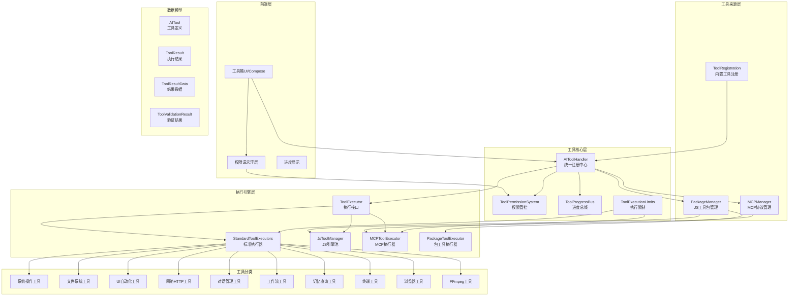
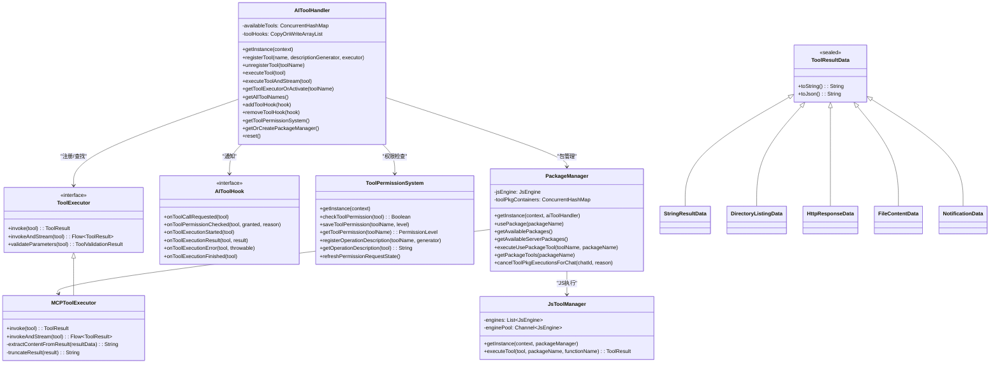
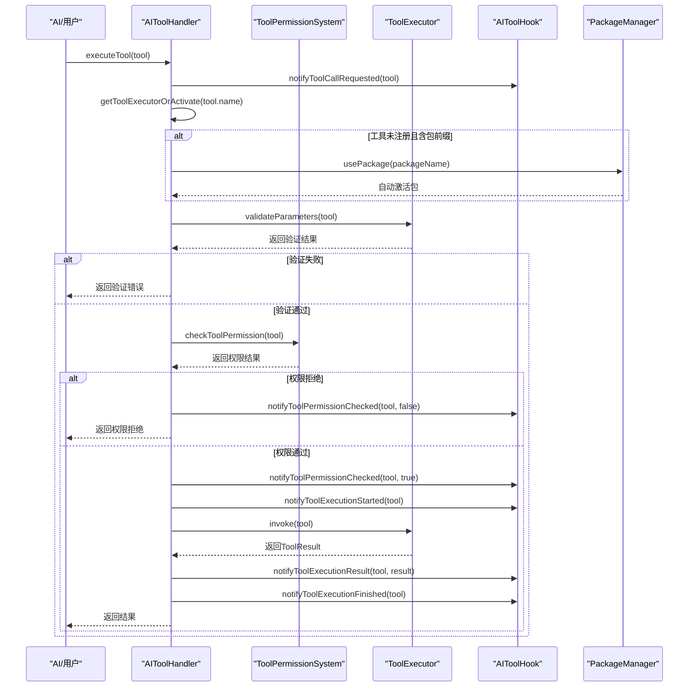
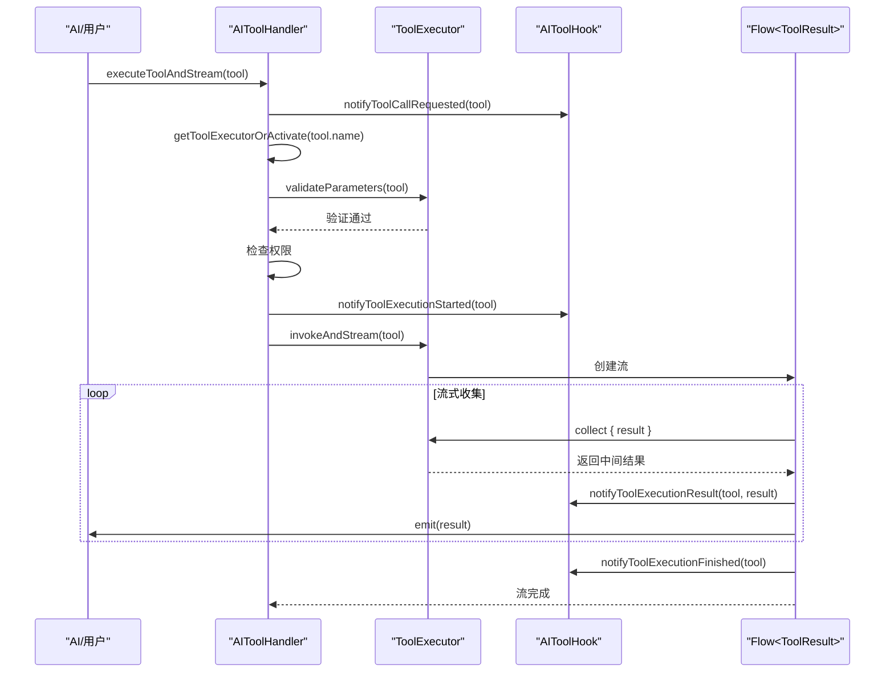
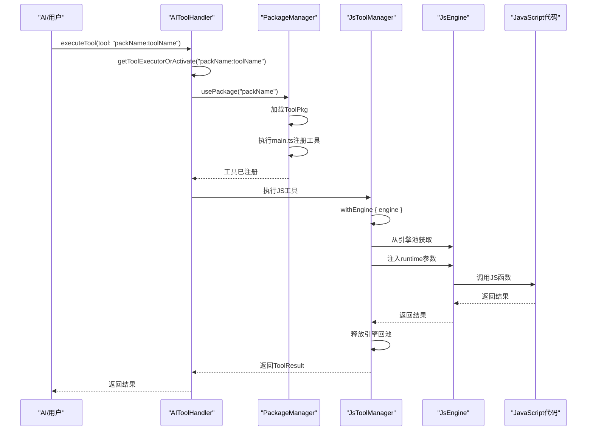
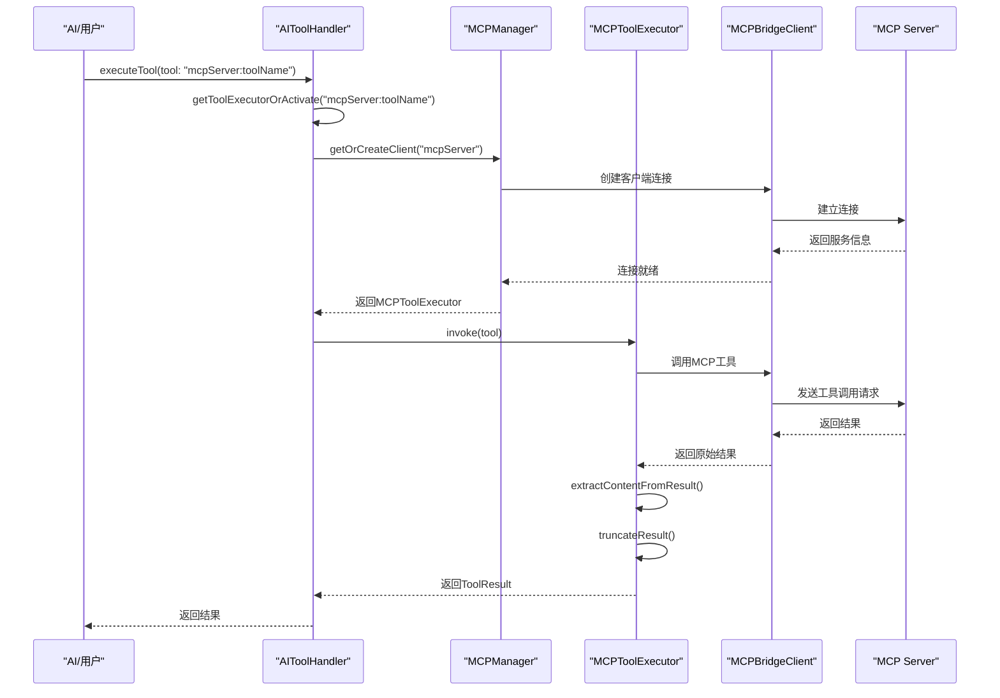
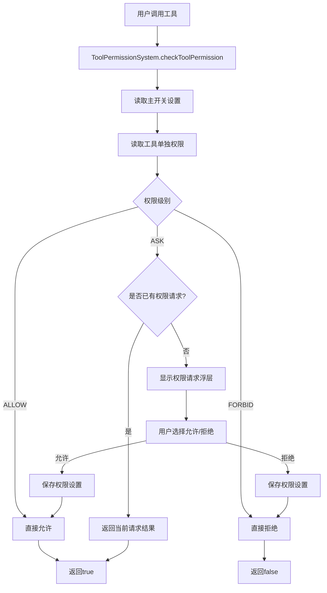
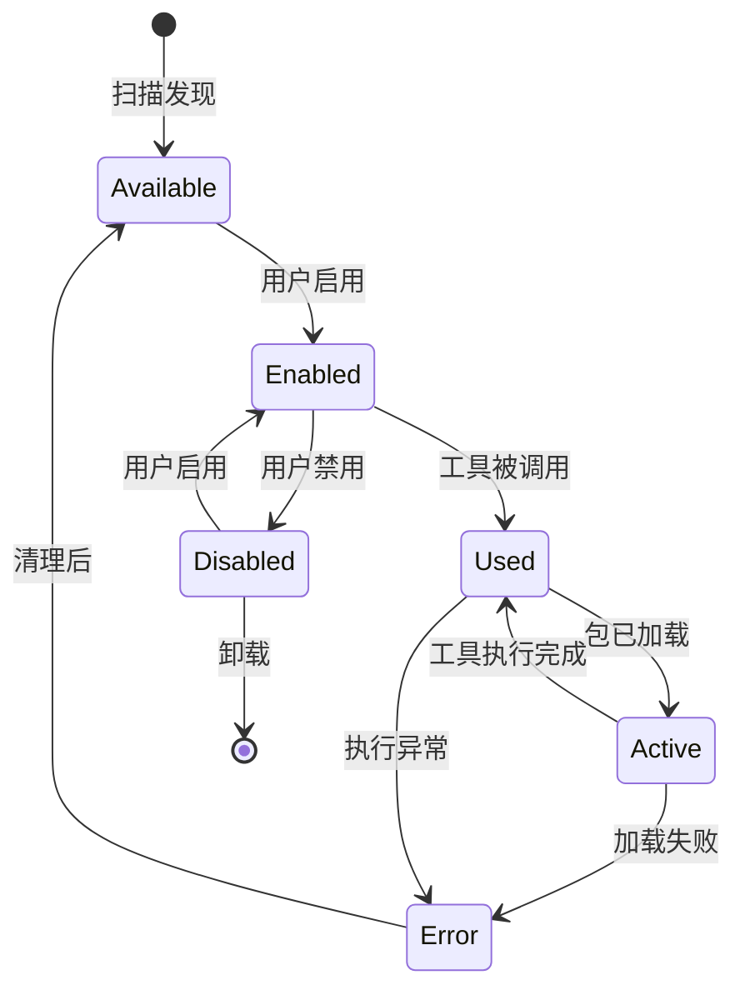

# Operit 工具系统设计思想与详细流程分析

## 一、设计思想概述

Operit 的工具系统采用**"统一注册中心 + 多源扩展 + 权限管控 + 流式执行"**的架构设计，核心设计思想包括：

1. **统一工具注册中心**：`AIToolHandler` 作为单例对象，集中管理所有工具的注册、发现和执行，提供一致的调用接口
2. **多源工具扩展**：支持内置工具（Kotlin）、JS 工具包（ToolPkg）、MCP 协议工具三种来源，通过统一接口无缝集成
3. **自动包激活**：工具名称使用 `packName:toolName` 格式时，自动激活对应工具包，实现按需加载
4. **权限分级管控**：`ToolPermissionSystem` 提供 ALLOW/ASK/FORBID 三级权限，支持全局主开关和单工具覆盖
5. **流式执行支持**：`ToolExecutor` 接口同时支持同步执行和流式执行，满足实时输出需求
6. **生命周期钩子**：`AIToolHook` 提供工具调用全生命周期的观察能力，支持日志、统计、监控等扩展
7. **结果数据标准化**：`ToolResultData` 密封类体系提供丰富的结构化结果类型，统一输出格式
8. **执行限制保护**：`ToolExecutionLimits` 定义文件读取、结果长度等上限，防止资源滥用

---

## 二、软件架构图

### 2.1 整体架构分层



### 2.2 核心组件类图



---

## 三、数据模型设计

### 3.1 核心数据类关系

```mermaid
erDiagram
    AITOOL["AITool"] ||--o{ TOOLPARAM["ToolParameter"] : "包含"
    AITOOL ||--|| TOOLRESULT["ToolResult"] : "产生"
    TOOLRESULT ||--|| TOOLRESULTDATA["ToolResultData"] : "包含"
    TOOLRESULTDATA ||--o{ FILEENTRY["FileEntry"] : "包含"
    
    AITOOL {
        string name
        string description
        list parameters
    }
    
    TOOLPARAM {
        string name
        string value
        string type
        boolean required
    }
    
    TOOLRESULT {
        string toolName
        boolean success
        ToolResultData result
        string error
    }
    
    TOOLRESULTDATA {
        string __type
    }
    
    FILEENTRY {
        string name
        boolean isDirectory
        long size
        string permissions
        string lastModified
    }
```

### 3.2 ToolResultData 类型体系

| 类型 | 用途 | 关键字段 |
|------|------|----------|
| `StringResultData` | 通用文本结果 | value |
| `BooleanResultData` | 布尔结果 | value |
| `IntResultData` | 整数结果 | value |
| `BinaryResultData` | 二进制数据 | value: ByteArray |
| `SleepResultData` | 休眠结果 | requestedMs, sleptMs |
| `DirectoryListingData` | 目录列表 | path, entries: List<FileEntry>, env |
| `FileContentData` | 文件内容 | path, content, size, env |
| `BinaryFileContentData` | 二进制文件 | path, contentBase64, size, env |
| `FileInfoData` | 文件信息 | path, exists, fileType, size, permissions, owner, env |
| `FileOperationData` | 文件操作 | operation, env, path, successful, details |
| `FileApplyResultData` | 文件应用 | operation, aiDiffInstructions, diffContent |
| `FilePartContentData` | 分段读取 | path, content, partIndex, totalParts, startLine, endLine |
| `HttpResponseData` | HTTP响应 | url, statusCode, headers, content, cookies |
| `HttpStreamEventData` | HTTP流事件 | type, url, chunk, chunkIndex |
| `ADBResultData` | ADB结果 | command, output, exitCode |
| `TerminalCommandResultData` | 终端命令 | command, output, exitCode, sessionId, timedOut |
| `TerminalStreamEventData` | 终端流事件 | type, command, sessionId, chunk |
| `HiddenTerminalCommandResultData` | 隐藏终端 | command, output, exitCode, executorKey |
| `CalculationResultData` | 计算结果 | expression, result, formattedResult, variables |
| `DateResultData` | 日期结果 | date, format, formattedDate |
| `ConnectionResultData` | 连接结果 | connectionId, isActive |
| `FileExistsData` | 文件存在 | path, exists, isDirectory, size, env |
| `FindFilesResultData` | 文件查找 | path, pattern, files, env |
| `GrepResultData` | Grep搜索 | searchPath, pattern, matches, totalMatches, env |
| `SystemSettingData` | 系统设置 | namespace, setting, value |
| `AppOperationData` | 应用操作 | operationType, packageName, success, details |
| `AppListData` | 应用列表 | includesSystemApps, packages |
| `AppUsageTimeResultData` | 应用使用时长 | startTime, endTime, sinceHours, entries |
| `NotificationData` | 通知数据 | notifications: List<Notification> |
| `LocationData` | 位置数据 | latitude, longitude, accuracy, provider, address |
| `UIPageResultData` | UI页面信息 | packageName, activityName, uiElements |
| `UIActionResultData` | UI操作 | actionType, actionDescription, coordinates |
| `CombinedOperationResultData` | 组合操作 | operationSummary, waitTime, pageInfo |
| `DeviceInfoResultData` | 设备信息 | deviceId, model, androidVersion, batteryLevel |
| `VisitWebResultData` | 网页访问 | url, title, content, links, imageLinks |
| `IntentResultData` | Intent执行 | action, uri, package_name, component, result |
| `FFmpegResultData` | FFmpeg处理 | command, returnCode, output, duration, mediaInfo |
| `MemoryQueryResultData` | 记忆查询 | memories: List<MemoryInfo>, snapshotId |
| `MemoryLinkResultData` | 记忆链接 | sourceTitle, targetTitle, linkType, weight |
| `MemoryLinkQueryResultData` | 链接查询 | totalCount, links: List<LinkInfo> |
| `SandboxScriptExecutionResultData` | 沙箱脚本 | success, scriptPath, durationMs, result, error |
| `EnvironmentVariableReadResultData` | 环境变量读取 | key, value, exists |
| `EnvironmentVariableWriteResultData` | 环境变量写入 | key, requestedValue, value, exists, cleared |
| `SandboxPackagesResultData` | 沙箱包列表 | totalCount, enabledCount, packages |
| `SandboxPackageUpdateResultData` | 包状态更新 | packageName, requestedEnabled, currentEnabled |
| `McpRestartWithLogsResultData` | MCP重启日志 | timeoutMs, pluginsTotal, successCount, failedCount |
| `ScriptExecutionTraceData` | 脚本执行追踪 | kind, level, message, callId |
| `WorkflowResultData` | 工作流信息 | id, name, enabled, nodeCount, totalExecutions |
| `WorkflowListResultData` | 工作流列表 | workflows: List<WorkflowResultData>, totalCount |
| `WorkflowDetailResultData` | 工作流详情 | nodes, connections, enabled, totalExecutions |
| `ChatServiceStartResultData` | 对话服务启动 | isConnected, connectionTime |
| `ChatCreationResultData` | 新建对话 | chatId, createdAt |
| `ChatListResultData` | 对话列表 | totalCount, currentChatId, chats |
| `ChatFindResultData` | 查找对话 | matchedCount, chat |
| `AgentStatusResultData` | 代理状态 | chatId, state, isIdle, isProcessing |
| `ChatSwitchResultData` | 切换对话 | chatId, chatTitle, switchedAt |
| `ChatTitleUpdateResultData` | 更新标题 | chatId, title, updatedAt |
| `ChatDeleteResultData` | 删除对话 | chatId, deletedAt |
| `ChatMessagesResultData` | 对话消息 | chatId, order, limit, messages |
| `CharacterCardListResultData` | 角色卡列表 | totalCount, cards |
| `MessageSendResultData` | 发送消息 | chatId, message, aiResponse, sentAt |
| `MessageSendStreamEventData` | 消息流事件 | type, chatId, message, chunk |
| `TerminalSessionCreationResultData` | 终端会话创建 | sessionId, sessionName, isNewSession |
| `TerminalSessionCloseResultData` | 终端会话关闭 | sessionId, success, message |
| `TerminalSessionScreenResultData` | 终端屏幕 | sessionId, rows, cols, content, commandRunning |
| `SpeechServicesConfigResultData` | 语音配置 | ttsServiceType, ttsHttpConfig, sttServiceType |
| `SpeechServicesUpdateResultData` | 语音更新 | updated, changedFields, ttsServiceType |
| `SpeechServicesTtsPlaybackTestResultData` | TTS测试 | ttsServiceType, initialized, playbackTriggered |
| `ModelConfigsResultData` | 模型配置列表 | totalConfigCount, configs, functionMappings |
| `ModelConfigCreateResultData` | 创建配置 | created, config, changedFields |
| `ModelConfigUpdateResultData` | 更新配置 | updated, config, changedFields, affectedFunctions |
| `ModelConfigDeleteResultData` | 删除配置 | deleted, configId, affectedFunctions |
| `FunctionModelConfigsResultData` | 功能绑定列表 | defaultConfigId, mappings |
| `FunctionModelConfigResultData` | 功能绑定详情 | functionType, configId, configName, modelIndex |
| `FunctionModelBindingResultData` | 设置绑定 | functionType, configId, modelIndex, selectedModel |
| `ModelConfigConnectionTestResultData` | 连接测试 | configId, success, passedTests, totalTests |
| `AutomationConfigSearchResult` | 自动化配置搜索 | searchPackageName, foundConfigs, totalFound |
| `AutomationPlanParametersResult` | 自动化参数 | functionName, requiredParameters, planSteps |
| `AutomationExecutionResult` | 自动化执行 | functionName, executionSuccess, executionSteps |
| `AutomationFunctionListResult` | 自动化功能列表 | packageName, functions, totalCount |
| `ComputerDesktopActionResultData` | 桌面操作 | action, target, resultSummary, tabs, pageContent |

---

## 四、工具执行详细流程

### 4.1 工具执行主流程



### 4.2 流式工具执行流程



### 4.3 JS 工具包执行流程



### 4.4 MCP 工具执行流程



### 4.5 权限检查流程



### 4.6 工具包生命周期状态机



---

## 五、核心机制详解

### 5.1 工具注册机制（AIToolHandler）

```kotlin
class AIToolHandler private constructor(private val context: Context) {
    private val availableTools = ConcurrentHashMap<String, ToolExecutor>()
    private val toolHooks = CopyOnWriteArrayList<AIToolHook>()
    
    fun registerTool(
        name: String,
        descriptionGenerator: ((AITool) -> String)? = null,
        executor: ToolExecutor
    ) {
        availableTools[name] = executor
        descriptionGenerator?.let {
            toolPermissionSystem.registerOperationDescription(name, it)
        }
    }
    
    fun getToolExecutorOrActivate(toolName: String): ToolExecutor? {
        var executor = availableTools[toolName]
        
        // 自动注册默认工具
        if (executor == null && !defaultToolsRegistered.get()) {
            registerDefaultTools()
            executor = availableTools[toolName]
        }
        
        // 自动激活包工具
        if (executor == null && toolName.contains(':')) {
            val packageName = toolName.substringBefore(':')
            val packageManager = getOrCreatePackageManager()
            if (packageManager.getAvailablePackages().containsKey(packageName)) {
                packageManager.usePackage(packageName)
                executor = availableTools[toolName]
            }
        }
        
        return executor
    }
}
```

**关键设计**：
- **ConcurrentHashMap**：线程安全的工具注册表
- **懒加载默认工具**：首次查找时自动注册所有内置工具
- **自动包激活**：`packName:toolName` 格式自动触发包加载
- **双重检查锁定**：`registerDefaultTools` 使用原子标志+同步块确保线程安全

### 5.2 工具执行接口（ToolExecutor）

```kotlin
interface ToolExecutor {
    fun invoke(tool: AITool): ToolResult
    
    fun invokeAndStream(tool: AITool): Flow<ToolResult> = flowOf(invoke(tool))
    
    fun validateParameters(tool: AITool): ToolValidationResult {
        return ToolValidationResult(valid = true)
    }
}
```

**设计要点**：
- **默认流式实现**：基于同步调用包装为单元素 Flow
- **可选参数验证**：默认通过，具体工具可覆盖
- **函数式注册支持**：`registerTool` 提供 lambda 重载

### 5.3 JS 引擎池（JsToolManager）

```kotlin
class JsToolManager private constructor(context: Context, packageManager: PackageManager) {
    private val engines = List(MAX_CONCURRENT_ENGINES) { JsEngine(context) }
    private val enginePool = Channel<JsEngine>(capacity = MAX_CONCURRENT_ENGINES)
    
    private suspend fun <T> withEngine(block: suspend (JsEngine) -> T): T {
        val engine = enginePool.receive()
        return try {
            block(engine)
        } finally {
            enginePool.trySend(engine)
        }
    }
}
```

**关键设计**：
- **引擎池复用**：最多 4 个 JsEngine 实例循环使用
- **Channel 同步**：使用 Kotlin Channel 实现生产者-消费者模式
- **自动参数转换**：支持 number/integer/boolean/array/object 类型转换
- **运行时参数注入**：自动注入 `__operit_package_*` 等上下文参数

### 5.4 MCP 工具执行（MCPToolExecutor）

```kotlin
class MCPToolExecutor(private val context: Context, private val mcpManager: MCPManager) : ToolExecutor {
    
    private fun extractContentFromResult(resultData: JSONObject?): String {
        val contentArray = resultData?.optJSONArray("content")
        val extractedText = StringBuilder()
        
        for (i in 0 until contentArray.length()) {
            val contentItem = contentArray.optJSONObject(i)
            when (contentItem.optString("type", "text")) {
                "text" -> extractedText.append(contentItem.optString("text", ""))
                "image" -> {
                    val data = contentItem.optString("data", "")
                    val imageId = ImagePoolManager.addImageFromBase64(data, mimeType)
                    extractedText.append("<link type=\"image\" id=\"$imageId\"></link>")
                }
                "resource" -> {
                    // 处理资源类型
                }
            }
        }
        return extractedText.toString()
    }
    
    private suspend fun truncateResult(result: String): String {
        val maxResultLength = ToolExecutionLimits.MAX_TEXT_RESULT_LENGTH
        if (result.length <= maxResultLength) return result
        return result.substring(0, maxResultLength) + 
            "\n\n[... Result too long, truncated ${result.length - maxResultLength} characters]"
    }
}
```

**关键设计**：
- **MCP 协议适配**：解析 content 数组，支持 text/image/resource 类型
- **图片内联**：Base64 图片转换为 `<link>` 标签
- **结果截断**：超过 5000 字符自动截断
- **JSON 智能格式化**：自动检测并格式化 JSON 字符串

### 5.5 权限系统（ToolPermissionSystem）

```kotlin
class ToolPermissionSystem private constructor(private val context: Context) {
    private val toolPermissionsDataStore: DataStore<Preferences>
    
    suspend fun checkToolPermission(tool: AITool): Boolean {
        val masterSwitch = getMasterSwitch()
        val overrideLevel = getToolPermissionOverride(tool.name)
        val permissionLevel = overrideLevel ?: masterSwitch
        
        return when (permissionLevel) {
            PermissionLevel.ALLOW -> true
            PermissionLevel.FORBID -> false
            PermissionLevel.ASK -> requestPermission(tool)
        }
    }
    
    private suspend fun requestPermission(tool: AITool): Boolean {
        return suspendCancellableCoroutine { continuation ->
            currentPermissionCallback = { result ->
                continuation.resume(result.granted)
            }
            // 显示权限请求浮层
            permissionRequestOverlay.show(tool, getOperationDescription(tool))
        }
    }
}
```

**关键设计**：
- **三级权限**：ALLOW（自动允许）、ASK（每次询问）、FORBID（禁止）
- **主开关+覆盖**：支持全局设置和单工具覆盖
- **DataStore 持久化**：使用 Android DataStore 存储权限设置
- **超时机制**：权限请求 60 秒超时
- **Compose 浮层**：权限请求使用 Compose 浮层 UI

### 5.6 进度总线（ToolProgressBus）

```kotlin
object ToolProgressBus {
    private val _progress = MutableStateFlow<ToolProgressEvent?>(null)
    val progress: StateFlow<ToolProgressEvent?> = _progress.asStateFlow()
    
    fun update(toolName: String, progress: Float, message: String = "") {
        val next = ToolProgressEvent(toolName, progress, message, priorityForTool(toolName))
        val current = _progress.value
        val shouldReplace = current == null ||
            current.toolName == next.toolName ||
            current.progress >= 1f ||
            next.priority > current.priority ||
            (next.priority == current.priority && next.level >= current.level)
        
        if (shouldReplace) {
            _progress.value = next
        }
    }
}
```

**关键设计**：
- **优先级队列**：不同工具有不同优先级（summary > grep_context > grep_code > find_files）
- **状态流**：使用 StateFlow 实现响应式进度更新
- **智能替换**：高优先级或同工具新进度可替换当前显示

### 5.7 执行限制（ToolExecutionLimits）

```kotlin
object ToolExecutionLimits {
    const val MAX_FILE_READ_BYTES = 32_000
    const val DEFAULT_FILE_READ_PART_LINES = 200
    const val MAX_TEXT_RESULT_LENGTH = 5_000
    const val MAX_FINAL_TOOL_RESULT_MESSAGE_CHARS = MAX_FILE_READ_BYTES * 2
}
```

**保护策略**：
- **文件读取限制**：单次最多 32KB
- **分段读取**：默认 200 行/段
- **结果截断**：文本结果最多 5000 字符
- **消息长度限制**：最终工具结果消息最多 64KB

---

## 六、工具分类与职责

### 6.1 内置工具分类

| 分类 | 工具数量 | 代表工具 | 执行器 |
|------|----------|----------|--------|
| 系统操作 | 15+ | toast, send_notification, modify_system_setting, install_app, uninstall_app, list_installed_apps, start_app, stop_app, get_notifications, get_app_usage_time, get_device_location | SystemOperationTools |
| 文件系统 | 20+ | list_files, read_file, read_file_part, read_file_full, read_file_binary, write_file, write_file_binary, delete_file, move_file, copy_file, make_directory, find_files, file_info, file_exists, zip_files, unzip_files, open_file, share_file, grep_code, grep_context, download_file, apply_file | FileSystemTools |
| UI自动化 | 12+ | click_element, tap, long_press, get_page_info, capture_screenshot, run_ui_subagent, set_input_text, press_key, swipe | UITools |
| 终端 | 8+ | create_terminal_session, execute_in_terminal_session, execute_in_terminal_session_streaming, execute_hidden_terminal_command, close_terminal_session, input_in_terminal_session, get_terminal_session_screen | TerminalCommandExecutor |
| 网络 | 4+ | http_request, multipart_request, manage_cookies, visit_web | HttpTools |
| 浏览器 | 20+ | browser_click, browser_close, browser_navigate, browser_snapshot, browser_take_screenshot, browser_type, browser_evaluate, browser_fill_form | BrowserSessionTools |
| 对话管理 | 15+ | start_chat_service, stop_chat_service, create_new_chat, list_chats, find_chat, switch_chat, send_message_to_ai, send_message_to_ai_streaming | ChatManagerTool |
| 工作流 | 8+ | get_all_workflows, create_workflow, get_workflow, update_workflow, patch_workflow, enable_workflow, disable_workflow, delete_workflow, trigger_workflow | WorkflowTools |
| 记忆 | 10+ | query_memory, get_memory_by_title, create_memory, update_memory, delete_memory, move_memory, link_memories, query_memory_links | MemoryQueryToolExecutor |
| 设置 | 15+ | read_environment_variable, write_environment_variable, list_sandbox_packages, set_sandbox_package_enabled, list_model_configs, create_model_config, update_model_config | SoftwareSettingsModifyTools |
| 其他 | 10+ | calculate, sleep, execute_intent, send_broadcast, device_info, trigger_tasker_event, ffmpeg_execute, ffmpeg_info, ffmpeg_convert | 各类执行器 |

### 6.2 工具包（ToolPkg）扩展点

```typescript
// toolpkg.d.ts 定义的注册接口
ToolPkg.registerToolboxUiModule(definition)
ToolPkg.registerUiRoute(definition)
ToolPkg.registerNavigationEntry(definition)
ToolPkg.registerDesktopWidget(definition)
ToolPkg.registerAppLifecycleHook(definition)
ToolPkg.registerMessageProcessingPlugin(definition)
ToolPkg.registerXmlRenderPlugin(definition)
ToolPkg.registerInputMenuTogglePlugin(definition)
ToolPkg.registerToolLifecycleHook(definition)
ToolPkg.registerPromptInputHook(definition)
ToolPkg.registerPromptHistoryHook(definition)
ToolPkg.registerSystemPromptComposeHook(definition)
ToolPkg.registerToolPromptComposeHook(definition)
ToolPkg.registerPromptFinalizeHook(definition)
ToolPkg.registerSummaryGenerateHook(definition)
```

---

## 七、关键文件索引

| 文件路径 | 职责 |
|----------|------|
| `app/src/main/java/com/ai/assistance/operit/core/tools/AIToolHandler.kt` | 工具统一注册中心，执行入口 |
| `app/src/main/java/com/ai/assistance/operit/core/tools/ToolRegistration.kt` | 内置工具集中注册（100+工具） |
| `app/src/main/java/com/ai/assistance/operit/core/tools/ToolExecutor.kt` | 工具执行接口定义 |
| `app/src/main/java/com/ai/assistance/operit/core/tools/AIToolHook.kt` | 工具生命周期钩子接口 |
| `app/src/main/java/com/ai/assistance/operit/core/tools/ToolResultDataClasses.kt` | 工具结果数据类（60+类型） |
| `app/src/main/java/com/ai/assistance/operit/core/tools/ToolExecutionLimits.kt` | 执行限制常量 |
| `app/src/main/java/com/ai/assistance/operit/core/tools/ToolProgressBus.kt` | 进度总线 |
| `app/src/main/java/com/ai/assistance/operit/core/tools/packTool/PackageManager.kt` | JS工具包管理器 |
| `app/src/main/java/com/ai/assistance/operit/core/tools/javascript/JsToolManager.kt` | JS引擎池管理器 |
| `app/src/main/java/com/ai/assistance/operit/core/tools/javascript/JsEngine.kt` | JavaScript执行引擎 |
| `app/src/main/java/com/ai/assistance/operit/core/tools/mcp/MCPToolExecutor.kt` | MCP协议工具执行器 |
| `app/src/main/java/com/ai/assistance/operit/core/tools/mcp/MCPManager.kt` | MCP连接管理器 |
| `app/src/main/java/com/ai/assistance/operit/ui/permissions/ToolPermissionSystem.kt` | 工具权限系统 |
| `app/src/main/java/com/ai/assistance/operit/ui/permissions/PermissionRequestOverlay.kt` | 权限请求浮层 |
| `app/src/main/java/com/ai/assistance/operit/core/tools/defaultTool/ToolGetter.kt` | 工具获取器/工厂 |
| `docs/package_dev/toolpkg.md` | 工具包开发文档 |
| `examples/types/toolpkg.d.ts` | ToolPkg类型定义 |

---

## 八、总结

Operit 的工具系统通过**统一抽象**和**多源扩展**，实现了以下核心能力：

1. **统一调用接口**：`AIToolHandler` 提供一致的工具注册、发现和执行接口，屏蔽底层差异
2. **多源工具支持**：内置 Kotlin 工具、JS ToolPkg 工具包、MCP 协议工具三种来源无缝集成
3. **自动包激活**：`packName:toolName` 格式自动触发包加载，实现按需激活
4. **流式执行**：`invokeAndStream` 接口支持实时流式输出，满足长任务需求
5. **权限管控**：三级权限+主开关+单工具覆盖，灵活且安全
6. **生命周期钩子**：6 个钩子点覆盖工具调用全生命周期，支持监控和扩展
7. **结果标准化**：60+ 种 `ToolResultData` 子类提供丰富的结构化输出
8. **资源保护**：执行限制防止文件读取、结果长度等资源滥用
9. **JS 引擎池**：4 引擎池化复用，避免频繁创建销毁
10. **MCP 协议适配**：完整支持 MCP 的 text/image/resource 内容类型

整个系统的设计充分体现了**"开放扩展、封闭修改"**的原则，通过 `ToolExecutor` 接口统一抽象，支持任意来源的工具接入，同时保持核心调用流程的稳定和一致。
